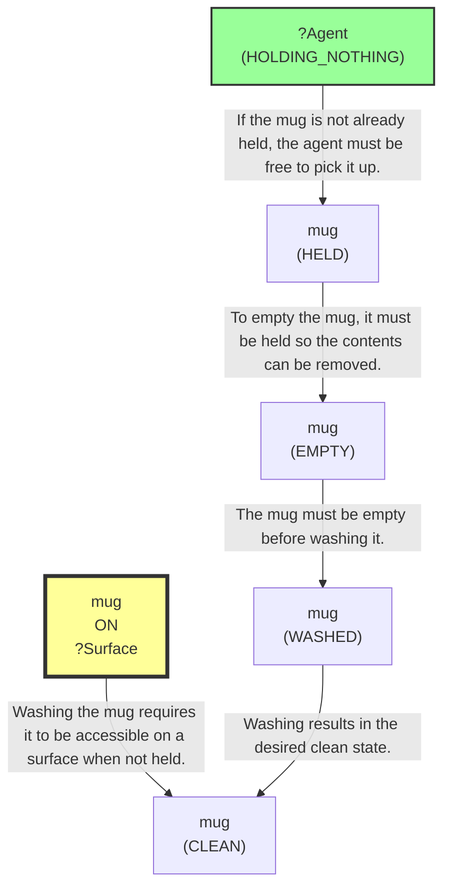
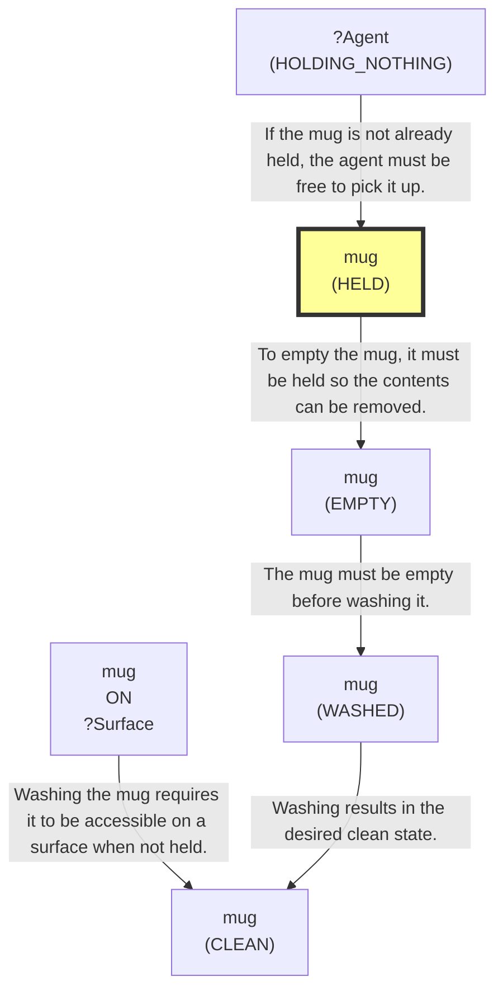
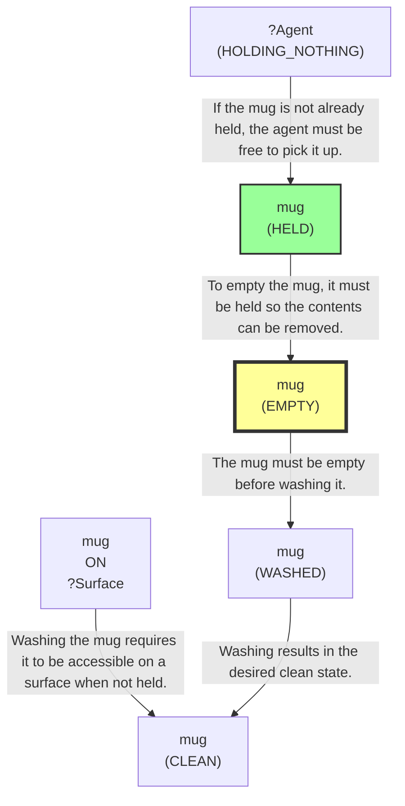
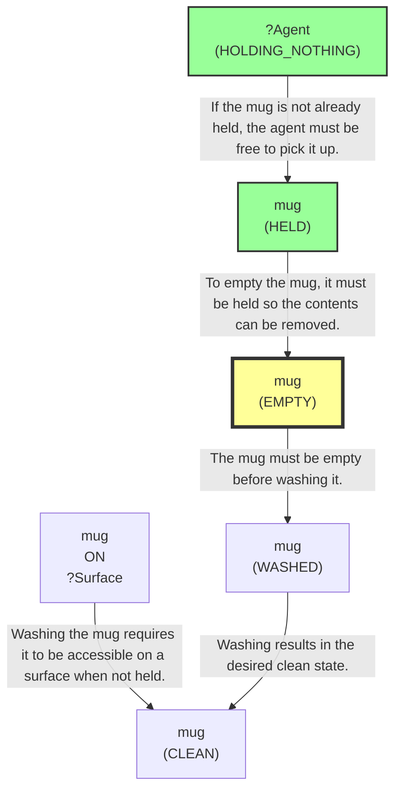
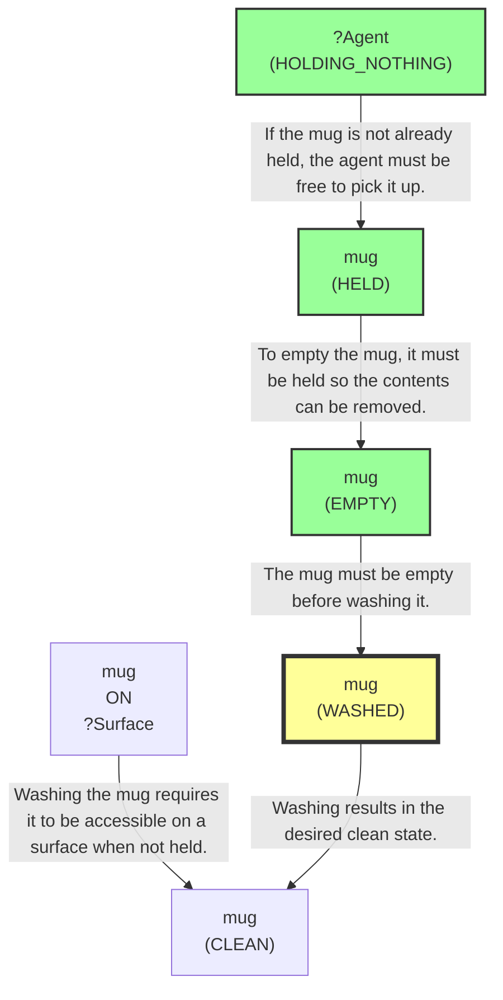

# 🚀 VirtualHome Agent Episode Log


### [GoalReasoner (Module A - Intent)] Output
```json
{
  "is_instruction_obviously_vague": false,
  "clarification_question": null,
  "target_object": "mug",
  "location_hint": null,
  "reasoning_chain": [
    {
      "question": "Why does the user want this object?",
      "answer": "To have the mug emptied if it contains anything and then cleaned."
    },
    {
      "question": "Why is that important?",
      "answer": "To remove any leftover contents and residue from the mug."
    },
    {
      "question": "What fundamental need does this fulfill?",
      "answer": "To restore a drinking vessel to a clean, usable state."
    },
    {
      "question": "Are there any deeper psychological or physical motivations?",
      "answer": "The likely motivation is cleanliness, hygiene, and readiness for future use."
    }
  ],
  "deep_intent": "The user wants to restore a drinking vessel to a clean, usable state.",
  "acceptable_alternatives_properties": [
    {
      "priority": 1,
      "description": "Other similar drinking containers, such as a cup or glass, that can be emptied and washed."
    },
    {
      "priority": 2,
      "description": "Other kitchen drinkware items, such as a tumbler or bowl-shaped container, that can be cleaned in the same way."
    },
    {
      "priority": 3,
      "description": "Any washable household container that holds liquid residue and needs to be emptied and cleaned."
    },
    {
      "priority": 4,
      "description": "Another clean container that can serve the same practical purpose of holding a drink."
    }
  ]
}
```

### [PerceptionFilter] Output
```json
{
  "reasoning": "Need the target mug and the physical tools/appliances required to empty and wash it. Since washing can be done with either sink or dishwasher, and cleaning may require dishwashing liquid and a sponge, these are retained as necessary options. The mug must also be on a surface when not held, but no specific surface is required beyond available countertop/table if needed, so only the relevant cleaning objects are kept.",
  "selected_classes": [
    "character",
    "mug",
    "washingsponge",
    "dishwasher",
    "sink",
    "dishwashingliquid"
  ],
  "raw_class_count": 66
}
```

### [LLMExecutor] Output
```json
{
  "reasoning": "The mug needs to end up empty and clean. No object is currently held, so the next prerequisite is to move to a specific mug before grabbing it. I will bind the target to mug(119) as a valid candidate in the kitchen and start by approaching it; this is necessary before any grab or wash actions.",
  "satisfied_nodes": [
    "N6"
  ],
  "current_node_focus": "N2",
  "mapped_variables": {
    "?Surface": "sink(90)"
  },
  "action": "[walk] <mug> (119)"
}
```

### [RoboStateMultiTaskController] Output
```json
{
  "action": "[walk] <mug> (119)",
  "active_task_id": "task_1",
  "task_context": {
    "active_task_id": "task_1",
    "pending_task_ids": [],
    "satisfied_task_ids": []
  },
  "source": "llm_executor"
}
```
## Step 0
- **Action**: `[walk] <mug> (119)`
- **Action Success**: `True`
- **Action Message**: {'0': {'message': 'Success'}}
- **Active Task**: `task_1`
- **Decision Source**: `llm_executor`
- **Task Progress**: T3_without_path_merging_P3_20=pending
- **SDG Status**:

- **Observed Items (12)**: sink(90), dishwasher(104) [CLOSED,OFF], washingsponge(111), dishwashingliquid(112), mug(119), mug(155), mug(118), character(1), kitchen(11), bathroom(172), bedroom(211), livingroom(268)


### [PerceptionFilter] Output
```json
{
  "reasoning": "Reused cached class selection.",
  "selected_classes": [
    "character",
    "mug",
    "washingsponge",
    "dishwasher",
    "sink",
    "dishwashingliquid"
  ],
  "raw_class_count": 66
}
```

### [LLMExecutor] Output
```json
{
  "reasoning": "The active task is to restore a mug to a clean, usable state. The currently selected mug(119) is already close to the character, but the SDG requires it to be EMPTY before it can be washed, and there is no evidence yet that it is empty or clean. Since washing requires the mug to be held and near a washer, the next progress step is to grab the nearby mug first. This also moves toward satisfying N4 before N3/N5.",
  "satisfied_nodes": [],
  "current_node_focus": "N4",
  "mapped_variables": {
    "?Surface": "sink(90)"
  },
  "action": "[grab] <mug> (119)"
}
```

### [RoboStateMultiTaskController] Output
```json
{
  "action": "[grab] <mug> (119)",
  "active_task_id": "task_1",
  "task_context": {
    "active_task_id": "task_1",
    "pending_task_ids": [],
    "satisfied_task_ids": []
  },
  "source": "llm_executor"
}
```
## Step 1
- **Action**: `[grab] <mug> (119)`
- **Action Success**: `True`
- **Action Message**: {'0': {'message': 'Success'}}
- **Active Task**: `task_1`
- **Decision Source**: `llm_executor`
- **Task Progress**: T3_without_path_merging_P3_20=pending
- **SDG Status**:

- **Observed Items (12)**: sink(90), dishwasher(104) [CLOSED,OFF], washingsponge(111), dishwashingliquid(112), mug(119), mug(155), mug(118), character(1), kitchen(11), bathroom(172), bedroom(211), livingroom(268)


### [PerceptionFilter] Output
```json
{
  "reasoning": "Reused cached class selection.",
  "selected_classes": [
    "character",
    "mug",
    "washingsponge",
    "dishwasher",
    "sink",
    "dishwashingliquid"
  ],
  "raw_class_count": 66
}
```

### [LLMExecutor] Output
```json
{
  "reasoning": "The target mug(119) is already held, so N4 is satisfied. The remaining required progression is to empty the mug before washing it. Since the mug is a POURABLE recipient and the sink(90) is the appropriate destination for emptying liquid, the next step should be to walk to the sink so that a subsequent pour into the sink can be performed. This also keeps the mug accessible for the later wash step.",
  "satisfied_nodes": [
    "N4"
  ],
  "current_node_focus": "N3",
  "mapped_variables": {
    "?Surface": "sink(90)"
  },
  "action": "[walk] <sink> (90)"
}
```

### [RoboStateMultiTaskController] Output
```json
{
  "action": "[walk] <sink> (90)",
  "active_task_id": "task_1",
  "task_context": {
    "active_task_id": "task_1",
    "pending_task_ids": [],
    "satisfied_task_ids": []
  },
  "source": "llm_executor"
}
```
## Step 2
- **Action**: `[walk] <sink> (90)`
- **Action Success**: `True`
- **Action Message**: {'0': {'message': 'Success'}}
- **Active Task**: `task_1`
- **Decision Source**: `llm_executor`
- **Task Progress**: T3_without_path_merging_P3_20=pending
- **SDG Status**:

- **Observed Items (12)**: sink(90), dishwasher(104) [CLOSED,OFF], washingsponge(111), dishwashingliquid(112), mug(119), mug(155), mug(118), character(1), kitchen(11), bathroom(172), bedroom(211), livingroom(268)


### [PerceptionFilter] Output
```json
{
  "reasoning": "Reused cached class selection.",
  "selected_classes": [
    "character",
    "mug",
    "washingsponge",
    "dishwasher",
    "sink",
    "dishwashingliquid"
  ],
  "raw_class_count": 66
}
```

### [LLMExecutor] Output
```json
{
  "reasoning": "The mug is already held in the right hand and we are already close to the sink. To satisfy the EMPTY prerequisite before washing, the next step is to pour out its contents into the sink. This also keeps the mug available for the subsequent wash action.",
  "satisfied_nodes": [
    "N4",
    "N6"
  ],
  "current_node_focus": "N3",
  "mapped_variables": {
    "?Surface": "sink(90)"
  },
  "action": "[pour] <mug> (119) <sink> (90)"
}
```

### [RoboStateMultiTaskController] Output
```json
{
  "action": "[pour] <mug> (119) <sink> (90)",
  "active_task_id": "task_1",
  "task_context": {
    "active_task_id": "task_1",
    "pending_task_ids": [],
    "satisfied_task_ids": []
  },
  "source": "llm_executor"
}
```
## Step 3
- **Action**: `[pour] <mug> (119) <sink> (90)`
- **Action Success**: `False`
- **Action Message**: Failed: Source is already empty or has no liquid.
- **Active Task**: `task_1`
- **Decision Source**: `llm_executor`
- **Task Progress**: T3_without_path_merging_P3_20=pending
- **SDG Status**:

- **Observed Items (12)**: sink(90), dishwasher(104) [CLOSED,OFF], washingsponge(111), dishwashingliquid(112), mug(119), mug(155), mug(118), character(1), kitchen(11), bathroom(172), bedroom(211), livingroom(268)


### [PerceptionFilter] Output
```json
{
  "reasoning": "Reused cached class selection.",
  "selected_classes": [
    "character",
    "mug",
    "washingsponge",
    "dishwasher",
    "sink",
    "dishwashingliquid"
  ],
  "raw_class_count": 66
}
```

### [LLMExecutor] Output
```json
{
  "reasoning": "The mug is already held and the pour attempt failed because it is empty, so there is no liquid to remove. The next required step toward the goal is to wash the mug. I am already close to the sink, so I can wash it now.",
  "satisfied_nodes": [
    "N4",
    "N6",
    "N3"
  ],
  "current_node_focus": "N5",
  "mapped_variables": {
    "?Surface": "sink(90)"
  },
  "action": "[wash] <mug> (119)"
}
```

### [RoboStateMultiTaskController] Output
```json
{
  "action": "[wash] <mug> (119)",
  "active_task_id": "task_1",
  "task_context": {
    "active_task_id": "task_1",
    "pending_task_ids": [],
    "satisfied_task_ids": []
  },
  "source": "llm_executor"
}
```
## Step 4
- **Action**: `[wash] <mug> (119)`
- **Action Success**: `True`
- **Action Message**: Washed successfully.
- **Active Task**: `task_1`
- **Decision Source**: `llm_executor`
- **Task Progress**: T3_without_path_merging_P3_20=done
- **SDG Status**:

- **Observed Items (12)**: sink(90), dishwasher(104) [CLOSED,OFF], washingsponge(111), dishwashingliquid(112), mug(119), mug(155), mug(118), character(1), kitchen(11), bathroom(172), bedroom(211), livingroom(268)

