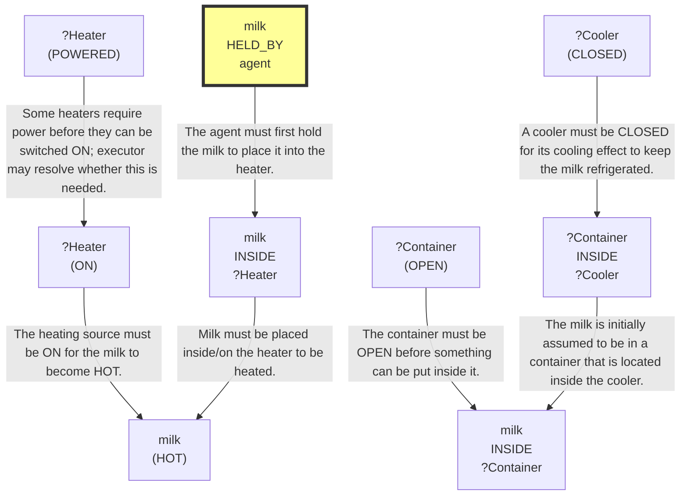
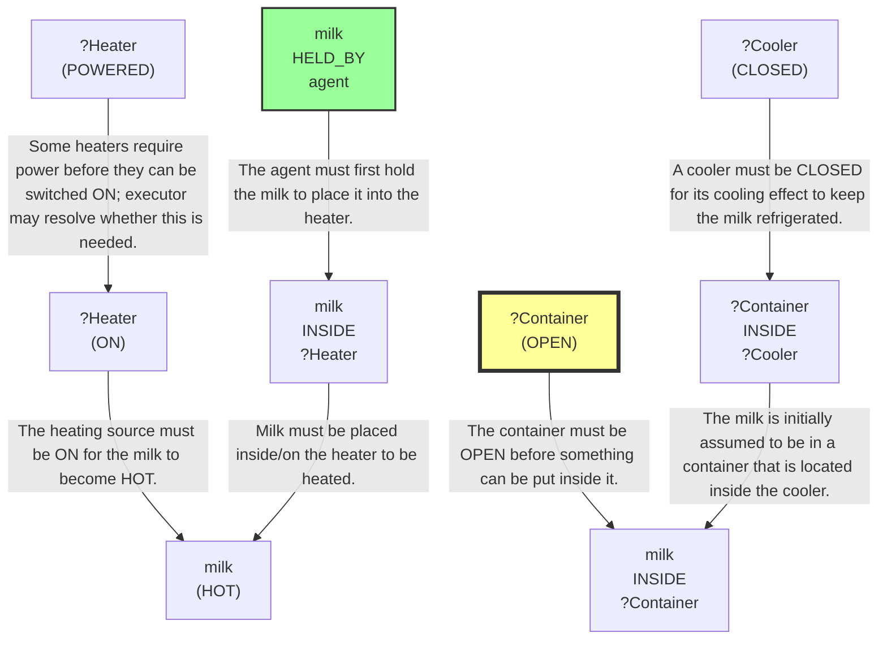
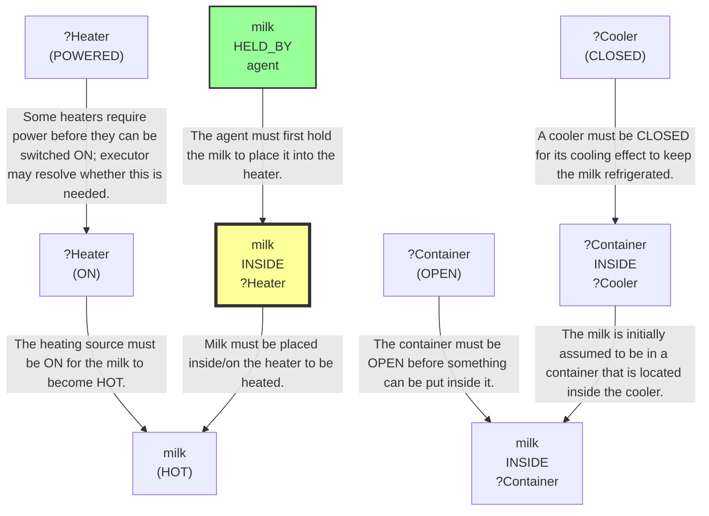
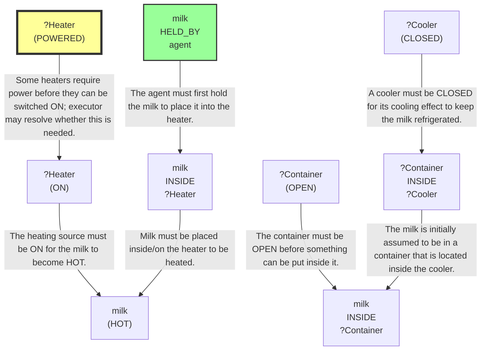
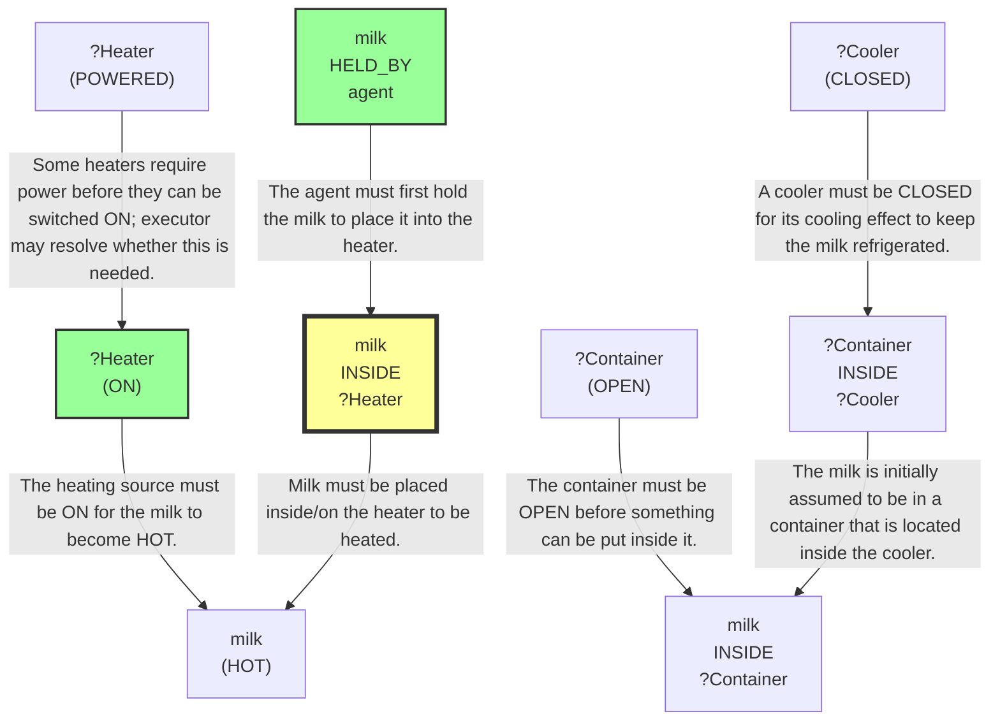

# 🚀 VirtualHome Agent Episode Log


### [GoalReasoner (Module A - Intent)] Output
```json
{
  "is_instruction_obviously_vague": false,
  "clarification_question": null,
  "target_object": "milk",
  "location_hint": "fridge",
  "reasoning_chain": [
    {
      "question": "Why does the user want this object?",
      "answer": "To heat a cup of the milk in the microwave."
    },
    {
      "question": "Why is that important?",
      "answer": "Because the user likely wants warm milk ready to drink or use."
    },
    {
      "question": "What fundamental need does this fulfill?",
      "answer": "It fulfills the need for a warm beverage or warmed liquid."
    },
    {
      "question": "Are there any deeper psychological or physical motivations?",
      "answer": "The user may want comfort, warmth, or a convenient drink prepared at a suitable temperature."
    }
  ],
  "deep_intent": "The user wants to warm a drinkable liquid for consumption or comfort.",
  "acceptable_alternatives_properties": [
    {
      "priority": 1,
      "description": "Other drinkable liquids that can be warmed, such as water, tea, or hot chocolate."
    },
    {
      "priority": 2,
      "description": "Other dairy or non-dairy beverages that can be served warm, such as plant-based milk or flavored milk drinks."
    },
    {
      "priority": 3,
      "description": "Warm prepared beverages that provide similar comfort, such as broth or soup in a mug."
    },
    {
      "priority": 4,
      "description": "Any warm beverage that can satisfy the need for a heated drink, such as coffee or herbal tea."
    }
  ]
}
```

### [PerceptionFilter] Output
```json
{
  "reasoning": "The goal is to warm milk, so the target milk must be kept, along with the likely source cooler/fridge and the heating appliance needed to make it hot. Because the SDG says the milk is inside a container and that container must be open, I include a valid container from the visible list that can hold milk. The goal also implies a drinkable serving vessel, so I keep a suitable cup/glass. For heating alternatives and backups, both microwave and stove are included since either can heat the milk, and both fridge and sink are relevant as available locations/receptacles for retrieving/handling the milk.",
  "selected_classes": [
    "character",
    "milk",
    "stove",
    "microwave",
    "fridge",
    "dishbowl",
    "waterglass",
    "sink"
  ],
  "raw_class_count": 50
}
```

### [LLMExecutor] Output
```json
{
  "reasoning": "The goal is to heat milk in the microwave. The filtered graph shows two milk instances: milk(176) is COLD and inside the fridge, while milk(177) is a closed, grabbable milk object already in the kitchen and not inside another container. Since the task requires getting milk hot, the next step is to approach the accessible milk so it can later be grabbed and prepared for microwaving. I am focusing on the only reachable milk instance currently visible and not assuming any prior holding state.",
  "satisfied_nodes": [],
  "current_node_focus": "N5",
  "mapped_variables": {
    "?Heater": "microwave(171)",
    "?Container": "milk(177)",
    "?Cooler": "fridge(162)"
  },
  "action": "[walk] <milk> (177)"
}
```

### [RoboStateMultiTaskController] Output
```json
{
  "action": "[walk] <milk> (177)",
  "active_task_id": "task_1",
  "task_context": {
    "active_task_id": "task_1",
    "pending_task_ids": [],
    "satisfied_task_ids": []
  },
  "source": "llm_executor"
}
```
## Step 0
- **Action**: `[walk] <milk> (177)`
- **Action Success**: `True`
- **Action Message**: {'0': {'message': 'Success'}}
- **Active Task**: `task_1`
- **Decision Source**: `llm_executor`
- **Task Progress**: T3_without_state_alignment_G1_01=pending
- **SDG Status**:

- **Observed Items (26)**: waterglass(64), waterglass(71), waterglass(72), waterglass(79), waterglass(80), waterglass(87), waterglass(88), waterglass(100), dishbowl(115), dishbowl(116), dishbowl(117), dishbowl(118), dishbowl(119), sink(155), fridge(162) [OPEN]...


### [PerceptionFilter] Output
```json
{
  "reasoning": "Reused cached class selection.",
  "selected_classes": [
    "character",
    "milk",
    "stove",
    "microwave",
    "fridge",
    "dishbowl",
    "waterglass",
    "sink"
  ],
  "raw_class_count": 50
}
```

### [LLMExecutor] Output
```json
{
  "reasoning": "The goal is to heat milk in the microwave. The current graph shows a candidate milk object at milk(177) that is CLOSE to the agent and marked CLOSED, while the fridge contains another milk(176) that is COLD and CLOSED. To satisfy the SDG, the first meaningful step is to interact with the milk already nearby by opening it so it can later be placed into the microwave. The microwave is present and the agent is already close to it as well, but we cannot skip the required milk access step.",
  "satisfied_nodes": [],
  "current_node_focus": "N5",
  "mapped_variables": {
    "?Heater": "microwave(171)",
    "?Cooler": "fridge(162)",
    "?Container": "milk(177)"
  },
  "action": "[open] <milk> (177)"
}
```

### [RoboStateMultiTaskController] Output
```json
{
  "action": "[open] <milk> (177)",
  "active_task_id": "task_1",
  "task_context": {
    "active_task_id": "task_1",
    "pending_task_ids": [],
    "satisfied_task_ids": []
  },
  "source": "llm_executor"
}
```
## Step 1
- **Action**: `[open] <milk> (177)`
- **Action Success**: `False`
- **Action Message**: {'0': {'message': 'ScriptExcutor 0: EXECUTION_GENERAL: Script is impossible to execute\n\n'}}
- **Active Task**: `task_1`
- **Decision Source**: `llm_executor`
- **Task Progress**: T3_without_state_alignment_G1_01=pending
- **SDG Status**:

- **Observed Items (26)**: waterglass(64), waterglass(71), waterglass(72), waterglass(79), waterglass(80), waterglass(87), waterglass(88), waterglass(100), dishbowl(115), dishbowl(116), dishbowl(117), dishbowl(118), dishbowl(119), sink(155), fridge(162) [OPEN]...


### [PerceptionFilter] Output
```json
{
  "reasoning": "Reused cached class selection.",
  "selected_classes": [
    "character",
    "milk",
    "stove",
    "microwave",
    "fridge",
    "dishbowl",
    "waterglass",
    "sink"
  ],
  "raw_class_count": 50
}
```

### [LLMExecutor] Output
```json
{
  "reasoning": "The goal is to make milk hot, and the currently available milk object closest to the agent is milk(177), which is CLOSED and not yet in the microwave. The previous attempted action was invalid because milk cannot be opened as if it were a container door. To progress, I need first to get the milk into hand before I can place it into the microwave. Since I am already close to milk(177), the next atomic step is to grab it. This also aligns with the SDG path toward holding the milk before placing it into the heater/container.",
  "satisfied_nodes": [],
  "current_node_focus": "N5",
  "mapped_variables": {
    "?Heater": "microwave(171)",
    "?Container": "microwave(171)",
    "?Cooler": "fridge(162)"
  },
  "action": "[grab] <milk> (177)"
}
```

### [RoboStateMultiTaskController] Output
```json
{
  "action": "[grab] <milk> (177)",
  "active_task_id": "task_1",
  "task_context": {
    "active_task_id": "task_1",
    "pending_task_ids": [],
    "satisfied_task_ids": []
  },
  "source": "llm_executor"
}
```
## Step 2
- **Action**: `[grab] <milk> (177)`
- **Action Success**: `True`
- **Action Message**: {'0': {'message': 'Success'}}
- **Active Task**: `task_1`
- **Decision Source**: `llm_executor`
- **Task Progress**: T3_without_state_alignment_G1_01=pending
- **SDG Status**:

- **Observed Items (26)**: waterglass(64), waterglass(71), waterglass(72), waterglass(79), waterglass(80), waterglass(87), waterglass(88), waterglass(100), dishbowl(115), dishbowl(116), dishbowl(117), dishbowl(118), dishbowl(119), sink(155), fridge(162) [OPEN]...


### [PerceptionFilter] Output
```json
{
  "reasoning": "Reused cached class selection.",
  "selected_classes": [
    "character",
    "milk",
    "stove",
    "microwave",
    "fridge",
    "dishbowl",
    "waterglass",
    "sink"
  ],
  "raw_class_count": 50
}
```

### [LLMExecutor] Output
```json
{
  "reasoning": "The current task is to warm milk in the microwave. The previous attempt to open milk was impossible because milk is not a container to open in this engine. In the current graph, milk(177) is already held by the agent, and microwave(171) is the likely heater but is currently CLOSED and OFF. To progress toward making the milk HOT, the next required step is to open the microwave before placing the milk inside and turning it on.",
  "satisfied_nodes": [
    "N5"
  ],
  "current_node_focus": "N7",
  "mapped_variables": {
    "?Heater": "microwave(171)",
    "?Container": "milk(177)"
  },
  "action": "[open] <microwave> (171)"
}
```

### [RoboStateMultiTaskController] Output
```json
{
  "action": "[open] <microwave> (171)",
  "active_task_id": "task_1",
  "task_context": {
    "active_task_id": "task_1",
    "pending_task_ids": [],
    "satisfied_task_ids": []
  },
  "source": "llm_executor"
}
```
## Step 3
- **Action**: `[open] <microwave> (171)`
- **Action Success**: `True`
- **Action Message**: {'0': {'message': 'Success'}}
- **Active Task**: `task_1`
- **Decision Source**: `llm_executor`
- **Task Progress**: T3_without_state_alignment_G1_01=pending
- **SDG Status**:

- **Observed Items (26)**: waterglass(64), waterglass(71), waterglass(72), waterglass(79), waterglass(80), waterglass(87), waterglass(88), waterglass(100), dishbowl(115), dishbowl(116), dishbowl(117), dishbowl(118), dishbowl(119), sink(155), fridge(162) [OPEN]...


### [PerceptionFilter] Output
```json
{
  "reasoning": "Reused cached class selection.",
  "selected_classes": [
    "character",
    "milk",
    "stove",
    "microwave",
    "fridge",
    "dishbowl",
    "waterglass",
    "sink"
  ],
  "raw_class_count": 50
}
```

### [LLMExecutor] Output
```json
{
  "reasoning": "The previous attempt to open milk(177) was impossible because milk is not a container to open in this engine; the filtered graph shows milk(177) is already held by the agent and there is a microwave(171) that is OPEN, OFF, and close to the character. The SDG requires the milk to become HOT, which is most directly progressed by putting the held milk into the microwave, after which it can be switched on. Since put-in requires being near the destination first, the next atomic step is to walk to the microwave.",
  "satisfied_nodes": [
    "N5"
  ],
  "current_node_focus": "N4",
  "mapped_variables": {
    "?Heater": "microwave(171)",
    "?Container": "dishbowl(172)",
    "?Cooler": "fridge(162)"
  },
  "action": "[walk] <microwave> (171)"
}
```

### [RoboStateMultiTaskController] Output
```json
{
  "action": "[walk] <microwave> (171)",
  "active_task_id": "task_1",
  "task_context": {
    "active_task_id": "task_1",
    "pending_task_ids": [],
    "satisfied_task_ids": []
  },
  "source": "llm_executor"
}
```
## Step 4
- **Action**: `[walk] <microwave> (171)`
- **Action Success**: `True`
- **Action Message**: {'0': {'message': 'Success'}}
- **Active Task**: `task_1`
- **Decision Source**: `llm_executor`
- **Task Progress**: T3_without_state_alignment_G1_01=pending
- **SDG Status**:

- **Observed Items (27)**: waterglass(64), waterglass(71), waterglass(72), waterglass(79), waterglass(80), waterglass(87), waterglass(88), waterglass(100), dishbowl(115), dishbowl(116), dishbowl(117), dishbowl(118), dishbowl(119), sink(155), fridge(162) [OPEN]...


### [PerceptionFilter] Output
```json
{
  "reasoning": "Reused cached class selection.",
  "selected_classes": [
    "character",
    "milk",
    "stove",
    "microwave",
    "fridge",
    "dishbowl",
    "waterglass",
    "sink"
  ],
  "raw_class_count": 50
}
```

### [LLMExecutor] Output
```json
{
  "reasoning": "The milk target is currently the held item milk(177), which is CLOSED and already in hand. The microwave(171) is the heater candidate: it has HAS_SWITCH and HAS_PLUG, so to satisfy the heater-related chain I should next power it as part of preparing to heat the milk. The microwave is already CLOSE to the character, so no walk is needed before switching it on. The previous open attempt on milk was invalid and irrelevant to the actual goal.",
  "satisfied_nodes": [
    "N5"
  ],
  "current_node_focus": "N3",
  "mapped_variables": {
    "?Heater": "microwave(171)",
    "?Container": "dishbowl(172)",
    "?Cooler": "fridge(162)"
  },
  "action": "[switchon] <microwave> (171)"
}
```

### [RoboStateMultiTaskController] Output
```json
{
  "action": "[switchon] <microwave> (171)",
  "active_task_id": "task_1",
  "task_context": {
    "active_task_id": "task_1",
    "pending_task_ids": [],
    "satisfied_task_ids": []
  },
  "source": "llm_executor"
}
```
## Step 5
- **Action**: `[switchon] <microwave> (171)`
- **Action Success**: `True`
- **Action Message**: Faked switch operation in Python layer (bypassed Unity failure)
- **Active Task**: `task_1`
- **Decision Source**: `llm_executor`
- **Task Progress**: T3_without_state_alignment_G1_01=pending
- **SDG Status**:

- **Observed Items (27)**: waterglass(64), waterglass(71), waterglass(72), waterglass(79), waterglass(80), waterglass(87), waterglass(88), waterglass(100), dishbowl(115), dishbowl(116), dishbowl(117), dishbowl(118), dishbowl(119), sink(155), fridge(162) [OPEN]...


### [PerceptionFilter] Output
```json
{
  "reasoning": "Reused cached class selection.",
  "selected_classes": [
    "character",
    "milk",
    "stove",
    "microwave",
    "fridge",
    "dishbowl",
    "waterglass",
    "sink"
  ],
  "raw_class_count": 50
}
```

### [LLMExecutor] Output
```json
{
  "reasoning": "The milk is already being held in the right hand as milk(177). The SDG path to HOT requires placing the milk inside/on the heater, and the only viable heater in the current graph is microwave(171), which is already ON. The microwave is also CLOSE to the agent, so the next necessary step is to insert the held milk into it. Since putin requires being near the destination and the microwave is already nearby, the single next action is to put the milk into the microwave.",
  "satisfied_nodes": [
    "N2",
    "N5"
  ],
  "current_node_focus": "N4",
  "mapped_variables": {
    "?Heater": "microwave(171)"
  },
  "action": "[putin] <milk> (177) <microwave> (171)"
}
```

### [RoboStateMultiTaskController] Output
```json
{
  "action": "[putin] <milk> (177) <microwave> (171)",
  "active_task_id": "task_1",
  "task_context": {
    "active_task_id": "task_1",
    "pending_task_ids": [],
    "satisfied_task_ids": []
  },
  "source": "llm_executor"
}
```
## Step 6
- **Action**: `[putin] <milk> (177) <microwave> (171)`
- **Action Success**: `True`
- **Action Message**: {'0': {'message': 'Success'}}
- **Active Task**: `task_1`
- **Decision Source**: `llm_executor`
- **Task Progress**: T3_without_state_alignment_G1_01=done
- **SDG Status**:

- **Observed Items (27)**: waterglass(64), waterglass(71), waterglass(72), waterglass(79), waterglass(80), waterglass(87), waterglass(88), waterglass(100), dishbowl(115), dishbowl(116), dishbowl(117), dishbowl(118), dishbowl(119), sink(155), fridge(162) [OPEN]...

