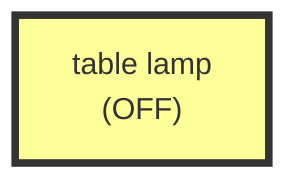

# 🚀 VirtualHome Agent Episode Log


### [GoalReasoner (Module A - Intent)] Output
```json
{
  "is_instruction_obviously_vague": false,
  "clarification_question": null,
  "target_object": "table lamp",
  "location_hint": null,
  "reasoning_chain": [
    {
      "question": "Why does the user want this object?",
      "answer": "To change its state if it is currently on."
    },
    {
      "question": "Why is that important?",
      "answer": "Because the user wants the lamp not to be operating in that condition."
    },
    {
      "question": "What fundamental need does this fulfill?",
      "answer": "The user wants to stop the lamp from producing light and consuming power."
    },
    {
      "question": "Are there any deeper psychological or physical motivations?",
      "answer": "The user likely wants to reduce illumination, avoid glare, conserve electricity, or make the room darker."
    }
  ],
  "deep_intent": "The user wants to reduce illumination in the environment and stop unnecessary power use.",
  "acceptable_alternatives_properties": [
    {
      "priority": 1,
      "description": "Other nearby light sources that can be turned off to reduce illumination, such as a floor lamp or desk lamp"
    },
    {
      "priority": 2,
      "description": "Any indoor electric lighting fixture that is currently on and contributing to room brightness"
    },
    {
      "priority": 3,
      "description": "Alternative ways to lower light levels, such as closing curtains or blinds if the goal is darkness"
    },
    {
      "priority": 4,
      "description": "Non-electric sources of light reduction, such as moving away from bright areas or covering a light source, if appropriate and safe"
    }
  ]
}
```

### [PerceptionFilter] Output
```json
{
  "reasoning": "The goal is to turn off the table lamp, so the only strictly necessary class is the exact target lamp object. A lightswitch is not required by the SDG, and other light sources or curtains/blinds are only alternatives if needed, not necessary for the specified target state.",
  "selected_classes": [
    "curtains",
    "character",
    "floor",
    "tablelamp",
    "desk"
  ],
  "raw_class_count": 33
}
```

### [LLMExecutor] Output
```json
{
  "reasoning": "The goal is to make the table lamp OFF. In the current graph, both tablelamp(102) and tablelamp(103) are ON and have HAS_SWITCH and HAS_PLUG, so they are valid candidates. Since the SDG names a single 'table lamp' and there are two matching instances, I will start by turning off one specific nearby candidate; the next observation will verify whether the task is satisfied or whether the other lamp must also be addressed. The immediate prerequisite for switching an object is to be near it, so I must walk to the chosen lamp first.",
  "satisfied_nodes": [],
  "current_node_focus": "N1",
  "mapped_variables": {},
  "action": "[walk] <tablelamp> (102)"
}
```

### [RoboStateMultiTaskController] Output
```json
{
  "action": "[walk] <tablelamp> (102)",
  "active_task_id": "task_1",
  "task_context": {
    "active_task_id": "task_1",
    "pending_task_ids": [],
    "satisfied_task_ids": []
  },
  "source": "llm_executor"
}
```
## Step 0
- **Action**: `[walk] <tablelamp> (102)`
- **Action Success**: `True`
- **Action Message**: {'0': {'message': 'Success'}}
- **Active Task**: `task_1`
- **Decision Source**: `llm_executor`
- **Task Progress**: T3_without_state_alignment_G1_04=pending
- **SDG Status**:

- **Observed Items (20)**: floor(74), floor(75), floor(76), floor(77), floor(78), floor(79), floor(80), floor(81), floor(82), tablelamp(102) [ON], tablelamp(103) [ON], desk(108) [CLOSED], curtains(183) [CLOSED], curtains(184) [CLOSED], curtains(185) [CLOSED]...


### [PerceptionFilter] Output
```json
{
  "reasoning": "Reused cached class selection.",
  "selected_classes": [
    "curtains",
    "character",
    "floor",
    "tablelamp",
    "desk"
  ],
  "raw_class_count": 33
}
```

### [LLMExecutor] Output
```json
{
  "reasoning": "The SDG requires the table lamp to be OFF. The filtered graph shows tablelamp(102) is ON and already CLOSE to the character, so no walking is needed. The best next step is to switch off that exact lamp instance. tablelamp(103) is also ON, but it is not currently close; the closest relevant object matching the target is 102.",
  "satisfied_nodes": [],
  "current_node_focus": "N1",
  "mapped_variables": {},
  "action": "[switchoff] <tablelamp> (102)"
}
```

### [RoboStateMultiTaskController] Output
```json
{
  "action": "[switchoff] <tablelamp> (102)",
  "active_task_id": "task_1",
  "task_context": {
    "active_task_id": "task_1",
    "pending_task_ids": [],
    "satisfied_task_ids": []
  },
  "source": "llm_executor"
}
```
## Step 1
- **Action**: `[switchoff] <tablelamp> (102)`
- **Action Success**: `True`
- **Action Message**: Faked switch operation in Python layer (bypassed Unity failure)
- **Active Task**: `task_1`
- **Decision Source**: `llm_executor`
- **Task Progress**: T3_without_state_alignment_G1_04=done
- **SDG Status**:

- **Observed Items (20)**: floor(74), floor(75), floor(76), floor(77), floor(78), floor(79), floor(80), floor(81), floor(82), tablelamp(102) [ON], tablelamp(103) [ON], desk(108) [CLOSED], curtains(183) [CLOSED], curtains(184) [CLOSED], curtains(185) [CLOSED]...

