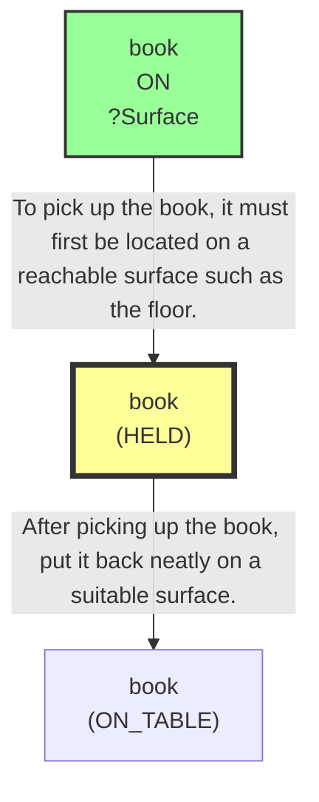
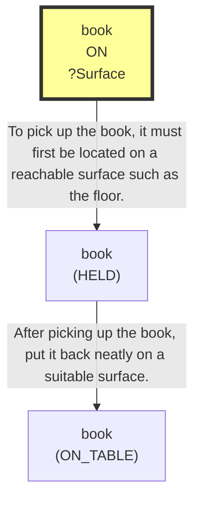
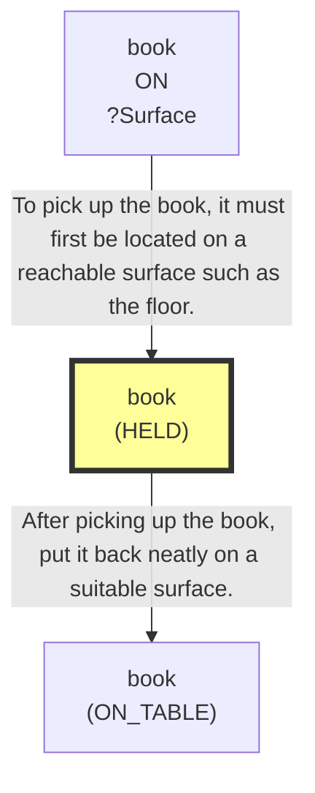

# 🚀 VirtualHome Agent Episode Log


### [GoalReasoner (Module A - Intent)] Output
```json
{
  "is_instruction_obviously_vague": false,
  "clarification_question": null,
  "target_object": "book",
  "location_hint": "floor",
  "reasoning_chain": [
    {
      "question": "Why does the user want this object?",
      "answer": "To handle the book if it falls onto the floor."
    },
    {
      "question": "Why is that important?",
      "answer": "To restore the book to its proper place and keep it organized neatly."
    },
    {
      "question": "What fundamental need does this fulfill?",
      "answer": "Maintaining order and preventing the book from remaining on the floor."
    },
    {
      "question": "Are there any deeper psychological or physical motivations?",
      "answer": "The user likely wants tidiness, convenience, and to avoid clutter or damage from the book being left on the floor."
    }
  ],
  "deep_intent": "The user wants to maintain tidiness by returning a fallen item to its proper place.",
  "acceptable_alternatives_properties": [
    {
      "priority": 1,
      "description": "Other similar loose items that may fall onto the floor and should be picked up and returned to their place, such as magazines or notebooks."
    },
    {
      "priority": 2,
      "description": "Paper-based reading materials or documents that are lying out of place and can be neatly stacked or shelved."
    },
    {
      "priority": 3,
      "description": "Small household items that are cluttering the floor and can be organized back into storage."
    },
    {
      "priority": 4,
      "description": "Any misplaced indoor objects that need to be picked up to restore order and reduce clutter."
    }
  ]
}
```

### [PerceptionFilter] Output
```json
{
  "reasoning": "The goal is to pick up a fallen book from the floor and place it back neatly on a suitable surface. The minimum needed classes are the target object book, the floor where it is located, and a likely placement surface such as bookshelf or table; since the SDG specifies ON_TABLE and the scene contains a coffeetable and desk, keeping those as possible resting surfaces is necessary. No tools are required for simply lifting and placing the book.",
  "selected_classes": [
    "book",
    "character",
    "floor",
    "paper",
    "coffeetable",
    "bookshelf",
    "desk"
  ],
  "raw_class_count": 41
}
```

### [LLMExecutor] Output
```json
{
  "reasoning": "The SDG indicates the book must first be on a reachable surface (N2), and the current graph shows book(190) is already on the floor in the living room. The next step toward satisfying the goal is to move close enough to pick it up. Among the available book instances, book(190) is a valid loose book on the floor, matching the task intent.",
  "satisfied_nodes": [
    "N2"
  ],
  "current_node_focus": "N1",
  "mapped_variables": {},
  "action": "[walk] <book> (190)"
}
```

### [RoboStateMultiTaskController] Output
```json
{
  "action": "[walk] <book> (190)",
  "active_task_id": "task_1",
  "task_context": {
    "active_task_id": "task_1",
    "pending_task_ids": [],
    "satisfied_task_ids": []
  },
  "source": "llm_executor"
}
```
## Step 0
- **Action**: `[walk] <book> (190)`
- **Action Success**: `True`
- **Action Message**: {'0': {'message': 'Success'}}
- **Active Task**: `task_1`
- **Decision Source**: `llm_executor`
- **Task Progress**: T3_without_state_alignment_G2_09=pending
- **SDG Status**:

- **Observed Items (21)**: floor(336), floor(337), floor(338), floor(339), floor(340), floor(341), floor(342), floor(343), floor(344), bookshelf(370), coffeetable(371), desk(373) [CLOSED], paper(451), book(190) [CLOSED], book(191) [CLOSED]...


### [PerceptionFilter] Output
```json
{
  "reasoning": "Reused cached class selection.",
  "selected_classes": [
    "book",
    "character",
    "floor",
    "paper",
    "coffeetable",
    "bookshelf",
    "desk"
  ],
  "raw_class_count": 41
}
```

### [LLMExecutor] Output
```json
{
  "reasoning": "The goal is to satisfy the book being held first, and the current graph shows three candidate books on the floor in the living room. Since no prior actions exist, the first required step is to move next to one of the books before grabbing it. Book(190) is explicitly close to the character and on the floor, so it is a valid target for the HOLD state.",
  "satisfied_nodes": [
    "N2"
  ],
  "current_node_focus": "N1",
  "mapped_variables": {},
  "action": "[walk] <book> (190)"
}
```

### [RoboStateMultiTaskController] Output
```json
{
  "action": "[walk] <book> (190)",
  "active_task_id": "task_1",
  "task_context": {
    "active_task_id": "task_1",
    "pending_task_ids": [],
    "satisfied_task_ids": []
  },
  "source": "llm_executor"
}
```
## Step 1
- **Action**: `[walk] <book> (190)`
- **Action Success**: `True`
- **Action Message**: {'0': {'message': 'Success'}}
- **Active Task**: `task_1`
- **Decision Source**: `llm_executor`
- **Task Progress**: T3_without_state_alignment_G2_09=pending
- **SDG Status**:

- **Observed Items (21)**: floor(336), floor(337), floor(338), floor(339), floor(340), floor(341), floor(342), floor(343), floor(344), bookshelf(370), coffeetable(371), desk(373) [CLOSED], paper(451), book(190) [CLOSED], book(191) [CLOSED]...


### [PerceptionFilter] Output
```json
{
  "reasoning": "Reused cached class selection.",
  "selected_classes": [
    "book",
    "character",
    "floor",
    "paper",
    "coffeetable",
    "bookshelf",
    "desk"
  ],
  "raw_class_count": 41
}
```

### [LLMExecutor] Output
```json
{
  "reasoning": "The task is to pick up the book from the floor and then return it neatly to a surface. In the current graph, book(190), book(191), and book(268) are all on floor(336), and the character is already close to them. To satisfy the first SDG node, I should grab one floor book; book(190) is the first valid target matching the goal. No prior action was taken, so a grab is the correct next atomic step.",
  "satisfied_nodes": [
    "N2"
  ],
  "current_node_focus": "N1",
  "mapped_variables": {},
  "action": "[grab] <book> (190)"
}
```

### [RoboStateMultiTaskController] Output
```json
{
  "action": "[grab] <book> (190)",
  "active_task_id": "task_1",
  "task_context": {
    "active_task_id": "task_1",
    "pending_task_ids": [],
    "satisfied_task_ids": []
  },
  "source": "llm_executor"
}
```
## Step 2
- **Action**: `[grab] <book> (190)`
- **Action Success**: `True`
- **Action Message**: {'0': {'message': 'Success'}}
- **Active Task**: `task_1`
- **Decision Source**: `llm_executor`
- **Task Progress**: T3_without_state_alignment_G2_09=pending
- **SDG Status**:

- **Observed Items (21)**: floor(336), floor(337), floor(338), floor(339), floor(340), floor(341), floor(342), floor(343), floor(344), bookshelf(370), coffeetable(371), desk(373) [CLOSED], paper(451), book(190) [CLOSED], book(191) [CLOSED]...


### [PerceptionFilter] Output
```json
{
  "reasoning": "Reused cached class selection.",
  "selected_classes": [
    "book",
    "character",
    "floor",
    "paper",
    "coffeetable",
    "bookshelf",
    "desk"
  ],
  "raw_class_count": 41
}
```

### [LLMExecutor] Output
```json
{
  "reasoning": "The active goal is to get a book that is on the floor into a proper placed state. In the current graph, book(191) and book(268) are on the floor, but the character is already holding book(190), which is not the floor book target. Since the required SDG’s first meaningful step is to have the target book held, the next action should be to approach one of the floor books before attempting to grab it. book(191) is explicitly ON floor(336) and CLOSE to the character, so it is the best binding for the floor-targeted book task.",
  "satisfied_nodes": [],
  "current_node_focus": "N2",
  "mapped_variables": {
    "?Surface": "floor(336)"
  },
  "action": "[walk] <book> (191)"
}
```

### [RoboStateMultiTaskController] Output
```json
{
  "action": "[walk] <book> (191)",
  "active_task_id": "task_1",
  "task_context": {
    "active_task_id": "task_1",
    "pending_task_ids": [],
    "satisfied_task_ids": []
  },
  "source": "llm_executor"
}
```
## Step 3
- **Action**: `[walk] <book> (191)`
- **Action Success**: `True`
- **Action Message**: {'0': {'message': 'Success'}}
- **Active Task**: `task_1`
- **Decision Source**: `llm_executor`
- **Task Progress**: T3_without_state_alignment_G2_09=pending
- **SDG Status**:

- **Observed Items (21)**: floor(336), floor(337), floor(338), floor(339), floor(340), floor(341), floor(342), floor(343), floor(344), bookshelf(370), coffeetable(371), desk(373) [CLOSED], paper(451), book(190) [CLOSED], book(191) [CLOSED]...


### [PerceptionFilter] Output
```json
{
  "reasoning": "Reused cached class selection.",
  "selected_classes": [
    "book",
    "character",
    "floor",
    "paper",
    "coffeetable",
    "bookshelf",
    "desk"
  ],
  "raw_class_count": 41
}
```

### [LLMExecutor] Output
```json
{
  "reasoning": "The SDG requires the book to be held first (N1) before it can be put back neatly. In the current graph, book(190) is already held by the character, but that is a different book instance than the floor books. The only book explicitly on the floor and close to the character is book(191), which best matches the task intent of picking up a fallen book. Since the next required state is to satisfy N1 by holding the target book, the immediate step is to grab the floor book that is reachable.",
  "satisfied_nodes": [],
  "current_node_focus": "N1",
  "mapped_variables": {},
  "action": "[grab] <book> (191)"
}
```

### [RoboStateMultiTaskController] Output
```json
{
  "action": "[grab] <book> (191)",
  "active_task_id": "task_1",
  "task_context": {
    "active_task_id": "task_1",
    "pending_task_ids": [],
    "satisfied_task_ids": []
  },
  "source": "llm_executor"
}
```
## Step 4
- **Action**: `[grab] <book> (191)`
- **Action Success**: `True`
- **Action Message**: {'0': {'message': 'Success'}}
- **Active Task**: `task_1`
- **Decision Source**: `llm_executor`
- **Task Progress**: T3_without_state_alignment_G2_09=pending
- **SDG Status**:

- **Observed Items (21)**: floor(336), floor(337), floor(338), floor(339), floor(340), floor(341), floor(342), floor(343), floor(344), bookshelf(370), coffeetable(371), desk(373) [CLOSED], paper(451), book(190) [CLOSED], book(191) [CLOSED]...


### [PerceptionFilter] Output
```json
{
  "reasoning": "Reused cached class selection.",
  "selected_classes": [
    "book",
    "character",
    "floor",
    "paper",
    "coffeetable",
    "bookshelf",
    "desk"
  ],
  "raw_class_count": 41
}
```

### [LLMExecutor] Output
```json
{
  "reasoning": "The SDG requires the book to be held before it can be put back on a surface. In the current graph, the character is already holding book(190) and book(191), and book(268) is the remaining book that is on the floor and close to the character. Since the task is to pick up the book from the floor, the next step is to move to that specific book so it can be grabbed next.",
  "satisfied_nodes": [],
  "current_node_focus": "N2",
  "mapped_variables": {},
  "action": "[walk] <book> (268)"
}
```

### [RoboStateMultiTaskController] Output
```json
{
  "action": "[walk] <book> (268)",
  "active_task_id": "task_1",
  "task_context": {
    "active_task_id": "task_1",
    "pending_task_ids": [],
    "satisfied_task_ids": []
  },
  "source": "llm_executor"
}
```
## Step 5
- **Action**: `[walk] <book> (268)`
- **Action Success**: `True`
- **Action Message**: {'0': {'message': 'Success'}}
- **Active Task**: `task_1`
- **Decision Source**: `llm_executor`
- **Task Progress**: T3_without_state_alignment_G2_09=pending
- **SDG Status**:

- **Observed Items (21)**: floor(336), floor(337), floor(338), floor(339), floor(340), floor(341), floor(342), floor(343), floor(344), bookshelf(370), coffeetable(371), desk(373) [CLOSED], paper(451), book(190) [CLOSED], book(191) [CLOSED]...


### [PerceptionFilter] Output
```json
{
  "reasoning": "Reused cached class selection.",
  "selected_classes": [
    "book",
    "character",
    "floor",
    "paper",
    "coffeetable",
    "bookshelf",
    "desk"
  ],
  "raw_class_count": 41
}
```

### [LLMExecutor] Output
```json
{
  "reasoning": "The SDG requires the book to end up held first (N1) before it can be placed on a surface (N3). In the current graph, the character is already holding two books: book(190) and book(191), and book(268) is the one lying on the floor and is close to the character. Since both hands are full, I cannot grab book(268) yet. The correct next step is to free a hand by putting one currently held book onto a suitable surface. The closest available flat surface is the coffeetable(371), which is a valid surface for putback and is in the same living room. This is the safest progress toward making room to pick up the floor book.",
  "satisfied_nodes": [],
  "current_node_focus": "N1",
  "mapped_variables": {},
  "action": "[walk] <coffeetable> (371)"
}
```

### [RoboStateMultiTaskController] Output
```json
{
  "action": "[walk] <coffeetable> (371)",
  "active_task_id": "task_1",
  "task_context": {
    "active_task_id": "task_1",
    "pending_task_ids": [],
    "satisfied_task_ids": []
  },
  "source": "llm_executor"
}
```
## Step 6
- **Action**: `[walk] <coffeetable> (371)`
- **Action Success**: `True`
- **Action Message**: {'0': {'message': 'Success'}}
- **Active Task**: `task_1`
- **Decision Source**: `llm_executor`
- **Task Progress**: T3_without_state_alignment_G2_09=pending
- **SDG Status**:

- **Observed Items (21)**: floor(336), floor(337), floor(338), floor(339), floor(340), floor(341), floor(342), floor(343), floor(344), bookshelf(370), coffeetable(371), desk(373) [CLOSED], paper(451), book(190) [CLOSED], book(191) [CLOSED]...


### [PerceptionFilter] Output
```json
{
  "reasoning": "Reused cached class selection.",
  "selected_classes": [
    "book",
    "character",
    "floor",
    "paper",
    "coffeetable",
    "bookshelf",
    "desk"
  ],
  "raw_class_count": 41
}
```

### [LLMExecutor] Output
```json
{
  "reasoning": "The SDG requires the book to be held before it can be placed back on a suitable surface. In the current graph, the only free book on the floor is book(268); books(190) and (191) are already held by the character, so they are not valid targets. I am currently close to book(268), so the next step is to pick it up and satisfy N1.",
  "satisfied_nodes": [
    "N2"
  ],
  "current_node_focus": "N1",
  "mapped_variables": {},
  "action": "[grab] <book> (268)"
}
```

### [RoboStateMultiTaskController] Output
```json
{
  "action": "[walk] <book> (268)",
  "active_task_id": "task_1",
  "task_context": {
    "active_task_id": "task_1",
    "pending_task_ids": [],
    "satisfied_task_ids": []
  },
  "source": "llm_executor_repaired"
}
```
## Step 7
- **Action**: `[walk] <book> (268)`
- **Action Success**: `True`
- **Action Message**: {'0': {'message': 'Success'}}
- **Active Task**: `task_1`
- **Decision Source**: `llm_executor_repaired`
- **Task Progress**: T3_without_state_alignment_G2_09=pending
- **SDG Status**:

- **Observed Items (21)**: floor(336), floor(337), floor(338), floor(339), floor(340), floor(341), floor(342), floor(343), floor(344), bookshelf(370), coffeetable(371), desk(373) [CLOSED], paper(451), book(190) [CLOSED], book(191) [CLOSED]...


### [PerceptionFilter] Output
```json
{
  "reasoning": "Reused cached class selection.",
  "selected_classes": [
    "book",
    "character",
    "floor",
    "paper",
    "coffeetable",
    "bookshelf",
    "desk"
  ],
  "raw_class_count": 41
}
```

### [LLMExecutor] Output
```json
{
  "reasoning": "The target book on the floor is book(268), which is currently on floor(336) and close to the character. The first required SDG step is to satisfy N2 by being able to interact with the book on a reachable surface before grabbing it. Since the book is already close and on the floor, the correct next atomic action is to walk directly to book(268) to prepare for grabbing it next.",
  "satisfied_nodes": [
    "N2"
  ],
  "current_node_focus": "N1",
  "mapped_variables": {},
  "action": "[walk] <book> (268)"
}
```

### [RoboStateMultiTaskController] Output
```json
{
  "action": "[walk] <book> (268)",
  "active_task_id": "task_1",
  "task_context": {
    "active_task_id": "task_1",
    "pending_task_ids": [],
    "satisfied_task_ids": []
  },
  "source": "llm_executor"
}
```
## Step 8
- **Action**: `[walk] <book> (268)`
- **Action Success**: `True`
- **Action Message**: {'0': {'message': 'Success'}}
- **Active Task**: `task_1`
- **Decision Source**: `llm_executor`
- **Task Progress**: T3_without_state_alignment_G2_09=pending
- **SDG Status**:

- **Observed Items (21)**: floor(336), floor(337), floor(338), floor(339), floor(340), floor(341), floor(342), floor(343), floor(344), bookshelf(370), coffeetable(371), desk(373) [CLOSED], paper(451), book(190) [CLOSED], book(191) [CLOSED]...


### [PerceptionFilter] Output
```json
{
  "reasoning": "Reused cached class selection.",
  "selected_classes": [
    "book",
    "character",
    "floor",
    "paper",
    "coffeetable",
    "bookshelf",
    "desk"
  ],
  "raw_class_count": 41
}
```

### [LLMExecutor] Output
```json
{
  "reasoning": "The active task is to return a fallen book to a proper place. The current graph shows book(268) is already on the floor and close to the character, while the character is already holding two other books (190, 191), so both hands are full. Since the first SDG step toward handling the floor book is to get it held, the immediate blocking issue is hand capacity. I need to free a hand by placing one currently held book onto a suitable flat surface. The nearest suitable surface in view is coffeetable(371), and as a flat surface it can receive a putback. I will first move to the coffeetable so a putback can be done next.",
  "satisfied_nodes": [],
  "current_node_focus": "N1",
  "mapped_variables": {},
  "action": "[walk] <coffeetable> (371)"
}
```

### [RoboStateMultiTaskController] Output
```json
{
  "action": "[walk] <coffeetable> (371)",
  "active_task_id": "task_1",
  "task_context": {
    "active_task_id": "task_1",
    "pending_task_ids": [],
    "satisfied_task_ids": []
  },
  "source": "llm_executor"
}
```
## Step 9
- **Action**: `[walk] <coffeetable> (371)`
- **Action Success**: `True`
- **Action Message**: {'0': {'message': 'Success'}}
- **Active Task**: `task_1`
- **Decision Source**: `llm_executor`
- **Task Progress**: T3_without_state_alignment_G2_09=pending
- **SDG Status**:

- **Observed Items (21)**: floor(336), floor(337), floor(338), floor(339), floor(340), floor(341), floor(342), floor(343), floor(344), bookshelf(370), coffeetable(371), desk(373) [CLOSED], paper(451), book(190) [CLOSED], book(191) [CLOSED]...


### [PerceptionFilter] Output
```json
{
  "reasoning": "Reused cached class selection.",
  "selected_classes": [
    "book",
    "character",
    "floor",
    "paper",
    "coffeetable",
    "bookshelf",
    "desk"
  ],
  "raw_class_count": 41
}
```

### [LLMExecutor] Output
```json
{
  "reasoning": "The active task is to return a fallen book to a suitable surface. In the current graph, the character is already holding two books (190 and 191), and the target book on the floor is book(268). Because both hands are full, I cannot grab the floor book immediately. To free a hand, the most reasonable next step is to put one held book down on a flat surface that is already close: the coffeetable(371) is nearby and is a valid surface for putback. This moves toward freeing a hand so the floor book can later be picked up.",
  "satisfied_nodes": [],
  "current_node_focus": "N1",
  "mapped_variables": {},
  "action": "[walk] <coffeetable> (371)"
}
```

### [RoboStateMultiTaskController] Output
```json
{
  "action": "[walk] <coffeetable> (371)",
  "active_task_id": "task_1",
  "task_context": {
    "active_task_id": "task_1",
    "pending_task_ids": [],
    "satisfied_task_ids": []
  },
  "source": "llm_executor"
}
```
## Step 10
- **Action**: `[walk] <coffeetable> (371)`
- **Action Success**: `True`
- **Action Message**: {'0': {'message': 'Success'}}
- **Active Task**: `task_1`
- **Decision Source**: `llm_executor`
- **Task Progress**: T3_without_state_alignment_G2_09=pending
- **SDG Status**:

- **Observed Items (21)**: floor(336), floor(337), floor(338), floor(339), floor(340), floor(341), floor(342), floor(343), floor(344), bookshelf(370), coffeetable(371), desk(373) [CLOSED], paper(451), book(190) [CLOSED], book(191) [CLOSED]...


### [PerceptionFilter] Output
```json
{
  "reasoning": "Reused cached class selection.",
  "selected_classes": [
    "book",
    "character",
    "floor",
    "paper",
    "coffeetable",
    "bookshelf",
    "desk"
  ],
  "raw_class_count": 41
}
```

### [LLMExecutor] Output
```json
{
  "reasoning": "The active goal is to restore a book from the floor to a proper place. In the current graph, book(268) is the only book explicitly ON a floor surface, so it best matches the target. The character is already holding two other books, so hands are full; before we can pick up book(268), we must free a hand by placing one held book onto a nearby flat surface. The coffee table is close to the character and is a valid flat surface for putback. Since putback requires being near the destination, the next atomic step must be to walk to the coffee table.",
  "satisfied_nodes": [],
  "current_node_focus": "N1",
  "mapped_variables": {
    "?Surface": "coffeetable(371)"
  },
  "action": "[walk] <coffeetable> (371)"
}
```

### [RoboStateMultiTaskController] Output
```json
{
  "action": "[walk] <bathroom> (11)",
  "active_task_id": null,
  "task_context": {
    "active_task_id": null,
    "pending_task_ids": [
      "task_1"
    ],
    "satisfied_task_ids": []
  },
  "source": "loop_recovery_room_revisit"
}
```
## Step 11
- **Action**: `[walk] <bathroom> (11)`
- **Action Success**: `True`
- **Action Message**: {'0': {'message': 'Success'}}
- **Decision Source**: `loop_recovery_room_revisit`
- **Task Progress**: T3_without_state_alignment_G2_09=pending
- **SDG Status**:
No SDG active.
- **Observed Items (82)**: floor(336), floor(337), floor(338), floor(339), floor(340), floor(341), floor(342), floor(343), floor(344), wall(345), wall(346), wall(347), wall(348), wall(349), wall(350)...


### [PerceptionFilter] Output
```json
{
  "reasoning": "The goal is to pick up a fallen book from the floor and place it neatly on a suitable surface. The SDG explicitly requires the book, the floor as the likely source location, and a table-like surface for returning it. From the visible objects, the minimal relevant placement surface is a coffeetable; bookshelf is also relevant as a proper storage location for books.",
  "selected_classes": [
    "book",
    "character",
    "floor",
    "paper",
    "coffeetable",
    "bookshelf",
    "door"
  ],
  "raw_class_count": 63
}
```

### [LLMExecutor] Output
```json
{
  "reasoning": "The active task is to handle the book on the floor by picking it up and later placing it neatly on a suitable surface. In the current graph, the book that is actually on the floor in the living room is book(268), while the other books are already held by the character in the bathroom and should not be touched. Since grabbing requires being next to the target object and we are not already at the book(268)'s location, the next step is to walk to that book.",
  "satisfied_nodes": [],
  "current_node_focus": "N2",
  "mapped_variables": {},
  "action": "[walk] <book> (268)"
}
```

### [RoboStateMultiTaskController] Output
```json
{
  "action": "[walk] <book> (268)",
  "active_task_id": "task_1",
  "task_context": {
    "active_task_id": "task_1",
    "pending_task_ids": [],
    "satisfied_task_ids": []
  },
  "source": "llm_executor"
}
```
## Step 12
- **Action**: `[walk] <book> (268)`
- **Action Success**: `True`
- **Action Message**: {'0': {'message': 'Success'}}
- **Active Task**: `task_1`
- **Decision Source**: `llm_executor`
- **Task Progress**: T3_without_state_alignment_G2_09=pending
- **SDG Status**:

- **Observed Items (27)**: floor(336), floor(337), floor(338), floor(339), floor(340), floor(341), floor(342), floor(343), floor(344), bookshelf(370), coffeetable(371), paper(451), book(190) [CLOSED], book(191) [CLOSED], book(268) [CLOSED]...


### [PerceptionFilter] Output
```json
{
  "reasoning": "Reused cached class selection.",
  "selected_classes": [
    "book",
    "character",
    "floor",
    "paper",
    "coffeetable",
    "bookshelf",
    "door"
  ],
  "raw_class_count": 63
}
```

### [LLMExecutor] Output
```json
{
  "reasoning": "The active task is to return a book that is on the floor to a proper surface. In the current graph, book(268) is the only book explicitly ON a floor, while book(190) and book(191) are already held by the character and should not be manipulated because they are not the floor item. To satisfy the prerequisite relation N2 for the floor book, the next step is to move near book(268) before attempting to grab it.",
  "satisfied_nodes": [],
  "current_node_focus": "N2",
  "mapped_variables": {
    "?Surface": "floor(336)"
  },
  "action": "[walk] <book> (268)"
}
```

### [RoboStateMultiTaskController] Output
```json
{
  "action": "[walk] <book> (268)",
  "active_task_id": "task_1",
  "task_context": {
    "active_task_id": "task_1",
    "pending_task_ids": [],
    "satisfied_task_ids": []
  },
  "source": "llm_executor"
}
```
## Step 13
- **Action**: `[walk] <book> (268)`
- **Action Success**: `True`
- **Action Message**: {'0': {'message': 'Success'}}
- **Active Task**: `task_1`
- **Decision Source**: `llm_executor`
- **Task Progress**: T3_without_state_alignment_G2_09=pending
- **SDG Status**:

- **Observed Items (27)**: floor(336), floor(337), floor(338), floor(339), floor(340), floor(341), floor(342), floor(343), floor(344), bookshelf(370), coffeetable(371), paper(451), book(190) [CLOSED], book(191) [CLOSED], book(268) [CLOSED]...


### [PerceptionFilter] Output
```json
{
  "reasoning": "Reused cached class selection.",
  "selected_classes": [
    "book",
    "character",
    "floor",
    "paper",
    "coffeetable",
    "bookshelf",
    "door"
  ],
  "raw_class_count": 63
}
```

### [LLMExecutor] Output
```json
{
  "reasoning": "The active task is to handle the book that is on the floor and return it neatly. In the current graph, book(268) is the only book explicitly on a floor surface, matching the target location hint. The book is close to the character and grabbable, so the immediate prerequisite is to pick it up before we can place it on a suitable surface. However, because the proximity rule requires an explicit walk before grabbing, the next atomic action should move to book(268) first.",
  "satisfied_nodes": [],
  "current_node_focus": "N2",
  "mapped_variables": {
    "?Surface": "floor(336)"
  },
  "action": "[walk] <book> (268)"
}
```

### [RoboStateMultiTaskController] Output
```json
{
  "action": "[walk] <bedroom> (73)",
  "active_task_id": null,
  "task_context": {
    "active_task_id": null,
    "pending_task_ids": [
      "task_1"
    ],
    "satisfied_task_ids": []
  },
  "source": "loop_recovery_room_revisit"
}
```
## Step 14
- **Action**: `[walk] <bedroom> (73)`
- **Action Success**: `True`
- **Action Message**: {'0': {'message': 'Success'}}
- **Decision Source**: `loop_recovery_room_revisit`
- **Task Progress**: T3_without_state_alignment_G2_09=pending
- **SDG Status**:
No SDG active.
- **Observed Items (143)**: floor(336), floor(337), floor(338), floor(339), floor(340), floor(341), floor(342), floor(343), floor(344), wall(345), wall(346), wall(347), wall(348), wall(349), wall(350)...

