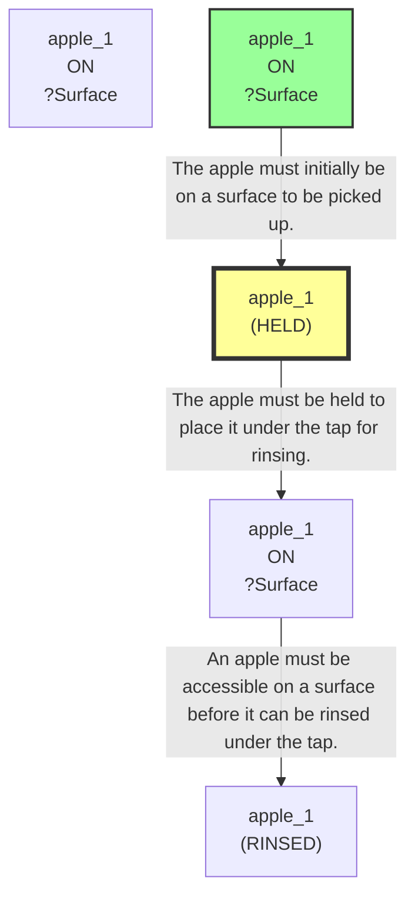
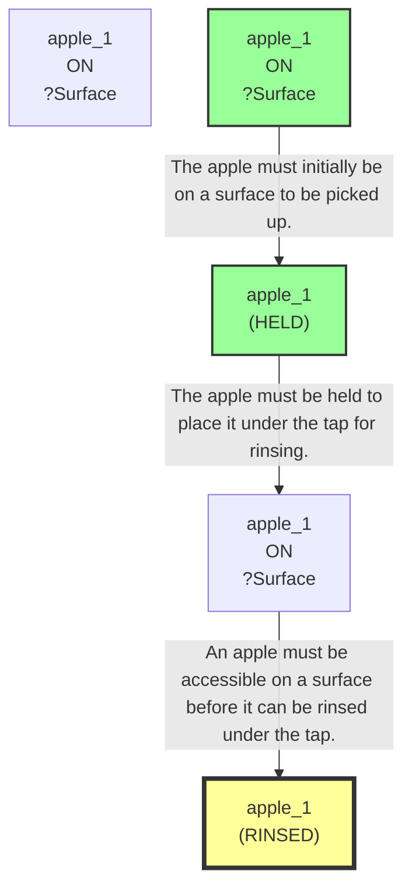

# 🚀 VirtualHome Agent Episode Log


### [GoalReasoner (Module A - Intent)] Output
```json
{
  "is_instruction_obviously_vague": false,
  "clarification_question": null,
  "target_object": "apple",
  "location_hint": "the table",
  "reasoning_chain": [
    {
      "question": "Why does the user want this object?",
      "answer": "To have one of the apples that are available on the table."
    },
    {
      "question": "Why is that important?",
      "answer": "The user likely wants a ready-to-eat piece of fruit that has been cleaned first."
    },
    {
      "question": "What fundamental need does this fulfill?",
      "answer": "It helps satisfy hunger or the desire for a snack."
    },
    {
      "question": "Are there any deeper psychological or physical motivations?",
      "answer": "The user may want a clean, convenient food item with minimal preparation."
    }
  ],
  "deep_intent": "The user wants to satisfy hunger or snack appetite with a clean, ready-to-eat food item.",
  "acceptable_alternatives_properties": [
    {
      "priority": 1,
      "description": "Other ready-to-eat fruits that can be rinsed and served, such as pears, grapes, or oranges"
    },
    {
      "priority": 2,
      "description": "Other washed, ready-to-eat fruit items or fruit portions available indoors"
    },
    {
      "priority": 3,
      "description": "Other simple snack foods that provide quick nourishment, such as crackers or granola bars"
    },
    {
      "priority": 4,
      "description": "Other fresh edible items that can be consumed with minimal preparation and satisfy hunger"
    }
  ]
}
```

### [PerceptionFilter] Output
```json
{
  "reasoning": "The goal is to get a clean, ready-to-eat apple from the table. The SDG requires the apple itself and implies it must be on a surface and held, with rinsing needed before consumption. So the minimum relevant classes are the apple target, the table location, and the washing/rinsing tools and fixture needed to clean it: sink and faucet. A washingsponge is also retained as a practical tool for rinsing/cleaning backups.",
  "selected_classes": [
    "character",
    "washingsponge",
    "crackers",
    "pie",
    "apple",
    "door",
    "sink",
    "faucet",
    "kitchentable"
  ],
  "raw_class_count": 55
}
```

### [LLMExecutor] Output
```json
{
  "reasoning": "The target apple_1 is already on the kitchen table and is dirty. To satisfy the SDG, the next required step is to pick it up so it can later be rinsed at the sink. I am currently close to the table, and grabbing is the correct immediate prerequisite before walking to the sink and washing.",
  "satisfied_nodes": [
    "N5"
  ],
  "current_node_focus": "N4",
  "mapped_variables": {
    "?Surface": "kitchentable(231)"
  },
  "action": "[grab] <apple> (437)"
}
```

### [RoboStateMultiTaskController] Output
```json
{
  "action": "[walk] <apple> (437)",
  "active_task_id": "task_1",
  "task_context": {
    "active_task_id": "task_1",
    "pending_task_ids": [],
    "satisfied_task_ids": []
  },
  "source": "llm_executor_repaired"
}
```
## Step 0
- **Action**: `[walk] <apple> (437)`
- **Action Success**: `True`
- **Action Message**: {'0': {'message': 'Success'}}
- **Active Task**: `task_1`
- **Decision Source**: `llm_executor_repaired`
- **Task Progress**: T3_without_state_alignment_G4_17=pending
- **SDG Status**:

- **Observed Items (13)**: door(224) [OPEN], kitchentable(231), sink(247), faucet(248) [OFF], washingsponge(266), pie(319), crackers(332), apple(437) [DIRTY], character(1), bathroom(11), bedroom(73), kitchen(205), livingroom(335)


### [PerceptionFilter] Output
```json
{
  "reasoning": "Reused cached class selection.",
  "selected_classes": [
    "character",
    "washingsponge",
    "crackers",
    "pie",
    "apple",
    "door",
    "sink",
    "faucet",
    "kitchentable"
  ],
  "raw_class_count": 55
}
```

### [LLMExecutor] Output
```json
{
  "reasoning": "The target apple_1 is visible on the kitchentable(231) and is currently DIRTY, so the next step toward the goal is to get near it and eventually wash it. Because I cannot grab from across the room, and the apple is already close to the character, the immediate action is to walk to the apple so that a subsequent grab can be attempted.",
  "satisfied_nodes": [
    "N5"
  ],
  "current_node_focus": "N4",
  "mapped_variables": {
    "?Surface": "kitchentable(231)"
  },
  "action": "[walk] <apple> (437)"
}
```

### [RoboStateMultiTaskController] Output
```json
{
  "action": "[walk] <apple> (437)",
  "active_task_id": "task_1",
  "task_context": {
    "active_task_id": "task_1",
    "pending_task_ids": [],
    "satisfied_task_ids": []
  },
  "source": "llm_executor"
}
```
## Step 1
- **Action**: `[walk] <apple> (437)`
- **Action Success**: `True`
- **Action Message**: {'0': {'message': 'Success'}}
- **Active Task**: `task_1`
- **Decision Source**: `llm_executor`
- **Task Progress**: T3_without_state_alignment_G4_17=pending
- **SDG Status**:

- **Observed Items (13)**: door(224) [OPEN], kitchentable(231), sink(247), faucet(248) [OFF], washingsponge(266), pie(319), crackers(332), apple(437) [DIRTY], character(1), bathroom(11), bedroom(73), kitchen(205), livingroom(335)


### [PerceptionFilter] Output
```json
{
  "reasoning": "Reused cached class selection.",
  "selected_classes": [
    "character",
    "washingsponge",
    "crackers",
    "pie",
    "apple",
    "door",
    "sink",
    "faucet",
    "kitchentable"
  ],
  "raw_class_count": 55
}
```

### [LLMExecutor] Output
```json
{
  "reasoning": "The target apple_1 is already on the kitchentable and close to the character, but it is DIRTY and must be washed before it can satisfy the RINSED state. To wash it, the first required step is to pick it up. The apple is nearby on the table, so the next atomic action should be to grab it.",
  "satisfied_nodes": [
    "N5"
  ],
  "current_node_focus": "N4",
  "mapped_variables": {},
  "action": "[grab] <apple> (437)"
}
```

### [RoboStateMultiTaskController] Output
```json
{
  "action": "[grab] <apple> (437)",
  "active_task_id": "task_1",
  "task_context": {
    "active_task_id": "task_1",
    "pending_task_ids": [],
    "satisfied_task_ids": []
  },
  "source": "llm_executor"
}
```
## Step 2
- **Action**: `[grab] <apple> (437)`
- **Action Success**: `True`
- **Action Message**: {'0': {'message': 'Success'}}
- **Active Task**: `task_1`
- **Decision Source**: `llm_executor`
- **Task Progress**: T3_without_state_alignment_G4_17=pending
- **SDG Status**:

- **Observed Items (13)**: door(224) [OPEN], kitchentable(231), sink(247), faucet(248) [OFF], washingsponge(266), pie(319), crackers(332), apple(437) [DIRTY], character(1), bathroom(11), bedroom(73), kitchen(205), livingroom(335)


### [PerceptionFilter] Output
```json
{
  "reasoning": "Reused cached class selection.",
  "selected_classes": [
    "character",
    "washingsponge",
    "crackers",
    "pie",
    "apple",
    "door",
    "sink",
    "faucet",
    "kitchentable"
  ],
  "raw_class_count": 55
}
```

### [LLMExecutor] Output
```json
{
  "reasoning": "The apple_1 is already being held in the right hand and is marked DIRTY. To satisfy the SDG, the next needed subgoal is to rinse the held apple at the sink. Before rinsing, I must be at the sink, and the sink is the correct washer/receptacle in the kitchen. The faucet is OFF, but the required next atomic step is to move to the sink first so washing can happen next.",
  "satisfied_nodes": [
    "N4",
    "N5"
  ],
  "current_node_focus": "N2",
  "mapped_variables": {
    "?Surface": "kitchentable(231)"
  },
  "action": "[walk] <sink> (247)"
}
```

### [RoboStateMultiTaskController] Output
```json
{
  "action": "[walk] <sink> (247)",
  "active_task_id": "task_1",
  "task_context": {
    "active_task_id": "task_1",
    "pending_task_ids": [],
    "satisfied_task_ids": []
  },
  "source": "llm_executor"
}
```
## Step 3
- **Action**: `[walk] <sink> (247)`
- **Action Success**: `True`
- **Action Message**: {'0': {'message': 'Success'}}
- **Active Task**: `task_1`
- **Decision Source**: `llm_executor`
- **Task Progress**: T3_without_state_alignment_G4_17=pending
- **SDG Status**:

- **Observed Items (13)**: door(224) [OPEN], kitchentable(231), sink(247), faucet(248) [OFF], washingsponge(266), pie(319), crackers(332), apple(437) [DIRTY], character(1), bathroom(11), bedroom(73), kitchen(205), livingroom(335)


### [PerceptionFilter] Output
```json
{
  "reasoning": "Reused cached class selection.",
  "selected_classes": [
    "character",
    "washingsponge",
    "crackers",
    "pie",
    "apple",
    "door",
    "sink",
    "faucet",
    "kitchentable"
  ],
  "raw_class_count": 55
}
```

### [LLMExecutor] Output
```json
{
  "reasoning": "The apple_437 is already held, and the SDG requires it to be rinsed next. The character is already close to the sink, so the next atomic step is to wash the held apple at the sink. This should satisfy the RINSED state node before any later placement goal.",
  "satisfied_nodes": [
    "N4",
    "N5"
  ],
  "current_node_focus": "N2",
  "mapped_variables": {
    "?Surface": "sink(247)"
  },
  "action": "[wash] <apple> (437)"
}
```

### [RoboStateMultiTaskController] Output
```json
{
  "action": "[wash] <apple> (437)",
  "active_task_id": "task_1",
  "task_context": {
    "active_task_id": "task_1",
    "pending_task_ids": [],
    "satisfied_task_ids": []
  },
  "source": "llm_executor"
}
```
## Step 4
- **Action**: `[wash] <apple> (437)`
- **Action Success**: `True`
- **Action Message**: Washed successfully.
- **Active Task**: `task_1`
- **Decision Source**: `llm_executor`
- **Task Progress**: T3_without_state_alignment_G4_17=done
- **SDG Status**:

- **Observed Items (13)**: door(224) [OPEN], kitchentable(231), sink(247), faucet(248) [OFF], washingsponge(266), pie(319), crackers(332), apple(437) [DIRTY], character(1), bathroom(11), bedroom(73), kitchen(205), livingroom(335)

