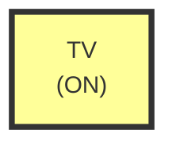

# 🚀 VirtualHome Agent Episode Log


### [GoalReasoner (Module A - Intent)] Output
```json
{
  "is_instruction_obviously_vague": true,
  "clarification_question": "Which TV do you mean, and should I turn it on now if it is off?",
  "target_object": "TV",
  "location_hint": null,
  "reasoning_chain": [
    {
      "question": "Why does the user want this object?",
      "answer": "To have the television powered on."
    },
    {
      "question": "Why is that important?",
      "answer": "So the TV can be used or viewed."
    },
    {
      "question": "What fundamental need does this fulfill?",
      "answer": "It enables access to visual/audio entertainment or information."
    },
    {
      "question": "Are there any deeper psychological or physical motivations?",
      "answer": "The user may want to watch content, stay informed, or create an active display state in the room."
    }
  ],
  "deep_intent": "Enable access to entertainment or information by powering on a display device.",
  "acceptable_alternatives_properties": [
    {
      "priority": 1,
      "description": "Other powered-on household displays or media devices that can provide the same entertainment or information function"
    },
    {
      "priority": 2,
      "description": "A different screen-based device such as a monitor, tablet, or laptop that can show content"
    },
    {
      "priority": 3,
      "description": "Any indoor device that provides audio/visual media playback"
    },
    {
      "priority": 4,
      "description": "Other ways to access the desired content, such as a radio or printed information, if the goal is mainly information rather than screen viewing"
    }
  ]
}
```

### [RoboStateMultiTaskController] Output
```json
{
  "action": "[walk] <bathroom> (11)",
  "active_task_id": "task_1",
  "task_context": {
    "active_task_id": "task_1",
    "pending_task_ids": [],
    "satisfied_task_ids": []
  },
  "source": "room_frontier"
}
```
## Step 0
- **Action**: `[walk] <bathroom> (11)`
- **Action Success**: `True`
- **Action Message**: {'0': {'message': 'Success'}}
- **Active Task**: `task_1`
- **Decision Source**: `room_frontier`
- **Task Progress**: T3_without_state_alignment_M3_12=pending
- **SDG Status**:

- **Observed Items (124)**: floor(127), floor(128), floor(129), floor(130), floor(131), floor(132), floor(133), floor(134), floor(135), ceiling(136), ceiling(137), ceiling(138), ceiling(139), ceiling(140), ceiling(141)...


### [RoboStateMultiTaskController] Output
```json
{
  "action": "[walk] <bedroom> (50)",
  "active_task_id": "task_1",
  "task_context": {
    "active_task_id": "task_1",
    "pending_task_ids": [],
    "satisfied_task_ids": []
  },
  "source": "room_frontier"
}
```
## Step 1
- **Action**: `[walk] <bedroom> (50)`
- **Action Success**: `True`
- **Action Message**: {'0': {'message': 'Success'}}
- **Active Task**: `task_1`
- **Decision Source**: `room_frontier`
- **Task Progress**: T3_without_state_alignment_M3_12=pending
- **SDG Status**:

- **Observed Items (162)**: floor(127), floor(128), floor(129), floor(130), floor(131), floor(132), floor(133), floor(134), floor(135), ceiling(136), ceiling(137), ceiling(138), ceiling(139), ceiling(140), ceiling(141)...


### [RoboStateMultiTaskController] Output
```json
{
  "action": "[walk] <livingroom> (261)",
  "active_task_id": "task_1",
  "task_context": {
    "active_task_id": "task_1",
    "pending_task_ids": [],
    "satisfied_task_ids": []
  },
  "source": "room_frontier"
}
```
## Step 2
- **Action**: `[walk] <livingroom> (261)`
- **Action Success**: `True`
- **Action Message**: {'0': {'message': 'Success'}}
- **Active Task**: `task_1`
- **Decision Source**: `room_frontier`
- **Task Progress**: T3_without_state_alignment_M3_12=pending
- **SDG Status**:

- **Observed Items (232)**: floor(127), floor(128), floor(129), floor(130), floor(131), floor(132), floor(133), floor(134), floor(135), ceiling(136), ceiling(137), ceiling(138), ceiling(139), ceiling(140), ceiling(141)...


### [PerceptionFilter] Output
```json
{
  "reasoning": "The goal is to power on the TV, so the only strictly necessary target class is the TV itself. No extra tools or locations are required by the SDG beyond the TV state change.",
  "selected_classes": [
    "door",
    "tv",
    "character",
    "radio"
  ],
  "raw_class_count": 86
}
```

### [LLMExecutor] Output
```json
{
  "reasoning": "The goal node requires TV ON, but a temporary global rule forbids turning on the TV while the master is sleeping. Since this is a blocking rule that will expire later, the correct next step is to wait until it lifts rather than interact with the TV now. Although the task intent is somewhat ambiguous about which TV, the filtered graph only contains one TV, so no clarification is necessary at this moment.",
  "satisfied_nodes": [],
  "current_node_focus": "N1",
  "mapped_variables": {
    "?TV": "tv(300)"
  },
  "action": "[wait]"
}
```

### [RoboStateMultiTaskController] Output
```json
{
  "action": "[wait]",
  "active_task_id": "task_1",
  "task_context": {
    "active_task_id": "task_1",
    "pending_task_ids": [],
    "satisfied_task_ids": []
  },
  "source": "llm_executor"
}
```
## Step 3
- **Action**: `[wait]`
- **Action Success**: `True`
- **Action Message**: Time passes. You waited for a while.
- **Active Task**: `task_1`
- **Decision Source**: `llm_executor`
- **Task Progress**: T3_without_state_alignment_M3_12=pending
- **SDG Status**:

- **Observed Items (10)**: door(145) [OPEN], door(146) [OPEN], character(1), bathroom(11), bedroom(50), kitchen(126), livingroom(261), door(47) [OPEN], radio(100) [OFF], tv(300) [OFF]


### [PerceptionFilter] Output
```json
{
  "reasoning": "Reused cached class selection.",
  "selected_classes": [
    "door",
    "tv",
    "character",
    "radio"
  ],
  "raw_class_count": 86
}
```

### [LLMExecutor] Output
```json
{
  "reasoning": "The goal node requires the TV to be ON, but there is an active global rule forbidding turning on the TV while the master is sleeping. This is a temporary blocking condition that should expire at step 6. Since no other action can progress the TV state safely right now, the correct next step is to wait.",
  "satisfied_nodes": [],
  "current_node_focus": "N1",
  "mapped_variables": {
    "?TV": "tv(300)"
  },
  "action": "[wait]"
}
```

### [RoboStateMultiTaskController] Output
```json
{
  "action": "[wait]",
  "active_task_id": "task_1",
  "task_context": {
    "active_task_id": "task_1",
    "pending_task_ids": [],
    "satisfied_task_ids": []
  },
  "source": "llm_executor"
}
```
## Step 4
- **Action**: `[wait]`
- **Action Success**: `True`
- **Action Message**: Time passes. You waited for a while.
- **Active Task**: `task_1`
- **Decision Source**: `llm_executor`
- **Task Progress**: T3_without_state_alignment_M3_12=pending
- **SDG Status**:

- **Observed Items (10)**: door(145) [OPEN], door(146) [OPEN], character(1), bathroom(11), bedroom(50), kitchen(126), livingroom(261), door(47) [OPEN], radio(100) [OFF], tv(300) [OFF]


### [PerceptionFilter] Output
```json
{
  "reasoning": "Reused cached class selection.",
  "selected_classes": [
    "door",
    "tv",
    "character",
    "radio"
  ],
  "raw_class_count": 86
}
```

### [LLMExecutor] Output
```json
{
  "reasoning": "The instruction is explicitly vague, and the active global rule temporarily forbids turning on the TV while the master is sleeping. Since clarification is available once and the goal node cannot be progressed legally now, I should ask the user which TV they mean and whether to turn it on once allowed.",
  "satisfied_nodes": [],
  "current_node_focus": "N1",
  "mapped_variables": {
    "?TV": "tv(300)"
  },
  "action": "[ask] Which TV do you mean, and should I turn it on now if it is off?"
}
```

### [RoboStateMultiTaskController] Output
```json
{
  "action": "[ask] Which TV do you mean, and should I turn it on now if it is off?",
  "active_task_id": "task_1",
  "task_context": {
    "active_task_id": "task_1",
    "pending_task_ids": [],
    "satisfied_task_ids": []
  },
  "source": "llm_executor"
}
```
## Step 5
- **Action**: `[ask] Which TV do you mean, and should I turn it on now if it is off?`
- **Action Success**: `True`
- **Action Message**: nothing to claim
- **Active Task**: `task_1`
- **Decision Source**: `llm_executor`
- **Task Progress**: T3_without_state_alignment_M3_12=pending
- **SDG Status**:

- **Observed Items (10)**: door(145) [OPEN], door(146) [OPEN], character(1), bathroom(11), bedroom(50), kitchen(126), livingroom(261), door(47) [OPEN], radio(100) [OFF], tv(300) [OFF]


### [PerceptionFilter] Output
```json
{
  "reasoning": "Reused cached class selection.",
  "selected_classes": [
    "door",
    "tv",
    "character",
    "radio"
  ],
  "raw_class_count": 86
}
```

### [LLMExecutor] Output
```json
{
  "reasoning": "The task is to turn on the TV, and the Filtered Graph shows a specific candidate tv(300) in the livingroom with state OFF and the required HAS_SWITCH/HAS_PLUG properties. To interact with its switch, I must first be near it. No clarification is allowed anymore, so I will autonomously proceed with a walk to the TV.",
  "satisfied_nodes": [],
  "current_node_focus": "N1",
  "mapped_variables": {},
  "action": "[walk] <tv> (300)"
}
```

### [RoboStateMultiTaskController] Output
```json
{
  "action": "[walk] <tv> (300)",
  "active_task_id": "task_1",
  "task_context": {
    "active_task_id": "task_1",
    "pending_task_ids": [],
    "satisfied_task_ids": []
  },
  "source": "llm_executor"
}
```
## Step 6
- **Action**: `[walk] <tv> (300)`
- **Action Success**: `True`
- **Action Message**: {'0': {'message': 'Success'}}
- **Active Task**: `task_1`
- **Decision Source**: `llm_executor`
- **Task Progress**: T3_without_state_alignment_M3_12=pending
- **SDG Status**:

- **Observed Items (10)**: door(145) [OPEN], door(146) [OPEN], character(1), bathroom(11), bedroom(50), kitchen(126), livingroom(261), door(47) [OPEN], radio(100) [OFF], tv(300) [OFF]


### [PerceptionFilter] Output
```json
{
  "reasoning": "Reused cached class selection.",
  "selected_classes": [
    "door",
    "tv",
    "character",
    "radio"
  ],
  "raw_class_count": 86
}
```

### [LLMExecutor] Output
```json
{
  "reasoning": "The active SDG only requires the TV to be ON. The current graph shows tv(300) is OFF and close to the character, so no walk is needed before switching it on. This directly satisfies the only node N1.",
  "satisfied_nodes": [],
  "current_node_focus": "N1",
  "mapped_variables": {},
  "action": "[switchon] <tv> (300)"
}
```

### [RoboStateMultiTaskController] Output
```json
{
  "action": "[switchon] <tv> (300)",
  "active_task_id": "task_1",
  "task_context": {
    "active_task_id": "task_1",
    "pending_task_ids": [],
    "satisfied_task_ids": []
  },
  "source": "llm_executor"
}
```
## Step 7
- **Action**: `[switchon] <tv> (300)`
- **Action Success**: `True`
- **Action Message**: Faked switch operation in Python layer (bypassed Unity failure)
- **Active Task**: `task_1`
- **Decision Source**: `llm_executor`
- **Task Progress**: T3_without_state_alignment_M3_12=done
- **SDG Status**:

- **Observed Items (10)**: door(145) [OPEN], door(146) [OPEN], character(1), bathroom(11), bedroom(50), kitchen(126), livingroom(261), door(47) [OPEN], radio(100) [OFF], tv(300) [OFF]

