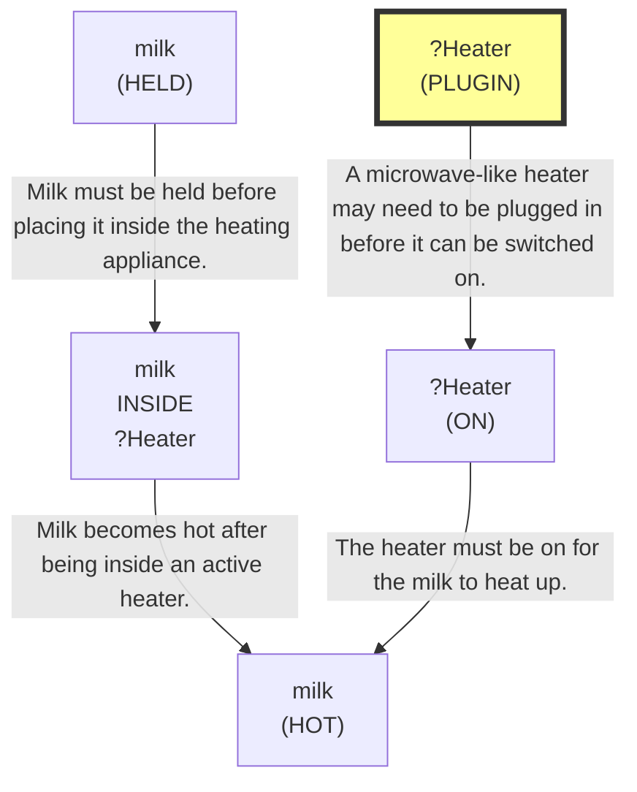

# 🚀 VirtualHome Agent Episode Log


### [GoalReasoner (Module A - Intent)] Output
```json
{
  "is_instruction_obviously_vague": false,
  "clarification_question": null,
  "target_object": "milk",
  "location_hint": null,
  "reasoning_chain": [
    {
      "question": "Why does the user want this object?",
      "answer": "They want the milk to be warmed if it is currently cold."
    },
    {
      "question": "Why is that important?",
      "answer": "So the milk reaches a more suitable temperature for the intended use."
    },
    {
      "question": "What fundamental need does this fulfill?",
      "answer": "It fulfills the need for a beverage or ingredient to be at a usable, warmer temperature."
    },
    {
      "question": "Are there any deeper psychological or physical motivations?",
      "answer": "The motivation is likely comfort, preference, or practicality in preparing something to drink or use."
    }
  ],
  "deep_intent": "The user wants a cold beverage to be warmed to a more usable temperature.",
  "acceptable_alternatives_properties": [
    {
      "priority": 1,
      "description": "Other cold drinks or liquid foods that can be safely heated, such as hot chocolate, broth, or coffee."
    },
    {
      "priority": 2,
      "description": "Dairy or non-dairy beverages that serve a similar warming purpose, such as cream-based drinks or plant-based milk."
    },
    {
      "priority": 3,
      "description": "Ready-to-heat liquid foods or drinks that provide warmth and comfort."
    },
    {
      "priority": 4,
      "description": "Other warm beverages that satisfy the same need for a heated drink, such as tea or warm water."
    }
  ]
}
```

### [PerceptionFilter] Output
```json
{
  "reasoning": "The goal is to warm milk, so the target object milk must be kept. The SDG shows the milk must be placed inside an active heater that is plugged in, so the necessary heating appliance is microwave. To satisfy the plug-in requirement, powersocket is also needed. No other objects are strictly required.",
  "selected_classes": [
    "milk",
    "microwave",
    "powersocket",
    "character"
  ],
  "raw_class_count": 50
}
```

### [LLMExecutor] Output
```json
{
  "reasoning": "The milk target is not uniquely achievable right now with the only heater available because the microwave is temporarily occupied and the active global rule explicitly forbids using or opening it until step 6. Since this blocks the immediate heating path and the task can proceed once the ban expires, the correct next atomic action is to wait.",
  "satisfied_nodes": [],
  "current_node_focus": "N3",
  "mapped_variables": {
    "?Heater": "microwave(171)"
  },
  "action": "[wait]"
}
```

### [RoboStateMultiTaskController] Output
```json
{
  "action": "[wait]",
  "active_task_id": "task_1",
  "task_context": {
    "active_task_id": "task_1",
    "pending_task_ids": [],
    "satisfied_task_ids": []
  },
  "source": "llm_executor"
}
```
## Step 0
- **Action**: `[wait]`
- **Action Success**: `True`
- **Action Message**: Time passes. You waited for a while.
- **Active Task**: `task_1`
- **Decision Source**: `llm_executor`
- **Task Progress**: T3_without_state_alignment_M3_15=pending
- **SDG Status**:

- **Observed Items (10)**: powersocket(57), microwave(171) [CLOSED,OFF], milk(177) [COLD,CLOSED], milk(176) [COLD,CLOSED], character(1), kitchen(11), livingroom(183), bedroom(241), bathroom(285), bedroom(346)


### [PerceptionFilter] Output
```json
{
  "reasoning": "Reused cached class selection.",
  "selected_classes": [
    "milk",
    "microwave",
    "powersocket",
    "character"
  ],
  "raw_class_count": 50
}
```

### [LLMExecutor] Output
```json
{
  "reasoning": "The active task is to warm milk to HOT. The only heater that fits the SDG is microwave(171), but there is an active global rule forbidding use/opening because it is occupied by someone else until step 6. Since this is a temporary dynamic restriction, the correct move is to wait for the restriction to expire rather than interact with the microwave or the milk prematurely.",
  "satisfied_nodes": [],
  "current_node_focus": "N3",
  "mapped_variables": {
    "?Heater": "microwave(171)"
  },
  "action": "[wait]"
}
```

### [RoboStateMultiTaskController] Output
```json
{
  "action": "[wait]",
  "active_task_id": "task_1",
  "task_context": {
    "active_task_id": "task_1",
    "pending_task_ids": [],
    "satisfied_task_ids": []
  },
  "source": "llm_executor"
}
```
## Step 1
- **Action**: `[wait]`
- **Action Success**: `True`
- **Action Message**: Time passes. You waited for a while.
- **Active Task**: `task_1`
- **Decision Source**: `llm_executor`
- **Task Progress**: T3_without_state_alignment_M3_15=pending
- **SDG Status**:

- **Observed Items (10)**: powersocket(57), microwave(171) [CLOSED,OFF], milk(177) [COLD,CLOSED], milk(176) [COLD,CLOSED], character(1), kitchen(11), livingroom(183), bedroom(241), bathroom(285), bedroom(346)


### [PerceptionFilter] Output
```json
{
  "reasoning": "Reused cached class selection.",
  "selected_classes": [
    "milk",
    "microwave",
    "powersocket",
    "character"
  ],
  "raw_class_count": 50
}
```

### [LLMExecutor] Output
```json
{
  "reasoning": "The goal is to make milk hot, but the only heater in view is microwave(171), which is currently blocked by a temporary global rule saying it is occupied by someone else and must not be used or opened until step 6. Since this directly blocks the required heating sequence and no alternative heater is visible in the current graph, the correct next atomic action is to wait for the temporary ban to expire.",
  "satisfied_nodes": [],
  "current_node_focus": "N3",
  "mapped_variables": {
    "?Heater": "microwave(171)"
  },
  "action": "[wait]"
}
```

### [RoboStateMultiTaskController] Output
```json
{
  "action": "[wait]",
  "active_task_id": "task_1",
  "task_context": {
    "active_task_id": "task_1",
    "pending_task_ids": [],
    "satisfied_task_ids": []
  },
  "source": "llm_executor"
}
```
## Step 2
- **Action**: `[wait]`
- **Action Success**: `True`
- **Action Message**: Time passes. You waited for a while.
- **Active Task**: `task_1`
- **Decision Source**: `llm_executor`
- **Task Progress**: T3_without_state_alignment_M3_15=pending
- **SDG Status**:

- **Observed Items (10)**: powersocket(57), microwave(171) [CLOSED,OFF], milk(177) [COLD,CLOSED], milk(176) [COLD,CLOSED], character(1), kitchen(11), livingroom(183), bedroom(241), bathroom(285), bedroom(346)


### [PerceptionFilter] Output
```json
{
  "reasoning": "Reused cached class selection.",
  "selected_classes": [
    "milk",
    "microwave",
    "powersocket",
    "character"
  ],
  "raw_class_count": 50
}
```

### [LLMExecutor] Output
```json
{
  "reasoning": "The SDG requires heating milk, but the only heater in the graph is microwave(171), and there is an active global rule forbidding use/opening because it is occupied by someone else. Since this blocks all progress toward N2/N3/N4 and the rule is temporary, the correct next step is to wait until the restriction expires.",
  "satisfied_nodes": [],
  "current_node_focus": "N3",
  "mapped_variables": {
    "?Heater": "microwave(171)"
  },
  "action": "[wait]"
}
```

### [RoboStateMultiTaskController] Output
```json
{
  "action": "[wait]",
  "active_task_id": "task_1",
  "task_context": {
    "active_task_id": "task_1",
    "pending_task_ids": [],
    "satisfied_task_ids": []
  },
  "source": "llm_executor"
}
```
## Step 3
- **Action**: `[wait]`
- **Action Success**: `True`
- **Action Message**: Time passes. You waited for a while.
- **Active Task**: `task_1`
- **Decision Source**: `llm_executor`
- **Task Progress**: T3_without_state_alignment_M3_15=pending
- **SDG Status**:

- **Observed Items (10)**: powersocket(57), microwave(171) [CLOSED,OFF], milk(177) [COLD,CLOSED], milk(176) [COLD,CLOSED], character(1), kitchen(11), livingroom(183), bedroom(241), bathroom(285), bedroom(346)


### [PerceptionFilter] Output
```json
{
  "reasoning": "Reused cached class selection.",
  "selected_classes": [
    "milk",
    "microwave",
    "powersocket",
    "character"
  ],
  "raw_class_count": 50
}
```

### [LLMExecutor] Output
```json
{
  "reasoning": "The goal is to get milk hot. The only heater in the graph is microwave(171), but it is currently blocked by an active global rule saying it is occupied by someone else and must not be used or opened until step 6. Since I cannot make progress toward N3/N2/N4 right now, the correct next atomic action is to wait for the temporary restriction to expire.",
  "satisfied_nodes": [],
  "current_node_focus": "N3",
  "mapped_variables": {
    "?Heater": "microwave(171)"
  },
  "action": "[wait]"
}
```

### [RoboStateMultiTaskController] Output
```json
{
  "action": "[wait]",
  "active_task_id": "task_1",
  "task_context": {
    "active_task_id": "task_1",
    "pending_task_ids": [],
    "satisfied_task_ids": []
  },
  "source": "llm_executor"
}
```
