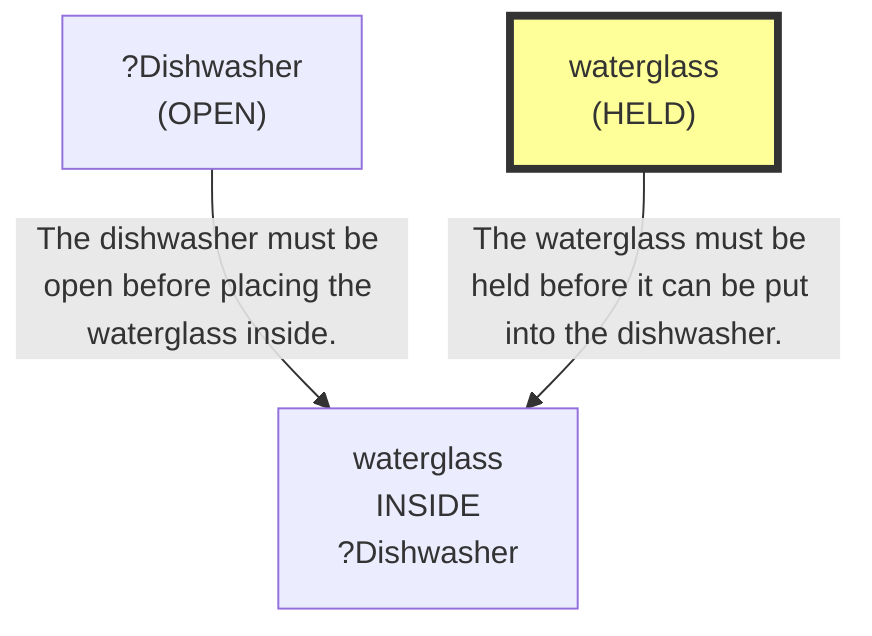
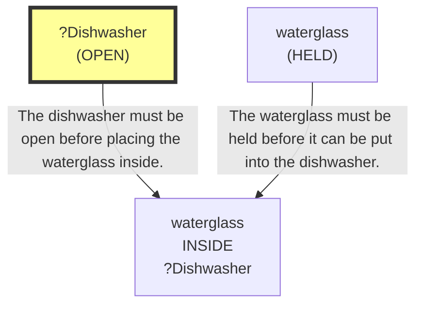
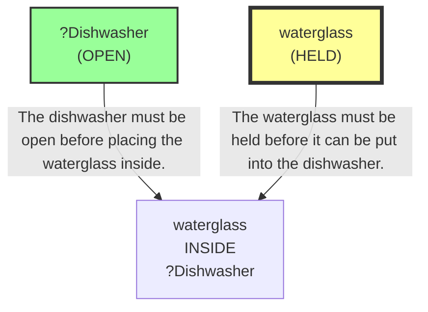
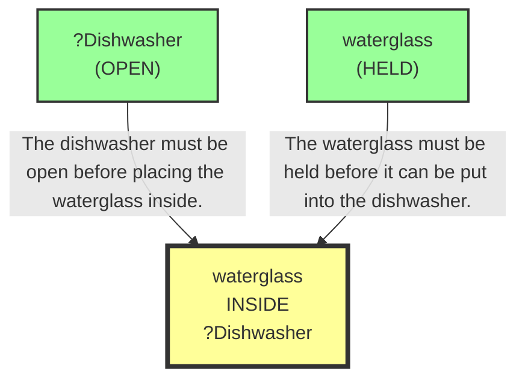

# 🚀 VirtualHome Agent Episode Log


### [GoalReasoner (Module A - Intent)] Output
```json
{
  "is_instruction_obviously_vague": false,
  "clarification_question": null,
  "target_object": "waterglass",
  "location_hint": "dishwasher",
  "reasoning_chain": [
    {
      "question": "Why does the user want this object?",
      "answer": "To have the used glass cleaned and stored in the proper place."
    },
    {
      "question": "Why is that important?",
      "answer": "So the item is no longer left out after use and can be washed with other dishes."
    },
    {
      "question": "What fundamental need does this fulfill?",
      "answer": "It fulfills the need to tidy up after use and keep dishes clean."
    },
    {
      "question": "Are there any deeper psychological or physical motivations?",
      "answer": "The user likely wants to reduce clutter and ensure the used item is cleaned for future use."
    }
  ],
  "deep_intent": "The user wants to clean up after use by placing a used drinking vessel for washing.",
  "acceptable_alternatives_properties": [
    {
      "priority": 1,
      "description": "Other used drinkware, such as a cup, mug, or tumbler, that can be placed in the dishwasher."
    },
    {
      "priority": 2,
      "description": "Other washable kitchenware items of similar size, such as a small bowl or plate, if they are also meant to be cleaned."
    },
    {
      "priority": 3,
      "description": "Additional dirty dishes or utensils that belong in the dishwasher."
    },
    {
      "priority": 4,
      "description": "Other items needing cleanup in the kitchen area, such as reusable food containers, if they are dishwasher-safe."
    }
  ]
}
```

### [PerceptionFilter] Output
```json
{
  "reasoning": "Needed items are the target waterglass and the dishwasher location/receptacle implied by the goal and SDG. The dishwasher must be included as the place the glass goes, and the waterglass must be selected exactly as specified. No other objects are necessary for this cleanup task.",
  "selected_classes": [
    "dishwasher",
    "plate",
    "character",
    "waterglass"
  ],
  "raw_class_count": 50
}
```

### [LLMExecutor] Output
```json
{
  "reasoning": "The target waterglass must be held before it can be put into the dishwasher. Among available waterglasses, waterglass(64) is dirty but close to the character, making it a valid target for the task. I cannot put it in yet because the required precondition N3 (HELD) is not satisfied. The next atomic step is to walk to the chosen waterglass so it can be grabbed on the following action.",
  "satisfied_nodes": [],
  "current_node_focus": "N3",
  "mapped_variables": {},
  "action": "[walk] <waterglass> (64)"
}
```

### [RoboStateMultiTaskController] Output
```json
{
  "action": "[walk] <waterglass> (64)",
  "active_task_id": "task_1",
  "task_context": {
    "active_task_id": "task_1",
    "pending_task_ids": [],
    "satisfied_task_ids": []
  },
  "source": "llm_executor"
}
```
## Step 0
- **Action**: `[walk] <waterglass> (64)`
- **Action Success**: `True`
- **Action Message**: {'0': {'message': 'Success'}}
- **Active Task**: `task_1`
- **Decision Source**: `llm_executor`
- **Task Progress**: T3_without_state_alignment_M4_16=pending
- **SDG Status**:

- **Observed Items (24)**: waterglass(64) [DIRTY,EMPTY], plate(67), plate(68), waterglass(71) [CLEAN,EMPTY], waterglass(72) [DIRTY,FILLED_MILK], plate(75), plate(76), waterglass(79), waterglass(80), plate(83), plate(84), waterglass(87), waterglass(88), plate(91), waterglass(100)...


### [PerceptionFilter] Output
```json
{
  "reasoning": "Reused cached class selection.",
  "selected_classes": [
    "dishwasher",
    "plate",
    "character",
    "waterglass"
  ],
  "raw_class_count": 50
}
```

### [LLMExecutor] Output
```json
{
  "reasoning": "The target is a used waterglass to be placed in the dishwasher. The relevant SDG requires the dishwasher to be OPEN and the waterglass to be HELD before it can be put inside. In the current graph, dishwasher(165) is CLOSED, so the next prerequisite action is to open it. I am selecting the dishwasher object as the binding for ?Dishwasher.",
  "satisfied_nodes": [],
  "current_node_focus": "N2",
  "mapped_variables": {
    "?Dishwasher": "dishwasher(165)"
  },
  "action": "[open] <dishwasher> (165)"
}
```

### [RoboStateMultiTaskController] Output
```json
{
  "action": "[walk] <dishwasher> (165)",
  "active_task_id": "task_1",
  "task_context": {
    "active_task_id": "task_1",
    "pending_task_ids": [],
    "satisfied_task_ids": []
  },
  "source": "llm_executor_repaired"
}
```
## Step 1
- **Action**: `[walk] <dishwasher> (165)`
- **Action Success**: `True`
- **Action Message**: {'0': {'message': 'Success'}}
- **Active Task**: `task_1`
- **Decision Source**: `llm_executor_repaired`
- **Task Progress**: T3_without_state_alignment_M4_16=pending
- **SDG Status**:

- **Observed Items (24)**: waterglass(64) [DIRTY,EMPTY], plate(67), plate(68), waterglass(71) [CLEAN,EMPTY], waterglass(72) [DIRTY,FILLED_MILK], plate(75), plate(76), waterglass(79), waterglass(80), plate(83), plate(84), waterglass(87), waterglass(88), plate(91), waterglass(100)...


### [PerceptionFilter] Output
```json
{
  "reasoning": "Reused cached class selection.",
  "selected_classes": [
    "dishwasher",
    "plate",
    "character",
    "waterglass"
  ],
  "raw_class_count": 50
}
```

### [LLMExecutor] Output
```json
{
  "reasoning": "The target waterglass to clean up is most plausibly waterglass(64): it is a used drinking vessel (DIRTY, EMPTY) and matches the goal of placing a used glass in the dishwasher. The dishwasher(165) is currently CLOSED, so the next prerequisite toward putting the glass inside is to open it. I am already close to the dishwasher, so I can interact with it directly.",
  "satisfied_nodes": [],
  "current_node_focus": "N2",
  "mapped_variables": {
    "?Dishwasher": "dishwasher(165)"
  },
  "action": "[open] <dishwasher> (165)"
}
```

### [RoboStateMultiTaskController] Output
```json
{
  "action": "[open] <dishwasher> (165)",
  "active_task_id": "task_1",
  "task_context": {
    "active_task_id": "task_1",
    "pending_task_ids": [],
    "satisfied_task_ids": []
  },
  "source": "llm_executor"
}
```
## Step 2
- **Action**: `[open] <dishwasher> (165)`
- **Action Success**: `True`
- **Action Message**: {'0': {'message': 'Success'}}
- **Active Task**: `task_1`
- **Decision Source**: `llm_executor`
- **Task Progress**: T3_without_state_alignment_M4_16=pending
- **SDG Status**:

- **Observed Items (24)**: waterglass(64) [DIRTY,EMPTY], plate(67), plate(68), waterglass(71) [CLEAN,EMPTY], waterglass(72) [DIRTY,FILLED_MILK], plate(75), plate(76), waterglass(79), waterglass(80), plate(83), plate(84), waterglass(87), waterglass(88), plate(91), waterglass(100)...


### [PerceptionFilter] Output
```json
{
  "reasoning": "Reused cached class selection.",
  "selected_classes": [
    "dishwasher",
    "plate",
    "character",
    "waterglass"
  ],
  "raw_class_count": 50
}
```

### [LLMExecutor] Output
```json
{
  "reasoning": "The SDG requires a waterglass to be held and then placed inside the dishwasher. The dishwasher(165) is already OPEN, so N2 is satisfied. No waterglass is currently held, so N3 is unsatisfied. The best match for the target waterglass is waterglass(64) because it is a used glass: DIRTY and EMPTY. The single next step must be to move close to that specific glass before grabbing it.",
  "satisfied_nodes": [
    "N2"
  ],
  "current_node_focus": "N3",
  "mapped_variables": {
    "?Dishwasher": "dishwasher(165)"
  },
  "action": "[walk] <waterglass> (64)"
}
```

### [RoboStateMultiTaskController] Output
```json
{
  "action": "[walk] <waterglass> (64)",
  "active_task_id": "task_1",
  "task_context": {
    "active_task_id": "task_1",
    "pending_task_ids": [],
    "satisfied_task_ids": []
  },
  "source": "llm_executor"
}
```
## Step 3
- **Action**: `[walk] <waterglass> (64)`
- **Action Success**: `True`
- **Action Message**: {'0': {'message': 'Success'}}
- **Active Task**: `task_1`
- **Decision Source**: `llm_executor`
- **Task Progress**: T3_without_state_alignment_M4_16=pending
- **SDG Status**:

- **Observed Items (24)**: waterglass(64) [DIRTY,EMPTY], plate(67), plate(68), waterglass(71) [CLEAN,EMPTY], waterglass(72) [DIRTY,FILLED_MILK], plate(75), plate(76), waterglass(79), waterglass(80), plate(83), plate(84), waterglass(87), waterglass(88), plate(91), waterglass(100)...


### [PerceptionFilter] Output
```json
{
  "reasoning": "Reused cached class selection.",
  "selected_classes": [
    "dishwasher",
    "plate",
    "character",
    "waterglass"
  ],
  "raw_class_count": 50
}
```

### [LLMExecutor] Output
```json
{
  "reasoning": "The SDG requires the waterglass to be held and then placed inside an open dishwasher. The dishwasher(165) is already OPEN, satisfying N2. The current graph shows waterglass(64) is DIRTY and CLOSE to the character, making it the best bind for the requested used waterglass; however, before we can put it in the dishwasher we must first hold it, and for a dirty item the task can still proceed by grabbing it now. Since we are already close to waterglass(64), the next step toward N3 is to grab it.",
  "satisfied_nodes": [
    "N2"
  ],
  "current_node_focus": "N3",
  "mapped_variables": {
    "?Dishwasher": "dishwasher(165)"
  },
  "action": "[grab] <waterglass> (64)"
}
```

### [RoboStateMultiTaskController] Output
```json
{
  "action": "[grab] <waterglass> (64)",
  "active_task_id": "task_1",
  "task_context": {
    "active_task_id": "task_1",
    "pending_task_ids": [],
    "satisfied_task_ids": []
  },
  "source": "llm_executor"
}
```
## Step 4
- **Action**: `[grab] <waterglass> (64)`
- **Action Success**: `True`
- **Action Message**: {'0': {'message': 'Success'}}
- **Active Task**: `task_1`
- **Decision Source**: `llm_executor`
- **Task Progress**: T3_without_state_alignment_M4_16=pending
- **SDG Status**:

- **Observed Items (24)**: waterglass(64) [DIRTY,EMPTY], plate(67), plate(68), waterglass(71) [CLEAN,EMPTY], waterglass(72) [DIRTY,FILLED_MILK], plate(75), plate(76), waterglass(79), waterglass(80), plate(83), plate(84), waterglass(87), waterglass(88), plate(91), waterglass(100)...


### [PerceptionFilter] Output
```json
{
  "reasoning": "Reused cached class selection.",
  "selected_classes": [
    "dishwasher",
    "plate",
    "character",
    "waterglass"
  ],
  "raw_class_count": 50
}
```

### [LLMExecutor] Output
```json
{
  "reasoning": "The goal requires the waterglass to be HELD and then placed inside the dishwasher, which is already OPEN. The current graph shows character(1) is already holding waterglass(64), but the glass is DIRTY. Since the SDG only requires holding and placing it in the dishwasher, the next required step is to move to the dishwasher before any put-in action can be attempted. I will target the dishwasher(165) as ?Dishwasher.",
  "satisfied_nodes": [
    "N2",
    "N3"
  ],
  "current_node_focus": "N1",
  "mapped_variables": {
    "?Dishwasher": "dishwasher(165)"
  },
  "action": "[walk] <dishwasher> (165)"
}
```

### [RoboStateMultiTaskController] Output
```json
{
  "action": "[walk] <dishwasher> (165)",
  "active_task_id": "task_1",
  "task_context": {
    "active_task_id": "task_1",
    "pending_task_ids": [],
    "satisfied_task_ids": []
  },
  "source": "llm_executor"
}
```
## Step 5
- **Action**: `[walk] <dishwasher> (165)`
- **Action Success**: `True`
- **Action Message**: {'0': {'message': 'Success'}}
- **Active Task**: `task_1`
- **Decision Source**: `llm_executor`
- **Task Progress**: T3_without_state_alignment_M4_16=pending
- **SDG Status**:

- **Observed Items (24)**: waterglass(64) [DIRTY,EMPTY], plate(67), plate(68), waterglass(71) [CLEAN,EMPTY], waterglass(72) [DIRTY,FILLED_MILK], plate(75), plate(76), waterglass(79), waterglass(80), plate(83), plate(84), waterglass(87), waterglass(88), plate(91), waterglass(100)...


### [PerceptionFilter] Output
```json
{
  "reasoning": "Reused cached class selection.",
  "selected_classes": [
    "dishwasher",
    "plate",
    "character",
    "waterglass"
  ],
  "raw_class_count": 50
}
```

### [LLMExecutor] Output
```json
{
  "reasoning": "The active goal is to place the used waterglass into the dishwasher. The current graph already shows dishwasher(165) is OPEN and the character is holding waterglass(64), so the remaining gap is to put the held glass inside the dishwasher. Because the destination is already open and the glass is already held, the next atomic step is to insert it into the dishwasher.",
  "satisfied_nodes": [
    "N2",
    "N3"
  ],
  "current_node_focus": "N1",
  "mapped_variables": {
    "?Dishwasher": "dishwasher(165)"
  },
  "action": "[putin] <waterglass> (64) <dishwasher> (165)"
}
```

### [RoboStateMultiTaskController] Output
```json
{
  "action": "[putin] <waterglass> (64) <dishwasher> (165)",
  "active_task_id": "task_1",
  "task_context": {
    "active_task_id": "task_1",
    "pending_task_ids": [],
    "satisfied_task_ids": []
  },
  "source": "llm_executor"
}
```
## Step 6
- **Action**: `[putin] <waterglass> (64) <dishwasher> (165)`
- **Action Success**: `True`
- **Action Message**: {'0': {'message': 'Success'}}
- **Active Task**: `task_1`
- **Decision Source**: `llm_executor`
- **Task Progress**: T3_without_state_alignment_M4_16=done
- **SDG Status**:

- **Observed Items (24)**: waterglass(64) [DIRTY,EMPTY], plate(67), plate(68), waterglass(71) [CLEAN,EMPTY], waterglass(72) [DIRTY,FILLED_MILK], plate(75), plate(76), waterglass(79), waterglass(80), plate(83), plate(84), waterglass(87), waterglass(88), plate(91), waterglass(100)...

