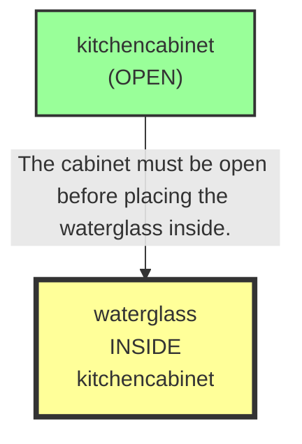

# 🚀 VirtualHome Agent Episode Log


### [GoalReasoner (Module A - Intent)] Output
```json
{
  "is_instruction_obviously_vague": false,
  "clarification_question": null,
  "target_object": "waterglass",
  "location_hint": "kitchencabinet",
  "reasoning_chain": [
    {
      "question": "Why does the user want this object placed inside the cabinet?",
      "answer": "To store the washed drinking glass in its intended indoor storage location."
    },
    {
      "question": "Why is that important?",
      "answer": "It keeps the glass organized, accessible, and out of the way after washing."
    },
    {
      "question": "What fundamental need does this fulfill?",
      "answer": "The need to organize and store a clean household item properly."
    },
    {
      "question": "Are there any deeper psychological or physical motivations?",
      "answer": "It may support tidiness, reduce clutter, and maintain a clean kitchen environment."
    }
  ],
  "deep_intent": "The user wants to store a clean household item in an appropriate indoor storage space.",
  "acceptable_alternatives_properties": [
    {
      "priority": 1,
      "description": "Other clean drinking containers or glassware that belong in the same cabinet, such as cups or tumblers"
    },
    {
      "priority": 2,
      "description": "Other clean kitchen storage items that are normally kept in cabinets, such as mugs or small bowls"
    },
    {
      "priority": 3,
      "description": "Other clean dishware that can be put away in the kitchen, such as plates or utensils"
    },
    {
      "priority": 4,
      "description": "Other clean household items that need organized indoor storage in a nearby cabinet or shelf"
    }
  ]
}
```

### [PerceptionFilter] Output
```json
{
  "reasoning": "The goal is to store the target waterglass inside the kitchencabinet, and the SDG requires that cabinet to be open. No extra tools are needed beyond the target and the destination container.",
  "selected_classes": [
    "plate",
    "door",
    "character",
    "kitchencabinet",
    "waterglass"
  ],
  "raw_class_count": 50
}
```

### [LLMExecutor] Output
```json
{
  "reasoning": "The SDG requires the waterglass to be inside an open kitchencabinet. The cabinet is already OPEN in the current graph, so N2 is satisfied. The target object waterglass(64) is clean, empty, grabbable, and close to the character, making it the best match for the required waterglass. To place it into the cabinet, I must first be near the cabinet before any putin action, and no grab has occurred yet. The next step is to walk to the open kitchencabinet(138), which is a valid cabinet target among the open cabinets.",
  "satisfied_nodes": [
    "N2"
  ],
  "current_node_focus": "N1",
  "mapped_variables": {
    "?Container": "kitchencabinet(138)"
  },
  "action": "[walk] <kitchencabinet> (138)"
}
```

### [RoboStateMultiTaskController] Output
```json
{
  "action": "[walk] <kitchencabinet> (138)",
  "active_task_id": "task_1",
  "task_context": {
    "active_task_id": "task_1",
    "pending_task_ids": [],
    "satisfied_task_ids": []
  },
  "source": "llm_executor"
}
```
## Step 0
- **Action**: `[walk] <kitchencabinet> (138)`
- **Action Success**: `True`
- **Action Message**: {'0': {'message': 'Success'}}
- **Active Task**: `task_1`
- **Decision Source**: `llm_executor`
- **Task Progress**: T3_without_state_alignment_M4_17=pending
- **SDG Status**:

- **Observed Items (32)**: door(47) [OPEN], waterglass(64) [CLEAN,EMPTY], plate(67), plate(68), waterglass(71) [DIRTY], waterglass(72) [DIRTY], plate(75), plate(76), waterglass(79), waterglass(80), plate(83), plate(84), waterglass(87), waterglass(88), plate(91)...


### [PerceptionFilter] Output
```json
{
  "reasoning": "Reused cached class selection.",
  "selected_classes": [
    "plate",
    "door",
    "character",
    "kitchencabinet",
    "waterglass"
  ],
  "raw_class_count": 50
}
```

### [LLMExecutor] Output
```json
{
  "reasoning": "The goal requires the waterglass to be inside a kitchen cabinet, and the cabinet must be open. In the current graph, several kitchencabinet instances are already OPEN. The clean waterglass(64) is a valid target and is inside the kitchen, but to place it into the cabinet I must first be near the chosen open cabinet. The most appropriate next step is to walk to an open kitchencabinet, selecting one that is open and not currently closed to the character; kitchencabinet(140) is open and available.",
  "satisfied_nodes": [
    "N2"
  ],
  "current_node_focus": "N1",
  "mapped_variables": {
    "?Container": "kitchencabinet(140)"
  },
  "action": "[walk] <kitchencabinet> (140)"
}
```

### [RoboStateMultiTaskController] Output
```json
{
  "action": "[walk] <kitchencabinet> (140)",
  "active_task_id": "task_1",
  "task_context": {
    "active_task_id": "task_1",
    "pending_task_ids": [],
    "satisfied_task_ids": []
  },
  "source": "llm_executor"
}
```
## Step 1
- **Action**: `[walk] <kitchencabinet> (140)`
- **Action Success**: `True`
- **Action Message**: {'0': {'message': 'Success'}}
- **Active Task**: `task_1`
- **Decision Source**: `llm_executor`
- **Task Progress**: T3_without_state_alignment_M4_17=pending
- **SDG Status**:

- **Observed Items (32)**: door(47) [OPEN], waterglass(64) [CLEAN,EMPTY], plate(67), plate(68), waterglass(71) [DIRTY], waterglass(72) [DIRTY], plate(75), plate(76), waterglass(79), waterglass(80), plate(83), plate(84), waterglass(87), waterglass(88), plate(91)...


### [PerceptionFilter] Output
```json
{
  "reasoning": "Reused cached class selection.",
  "selected_classes": [
    "plate",
    "door",
    "character",
    "kitchencabinet",
    "waterglass"
  ],
  "raw_class_count": 50
}
```

### [LLMExecutor] Output
```json
{
  "reasoning": "The target object is a clean waterglass, and the required destination cabinet is already OPEN. The current graph shows waterglass(64) is CLEAN and in the kitchen, but it is not yet inside any kitchencabinet. To satisfy the final relation N1, I need to first get near the cabinet before any put action. The best matching open cabinet is kitchencabinet(138), which is open and close to the character.",
  "satisfied_nodes": [
    "N2"
  ],
  "current_node_focus": "N1",
  "mapped_variables": {
    "?Container": "kitchencabinet(138)"
  },
  "action": "[walk] <kitchencabinet> (138)"
}
```

### [RoboStateMultiTaskController] Output
```json
{
  "action": "[walk] <kitchencabinet> (138)",
  "active_task_id": "task_1",
  "task_context": {
    "active_task_id": "task_1",
    "pending_task_ids": [],
    "satisfied_task_ids": []
  },
  "source": "llm_executor"
}
```
## Step 2
- **Action**: `[walk] <kitchencabinet> (138)`
- **Action Success**: `True`
- **Action Message**: {'0': {'message': 'Success'}}
- **Active Task**: `task_1`
- **Decision Source**: `llm_executor`
- **Task Progress**: T3_without_state_alignment_M4_17=pending
- **SDG Status**:

- **Observed Items (32)**: door(47) [OPEN], waterglass(64) [CLEAN,EMPTY], plate(67), plate(68), waterglass(71) [DIRTY], waterglass(72) [DIRTY], plate(75), plate(76), waterglass(79), waterglass(80), plate(83), plate(84), waterglass(87), waterglass(88), plate(91)...


### [PerceptionFilter] Output
```json
{
  "reasoning": "Reused cached class selection.",
  "selected_classes": [
    "plate",
    "door",
    "character",
    "kitchencabinet",
    "waterglass"
  ],
  "raw_class_count": 50
}
```

### [LLMExecutor] Output
```json
{
  "reasoning": "The target waterglass must be inside an open kitchen cabinet. The current graph already shows multiple kitchencabinet instances as OPEN, so the prerequisite state N2 is satisfied. The clean waterglass(64) is in the kitchen, but no object is yet inside a cabinet, so the next step toward satisfying N1 is to get close to a suitable open cabinet before placing the glass inside. I will use kitchencabinet(138) as the cabinet target because it is explicitly open and available.",
  "satisfied_nodes": [
    "N2"
  ],
  "current_node_focus": "N1",
  "mapped_variables": {
    "?Container": "kitchencabinet(138)"
  },
  "action": "[walk] <kitchencabinet> (138)"
}
```

### [RoboStateMultiTaskController] Output
```json
{
  "action": "[walk] <kitchencabinet> (138)",
  "active_task_id": "task_1",
  "task_context": {
    "active_task_id": "task_1",
    "pending_task_ids": [],
    "satisfied_task_ids": []
  },
  "source": "llm_executor"
}
```
## Step 3
- **Action**: `[walk] <kitchencabinet> (138)`
- **Action Success**: `True`
- **Action Message**: {'0': {'message': 'Success'}}
- **Active Task**: `task_1`
- **Decision Source**: `llm_executor`
- **Task Progress**: T3_without_state_alignment_M4_17=pending
- **SDG Status**:

- **Observed Items (32)**: door(47) [OPEN], waterglass(64) [CLEAN,EMPTY], plate(67), plate(68), waterglass(71) [DIRTY], waterglass(72) [DIRTY], plate(75), plate(76), waterglass(79), waterglass(80), plate(83), plate(84), waterglass(87), waterglass(88), plate(91)...


### [PerceptionFilter] Output
```json
{
  "reasoning": "Reused cached class selection.",
  "selected_classes": [
    "plate",
    "door",
    "character",
    "kitchencabinet",
    "waterglass"
  ],
  "raw_class_count": 50
}
```

### [LLMExecutor] Output
```json
{
  "reasoning": "The goal requires waterglass(64) to be inside an open kitchencabinet. The current graph already shows multiple kitchencabinet objects are OPEN, so the prerequisite state N2 is satisfied. The remaining gap is placing the clean waterglass(64) into one of the open cabinets. Per proximity rules, I must first walk to the chosen cabinet before any putin action. I will use kitchencabinet(138) as the target cabinet because it is open and nearby (CLOSE to character).",
  "satisfied_nodes": [
    "N2"
  ],
  "current_node_focus": "N1",
  "mapped_variables": {
    "?Container": "kitchencabinet(138)"
  },
  "action": "[walk] <kitchencabinet> (138)"
}
```

### [RoboStateMultiTaskController] Output
```json
{
  "action": "[walk] <livingroom> (183)",
  "active_task_id": null,
  "task_context": {
    "active_task_id": null,
    "pending_task_ids": [
      "task_1"
    ],
    "satisfied_task_ids": []
  },
  "source": "loop_recovery_room_revisit"
}
```
## Step 4
- **Action**: `[walk] <livingroom> (183)`
- **Action Success**: `True`
- **Action Message**: {'0': {'message': 'Success'}}
- **Decision Source**: `loop_recovery_room_revisit`
- **Task Progress**: T3_without_state_alignment_M4_17=pending
- **SDG Status**:
No SDG active.
- **Observed Items (159)**: wall(12), wall(13), wall(14), wall(15), wall(16), wall(17), wall(18), wall(19), wall(20), wall(21), floor(22), floor(23), floor(24), floor(25), floor(26)...


### [PerceptionFilter] Output
```json
{
  "reasoning": "The goal is to place the waterglass into the kitchencabinet, and the SDG requires the cabinet to be open. I therefore keep the target object and the required storage location only.",
  "selected_classes": [
    "plate",
    "door",
    "character",
    "kitchencabinet",
    "waterglass"
  ],
  "raw_class_count": 59
}
```

### [LLMExecutor] Output
```json
{
  "reasoning": "The SDG requires the target waterglass to be inside a kitchen cabinet, and the cabinet is already OPEN. The clean waterglass(64) is in the kitchen and is the best match for the target object. Since putting into a cabinet requires being near the destination and the cabinet is open, the next step is to walk to an appropriate open kitchencabinet. I will use kitchencabinet(138) because it is explicitly OPEN and accessible.",
  "satisfied_nodes": [
    "N2"
  ],
  "current_node_focus": "N1",
  "mapped_variables": {
    "?Container": "kitchencabinet(138)"
  },
  "action": "[walk] <kitchencabinet> (138)"
}
```

### [RoboStateMultiTaskController] Output
```json
{
  "action": "[walk] <kitchencabinet> (138)",
  "active_task_id": "task_1",
  "task_context": {
    "active_task_id": "task_1",
    "pending_task_ids": [],
    "satisfied_task_ids": []
  },
  "source": "llm_executor"
}
```
## Step 5
- **Action**: `[walk] <kitchencabinet> (138)`
- **Action Success**: `True`
- **Action Message**: {'0': {'message': 'Success'}}
- **Active Task**: `task_1`
- **Decision Source**: `llm_executor`
- **Task Progress**: T3_without_state_alignment_M4_17=pending
- **SDG Status**:

- **Observed Items (34)**: door(47) [OPEN], waterglass(64) [CLEAN,EMPTY], plate(67), plate(68), waterglass(71) [DIRTY], waterglass(72) [DIRTY], plate(75), plate(76), waterglass(79), waterglass(80), plate(83), plate(84), waterglass(87), waterglass(88), plate(91)...


### [PerceptionFilter] Output
```json
{
  "reasoning": "Reused cached class selection.",
  "selected_classes": [
    "plate",
    "door",
    "character",
    "kitchencabinet",
    "waterglass"
  ],
  "raw_class_count": 59
}
```

### [LLMExecutor] Output
```json
{
  "reasoning": "The target waterglass(64) is already clean and present in the kitchen, and the destination kitchencabinet(138) is open. The remaining state gap for N1 is to place the waterglass inside the cabinet. Per proximity and holding rules, I must first walk to the cabinet before any putin action. I choose kitchencabinet(138) because it is open and explicitly matches the required cabinet type.",
  "satisfied_nodes": [
    "N2"
  ],
  "current_node_focus": "N1",
  "mapped_variables": {
    "?Container": "kitchencabinet(138)"
  },
  "action": "[walk] <kitchencabinet> (138)"
}
```

### [RoboStateMultiTaskController] Output
```json
{
  "action": "[walk] <kitchencabinet> (138)",
  "active_task_id": "task_1",
  "task_context": {
    "active_task_id": "task_1",
    "pending_task_ids": [],
    "satisfied_task_ids": []
  },
  "source": "llm_executor"
}
```
## Step 6
- **Action**: `[walk] <kitchencabinet> (138)`
- **Action Success**: `True`
- **Action Message**: {'0': {'message': 'Success'}}
- **Active Task**: `task_1`
- **Decision Source**: `llm_executor`
- **Task Progress**: T3_without_state_alignment_M4_17=pending
- **SDG Status**:

- **Observed Items (34)**: door(47) [OPEN], waterglass(64) [CLEAN,EMPTY], plate(67), plate(68), waterglass(71) [DIRTY], waterglass(72) [DIRTY], plate(75), plate(76), waterglass(79), waterglass(80), plate(83), plate(84), waterglass(87), waterglass(88), plate(91)...


### [PerceptionFilter] Output
```json
{
  "reasoning": "Reused cached class selection.",
  "selected_classes": [
    "plate",
    "door",
    "character",
    "kitchencabinet",
    "waterglass"
  ],
  "raw_class_count": 59
}
```

### [LLMExecutor] Output
```json
{
  "reasoning": "The SDG requires waterglass inside a kitchencabinet, and the cabinet must be open first. In the current graph, kitchencabinet(138) is already OPEN, so N2 is satisfied. The task then reduces to placing a suitable waterglass into an open cabinet. waterglass(64) is clean, empty, grabbable, and located in the kitchen, making it the best target instance to use. To eventually put it inside the cabinet, I need to move to the waterglass first before grabbing it.",
  "satisfied_nodes": [
    "N2"
  ],
  "current_node_focus": "N1",
  "mapped_variables": {
    "?Container": "kitchencabinet(138)",
    "?Object": "waterglass(64)"
  },
  "action": "[walk] <waterglass> (64)"
}
```

### [RoboStateMultiTaskController] Output
```json
{
  "action": "[walk] <waterglass> (64)",
  "active_task_id": "task_1",
  "task_context": {
    "active_task_id": "task_1",
    "pending_task_ids": [],
    "satisfied_task_ids": []
  },
  "source": "llm_executor"
}
```
## Step 7
- **Action**: `[walk] <waterglass> (64)`
- **Action Success**: `True`
- **Action Message**: {'0': {'message': 'Success'}}
- **Active Task**: `task_1`
- **Decision Source**: `llm_executor`
- **Task Progress**: T3_without_state_alignment_M4_17=pending
- **SDG Status**:

- **Observed Items (34)**: door(47) [OPEN], waterglass(64) [CLEAN,EMPTY], plate(67), plate(68), waterglass(71) [DIRTY], waterglass(72) [DIRTY], plate(75), plate(76), waterglass(79), waterglass(80), plate(83), plate(84), waterglass(87), waterglass(88), plate(91)...


### [PerceptionFilter] Output
```json
{
  "reasoning": "Reused cached class selection.",
  "selected_classes": [
    "plate",
    "door",
    "character",
    "kitchencabinet",
    "waterglass"
  ],
  "raw_class_count": 59
}
```

### [LLMExecutor] Output
```json
{
  "reasoning": "The target waterglass(64) is already CLEAN, EMPTY, and close to the character inside the kitchen. The SDG requires the kitchen cabinet to be open before placing it inside, and kitchencabinet(138) is already OPEN. The next required step toward satisfying N1 is to move the clean waterglass into the open cabinet, which requires first being near the cabinet. Therefore, the single next action is to walk to the cabinet.",
  "satisfied_nodes": [
    "N2"
  ],
  "current_node_focus": "N1",
  "mapped_variables": {
    "?Container": "kitchencabinet(138)"
  },
  "action": "[walk] <kitchencabinet> (138)"
}
```

### [RoboStateMultiTaskController] Output
```json
{
  "action": "[walk] <kitchencabinet> (138)",
  "active_task_id": "task_1",
  "task_context": {
    "active_task_id": "task_1",
    "pending_task_ids": [],
    "satisfied_task_ids": []
  },
  "source": "llm_executor"
}
```
## Step 8
- **Action**: `[walk] <kitchencabinet> (138)`
- **Action Success**: `True`
- **Action Message**: {'0': {'message': 'Success'}}
- **Active Task**: `task_1`
- **Decision Source**: `llm_executor`
- **Task Progress**: T3_without_state_alignment_M4_17=pending
- **SDG Status**:

- **Observed Items (34)**: door(47) [OPEN], waterglass(64) [CLEAN,EMPTY], plate(67), plate(68), waterglass(71) [DIRTY], waterglass(72) [DIRTY], plate(75), plate(76), waterglass(79), waterglass(80), plate(83), plate(84), waterglass(87), waterglass(88), plate(91)...


### [PerceptionFilter] Output
```json
{
  "reasoning": "Reused cached class selection.",
  "selected_classes": [
    "plate",
    "door",
    "character",
    "kitchencabinet",
    "waterglass"
  ],
  "raw_class_count": 59
}
```

### [LLMExecutor] Output
```json
{
  "reasoning": "The goal is to place a clean waterglass inside a kitchencabinet. The current graph already shows multiple kitchencabinet instances that are OPEN, so the prerequisite cabinet-open state is satisfied. However, the target waterglass(64) is inside the kitchen and not yet held, and to put it inside a cabinet we must first be near the specific cabinet and have the glass in hand. Since the instruction is to store the waterglass and the cabinet is open, the next necessary step is to approach a suitable open cabinet. I will bind ?Container to kitchencabinet(138) because it is an open cabinet and is explicitly close to the character, making it a valid immediate destination for the upcoming grab/put sequence.",
  "satisfied_nodes": [
    "N2"
  ],
  "current_node_focus": "N1",
  "mapped_variables": {
    "?Container": "kitchencabinet(138)"
  },
  "action": "[walk] <kitchencabinet> (138)"
}
```

### [RoboStateMultiTaskController] Output
```json
{
  "action": "[walk] <kitchencabinet> (138)",
  "active_task_id": "task_1",
  "task_context": {
    "active_task_id": "task_1",
    "pending_task_ids": [],
    "satisfied_task_ids": []
  },
  "source": "llm_executor"
}
```
## Step 9
- **Action**: `[walk] <kitchencabinet> (138)`
- **Action Success**: `True`
- **Action Message**: {'0': {'message': 'Success'}}
- **Active Task**: `task_1`
- **Decision Source**: `llm_executor`
- **Task Progress**: T3_without_state_alignment_M4_17=pending
- **SDG Status**:

- **Observed Items (34)**: door(47) [OPEN], waterglass(64) [CLEAN,EMPTY], plate(67), plate(68), waterglass(71) [DIRTY], waterglass(72) [DIRTY], plate(75), plate(76), waterglass(79), waterglass(80), plate(83), plate(84), waterglass(87), waterglass(88), plate(91)...


### [PerceptionFilter] Output
```json
{
  "reasoning": "Reused cached class selection.",
  "selected_classes": [
    "plate",
    "door",
    "character",
    "kitchencabinet",
    "waterglass"
  ],
  "raw_class_count": 59
}
```

### [LLMExecutor] Output
```json
{
  "reasoning": "The SDG requires the waterglass to be inside a kitchen cabinet, and the cabinet is already OPEN, so the only remaining gap is to place the correct clean waterglass into it. The best matching target is waterglass(64) because it is CLEAN and EMPTY, unlike the DIRTY waterglasses. Per proximity rules, I must first walk to the cabinet before I can put the object inside.",
  "satisfied_nodes": [
    "N2"
  ],
  "current_node_focus": "N1",
  "mapped_variables": {
    "?Container": "kitchencabinet(138)"
  },
  "action": "[walk] <kitchencabinet> (138)"
}
```

### [RoboStateMultiTaskController] Output
```json
{
  "action": "[walk] <bedroom> (241)",
  "active_task_id": null,
  "task_context": {
    "active_task_id": null,
    "pending_task_ids": [
      "task_1"
    ],
    "satisfied_task_ids": []
  },
  "source": "loop_recovery_room_revisit"
}
```
## Step 10
- **Action**: `[walk] <bedroom> (241)`
- **Action Success**: `True`
- **Action Message**: {'0': {'message': 'Success'}}
- **Decision Source**: `loop_recovery_room_revisit`
- **Task Progress**: T3_without_state_alignment_M4_17=pending
- **SDG Status**:
No SDG active.
- **Observed Items (211)**: wall(12), wall(13), wall(14), wall(15), wall(16), wall(17), wall(18), wall(19), wall(20), wall(21), floor(22), floor(23), floor(24), floor(25), floor(26)...


### [PerceptionFilter] Output
```json
{
  "reasoning": "The goal is to place the target waterglass inside the kitchencabinet, and the SDG requires the cabinet to be open. No additional tools or alternative storage locations are required for this specific action.",
  "selected_classes": [
    "plate",
    "door",
    "character",
    "kitchencabinet",
    "waterglass"
  ],
  "raw_class_count": 65
}
```

### [LLMExecutor] Output
```json
{
  "reasoning": "The goal is to place waterglass(64) inside an open kitchencabinet. The current graph already shows kitchencabinet(138) is OPEN, satisfying N2. However, waterglass(64) is inside the kitchen and not currently held, so the next required step is to walk to that specific waterglass before it can be grabbed and eventually put into the cabinet. I will bind ?Container to kitchencabinet(138) because it is an open cabinet matching the target location.",
  "satisfied_nodes": [
    "N2"
  ],
  "current_node_focus": "N1",
  "mapped_variables": {
    "?Container": "kitchencabinet(138)"
  },
  "action": "[walk] <waterglass> (64)"
}
```

### [RoboStateMultiTaskController] Output
```json
{
  "action": "[walk] <waterglass> (64)",
  "active_task_id": "task_1",
  "task_context": {
    "active_task_id": "task_1",
    "pending_task_ids": [],
    "satisfied_task_ids": []
  },
  "source": "llm_executor"
}
```
## Step 11
- **Action**: `[walk] <waterglass> (64)`
- **Action Success**: `True`
- **Action Message**: {'0': {'message': 'Success'}}
- **Active Task**: `task_1`
- **Decision Source**: `llm_executor`
- **Task Progress**: T3_without_state_alignment_M4_17=pending
- **SDG Status**:

- **Observed Items (36)**: door(47) [OPEN], waterglass(64) [CLEAN,EMPTY], plate(67), plate(68), waterglass(71) [DIRTY], waterglass(72) [DIRTY], plate(75), plate(76), waterglass(79), waterglass(80), plate(83), plate(84), waterglass(87), waterglass(88), plate(91)...


### [PerceptionFilter] Output
```json
{
  "reasoning": "Reused cached class selection.",
  "selected_classes": [
    "plate",
    "door",
    "character",
    "kitchencabinet",
    "waterglass"
  ],
  "raw_class_count": 65
}
```

### [LLMExecutor] Output
```json
{
  "reasoning": "The goal is to place waterglass(64) inside an open kitchen cabinet. The current filtered graph already shows kitchencabinet(138-145) are OPEN, so the cabinet-open prerequisite is satisfied. waterglass(64) is CLEAN, EMPTY, grabbable, and CLOSE to the character, so the next needed step toward satisfying N1 is to grab that exact clean waterglass before any put-in action can be performed.",
  "satisfied_nodes": [
    "N2"
  ],
  "current_node_focus": "N1",
  "mapped_variables": {
    "?Container": "kitchencabinet(138)"
  },
  "action": "[grab] <waterglass> (64)"
}
```

### [RoboStateMultiTaskController] Output
```json
{
  "action": "[grab] <waterglass> (64)",
  "active_task_id": "task_1",
  "task_context": {
    "active_task_id": "task_1",
    "pending_task_ids": [],
    "satisfied_task_ids": []
  },
  "source": "llm_executor"
}
```
## Step 12
- **Action**: `[grab] <waterglass> (64)`
- **Action Success**: `True`
- **Action Message**: {'0': {'message': 'Success'}}
- **Active Task**: `task_1`
- **Decision Source**: `llm_executor`
- **Task Progress**: T3_without_state_alignment_M4_17=pending
- **SDG Status**:

- **Observed Items (36)**: door(47) [OPEN], waterglass(64) [CLEAN,EMPTY], plate(67), plate(68), waterglass(71) [DIRTY], waterglass(72) [DIRTY], plate(75), plate(76), waterglass(79), waterglass(80), plate(83), plate(84), waterglass(87), waterglass(88), plate(91)...


### [PerceptionFilter] Output
```json
{
  "reasoning": "Reused cached class selection.",
  "selected_classes": [
    "plate",
    "door",
    "character",
    "kitchencabinet",
    "waterglass"
  ],
  "raw_class_count": 65
}
```

### [LLMExecutor] Output
```json
{
  "reasoning": "The SDG requires the waterglass to end up INSIDE an open kitchencabinet. The current graph shows kitchencabinet(138) is already OPEN, and character(1) is holding waterglass(64). Since I must explicitly walk to the destination before any putback/putin action, the next step is to move near the cabinet. Waterglass(64) is clean and empty, so it is an appropriate target item for storage.",
  "satisfied_nodes": [
    "N2"
  ],
  "current_node_focus": "N1",
  "mapped_variables": {
    "?Container": "kitchencabinet(138)"
  },
  "action": "[walk] <kitchencabinet> (138)"
}
```

### [RoboStateMultiTaskController] Output
```json
{
  "action": "[walk] <kitchencabinet> (138)",
  "active_task_id": "task_1",
  "task_context": {
    "active_task_id": "task_1",
    "pending_task_ids": [],
    "satisfied_task_ids": []
  },
  "source": "llm_executor"
}
```
## Step 13
- **Action**: `[walk] <kitchencabinet> (138)`
- **Action Success**: `True`
- **Action Message**: {'0': {'message': 'Success'}}
- **Active Task**: `task_1`
- **Decision Source**: `llm_executor`
- **Task Progress**: T3_without_state_alignment_M4_17=pending
- **SDG Status**:

- **Observed Items (36)**: door(47) [OPEN], waterglass(64) [CLEAN,EMPTY], plate(67), plate(68), waterglass(71) [DIRTY], waterglass(72) [DIRTY], plate(75), plate(76), waterglass(79), waterglass(80), plate(83), plate(84), waterglass(87), waterglass(88), plate(91)...


### [PerceptionFilter] Output
```json
{
  "reasoning": "Reused cached class selection.",
  "selected_classes": [
    "plate",
    "door",
    "character",
    "kitchencabinet",
    "waterglass"
  ],
  "raw_class_count": 65
}
```

### [LLMExecutor] Output
```json
{
  "reasoning": "The target waterglass is already being held (waterglass(64)) and the relevant kitchencabinet is already OPEN (multiple cabinet instances are open; 138/139 are also close). To satisfy the final SDG node N1, the next needed step is to place the held clean waterglass inside an open kitchencabinet. Per the proximity rule, I must explicitly walk to the cabinet before putting it in. I will choose kitchencabinet(138) as the closest open cabinet marked CLOSE to the character.",
  "satisfied_nodes": [
    "N2"
  ],
  "current_node_focus": "N1",
  "mapped_variables": {
    "?Container": "kitchencabinet(138)"
  },
  "action": "[walk] <kitchencabinet> (138)"
}
```

### [RoboStateMultiTaskController] Output
```json
{
  "action": "[walk] <kitchencabinet> (138)",
  "active_task_id": "task_1",
  "task_context": {
    "active_task_id": "task_1",
    "pending_task_ids": [],
    "satisfied_task_ids": []
  },
  "source": "llm_executor"
}
```
## Step 14
- **Action**: `[walk] <kitchencabinet> (138)`
- **Action Success**: `True`
- **Action Message**: {'0': {'message': 'Success'}}
- **Active Task**: `task_1`
- **Decision Source**: `llm_executor`
- **Task Progress**: T3_without_state_alignment_M4_17=pending
- **SDG Status**:

- **Observed Items (36)**: door(47) [OPEN], waterglass(64) [CLEAN,EMPTY], plate(67), plate(68), waterglass(71) [DIRTY], waterglass(72) [DIRTY], plate(75), plate(76), waterglass(79), waterglass(80), plate(83), plate(84), waterglass(87), waterglass(88), plate(91)...

