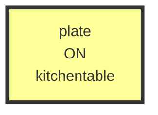

# 🚀 VirtualHome Agent Episode Log


### [GoalReasoner (Module A - Intent)] Output
```json
{
  "is_instruction_obviously_vague": false,
  "clarification_question": null,
  "target_object": "plate",
  "location_hint": "kitchentable",
  "reasoning_chain": [
    {
      "question": "Why does the user want this object?",
      "answer": "To place the used plate onto the kitchen table."
    },
    {
      "question": "Why is that important?",
      "answer": "To return the plate to a specific surface after use, likely for organization or cleanup."
    },
    {
      "question": "What fundamental need does this fulfill?",
      "answer": "It helps manage used dishware and keep the area orderly."
    },
    {
      "question": "Are there any deeper psychological or physical motivations?",
      "answer": "The user may want to reduce clutter, complete cleanup, or make the plate accessible for further handling."
    }
  ],
  "deep_intent": "The user wants to organize or clear used dishware by placing it on a designated surface.",
  "acceptable_alternatives_properties": [
    {
      "priority": 1,
      "description": "Other used dishes or tableware that can be placed on the kitchen table, such as a bowl or cup."
    },
    {
      "priority": 2,
      "description": "Similar dining items that are part of cleanup or staging, such as utensils or a napkin."
    },
    {
      "priority": 3,
      "description": "Other items from the meal setup that belong on a tabletop, such as a placemat or serving dish."
    },
    {
      "priority": 4,
      "description": "Other household items that can be set down on a table to reduce clutter, if the exact plate is unavailable."
    }
  ]
}
```

### [PerceptionFilter] Output
```json
{
  "reasoning": "The goal explicitly requires a plate and the kitchen table as the destination surface. To support the stated alternatives and backups for tableware cleanup/staging, I also keep other suitable tabletop dishware items that could serve the same function if needed.",
  "selected_classes": [
    "cutleryknife",
    "plate",
    "kitchentable",
    "character",
    "dishbowl",
    "cutleryfork",
    "waterglass"
  ],
  "raw_class_count": 50
}
```

### [LLMExecutor] Output
```json
{
  "reasoning": "The SDG goal is to have a plate ON the kitchentable. The character is already close to kitchentable(135), and plate(75) is also close to the character and on the target table area. Since the task only requires a plate on the kitchen table and plate(75) is the best directly accessible matching plate instance, the next step is to grab it before placing it on the table.",
  "satisfied_nodes": [],
  "current_node_focus": "N1",
  "mapped_variables": {},
  "action": "[grab] <plate> (75)"
}
```

### [RoboStateMultiTaskController] Output
```json
{
  "action": "[grab] <plate> (75)",
  "active_task_id": "task_1",
  "task_context": {
    "active_task_id": "task_1",
    "pending_task_ids": [],
    "satisfied_task_ids": []
  },
  "source": "llm_executor"
}
```
## Step 0
- **Action**: `[grab] <plate> (75)`
- **Action Success**: `True`
- **Action Message**: {'0': {'message': 'Success'}}
- **Active Task**: `task_1`
- **Decision Source**: `llm_executor`
- **Task Progress**: T3_without_state_alignment_M4_18=pending
- **SDG Status**:

- **Observed Items (49)**: cutleryknife(59), cutleryknife(60), waterglass(64), cutleryknife(65), cutleryfork(66), cutleryfork(69), cutleryknife(70), waterglass(71), waterglass(72), cutleryknife(73), cutleryfork(74), plate(75), plate(76), cutleryfork(77), cutleryknife(78)...


### [PerceptionFilter] Output
```json
{
  "reasoning": "Reused cached class selection.",
  "selected_classes": [
    "cutleryknife",
    "plate",
    "kitchentable",
    "character",
    "dishbowl",
    "cutleryfork",
    "waterglass"
  ],
  "raw_class_count": 50
}
```

### [LLMExecutor] Output
```json
{
  "reasoning": "The SDG goal is to have a plate ON the kitchentable. The current graph shows the character already holds plate(75) and is close to kitchentable(131) and kitchentable(135). Since the held plate can be placed on a flat surface, the next step is to walk explicitly to the intended destination surface kitchentable(131) before putting the plate down. This keeps progress toward N1 and follows the proximity rule.",
  "satisfied_nodes": [],
  "current_node_focus": "N1",
  "mapped_variables": {},
  "action": "[walk] <kitchentable> (131)"
}
```

### [RoboStateMultiTaskController] Output
```json
{
  "action": "[walk] <kitchentable> (131)",
  "active_task_id": "task_1",
  "task_context": {
    "active_task_id": "task_1",
    "pending_task_ids": [],
    "satisfied_task_ids": []
  },
  "source": "llm_executor"
}
```
## Step 1
- **Action**: `[walk] <kitchentable> (131)`
- **Action Success**: `True`
- **Action Message**: {'0': {'message': 'Success'}}
- **Active Task**: `task_1`
- **Decision Source**: `llm_executor`
- **Task Progress**: T3_without_state_alignment_M4_18=pending
- **SDG Status**:

- **Observed Items (49)**: cutleryknife(59), cutleryknife(60), waterglass(64), cutleryknife(65), cutleryfork(66), cutleryfork(69), cutleryknife(70), waterglass(71), waterglass(72), cutleryknife(73), cutleryfork(74), plate(75), plate(76), cutleryfork(77), cutleryknife(78)...


### [PerceptionFilter] Output
```json
{
  "reasoning": "Reused cached class selection.",
  "selected_classes": [
    "cutleryknife",
    "plate",
    "kitchentable",
    "character",
    "dishbowl",
    "cutleryfork",
    "waterglass"
  ],
  "raw_class_count": 50
}
```

### [LLMExecutor] Output
```json
{
  "reasoning": "The target is a plate on the kitchen table. The current graph shows I am already holding plate(75) and I am close to kitchentable(131), which satisfies the proximity and holding requirements for placing it down. Since the goal node is ON plate -> kitchentable, the next atomic step is to place the held plate onto the nearby kitchen table.",
  "satisfied_nodes": [],
  "current_node_focus": "N1",
  "mapped_variables": {},
  "action": "[putback] <plate> (75) <kitchentable> (131)"
}
```

### [RoboStateMultiTaskController] Output
```json
{
  "action": "[putback] <plate> (75) <kitchentable> (131)",
  "active_task_id": "task_1",
  "task_context": {
    "active_task_id": "task_1",
    "pending_task_ids": [],
    "satisfied_task_ids": []
  },
  "source": "llm_executor"
}
```
## Step 2
- **Action**: `[putback] <plate> (75) <kitchentable> (131)`
- **Action Success**: `True`
- **Action Message**: {'0': {'message': 'Success'}}
- **Active Task**: `task_1`
- **Decision Source**: `llm_executor`
- **Task Progress**: T3_without_state_alignment_M4_18=pending
- **SDG Status**:

- **Observed Items (49)**: cutleryknife(59), cutleryknife(60), waterglass(64), cutleryknife(65), cutleryfork(66), cutleryfork(69), cutleryknife(70), waterglass(71), waterglass(72), cutleryknife(73), cutleryfork(74), plate(75), plate(76), cutleryfork(77), cutleryknife(78)...


### [PerceptionFilter] Output
```json
{
  "reasoning": "Reused cached class selection.",
  "selected_classes": [
    "cutleryknife",
    "plate",
    "kitchentable",
    "character",
    "dishbowl",
    "cutleryfork",
    "waterglass"
  ],
  "raw_class_count": 50
}
```

### [LLMExecutor] Output
```json
{
  "reasoning": "The goal is to place a plate on the kitchen table. The current graph already shows plate(75) is on kitchentable(131), which satisfies the SDG node N1. No action is needed to progress this active task, and I should not manipulate other objects. Since the task state is already satisfied in the current filtered graph, the safest next step is to wait for the system to confirm completion rather than risk unnecessary movement.",
  "satisfied_nodes": [
    "N1"
  ],
  "current_node_focus": "N1",
  "mapped_variables": {},
  "action": "[wait]"
}
```

### [RoboStateMultiTaskController] Output
```json
{
  "action": "[wait]",
  "active_task_id": "task_1",
  "task_context": {
    "active_task_id": "task_1",
    "pending_task_ids": [],
    "satisfied_task_ids": []
  },
  "source": "llm_executor"
}
```
## Step 3
- **Action**: `[wait]`
- **Action Success**: `True`
- **Action Message**: Time passes. You waited for a while.
- **Active Task**: `task_1`
- **Decision Source**: `llm_executor`
- **Task Progress**: T3_without_state_alignment_M4_18=pending
- **SDG Status**:

- **Observed Items (49)**: cutleryknife(59), cutleryknife(60), waterglass(64), cutleryknife(65), cutleryfork(66), cutleryfork(69), cutleryknife(70), waterglass(71), waterglass(72), cutleryknife(73), cutleryfork(74), plate(75), plate(76), cutleryfork(77), cutleryknife(78)...


### [PerceptionFilter] Output
```json
{
  "reasoning": "Reused cached class selection.",
  "selected_classes": [
    "cutleryknife",
    "plate",
    "kitchentable",
    "character",
    "dishbowl",
    "cutleryfork",
    "waterglass"
  ],
  "raw_class_count": 50
}
```

### [LLMExecutor] Output
```json
{
  "reasoning": "The goal is to have the plate on the kitchen table. The filtered graph already shows plate(75) is on kitchentable(131), which satisfies the SDG node N1. No action is needed to further progress this active task.",
  "satisfied_nodes": [
    "N1"
  ],
  "current_node_focus": "N1",
  "mapped_variables": {
    "?TargetSurface": "kitchentable(131)"
  },
  "action": "[wait]"
}
```

### [RoboStateMultiTaskController] Output
```json
{
  "action": "[wait]",
  "active_task_id": "task_1",
  "task_context": {
    "active_task_id": "task_1",
    "pending_task_ids": [],
    "satisfied_task_ids": []
  },
  "source": "llm_executor"
}
```
## Step 4
- **Action**: `[wait]`
- **Action Success**: `True`
- **Action Message**: Time passes. You waited for a while.
- **Active Task**: `task_1`
- **Decision Source**: `llm_executor`
- **Task Progress**: T3_without_state_alignment_M4_18=pending
- **SDG Status**:

- **Observed Items (49)**: cutleryknife(59), cutleryknife(60), waterglass(64), cutleryknife(65), cutleryfork(66), cutleryfork(69), cutleryknife(70), waterglass(71), waterglass(72), cutleryknife(73), cutleryfork(74), plate(75), plate(76), cutleryfork(77), cutleryknife(78)...


### [PerceptionFilter] Output
```json
{
  "reasoning": "Reused cached class selection.",
  "selected_classes": [
    "cutleryknife",
    "plate",
    "kitchentable",
    "character",
    "dishbowl",
    "cutleryfork",
    "waterglass"
  ],
  "raw_class_count": 50
}
```

### [LLMExecutor] Output
```json
{
  "reasoning": "The goal is to get a plate onto the kitchentable. In the current graph, plate(75) is already close to the character, and kitchentable(131) is the destination surface and also close to the character. Since putting an object on a surface requires being walked to the surface first, the next step is to walk to kitchentable(131) before any putback action.",
  "satisfied_nodes": [],
  "current_node_focus": "N1",
  "mapped_variables": {
    "?TargetPlate": "plate(75)",
    "?Table": "kitchentable(131)"
  },
  "action": "[walk] <kitchentable> (131)"
}
```

### [RoboStateMultiTaskController] Output
```json
{
  "action": "[walk] <kitchentable> (131)",
  "active_task_id": "task_1",
  "task_context": {
    "active_task_id": "task_1",
    "pending_task_ids": [],
    "satisfied_task_ids": []
  },
  "source": "llm_executor"
}
```
## Step 5
- **Action**: `[walk] <kitchentable> (131)`
- **Action Success**: `True`
- **Action Message**: {'0': {'message': 'Success'}}
- **Active Task**: `task_1`
- **Decision Source**: `llm_executor`
- **Task Progress**: T3_without_state_alignment_M4_18=pending
- **SDG Status**:

- **Observed Items (49)**: cutleryknife(59), cutleryknife(60), waterglass(64), cutleryknife(65), cutleryfork(66), cutleryfork(69), cutleryknife(70), waterglass(71), waterglass(72), cutleryknife(73), cutleryfork(74), plate(75), plate(76), cutleryfork(77), cutleryknife(78)...


### [PerceptionFilter] Output
```json
{
  "reasoning": "Reused cached class selection.",
  "selected_classes": [
    "cutleryknife",
    "plate",
    "kitchentable",
    "character",
    "dishbowl",
    "cutleryfork",
    "waterglass"
  ],
  "raw_class_count": 50
}
```

### [LLMExecutor] Output
```json
{
  "reasoning": "The goal is to place the plate on the kitchentable. The current graph shows plate(75) is already CLOSE to the character and on kitchentable(131), but the task requires the plate to be on the kitchen table and we are already at the relevant location. Since the plate is the target object and the table is the destination surface, the next step should be to ensure the plate is placed on the kitchentable. However, because the robot is not currently holding the plate, the correct atomic progression is to grab the closest matching plate that is already near us, then later place it on the table. No other nodes are satisfied yet because the specific relation ON plate kitchentable is not explicitly confirmed as the target end state for the chosen plate instance.",
  "satisfied_nodes": [],
  "current_node_focus": "N1",
  "mapped_variables": {
    "?Container": "kitchentable(131)"
  },
  "action": "[grab] <plate> (75)"
}
```

### [RoboStateMultiTaskController] Output
```json
{
  "action": "[grab] <plate> (75)",
  "active_task_id": "task_1",
  "task_context": {
    "active_task_id": "task_1",
    "pending_task_ids": [],
    "satisfied_task_ids": []
  },
  "source": "llm_executor"
}
```
## Step 6
- **Action**: `[grab] <plate> (75)`
- **Action Success**: `True`
- **Action Message**: {'0': {'message': 'Success'}}
- **Active Task**: `task_1`
- **Decision Source**: `llm_executor`
- **Task Progress**: T3_without_state_alignment_M4_18=pending
- **SDG Status**:

- **Observed Items (49)**: cutleryknife(59), cutleryknife(60), waterglass(64), cutleryknife(65), cutleryfork(66), cutleryfork(69), cutleryknife(70), waterglass(71), waterglass(72), cutleryknife(73), cutleryfork(74), plate(75), plate(76), cutleryfork(77), cutleryknife(78)...


### [PerceptionFilter] Output
```json
{
  "reasoning": "Reused cached class selection.",
  "selected_classes": [
    "cutleryknife",
    "plate",
    "kitchentable",
    "character",
    "dishbowl",
    "cutleryfork",
    "waterglass"
  ],
  "raw_class_count": 50
}
```

### [LLMExecutor] Output
```json
{
  "reasoning": "The active goal is to place a plate on the kitchentable. The current graph shows I am already holding plate(75) and I am close to kitchentable(131). Since putback onto a surface requires being near the destination and holding the object, the next step is to place the held plate onto the nearby kitchen table. This should satisfy N1.",
  "satisfied_nodes": [],
  "current_node_focus": "N1",
  "mapped_variables": {
    "?TargetSurface": "kitchentable(131)"
  },
  "action": "[putback] <plate> (75) <kitchentable> (131)"
}
```

### [RoboStateMultiTaskController] Output
```json
{
  "action": "[putback] <plate> (75) <kitchentable> (131)",
  "active_task_id": "task_1",
  "task_context": {
    "active_task_id": "task_1",
    "pending_task_ids": [],
    "satisfied_task_ids": []
  },
  "source": "llm_executor"
}
```
## Step 7
- **Action**: `[putback] <plate> (75) <kitchentable> (131)`
- **Action Success**: `True`
- **Action Message**: {'0': {'message': 'Success'}}
- **Active Task**: `task_1`
- **Decision Source**: `llm_executor`
- **Task Progress**: T3_without_state_alignment_M4_18=pending
- **SDG Status**:

- **Observed Items (49)**: cutleryknife(59), cutleryknife(60), waterglass(64), cutleryknife(65), cutleryfork(66), cutleryfork(69), cutleryknife(70), waterglass(71), waterglass(72), cutleryknife(73), cutleryfork(74), plate(75), plate(76), cutleryfork(77), cutleryknife(78)...


### [PerceptionFilter] Output
```json
{
  "reasoning": "Reused cached class selection.",
  "selected_classes": [
    "cutleryknife",
    "plate",
    "kitchentable",
    "character",
    "dishbowl",
    "cutleryfork",
    "waterglass"
  ],
  "raw_class_count": 50
}
```

### [LLMExecutor] Output
```json
{
  "reasoning": "The SDG goal is to have a plate on the kitchentable. The current graph already shows plate(75) is ON kitchentable(131), which matches the target relation exactly. No further action is needed to satisfy the only node.",
  "satisfied_nodes": [
    "N1"
  ],
  "current_node_focus": "N1",
  "mapped_variables": {},
  "action": "[wait]"
}
```

### [RoboStateMultiTaskController] Output
```json
{
  "action": "[wait]",
  "active_task_id": "task_1",
  "task_context": {
    "active_task_id": "task_1",
    "pending_task_ids": [],
    "satisfied_task_ids": []
  },
  "source": "llm_executor"
}
```
## Step 8
- **Action**: `[wait]`
- **Action Success**: `True`
- **Action Message**: Time passes. You waited for a while.
- **Active Task**: `task_1`
- **Decision Source**: `llm_executor`
- **Task Progress**: T3_without_state_alignment_M4_18=pending
- **SDG Status**:

- **Observed Items (49)**: cutleryknife(59), cutleryknife(60), waterglass(64), cutleryknife(65), cutleryfork(66), cutleryfork(69), cutleryknife(70), waterglass(71), waterglass(72), cutleryknife(73), cutleryfork(74), plate(75), plate(76), cutleryfork(77), cutleryknife(78)...


### [PerceptionFilter] Output
```json
{
  "reasoning": "Reused cached class selection.",
  "selected_classes": [
    "cutleryknife",
    "plate",
    "kitchentable",
    "character",
    "dishbowl",
    "cutleryfork",
    "waterglass"
  ],
  "raw_class_count": 50
}
```

### [LLMExecutor] Output
```json
{
  "reasoning": "The active SDG requires plate on kitchentable. In the current graph, plate(75) is already CLOSE to the character and on kitchentable(131), so the goal node N1 is already satisfied. No action is needed; to avoid unnecessary movement or interference with other objects, the best next step is to wait for the next task update.",
  "satisfied_nodes": [
    "N1"
  ],
  "current_node_focus": "N1",
  "mapped_variables": {
    "?Container": "kitchentable(131)"
  },
  "action": "[wait]"
}
```

### [RoboStateMultiTaskController] Output
```json
{
  "action": "[wait]",
  "active_task_id": "task_1",
  "task_context": {
    "active_task_id": "task_1",
    "pending_task_ids": [],
    "satisfied_task_ids": []
  },
  "source": "llm_executor"
}
```
## Step 9
- **Action**: `[wait]`
- **Action Success**: `True`
- **Action Message**: Time passes. You waited for a while.
- **Active Task**: `task_1`
- **Decision Source**: `llm_executor`
- **Task Progress**: T3_without_state_alignment_M4_18=pending
- **SDG Status**:

- **Observed Items (49)**: cutleryknife(59), cutleryknife(60), waterglass(64), cutleryknife(65), cutleryfork(66), cutleryfork(69), cutleryknife(70), waterglass(71), waterglass(72), cutleryknife(73), cutleryfork(74), plate(75), plate(76), cutleryfork(77), cutleryknife(78)...


### [PerceptionFilter] Output
```json
{
  "reasoning": "Reused cached class selection.",
  "selected_classes": [
    "cutleryknife",
    "plate",
    "kitchentable",
    "character",
    "dishbowl",
    "cutleryfork",
    "waterglass"
  ],
  "raw_class_count": 50
}
```

### [LLMExecutor] Output
```json
{
  "reasoning": "The goal is to have plate(75) on kitchentable(131). The plate is already close to the character, but it is not yet on the kitchen table. Since placing onto a surface requires being near the destination first, the next step is to walk to the kitchen table. plate(75) is the best bind for the target plate because it is the nearest plate already close to the character.",
  "satisfied_nodes": [],
  "current_node_focus": "N1",
  "mapped_variables": {},
  "action": "[walk] <kitchentable> (131)"
}
```

### [RoboStateMultiTaskController] Output
```json
{
  "action": "[walk] <kitchentable> (131)",
  "active_task_id": "task_1",
  "task_context": {
    "active_task_id": "task_1",
    "pending_task_ids": [],
    "satisfied_task_ids": []
  },
  "source": "llm_executor"
}
```
## Step 10
- **Action**: `[walk] <kitchentable> (131)`
- **Action Success**: `True`
- **Action Message**: {'0': {'message': 'Success'}}
- **Active Task**: `task_1`
- **Decision Source**: `llm_executor`
- **Task Progress**: T3_without_state_alignment_M4_18=pending
- **SDG Status**:

- **Observed Items (49)**: cutleryknife(59), cutleryknife(60), waterglass(64), cutleryknife(65), cutleryfork(66), cutleryfork(69), cutleryknife(70), waterglass(71), waterglass(72), cutleryknife(73), cutleryfork(74), plate(75), plate(76), cutleryfork(77), cutleryknife(78)...


### [PerceptionFilter] Output
```json
{
  "reasoning": "Reused cached class selection.",
  "selected_classes": [
    "cutleryknife",
    "plate",
    "kitchentable",
    "character",
    "dishbowl",
    "cutleryfork",
    "waterglass"
  ],
  "raw_class_count": 50
}
```

### [LLMExecutor] Output
```json
{
  "reasoning": "The goal is to have the plate on the kitchen table. The filtered graph already shows plate(75) is on kitchentable(131), which matches the SDG node N1 exactly. No action is needed to progress this active task, but since I must choose a single next atomic action and should not repeat a walk when already satisfied, I will use a no-op wait.",
  "satisfied_nodes": [
    "N1"
  ],
  "current_node_focus": "N1",
  "mapped_variables": {
    "?TargetPlate": "plate(75)",
    "?Table": "kitchentable(131)"
  },
  "action": "[wait]"
}
```

### [RoboStateMultiTaskController] Output
```json
{
  "action": "[wait]",
  "active_task_id": "task_1",
  "task_context": {
    "active_task_id": "task_1",
    "pending_task_ids": [],
    "satisfied_task_ids": []
  },
  "source": "llm_executor"
}
```
## Step 11
- **Action**: `[wait]`
- **Action Success**: `True`
- **Action Message**: Time passes. You waited for a while.
- **Active Task**: `task_1`
- **Decision Source**: `llm_executor`
- **Task Progress**: T3_without_state_alignment_M4_18=pending
- **SDG Status**:

- **Observed Items (49)**: cutleryknife(59), cutleryknife(60), waterglass(64), cutleryknife(65), cutleryfork(66), cutleryfork(69), cutleryknife(70), waterglass(71), waterglass(72), cutleryknife(73), cutleryfork(74), plate(75), plate(76), cutleryfork(77), cutleryknife(78)...


### [PerceptionFilter] Output
```json
{
  "reasoning": "Reused cached class selection.",
  "selected_classes": [
    "cutleryknife",
    "plate",
    "kitchentable",
    "character",
    "dishbowl",
    "cutleryfork",
    "waterglass"
  ],
  "raw_class_count": 50
}
```

### [LLMExecutor] Output
```json
{
  "reasoning": "The goal is to place a plate on the kitchentable. The current graph shows plate(75) is already CLOSE to the character and on kitchentable(131), which satisfies the ON relation for the active SDG node. No further physical action is needed for this task.",
  "satisfied_nodes": [
    "N1"
  ],
  "current_node_focus": "N1",
  "mapped_variables": {
    "?TargetPlate": "plate(75)",
    "?Destination": "kitchentable(131)"
  },
  "action": "[wait]"
}
```

### [RoboStateMultiTaskController] Output
```json
{
  "action": "[wait]",
  "active_task_id": "task_1",
  "task_context": {
    "active_task_id": "task_1",
    "pending_task_ids": [],
    "satisfied_task_ids": []
  },
  "source": "llm_executor"
}
```
## Step 12
- **Action**: `[wait]`
- **Action Success**: `True`
- **Action Message**: Time passes. You waited for a while.
- **Active Task**: `task_1`
- **Decision Source**: `llm_executor`
- **Task Progress**: T3_without_state_alignment_M4_18=pending
- **SDG Status**:

- **Observed Items (49)**: cutleryknife(59), cutleryknife(60), waterglass(64), cutleryknife(65), cutleryfork(66), cutleryfork(69), cutleryknife(70), waterglass(71), waterglass(72), cutleryknife(73), cutleryfork(74), plate(75), plate(76), cutleryfork(77), cutleryknife(78)...


### [PerceptionFilter] Output
```json
{
  "reasoning": "Reused cached class selection.",
  "selected_classes": [
    "cutleryknife",
    "plate",
    "kitchentable",
    "character",
    "dishbowl",
    "cutleryfork",
    "waterglass"
  ],
  "raw_class_count": 50
}
```

### [LLMExecutor] Output
```json
{
  "reasoning": "The goal is to have plate(75) on kitchentable(131). The current graph already shows plate(75) is CLOSE to the character and kitchentable(131) is also CLOSE, so the only missing relation is placing the plate onto the table. Because putback requires being explicitly walked to the destination first, the next atomic step should be to walk to the kitchen table.",
  "satisfied_nodes": [],
  "current_node_focus": "N1",
  "mapped_variables": {},
  "action": "[walk] <kitchentable> (131)"
}
```

### [RoboStateMultiTaskController] Output
```json
{
  "action": "[walk] <kitchentable> (131)",
  "active_task_id": "task_1",
  "task_context": {
    "active_task_id": "task_1",
    "pending_task_ids": [],
    "satisfied_task_ids": []
  },
  "source": "llm_executor"
}
```
## Step 13
- **Action**: `[walk] <kitchentable> (131)`
- **Action Success**: `True`
- **Action Message**: {'0': {'message': 'Success'}}
- **Active Task**: `task_1`
- **Decision Source**: `llm_executor`
- **Task Progress**: T3_without_state_alignment_M4_18=pending
- **SDG Status**:

- **Observed Items (49)**: cutleryknife(59), cutleryknife(60), waterglass(64), cutleryknife(65), cutleryfork(66), cutleryfork(69), cutleryknife(70), waterglass(71), waterglass(72), cutleryknife(73), cutleryfork(74), plate(75), plate(76), cutleryfork(77), cutleryknife(78)...


### [PerceptionFilter] Output
```json
{
  "reasoning": "Reused cached class selection.",
  "selected_classes": [
    "cutleryknife",
    "plate",
    "kitchentable",
    "character",
    "dishbowl",
    "cutleryfork",
    "waterglass"
  ],
  "raw_class_count": 50
}
```

### [LLMExecutor] Output
```json
{
  "reasoning": "The goal is to place a plate on the kitchen table. The current graph already shows plate(75) is ON kitchentable(131), so the SDG node N1 is satisfied. No further physical action is needed for this task.",
  "satisfied_nodes": [
    "N1"
  ],
  "current_node_focus": "N1",
  "mapped_variables": {
    "?TargetTable": "kitchentable(131)",
    "?Plate": "plate(75)"
  },
  "action": "[wait]"
}
```

### [RoboStateMultiTaskController] Output
```json
{
  "action": "[wait]",
  "active_task_id": "task_1",
  "task_context": {
    "active_task_id": "task_1",
    "pending_task_ids": [],
    "satisfied_task_ids": []
  },
  "source": "llm_executor"
}
```
## Step 14
- **Action**: `[wait]`
- **Action Success**: `True`
- **Action Message**: Time passes. You waited for a while.
- **Active Task**: `task_1`
- **Decision Source**: `llm_executor`
- **Task Progress**: T3_without_state_alignment_M4_18=pending
- **SDG Status**:

- **Observed Items (49)**: cutleryknife(59), cutleryknife(60), waterglass(64), cutleryknife(65), cutleryfork(66), cutleryfork(69), cutleryknife(70), waterglass(71), waterglass(72), cutleryknife(73), cutleryfork(74), plate(75), plate(76), cutleryfork(77), cutleryknife(78)...

