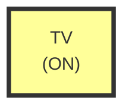

# 🚀 VirtualHome Agent Episode Log


### [GoalReasoner (Module A - Intent)] Output
```json
{
  "is_instruction_obviously_vague": false,
  "clarification_question": null,
  "target_object": "TV",
  "location_hint": null,
  "reasoning_chain": [
    {
      "question": "Why does the user want this object?",
      "answer": "To have the television in an on state if it is currently off."
    },
    {
      "question": "Why is that important?",
      "answer": "So the television can be used for viewing or provide active display output."
    },
    {
      "question": "What fundamental need does this fulfill?",
      "answer": "It fulfills the need to access visual entertainment or information from the television."
    },
    {
      "question": "Are there any deeper psychological or physical motivations?",
      "answer": "The user may want convenience, entertainment, or to continue an activity that depends on the television being powered on."
    }
  ],
  "deep_intent": "The user wants to activate a display device so it can be used.",
  "acceptable_alternatives_properties": [
    {
      "priority": 1,
      "description": "Other powered display devices that can serve the same viewing purpose, such as a monitor or projector."
    },
    {
      "priority": 2,
      "description": "Other televisions or screen-based devices available indoors that can provide visual output."
    },
    {
      "priority": 3,
      "description": "Any available device that can present audiovisual content, such as a tablet or laptop."
    },
    {
      "priority": 4,
      "description": "A nearby shared screen or entertainment device that can still provide visual information or media."
    }
  ]
}
```

### [PerceptionFilter] Output
```json
{
  "reasoning": "The goal is to turn the TV on, so the only strictly necessary visible class is the TV itself. No other tools or locations are required by the SDG, and alternative display devices are not needed because the target is specifically the television state.",
  "selected_classes": [
    "tv",
    "character"
  ],
  "raw_class_count": 39
}
```

### [LLMExecutor] Output
```json
{
  "reasoning": "The goal is to satisfy N1 by turning the only visible TV on. The filtered graph shows tv(426) is OFF, has a switch, and is already CLOSE to the character, so no walk is needed. It also has HAS_PLUG, but there is no evidence it is unplugged, so the next minimal progress action is to switch it on. ",
  "satisfied_nodes": [],
  "current_node_focus": "N1",
  "mapped_variables": {},
  "action": "[switchon] <tv> (426)"
}
```

### [RoboStateMultiTaskController] Output
```json
{
  "action": "[switchon] <tv> (426)",
  "active_task_id": "task_1",
  "task_context": {
    "active_task_id": "task_1",
    "pending_task_ids": [],
    "satisfied_task_ids": []
  },
  "source": "llm_executor"
}
```
## Step 0
- **Action**: `[switchon] <tv> (426)`
- **Action Success**: `True`
- **Action Message**: Faked switch operation in Python layer (bypassed Unity failure)
- **Active Task**: `task_1`
- **Decision Source**: `llm_executor`
- **Task Progress**: T3_without_state_alignment_M4_19=done
- **SDG Status**:

- **Observed Items (6)**: tv(426) [OFF], character(1), bathroom(11), bedroom(73), kitchen(205), livingroom(335)

