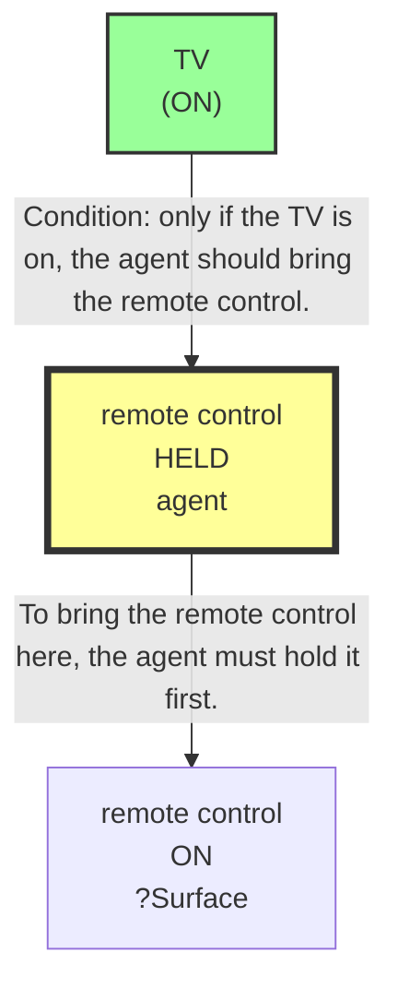

# 🚀 VirtualHome Agent Episode Log


### [GoalReasoner (Module A - Intent)] Output
```json
{
  "literal_instruction": "If the TV is on, bring the remote control here."
}
```

### [LLMExecutor] Output
```json
{
  "reasoning": "The instruction is conditional: only if the TV is on should I bring the remote control. The current graph shows tv(426) is ON, and the remotecontrol(452) is present in the living room on the sofa and not yet held. To begin fulfilling the task, the next required step is to move adjacent to the remote control before grabbing it.",
  "satisfied_nodes": [],
  "current_node_focus": "N/A",
  "mapped_variables": {},
  "action": "[walk] <remotecontrol> (452)"
}
```

### [RoboStateMultiTaskController] Output
```json
{
  "action": "[walk] <remotecontrol> (452)",
  "active_task_id": "task_1",
  "task_context": {
    "active_task_id": "task_1",
    "pending_task_ids": [],
    "satisfied_task_ids": []
  },
  "source": "llm_executor"
}
```
## Step 0
- **Action**: `[walk] <remotecontrol> (452)`
- **Action Success**: `True`
- **Action Message**: {'0': {'message': 'Success'}}
- **Active Task**: `task_1`
- **Decision Source**: `llm_executor`
- **Task Progress**: T3_without_goal_reasoning_G1_03=pending
- **SDG Status**:
No SDG active.
- **Observed Items (79)**: floor(336), floor(337), floor(338), floor(339), floor(340), floor(341), floor(342), floor(343), floor(344), wall(345), wall(346), wall(347), wall(348), wall(349), wall(350)...


### [PerceptionFilter] Output
```json
{
  "reasoning": "The goal is to bring the remote control only if the TV is on. The SDG requires the TV and the remote control itself. To satisfy the 'bring here' action, the remote control must be selected; no other tools or receptacles are required.",
  "selected_classes": [
    "tv",
    "character",
    "remotecontrol"
  ],
  "raw_class_count": 40
}
```

### [LLMExecutor] Output
```json
{
  "reasoning": "The SDG condition is satisfied because the TV is ON. The next unmet node is N2: the remote control must be held by the agent. The filtered graph shows remotecontrol(452) is already CLOSE to the character, so no additional walk is needed. The correct next atomic step is to grab the remote control.",
  "satisfied_nodes": [
    "N1"
  ],
  "current_node_focus": "N2",
  "mapped_variables": {},
  "action": "[grab] <remotecontrol> (452)"
}
```

### [RoboStateMultiTaskController] Output
```json
{
  "action": "[grab] <remotecontrol> (452)",
  "active_task_id": "task_1",
  "task_context": {
    "active_task_id": "task_1",
    "pending_task_ids": [],
    "satisfied_task_ids": []
  },
  "source": "llm_executor"
}
```
## Step 1
- **Action**: `[grab] <remotecontrol> (452)`
- **Action Success**: `True`
- **Action Message**: {'0': {'message': 'Success'}}
- **Active Task**: `task_1`
- **Decision Source**: `llm_executor`
- **Task Progress**: T3_without_goal_reasoning_G1_03=done
- **SDG Status**:

- **Observed Items (7)**: tv(426) [ON], remotecontrol(452) [OFF], character(1), bathroom(11), bedroom(73), kitchen(205), livingroom(335)

