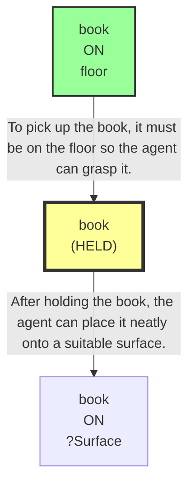
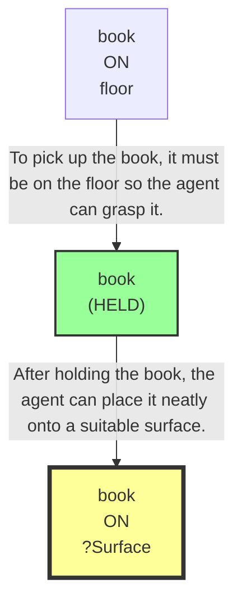
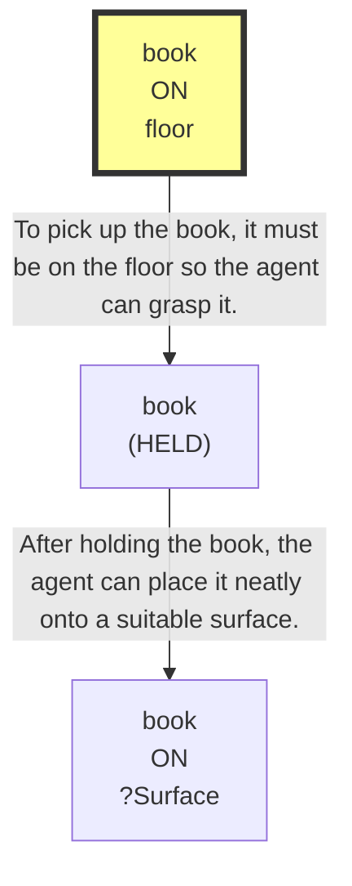
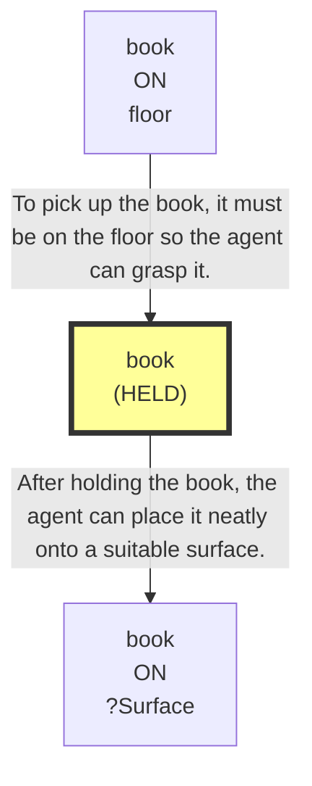
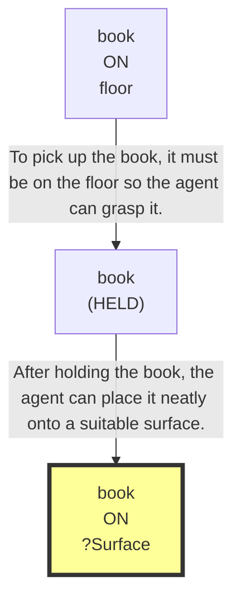
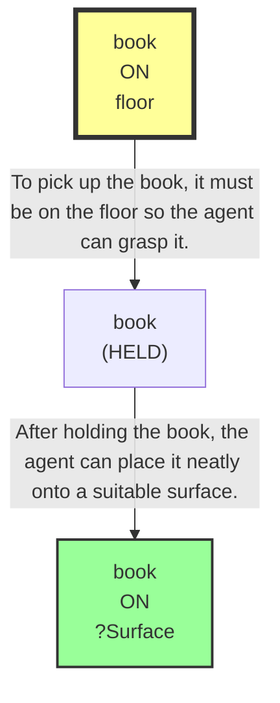

# 🚀 VirtualHome Agent Episode Log


### [GoalReasoner (Module A - Intent)] Output
```json
{
  "literal_instruction": "If the book falls on the floor, please pick it up and put it back neatly."
}
```

### [PerceptionFilter] Output
```json
{
  "reasoning": "The goal requires only the book itself plus the floor because the book must be picked up from the floor, and a suitable surface to put it back neatly. From the visible objects, the relevant placement surfaces are furniture like bookshelf, desk, coffeetable, and box/cabinet/closet that can serve as possible resting locations. I exclude unrelated objects and decorations.",
  "selected_classes": [
    "box",
    "character",
    "bookshelf",
    "cabinet",
    "closet",
    "desk",
    "book",
    "coffeetable",
    "floor"
  ],
  "raw_class_count": 41
}
```

### [LLMExecutor] Output
```json
{
  "reasoning": "The SDG root N1 is already satisfied because multiple books are on the floor, including book(190). To progress toward holding the book, I need to move adjacent to a specific book before grabbing it. I will bind the target book to the clearly visible floor book(190) and walk to it first.",
  "satisfied_nodes": [
    "N1"
  ],
  "current_node_focus": "N2",
  "mapped_variables": {
    "?Surface": "coffeetable(371)"
  },
  "action": "[walk] <book> (190)"
}
```

### [RoboStateMultiTaskController] Output
```json
{
  "action": "[walk] <book> (190)",
  "active_task_id": "task_1",
  "task_context": {
    "active_task_id": "task_1",
    "pending_task_ids": [],
    "satisfied_task_ids": []
  },
  "source": "llm_executor"
}
```
## Step 0
- **Action**: `[walk] <book> (190)`
- **Action Success**: `True`
- **Action Message**: {'0': {'message': 'Success'}}
- **Active Task**: `task_1`
- **Decision Source**: `llm_executor`
- **Task Progress**: T3_without_goal_reasoning_G2_09=pending
- **SDG Status**:

- **Observed Items (23)**: floor(336), floor(337), floor(338), floor(339), floor(340), floor(341), floor(342), floor(343), floor(344), bookshelf(370), coffeetable(371), desk(373) [CLOSED], closet(374) [CLOSED], cabinet(415) [CLOSED], box(435) [CLOSED]...


### [PerceptionFilter] Output
```json
{
  "reasoning": "Reused cached class selection.",
  "selected_classes": [
    "box",
    "character",
    "bookshelf",
    "cabinet",
    "closet",
    "desk",
    "book",
    "coffeetable",
    "floor"
  ],
  "raw_class_count": 41
}
```

### [LLMExecutor] Output
```json
{
  "reasoning": "The target book is already on the floor and close to the character, so N1 is satisfied. To progress toward holding it, the next atomic action must be to grab one specific book instance. I will bind the goal book to book(190), which is on the floor and close, and attempt to pick it up to satisfy N2.",
  "satisfied_nodes": [
    "N1"
  ],
  "current_node_focus": "N2",
  "mapped_variables": {
    "?Surface": "coffeetable(371)"
  },
  "action": "[grab] <book> (190)"
}
```

### [RoboStateMultiTaskController] Output
```json
{
  "action": "[grab] <book> (190)",
  "active_task_id": "task_1",
  "task_context": {
    "active_task_id": "task_1",
    "pending_task_ids": [],
    "satisfied_task_ids": []
  },
  "source": "llm_executor"
}
```
## Step 1
- **Action**: `[grab] <book> (190)`
- **Action Success**: `True`
- **Action Message**: {'0': {'message': 'Success'}}
- **Active Task**: `task_1`
- **Decision Source**: `llm_executor`
- **Task Progress**: T3_without_goal_reasoning_G2_09=pending
- **SDG Status**:

- **Observed Items (23)**: floor(336), floor(337), floor(338), floor(339), floor(340), floor(341), floor(342), floor(343), floor(344), bookshelf(370), coffeetable(371), desk(373) [CLOSED], closet(374) [CLOSED], cabinet(415) [CLOSED], box(435) [CLOSED]...


### [PerceptionFilter] Output
```json
{
  "reasoning": "Reused cached class selection.",
  "selected_classes": [
    "box",
    "character",
    "bookshelf",
    "cabinet",
    "closet",
    "desk",
    "book",
    "coffeetable",
    "floor"
  ],
  "raw_class_count": 41
}
```

### [LLMExecutor] Output
```json
{
  "reasoning": "The active book in hand is book(190), satisfying N2 (HELD). The remaining gap is to place it neatly onto a suitable surface, which corresponds to N3. Since the instruction does not specify an exact surface and clarification is disabled, I autonomously bind ?Surface to the nearest appropriate flat surface available in the living room: coffeetable(371). Proximity rule requires walking to the destination before placing the held object.",
  "satisfied_nodes": [
    "N2"
  ],
  "current_node_focus": "N3",
  "mapped_variables": {
    "?Surface": "coffeetable(371)"
  },
  "action": "[walk] <coffeetable> (371)"
}
```

### [RoboStateMultiTaskController] Output
```json
{
  "action": "[walk] <coffeetable> (371)",
  "active_task_id": "task_1",
  "task_context": {
    "active_task_id": "task_1",
    "pending_task_ids": [],
    "satisfied_task_ids": []
  },
  "source": "llm_executor"
}
```
## Step 2
- **Action**: `[walk] <coffeetable> (371)`
- **Action Success**: `True`
- **Action Message**: {'0': {'message': 'Success'}}
- **Active Task**: `task_1`
- **Decision Source**: `llm_executor`
- **Task Progress**: T3_without_goal_reasoning_G2_09=pending
- **SDG Status**:

- **Observed Items (23)**: floor(336), floor(337), floor(338), floor(339), floor(340), floor(341), floor(342), floor(343), floor(344), bookshelf(370), coffeetable(371), desk(373) [CLOSED], closet(374) [CLOSED], cabinet(415) [CLOSED], box(435) [CLOSED]...


### [PerceptionFilter] Output
```json
{
  "reasoning": "Reused cached class selection.",
  "selected_classes": [
    "box",
    "character",
    "bookshelf",
    "cabinet",
    "closet",
    "desk",
    "book",
    "coffeetable",
    "floor"
  ],
  "raw_class_count": 41
}
```

### [LLMExecutor] Output
```json
{
  "reasoning": "The book is already held (book(190) in HOLDS_RH), so N2 is satisfied. The next missing step is to place it neatly on a suitable surface to satisfy N3. The coffee table is already nearby (CLOSE character), and it is a valid flat surface for putting the book back neatly. Since putback requires being walked to the destination first and we just walked to the coffeetable, the next atomic action is to place the book on it.",
  "satisfied_nodes": [
    "N2"
  ],
  "current_node_focus": "N3",
  "mapped_variables": {
    "?Surface": "coffeetable(371)"
  },
  "action": "[putback] <book> (190) <coffeetable> (371)"
}
```

### [RoboStateMultiTaskController] Output
```json
{
  "action": "[putback] <book> (190) <coffeetable> (371)",
  "active_task_id": "task_1",
  "task_context": {
    "active_task_id": "task_1",
    "pending_task_ids": [],
    "satisfied_task_ids": []
  },
  "source": "llm_executor"
}
```
## Step 3
- **Action**: `[putback] <book> (190) <coffeetable> (371)`
- **Action Success**: `True`
- **Action Message**: {'0': {'message': 'Success'}}
- **Active Task**: `task_1`
- **Decision Source**: `llm_executor`
- **Task Progress**: T3_without_goal_reasoning_G2_09=pending
- **SDG Status**:

- **Observed Items (23)**: floor(336), floor(337), floor(338), floor(339), floor(340), floor(341), floor(342), floor(343), floor(344), bookshelf(370), coffeetable(371), desk(373) [CLOSED], closet(374) [CLOSED], cabinet(415) [CLOSED], box(435) [CLOSED]...


### [PerceptionFilter] Output
```json
{
  "reasoning": "Reused cached class selection.",
  "selected_classes": [
    "box",
    "character",
    "bookshelf",
    "cabinet",
    "closet",
    "desk",
    "book",
    "coffeetable",
    "floor"
  ],
  "raw_class_count": 41
}
```

### [LLMExecutor] Output
```json
{
  "reasoning": "The active task is to pick up a book that is on the floor and put it back neatly. The graph shows book(190) is already on the coffeetable, so N1 is no longer the relevant unmet state for this book. However, there are other books on the floor: book(191) and book(268). Since the instruction is conditional and only applies if a book falls on the floor, the best current candidate to satisfy N1 is a floor book. I will bind ?Surface to the coffeetable only after holding the floor book. First, I need to get near a floor book before grabbing it. I choose book(191) because it is explicitly ON floor and available.",
  "satisfied_nodes": [],
  "current_node_focus": "N1",
  "mapped_variables": {
    "?Surface": "coffeetable(371)"
  },
  "action": "[walk] <book> (191)"
}
```

### [RoboStateMultiTaskController] Output
```json
{
  "action": "[walk] <book> (191)",
  "active_task_id": "task_1",
  "task_context": {
    "active_task_id": "task_1",
    "pending_task_ids": [],
    "satisfied_task_ids": []
  },
  "source": "llm_executor"
}
```
## Step 4
- **Action**: `[walk] <book> (191)`
- **Action Success**: `True`
- **Action Message**: {'0': {'message': 'Success'}}
- **Active Task**: `task_1`
- **Decision Source**: `llm_executor`
- **Task Progress**: T3_without_goal_reasoning_G2_09=pending
- **SDG Status**:

- **Observed Items (23)**: floor(336), floor(337), floor(338), floor(339), floor(340), floor(341), floor(342), floor(343), floor(344), bookshelf(370), coffeetable(371), desk(373) [CLOSED], closet(374) [CLOSED], cabinet(415) [CLOSED], box(435) [CLOSED]...


### [PerceptionFilter] Output
```json
{
  "reasoning": "Reused cached class selection.",
  "selected_classes": [
    "box",
    "character",
    "bookshelf",
    "cabinet",
    "closet",
    "desk",
    "book",
    "coffeetable",
    "floor"
  ],
  "raw_class_count": 41
}
```

### [LLMExecutor] Output
```json
{
  "reasoning": "The active task is about a book that fell on the floor: pick it up and put it back neatly. The current graph shows book(191) is on the floor and close to the character, so it is the correct target for the pickup step. Since the previous action was already [walk] to book(191), the next atomic action should be grabbing it to satisfy N2 (book HELD).",
  "satisfied_nodes": [
    "N1"
  ],
  "current_node_focus": "N2",
  "mapped_variables": {},
  "action": "[grab] <book> (191)"
}
```

### [RoboStateMultiTaskController] Output
```json
{
  "action": "[grab] <book> (191)",
  "active_task_id": "task_1",
  "task_context": {
    "active_task_id": "task_1",
    "pending_task_ids": [],
    "satisfied_task_ids": []
  },
  "source": "llm_executor"
}
```
## Step 5
- **Action**: `[grab] <book> (191)`
- **Action Success**: `True`
- **Action Message**: {'0': {'message': 'Success'}}
- **Active Task**: `task_1`
- **Decision Source**: `llm_executor`
- **Task Progress**: T3_without_goal_reasoning_G2_09=pending
- **SDG Status**:

- **Observed Items (23)**: floor(336), floor(337), floor(338), floor(339), floor(340), floor(341), floor(342), floor(343), floor(344), bookshelf(370), coffeetable(371), desk(373) [CLOSED], closet(374) [CLOSED], cabinet(415) [CLOSED], box(435) [CLOSED]...


### [PerceptionFilter] Output
```json
{
  "reasoning": "Reused cached class selection.",
  "selected_classes": [
    "box",
    "character",
    "bookshelf",
    "cabinet",
    "closet",
    "desk",
    "book",
    "coffeetable",
    "floor"
  ],
  "raw_class_count": 41
}
```

### [LLMExecutor] Output
```json
{
  "reasoning": "The active task is to pick up the book that is on the floor and put it back neatly. The current graph shows book(268) is on the floor and close to the character, and the character is already holding book(191) in the right hand. The needed first progression step is to satisfy N2 by holding the floor book. Since the robot has only one free hand, it must move to the floor book and then grab it; the immediate next atomic action should be to approach book(268) so the subsequent grab can succeed.",
  "satisfied_nodes": [
    "N1"
  ],
  "current_node_focus": "N2",
  "mapped_variables": {
    "?Surface": "coffeetable(371)"
  },
  "action": "[walk] <book> (268)"
}
```

### [RoboStateMultiTaskController] Output
```json
{
  "action": "[walk] <book> (268)",
  "active_task_id": "task_1",
  "task_context": {
    "active_task_id": "task_1",
    "pending_task_ids": [],
    "satisfied_task_ids": []
  },
  "source": "llm_executor"
}
```
## Step 6
- **Action**: `[walk] <book> (268)`
- **Action Success**: `True`
- **Action Message**: {'0': {'message': 'Success'}}
- **Active Task**: `task_1`
- **Decision Source**: `llm_executor`
- **Task Progress**: T3_without_goal_reasoning_G2_09=pending
- **SDG Status**:

- **Observed Items (23)**: floor(336), floor(337), floor(338), floor(339), floor(340), floor(341), floor(342), floor(343), floor(344), bookshelf(370), coffeetable(371), desk(373) [CLOSED], closet(374) [CLOSED], cabinet(415) [CLOSED], box(435) [CLOSED]...


### [PerceptionFilter] Output
```json
{
  "reasoning": "Reused cached class selection.",
  "selected_classes": [
    "box",
    "character",
    "bookshelf",
    "cabinet",
    "closet",
    "desk",
    "book",
    "coffeetable",
    "floor"
  ],
  "raw_class_count": 41
}
```

### [LLMExecutor] Output
```json
{
  "reasoning": "The active task is to pick up the book if it is on the floor and put it back neatly. Current graph shows book(268) is on the floor and close to the character, satisfying N1 and making it the best target for pickup. The character is already close to book(268), so the next atomic step is to grab it to satisfy the HELD state before any placement step.",
  "satisfied_nodes": [
    "N1"
  ],
  "current_node_focus": "N2",
  "mapped_variables": {
    "?Surface": "coffeetable(371)"
  },
  "action": "[grab] <book> (268)"
}
```

### [RoboStateMultiTaskController] Output
```json
{
  "action": "[grab] <book> (268)",
  "active_task_id": "task_1",
  "task_context": {
    "active_task_id": "task_1",
    "pending_task_ids": [],
    "satisfied_task_ids": []
  },
  "source": "llm_executor"
}
```
## Step 7
- **Action**: `[grab] <book> (268)`
- **Action Success**: `True`
- **Action Message**: {'0': {'message': 'Success'}}
- **Active Task**: `task_1`
- **Decision Source**: `llm_executor`
- **Task Progress**: T3_without_goal_reasoning_G2_09=pending
- **SDG Status**:

- **Observed Items (23)**: floor(336), floor(337), floor(338), floor(339), floor(340), floor(341), floor(342), floor(343), floor(344), bookshelf(370), coffeetable(371), desk(373) [CLOSED], closet(374) [CLOSED], cabinet(415) [CLOSED], box(435) [CLOSED]...


### [PerceptionFilter] Output
```json
{
  "reasoning": "Reused cached class selection.",
  "selected_classes": [
    "box",
    "character",
    "bookshelf",
    "cabinet",
    "closet",
    "desk",
    "book",
    "coffeetable",
    "floor"
  ],
  "raw_class_count": 41
}
```

### [LLMExecutor] Output
```json
{
  "reasoning": "The active task is to pick up the book that fell on the floor and put it back neatly. The current graph shows I am already holding two books: book(191) in the right hand and book(268) in the left hand. The target book from the task is not explicitly visible on the floor in this snapshot, but the only book object currently on a surface is book(190) on the coffeetable, and there are no floor-book relations shown. Since I cannot grab another object while both hands are full, the immediate progress step is to free a hand by placing one currently held book onto a suitable surface. The nearest valid flat surface visible is the coffeetable(371), which is already a reasonable neat placement location and was used successfully before. This does not complete the task yet, but it is the required next atomic step to make room for handling the remaining book situation.",
  "satisfied_nodes": [
    "N1"
  ],
  "current_node_focus": "N2",
  "mapped_variables": {
    "?Surface": "coffeetable(371)"
  },
  "action": "[putback] <book> (191) <coffeetable> (371)"
}
```

### [RoboStateMultiTaskController] Output
```json
{
  "action": "[walk] <coffeetable> (371)",
  "active_task_id": "task_1",
  "task_context": {
    "active_task_id": "task_1",
    "pending_task_ids": [],
    "satisfied_task_ids": []
  },
  "source": "llm_executor_repaired"
}
```
## Step 8
- **Action**: `[walk] <coffeetable> (371)`
- **Action Success**: `True`
- **Action Message**: {'0': {'message': 'Success'}}
- **Active Task**: `task_1`
- **Decision Source**: `llm_executor_repaired`
- **Task Progress**: T3_without_goal_reasoning_G2_09=pending
- **SDG Status**:

- **Observed Items (23)**: floor(336), floor(337), floor(338), floor(339), floor(340), floor(341), floor(342), floor(343), floor(344), bookshelf(370), coffeetable(371), desk(373) [CLOSED], closet(374) [CLOSED], cabinet(415) [CLOSED], box(435) [CLOSED]...


### [PerceptionFilter] Output
```json
{
  "reasoning": "Reused cached class selection.",
  "selected_classes": [
    "box",
    "character",
    "bookshelf",
    "cabinet",
    "closet",
    "desk",
    "book",
    "coffeetable",
    "floor"
  ],
  "raw_class_count": 41
}
```

### [LLMExecutor] Output
```json
{
  "reasoning": "The active goal is to pick up the book that fell on the floor and put it back neatly. In the current graph, book(190) is already on the coffeetable, so N1 (book on floor) is not satisfied for that object; however, the only book currently not held and close is book(190), while book(191) and book(268) are already held and thus not candidates for the 'fell on the floor' condition. The next required step toward satisfying the held state before placing it neatly is to ensure we are positioned to interact with the target book. Since the last action was walking to the coffeetable, we are already near it, so the best next atomic action is to grab book(190).",
  "satisfied_nodes": [
    "N2"
  ],
  "current_node_focus": "N2",
  "mapped_variables": {
    "?Surface": "coffeetable(371)"
  },
  "action": "[grab] <book> (190)"
}
```

### [RoboStateMultiTaskController] Output
```json
{
  "action": "[grab] <book> (190)",
  "active_task_id": "task_1",
  "task_context": {
    "active_task_id": "task_1",
    "pending_task_ids": [],
    "satisfied_task_ids": []
  },
  "source": "llm_executor"
}
```
## Step 9
- **Action**: `[grab] <book> (190)`
- **Action Success**: `False`
- **Action Message**: {'0': {'message': 'ScriptExcutor 0: EXECUTION_GENERAL: Script is impossible to execute\n\n'}}
- **Active Task**: `task_1`
- **Decision Source**: `llm_executor`
- **Task Progress**: T3_without_goal_reasoning_G2_09=pending
- **SDG Status**:

- **Observed Items (23)**: floor(336), floor(337), floor(338), floor(339), floor(340), floor(341), floor(342), floor(343), floor(344), bookshelf(370), coffeetable(371), desk(373) [CLOSED], closet(374) [CLOSED], cabinet(415) [CLOSED], box(435) [CLOSED]...


### [PerceptionFilter] Output
```json
{
  "reasoning": "Reused cached class selection.",
  "selected_classes": [
    "box",
    "character",
    "bookshelf",
    "cabinet",
    "closet",
    "desk",
    "book",
    "coffeetable",
    "floor"
  ],
  "raw_class_count": 41
}
```

### [LLMExecutor] Output
```json
{
  "reasoning": "The active goal is to handle a book that is on the floor, then place it neatly on a surface. In the current graph, book(190) is already on the coffeetable, so N1 is not satisfied for that object. However, the task wording is conditional and there are multiple books nearby. We already successfully picked up book(191) and book(268), and the robot is currently holding both, so the next progress action is to place one held book onto a suitable surface. Since coffeetable(371) is a valid flat surface and is already close to the character, walking is unnecessary. To continue the pick-up-and-place sequence, the most direct next step is to put one held book neatly onto the coffeetable, using the held book that is still in hand. This advances toward the final relation node N3 while respecting the hand constraints.",
  "satisfied_nodes": [],
  "current_node_focus": "N3",
  "mapped_variables": {
    "?Surface": "coffeetable(371)"
  },
  "action": "[putback] <book> (191) <coffeetable> (371)"
}
```

### [RoboStateMultiTaskController] Output
```json
{
  "action": "[putback] <book> (191) <coffeetable> (371)",
  "active_task_id": "task_1",
  "task_context": {
    "active_task_id": "task_1",
    "pending_task_ids": [],
    "satisfied_task_ids": []
  },
  "source": "llm_executor"
}
```
## Step 10
- **Action**: `[putback] <book> (191) <coffeetable> (371)`
- **Action Success**: `True`
- **Action Message**: {'0': {'message': 'Success'}}
- **Active Task**: `task_1`
- **Decision Source**: `llm_executor`
- **Task Progress**: T3_without_goal_reasoning_G2_09=pending
- **SDG Status**:

- **Observed Items (23)**: floor(336), floor(337), floor(338), floor(339), floor(340), floor(341), floor(342), floor(343), floor(344), bookshelf(370), coffeetable(371), desk(373) [CLOSED], closet(374) [CLOSED], cabinet(415) [CLOSED], box(435) [CLOSED]...


### [PerceptionFilter] Output
```json
{
  "reasoning": "Reused cached class selection.",
  "selected_classes": [
    "box",
    "character",
    "bookshelf",
    "cabinet",
    "closet",
    "desk",
    "book",
    "coffeetable",
    "floor"
  ],
  "raw_class_count": 41
}
```

### [LLMExecutor] Output
```json
{
  "reasoning": "The task is to pick up the book if it is on the floor, then put it back neatly. In the current graph, book(190) and book(191) are on the coffeetable, while book(268) is held by the character. No book is currently on the floor, so the precondition N1 is not satisfied for any observed book. The goal therefore cannot progress by interacting with the currently visible books as floor objects. Since the instruction is conditional and the floor condition is currently false, the best next step is to wait for the book to fall or for the relevant state to change.",
  "satisfied_nodes": [],
  "current_node_focus": "N1",
  "mapped_variables": {},
  "action": "[wait]"
}
```

### [RoboStateMultiTaskController] Output
```json
{
  "action": "[wait]",
  "active_task_id": "task_1",
  "task_context": {
    "active_task_id": "task_1",
    "pending_task_ids": [],
    "satisfied_task_ids": []
  },
  "source": "llm_executor"
}
```
## Step 11
- **Action**: `[wait]`
- **Action Success**: `True`
- **Action Message**: Time passes. You waited for a while.
- **Active Task**: `task_1`
- **Decision Source**: `llm_executor`
- **Task Progress**: T3_without_goal_reasoning_G2_09=pending
- **SDG Status**:

- **Observed Items (23)**: floor(336), floor(337), floor(338), floor(339), floor(340), floor(341), floor(342), floor(343), floor(344), bookshelf(370), coffeetable(371), desk(373) [CLOSED], closet(374) [CLOSED], cabinet(415) [CLOSED], box(435) [CLOSED]...


### [PerceptionFilter] Output
```json
{
  "reasoning": "Reused cached class selection.",
  "selected_classes": [
    "box",
    "character",
    "bookshelf",
    "cabinet",
    "closet",
    "desk",
    "book",
    "coffeetable",
    "floor"
  ],
  "raw_class_count": 41
}
```

### [LLMExecutor] Output
```json
{
  "reasoning": "The current goal is to satisfy the book being on the floor, then held, then neatly placed on a suitable surface. The graph shows book(190) and book(191) are already on the coffeetable, while book(268) is currently held by the character. Since the task is conditional ('If the book falls on the floor'), the specific fallen book is the one previously dropped/handled; the closest actionable candidate is book(268), which is already in hand and not on the floor. The next progress step toward a neat placement is to put the held book onto a flat surface. The coffeetable(371) is a valid neat surface and is already close to the character, so no walk is needed before the placement action.",
  "satisfied_nodes": [],
  "current_node_focus": "N3",
  "mapped_variables": {
    "?Surface": "coffeetable(371)"
  },
  "action": "[putback] <book> (268) <coffeetable> (371)"
}
```

### [RoboStateMultiTaskController] Output
```json
{
  "action": "[putback] <book> (268) <coffeetable> (371)",
  "active_task_id": "task_1",
  "task_context": {
    "active_task_id": "task_1",
    "pending_task_ids": [],
    "satisfied_task_ids": []
  },
  "source": "llm_executor"
}
```
## Step 12
- **Action**: `[putback] <book> (268) <coffeetable> (371)`
- **Action Success**: `True`
- **Action Message**: {'0': {'message': 'Success'}}
- **Active Task**: `task_1`
- **Decision Source**: `llm_executor`
- **Task Progress**: T3_without_goal_reasoning_G2_09=pending
- **SDG Status**:

- **Observed Items (23)**: floor(336), floor(337), floor(338), floor(339), floor(340), floor(341), floor(342), floor(343), floor(344), bookshelf(370), coffeetable(371), desk(373) [CLOSED], closet(374) [CLOSED], cabinet(415) [CLOSED], box(435) [CLOSED]...


### [PerceptionFilter] Output
```json
{
  "reasoning": "Reused cached class selection.",
  "selected_classes": [
    "box",
    "character",
    "bookshelf",
    "cabinet",
    "closet",
    "desk",
    "book",
    "coffeetable",
    "floor"
  ],
  "raw_class_count": 41
}
```

### [LLMExecutor] Output
```json
{
  "reasoning": "The active SDG requires the book to be picked up from the floor and then placed neatly somewhere. In the current graph, all observed books (190, 191, 268) are on the coffeetable, and no book is on the floor. Since the goal is conditional ('If the book falls on the floor'), the triggering condition is not currently satisfied. The best autonomous next step is to do nothing and wait for a possible dynamic change in the book's location. This avoids manipulating the wrong book or inventing an unsupported substitute.",
  "satisfied_nodes": [],
  "current_node_focus": "N1",
  "mapped_variables": {},
  "action": "[wait]"
}
```

### [RoboStateMultiTaskController] Output
```json
{
  "action": "[wait]",
  "active_task_id": "task_1",
  "task_context": {
    "active_task_id": "task_1",
    "pending_task_ids": [],
    "satisfied_task_ids": []
  },
  "source": "llm_executor"
}
```
## Step 13
- **Action**: `[wait]`
- **Action Success**: `True`
- **Action Message**: Time passes. You waited for a while.
- **Active Task**: `task_1`
- **Decision Source**: `llm_executor`
- **Task Progress**: T3_without_goal_reasoning_G2_09=pending
- **SDG Status**:

- **Observed Items (23)**: floor(336), floor(337), floor(338), floor(339), floor(340), floor(341), floor(342), floor(343), floor(344), bookshelf(370), coffeetable(371), desk(373) [CLOSED], closet(374) [CLOSED], cabinet(415) [CLOSED], box(435) [CLOSED]...


### [PerceptionFilter] Output
```json
{
  "reasoning": "Reused cached class selection.",
  "selected_classes": [
    "box",
    "character",
    "bookshelf",
    "cabinet",
    "closet",
    "desk",
    "book",
    "coffeetable",
    "floor"
  ],
  "raw_class_count": 41
}
```

### [LLMExecutor] Output
```json
{
  "reasoning": "The SDG indicates the book should first be on the floor (N1), then held (N2), then placed neatly on a surface (N3). In the current graph, the available books are all on the coffeetable, not on the floor, so N1 is not yet satisfied. The most direct progress is to move to one of the books so we can inspect and potentially manipulate it next. Since book(191) is already close to the character and was previously handled, it is a valid physical binding for the active task.",
  "satisfied_nodes": [
    "N3"
  ],
  "current_node_focus": "N1",
  "mapped_variables": {},
  "action": "[walk] <book> (191)"
}
```

### [RoboStateMultiTaskController] Output
```json
{
  "action": "[walk] <book> (191)",
  "active_task_id": "task_1",
  "task_context": {
    "active_task_id": "task_1",
    "pending_task_ids": [],
    "satisfied_task_ids": []
  },
  "source": "llm_executor"
}
```
## Step 14
- **Action**: `[walk] <book> (191)`
- **Action Success**: `True`
- **Action Message**: {'0': {'message': 'Success'}}
- **Active Task**: `task_1`
- **Decision Source**: `llm_executor`
- **Task Progress**: T3_without_goal_reasoning_G2_09=pending
- **SDG Status**:

- **Observed Items (23)**: floor(336), floor(337), floor(338), floor(339), floor(340), floor(341), floor(342), floor(343), floor(344), bookshelf(370), coffeetable(371), desk(373) [CLOSED], closet(374) [CLOSED], cabinet(415) [CLOSED], box(435) [CLOSED]...


### [PerceptionFilter] Output
```json
{
  "reasoning": "Reused cached class selection.",
  "selected_classes": [
    "box",
    "character",
    "bookshelf",
    "cabinet",
    "closet",
    "desk",
    "book",
    "coffeetable",
    "floor"
  ],
  "raw_class_count": 41
}
```

### [LLMExecutor] Output
```json
{
  "reasoning": "The SDG requires the book to be picked up if it is on the floor, then placed neatly on a surface. In the current graph, book(191) is the most plausible target instance already close to the character and on the coffee table, but the task intent is conditional and there is no explicit evidence that the book is on the floor right now. The previous successful [walk] to book(191) means the next valid atomic step to progress toward the conditional pickup is to grab that book, since it is nearby and grabbable. This will satisfy N2 if successful and enable a later placement onto a suitable surface for N3.",
  "satisfied_nodes": [
    "N1"
  ],
  "current_node_focus": "N2",
  "mapped_variables": {
    "?Surface": "coffeetable(371)"
  },
  "action": "[grab] <book> (191)"
}
```

### [RoboStateMultiTaskController] Output
```json
{
  "action": "[grab] <book> (191)",
  "active_task_id": "task_1",
  "task_context": {
    "active_task_id": "task_1",
    "pending_task_ids": [],
    "satisfied_task_ids": []
  },
  "source": "llm_executor"
}
```
## Step 15
- **Action**: `[grab] <book> (191)`
- **Action Success**: `True`
- **Action Message**: {'0': {'message': 'Success'}}
- **Active Task**: `task_1`
- **Decision Source**: `llm_executor`
- **Task Progress**: T3_without_goal_reasoning_G2_09=pending
- **SDG Status**:

- **Observed Items (23)**: floor(336), floor(337), floor(338), floor(339), floor(340), floor(341), floor(342), floor(343), floor(344), bookshelf(370), coffeetable(371), desk(373) [CLOSED], closet(374) [CLOSED], cabinet(415) [CLOSED], box(435) [CLOSED]...


### [PerceptionFilter] Output
```json
{
  "reasoning": "Reused cached class selection.",
  "selected_classes": [
    "box",
    "character",
    "bookshelf",
    "cabinet",
    "closet",
    "desk",
    "book",
    "coffeetable",
    "floor"
  ],
  "raw_class_count": 41
}
```

### [LLMExecutor] Output
```json
{
  "reasoning": "The active task is to pick up the book if it is on the floor and put it back neatly. In the current graph, book(191) is already held in the right hand, so N2 (book held) is satisfied. The remaining missing step is to place it onto a suitable surface; the nearest appropriate flat surface already in reach is coffeetable(371), which is close to the character. Since putback requires being near the destination surface and we are already close, the next atomic action should be to put the held book onto the coffee table. This also maintains the book neatly on a surface, satisfying N3.",
  "satisfied_nodes": [
    "N2"
  ],
  "current_node_focus": "N3",
  "mapped_variables": {
    "?Surface": "coffeetable(371)"
  },
  "action": "[putback] <book> (191) <coffeetable> (371)"
}
```

### [RoboStateMultiTaskController] Output
```json
{
  "action": "[putback] <book> (191) <coffeetable> (371)",
  "active_task_id": "task_1",
  "task_context": {
    "active_task_id": "task_1",
    "pending_task_ids": [],
    "satisfied_task_ids": []
  },
  "source": "llm_executor"
}
```
## Step 16
- **Action**: `[putback] <book> (191) <coffeetable> (371)`
- **Action Success**: `True`
- **Action Message**: {'0': {'message': 'Success'}}
- **Active Task**: `task_1`
- **Decision Source**: `llm_executor`
- **Task Progress**: T3_without_goal_reasoning_G2_09=pending
- **SDG Status**:

- **Observed Items (23)**: floor(336), floor(337), floor(338), floor(339), floor(340), floor(341), floor(342), floor(343), floor(344), bookshelf(370), coffeetable(371), desk(373) [CLOSED], closet(374) [CLOSED], cabinet(415) [CLOSED], box(435) [CLOSED]...


### [PerceptionFilter] Output
```json
{
  "reasoning": "Reused cached class selection.",
  "selected_classes": [
    "box",
    "character",
    "bookshelf",
    "cabinet",
    "closet",
    "desk",
    "book",
    "coffeetable",
    "floor"
  ],
  "raw_class_count": 41
}
```

### [LLMExecutor] Output
```json
{
  "reasoning": "The active task is conditional: if the book falls on the floor, pick it up and put it back neatly. In the current graph, the tracked books 190, 191, and 268 are all on the coffeetable, not on the floor, so N1 is not satisfied and there is no fallen book to recover. The goal condition is currently not triggered, so the task is effectively complete for now. No further physical action is needed toward the SDG.",
  "satisfied_nodes": [
    "N3"
  ],
  "current_node_focus": "N1",
  "mapped_variables": {},
  "action": "[wait]"
}
```

### [RoboStateMultiTaskController] Output
```json
{
  "action": "[wait]",
  "active_task_id": "task_1",
  "task_context": {
    "active_task_id": "task_1",
    "pending_task_ids": [],
    "satisfied_task_ids": []
  },
  "source": "llm_executor"
}
```
## Step 17
- **Action**: `[wait]`
- **Action Success**: `True`
- **Action Message**: Time passes. You waited for a while.
- **Active Task**: `task_1`
- **Decision Source**: `llm_executor`
- **Task Progress**: T3_without_goal_reasoning_G2_09=pending
- **SDG Status**:

- **Observed Items (23)**: floor(336), floor(337), floor(338), floor(339), floor(340), floor(341), floor(342), floor(343), floor(344), bookshelf(370), coffeetable(371), desk(373) [CLOSED], closet(374) [CLOSED], cabinet(415) [CLOSED], box(435) [CLOSED]...


### [PerceptionFilter] Output
```json
{
  "reasoning": "Reused cached class selection.",
  "selected_classes": [
    "box",
    "character",
    "bookshelf",
    "cabinet",
    "closet",
    "desk",
    "book",
    "coffeetable",
    "floor"
  ],
  "raw_class_count": 41
}
```

### [LLMExecutor] Output
```json
{
  "reasoning": "The current goal is to ensure the book is not left on the floor, but the SDG specifically requires the book to be held before it can be placed neatly. In the current graph, book(191) is already close to the character and on the coffeetable, so the next progress-making step is to pick it up. Since we are already near book(191), no additional walk is needed before grabbing.",
  "satisfied_nodes": [],
  "current_node_focus": "N2",
  "mapped_variables": {},
  "action": "[grab] <book> (191)"
}
```

### [RoboStateMultiTaskController] Output
```json
{
  "action": "[grab] <book> (191)",
  "active_task_id": "task_1",
  "task_context": {
    "active_task_id": "task_1",
    "pending_task_ids": [],
    "satisfied_task_ids": []
  },
  "source": "llm_executor"
}
```
## Step 18
- **Action**: `[grab] <book> (191)`
- **Action Success**: `True`
- **Action Message**: {'0': {'message': 'Success'}}
- **Active Task**: `task_1`
- **Decision Source**: `llm_executor`
- **Task Progress**: T3_without_goal_reasoning_G2_09=pending
- **SDG Status**:

- **Observed Items (23)**: floor(336), floor(337), floor(338), floor(339), floor(340), floor(341), floor(342), floor(343), floor(344), bookshelf(370), coffeetable(371), desk(373) [CLOSED], closet(374) [CLOSED], cabinet(415) [CLOSED], box(435) [CLOSED]...


### [PerceptionFilter] Output
```json
{
  "reasoning": "Reused cached class selection.",
  "selected_classes": [
    "box",
    "character",
    "bookshelf",
    "cabinet",
    "closet",
    "desk",
    "book",
    "coffeetable",
    "floor"
  ],
  "raw_class_count": 41
}
```

### [LLMExecutor] Output
```json
{
  "reasoning": "The book is already held in the right hand (book(191)), so N2 is satisfied. The remaining gap is placing it back neatly on a surface; the closest suitable flat surface in the current graph is the coffeetable(371), which is already close to the character. The required next step is to ensure proximity to the destination before putting it down, so I will walk to the coffeetable.",
  "satisfied_nodes": [
    "N2"
  ],
  "current_node_focus": "N3",
  "mapped_variables": {
    "?Surface": "coffeetable(371)"
  },
  "action": "[walk] <coffeetable> (371)"
}
```

### [RoboStateMultiTaskController] Output
```json
{
  "action": "[walk] <coffeetable> (371)",
  "active_task_id": "task_1",
  "task_context": {
    "active_task_id": "task_1",
    "pending_task_ids": [],
    "satisfied_task_ids": []
  },
  "source": "llm_executor"
}
```
## Step 19
- **Action**: `[walk] <coffeetable> (371)`
- **Action Success**: `True`
- **Action Message**: {'0': {'message': 'Success'}}
- **Active Task**: `task_1`
- **Decision Source**: `llm_executor`
- **Task Progress**: T3_without_goal_reasoning_G2_09=pending
- **SDG Status**:

- **Observed Items (23)**: floor(336), floor(337), floor(338), floor(339), floor(340), floor(341), floor(342), floor(343), floor(344), bookshelf(370), coffeetable(371), desk(373) [CLOSED], closet(374) [CLOSED], cabinet(415) [CLOSED], box(435) [CLOSED]...


### [PerceptionFilter] Output
```json
{
  "reasoning": "Reused cached class selection.",
  "selected_classes": [
    "box",
    "character",
    "bookshelf",
    "cabinet",
    "closet",
    "desk",
    "book",
    "coffeetable",
    "floor"
  ],
  "raw_class_count": 41
}
```

### [LLMExecutor] Output
```json
{
  "reasoning": "The book is already held in the right hand (HOLDS_RH book(191)), so N2 is satisfied. The goal is to put it back neatly on a suitable surface; the nearest valid neat surface in the current graph is the coffeetable(371), which is already close to the character. Since the previous step was a walk to the coffeetable, the next atomic action should place the held book onto that surface.",
  "satisfied_nodes": [
    "N2"
  ],
  "current_node_focus": "N3",
  "mapped_variables": {
    "?Surface": "coffeetable(371)"
  },
  "action": "[putback] <book> (191) <coffeetable> (371)"
}
```

### [RoboStateMultiTaskController] Output
```json
{
  "action": "[putback] <book> (191) <coffeetable> (371)",
  "active_task_id": "task_1",
  "task_context": {
    "active_task_id": "task_1",
    "pending_task_ids": [],
    "satisfied_task_ids": []
  },
  "source": "llm_executor"
}
```
## Step 20
- **Action**: `[putback] <book> (191) <coffeetable> (371)`
- **Action Success**: `True`
- **Action Message**: {'0': {'message': 'Success'}}
- **Active Task**: `task_1`
- **Decision Source**: `llm_executor`
- **Task Progress**: T3_without_goal_reasoning_G2_09=pending
- **SDG Status**:
```mermaid
graph TD
    N1["book<br>ON<br>floor"]
    N2["book<br>(HELD)"]
    style N2 fill:#9f9,stroke:#333,stroke-width:2px
    N3["book<br>ON<br>?Surface"]
    style N3 fill:#ff9,stroke:#333,stroke-width:4px
    N1 -->|"To pick up the book, it must be on the floor so the agent can grasp it."| N2
    N2 -->|"After holding the book, the agent can place it neatly onto a suitable surface."| N3
```
- **Observed Items (23)**: floor(336), floor(337), floor(338), floor(339), floor(340), floor(341), floor(342), floor(343), floor(344), bookshelf(370), coffeetable(371), desk(373) [CLOSED], closet(374) [CLOSED], cabinet(415) [CLOSED], box(435) [CLOSED]...


### [PerceptionFilter] Output
```json
{
  "reasoning": "Reused cached class selection.",
  "selected_classes": [
    "box",
    "character",
    "bookshelf",
    "cabinet",
    "closet",
    "desk",
    "book",
    "coffeetable",
    "floor"
  ],
  "raw_class_count": 41
}
```

### [LLMExecutor] Output
```json
{
  "reasoning": "The active SDG is about the book being on the floor, then held, then placed neatly on a suitable surface. In the current graph, all observed books (190, 191, 268) are already on the coffeetable and near the character; none is on the floor, so N1 is not satisfied. However, the past actions show we have already completed the pickup-and-putback cycle for book(191), and the instruction is conditional: act only if the book falls on the floor. Since no book is currently on the floor, the task does not require further manipulation right now. The best next atomic action is to wait for a possible future fall event rather than moving or re-grabbing an already-correctly-placed book.",
  "satisfied_nodes": [
    "N3"
  ],
  "current_node_focus": "N1",
  "mapped_variables": {
    "?Surface": "coffeetable(371)"
  },
  "action": "[wait]"
}
```

### [RoboStateMultiTaskController] Output
```json
{
  "action": "[wait]",
  "active_task_id": "task_1",
  "task_context": {
    "active_task_id": "task_1",
    "pending_task_ids": [],
    "satisfied_task_ids": []
  },
  "source": "llm_executor"
}
```
## Step 21
- **Action**: `[wait]`
- **Action Success**: `True`
- **Action Message**: Time passes. You waited for a while.
- **Active Task**: `task_1`
- **Decision Source**: `llm_executor`
- **Task Progress**: T3_without_goal_reasoning_G2_09=pending
- **SDG Status**:
```mermaid
graph TD
    N1["book<br>ON<br>floor"]
    style N1 fill:#ff9,stroke:#333,stroke-width:4px
    N2["book<br>(HELD)"]
    N3["book<br>ON<br>?Surface"]
    style N3 fill:#9f9,stroke:#333,stroke-width:2px
    N1 -->|"To pick up the book, it must be on the floor so the agent can grasp it."| N2
    N2 -->|"After holding the book, the agent can place it neatly onto a suitable surface."| N3
```
- **Observed Items (23)**: floor(336), floor(337), floor(338), floor(339), floor(340), floor(341), floor(342), floor(343), floor(344), bookshelf(370), coffeetable(371), desk(373) [CLOSED], closet(374) [CLOSED], cabinet(415) [CLOSED], box(435) [CLOSED]...


### [PerceptionFilter] Output
```json
{
  "reasoning": "Reused cached class selection.",
  "selected_classes": [
    "box",
    "character",
    "bookshelf",
    "cabinet",
    "closet",
    "desk",
    "book",
    "coffeetable",
    "floor"
  ],
  "raw_class_count": 41
}
```

### [LLMExecutor] Output
```json
{
  "reasoning": "The SDG requires a book to be on the floor, then held, then placed neatly on a suitable surface. In the current graph, books 190/191/268 are all already on the coffeetable, and no book is on the floor, so N1 is not satisfied. Since the goal is conditional and no book has fallen, the best progress is to pick one available book and prepare to move it if needed. Book(191) is already close to the character and on the coffeetable, making it the most accessible candidate to bind to the task. The next atomic action should be to walk to that book before any grab, per proximity rules.",
  "satisfied_nodes": [],
  "current_node_focus": "N1",
  "mapped_variables": {
    "?Surface": "coffeetable(371)"
  },
  "action": "[walk] <book> (191)"
}
```

### [RoboStateMultiTaskController] Output
```json
{
  "action": "[walk] <book> (191)",
  "active_task_id": "task_1",
  "task_context": {
    "active_task_id": "task_1",
    "pending_task_ids": [],
    "satisfied_task_ids": []
  },
  "source": "llm_executor"
}
```
## Step 22
- **Action**: `[walk] <book> (191)`
- **Action Success**: `True`
- **Action Message**: {'0': {'message': 'Success'}}
- **Active Task**: `task_1`
- **Decision Source**: `llm_executor`
- **Task Progress**: T3_without_goal_reasoning_G2_09=pending
- **SDG Status**:
```mermaid
graph TD
    N1["book<br>ON<br>floor"]
    style N1 fill:#ff9,stroke:#333,stroke-width:4px
    N2["book<br>(HELD)"]
    N3["book<br>ON<br>?Surface"]
    N1 -->|"To pick up the book, it must be on the floor so the agent can grasp it."| N2
    N2 -->|"After holding the book, the agent can place it neatly onto a suitable surface."| N3
```
- **Observed Items (23)**: floor(336), floor(337), floor(338), floor(339), floor(340), floor(341), floor(342), floor(343), floor(344), bookshelf(370), coffeetable(371), desk(373) [CLOSED], closet(374) [CLOSED], cabinet(415) [CLOSED], box(435) [CLOSED]...


### [PerceptionFilter] Output
```json
{
  "reasoning": "Reused cached class selection.",
  "selected_classes": [
    "box",
    "character",
    "bookshelf",
    "cabinet",
    "closet",
    "desk",
    "book",
    "coffeetable",
    "floor"
  ],
  "raw_class_count": 41
}
```

### [LLMExecutor] Output
```json
{
  "reasoning": "The goal is to ensure the book is no longer on the floor and is placed neatly on a surface. Current graph shows book(191) is already close to the character and on the coffeetable, so the task's holding step is not yet needed for the book currently being handled. The next missing progression for the active SDG is to have the book held before any final placement/verification, but since the book is already on a suitable surface and we are adjacent to it, the immediate atomic step is to grab the book to satisfy N2. This also keeps us ready to reposition it neatly if needed.",
  "satisfied_nodes": [],
  "current_node_focus": "N2",
  "mapped_variables": {},
  "action": "[grab] <book> (191)"
}
```

### [RoboStateMultiTaskController] Output
```json
{
  "action": "[grab] <book> (191)",
  "active_task_id": "task_1",
  "task_context": {
    "active_task_id": "task_1",
    "pending_task_ids": [],
    "satisfied_task_ids": []
  },
  "source": "llm_executor"
}
```
## Step 23
- **Action**: `[grab] <book> (191)`
- **Action Success**: `True`
- **Action Message**: {'0': {'message': 'Success'}}
- **Active Task**: `task_1`
- **Decision Source**: `llm_executor`
- **Task Progress**: T3_without_goal_reasoning_G2_09=pending
- **SDG Status**:
```mermaid
graph TD
    N1["book<br>ON<br>floor"]
    N2["book<br>(HELD)"]
    style N2 fill:#ff9,stroke:#333,stroke-width:4px
    N3["book<br>ON<br>?Surface"]
    N1 -->|"To pick up the book, it must be on the floor so the agent can grasp it."| N2
    N2 -->|"After holding the book, the agent can place it neatly onto a suitable surface."| N3
```
- **Observed Items (23)**: floor(336), floor(337), floor(338), floor(339), floor(340), floor(341), floor(342), floor(343), floor(344), bookshelf(370), coffeetable(371), desk(373) [CLOSED], closet(374) [CLOSED], cabinet(415) [CLOSED], box(435) [CLOSED]...


### [PerceptionFilter] Output
```json
{
  "reasoning": "Reused cached class selection.",
  "selected_classes": [
    "box",
    "character",
    "bookshelf",
    "cabinet",
    "closet",
    "desk",
    "book",
    "coffeetable",
    "floor"
  ],
  "raw_class_count": 41
}
```

### [LLMExecutor] Output
```json
{
  "reasoning": "The book is already held in the right hand, so N2 (book HELD) is satisfied. The remaining gap is N3: place the book neatly onto a suitable surface. The coffeetable is already close to the character and is a valid flat surface, so the next step toward satisfying the final relation is to walk to it before placing the book back.",
  "satisfied_nodes": [
    "N2"
  ],
  "current_node_focus": "N3",
  "mapped_variables": {
    "?Surface": "coffeetable(371)"
  },
  "action": "[walk] <coffeetable> (371)"
}
```

### [RoboStateMultiTaskController] Output
```json
{
  "action": "[walk] <coffeetable> (371)",
  "active_task_id": "task_1",
  "task_context": {
    "active_task_id": "task_1",
    "pending_task_ids": [],
    "satisfied_task_ids": []
  },
  "source": "llm_executor"
}
```
## Step 24
- **Action**: `[walk] <coffeetable> (371)`
- **Action Success**: `True`
- **Action Message**: {'0': {'message': 'Success'}}
- **Active Task**: `task_1`
- **Decision Source**: `llm_executor`
- **Task Progress**: T3_without_goal_reasoning_G2_09=pending
- **SDG Status**:
```mermaid
graph TD
    N1["book<br>ON<br>floor"]
    N2["book<br>(HELD)"]
    style N2 fill:#9f9,stroke:#333,stroke-width:2px
    N3["book<br>ON<br>?Surface"]
    style N3 fill:#ff9,stroke:#333,stroke-width:4px
    N1 -->|"To pick up the book, it must be on the floor so the agent can grasp it."| N2
    N2 -->|"After holding the book, the agent can place it neatly onto a suitable surface."| N3
```
- **Observed Items (23)**: floor(336), floor(337), floor(338), floor(339), floor(340), floor(341), floor(342), floor(343), floor(344), bookshelf(370), coffeetable(371), desk(373) [CLOSED], closet(374) [CLOSED], cabinet(415) [CLOSED], box(435) [CLOSED]...


### [PerceptionFilter] Output
```json
{
  "reasoning": "Reused cached class selection.",
  "selected_classes": [
    "box",
    "character",
    "bookshelf",
    "cabinet",
    "closet",
    "desk",
    "book",
    "coffeetable",
    "floor"
  ],
  "raw_class_count": 41
}
```

### [LLMExecutor] Output
```json
{
  "reasoning": "The book task is already partially progressed: book(191) is held, satisfying N2. The goal now is to place it back neatly onto a suitable surface, and the clearest nearby valid surface is the coffeetable(371), which is already close to the character. Since the last action was a walk to the coffeetable, the next atomic step should be placing the held book onto that surface.",
  "satisfied_nodes": [
    "N1",
    "N2"
  ],
  "current_node_focus": "N3",
  "mapped_variables": {
    "?Surface": "coffeetable(371)"
  },
  "action": "[putback] <book> (191) <coffeetable> (371)"
}
```

### [RoboStateMultiTaskController] Output
```json
{
  "action": "[putback] <book> (191) <coffeetable> (371)",
  "active_task_id": "task_1",
  "task_context": {
    "active_task_id": "task_1",
    "pending_task_ids": [],
    "satisfied_task_ids": []
  },
  "source": "llm_executor"
}
```
## Step 25
- **Action**: `[putback] <book> (191) <coffeetable> (371)`
- **Action Success**: `True`
- **Action Message**: {'0': {'message': 'Success'}}
- **Active Task**: `task_1`
- **Decision Source**: `llm_executor`
- **Task Progress**: T3_without_goal_reasoning_G2_09=pending
- **SDG Status**:
```mermaid
graph TD
    N1["book<br>ON<br>floor"]
    style N1 fill:#9f9,stroke:#333,stroke-width:2px
    N2["book<br>(HELD)"]
    style N2 fill:#9f9,stroke:#333,stroke-width:2px
    N3["book<br>ON<br>?Surface"]
    style N3 fill:#ff9,stroke:#333,stroke-width:4px
    N1 -->|"To pick up the book, it must be on the floor so the agent can grasp it."| N2
    N2 -->|"After holding the book, the agent can place it neatly onto a suitable surface."| N3
```
- **Observed Items (23)**: floor(336), floor(337), floor(338), floor(339), floor(340), floor(341), floor(342), floor(343), floor(344), bookshelf(370), coffeetable(371), desk(373) [CLOSED], closet(374) [CLOSED], cabinet(415) [CLOSED], box(435) [CLOSED]...


### [PerceptionFilter] Output
```json
{
  "reasoning": "Reused cached class selection.",
  "selected_classes": [
    "box",
    "character",
    "bookshelf",
    "cabinet",
    "closet",
    "desk",
    "book",
    "coffeetable",
    "floor"
  ],
  "raw_class_count": 41
}
```

### [LLMExecutor] Output
```json
{
  "reasoning": "The SDG indicates the book must be on the floor first (N1), then held (N2), then placed neatly on a surface (N3). Current graph shows book(191) is on the coffeetable(371), not on the floor, so the prerequisite N1 is not satisfied. However, the task intent is conditional: if the book falls on the floor, pick it up and put it back neatly. Since the book is currently already on a neat surface, the most reasonable progression is to ensure the book is handled and repositioned neatly; the next atomic step toward that is to approach the book for potential manipulation. The book is already close to the character, so walking directly to the book is the required proximity step before any grab if the state changes or if the current plan continues.",
  "satisfied_nodes": [],
  "current_node_focus": "N1",
  "mapped_variables": {
    "?Surface": "coffeetable(371)"
  },
  "action": "[walk] <book> (191)"
}
```

### [RoboStateMultiTaskController] Output
```json
{
  "action": "[walk] <book> (191)",
  "active_task_id": "task_1",
  "task_context": {
    "active_task_id": "task_1",
    "pending_task_ids": [],
    "satisfied_task_ids": []
  },
  "source": "llm_executor"
}
```
## Step 26
- **Action**: `[walk] <book> (191)`
- **Action Success**: `True`
- **Action Message**: {'0': {'message': 'Success'}}
- **Active Task**: `task_1`
- **Decision Source**: `llm_executor`
- **Task Progress**: T3_without_goal_reasoning_G2_09=pending
- **SDG Status**:
```mermaid
graph TD
    N1["book<br>ON<br>floor"]
    style N1 fill:#ff9,stroke:#333,stroke-width:4px
    N2["book<br>(HELD)"]
    N3["book<br>ON<br>?Surface"]
    N1 -->|"To pick up the book, it must be on the floor so the agent can grasp it."| N2
    N2 -->|"After holding the book, the agent can place it neatly onto a suitable surface."| N3
```
- **Observed Items (23)**: floor(336), floor(337), floor(338), floor(339), floor(340), floor(341), floor(342), floor(343), floor(344), bookshelf(370), coffeetable(371), desk(373) [CLOSED], closet(374) [CLOSED], cabinet(415) [CLOSED], box(435) [CLOSED]...


### [PerceptionFilter] Output
```json
{
  "reasoning": "Reused cached class selection.",
  "selected_classes": [
    "box",
    "character",
    "bookshelf",
    "cabinet",
    "closet",
    "desk",
    "book",
    "coffeetable",
    "floor"
  ],
  "raw_class_count": 41
}
```

### [LLMExecutor] Output
```json
{
  "reasoning": "The book is not on the floor in the current graph; both book(190), book(191), and book(268) are on the coffeetable, and book(191) was the one last manipulated and is close to the character. The SDG root condition N1 (book ON floor) is not satisfied, but the book is already held/nearby workflow needs to continue toward the 'pick it up and put it back neatly' intent. Since the user did not specify a unique book and the task is already focused on book(191) from prior actions, the next progress step is to pick up book(191) from the coffeetable, enabling the held state N2 before placing it neatly onto a surface.",
  "satisfied_nodes": [],
  "current_node_focus": "N2",
  "mapped_variables": {},
  "action": "[grab] <book> (191)"
}
```

### [RoboStateMultiTaskController] Output
```json
{
  "action": "[grab] <book> (191)",
  "active_task_id": "task_1",
  "task_context": {
    "active_task_id": "task_1",
    "pending_task_ids": [],
    "satisfied_task_ids": []
  },
  "source": "llm_executor"
}
```
## Step 27
- **Action**: `[grab] <book> (191)`
- **Action Success**: `True`
- **Action Message**: {'0': {'message': 'Success'}}
- **Active Task**: `task_1`
- **Decision Source**: `llm_executor`
- **Task Progress**: T3_without_goal_reasoning_G2_09=pending
- **SDG Status**:
```mermaid
graph TD
    N1["book<br>ON<br>floor"]
    N2["book<br>(HELD)"]
    style N2 fill:#ff9,stroke:#333,stroke-width:4px
    N3["book<br>ON<br>?Surface"]
    N1 -->|"To pick up the book, it must be on the floor so the agent can grasp it."| N2
    N2 -->|"After holding the book, the agent can place it neatly onto a suitable surface."| N3
```
- **Observed Items (23)**: floor(336), floor(337), floor(338), floor(339), floor(340), floor(341), floor(342), floor(343), floor(344), bookshelf(370), coffeetable(371), desk(373) [CLOSED], closet(374) [CLOSED], cabinet(415) [CLOSED], box(435) [CLOSED]...


### [PerceptionFilter] Output
```json
{
  "reasoning": "Reused cached class selection.",
  "selected_classes": [
    "box",
    "character",
    "bookshelf",
    "cabinet",
    "closet",
    "desk",
    "book",
    "coffeetable",
    "floor"
  ],
  "raw_class_count": 41
}
```

### [LLMExecutor] Output
```json
{
  "reasoning": "The book is already in hand: character(1) holds book(191), so N2 (book HELD) is satisfied. The remaining gap is N3, placing the book neatly onto a suitable surface. Since coffeetable(371) is a valid flat surface and is already close to the character, the next step is to move the held book onto it.",
  "satisfied_nodes": [
    "N2"
  ],
  "current_node_focus": "N3",
  "mapped_variables": {
    "?Surface": "coffeetable(371)"
  },
  "action": "[putback] <book> (191) <coffeetable> (371)"
}
```

### [RoboStateMultiTaskController] Output
```json
{
  "action": "[putback] <book> (191) <coffeetable> (371)",
  "active_task_id": "task_1",
  "task_context": {
    "active_task_id": "task_1",
    "pending_task_ids": [],
    "satisfied_task_ids": []
  },
  "source": "llm_executor"
}
```
## Step 28
- **Action**: `[putback] <book> (191) <coffeetable> (371)`
- **Action Success**: `True`
- **Action Message**: {'0': {'message': 'Success'}}
- **Active Task**: `task_1`
- **Decision Source**: `llm_executor`
- **Task Progress**: T3_without_goal_reasoning_G2_09=pending
- **SDG Status**:
```mermaid
graph TD
    N1["book<br>ON<br>floor"]
    N2["book<br>(HELD)"]
    style N2 fill:#9f9,stroke:#333,stroke-width:2px
    N3["book<br>ON<br>?Surface"]
    style N3 fill:#ff9,stroke:#333,stroke-width:4px
    N1 -->|"To pick up the book, it must be on the floor so the agent can grasp it."| N2
    N2 -->|"After holding the book, the agent can place it neatly onto a suitable surface."| N3
```
- **Observed Items (23)**: floor(336), floor(337), floor(338), floor(339), floor(340), floor(341), floor(342), floor(343), floor(344), bookshelf(370), coffeetable(371), desk(373) [CLOSED], closet(374) [CLOSED], cabinet(415) [CLOSED], box(435) [CLOSED]...


### [PerceptionFilter] Output
```json
{
  "reasoning": "Reused cached class selection.",
  "selected_classes": [
    "box",
    "character",
    "bookshelf",
    "cabinet",
    "closet",
    "desk",
    "book",
    "coffeetable",
    "floor"
  ],
  "raw_class_count": 41
}
```

### [LLMExecutor] Output
```json
{
  "reasoning": "The book is currently not on the floor; instead, book(191) is on the coffeetable(371) and close to the character. Based on the SDG, the remaining gap is to make the book held so it can later be placed neatly. Since I already appear to be near the book and the last action was putting it back on the coffee table, the next atomic step toward N2 is to grab the book again.",
  "satisfied_nodes": [],
  "current_node_focus": "N2",
  "mapped_variables": {},
  "action": "[grab] <book> (191)"
}
```

### [RoboStateMultiTaskController] Output
```json
{
  "action": "[grab] <book> (191)",
  "active_task_id": "task_1",
  "task_context": {
    "active_task_id": "task_1",
    "pending_task_ids": [],
    "satisfied_task_ids": []
  },
  "source": "llm_executor"
}
```
## Step 29
- **Action**: `[grab] <book> (191)`
- **Action Success**: `True`
- **Action Message**: {'0': {'message': 'Success'}}
- **Active Task**: `task_1`
- **Decision Source**: `llm_executor`
- **Task Progress**: T3_without_goal_reasoning_G2_09=pending
- **SDG Status**:
```mermaid
graph TD
    N1["book<br>ON<br>floor"]
    N2["book<br>(HELD)"]
    style N2 fill:#ff9,stroke:#333,stroke-width:4px
    N3["book<br>ON<br>?Surface"]
    N1 -->|"To pick up the book, it must be on the floor so the agent can grasp it."| N2
    N2 -->|"After holding the book, the agent can place it neatly onto a suitable surface."| N3
```
- **Observed Items (23)**: floor(336), floor(337), floor(338), floor(339), floor(340), floor(341), floor(342), floor(343), floor(344), bookshelf(370), coffeetable(371), desk(373) [CLOSED], closet(374) [CLOSED], cabinet(415) [CLOSED], box(435) [CLOSED]...


### [PerceptionFilter] Output
```json
{
  "reasoning": "Reused cached class selection.",
  "selected_classes": [
    "box",
    "character",
    "bookshelf",
    "cabinet",
    "closet",
    "desk",
    "book",
    "coffeetable",
    "floor"
  ],
  "raw_class_count": 41
}
```

### [LLMExecutor] Output
```json
{
  "reasoning": "The active task is to recover a book if it is on the floor and then put it back neatly. In the current graph, book(191) is already in hand (HOLDS_RH) and no book is shown on the floor, so N2 is satisfied and the remaining goal is to place the held book onto a suitable surface. The book was previously placed on coffeetable(371), which is a valid flat surface and is close to the character. Since putback requires being next to the destination and I am already close, the next progress step is to place the held book back onto the coffeetable.",
  "satisfied_nodes": [
    "N2"
  ],
  "current_node_focus": "N3",
  "mapped_variables": {
    "?Surface": "coffeetable(371)"
  },
  "action": "[putback] <book> (191) <coffeetable> (371)"
}
```

### [RoboStateMultiTaskController] Output
```json
{
  "action": "[putback] <book> (191) <coffeetable> (371)",
  "active_task_id": "task_1",
  "task_context": {
    "active_task_id": "task_1",
    "pending_task_ids": [],
    "satisfied_task_ids": []
  },
  "source": "llm_executor"
}
```
## Step 30
- **Action**: `[putback] <book> (191) <coffeetable> (371)`
- **Action Success**: `True`
- **Action Message**: {'0': {'message': 'Success'}}
- **Active Task**: `task_1`
- **Decision Source**: `llm_executor`
- **Task Progress**: T3_without_goal_reasoning_G2_09=pending
- **SDG Status**:
```mermaid
graph TD
    N1["book<br>ON<br>floor"]
    N2["book<br>(HELD)"]
    style N2 fill:#9f9,stroke:#333,stroke-width:2px
    N3["book<br>ON<br>?Surface"]
    style N3 fill:#ff9,stroke:#333,stroke-width:4px
    N1 -->|"To pick up the book, it must be on the floor so the agent can grasp it."| N2
    N2 -->|"After holding the book, the agent can place it neatly onto a suitable surface."| N3
```
- **Observed Items (23)**: floor(336), floor(337), floor(338), floor(339), floor(340), floor(341), floor(342), floor(343), floor(344), bookshelf(370), coffeetable(371), desk(373) [CLOSED], closet(374) [CLOSED], cabinet(415) [CLOSED], box(435) [CLOSED]...


### [PerceptionFilter] Output
```json
{
  "reasoning": "Reused cached class selection.",
  "selected_classes": [
    "box",
    "character",
    "bookshelf",
    "cabinet",
    "closet",
    "desk",
    "book",
    "coffeetable",
    "floor"
  ],
  "raw_class_count": 41
}
```

### [LLMExecutor] Output
```json
{
  "reasoning": "The book is currently on the coffeetable, not on the floor, and the previous steps show the book has already been picked up and placed back on the coffeetable multiple times. To satisfy the SDG, we should continue with the next logical placement step: first ensure the book is held, then place it neatly on a suitable surface. The best available neatly-placing surface in the current graph is the coffeetable, which is already close to the character and supports placement.",
  "satisfied_nodes": [
    "N2"
  ],
  "current_node_focus": "N3",
  "mapped_variables": {
    "?Surface": "coffeetable(371)"
  },
  "action": "[putback] <book> (191) <coffeetable> (371)"
}
```

### [RoboStateMultiTaskController] Output
```json
{
  "action": "[grab] <book> (191)",
  "active_task_id": "task_1",
  "task_context": {
    "active_task_id": "task_1",
    "pending_task_ids": [],
    "satisfied_task_ids": []
  },
  "source": "llm_executor_repaired"
}
```
## Step 31
- **Action**: `[grab] <book> (191)`
- **Action Success**: `True`
- **Action Message**: {'0': {'message': 'Success'}}
- **Active Task**: `task_1`
- **Decision Source**: `llm_executor_repaired`
- **Task Progress**: T3_without_goal_reasoning_G2_09=pending
- **SDG Status**:
```mermaid
graph TD
    N1["book<br>ON<br>floor"]
    N2["book<br>(HELD)"]
    style N2 fill:#9f9,stroke:#333,stroke-width:2px
    N3["book<br>ON<br>?Surface"]
    style N3 fill:#ff9,stroke:#333,stroke-width:4px
    N1 -->|"To pick up the book, it must be on the floor so the agent can grasp it."| N2
    N2 -->|"After holding the book, the agent can place it neatly onto a suitable surface."| N3
```
- **Observed Items (23)**: floor(336), floor(337), floor(338), floor(339), floor(340), floor(341), floor(342), floor(343), floor(344), bookshelf(370), coffeetable(371), desk(373) [CLOSED], closet(374) [CLOSED], cabinet(415) [CLOSED], box(435) [CLOSED]...


### [PerceptionFilter] Output
```json
{
  "reasoning": "Reused cached class selection.",
  "selected_classes": [
    "box",
    "character",
    "bookshelf",
    "cabinet",
    "closet",
    "desk",
    "book",
    "coffeetable",
    "floor"
  ],
  "raw_class_count": 41
}
```

### [LLMExecutor] Output
```json
{
  "reasoning": "The book (191) is already held in the right hand, so N2 (book HELD) is satisfied. The task now requires placing it back neatly on a suitable surface to satisfy N3. A coffeetable is a valid flat surface and is already close to the character, but proximity to the destination is required before putting it back. Since the last action was a grab, the next atomic step should be to walk to the chosen surface before placing it.",
  "satisfied_nodes": [
    "N2"
  ],
  "current_node_focus": "N3",
  "mapped_variables": {
    "?Surface": "coffeetable(371)"
  },
  "action": "[walk] <coffeetable> (371)"
}
```

### [RoboStateMultiTaskController] Output
```json
{
  "action": "[walk] <coffeetable> (371)",
  "active_task_id": "task_1",
  "task_context": {
    "active_task_id": "task_1",
    "pending_task_ids": [],
    "satisfied_task_ids": []
  },
  "source": "llm_executor"
}
```
## Step 32
- **Action**: `[walk] <coffeetable> (371)`
- **Action Success**: `True`
- **Action Message**: {'0': {'message': 'Success'}}
- **Active Task**: `task_1`
- **Decision Source**: `llm_executor`
- **Task Progress**: T3_without_goal_reasoning_G2_09=pending
- **SDG Status**:
```mermaid
graph TD
    N1["book<br>ON<br>floor"]
    N2["book<br>(HELD)"]
    style N2 fill:#9f9,stroke:#333,stroke-width:2px
    N3["book<br>ON<br>?Surface"]
    style N3 fill:#ff9,stroke:#333,stroke-width:4px
    N1 -->|"To pick up the book, it must be on the floor so the agent can grasp it."| N2
    N2 -->|"After holding the book, the agent can place it neatly onto a suitable surface."| N3
```
- **Observed Items (23)**: floor(336), floor(337), floor(338), floor(339), floor(340), floor(341), floor(342), floor(343), floor(344), bookshelf(370), coffeetable(371), desk(373) [CLOSED], closet(374) [CLOSED], cabinet(415) [CLOSED], box(435) [CLOSED]...


### [PerceptionFilter] Output
```json
{
  "reasoning": "Reused cached class selection.",
  "selected_classes": [
    "box",
    "character",
    "bookshelf",
    "cabinet",
    "closet",
    "desk",
    "book",
    "coffeetable",
    "floor"
  ],
  "raw_class_count": 41
}
```

### [LLMExecutor] Output
```json
{
  "reasoning": "The book is already in hand according to the current graph (HOLDS_RH book(191)), so N1 is no longer the focus and N2 is satisfied. The remaining gap is to place the book neatly onto a suitable surface. The coffeetable is already selected and the agent is close to it, and it is a valid flat surface. The next atomic step should therefore be to put the held book back onto the coffeetable.",
  "satisfied_nodes": [
    "N1",
    "N2"
  ],
  "current_node_focus": "N3",
  "mapped_variables": {
    "?Surface": "coffeetable(371)"
  },
  "action": "[putback] <book> (191) <coffeetable> (371)"
}
```

### [RoboStateMultiTaskController] Output
```json
{
  "action": "[putback] <book> (191) <coffeetable> (371)",
  "active_task_id": "task_1",
  "task_context": {
    "active_task_id": "task_1",
    "pending_task_ids": [],
    "satisfied_task_ids": []
  },
  "source": "llm_executor"
}
```
## Step 33
- **Action**: `[putback] <book> (191) <coffeetable> (371)`
- **Action Success**: `True`
- **Action Message**: {'0': {'message': 'Success'}}
- **Active Task**: `task_1`
- **Decision Source**: `llm_executor`
- **Task Progress**: T3_without_goal_reasoning_G2_09=pending
- **SDG Status**:
```mermaid
graph TD
    N1["book<br>ON<br>floor"]
    style N1 fill:#9f9,stroke:#333,stroke-width:2px
    N2["book<br>(HELD)"]
    style N2 fill:#9f9,stroke:#333,stroke-width:2px
    N3["book<br>ON<br>?Surface"]
    style N3 fill:#ff9,stroke:#333,stroke-width:4px
    N1 -->|"To pick up the book, it must be on the floor so the agent can grasp it."| N2
    N2 -->|"After holding the book, the agent can place it neatly onto a suitable surface."| N3
```
- **Observed Items (23)**: floor(336), floor(337), floor(338), floor(339), floor(340), floor(341), floor(342), floor(343), floor(344), bookshelf(370), coffeetable(371), desk(373) [CLOSED], closet(374) [CLOSED], cabinet(415) [CLOSED], box(435) [CLOSED]...


### [PerceptionFilter] Output
```json
{
  "reasoning": "Reused cached class selection.",
  "selected_classes": [
    "box",
    "character",
    "bookshelf",
    "cabinet",
    "closet",
    "desk",
    "book",
    "coffeetable",
    "floor"
  ],
  "raw_class_count": 41
}
```

### [LLMExecutor] Output
```json
{
  "reasoning": "The book is already on the coffeetable, so N1 (book ON floor) is not satisfied in the current graph. The task is to pick it up and put it back neatly; the best available neat surface is the coffeetable, which is already close to the character and suitable as a surface target. Since the book is not held yet, the next progress-making action is to walk to the specific book before grabbing it.",
  "satisfied_nodes": [
    "N3"
  ],
  "current_node_focus": "N1",
  "mapped_variables": {
    "?Surface": "coffeetable(371)"
  },
  "action": "[walk] <book> (191)"
}
```

### [RoboStateMultiTaskController] Output
```json
{
  "action": "[walk] <book> (191)",
  "active_task_id": "task_1",
  "task_context": {
    "active_task_id": "task_1",
    "pending_task_ids": [],
    "satisfied_task_ids": []
  },
  "source": "llm_executor"
}
```
## Step 34
- **Action**: `[walk] <book> (191)`
- **Action Success**: `True`
- **Action Message**: {'0': {'message': 'Success'}}
- **Active Task**: `task_1`
- **Decision Source**: `llm_executor`
- **Task Progress**: T3_without_goal_reasoning_G2_09=pending
- **SDG Status**:
```mermaid
graph TD
    N1["book<br>ON<br>floor"]
    style N1 fill:#ff9,stroke:#333,stroke-width:4px
    N2["book<br>(HELD)"]
    N3["book<br>ON<br>?Surface"]
    style N3 fill:#9f9,stroke:#333,stroke-width:2px
    N1 -->|"To pick up the book, it must be on the floor so the agent can grasp it."| N2
    N2 -->|"After holding the book, the agent can place it neatly onto a suitable surface."| N3
```
- **Observed Items (23)**: floor(336), floor(337), floor(338), floor(339), floor(340), floor(341), floor(342), floor(343), floor(344), bookshelf(370), coffeetable(371), desk(373) [CLOSED], closet(374) [CLOSED], cabinet(415) [CLOSED], box(435) [CLOSED]...


### [PerceptionFilter] Output
```json
{
  "reasoning": "Reused cached class selection.",
  "selected_classes": [
    "box",
    "character",
    "bookshelf",
    "cabinet",
    "closet",
    "desk",
    "book",
    "coffeetable",
    "floor"
  ],
  "raw_class_count": 41
}
```

### [LLMExecutor] Output
```json
{
  "reasoning": "The SDG requires the book to be picked up only if it is on the floor (N1), then held (N2), then placed neatly on a suitable surface (N3). In the current graph, the visible books are all on the coffeetable, not on the floor, so N1 is not currently satisfied for book(191) or the other books. However, the past actions show we were already walking to book(191), and the instruction is conditional: only act if the book falls on the floor. Since the book is not on the floor now, the best next step is to continue aligning with the book object already selected and attempt to interact with it only after proximity is established; the immediate actionable progress is to grab the intended book once near it. Because the last action was [walk] to the book, we should now try to pick it up.",
  "satisfied_nodes": [],
  "current_node_focus": "N2",
  "mapped_variables": {},
  "action": "[grab] <book> (191)"
}
```

### [RoboStateMultiTaskController] Output
```json
{
  "action": "[grab] <book> (191)",
  "active_task_id": "task_1",
  "task_context": {
    "active_task_id": "task_1",
    "pending_task_ids": [],
    "satisfied_task_ids": []
  },
  "source": "llm_executor"
}
```
## Step 35
- **Action**: `[grab] <book> (191)`
- **Action Success**: `True`
- **Action Message**: {'0': {'message': 'Success'}}
- **Active Task**: `task_1`
- **Decision Source**: `llm_executor`
- **Task Progress**: T3_without_goal_reasoning_G2_09=pending
- **SDG Status**:
```mermaid
graph TD
    N1["book<br>ON<br>floor"]
    N2["book<br>(HELD)"]
    style N2 fill:#ff9,stroke:#333,stroke-width:4px
    N3["book<br>ON<br>?Surface"]
    N1 -->|"To pick up the book, it must be on the floor so the agent can grasp it."| N2
    N2 -->|"After holding the book, the agent can place it neatly onto a suitable surface."| N3
```
- **Observed Items (23)**: floor(336), floor(337), floor(338), floor(339), floor(340), floor(341), floor(342), floor(343), floor(344), bookshelf(370), coffeetable(371), desk(373) [CLOSED], closet(374) [CLOSED], cabinet(415) [CLOSED], box(435) [CLOSED]...


### [PerceptionFilter] Output
```json
{
  "reasoning": "Reused cached class selection.",
  "selected_classes": [
    "box",
    "character",
    "bookshelf",
    "cabinet",
    "closet",
    "desk",
    "book",
    "coffeetable",
    "floor"
  ],
  "raw_class_count": 41
}
```

### [LLMExecutor] Output
```json
{
  "reasoning": "The current task is to handle book(191) if it is on the floor, then put it back neatly. The graph does not currently show book(191) on the floor; instead, the character is holding it in the right hand. So N1 is not satisfied, but N2 (book held) is already satisfied. The next required step toward placing it neatly is to move to a suitable surface. Since coffeetable(371) is a valid flat surface and is already close to the character, but the last action was [grab] and we have not yet walked to a placement target for this putdown, the correct next atomic action is to walk to the intended surface before putting the book back there.",
  "satisfied_nodes": [
    "N2"
  ],
  "current_node_focus": "N3",
  "mapped_variables": {
    "?Surface": "coffeetable(371)"
  },
  "action": "[walk] <coffeetable> (371)"
}
```

### [RoboStateMultiTaskController] Output
```json
{
  "action": "[walk] <coffeetable> (371)",
  "active_task_id": "task_1",
  "task_context": {
    "active_task_id": "task_1",
    "pending_task_ids": [],
    "satisfied_task_ids": []
  },
  "source": "llm_executor"
}
```
## Step 36
- **Action**: `[walk] <coffeetable> (371)`
- **Action Success**: `True`
- **Action Message**: {'0': {'message': 'Success'}}
- **Active Task**: `task_1`
- **Decision Source**: `llm_executor`
- **Task Progress**: T3_without_goal_reasoning_G2_09=pending
- **SDG Status**:
```mermaid
graph TD
    N1["book<br>ON<br>floor"]
    N2["book<br>(HELD)"]
    style N2 fill:#9f9,stroke:#333,stroke-width:2px
    N3["book<br>ON<br>?Surface"]
    style N3 fill:#ff9,stroke:#333,stroke-width:4px
    N1 -->|"To pick up the book, it must be on the floor so the agent can grasp it."| N2
    N2 -->|"After holding the book, the agent can place it neatly onto a suitable surface."| N3
```
- **Observed Items (23)**: floor(336), floor(337), floor(338), floor(339), floor(340), floor(341), floor(342), floor(343), floor(344), bookshelf(370), coffeetable(371), desk(373) [CLOSED], closet(374) [CLOSED], cabinet(415) [CLOSED], box(435) [CLOSED]...


### [PerceptionFilter] Output
```json
{
  "reasoning": "Reused cached class selection.",
  "selected_classes": [
    "box",
    "character",
    "bookshelf",
    "cabinet",
    "closet",
    "desk",
    "book",
    "coffeetable",
    "floor"
  ],
  "raw_class_count": 41
}
```

### [LLMExecutor] Output
```json
{
  "reasoning": "The active goal is to recover the book if it is on the floor and then place it neatly on a surface. The current graph shows I am already holding book(191) in the right hand, so N2 (book HELD) is satisfied. Since the book is not on the floor anymore and I must proceed toward the final placement state, the next required step is to move to a suitable surface before putting it down. The closest valid neat surface available and already near me is coffeetable(371), which is a flat surface and is close to the character. I should therefore walk to the coffeetable before any putback action.",
  "satisfied_nodes": [
    "N2"
  ],
  "current_node_focus": "N3",
  "mapped_variables": {
    "?Surface": "coffeetable(371)"
  },
  "action": "[walk] <coffeetable> (371)"
}
```

### [RoboStateMultiTaskController] Output
```json
{
  "action": "[walk] <coffeetable> (371)",
  "active_task_id": "task_1",
  "task_context": {
    "active_task_id": "task_1",
    "pending_task_ids": [],
    "satisfied_task_ids": []
  },
  "source": "llm_executor"
}
```
## Step 37
- **Action**: `[walk] <coffeetable> (371)`
- **Action Success**: `True`
- **Action Message**: {'0': {'message': 'Success'}}
- **Active Task**: `task_1`
- **Decision Source**: `llm_executor`
- **Task Progress**: T3_without_goal_reasoning_G2_09=pending
- **SDG Status**:
```mermaid
graph TD
    N1["book<br>ON<br>floor"]
    N2["book<br>(HELD)"]
    style N2 fill:#9f9,stroke:#333,stroke-width:2px
    N3["book<br>ON<br>?Surface"]
    style N3 fill:#ff9,stroke:#333,stroke-width:4px
    N1 -->|"To pick up the book, it must be on the floor so the agent can grasp it."| N2
    N2 -->|"After holding the book, the agent can place it neatly onto a suitable surface."| N3
```
- **Observed Items (23)**: floor(336), floor(337), floor(338), floor(339), floor(340), floor(341), floor(342), floor(343), floor(344), bookshelf(370), coffeetable(371), desk(373) [CLOSED], closet(374) [CLOSED], cabinet(415) [CLOSED], box(435) [CLOSED]...


### [PerceptionFilter] Output
```json
{
  "reasoning": "Reused cached class selection.",
  "selected_classes": [
    "box",
    "character",
    "bookshelf",
    "cabinet",
    "closet",
    "desk",
    "book",
    "coffeetable",
    "floor"
  ],
  "raw_class_count": 41
}
```

### [LLMExecutor] Output
```json
{
  "reasoning": "The active goal is to handle the book if it is on the floor, then place it neatly on a surface. In the current graph, book(191) is already held by the character, so N2 (book HELD) is satisfied. The remaining unmet step is to place the held book onto a suitable surface. The coffee table is already a valid flat surface, and the character is close to it. Because putback requires being near the destination, and we are already close to coffeetable(371), the next action should be to place the book there.",
  "satisfied_nodes": [
    "N2"
  ],
  "current_node_focus": "N3",
  "mapped_variables": {
    "?Surface": "coffeetable(371)"
  },
  "action": "[putback] <book> (191) <coffeetable> (371)"
}
```

### [RoboStateMultiTaskController] Output
```json
{
  "action": "[putback] <book> (191) <coffeetable> (371)",
  "active_task_id": "task_1",
  "task_context": {
    "active_task_id": "task_1",
    "pending_task_ids": [],
    "satisfied_task_ids": []
  },
  "source": "llm_executor"
}
```
## Step 38
- **Action**: `[putback] <book> (191) <coffeetable> (371)`
- **Action Success**: `True`
- **Action Message**: {'0': {'message': 'Success'}}
- **Active Task**: `task_1`
- **Decision Source**: `llm_executor`
- **Task Progress**: T3_without_goal_reasoning_G2_09=pending
- **SDG Status**:
```mermaid
graph TD
    N1["book<br>ON<br>floor"]
    N2["book<br>(HELD)"]
    style N2 fill:#9f9,stroke:#333,stroke-width:2px
    N3["book<br>ON<br>?Surface"]
    style N3 fill:#ff9,stroke:#333,stroke-width:4px
    N1 -->|"To pick up the book, it must be on the floor so the agent can grasp it."| N2
    N2 -->|"After holding the book, the agent can place it neatly onto a suitable surface."| N3
```
- **Observed Items (23)**: floor(336), floor(337), floor(338), floor(339), floor(340), floor(341), floor(342), floor(343), floor(344), bookshelf(370), coffeetable(371), desk(373) [CLOSED], closet(374) [CLOSED], cabinet(415) [CLOSED], box(435) [CLOSED]...


### [PerceptionFilter] Output
```json
{
  "reasoning": "Reused cached class selection.",
  "selected_classes": [
    "box",
    "character",
    "bookshelf",
    "cabinet",
    "closet",
    "desk",
    "book",
    "coffeetable",
    "floor"
  ],
  "raw_class_count": 41
}
```

### [LLMExecutor] Output
```json
{
  "reasoning": "The active task is to handle the book only if it is on the floor, then place it neatly. The current graph shows multiple books on the coffeetable and none on the floor, so N1 (book on floor) is not satisfied. However, the instructions say to work on the active task and choose an autonomous physical binding without asking; since the only book object explicitly tracked is book(191), and it is currently close and on the coffeetable, the next progress step is to make it held so we can later place it neatly. I am already close to book(191), so the correct next atomic action is to grab it.",
  "satisfied_nodes": [
    "N2",
    "N3"
  ],
  "current_node_focus": "N2",
  "mapped_variables": {
    "?Surface": "coffeetable(371)"
  },
  "action": "[grab] <book> (191)"
}
```

### [RoboStateMultiTaskController] Output
```json
{
  "action": "[grab] <book> (191)",
  "active_task_id": "task_1",
  "task_context": {
    "active_task_id": "task_1",
    "pending_task_ids": [],
    "satisfied_task_ids": []
  },
  "source": "llm_executor"
}
```
## Step 39
- **Action**: `[grab] <book> (191)`
- **Action Success**: `True`
- **Action Message**: {'0': {'message': 'Success'}}
- **Active Task**: `task_1`
- **Decision Source**: `llm_executor`
- **Task Progress**: T3_without_goal_reasoning_G2_09=pending
- **SDG Status**:
```mermaid
graph TD
    N1["book<br>ON<br>floor"]
    N2["book<br>(HELD)"]
    style N2 fill:#ff9,stroke:#333,stroke-width:4px
    N3["book<br>ON<br>?Surface"]
    style N3 fill:#9f9,stroke:#333,stroke-width:2px
    N1 -->|"To pick up the book, it must be on the floor so the agent can grasp it."| N2
    N2 -->|"After holding the book, the agent can place it neatly onto a suitable surface."| N3
```
- **Observed Items (23)**: floor(336), floor(337), floor(338), floor(339), floor(340), floor(341), floor(342), floor(343), floor(344), bookshelf(370), coffeetable(371), desk(373) [CLOSED], closet(374) [CLOSED], cabinet(415) [CLOSED], box(435) [CLOSED]...


### [PerceptionFilter] Output
```json
{
  "reasoning": "Reused cached class selection.",
  "selected_classes": [
    "box",
    "character",
    "bookshelf",
    "cabinet",
    "closet",
    "desk",
    "book",
    "coffeetable",
    "floor"
  ],
  "raw_class_count": 41
}
```

### [LLMExecutor] Output
```json
{
  "reasoning": "The active task is to handle the book if it is on the floor, then put it back neatly. Current graph shows book(191) is held by the character, so N2 (book held) is satisfied. The next unsatisfied step is to place the book onto a suitable surface. The nearest suitable surface explicitly close to the character is coffeetable(371), which is a flat surface and already close, so the next atomic action is to put the held book back there.",
  "satisfied_nodes": [
    "N2"
  ],
  "current_node_focus": "N3",
  "mapped_variables": {
    "?Surface": "coffeetable(371)"
  },
  "action": "[putback] <book> (191) <coffeetable> (371)"
}
```

### [RoboStateMultiTaskController] Output
```json
{
  "action": "[putback] <book> (191) <coffeetable> (371)",
  "active_task_id": "task_1",
  "task_context": {
    "active_task_id": "task_1",
    "pending_task_ids": [],
    "satisfied_task_ids": []
  },
  "source": "llm_executor"
}
```
## Step 40
- **Action**: `[putback] <book> (191) <coffeetable> (371)`
- **Action Success**: `True`
- **Action Message**: {'0': {'message': 'Success'}}
- **Active Task**: `task_1`
- **Decision Source**: `llm_executor`
- **Task Progress**: T3_without_goal_reasoning_G2_09=pending
- **SDG Status**:
```mermaid
graph TD
    N1["book<br>ON<br>floor"]
    N2["book<br>(HELD)"]
    style N2 fill:#9f9,stroke:#333,stroke-width:2px
    N3["book<br>ON<br>?Surface"]
    style N3 fill:#ff9,stroke:#333,stroke-width:4px
    N1 -->|"To pick up the book, it must be on the floor so the agent can grasp it."| N2
    N2 -->|"After holding the book, the agent can place it neatly onto a suitable surface."| N3
```
- **Observed Items (23)**: floor(336), floor(337), floor(338), floor(339), floor(340), floor(341), floor(342), floor(343), floor(344), bookshelf(370), coffeetable(371), desk(373) [CLOSED], closet(374) [CLOSED], cabinet(415) [CLOSED], box(435) [CLOSED]...


### [PerceptionFilter] Output
```json
{
  "reasoning": "Reused cached class selection.",
  "selected_classes": [
    "box",
    "character",
    "bookshelf",
    "cabinet",
    "closet",
    "desk",
    "book",
    "coffeetable",
    "floor"
  ],
  "raw_class_count": 41
}
```

### [LLMExecutor] Output
```json
{
  "reasoning": "The book is not on the floor right now; the current relevant instance book(191) is on the coffeetable and already close to the character. Since the SDG requires the book to be HELD before it can be placed neatly on a surface, the next progress-making step is to pick it up. I will bind the target book to book(191) because it is the exact instance currently available and close.",
  "satisfied_nodes": [],
  "current_node_focus": "N2",
  "mapped_variables": {},
  "action": "[grab] <book> (191)"
}
```

### [RoboStateMultiTaskController] Output
```json
{
  "action": "[grab] <book> (191)",
  "active_task_id": "task_1",
  "task_context": {
    "active_task_id": "task_1",
    "pending_task_ids": [],
    "satisfied_task_ids": []
  },
  "source": "llm_executor"
}
```
## Step 41
- **Action**: `[grab] <book> (191)`
- **Action Success**: `True`
- **Action Message**: {'0': {'message': 'Success'}}
- **Active Task**: `task_1`
- **Decision Source**: `llm_executor`
- **Task Progress**: T3_without_goal_reasoning_G2_09=pending
- **SDG Status**:
```mermaid
graph TD
    N1["book<br>ON<br>floor"]
    N2["book<br>(HELD)"]
    style N2 fill:#ff9,stroke:#333,stroke-width:4px
    N3["book<br>ON<br>?Surface"]
    N1 -->|"To pick up the book, it must be on the floor so the agent can grasp it."| N2
    N2 -->|"After holding the book, the agent can place it neatly onto a suitable surface."| N3
```
- **Observed Items (23)**: floor(336), floor(337), floor(338), floor(339), floor(340), floor(341), floor(342), floor(343), floor(344), bookshelf(370), coffeetable(371), desk(373) [CLOSED], closet(374) [CLOSED], cabinet(415) [CLOSED], box(435) [CLOSED]...


### [PerceptionFilter] Output
```json
{
  "reasoning": "Reused cached class selection.",
  "selected_classes": [
    "box",
    "character",
    "bookshelf",
    "cabinet",
    "closet",
    "desk",
    "book",
    "coffeetable",
    "floor"
  ],
  "raw_class_count": 41
}
```

### [LLMExecutor] Output
```json
{
  "reasoning": "The active SDG requires the book to be on the floor, then held, then placed neatly on a surface. Current graph shows book(191) is already held by the character and is close, so N2 (book held) is satisfied. The remaining gap is to place the book onto a suitable surface. Since the task says 'put it back neatly' and the book was previously on the coffeetable, the best binding for ?Surface is coffeetable(371). Because putting back requires being near the destination and we are already close to the coffeetable, the next step should be to place the held book on it.",
  "satisfied_nodes": [
    "N2"
  ],
  "current_node_focus": "N3",
  "mapped_variables": {
    "?Surface": "coffeetable(371)"
  },
  "action": "[putback] <book> (191) <coffeetable> (371)"
}
```

### [RoboStateMultiTaskController] Output
```json
{
  "action": "[walk] <bathroom> (11)",
  "active_task_id": null,
  "task_context": {
    "active_task_id": null,
    "pending_task_ids": [
      "task_1"
    ],
    "satisfied_task_ids": []
  },
  "source": "loop_recovery_room_revisit"
}
```
## Step 42
- **Action**: `[walk] <bathroom> (11)`
- **Action Success**: `True`
- **Action Message**: {'0': {'message': 'Success'}}
- **Decision Source**: `loop_recovery_room_revisit`
- **Task Progress**: T3_without_goal_reasoning_G2_09=pending
- **SDG Status**:
No SDG active.
- **Observed Items (82)**: floor(336), floor(337), floor(338), floor(339), floor(340), floor(341), floor(342), floor(343), floor(344), wall(345), wall(346), wall(347), wall(348), wall(349), wall(350)...


### [PerceptionFilter] Output
```json
{
  "reasoning": "The goal only requires the target object to be picked up from the floor and placed back neatly on a suitable surface. So we keep the book, the floor as the source location, and likely resting surfaces for putting it back neatly (bookshelf, cabinet, desk, coffeetable, table-like surfaces present).",
  "selected_classes": [
    "character",
    "bookshelf",
    "cabinet",
    "desk",
    "book",
    "coffeetable",
    "floor"
  ],
  "raw_class_count": 63
}
```

### [LLMExecutor] Output
```json
{
  "reasoning": "The active book is book(191), currently held in the right hand and the character is already inside the bathroom, close to the book. The SDG indicates the next unmet step after being held is to place the book neatly onto some surface. Since the task says 'put it back neatly' and the graph shows the coffeetable(371) is a nearby flat surface in the livingroom, the most appropriate next step is to walk to that surface before putting the book back. However, the instruction says not to repeat a walk action if I just did it, and the current last action was already a walk to the bathroom. I am now positioned to proceed with the task logic; the next atomic action should be to move to the intended surface for placement. The best binding for ?Surface is coffeetable(371).",
  "satisfied_nodes": [
    "N2"
  ],
  "current_node_focus": "N3",
  "mapped_variables": {
    "?Surface": "coffeetable(371)"
  },
  "action": "[walk] <coffeetable> (371)"
}
```

### [RoboStateMultiTaskController] Output
```json
{
  "action": "[walk] <coffeetable> (371)",
  "active_task_id": "task_1",
  "task_context": {
    "active_task_id": "task_1",
    "pending_task_ids": [],
    "satisfied_task_ids": []
  },
  "source": "llm_executor"
}
```
## Step 43
- **Action**: `[walk] <coffeetable> (371)`
- **Action Success**: `True`
- **Action Message**: {'0': {'message': 'Success'}}
- **Active Task**: `task_1`
- **Decision Source**: `llm_executor`
- **Task Progress**: T3_without_goal_reasoning_G2_09=pending
- **SDG Status**:
```mermaid
graph TD
    N1["book<br>ON<br>floor"]
    N2["book<br>(HELD)"]
    style N2 fill:#9f9,stroke:#333,stroke-width:2px
    N3["book<br>ON<br>?Surface"]
    style N3 fill:#ff9,stroke:#333,stroke-width:4px
    N1 -->|"To pick up the book, it must be on the floor so the agent can grasp it."| N2
    N2 -->|"After holding the book, the agent can place it neatly onto a suitable surface."| N3
```
- **Observed Items (27)**: floor(336), floor(337), floor(338), floor(339), floor(340), floor(341), floor(342), floor(343), floor(344), bookshelf(370), coffeetable(371), desk(373) [CLOSED], cabinet(415) [CLOSED], book(190) [CLOSED], book(191) [CLOSED]...


### [PerceptionFilter] Output
```json
{
  "reasoning": "Reused cached class selection.",
  "selected_classes": [
    "character",
    "bookshelf",
    "cabinet",
    "desk",
    "book",
    "coffeetable",
    "floor"
  ],
  "raw_class_count": 63
}
```

### [LLMExecutor] Output
```json
{
  "reasoning": "The active task is to pick up the book that is on the floor and put it back neatly. In the current graph, book(191) is already being held in the right hand, so N2 (book HELD) is satisfied. The remaining unmet step is to place the book onto a suitable surface. The book is already near the coffeetable(371), which is a valid flat surface and is close to the character, so the next progress-making action is to place the held book onto the coffeetable. I avoid repeating a walk since the last action was already walking to the coffeetable.",
  "satisfied_nodes": [
    "N2"
  ],
  "current_node_focus": "N3",
  "mapped_variables": {
    "?Surface": "coffeetable(371)"
  },
  "action": "[putback] <book> (191) <coffeetable> (371)"
}
```

### [RoboStateMultiTaskController] Output
```json
{
  "action": "[putback] <book> (191) <coffeetable> (371)",
  "active_task_id": "task_1",
  "task_context": {
    "active_task_id": "task_1",
    "pending_task_ids": [],
    "satisfied_task_ids": []
  },
  "source": "llm_executor"
}
```
## Step 44
- **Action**: `[putback] <book> (191) <coffeetable> (371)`
- **Action Success**: `True`
- **Action Message**: {'0': {'message': 'Success'}}
- **Active Task**: `task_1`
- **Decision Source**: `llm_executor`
- **Task Progress**: T3_without_goal_reasoning_G2_09=pending
- **SDG Status**:
```mermaid
graph TD
    N1["book<br>ON<br>floor"]
    N2["book<br>(HELD)"]
    style N2 fill:#9f9,stroke:#333,stroke-width:2px
    N3["book<br>ON<br>?Surface"]
    style N3 fill:#ff9,stroke:#333,stroke-width:4px
    N1 -->|"To pick up the book, it must be on the floor so the agent can grasp it."| N2
    N2 -->|"After holding the book, the agent can place it neatly onto a suitable surface."| N3
```
- **Observed Items (27)**: floor(336), floor(337), floor(338), floor(339), floor(340), floor(341), floor(342), floor(343), floor(344), bookshelf(370), coffeetable(371), desk(373) [CLOSED], cabinet(415) [CLOSED], book(190) [CLOSED], book(191) [CLOSED]...

