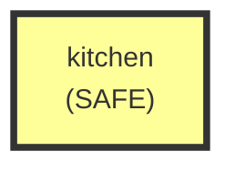

# 🚀 VirtualHome Agent Episode Log


### [GoalReasoner (Module A - Intent)] Output
```json
{
  "literal_instruction": "If there is no one in the kitchen, make sure the kitchen is safe."
}
```

### [PerceptionFilter] Output
```json
{
  "reasoning": "The goal is to make the kitchen safe. With no specific hazard named, the minimal relevant classes are the kitchen fixtures and common safety-related control points that could be checked or operated to ensure the room is safe: lights, doors, stove, microwave, sink/faucet, and garbage disposal area. Background/decorative objects are irrelevant.",
  "selected_classes": [
    "microwave",
    "lightswitch",
    "sink",
    "door",
    "garbagecan",
    "faucet",
    "stove",
    "character"
  ],
  "raw_class_count": 54
}
```

### [LLMExecutor] Output
```json
{
  "reasoning": "The SDG requires the kitchen to be SAFE. Based on the filtered graph, the stove is ON and CLOSED, which is an unsafe condition in a kitchen. The most direct progress is to turn the stove off. We are already inside the kitchen, so no walk is needed first. The stove has no plug requirement, so the correct next atomic action is to switch it off.",
  "satisfied_nodes": [],
  "current_node_focus": "N1",
  "mapped_variables": {},
  "action": "[switchoff] <stove> (311)"
}
```

### [RoboStateMultiTaskController] Output
```json
{
  "action": "[walk] <stove> (311)",
  "active_task_id": "task_1",
  "task_context": {
    "active_task_id": "task_1",
    "pending_task_ids": [],
    "satisfied_task_ids": []
  },
  "source": "llm_executor_repaired"
}
```
## Step 0
- **Action**: `[walk] <stove> (311)`
- **Action Success**: `True`
- **Action Message**: {'0': {'message': 'Success'}}
- **Active Task**: `task_1`
- **Decision Source**: `llm_executor_repaired`
- **Task Progress**: T3_without_goal_reasoning_G2_10=pending
- **SDG Status**:

- **Observed Items (12)**: door(224) [OPEN], garbagecan(229) [CLOSED], sink(247), faucet(248) [OFF], lightswitch(261) [ON], stove(311) [CLOSED,ON], microwave(313) [CLOSED,OFF], character(1), bathroom(11), bedroom(73), kitchen(205), livingroom(335)


### [PerceptionFilter] Output
```json
{
  "reasoning": "Reused cached class selection.",
  "selected_classes": [
    "microwave",
    "lightswitch",
    "sink",
    "door",
    "garbagecan",
    "faucet",
    "stove",
    "character"
  ],
  "raw_class_count": 54
}
```

### [LLMExecutor] Output
```json
{
  "reasoning": "The kitchen is currently occupied by the character(1) according to the graph, so the condition 'if there is no one in the kitchen' is not satisfied. The only way to progress toward the SAFE state from the available information is to make the kitchen as safe as possible by addressing the active stove, which is ON and therefore a likely hazard. I am already close to the stove from the prior step, so the next atomic action is to turn it off.",
  "satisfied_nodes": [],
  "current_node_focus": "N1",
  "mapped_variables": {},
  "action": "[switchoff] <stove> (311)"
}
```

### [RoboStateMultiTaskController] Output
```json
{
  "action": "[switchoff] <stove> (311)",
  "active_task_id": "task_1",
  "task_context": {
    "active_task_id": "task_1",
    "pending_task_ids": [],
    "satisfied_task_ids": []
  },
  "source": "llm_executor"
}
```
## Step 1
- **Action**: `[switchoff] <stove> (311)`
- **Action Success**: `True`
- **Action Message**: Faked switch operation in Python layer (bypassed Unity failure)
- **Active Task**: `task_1`
- **Decision Source**: `llm_executor`
- **Task Progress**: T3_without_goal_reasoning_G2_10=done
- **SDG Status**:

- **Observed Items (12)**: door(224) [OPEN], garbagecan(229) [CLOSED], sink(247), faucet(248) [OFF], lightswitch(261) [ON], stove(311) [CLOSED,ON], microwave(313) [CLOSED,OFF], character(1), bathroom(11), bedroom(73), kitchen(205), livingroom(335)

