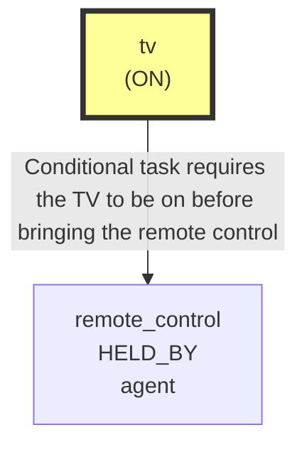

# 🚀 VirtualHome Agent Episode Log


### [GoalReasoner (Module A - Intent)] Output
```json
{
  "literal_instruction": "If the TV is on, bring the remote control."
}
```

### [PerceptionFilter] Output
```json
{
  "reasoning": "The goal condition depends on the TV being on, and the required item to bring is the remote control. So the minimum necessary classes are the TV and the remote control, using the exact observed class names.",
  "selected_classes": [
    "tv",
    "character",
    "remotecontrol"
  ],
  "raw_class_count": 40
}
```

### [LLMExecutor] Output
```json
{
  "reasoning": "The SDG requires the TV to be ON before bringing the remote control. However, the only observed TV instance is tv(426), which is explicitly marked BROKEN and OFF. This makes the prerequisite permanently impossible for this task as stated, so the conditional goal cannot be satisfied in the current environment.",
  "satisfied_nodes": [],
  "current_node_focus": "N1",
  "mapped_variables": {
    "?TV": "tv(426)",
    "?Remote": "remotecontrol(452)"
  },
  "action": "[ask] The TV required by the task is broken and cannot be turned on. This makes the condition 'If the TV is on' impossible to satisfy here. Please confirm if you want me to proceed differently."
}
```

### [RoboStateMultiTaskController] Output
```json
{
  "action": "[ask] The TV required by the task is broken and cannot be turned on. This makes the condition 'If the TV is on' impossible to satisfy here. Please confirm if you want me to proceed differently.",
  "active_task_id": "task_1",
  "task_context": {
    "active_task_id": "task_1",
    "pending_task_ids": [],
    "satisfied_task_ids": []
  },
  "source": "llm_executor"
}
```
## Step 0
- **Action**: `[ask] The TV required by the task is broken and cannot be turned on. This makes the condition 'If the TV is on' impossible to satisfy here. Please confirm if you want me to proceed differently.`
- **Action Success**: `True`
- **Action Message**: nothing to claim
- **Active Task**: `task_1`
- **Decision Source**: `llm_executor`
- **Task Progress**: T3_without_goal_reasoning_G3_13=pending
- **SDG Status**:

- **Observed Items (7)**: tv(426) [OFF,BROKEN], remotecontrol(452) [OFF], character(1), bathroom(11), bedroom(73), kitchen(205), livingroom(335)

