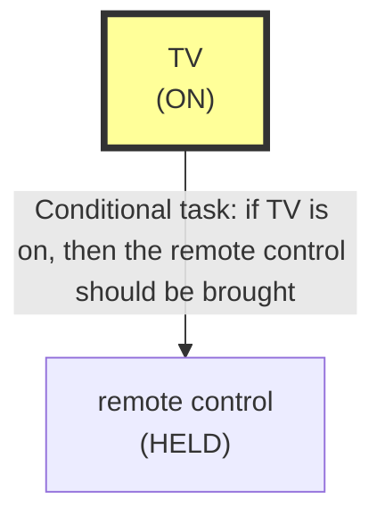

# 🚀 VirtualHome Agent Episode Log


### [GoalReasoner (Module A - Intent)] Output
```json
{
  "objects": [
    "TV",
    "remote control"
  ],
  "quantities": [
    1,
    1
  ],
  "states": [
    {
      "object": "TV",
      "state": "on"
    }
  ],
  "conditions": [
    {
      "if": "TV is on",
      "then": "bring the remote control"
    }
  ],
  "destinations": [],
  "clarification_question": "What should be done if the TV is not on?"
}
```

### [PerceptionFilter] Output
```json
{
  "reasoning": "The goal condition is to bring the remote control only if the TV is on. The SDG requires the TV state and the remote control being held. So the only necessary object classes are the TV and the remote control; no extra tools or locations are required.",
  "selected_classes": [
    "tv",
    "character",
    "remotecontrol"
  ],
  "raw_class_count": 40
}
```

### [LLMExecutor] Output
```json
{
  "reasoning": "The SDG requires TV to be ON before bringing the remote control. However, the only TV in the graph is explicitly BROKEN and currently OFF, which makes the condition 'if TV is on' permanently unsatisfied. Per the failure-handling rules, this is an inherently false precondition, so I must report impossibility rather than proceed physically.",
  "satisfied_nodes": [],
  "current_node_focus": "N1",
  "mapped_variables": {
    "?Washer": "N/A"
  },
  "action": "[ask] The task is impossible as stated because the only TV available is BROKEN and cannot be turned on. What should I do if the TV is not on?"
}
```

### [RoboStateMultiTaskController] Output
```json
{
  "action": "[ask] The task is impossible as stated because the only TV available is BROKEN and cannot be turned on. What should I do if the TV is not on?",
  "active_task_id": "task_1",
  "task_context": {
    "active_task_id": "task_1",
    "pending_task_ids": [],
    "satisfied_task_ids": []
  },
  "source": "llm_executor"
}
```
## Step 0
- **Action**: `[ask] The task is impossible as stated because the only TV available is BROKEN and cannot be turned on. What should I do if the TV is not on?`
- **Action Success**: `True`
- **Action Message**: nothing to claim
- **Active Task**: `task_1`
- **Decision Source**: `llm_executor`
- **Task Progress**: T3_without_intention_G3_13=pending
- **SDG Status**:

- **Observed Items (7)**: tv(426) [OFF,BROKEN], remotecontrol(452) [OFF], character(1), bathroom(11), bedroom(73), kitchen(205), livingroom(335)

