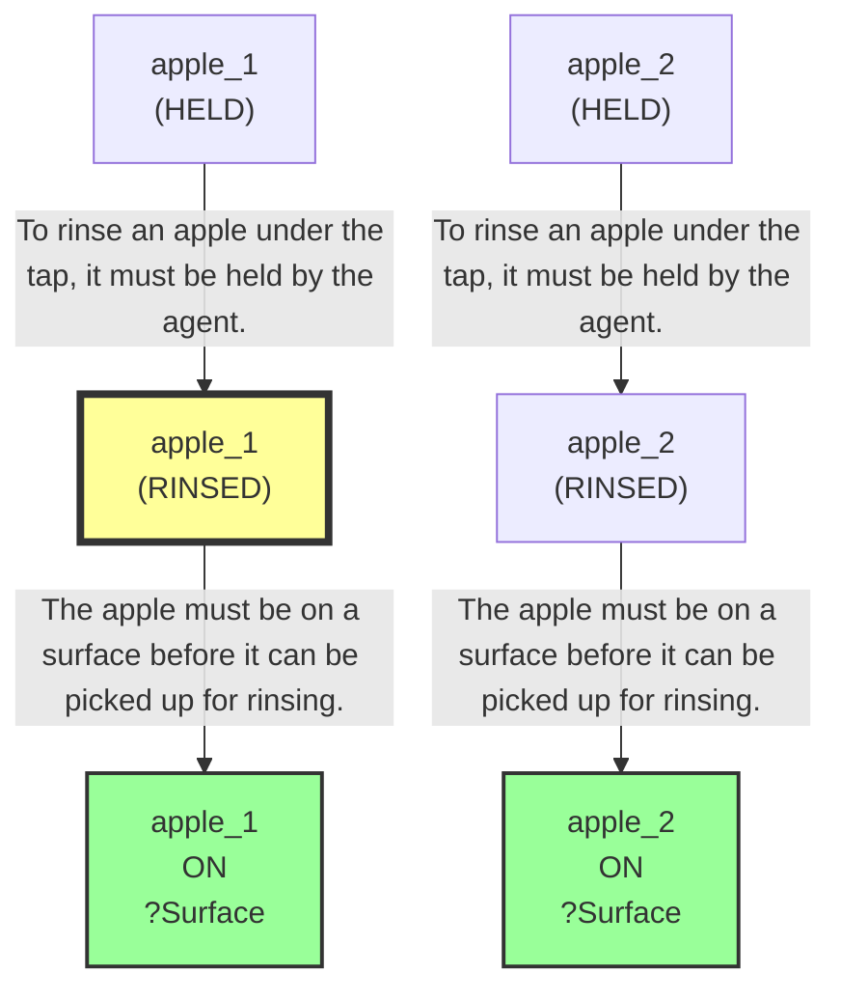
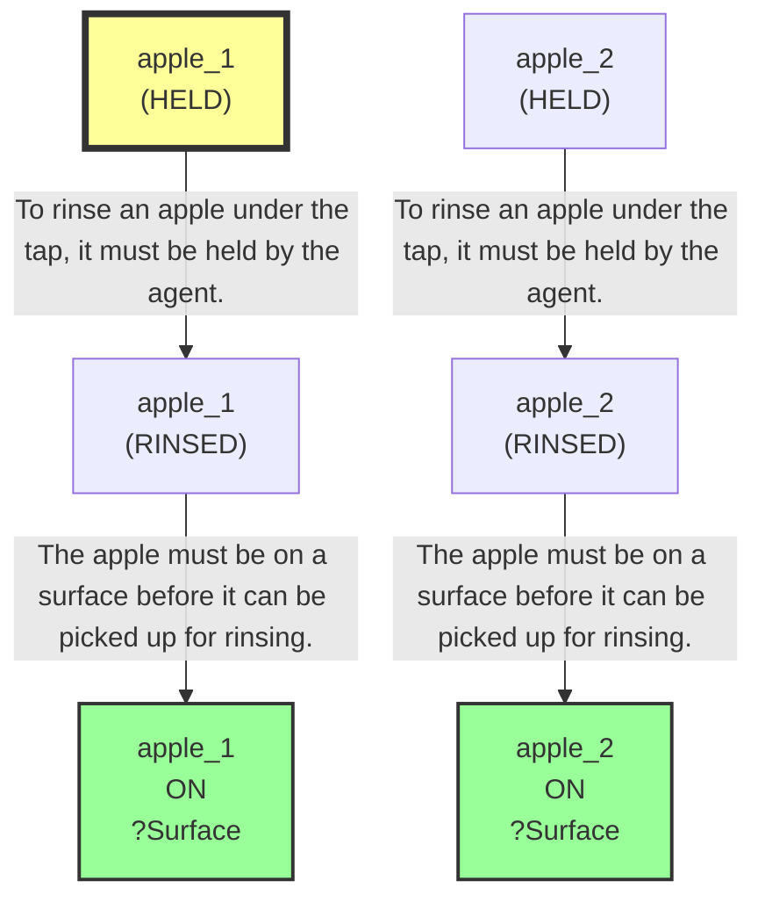
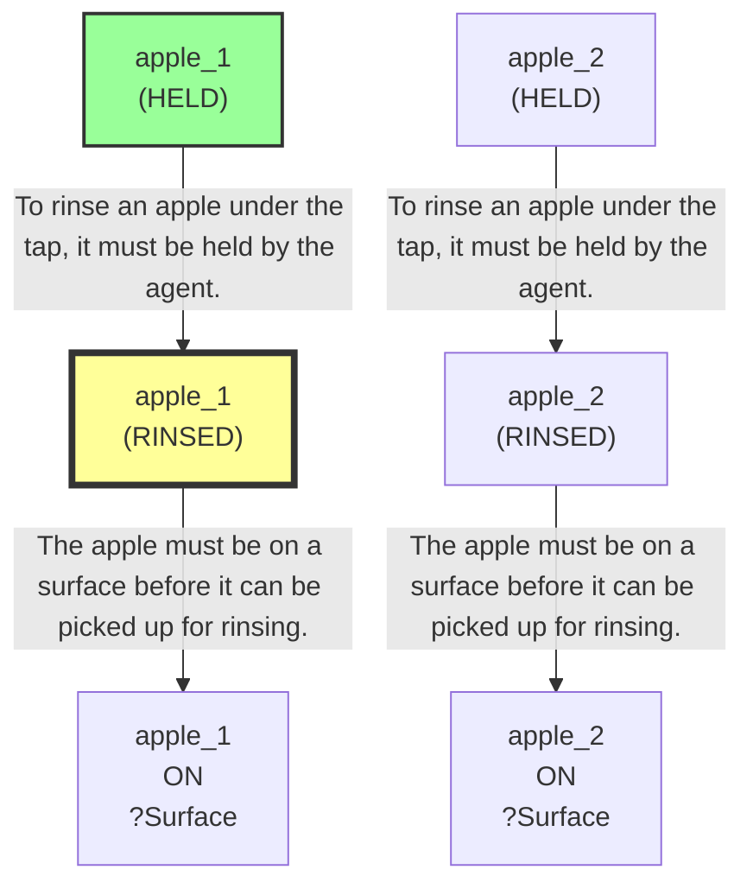
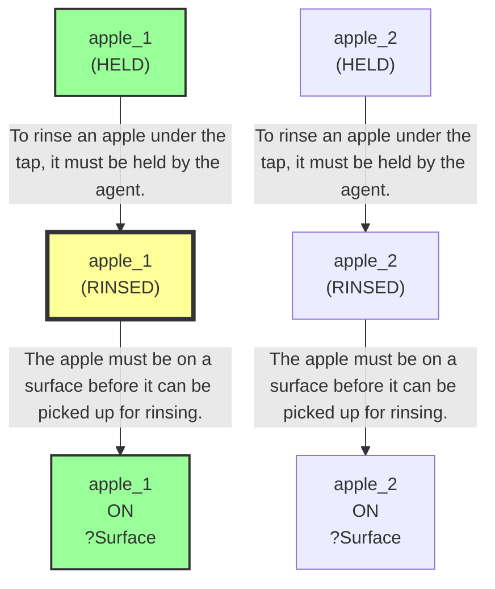

# 🚀 VirtualHome Agent Episode Log


### [GoalReasoner (Module A - Intent)] Output
```json
{
  "objects": [
    "apples",
    "table",
    "tap",
    "me"
  ],
  "quantities": [
    "one"
  ],
  "states": [
    {
      "object": "apples",
      "state": "on the table"
    }
  ],
  "conditions": [
    "if there are apples on the table"
  ],
  "destinations": [
    "under the tap",
    "me"
  ],
  "actions": [
    {
      "verb": "rinse",
      "object": "them",
      "destination": "under the tap"
    },
    {
      "verb": "bring",
      "object": "one",
      "destination": "me"
    }
  ],
  "clarification_question": null
}
```

### [PerceptionFilter] Output
```json
{
  "reasoning": "Need the target apples, the surface they are on (table), the tap/faucet for rinsing, and the agent/character representing me. No extra tools are required beyond the tap; the table is needed because the apples are stated to be on it.",
  "selected_classes": [
    "kitchentable",
    "faucet",
    "apple",
    "character"
  ],
  "raw_class_count": 55
}
```

### [LLMExecutor] Output
```json
{
  "reasoning": "The first required SDG dependency is that an apple must be on a surface before it can be picked up and rinsed. The current graph shows apple(437) is already ON kitchentable(231), so N1 is satisfied for the available apple instance. Since the task asks to rinse apples under the tap and bring one to me, the immediate next progress-making step is to pick up the apple so it can later be rinsed at the faucet. I am already close to the kitchentable, and the apple is grabbable and movable.",
  "satisfied_nodes": [
    "N1",
    "N4"
  ],
  "current_node_focus": "N2",
  "mapped_variables": {
    "?Surface": "kitchentable(231)"
  },
  "action": "[grab] <apple> (437)"
}
```

### [RoboStateMultiTaskController] Output
```json
{
  "action": "[walk] <apple> (437)",
  "active_task_id": "task_1",
  "task_context": {
    "active_task_id": "task_1",
    "pending_task_ids": [],
    "satisfied_task_ids": []
  },
  "source": "llm_executor_repaired"
}
```
## Step 0
- **Action**: `[walk] <apple> (437)`
- **Action Success**: `True`
- **Action Message**: {'0': {'message': 'Success'}}
- **Active Task**: `task_1`
- **Decision Source**: `llm_executor_repaired`
- **Task Progress**: T3_without_intention_G4_17=pending
- **SDG Status**:

- **Observed Items (8)**: kitchentable(231), faucet(248) [OFF], apple(437) [DIRTY], character(1), bathroom(11), bedroom(73), kitchen(205), livingroom(335)


### [PerceptionFilter] Output
```json
{
  "reasoning": "Reused cached class selection.",
  "selected_classes": [
    "kitchentable",
    "faucet",
    "apple",
    "character"
  ],
  "raw_class_count": 55
}
```

### [LLMExecutor] Output
```json
{
  "reasoning": "The active apple (437) is already on the table and close to the character, so the next required step toward rinsing it is to pick it up. N1 is satisfied by the current graph because apple_1 maps to the visible apple on the kitchentable. I should grab the apple before moving to the tap/faucet for rinsing.",
  "satisfied_nodes": [
    "N1",
    "N4"
  ],
  "current_node_focus": "N3",
  "mapped_variables": {
    "?Surface": "kitchentable(231)"
  },
  "action": "[grab] <apple> (437)"
}
```

### [RoboStateMultiTaskController] Output
```json
{
  "action": "[grab] <apple> (437)",
  "active_task_id": "task_1",
  "task_context": {
    "active_task_id": "task_1",
    "pending_task_ids": [],
    "satisfied_task_ids": []
  },
  "source": "llm_executor"
}
```
## Step 1
- **Action**: `[grab] <apple> (437)`
- **Action Success**: `True`
- **Action Message**: {'0': {'message': 'Success'}}
- **Active Task**: `task_1`
- **Decision Source**: `llm_executor`
- **Task Progress**: T3_without_intention_G4_17=pending
- **SDG Status**:

- **Observed Items (8)**: kitchentable(231), faucet(248) [OFF], apple(437) [DIRTY], character(1), bathroom(11), bedroom(73), kitchen(205), livingroom(335)


### [PerceptionFilter] Output
```json
{
  "reasoning": "Reused cached class selection.",
  "selected_classes": [
    "kitchentable",
    "faucet",
    "apple",
    "character"
  ],
  "raw_class_count": 55
}
```

### [LLMExecutor] Output
```json
{
  "reasoning": "Apple(437) is already held and is dirty. To satisfy the RINSED state, the next required step is to move to the water source under the tap, which is the faucet(248), before performing the rinse/wash interaction in a later step. The apple is already on the table relation is satisfied by being close to the kitchentable and previously on/near it, but the remaining focus is rinsing one apple and later bringing it to the user.",
  "satisfied_nodes": [
    "N3"
  ],
  "current_node_focus": "N2",
  "mapped_variables": {
    "?Surface": "kitchentable(231)"
  },
  "action": "[walk] <faucet> (248)"
}
```

### [RoboStateMultiTaskController] Output
```json
{
  "action": "[walk] <faucet> (248)",
  "active_task_id": "task_1",
  "task_context": {
    "active_task_id": "task_1",
    "pending_task_ids": [],
    "satisfied_task_ids": []
  },
  "source": "llm_executor"
}
```
## Step 2
- **Action**: `[walk] <faucet> (248)`
- **Action Success**: `True`
- **Action Message**: {'0': {'message': 'Success'}}
- **Active Task**: `task_1`
- **Decision Source**: `llm_executor`
- **Task Progress**: T3_without_intention_G4_17=pending
- **SDG Status**:

- **Observed Items (8)**: kitchentable(231), faucet(248) [OFF], apple(437) [DIRTY], character(1), bathroom(11), bedroom(73), kitchen(205), livingroom(335)


### [PerceptionFilter] Output
```json
{
  "reasoning": "Reused cached class selection.",
  "selected_classes": [
    "kitchentable",
    "faucet",
    "apple",
    "character"
  ],
  "raw_class_count": 55
}
```

### [LLMExecutor] Output
```json
{
  "reasoning": "Apple 437 is already held and we are already close to faucet 248, but the faucet is OFF. To satisfy the RINSED state, the next necessary step is to turn the faucet on before any rinse action can occur. The apple is already the correct held object, so no further movement is needed right now.",
  "satisfied_nodes": [
    "N3"
  ],
  "current_node_focus": "N2",
  "mapped_variables": {
    "?Surface": "kitchentable(231)",
    "?Washer": "faucet(248)"
  },
  "action": "[switchon] <faucet> (248)"
}
```

### [RoboStateMultiTaskController] Output
```json
{
  "action": "[switchon] <faucet> (248)",
  "active_task_id": "task_1",
  "task_context": {
    "active_task_id": "task_1",
    "pending_task_ids": [],
    "satisfied_task_ids": []
  },
  "source": "llm_executor"
}
```
## Step 3
- **Action**: `[switchon] <faucet> (248)`
- **Action Success**: `True`
- **Action Message**: Faked switch operation in Python layer (bypassed Unity failure)
- **Active Task**: `task_1`
- **Decision Source**: `llm_executor`
- **Task Progress**: T3_without_intention_G4_17=pending
- **SDG Status**:

- **Observed Items (8)**: kitchentable(231), faucet(248) [OFF], apple(437) [DIRTY], character(1), bathroom(11), bedroom(73), kitchen(205), livingroom(335)


### [PerceptionFilter] Output
```json
{
  "reasoning": "Reused cached class selection.",
  "selected_classes": [
    "kitchentable",
    "faucet",
    "apple",
    "character"
  ],
  "raw_class_count": 55
}
```

### [LLMExecutor] Output
```json
{
  "reasoning": "The active apple is already held and the faucet is on and nearby. The next missing SDG node is to make the apple RINSED by using the tap. Since the apple must be held to rinse and it is already in-hand, the single next atomic action is to wash/rinse the held apple at the faucet. This should satisfy the rinsing state for apple_1 and progress toward bringing one apple to the user.",
  "satisfied_nodes": [
    "N1",
    "N3"
  ],
  "current_node_focus": "N2",
  "mapped_variables": {
    "?Surface": "kitchentable(231)"
  },
  "action": "[wash] <apple> (437)"
}
```

### [RoboStateMultiTaskController] Output
```json
{
  "action": "[wash] <apple> (437)",
  "active_task_id": "task_1",
  "task_context": {
    "active_task_id": "task_1",
    "pending_task_ids": [],
    "satisfied_task_ids": []
  },
  "source": "llm_executor"
}
```
## Step 4
- **Action**: `[wash] <apple> (437)`
- **Action Success**: `True`
- **Action Message**: Washed successfully.
- **Active Task**: `task_1`
- **Decision Source**: `llm_executor`
- **Task Progress**: T3_without_intention_G4_17=done
- **SDG Status**:

- **Observed Items (8)**: kitchentable(231), faucet(248) [ON], apple(437) [DIRTY], character(1), bathroom(11), bedroom(73), kitchen(205), livingroom(335)

