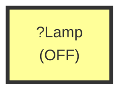

# 🚀 VirtualHome Agent Episode Log


### [GoalReasoner (Module A - Intent)] Output
```json
{
  "objects": [
    "desk lamp"
  ],
  "quantities": [
    1
  ],
  "states": [
    {
      "object": "desk lamp",
      "state": "on",
      "target_state": "off"
    }
  ],
  "conditions": [
    {
      "type": "if",
      "object": "desk lamp",
      "state": "on"
    }
  ],
  "destinations": [],
  "action": "turn off"
}
```

### [PerceptionFilter] Output
```json
{
  "reasoning": "The goal is to turn off a desk lamp. To achieve this, the only necessary visible class is the lamp class that matches the target object. Among the observed objects, tablelamp is the relevant lamp type; a lightswitch is not required by the SDG for this direct state change.",
  "selected_classes": [
    "desk",
    "character",
    "tablelamp"
  ],
  "raw_class_count": 33
}
```

### [LLMExecutor] Output
```json
{
  "reasoning": "The goal is to make the desk lamp OFF. In the current bedroom there are two candidate lamps, both are ON and both are likely valid bindings for ?Lamp. Since no further disambiguation is given and the instruction is to turn off the desk lamp, the most reasonable choice is the first listed lamp, tablelamp(102). The robot is already in the same room, so the next atomic step is to walk to that lamp before switching it off.",
  "satisfied_nodes": [],
  "current_node_focus": "N1",
  "mapped_variables": {
    "?Lamp": "tablelamp(102)"
  },
  "action": "[walk] <tablelamp> (102)"
}
```

### [RoboStateMultiTaskController] Output
```json
{
  "action": "[walk] <tablelamp> (102)",
  "active_task_id": "task_1",
  "task_context": {
    "active_task_id": "task_1",
    "pending_task_ids": [],
    "satisfied_task_ids": []
  },
  "source": "llm_executor"
}
```
## Step 0
- **Action**: `[walk] <tablelamp> (102)`
- **Action Success**: `True`
- **Action Message**: {'0': {'message': 'Success'}}
- **Active Task**: `task_1`
- **Decision Source**: `llm_executor`
- **Task Progress**: T3_without_intention_G4_19=pending
- **SDG Status**:

- **Observed Items (8)**: tablelamp(102) [ON], tablelamp(103) [ON], desk(108) [CLOSED], character(1), bathroom(11), bedroom(73), kitchen(205), livingroom(335)


### [PerceptionFilter] Output
```json
{
  "reasoning": "Reused cached class selection.",
  "selected_classes": [
    "desk",
    "character",
    "tablelamp"
  ],
  "raw_class_count": 33
}
```

### [LLMExecutor] Output
```json
{
  "reasoning": "The active goal is to turn off the desk lamp. The current graph shows tablelamp(102) is ON and already CLOSE to the character, with a switch available. Since we are already near the correct lamp and the task only requires changing its state to OFF, the next atomic action is to switch it off.",
  "satisfied_nodes": [],
  "current_node_focus": "N1",
  "mapped_variables": {
    "?Lamp": "tablelamp(102)"
  },
  "action": "[switchoff] <tablelamp> (102)"
}
```

### [RoboStateMultiTaskController] Output
```json
{
  "action": "[switchoff] <tablelamp> (102)",
  "active_task_id": "task_1",
  "task_context": {
    "active_task_id": "task_1",
    "pending_task_ids": [],
    "satisfied_task_ids": []
  },
  "source": "llm_executor"
}
```
## Step 1
- **Action**: `[switchoff] <tablelamp> (102)`
- **Action Success**: `True`
- **Action Message**: Faked switch operation in Python layer (bypassed Unity failure)
- **Active Task**: `task_1`
- **Decision Source**: `llm_executor`
- **Task Progress**: T3_without_intention_G4_19=done
- **SDG Status**:

- **Observed Items (8)**: tablelamp(102) [ON], tablelamp(103) [ON], desk(108) [CLOSED], character(1), bathroom(11), bedroom(73), kitchen(205), livingroom(335)

