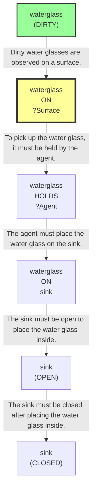
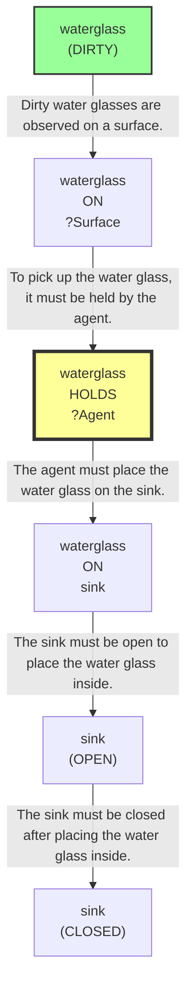
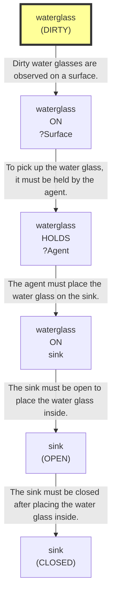
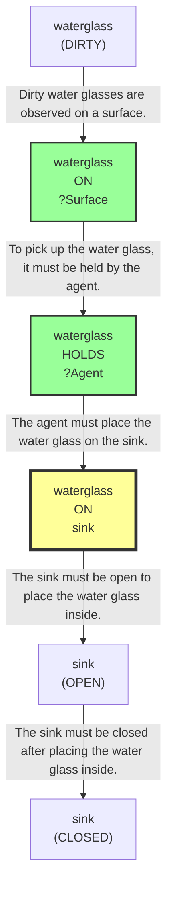
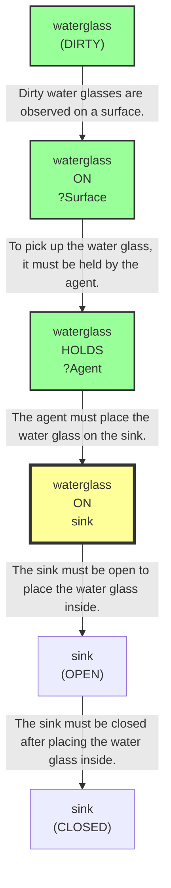
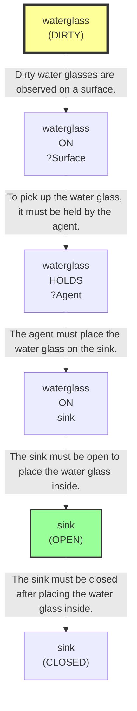

# 🚀 VirtualHome Agent Episode Log


### [GoalReasoner (Module A - Intent)] Output
```json
{
  "is_instruction_obviously_vague": false,
  "clarification_question": null,
  "target_object": "dirty water glasses",
  "location_hint": "sink",
  "reasoning_chain": [
    {
      "question": "Why does the user want this object?",
      "answer": "The user wants to manage and organize dirty water glasses."
    },
    {
      "question": "Why is that important?",
      "answer": "It is important to maintain cleanliness and hygiene in the environment."
    },
    {
      "question": "What fundamental need does this fulfill?",
      "answer": "The user wants to ensure that dirty items are properly disposed of or cleaned."
    },
    {
      "question": "Are there any deeper psychological or physical motivations?",
      "answer": "The user likely wants to maintain a clean and organized space, which contributes to a sense of order and well-being."
    }
  ],
  "deep_intent": "The user wants to maintain cleanliness and order by properly disposing of dirty items.",
  "acceptable_alternatives_properties": [
    {
      "priority": 1,
      "description": "Other dirty glassware items, such as wine glasses or juice glasses."
    },
    {
      "priority": 2,
      "description": "Dirty containers or cups used for liquids."
    },
    {
      "priority": 3,
      "description": "Items that require cleaning or disposal, such as used mugs or bowls."
    },
    {
      "priority": 4,
      "description": "General waste items that need to be placed in a designated area for cleaning or disposal."
    }
  ]
}
```

### [PerceptionFilter] Output
```json
{
  "reasoning": "The goal is to manage and organize dirty water glasses, specifically by placing them in the sink. The SDG requires identifying dirty water glasses, holding them, placing them on the sink, and ensuring the sink is open and closed. Therefore, the essential object classes are 'waterglass' (the target object), 'sink' (the location and receptacle), and 'fridge' (as a backup for storing clean glasses if needed).",
  "selected_classes": [
    "sink",
    "waterglass",
    "fridge",
    "juice",
    "character"
  ],
  "raw_class_count": 50
}
```

### [LLMExecutor] Output
```json
{
  "reasoning": "The current goal is to satisfy node N1, which requires the waterglass to be in a DIRTY state. The Filtered Graph shows that waterglass(64) is already DIRTY, so this condition is satisfied. The next step is to satisfy node N2, which requires the waterglass to be ON a surface. Since the waterglass is inside the kitchen, we need to locate it and walk to it to interact with it. The next action is to walk to the waterglass(64) to prepare for grabbing it.",
  "satisfied_nodes": [
    "N1"
  ],
  "current_node_focus": "N2",
  "mapped_variables": {
    "?Surface": "kitchen(11)"
  },
  "action": "[walk] <waterglass> (64)"
}
```

### [RoboStateMultiTaskController] Output
```json
{
  "action": "[walk] <waterglass> (64)",
  "active_task_id": "task_1",
  "task_context": {
    "active_task_id": "task_1",
    "pending_task_ids": [],
    "satisfied_task_ids": []
  },
  "source": "llm_executor"
}
```
## Step 0
- **Action**: `[walk] <waterglass> (64)`
- **Action Success**: `True`
- **Action Message**: {'0': {'message': 'Success'}}
- **Active Task**: `task_1`
- **Decision Source**: `llm_executor`
- **Task Progress**: T4_qwen_M1_03=pending
- **SDG Status**:

- **Observed Items (18)**: waterglass(64) [DIRTY], waterglass(71), waterglass(72), waterglass(79), waterglass(80), waterglass(87), waterglass(88), waterglass(100), sink(155), fridge(162) [CLOSED], juice(173), juice(174), character(1), kitchen(11), livingroom(183)...


### [PerceptionFilter] Output
```json
{
  "reasoning": "Reused cached class selection.",
  "selected_classes": [
    "sink",
    "waterglass",
    "fridge",
    "juice",
    "character"
  ],
  "raw_class_count": 50
}
```

### [LLMExecutor] Output
```json
{
  "reasoning": "The current Filtered Graph shows that the waterglass(64) is DIRTY and located inside the kitchen(11). The next step is to grab the dirty water glass. Since the robot is already near it (as confirmed by the previous [walk] action), it can now proceed to [grab] the waterglass(64). This action satisfies the SDG node N3 (the waterglass must be held by the agent).",
  "satisfied_nodes": [
    "N1"
  ],
  "current_node_focus": "N3",
  "mapped_variables": {
    "?Washer": "sink(155)"
  },
  "action": "[grab] <waterglass> (64)"
}
```

### [RoboStateMultiTaskController] Output
```json
{
  "action": "[grab] <waterglass> (64)",
  "active_task_id": "task_1",
  "task_context": {
    "active_task_id": "task_1",
    "pending_task_ids": [],
    "satisfied_task_ids": []
  },
  "source": "llm_executor"
}
```
## Step 1
- **Action**: `[grab] <waterglass> (64)`
- **Action Success**: `False`
- **Action Message**: temporary_unavailable: target disappeared; wait or search and retry
- **Active Task**: `task_1`
- **Decision Source**: `llm_executor`
- **Task Progress**: T4_qwen_M1_03=pending
- **SDG Status**:

- **Observed Items (18)**: waterglass(64) [DIRTY], waterglass(71), waterglass(72), waterglass(79), waterglass(80), waterglass(87), waterglass(88), waterglass(100), sink(155), fridge(162) [CLOSED], juice(173), juice(174), character(1), kitchen(11), livingroom(183)...


### [PerceptionFilter] Output
```json
{
  "reasoning": "Reused cached class selection.",
  "selected_classes": [
    "sink",
    "waterglass",
    "fridge",
    "juice",
    "character"
  ],
  "raw_class_count": 50
}
```

### [LLMExecutor] Output
```json
{
  "reasoning": "The previous attempt to [grab] <waterglass> (64) failed because the object disappeared temporarily. This indicates that another person might be using it. According to the rules, we should wait for it to return instead of retrying immediately. The next logical step is to wait for the object to reappear so that we can proceed with the task.",
  "satisfied_nodes": [],
  "current_node_focus": "N1",
  "mapped_variables": {},
  "action": "[wait]"
}
```

### [RoboStateMultiTaskController] Output
```json
{
  "action": "[wait]",
  "active_task_id": "task_1",
  "task_context": {
    "active_task_id": "task_1",
    "pending_task_ids": [],
    "satisfied_task_ids": []
  },
  "source": "llm_executor"
}
```
## Step 2
- **Action**: `[wait]`
- **Action Success**: `True`
- **Action Message**: Time passes. You waited for a while.
- **Active Task**: `task_1`
- **Decision Source**: `llm_executor`
- **Task Progress**: T4_qwen_M1_03=pending
- **SDG Status**:

- **Observed Items (18)**: waterglass(64) [DIRTY], waterglass(71), waterglass(72), waterglass(79), waterglass(80), waterglass(87), waterglass(88), waterglass(100), sink(155), fridge(162) [CLOSED], juice(173), juice(174), character(1), kitchen(11), livingroom(183)...


### [PerceptionFilter] Output
```json
{
  "reasoning": "Reused cached class selection.",
  "selected_classes": [
    "sink",
    "waterglass",
    "fridge",
    "juice",
    "character"
  ],
  "raw_class_count": 50
}
```

### [LLMExecutor] Output
```json
{
  "reasoning": "The previous attempt to grab the waterglass(64) failed because it disappeared, likely due to another character using it. Now, we need to find a suitable dirty water glass from the available options. The waterglass(64) is no longer available, but there are other waterglasses in the kitchen. We should identify a DIRTY waterglass to proceed with the task. The waterglass(64) is marked as DIRTY, but it's no longer present. We need to find an alternative DIRTY waterglass to fulfill the goal.",
  "satisfied_nodes": [],
  "current_node_focus": "N1",
  "mapped_variables": {
    "?Washer": "sink(155)"
  },
  "action": "[walk] <waterglass> (79)"
}
```

### [RoboStateMultiTaskController] Output
```json
{
  "action": "[walk] <waterglass> (79)",
  "active_task_id": "task_1",
  "task_context": {
    "active_task_id": "task_1",
    "pending_task_ids": [],
    "satisfied_task_ids": []
  },
  "source": "llm_executor"
}
```
## Step 3
- **Action**: `[walk] <waterglass> (79)`
- **Action Success**: `True`
- **Action Message**: {'0': {'message': 'Success'}}
- **Active Task**: `task_1`
- **Decision Source**: `llm_executor`
- **Task Progress**: T4_qwen_M1_03=pending
- **SDG Status**:

- **Observed Items (18)**: waterglass(64) [DIRTY], waterglass(71), waterglass(72), waterglass(79), waterglass(80), waterglass(87), waterglass(88), waterglass(100), sink(155), fridge(162) [CLOSED], juice(173), juice(174), character(1), kitchen(11), livingroom(183)...


### [PerceptionFilter] Output
```json
{
  "reasoning": "Reused cached class selection.",
  "selected_classes": [
    "sink",
    "waterglass",
    "fridge",
    "juice",
    "character"
  ],
  "raw_class_count": 50
}
```

### [LLMExecutor] Output
```json
{
  "reasoning": "The current focus is on satisfying node N3, which requires the water glass to be held by the agent. However, the previous attempt to grab waterglass(64) failed due to it disappearing, and the next attempt to grab waterglass(79) has not yet been executed. Since the robot is currently near waterglass(79), the next logical step is to attempt to grab it. This action will satisfy the 'HOLDS' relation required for node N3.",
  "satisfied_nodes": [
    "N1"
  ],
  "current_node_focus": "N3",
  "mapped_variables": {
    "?Surface": "sink(155)"
  },
  "action": "[grab] <waterglass> (79)"
}
```

### [RoboStateMultiTaskController] Output
```json
{
  "action": "[grab] <waterglass> (79)",
  "active_task_id": "task_1",
  "task_context": {
    "active_task_id": "task_1",
    "pending_task_ids": [],
    "satisfied_task_ids": []
  },
  "source": "llm_executor"
}
```
## Step 4
- **Action**: `[grab] <waterglass> (79)`
- **Action Success**: `True`
- **Action Message**: {'0': {'message': 'Success'}}
- **Active Task**: `task_1`
- **Decision Source**: `llm_executor`
- **Task Progress**: T4_qwen_M1_03=pending
- **SDG Status**:

- **Observed Items (18)**: waterglass(64) [DIRTY], waterglass(71), waterglass(72), waterglass(79), waterglass(80), waterglass(87), waterglass(88), waterglass(100), sink(155), fridge(162) [CLOSED], juice(173), juice(174), character(1), kitchen(11), livingroom(183)...


### [PerceptionFilter] Output
```json
{
  "reasoning": "Reused cached class selection.",
  "selected_classes": [
    "sink",
    "waterglass",
    "fridge",
    "juice",
    "character"
  ],
  "raw_class_count": 50
}
```

### [LLMExecutor] Output
```json
{
  "reasoning": "The current focus is on satisfying node N4, which requires placing the dirty water glass on the sink. The robot is already holding waterglass(79), which is a dirty glass. The next step is to walk to the sink (sink(155)) to place the glass on it. Since the sink is a flat surface, the appropriate action is [putback].",
  "satisfied_nodes": [
    "N2",
    "N3"
  ],
  "current_node_focus": "N4",
  "mapped_variables": {
    "?Surface": "sink(155)"
  },
  "action": "[walk] <sink> (155)"
}
```

### [RoboStateMultiTaskController] Output
```json
{
  "action": "[walk] <sink> (155)",
  "active_task_id": "task_1",
  "task_context": {
    "active_task_id": "task_1",
    "pending_task_ids": [],
    "satisfied_task_ids": []
  },
  "source": "llm_executor"
}
```
## Step 5
- **Action**: `[walk] <sink> (155)`
- **Action Success**: `True`
- **Action Message**: {'0': {'message': 'Success'}}
- **Active Task**: `task_1`
- **Decision Source**: `llm_executor`
- **Task Progress**: T4_qwen_M1_03=pending
- **SDG Status**:

- **Observed Items (18)**: waterglass(64) [DIRTY], waterglass(71), waterglass(72), waterglass(79), waterglass(80), waterglass(87), waterglass(88), waterglass(100), sink(155), fridge(162) [CLOSED], juice(173), juice(174), character(1), kitchen(11), livingroom(183)...


### [PerceptionFilter] Output
```json
{
  "reasoning": "Reused cached class selection.",
  "selected_classes": [
    "sink",
    "waterglass",
    "fridge",
    "juice",
    "character"
  ],
  "raw_class_count": 50
}
```

### [LLMExecutor] Output
```json
{
  "reasoning": "The current focus is on satisfying node N4, which requires placing the water glass on the sink. The robot is already holding waterglass(79) and is near the sink (sink(155)). The next step is to place the water glass on the sink. Since the sink is a flat surface, the correct action is [putback] to place the object on it.",
  "satisfied_nodes": [
    "N1",
    "N2",
    "N3"
  ],
  "current_node_focus": "N4",
  "mapped_variables": {
    "?Surface": "sink(155)"
  },
  "action": "[putback] <waterglass> (79) <sink> (155)"
}
```

### [RoboStateMultiTaskController] Output
```json
{
  "action": "[walk] <livingroom> (183)",
  "active_task_id": null,
  "task_context": {
    "active_task_id": null,
    "pending_task_ids": [
      "task_1"
    ],
    "satisfied_task_ids": []
  },
  "source": "loop_recovery_room_revisit"
}
```
## Step 6
- **Action**: `[walk] <livingroom> (183)`
- **Action Success**: `True`
- **Action Message**: {'0': {'message': 'Success'}}
- **Decision Source**: `loop_recovery_room_revisit`
- **Task Progress**: T4_qwen_M1_03=pending
- **SDG Status**:
No SDG active.
- **Observed Items (159)**: wall(12), wall(13), wall(14), wall(15), wall(16), wall(17), wall(18), wall(19), wall(20), wall(21), floor(22), floor(23), floor(24), floor(25), floor(26)...


### [PerceptionFilter] Output
```json
{
  "reasoning": "The goal is to manage and organize dirty water glasses, specifically by placing them in the sink. The SDG requires identifying dirty water glasses, holding them, placing them on the sink, and ensuring the sink is open and closed. Therefore, the essential object classes are 'waterglass' (the target object), 'sink' (the location and receptacle), and 'fridge' (as a backup for storing clean glasses if needed).",
  "selected_classes": [
    "sink",
    "waterglass",
    "fridge",
    "juice",
    "character"
  ],
  "raw_class_count": 59
}
```

### [LLMExecutor] Output
```json
{
  "reasoning": "The current focus is on satisfying node N4, which requires placing the waterglass on the sink. The robot is currently holding waterglass(79) and is near the sink(155). The next step is to place the waterglass on the sink. However, the sink is not a surface, so the correct action is to use [putback] to place the waterglass on the sink. The sink is a flat surface, and the robot must be near it to perform this action.",
  "satisfied_nodes": [
    "N2",
    "N3"
  ],
  "current_node_focus": "N4",
  "mapped_variables": {
    "?Surface": "sink(155)"
  },
  "action": "[putback] <waterglass> (79) <sink> (155)"
}
```

### [RoboStateMultiTaskController] Output
```json
{
  "action": "[walk] <bedroom> (241)",
  "active_task_id": null,
  "task_context": {
    "active_task_id": null,
    "pending_task_ids": [
      "task_1"
    ],
    "satisfied_task_ids": []
  },
  "source": "loop_recovery_room_revisit"
}
```
## Step 7
- **Action**: `[walk] <bedroom> (241)`
- **Action Success**: `True`
- **Action Message**: {'0': {'message': 'Success'}}
- **Decision Source**: `loop_recovery_room_revisit`
- **Task Progress**: T4_qwen_M1_03=pending
- **SDG Status**:
No SDG active.
- **Observed Items (211)**: wall(12), wall(13), wall(14), wall(15), wall(16), wall(17), wall(18), wall(19), wall(20), wall(21), floor(22), floor(23), floor(24), floor(25), floor(26)...


### [PerceptionFilter] Output
```json
{
  "reasoning": "The goal is to manage and organize dirty water glasses, specifically by placing them in the sink. The SDG requires identifying dirty water glasses, holding them, placing them on the sink, and ensuring the sink is open and closed. Therefore, the essential object classes are 'waterglass' (the target object), 'sink' (the location and receptacle), and 'fridge' (as a backup for potential storage or cleaning of glasses).",
  "selected_classes": [
    "sink",
    "waterglass",
    "fridge",
    "juice",
    "character"
  ],
  "raw_class_count": 65
}
```

### [LLMExecutor] Output
```json
{
  "reasoning": "The current focus is on satisfying node N4, which requires placing the dirty water glass on the sink. The robot is currently holding waterglass(79), and the sink (155) is in the environment. However, the sink is not a surface, so [putback] is not applicable. Instead, the robot must [putin] the waterglass into the sink. Before doing so, the sink must be open. The sink is currently closed, so the robot must first [open] the sink.",
  "satisfied_nodes": [
    "N1",
    "N2",
    "N3"
  ],
  "current_node_focus": "N4",
  "mapped_variables": {
    "?Washer": "sink(155)"
  },
  "action": "[open] <sink> (155)"
}
```

### [RoboStateMultiTaskController] Output
```json
{
  "action": "[walk] <bathroom> (285)",
  "active_task_id": null,
  "task_context": {
    "active_task_id": null,
    "pending_task_ids": [
      "task_1"
    ],
    "satisfied_task_ids": []
  },
  "source": "loop_recovery_room_revisit"
}
```
## Step 8
- **Action**: `[walk] <bathroom> (285)`
- **Action Success**: `True`
- **Action Message**: {'0': {'message': 'Success'}}
- **Decision Source**: `loop_recovery_room_revisit`
- **Task Progress**: T4_qwen_M1_03=pending
- **SDG Status**:
No SDG active.
- **Observed Items (243)**: wall(12), wall(13), wall(14), wall(15), wall(16), wall(17), wall(18), wall(19), wall(20), wall(21), floor(22), floor(23), floor(24), floor(25), floor(26)...


### [PerceptionFilter] Output
```json
{
  "reasoning": "The goal is to manage and organize dirty water glasses, specifically by placing them on the sink. The SDG requires identifying dirty water glasses, holding them, placing them on the sink, and ensuring the sink is open and closed. Therefore, the essential object classes are 'waterglass' (the target object), 'sink' (the location and receptacle), and 'fridge' (as a backup for storing clean glasses if needed).",
  "selected_classes": [
    "sink",
    "waterglass",
    "fridge",
    "juice",
    "character"
  ],
  "raw_class_count": 81
}
```

### [LLMExecutor] Output
```json
{
  "reasoning": "The current focus is on satisfying node N4, which requires placing the dirty water glass on the sink. The robot is currently holding waterglass(79), which is DIRTY, and is near the sink(155). However, the sink is not open, so the next step is to open the sink to allow placing the glass inside. Since the sink is not openable (as per the Controller Rejections), the correct action is to place the glass on the sink surface directly, which is a valid flat surface. The robot must first ensure it is near the sink and then perform the [putback] action.",
  "satisfied_nodes": [
    "N2",
    "N3"
  ],
  "current_node_focus": "N4",
  "mapped_variables": {
    "?Surface": "sink(155)"
  },
  "action": "[putback] <waterglass> (79) <sink> (155)"
}
```

### [RoboStateMultiTaskController] Output
```json
{
  "action": "[walk] <bedroom> (346)",
  "active_task_id": null,
  "task_context": {
    "active_task_id": null,
    "pending_task_ids": [
      "task_1"
    ],
    "satisfied_task_ids": []
  },
  "source": "loop_recovery_room_revisit"
}
```
## Step 9
- **Action**: `[walk] <bedroom> (346)`
- **Action Success**: `True`
- **Action Message**: {'0': {'message': 'Success'}}
- **Decision Source**: `loop_recovery_room_revisit`
- **Task Progress**: T4_qwen_M1_03=pending
- **SDG Status**:
No SDG active.
- **Observed Items (303)**: wall(12), wall(13), wall(14), wall(15), wall(16), wall(17), wall(18), wall(19), wall(20), wall(21), floor(22), floor(23), floor(24), floor(25), floor(26)...


### [PerceptionFilter] Output
```json
{
  "reasoning": "The goal is to manage and organize dirty water glasses, specifically by placing them on the sink. The SDG requires identifying dirty water glasses, holding them, placing them on the sink, and ensuring the sink is open and closed. Therefore, the essential object classes are 'waterglass' (the target object), 'sink' (the location and receptacle), and 'fridge' (as a backup for storing clean glasses if needed).",
  "selected_classes": [
    "sink",
    "waterglass",
    "fridge",
    "juice",
    "mug",
    "character"
  ],
  "raw_class_count": 91
}
```

### [LLMExecutor] Output
```json
{
  "reasoning": "The current focus is on satisfying node N4, which requires placing the dirty water glass on the sink. The robot is currently holding waterglass(79), which is DIRTY, and is located in the bedroom(346). The sink(155) is in the kitchen(11), and the robot is currently in the bedroom(346). Therefore, the next step is to walk to the sink(155) to prepare for placing the water glass on it.",
  "satisfied_nodes": [
    "N1",
    "N2",
    "N3"
  ],
  "current_node_focus": "N4",
  "mapped_variables": {
    "?Surface": "sink(155)"
  },
  "action": "[walk] <sink> (155)"
}
```

### [RoboStateMultiTaskController] Output
```json
{
  "action": "[walk] <sink> (155)",
  "active_task_id": "task_1",
  "task_context": {
    "active_task_id": "task_1",
    "pending_task_ids": [],
    "satisfied_task_ids": []
  },
  "source": "llm_executor"
}
```
## Step 10
- **Action**: `[walk] <sink> (155)`
- **Action Success**: `True`
- **Action Message**: {'0': {'message': 'Success'}}
- **Active Task**: `task_1`
- **Decision Source**: `llm_executor`
- **Task Progress**: T4_qwen_M1_03=pending
- **SDG Status**:

- **Observed Items (21)**: waterglass(64) [DIRTY], waterglass(71), waterglass(72), waterglass(79), waterglass(80), waterglass(87), waterglass(88), waterglass(100), sink(155), fridge(162) [CLOSED], juice(173), juice(174), character(1), kitchen(11), livingroom(183)...


### [PerceptionFilter] Output
```json
{
  "reasoning": "Reused cached class selection.",
  "selected_classes": [
    "sink",
    "waterglass",
    "fridge",
    "juice",
    "mug",
    "character"
  ],
  "raw_class_count": 91
}
```

### [LLMExecutor] Output
```json
{
  "reasoning": "The current focus is on satisfying node N4, which requires placing the dirty water glass on the sink. The robot is already holding waterglass(79) and is near the sink(155). The next step is to place the water glass on the sink. However, the sink must be open to accept the object. The sink(155) is currently closed, as indicated by the 'CLOSE character(1)' relation. Therefore, the next action should be to open the sink before placing the water glass on it.",
  "satisfied_nodes": [
    "N1",
    "N2",
    "N3"
  ],
  "current_node_focus": "N4",
  "mapped_variables": {
    "?Surface": "sink(155)"
  },
  "action": "[open] <sink> (155)"
}
```

### [RoboStateMultiTaskController] Output
```json
{
  "action": "[walk] <livingroom> (183)",
  "active_task_id": null,
  "task_context": {
    "active_task_id": null,
    "pending_task_ids": [
      "task_1"
    ],
    "satisfied_task_ids": []
  },
  "source": "loop_recovery_room_revisit"
}
```
## Step 11
- **Action**: `[walk] <livingroom> (183)`
- **Action Success**: `True`
- **Action Message**: {'0': {'message': 'Success'}}
- **Decision Source**: `loop_recovery_room_revisit`
- **Task Progress**: T4_qwen_M1_03=pending
- **SDG Status**:
No SDG active.
- **Observed Items (361)**: wall(12), wall(13), wall(14), wall(15), wall(16), wall(17), wall(18), wall(19), wall(20), wall(21), floor(22), floor(23), floor(24), floor(25), floor(26)...


### [PerceptionFilter] Output
```json
{
  "reasoning": "Reused cached class selection.",
  "selected_classes": [
    "sink",
    "waterglass",
    "fridge",
    "juice",
    "mug",
    "character"
  ],
  "raw_class_count": 91
}
```

### [LLMExecutor] Output
```json
{
  "reasoning": "The current focus is on satisfying node N4, which requires placing the dirty water glass on the sink. The robot is already holding the waterglass(79) and is near the sink(155). The next step is to place the waterglass on the sink. Since the sink is a flat surface, the correct action is [putback] <waterglass> (79) <sink> (155).",
  "satisfied_nodes": [
    "N1",
    "N2",
    "N3"
  ],
  "current_node_focus": "N4",
  "mapped_variables": {
    "?Surface": "sink(155)"
  },
  "action": "[putback] <waterglass> (79) <sink> (155)"
}
```

### [RoboStateMultiTaskController] Output
```json
{
  "action": "[walk] <bedroom> (241)",
  "active_task_id": null,
  "task_context": {
    "active_task_id": null,
    "pending_task_ids": [
      "task_1"
    ],
    "satisfied_task_ids": []
  },
  "source": "loop_recovery_room_revisit"
}
```
## Step 12
- **Action**: `[walk] <bedroom> (241)`
- **Action Success**: `True`
- **Action Message**: {'0': {'message': 'Success'}}
- **Decision Source**: `loop_recovery_room_revisit`
- **Task Progress**: T4_qwen_M1_03=pending
- **SDG Status**:
No SDG active.
- **Observed Items (361)**: wall(12), wall(13), wall(14), wall(15), wall(16), wall(17), wall(18), wall(19), wall(20), wall(21), floor(22), floor(23), floor(24), floor(25), floor(26)...


### [PerceptionFilter] Output
```json
{
  "reasoning": "Reused cached class selection.",
  "selected_classes": [
    "sink",
    "waterglass",
    "fridge",
    "juice",
    "mug",
    "character"
  ],
  "raw_class_count": 91
}
```

### [LLMExecutor] Output
```json
{
  "reasoning": "The current focus is on satisfying node N4, which requires placing the dirty water glass on the sink. The robot is already holding the waterglass(79) and is near the sink(155). The next step is to place the waterglass on the sink. However, the sink is not a surface, so the correct action is to use [putback] to place the object on the sink. The sink(155) is a valid target for [putback] as it is a flat surface.",
  "satisfied_nodes": [
    "N1",
    "N2",
    "N3"
  ],
  "current_node_focus": "N4",
  "mapped_variables": {
    "?Surface": "sink(155)"
  },
  "action": "[putback] <waterglass> (79) <sink> (155)"
}
```

### [RoboStateMultiTaskController] Output
```json
{
  "action": "[walk] <bathroom> (285)",
  "active_task_id": null,
  "task_context": {
    "active_task_id": null,
    "pending_task_ids": [
      "task_1"
    ],
    "satisfied_task_ids": []
  },
  "source": "loop_recovery_room_revisit"
}
```
## Step 13
- **Action**: `[walk] <bathroom> (285)`
- **Action Success**: `True`
- **Action Message**: {'0': {'message': 'Success'}}
- **Decision Source**: `loop_recovery_room_revisit`
- **Task Progress**: T4_qwen_M1_03=pending
- **SDG Status**:
No SDG active.
- **Observed Items (361)**: wall(12), wall(13), wall(14), wall(15), wall(16), wall(17), wall(18), wall(19), wall(20), wall(21), floor(22), floor(23), floor(24), floor(25), floor(26)...


### [PerceptionFilter] Output
```json
{
  "reasoning": "Reused cached class selection.",
  "selected_classes": [
    "sink",
    "waterglass",
    "fridge",
    "juice",
    "mug",
    "character"
  ],
  "raw_class_count": 91
}
```

### [LLMExecutor] Output
```json
{
  "reasoning": "The current goal is to place a dirty water glass on the sink. The robot has already grabbed the waterglass(79) and walked to the sink(155). The next step is to put the waterglass on the sink. However, the sink is not a surface, so the correct action is to use [putback] to place the waterglass on the sink. The sink is a valid surface for placing items, and the robot is already near it.",
  "satisfied_nodes": [
    "N2",
    "N3"
  ],
  "current_node_focus": "N4",
  "mapped_variables": {
    "?Surface": "sink(155)"
  },
  "action": "[putback] <waterglass> (79) <sink> (155)"
}
```

### [RoboStateMultiTaskController] Output
```json
{
  "action": "[walk] <bedroom> (346)",
  "active_task_id": null,
  "task_context": {
    "active_task_id": null,
    "pending_task_ids": [
      "task_1"
    ],
    "satisfied_task_ids": []
  },
  "source": "loop_recovery_room_revisit"
}
```
## Step 14
- **Action**: `[walk] <bedroom> (346)`
- **Action Success**: `True`
- **Action Message**: {'0': {'message': 'Success'}}
- **Decision Source**: `loop_recovery_room_revisit`
- **Task Progress**: T4_qwen_M1_03=pending
- **SDG Status**:
No SDG active.
- **Observed Items (361)**: wall(12), wall(13), wall(14), wall(15), wall(16), wall(17), wall(18), wall(19), wall(20), wall(21), floor(22), floor(23), floor(24), floor(25), floor(26)...


### [PerceptionFilter] Output
```json
{
  "reasoning": "Reused cached class selection.",
  "selected_classes": [
    "sink",
    "waterglass",
    "fridge",
    "juice",
    "mug",
    "character"
  ],
  "raw_class_count": 91
}
```

### [LLMExecutor] Output
```json
{
  "reasoning": "The current Filtered Graph shows that there is a `waterglass(64)` with the state `DIRTY`, which matches the SDG node N1. However, the robot is not holding this object, and it is not on the sink. The next step is to grab the dirty water glass and then walk to the sink to place it there. Since the robot is already at the sink (from previous actions), the next action should be to grab the dirty water glass.",
  "satisfied_nodes": [
    "N5"
  ],
  "current_node_focus": "N1",
  "mapped_variables": {
    "?Washer": "sink(155)"
  },
  "action": "[grab] <waterglass> (64)"
}
```

### [RoboStateMultiTaskController] Output
```json
{
  "action": "[walk] <waterglass> (64)",
  "active_task_id": "task_1",
  "task_context": {
    "active_task_id": "task_1",
    "pending_task_ids": [],
    "satisfied_task_ids": []
  },
  "source": "llm_executor_repaired"
}
```
## Step 15
- **Action**: `[walk] <waterglass> (64)`
- **Action Success**: `True`
- **Action Message**: {'0': {'message': 'Success'}}
- **Active Task**: `task_1`
- **Decision Source**: `llm_executor_repaired`
- **Task Progress**: T4_qwen_M1_03=pending
- **SDG Status**:

- **Observed Items (21)**: waterglass(64) [DIRTY], waterglass(71), waterglass(72), waterglass(79), waterglass(80), waterglass(87), waterglass(88), waterglass(100), sink(155), fridge(162) [CLOSED], juice(173), juice(174), character(1), kitchen(11), livingroom(183)...


### [PerceptionFilter] Output
```json
{
  "reasoning": "Reused cached class selection.",
  "selected_classes": [
    "sink",
    "waterglass",
    "fridge",
    "juice",
    "mug",
    "character"
  ],
  "raw_class_count": 91
}
```

### [LLMExecutor] Output
```json
{
  "reasoning": "The current focus is on satisfying node N3, which requires the waterglass to be held by the agent. The robot is already near the waterglass(64), which is in a DIRTY state and is GRABBABLE. The next logical step is to grab the waterglass to satisfy the 'HOLDS' relation.",
  "satisfied_nodes": [
    "N1"
  ],
  "current_node_focus": "N3",
  "mapped_variables": {
    "?Waterglass": "waterglass(64)"
  },
  "action": "[grab] <waterglass> (64)"
}
```

### [RoboStateMultiTaskController] Output
```json
{
  "action": "[grab] <waterglass> (64)",
  "active_task_id": "task_1",
  "task_context": {
    "active_task_id": "task_1",
    "pending_task_ids": [],
    "satisfied_task_ids": []
  },
  "source": "llm_executor"
}
```
## Step 16
- **Action**: `[grab] <waterglass> (64)`
- **Action Success**: `True`
- **Action Message**: {'0': {'message': 'Success'}}
- **Active Task**: `task_1`
- **Decision Source**: `llm_executor`
- **Task Progress**: T4_qwen_M1_03=pending
- **SDG Status**:

- **Observed Items (21)**: waterglass(64) [DIRTY], waterglass(71), waterglass(72), waterglass(79), waterglass(80), waterglass(87), waterglass(88), waterglass(100), sink(155), fridge(162) [CLOSED], juice(173), juice(174), character(1), kitchen(11), livingroom(183)...


### [PerceptionFilter] Output
```json
{
  "reasoning": "Reused cached class selection.",
  "selected_classes": [
    "sink",
    "waterglass",
    "fridge",
    "juice",
    "mug",
    "character"
  ],
  "raw_class_count": 91
}
```

### [LLMExecutor] Output
```json
{
  "reasoning": "The current focus is on satisfying node N4, which requires placing the dirty water glass on the sink. The robot is already holding the waterglass(64) (as confirmed by the 'HOLDS_RH' relation in the Filtered Graph), and the sink(155) is in the same location (as confirmed by the 'INSIDE kitchen(11)' relation). The next logical step is to place the waterglass on the sink. However, the sink must be open to accept the object, so we need to verify if the sink is open. If it is not, we must open it before proceeding.",
  "satisfied_nodes": [
    "N1",
    "N2",
    "N3"
  ],
  "current_node_focus": "N4",
  "mapped_variables": {
    "?Surface": "sink(155)"
  },
  "action": "[putback] <waterglass> (64) <sink> (155)"
}
```

### [RoboStateMultiTaskController] Output
```json
{
  "action": "[walk] <livingroom> (183)",
  "active_task_id": null,
  "task_context": {
    "active_task_id": null,
    "pending_task_ids": [
      "task_1"
    ],
    "satisfied_task_ids": []
  },
  "source": "loop_recovery_room_revisit"
}
```
## Step 17
- **Action**: `[walk] <livingroom> (183)`
- **Action Success**: `True`
- **Action Message**: {'0': {'message': 'Success'}}
- **Decision Source**: `loop_recovery_room_revisit`
- **Task Progress**: T4_qwen_M1_03=pending
- **SDG Status**:
No SDG active.
- **Observed Items (361)**: wall(12), wall(13), wall(14), wall(15), wall(16), wall(17), wall(18), wall(19), wall(20), wall(21), floor(22), floor(23), floor(24), floor(25), floor(26)...

