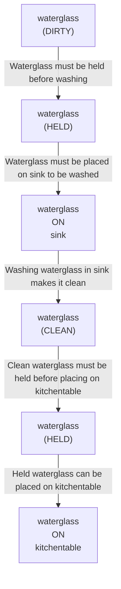
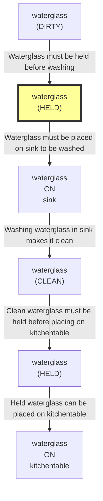
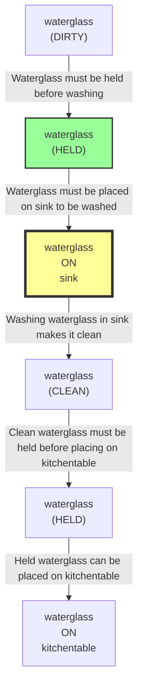
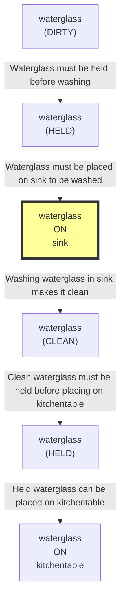

# 🚀 VirtualHome Agent Episode Log


### [GoalReasoner (Module A - Intent)] Output
```json
{
  "is_instruction_obviously_vague": false,
  "clarification_question": null,
  "target_object": "waterglass",
  "location_hint": "sink (for washing), then kitchentable (final placement)",
  "reasoning_chain": [
    {
      "question": "Why does the user want the waterglass washed?",
      "answer": "Because the waterglass is dirty, and dirty objects are unsuitable for their intended use (drinking water)."
    },
    {
      "question": "Why is it important to clean it?",
      "answer": "A clean waterglass ensures hygiene and safety for drinking, preventing contamination or unpleasant taste/appearance."
    },
    {
      "question": "Why place it on the kitchentable after washing?",
      "answer": "The kitchentable is a designated storage or display location, making the clean waterglass accessible and organized."
    },
    {
      "question": "What is the fundamental need here?",
      "answer": "The user wants to maintain household hygiene and organization by ensuring drinking vessels are clean and properly stored."
    }
  ],
  "deep_intent": "Maintain hygiene and organization of household drinking vessels by removing contaminants and placing the item in an accessible, designated location.",
  "acceptable_alternatives_properties": [
    {
      "priority": 1,
      "description": "Other drinking glasses or cups (e.g., regular glass, mug, tumbler) that are dirty and need washing and placement on the kitchentable."
    },
    {
      "priority": 2,
      "description": "Other drinkware items (e.g., bowls, plates, utensils) that require cleaning in the sink and organization on kitchen surfaces."
    },
    {
      "priority": 3,
      "description": "Any household items that are dirty and require washing at the sink and subsequent placement in a designated storage area."
    },
    {
      "priority": 4,
      "description": "General household cleaning and organization tasks, such as wiping down surfaces or organizing items on kitchen tables."
    }
  ]
}
```

### [RoboStateMultiTaskController] Output
```json
{
  "action": "[walk] <kitchen> (11)",
  "active_task_id": "task_1",
  "task_context": {
    "active_task_id": "task_1",
    "pending_task_ids": [],
    "satisfied_task_ids": []
  },
  "source": "room_frontier"
}
```
## Step 0
- **Action**: `[walk] <kitchen> (11)`
- **Action Success**: `True`
- **Action Message**: {'0': {'message': 'Success'}}
- **Active Task**: `task_1`
- **Decision Source**: `room_frontier`
- **Task Progress**: T4_claude_P3_13=pending
- **SDG Status**:

- **Observed Items (66)**: wall(286), wall(287), wall(288), wall(289), wall(290), wall(291), floor(292), floor(293), floor(294), floor(295), floor(296), floor(297), ceiling(298), ceiling(299), ceiling(300)...


### [PerceptionFilter] Output
```json
{
  "reasoning": "Fallback due to error.",
  "selected_classes": [
    "plate",
    "character",
    "sink",
    "kitchentable",
    "waterglass"
  ],
  "raw_class_count": 67
}
```

### [LLMExecutor] Output
```json
{
  "reasoning": "The task is to wash a waterglass and place it on the kitchentable. The SDG shows the progression: N5 (DIRTY) → N6 (HELD) → N4 (ON sink) → N1 (CLEAN) → N3 (HELD) → N2 (ON kitchentable). I am currently in the kitchen(11). Looking at the Filtered Graph, I can see multiple waterglasses. The task specifies 'waterglass' without a specific ID, so I need to select one. Since the Goal Intent emphasizes washing a dirty waterglass, I should look for one that is dirty. However, the current Filtered Graph does not show DIRTY states explicitly for any waterglass. Given that I'm already in the kitchen and close to several waterglasses (waterglass(87) is marked CLOSE to character(1)), I should grab the nearest one to begin the task. Waterglass(87) is CLOSE to me and ON kitchentable(135). I'll grab this one first to start the workflow: grab → walk to sink → wash → walk to kitchentable → putback.",
  "satisfied_nodes": [],
  "current_node_focus": "N6",
  "mapped_variables": {
    "waterglass": "waterglass(87)",
    "sink": "sink(155)",
    "kitchentable": "kitchentable(131)"
  },
  "action": "[grab] <waterglass> (87)"
}
```

### [RoboStateMultiTaskController] Output
```json
{
  "action": "[grab] <waterglass> (87)",
  "active_task_id": "task_1",
  "task_context": {
    "active_task_id": "task_1",
    "pending_task_ids": [],
    "satisfied_task_ids": []
  },
  "source": "llm_executor"
}
```
## Step 1
- **Action**: `[grab] <waterglass> (87)`
- **Action Success**: `True`
- **Action Message**: {'0': {'message': 'Success'}}
- **Active Task**: `task_1`
- **Decision Source**: `llm_executor`
- **Task Progress**: T4_claude_P3_13=pending
- **SDG Status**:

- **Observed Items (29)**: sink(326), plate(336), waterglass(339), character(1), kitchen(11), livingroom(183), bedroom(241), bathroom(285), bedroom(346), waterglass(64), plate(67), plate(68), waterglass(71), waterglass(72), plate(75)...


### [PerceptionFilter] Output
```json
{
  "reasoning": "Fallback due to error.",
  "selected_classes": [
    "plate",
    "character",
    "sink",
    "kitchentable",
    "waterglass"
  ],
  "raw_class_count": 67
}
```

### [LLMExecutor] Output
```json
{
  "reasoning": "Current state analysis: The character is holding waterglass(87) in the right hand (HOLDS_RH waterglass(87)). The SDG requires: N5→N6→N4→N1→N3→N2, meaning the waterglass must be DIRTY (N5), then HELD (N6), then ON sink (N4), then CLEAN (N1), then HELD again (N3), then ON kitchentable (N2). Currently, waterglass(87) is HELD and CLOSE to character(1), and the character is INSIDE kitchen(11). The sink(155) is also INSIDE kitchen(11). However, I notice the Filtered Graph shows NO STATE information for waterglass(87) - it doesn't explicitly show DIRTY or CLEAN state. Looking at the character's relations, waterglass(87) is marked as CLOSE, meaning I'm near it and holding it. The next step in the SDG progression is N4: placing the waterglass ON the sink so it can be washed. To do this, I must first walk to the sink(155) to get near it, then execute [putback] to place the held waterglass on the sink. Since I just grabbed waterglass(87) in the previous step, I should now walk to sink(155) to position myself there before placing the glass on it.",
  "satisfied_nodes": [
    "N6"
  ],
  "current_node_focus": "N4",
  "mapped_variables": {
    "?Washer": "sink(155)"
  },
  "action": "[walk] <sink> (155)"
}
```

### [RoboStateMultiTaskController] Output
```json
{
  "action": "[walk] <sink> (155)",
  "active_task_id": "task_1",
  "task_context": {
    "active_task_id": "task_1",
    "pending_task_ids": [],
    "satisfied_task_ids": []
  },
  "source": "llm_executor"
}
```
## Step 2
- **Action**: `[walk] <sink> (155)`
- **Action Success**: `True`
- **Action Message**: {'0': {'message': 'Success'}}
- **Active Task**: `task_1`
- **Decision Source**: `llm_executor`
- **Task Progress**: T4_claude_P3_13=pending
- **SDG Status**:

- **Observed Items (29)**: sink(326), plate(336), waterglass(339), character(1), kitchen(11), livingroom(183), bedroom(241), bathroom(285), bedroom(346), waterglass(64), plate(67), plate(68), waterglass(71), waterglass(72), plate(75)...


### [PerceptionFilter] Output
```json
{
  "reasoning": "Fallback due to error.",
  "selected_classes": [
    "plate",
    "character",
    "sink",
    "kitchentable",
    "waterglass"
  ],
  "raw_class_count": 67
}
```

### [LLMExecutor] Output
```json
{
  "reasoning": "Current state analysis: The character is holding waterglass(87) and is CLOSE to sink(155) in the kitchen. According to the SDG, the progression is: N5 (DIRTY) → N6 (HELD) → N4 (ON sink) → N1 (CLEAN) → N3 (HELD) → N2 (ON kitchentable). We have successfully completed N5→N6 (grabbed the waterglass) and walked to the sink. The next step in the SDG is N4: place the waterglass ON the sink before washing. However, I notice the Filtered Graph shows waterglass(87) with no DIRTY state listed, and the graph shows waterglass(339) in the bathroom instead. This suggests waterglass(87) may already be the target object we're holding. Since we're already at the sink and holding the waterglass, the next logical step is to place it on the sink (N4) before washing it. This satisfies the prerequisite for washing (N4→N1).",
  "satisfied_nodes": [
    "N5",
    "N6"
  ],
  "current_node_focus": "N4",
  "mapped_variables": {
    "?Washer": "sink(155)"
  },
  "action": "[putback] <waterglass> (87) <sink> (155)"
}
```

### [RoboStateMultiTaskController] Output
```json
{
  "action": "[walk] <livingroom> (183)",
  "active_task_id": null,
  "task_context": {
    "active_task_id": null,
    "pending_task_ids": [
      "task_1"
    ],
    "satisfied_task_ids": []
  },
  "source": "loop_recovery_room_revisit"
}
```
## Step 3
- **Action**: `[walk] <livingroom> (183)`
- **Action Success**: `True`
- **Action Message**: {'0': {'message': 'Success'}}
- **Decision Source**: `loop_recovery_room_revisit`
- **Task Progress**: T4_claude_P3_13=pending
- **SDG Status**:
No SDG active.
- **Observed Items (219)**: wall(286), wall(287), wall(288), wall(289), wall(290), wall(291), floor(292), floor(293), floor(294), floor(295), floor(296), floor(297), ceiling(298), ceiling(299), ceiling(300)...


### [PerceptionFilter] Output
```json
{
  "reasoning": "Fallback due to error.",
  "selected_classes": [
    "plate",
    "character",
    "sink",
    "kitchentable",
    "waterglass"
  ],
  "raw_class_count": 75
}
```

### [LLMExecutor] Output
```json
{
  "reasoning": "Current state analysis: The character is in the livingroom(183) holding waterglass(87). According to the SDG, I need to: (1) wash the waterglass to make it CLEAN, (2) place it on kitchentable. The SDG path is: N5(DIRTY) -> N6(HELD) -> N4(ON sink) -> N1(CLEAN) -> N3(HELD) -> N2(ON kitchentable). Currently, waterglass(87) is HELD (satisfies N6). The next step in the SDG is N4: place the waterglass ON the sink. I can see sink(155) is in the kitchen and marked CLOSE to character(1), meaning I'm near it. However, I just walked to livingroom in step 3, so I need to walk back to the sink to place the waterglass there for washing. The sink(155) is the appropriate target since it's in the kitchen and has the RECIPIENT property needed for washing.",
  "satisfied_nodes": [
    "N6"
  ],
  "current_node_focus": "N4",
  "mapped_variables": {
    "?Washer": "sink(155)"
  },
  "action": "[walk] <sink> (155)"
}
```

### [RoboStateMultiTaskController] Output
```json
{
  "action": "[walk] <sink> (155)",
  "active_task_id": "task_1",
  "task_context": {
    "active_task_id": "task_1",
    "pending_task_ids": [],
    "satisfied_task_ids": []
  },
  "source": "llm_executor"
}
```
## Step 4
- **Action**: `[walk] <sink> (155)`
- **Action Success**: `True`
- **Action Message**: {'0': {'message': 'Success'}}
- **Active Task**: `task_1`
- **Decision Source**: `llm_executor`
- **Task Progress**: T4_claude_P3_13=pending
- **SDG Status**:

- **Observed Items (31)**: sink(326), plate(336), waterglass(339), character(1), kitchen(11), livingroom(183), bedroom(241), bathroom(285), bedroom(346), waterglass(64), plate(67), plate(68), waterglass(71), waterglass(72), plate(75)...


### [PerceptionFilter] Output
```json
{
  "reasoning": "Fallback due to error.",
  "selected_classes": [
    "plate",
    "character",
    "sink",
    "kitchentable",
    "waterglass"
  ],
  "raw_class_count": 75
}
```

### [LLMExecutor] Output
```json
{
  "reasoning": "Current state analysis: The character is holding waterglass(87) and is CLOSE to sink(155) in the kitchen. According to the SDG, the progression is: N5 (DIRTY) → N6 (HELD) → N4 (ON sink) → N1 (CLEAN) → N3 (HELD) → N2 (ON kitchentable). The character has already satisfied N5 and N6 (waterglass is held). The next step in the SDG is N4: placing the waterglass ON the sink so it can be washed. Since the character is already CLOSE to sink(155), I can now execute [putback] to place the held waterglass on the sink. This will satisfy N4 and enable the subsequent [wash] action.",
  "satisfied_nodes": [
    "N5",
    "N6"
  ],
  "current_node_focus": "N4",
  "mapped_variables": {
    "?Washer": "sink(155)"
  },
  "action": "[putback] <waterglass> (87) <sink> (155)"
}
```

### [RoboStateMultiTaskController] Output
```json
{
  "action": "[walk] <bedroom> (241)",
  "active_task_id": null,
  "task_context": {
    "active_task_id": null,
    "pending_task_ids": [
      "task_1"
    ],
    "satisfied_task_ids": []
  },
  "source": "loop_recovery_room_revisit"
}
```
## Step 5
- **Action**: `[walk] <bedroom> (241)`
- **Action Success**: `True`
- **Action Message**: {'0': {'message': 'Success'}}
- **Decision Source**: `loop_recovery_room_revisit`
- **Task Progress**: T4_claude_P3_13=pending
- **SDG Status**:
No SDG active.
- **Observed Items (271)**: wall(286), wall(287), wall(288), wall(289), wall(290), wall(291), floor(292), floor(293), floor(294), floor(295), floor(296), floor(297), ceiling(298), ceiling(299), ceiling(300)...


### [PerceptionFilter] Output
```json
{
  "reasoning": "Fallback due to error.",
  "selected_classes": [
    "plate",
    "character",
    "sink",
    "kitchentable",
    "waterglass"
  ],
  "raw_class_count": 81
}
```

### [LLMExecutor] Output
```json
{
  "reasoning": "The character is currently in bedroom(241) holding waterglass(87). According to the SDG, the task requires: (1) washing the waterglass to make it CLEAN, (2) placing it on kitchentable. The current state shows waterglass(87) is HELD by character(1) and CLOSE to character(1) in bedroom(241). The next step in the SDG chain is N4: place waterglass ON sink to prepare for washing. I need to walk to sink(155) which is in kitchen(11) and CLOSE to character(1) according to the graph. After reaching the sink, I will place the waterglass there, then wash it. Since I'm currently in bedroom(241) and the sink is in kitchen(11), I must walk to the sink first.",
  "satisfied_nodes": [
    "N6"
  ],
  "current_node_focus": "N4",
  "mapped_variables": {
    "?Washer": "sink(155)"
  },
  "action": "[walk] <sink> (155)"
}
```

### [RoboStateMultiTaskController] Output
```json
{
  "action": "[walk] <sink> (155)",
  "active_task_id": "task_1",
  "task_context": {
    "active_task_id": "task_1",
    "pending_task_ids": [],
    "satisfied_task_ids": []
  },
  "source": "llm_executor"
}
```
## Step 6
- **Action**: `[walk] <sink> (155)`
- **Action Success**: `True`
- **Action Message**: {'0': {'message': 'Success'}}
- **Active Task**: `task_1`
- **Decision Source**: `llm_executor`
- **Task Progress**: T4_claude_P3_13=pending
- **SDG Status**:

- **Observed Items (32)**: sink(326), plate(336), waterglass(339), character(1), kitchen(11), livingroom(183), bedroom(241), bathroom(285), bedroom(346), waterglass(64), plate(67), plate(68), waterglass(71), waterglass(72), plate(75)...


### [PerceptionFilter] Output
```json
{
  "reasoning": "Fallback due to error.",
  "selected_classes": [
    "plate",
    "character",
    "sink",
    "kitchentable",
    "waterglass"
  ],
  "raw_class_count": 81
}
```

### [LLMExecutor] Output
```json
{
  "reasoning": "Current state analysis: The character is holding waterglass(87) and is CLOSE to sink(155) in the kitchen. According to the SDG, the progression is: N5 (DIRTY) → N6 (HELD) → N4 (ON sink) → N1 (CLEAN) → N3 (HELD) → N2 (ON kitchentable). The character has already satisfied N5 and N6 (the waterglass was dirty and is now held). The character just walked to sink(155) in step 6 and is CLOSE to it. The next step in the SDG is N4: placing the waterglass ON the sink. Since the character is already holding waterglass(87) and is close to sink(155), the next action is to place the waterglass on the sink using [putback]. This will satisfy N4 and prepare for the washing step (N1).",
  "satisfied_nodes": [
    "N5",
    "N6"
  ],
  "current_node_focus": "N4",
  "mapped_variables": {
    "?Washer": "sink(155)",
    "?Target": "waterglass(87)"
  },
  "action": "[putback] <waterglass> (87) <sink> (155)"
}
```

### [RoboStateMultiTaskController] Output
```json
{
  "action": "[walk] <bedroom> (346)",
  "active_task_id": null,
  "task_context": {
    "active_task_id": null,
    "pending_task_ids": [
      "task_1"
    ],
    "satisfied_task_ids": []
  },
  "source": "loop_recovery_room_revisit"
}
```
## Step 7
- **Action**: `[walk] <bedroom> (346)`
- **Action Success**: `True`
- **Action Message**: {'0': {'message': 'Success'}}
- **Decision Source**: `loop_recovery_room_revisit`
- **Task Progress**: T4_claude_P3_13=pending
- **SDG Status**:
No SDG active.
- **Observed Items (303)**: wall(286), wall(287), wall(288), wall(289), wall(290), wall(291), floor(292), floor(293), floor(294), floor(295), floor(296), floor(297), ceiling(298), ceiling(299), ceiling(300)...


### [PerceptionFilter] Output
```json
{
  "reasoning": "Fallback due to error.",
  "selected_classes": [
    "plate",
    "mug",
    "character",
    "sink",
    "kitchentable",
    "waterglass"
  ],
  "raw_class_count": 91
}
```

### [LLMExecutor] Output
```json
{
  "reasoning": "Analyzing the current state: The character is in bedroom(346) holding waterglass(87) (shown as 'HOLDS_RH waterglass(87)' and 'CLOSE waterglass(87)'). The SDG requires: N5→N6→N4→N1→N3→N2, meaning the waterglass must be DIRTY (N5), then HELD (N6), then ON sink (N4), then CLEAN (N1), then HELD again (N3), then ON kitchentable (N2). \n\nCurrent progress: waterglass(87) is already HELD (satisfies N6). The past actions show the character has been walking between locations but hasn't yet washed the glass. The character is currently in bedroom(346) and needs to move to the sink to wash the waterglass. Looking at the Filtered Graph, sink(155) is in kitchen(11) and is marked as 'CLOSE character(1)', indicating proximity. However, the character is currently in bedroom(346), so I need to walk to the sink first before washing. The most recent action was walking to bedroom(346), so I should now walk to sink(155) to proceed with washing.",
  "satisfied_nodes": [
    "N6"
  ],
  "current_node_focus": "N4",
  "mapped_variables": {
    "waterglass": "waterglass(87)",
    "sink": "sink(155)",
    "kitchentable": "kitchentable(131)"
  },
  "action": "[walk] <sink> (155)"
}
```

### [RoboStateMultiTaskController] Output
```json
{
  "action": "[walk] <sink> (155)",
  "active_task_id": "task_1",
  "task_context": {
    "active_task_id": "task_1",
    "pending_task_ids": [],
    "satisfied_task_ids": []
  },
  "source": "llm_executor"
}
```
## Step 8
- **Action**: `[walk] <sink> (155)`
- **Action Success**: `True`
- **Action Message**: {'0': {'message': 'Success'}}
- **Active Task**: `task_1`
- **Decision Source**: `llm_executor`
- **Task Progress**: T4_claude_P3_13=pending
- **SDG Status**:

- **Observed Items (34)**: sink(326), plate(336), waterglass(339), character(1), kitchen(11), livingroom(183), bedroom(241), bathroom(285), bedroom(346), waterglass(64), plate(67), plate(68), waterglass(71), waterglass(72), plate(75)...


### [PerceptionFilter] Output
```json
{
  "reasoning": "Fallback due to error.",
  "selected_classes": [
    "plate",
    "mug",
    "character",
    "sink",
    "kitchentable",
    "waterglass"
  ],
  "raw_class_count": 91
}
```

### [LLMExecutor] Output
```json
{
  "reasoning": "Current state analysis: The character is holding waterglass(87) and is CLOSE to sink(155) in the kitchen. According to the SDG, the progression is: N5 (DIRTY) → N6 (HELD) → N4 (ON sink) → N1 (CLEAN) → N3 (HELD) → N2 (ON kitchentable). The character has already satisfied N5 and N6 (waterglass is held). The next step in the SDG is N4: placing the waterglass ON the sink so it can be washed. Since the character is already close to sink(155), I should now execute [putback] to place the held waterglass on the sink. This will satisfy N4 and enable the subsequent [wash] action.",
  "satisfied_nodes": [
    "N5",
    "N6"
  ],
  "current_node_focus": "N4",
  "mapped_variables": {
    "?Washer": "sink(155)",
    "waterglass": "waterglass(87)"
  },
  "action": "[putback] <waterglass> (87) <sink> (155)"
}
```

### [RoboStateMultiTaskController] Output
```json
{
  "action": "[walk] <bathroom> (285)",
  "active_task_id": null,
  "task_context": {
    "active_task_id": null,
    "pending_task_ids": [
      "task_1"
    ],
    "satisfied_task_ids": []
  },
  "source": "loop_recovery_room_revisit"
}
```
## Step 9
- **Action**: `[walk] <bathroom> (285)`
- **Action Success**: `True`
- **Action Message**: {'0': {'message': 'Success'}}
- **Decision Source**: `loop_recovery_room_revisit`
- **Task Progress**: T4_claude_P3_13=pending
- **SDG Status**:
No SDG active.
- **Observed Items (361)**: wall(286), wall(287), wall(288), wall(289), wall(290), wall(291), floor(292), floor(293), floor(294), floor(295), floor(296), floor(297), ceiling(298), ceiling(299), ceiling(300)...


### [PerceptionFilter] Output
```json
{
  "reasoning": "Fallback due to error.",
  "selected_classes": [
    "plate",
    "mug",
    "character",
    "sink",
    "kitchentable",
    "waterglass"
  ],
  "raw_class_count": 91
}
```

### [LLMExecutor] Output
```json
{
  "reasoning": "Analyzing the current state: The character is in bathroom(285) holding waterglass(87) (shown as HOLDS_RH in the character's relations). The SDG requires: N5→N6→N4→N1→N3→N2, which means: (1) waterglass must be DIRTY (N5), (2) held (N6), (3) placed on sink (N4), (4) washed to become CLEAN (N1), (5) held again (N3), (6) placed on kitchentable (N2). Currently, waterglass(87) is being held and is in the bathroom. The past actions show the character has been walking back and forth between sink(155) in the kitchen and various rooms. The character is currently in bathroom(285) with waterglass(87) in hand. The next logical step in the SDG progression is to move to the sink to wash the waterglass. Since the character just walked to bathroom(285) in step 9, I should now walk to sink(155) in the kitchen to proceed with washing. The sink(155) is in kitchen(11), which is the correct location for washing.",
  "satisfied_nodes": [],
  "current_node_focus": "N4",
  "mapped_variables": {
    "?Washer": "sink(155)",
    "waterglass": "waterglass(87)"
  },
  "action": "[walk] <sink> (155)"
}
```

### [RoboStateMultiTaskController] Output
```json
{
  "action": "[walk] <sink> (155)",
  "active_task_id": "task_1",
  "task_context": {
    "active_task_id": "task_1",
    "pending_task_ids": [],
    "satisfied_task_ids": []
  },
  "source": "llm_executor"
}
```
## Step 10
- **Action**: `[walk] <sink> (155)`
- **Action Success**: `True`
- **Action Message**: {'0': {'message': 'Success'}}
- **Active Task**: `task_1`
- **Decision Source**: `llm_executor`
- **Task Progress**: T4_claude_P3_13=pending
- **SDG Status**:

- **Observed Items (34)**: sink(326), plate(336), waterglass(339), character(1), kitchen(11), livingroom(183), bedroom(241), bathroom(285), bedroom(346), waterglass(64), plate(67), plate(68), waterglass(71), waterglass(72), plate(75)...


### [PerceptionFilter] Output
```json
{
  "reasoning": "Fallback due to error.",
  "selected_classes": [
    "plate",
    "mug",
    "character",
    "sink",
    "kitchentable",
    "waterglass"
  ],
  "raw_class_count": 91
}
```

### [LLMExecutor] Output
```json
{
  "reasoning": "Analyzing the current state: The character is holding waterglass(87) (shown as 'HOLDS_RH waterglass(87)' in the character's relations). The character is currently INSIDE kitchen(11) and CLOSE to sink(155). However, looking at the Filtered Graph, waterglass(87) shows no DIRTY state explicitly listed. The past actions show a pattern of walking back and forth between sink(155) and various rooms, which suggests the robot may have been searching or stuck in a loop. The SDG requires: N5 (waterglass DIRTY) → N6 (waterglass HELD) → N4 (waterglass ON sink) → N1 (waterglass CLEAN) → N3 (waterglass HELD) → N2 (waterglass ON kitchentable). Currently, waterglass(87) is already HELD by the character. The character is at the kitchen and close to sink(155). The next logical step in the SDG progression is to place the waterglass on the sink (N4) so it can be washed. Since the character is already close to sink(155), I should execute [putback] to place the held waterglass on the sink.",
  "satisfied_nodes": [],
  "current_node_focus": "N4",
  "mapped_variables": {
    "waterglass": "waterglass(87)",
    "sink": "sink(155)",
    "kitchentable": "kitchentable(131)"
  },
  "action": "[putback] <waterglass> (87) <sink> (155)"
}
```

### [RoboStateMultiTaskController] Output
```json
{
  "action": "[walk] <livingroom> (183)",
  "active_task_id": null,
  "task_context": {
    "active_task_id": null,
    "pending_task_ids": [
      "task_1"
    ],
    "satisfied_task_ids": []
  },
  "source": "loop_recovery_room_revisit"
}
```
## Step 11
- **Action**: `[walk] <livingroom> (183)`
- **Action Success**: `True`
- **Action Message**: {'0': {'message': 'Success'}}
- **Decision Source**: `loop_recovery_room_revisit`
- **Task Progress**: T4_claude_P3_13=pending
- **SDG Status**:
No SDG active.
- **Observed Items (361)**: wall(286), wall(287), wall(288), wall(289), wall(290), wall(291), floor(292), floor(293), floor(294), floor(295), floor(296), floor(297), ceiling(298), ceiling(299), ceiling(300)...


### [PerceptionFilter] Output
```json
{
  "reasoning": "Fallback due to error.",
  "selected_classes": [
    "plate",
    "mug",
    "character",
    "sink",
    "kitchentable",
    "waterglass"
  ],
  "raw_class_count": 91
}
```

### [LLMExecutor] Output
```json
{
  "reasoning": "Analyzing the current state: The character is in the livingroom(183) and is holding waterglass(87) in the right hand (HOLDS_RH). The SDG requires: N5→N6→N4→N1→N3→N2, meaning the waterglass must be DIRTY (N5), then HELD (N6), placed ON sink (N4), become CLEAN (N1), be HELD again (N3), and finally be placed ON kitchentable (N2). Currently, waterglass(87) has no DIRTY state shown, but it is already HELD. The past actions show a pattern of walking between locations. I need to check: waterglass(87) is CLOSE to character(1) and INSIDE livingroom(183). The character is also INSIDE livingroom(183). Since the waterglass is already held and I'm in the livingroom, I should proceed to the sink to wash it. The sink(155) is in the kitchen(11). I need to walk to the sink first before I can wash the waterglass. Let me walk to sink(155) which is the closest sink in the kitchen.",
  "satisfied_nodes": [],
  "current_node_focus": "N6",
  "mapped_variables": {
    "?Washer": "sink(155)",
    "?Container": "kitchentable(131)"
  },
  "action": "[walk] <sink> (155)"
}
```

### [RoboStateMultiTaskController] Output
```json
{
  "action": "[walk] <sink> (155)",
  "active_task_id": "task_1",
  "task_context": {
    "active_task_id": "task_1",
    "pending_task_ids": [],
    "satisfied_task_ids": []
  },
  "source": "llm_executor"
}
```
## Step 12
- **Action**: `[walk] <sink> (155)`
- **Action Success**: `True`
- **Action Message**: {'0': {'message': 'Success'}}
- **Active Task**: `task_1`
- **Decision Source**: `llm_executor`
- **Task Progress**: T4_claude_P3_13=pending
- **SDG Status**:

- **Observed Items (34)**: sink(326), plate(336), waterglass(339), character(1), kitchen(11), livingroom(183), bedroom(241), bathroom(285), bedroom(346), waterglass(64), plate(67), plate(68), waterglass(71), waterglass(72), plate(75)...


### [PerceptionFilter] Output
```json
{
  "reasoning": "Fallback due to error.",
  "selected_classes": [
    "plate",
    "mug",
    "character",
    "sink",
    "kitchentable",
    "waterglass"
  ],
  "raw_class_count": 91
}
```

### [LLMExecutor] Output
```json
{
  "reasoning": "The character is currently in the kitchen holding waterglass(87) (shown as 'HOLDS_RH waterglass(87)' in the character relations). The SDG requires: N5 (DIRTY) → N6 (HELD) → N4 (ON sink) → N1 (CLEAN) → N3 (HELD) → N2 (ON kitchentable). The character is already holding waterglass(87), satisfying N6. The next step in the dependency chain is N4: placing the waterglass on the sink to wash it. The character is CLOSE to sink(155) (shown in relations), so I can directly proceed to [putback] the waterglass onto the sink. This will satisfy N4 and enable the subsequent [wash] action.",
  "satisfied_nodes": [
    "N6"
  ],
  "current_node_focus": "N4",
  "mapped_variables": {
    "waterglass": "waterglass(87)",
    "sink": "sink(155)"
  },
  "action": "[putback] <waterglass> (87) <sink> (155)"
}
```

### [RoboStateMultiTaskController] Output
```json
{
  "action": "[walk] <bedroom> (241)",
  "active_task_id": null,
  "task_context": {
    "active_task_id": null,
    "pending_task_ids": [
      "task_1"
    ],
    "satisfied_task_ids": []
  },
  "source": "loop_recovery_room_revisit"
}
```
## Step 13
- **Action**: `[walk] <bedroom> (241)`
- **Action Success**: `True`
- **Action Message**: {'0': {'message': 'Success'}}
- **Decision Source**: `loop_recovery_room_revisit`
- **Task Progress**: T4_claude_P3_13=pending
- **SDG Status**:
No SDG active.
- **Observed Items (361)**: wall(286), wall(287), wall(288), wall(289), wall(290), wall(291), floor(292), floor(293), floor(294), floor(295), floor(296), floor(297), ceiling(298), ceiling(299), ceiling(300)...


### [PerceptionFilter] Output
```json
{
  "reasoning": "Fallback due to error.",
  "selected_classes": [
    "plate",
    "mug",
    "character",
    "sink",
    "kitchentable",
    "waterglass"
  ],
  "raw_class_count": 91
}
```

### [LLMExecutor] Output
```json
{
  "reasoning": "Analyzing the current state: The character is in bedroom(241) and is HOLDING waterglass(87) (shown as 'HOLDS_RH waterglass(87)' and 'CLOSE waterglass(87)'). The SDG requires: N5→N6→N4→N1→N3→N2, meaning the waterglass must be DIRTY (N5), then HELD (N6), placed ON sink (N4), washed to become CLEAN (N1), held again (N3), and finally placed ON kitchentable (N2). \n\nCurrent status: waterglass(87) is already HELD by the character. However, I notice the Filtered Graph shows NO DIRTY state on waterglass(87). The graph shows waterglass(87) has no states listed. This is critical - I need to verify if this is the correct waterglass or if there's a state mismatch. Looking at the past actions, the character has been walking back and forth between sink(155) and various rooms, suggesting a search pattern.\n\nThe waterglass(87) that is HELD appears to be the target (it's the one the character is holding). Since it's already held and I'm at the bedroom, the next step in the SDG chain is to place it ON the sink (N4) so it can be washed. To do this, I must first walk to sink(155) which is in the kitchen(11), then place the waterglass there.\n\nNote: The character just walked to bedroom(241) in step 13, so I should not repeat that walk. The next logical action is to walk to the sink to proceed with washing.",
  "satisfied_nodes": [
    "N6"
  ],
  "current_node_focus": "N4",
  "mapped_variables": {
    "?Washer": "sink(155)",
    "?Container": "kitchentable(131)"
  },
  "action": "[walk] <sink> (155)"
}
```

### [RoboStateMultiTaskController] Output
```json
{
  "action": "[walk] <sink> (155)",
  "active_task_id": "task_1",
  "task_context": {
    "active_task_id": "task_1",
    "pending_task_ids": [],
    "satisfied_task_ids": []
  },
  "source": "llm_executor"
}
```
## Step 14
- **Action**: `[walk] <sink> (155)`
- **Action Success**: `True`
- **Action Message**: {'0': {'message': 'Success'}}
- **Active Task**: `task_1`
- **Decision Source**: `llm_executor`
- **Task Progress**: T4_claude_P3_13=pending
- **SDG Status**:

- **Observed Items (34)**: sink(326), plate(336), waterglass(339), character(1), kitchen(11), livingroom(183), bedroom(241), bathroom(285), bedroom(346), waterglass(64), plate(67), plate(68), waterglass(71), waterglass(72), plate(75)...

