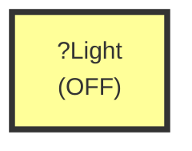

# 🚀 VirtualHome Agent Episode Log


### [GoalReasoner (Module A - Intent)] Output
```json
{
  "is_instruction_obviously_vague": false,
  "clarification_question": null,
  "target_object": "light switch",
  "location_hint": null,
  "reasoning_chain": [
    {
      "question": "Why does the user want this object?",
      "answer": "To turn off the active light source."
    },
    {
      "question": "Why is that important?",
      "answer": "To eliminate artificial light in the room."
    },
    {
      "question": "What fundamental need does this fulfill?",
      "answer": "To create a dark environment, which is necessary for sleeping, resting, or saving energy."
    },
    {
      "question": "Are there any deeper psychological or physical motivations?",
      "answer": "The user wants to reduce visual stimulation and light pollution to rest comfortably or conserve electricity."
    }
  ],
  "deep_intent": "The user wants to darken the room and eliminate artificial light emission.",
  "acceptable_alternatives_properties": [
    {
      "priority": 1,
      "description": "Other controls for the same light source, such as a smart home app command, a remote control, or unplugging the lamp directly."
    },
    {
      "priority": 2,
      "description": "Closing window blinds, curtains, or shades to block out external light if the goal is general room darkening."
    },
    {
      "priority": 3,
      "description": "Turning off other secondary light sources in the room, such as television screens, computer monitors, or desk lamps."
    },
    {
      "priority": 4,
      "description": "Providing a physical eye mask to block out light for the user if the light source itself cannot be deactivated."
    }
  ]
}
```

### [PerceptionFilter] Output
```json
{
  "reasoning": "The primary goal is to turn off the light source to darken the room. The target object is the light switch. Acceptable alternatives and related light sources/controls in the environment include the ceiling lamp, table lamp, and curtains (to block external light). The bed and nightstand are relevant locations/furniture associated with the resting context.",
  "selected_classes": [
    "computer",
    "lightswitch",
    "bed",
    "nightstand",
    "tablelamp",
    "desk",
    "ceilinglamp",
    "window",
    "character",
    "curtains"
  ],
  "raw_class_count": 33
}
```

### [LLMExecutor] Output
```json
{
  "reasoning": "The goal is to turn off the active light source to darken the room. The lightswitch(173) is currently 'ON'. I need to turn it off. First, I must walk to the lightswitch(173) to be near it.",
  "satisfied_nodes": [],
  "current_node_focus": "N1",
  "mapped_variables": {
    "?Light": "lightswitch(173)"
  },
  "action": "[walk] <lightswitch> (173)"
}
```

### [RoboStateMultiTaskController] Output
```json
{
  "action": "[walk] <lightswitch> (173)",
  "active_task_id": "task_1",
  "task_context": {
    "active_task_id": "task_1",
    "pending_task_ids": [],
    "satisfied_task_ids": []
  },
  "source": "llm_executor"
}
```
## Step 0
- **Action**: `[walk] <lightswitch> (173)`
- **Action Success**: `True`
- **Action Message**: {'0': {'message': 'Success'}}
- **Active Task**: `task_1`
- **Decision Source**: `llm_executor`
- **Task Progress**: T4_gemini_G3_14=pending
- **SDG Status**:

- **Observed Items (18)**: window(91) [CLOSED], ceilinglamp(101), tablelamp(102) [OFF,BROKEN], tablelamp(103) [OFF,BROKEN], nightstand(104) [CLOSED], nightstand(106) [CLOSED], desk(108) [CLOSED], bed(109), lightswitch(173) [ON], computer(174) [OFF], curtains(183) [CLOSED], curtains(184) [CLOSED], curtains(185) [CLOSED], character(1), bathroom(11)...


### [PerceptionFilter] Output
```json
{
  "reasoning": "Reused cached class selection.",
  "selected_classes": [
    "computer",
    "lightswitch",
    "bed",
    "nightstand",
    "tablelamp",
    "desk",
    "ceilinglamp",
    "window",
    "character",
    "curtains"
  ],
  "raw_class_count": 33
}
```

### [LLMExecutor] Output
```json
{
  "reasoning": "The goal is to turn off the active light source. The lightswitch(173) is currently 'ON' and controls the light. I have already walked to lightswitch(173) and am close to it. Now I need to switch it off.",
  "satisfied_nodes": [],
  "current_node_focus": "N1",
  "mapped_variables": {
    "?Light": "lightswitch(173)"
  },
  "action": "[switchoff] <lightswitch> (173)"
}
```

### [RoboStateMultiTaskController] Output
```json
{
  "action": "[switchoff] <lightswitch> (173)",
  "active_task_id": "task_1",
  "task_context": {
    "active_task_id": "task_1",
    "pending_task_ids": [],
    "satisfied_task_ids": []
  },
  "source": "llm_executor"
}
```
## Step 1
- **Action**: `[switchoff] <lightswitch> (173)`
- **Action Success**: `True`
- **Action Message**: Faked switch operation in Python layer (bypassed Unity failure)
- **Active Task**: `task_1`
- **Decision Source**: `llm_executor`
- **Task Progress**: T4_gemini_G3_14=pending
- **SDG Status**:

- **Observed Items (18)**: window(91) [CLOSED], ceilinglamp(101), tablelamp(102) [OFF,BROKEN], tablelamp(103) [OFF,BROKEN], nightstand(104) [CLOSED], nightstand(106) [CLOSED], desk(108) [CLOSED], bed(109), lightswitch(173) [ON], computer(174) [OFF], curtains(183) [CLOSED], curtains(184) [CLOSED], curtains(185) [CLOSED], character(1), bathroom(11)...


### [PerceptionFilter] Output
```json
{
  "reasoning": "Reused cached class selection.",
  "selected_classes": [
    "computer",
    "lightswitch",
    "bed",
    "nightstand",
    "tablelamp",
    "desk",
    "ceilinglamp",
    "window",
    "character",
    "curtains"
  ],
  "raw_class_count": 33
}
```

### [LLMExecutor] Output
```json
{
  "reasoning": "The goal is to turn off the active light source (?Light) to satisfy node N1. The lightswitch(173) is already in the 'OFF' state, and the table lamps (102, 103) are also 'OFF' and 'BROKEN'. The computer(174) is 'OFF'. There are no other active light sources or switches in the bedroom. Since the lightswitch(173) is already 'OFF' and the room is darkened as requested, the goal state N1 is fully satisfied.",
  "satisfied_nodes": [
    "N1"
  ],
  "current_node_focus": "N1",
  "mapped_variables": {
    "?Light": "lightswitch(173)"
  },
  "action": "[wait]"
}
```

### [RoboStateMultiTaskController] Output
```json
{
  "action": "[wait]",
  "active_task_id": "task_1",
  "task_context": {
    "active_task_id": "task_1",
    "pending_task_ids": [],
    "satisfied_task_ids": []
  },
  "source": "llm_executor"
}
```
## Step 2
- **Action**: `[wait]`
- **Action Success**: `True`
- **Action Message**: Time passes. You waited for a while.
- **Active Task**: `task_1`
- **Decision Source**: `llm_executor`
- **Task Progress**: T4_gemini_G3_14=pending
- **SDG Status**:

- **Observed Items (18)**: window(91) [CLOSED], ceilinglamp(101), tablelamp(102) [OFF,BROKEN], tablelamp(103) [OFF,BROKEN], nightstand(104) [CLOSED], nightstand(106) [CLOSED], desk(108) [CLOSED], bed(109), lightswitch(173) [OFF], computer(174) [OFF], curtains(183) [CLOSED], curtains(184) [CLOSED], curtains(185) [CLOSED], character(1), bathroom(11)...


### [PerceptionFilter] Output
```json
{
  "reasoning": "Reused cached class selection.",
  "selected_classes": [
    "computer",
    "lightswitch",
    "bed",
    "nightstand",
    "tablelamp",
    "desk",
    "ceilinglamp",
    "window",
    "character",
    "curtains"
  ],
  "raw_class_count": 33
}
```

### [LLMExecutor] Output
```json
{
  "reasoning": "The goal is to turn off the active light source (?Light) to satisfy N1. The lightswitch(173) is already in the 'OFF' state, and the table lamps (102, 103) are also 'OFF' and 'BROKEN'. The computer(174) is 'OFF'. There are no other active light sources in the bedroom. Therefore, the goal state of having the lights OFF is already fully satisfied.",
  "satisfied_nodes": [
    "N1"
  ],
  "current_node_focus": "N1",
  "mapped_variables": {
    "?Light": "lightswitch(173)"
  },
  "action": "[wait]"
}
```

### [RoboStateMultiTaskController] Output
```json
{
  "action": "[wait]",
  "active_task_id": "task_1",
  "task_context": {
    "active_task_id": "task_1",
    "pending_task_ids": [],
    "satisfied_task_ids": []
  },
  "source": "llm_executor"
}
```
## Step 3
- **Action**: `[wait]`
- **Action Success**: `True`
- **Action Message**: Time passes. You waited for a while.
- **Active Task**: `task_1`
- **Decision Source**: `llm_executor`
- **Task Progress**: T4_gemini_G3_14=pending
- **SDG Status**:

- **Observed Items (18)**: window(91) [CLOSED], ceilinglamp(101), tablelamp(102) [OFF,BROKEN], tablelamp(103) [OFF,BROKEN], nightstand(104) [CLOSED], nightstand(106) [CLOSED], desk(108) [CLOSED], bed(109), lightswitch(173) [OFF], computer(174) [OFF], curtains(183) [CLOSED], curtains(184) [CLOSED], curtains(185) [CLOSED], character(1), bathroom(11)...


### [PerceptionFilter] Output
```json
{
  "reasoning": "Reused cached class selection.",
  "selected_classes": [
    "computer",
    "lightswitch",
    "bed",
    "nightstand",
    "tablelamp",
    "desk",
    "ceilinglamp",
    "window",
    "character",
    "curtains"
  ],
  "raw_class_count": 33
}
```

### [LLMExecutor] Output
```json
{
  "reasoning": "The goal is to turn off the active light source (?Light) to darken the room. The lightswitch (173) is already in the 'OFF' state, and the table lamps (102, 103) are also 'OFF' and 'BROKEN'. The ceilinglamp (101) does not have any active states or switches listed, and all other light sources in the bedroom are off. The goal node N1 (?Light is OFF) is already satisfied because all controllable light sources in the room are currently OFF.",
  "satisfied_nodes": [
    "N1"
  ],
  "current_node_focus": "N1",
  "mapped_variables": {
    "?Light": "lightswitch(173)"
  },
  "action": "[wait]"
}
```

### [RoboStateMultiTaskController] Output
```json
{
  "action": "[wait]",
  "active_task_id": "task_1",
  "task_context": {
    "active_task_id": "task_1",
    "pending_task_ids": [],
    "satisfied_task_ids": []
  },
  "source": "llm_executor"
}
```
## Step 4
- **Action**: `[wait]`
- **Action Success**: `True`
- **Action Message**: Time passes. You waited for a while.
- **Active Task**: `task_1`
- **Decision Source**: `llm_executor`
- **Task Progress**: T4_gemini_G3_14=pending
- **SDG Status**:

- **Observed Items (18)**: window(91) [CLOSED], ceilinglamp(101), tablelamp(102) [OFF,BROKEN], tablelamp(103) [OFF,BROKEN], nightstand(104) [CLOSED], nightstand(106) [CLOSED], desk(108) [CLOSED], bed(109), lightswitch(173) [OFF], computer(174) [OFF], curtains(183) [CLOSED], curtains(184) [CLOSED], curtains(185) [CLOSED], character(1), bathroom(11)...


### [PerceptionFilter] Output
```json
{
  "reasoning": "Reused cached class selection.",
  "selected_classes": [
    "computer",
    "lightswitch",
    "bed",
    "nightstand",
    "tablelamp",
    "desk",
    "ceilinglamp",
    "window",
    "character",
    "curtains"
  ],
  "raw_class_count": 33
}
```

### [LLMExecutor] Output
```json
{
  "reasoning": "The goal is to turn off the active light source (?Light). The lightswitch (173) is already in the 'OFF' state, and the table lamps (102, 103) are also 'OFF' and 'BROKEN'. The ceilinglamp (101) does not have any states listed, but the lightswitch (173) controls the light source and is already 'OFF'. The goal state N1 (?Light is OFF) is fully satisfied.",
  "satisfied_nodes": [
    "N1"
  ],
  "current_node_focus": "N1",
  "mapped_variables": {
    "?Light": "lightswitch(173)"
  },
  "action": "[wait]"
}
```

### [RoboStateMultiTaskController] Output
```json
{
  "action": "[wait]",
  "active_task_id": "task_1",
  "task_context": {
    "active_task_id": "task_1",
    "pending_task_ids": [],
    "satisfied_task_ids": []
  },
  "source": "llm_executor"
}
```
## Step 5
- **Action**: `[wait]`
- **Action Success**: `True`
- **Action Message**: Time passes. You waited for a while.
- **Active Task**: `task_1`
- **Decision Source**: `llm_executor`
- **Task Progress**: T4_gemini_G3_14=pending
- **SDG Status**:

- **Observed Items (18)**: window(91) [CLOSED], ceilinglamp(101), tablelamp(102) [OFF,BROKEN], tablelamp(103) [OFF,BROKEN], nightstand(104) [CLOSED], nightstand(106) [CLOSED], desk(108) [CLOSED], bed(109), lightswitch(173) [OFF], computer(174) [OFF], curtains(183) [CLOSED], curtains(184) [CLOSED], curtains(185) [CLOSED], character(1), bathroom(11)...


### [PerceptionFilter] Output
```json
{
  "reasoning": "Reused cached class selection.",
  "selected_classes": [
    "computer",
    "lightswitch",
    "bed",
    "nightstand",
    "tablelamp",
    "desk",
    "ceilinglamp",
    "window",
    "character",
    "curtains"
  ],
  "raw_class_count": 33
}
```

### [LLMExecutor] Output
```json
{
  "reasoning": "The goal is to turn off the active light source (?Light). The lightswitch (173) is already in the 'OFF' state, and the table lamps (102, 103) are also 'OFF' and 'BROKEN'. The ceilinglamp (101) does not have any active state or switch properties listed. Since all controllable light sources in the room are already OFF, the goal node N1 is fully satisfied.",
  "satisfied_nodes": [
    "N1"
  ],
  "current_node_focus": "N1",
  "mapped_variables": {
    "?Light": "lightswitch(173)"
  },
  "action": "[wait]"
}
```

### [RoboStateMultiTaskController] Output
```json
{
  "action": "[wait]",
  "active_task_id": "task_1",
  "task_context": {
    "active_task_id": "task_1",
    "pending_task_ids": [],
    "satisfied_task_ids": []
  },
  "source": "llm_executor"
}
```
