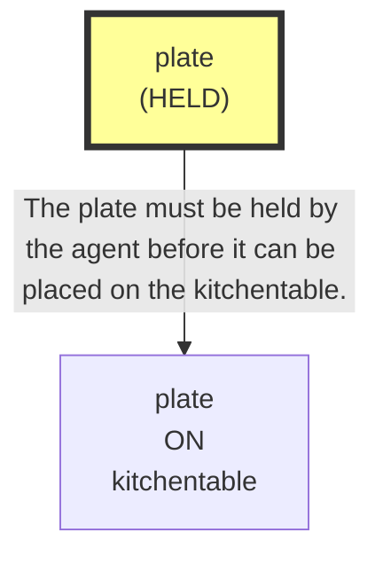
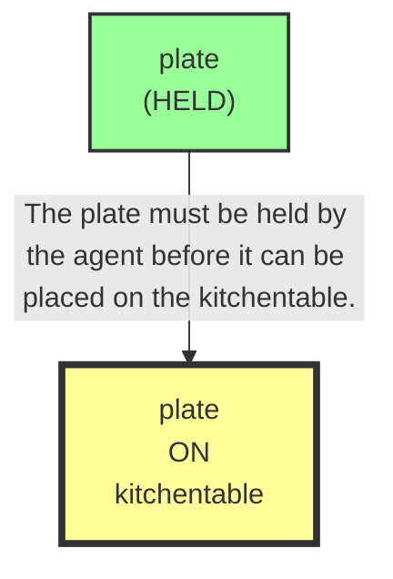
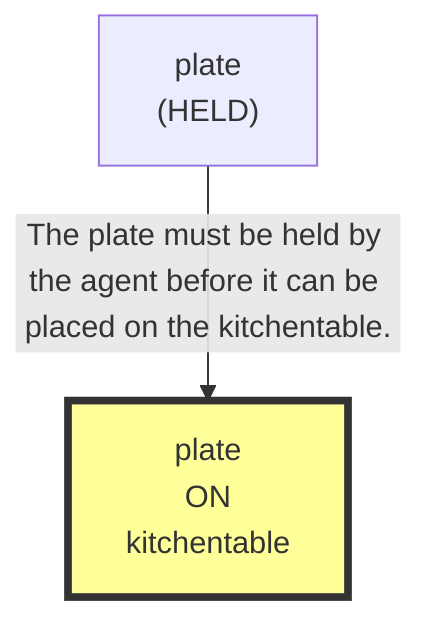

# 🚀 VirtualHome Agent Episode Log


### [GoalReasoner (Module A - Intent)] Output
```json
{
  "is_instruction_obviously_vague": false,
  "clarification_question": null,
  "target_object": "plate",
  "location_hint": "kitchentable",
  "reasoning_chain": [
    {
      "question": "Why does the user want this object?",
      "answer": "To move the used plate from its current location to the kitchen table."
    },
    {
      "question": "Why is that important?",
      "answer": "To clear the immediate space where they just ate or worked and consolidate used tableware in a designated area."
    },
    {
      "question": "What fundamental need does this fulfill?",
      "answer": "The need to maintain a clean, organized, and tidy living space by relocating dirty or used items to a processing area."
    },
    {
      "question": "Are there any deeper psychological or physical motivations?",
      "answer": "To reduce visual clutter and prepare the environment for subsequent cleaning, washing, or future use."
    }
  ],
  "deep_intent": "The user wants to clear and organize their immediate living space by consolidating used tableware in a designated cleaning or dining area.",
  "acceptable_alternatives_properties": [
    {
      "priority": 1,
      "description": "Other used tableware from the same meal, such as bowls or dishes that also need to be cleared."
    },
    {
      "priority": 2,
      "description": "Used drinking vessels like cups, mugs, or glasses that were part of the same dining activity."
    },
    {
      "priority": 3,
      "description": "Used utensils like forks, knives, or spoons that require clearing to the kitchen table."
    },
    {
      "priority": 4,
      "description": "Other dining-related waste or items, such as used napkins or placemats, that need to be cleared to tidy the space."
    }
  ]
}
```

### [PerceptionFilter] Output
```json
{
  "reasoning": "The goal is to move a plate to the kitchen table. I need to select the target object (plate), the destination location (kitchentable), and any acceptable alternative tableware or utensils (dishbowl, waterglass, cutleryfork, cutleryknife) that might need to be cleared as part of the deep intent to tidy the space.",
  "selected_classes": [
    "dishbowl",
    "cutleryfork",
    "kitchentable",
    "plate",
    "cutleryknife",
    "waterglass",
    "character"
  ],
  "raw_class_count": 50
}
```

### [LLMExecutor] Output
```json
{
  "reasoning": "The goal is to place a plate on a kitchentable. Looking at the current graph, plate(104) is inside the kitchen but not on any table, while other plates are already on kitchentable(131) or kitchentable(135). I will walk to plate(104) first to grab it.",
  "satisfied_nodes": [],
  "current_node_focus": "N2",
  "mapped_variables": {
    "?plate": "plate(104)",
    "?kitchentable": "kitchentable(131)"
  },
  "action": "[walk] <plate> (104)"
}
```

### [RoboStateMultiTaskController] Output
```json
{
  "action": "[walk] <plate> (104)",
  "active_task_id": "task_1",
  "task_context": {
    "active_task_id": "task_1",
    "pending_task_ids": [],
    "satisfied_task_ids": []
  },
  "source": "llm_executor"
}
```
## Step 0
- **Action**: `[walk] <plate> (104)`
- **Action Success**: `True`
- **Action Message**: {'0': {'message': 'Success'}}
- **Active Task**: `task_1`
- **Decision Source**: `llm_executor`
- **Task Progress**: T4_gemini_M4_18=pending
- **SDG Status**:

- **Observed Items (49)**: cutleryknife(59), cutleryknife(60), waterglass(64), cutleryknife(65), cutleryfork(66), cutleryfork(69), cutleryknife(70), waterglass(71), waterglass(72), cutleryknife(73), cutleryfork(74), plate(75), plate(76), cutleryfork(77), cutleryknife(78)...


### [PerceptionFilter] Output
```json
{
  "reasoning": "Reused cached class selection.",
  "selected_classes": [
    "dishbowl",
    "cutleryfork",
    "kitchentable",
    "plate",
    "cutleryknife",
    "waterglass",
    "character"
  ],
  "raw_class_count": 50
}
```

### [LLMExecutor] Output
```json
{
  "reasoning": "The previous action was to walk to plate(104), which is now close to character(1). To satisfy node N2 (plate HELD), I must grab plate(104).",
  "satisfied_nodes": [],
  "current_node_focus": "N2",
  "mapped_variables": {
    "?plate": "plate(104)",
    "?kitchentable": "kitchentable(131)"
  },
  "action": "[grab] <plate> (104)"
}
```

### [RoboStateMultiTaskController] Output
```json
{
  "action": "[grab] <plate> (104)",
  "active_task_id": "task_1",
  "task_context": {
    "active_task_id": "task_1",
    "pending_task_ids": [],
    "satisfied_task_ids": []
  },
  "source": "llm_executor"
}
```
## Step 1
- **Action**: `[grab] <plate> (104)`
- **Action Success**: `True`
- **Action Message**: {'0': {'message': 'Success'}}
- **Active Task**: `task_1`
- **Decision Source**: `llm_executor`
- **Task Progress**: T4_gemini_M4_18=pending
- **SDG Status**:

- **Observed Items (49)**: cutleryknife(59), cutleryknife(60), waterglass(64), cutleryknife(65), cutleryfork(66), cutleryfork(69), cutleryknife(70), waterglass(71), waterglass(72), cutleryknife(73), cutleryfork(74), plate(75), plate(76), cutleryfork(77), cutleryknife(78)...


### [PerceptionFilter] Output
```json
{
  "reasoning": "Reused cached class selection.",
  "selected_classes": [
    "dishbowl",
    "cutleryfork",
    "kitchentable",
    "plate",
    "cutleryknife",
    "waterglass",
    "character"
  ],
  "raw_class_count": 50
}
```

### [LLMExecutor] Output
```json
{
  "reasoning": "The agent is currently holding the plate(104) in its right hand (HOLDS_RH plate(104)). The goal is to place this plate on a kitchentable. There are two kitchentables available: kitchentable(131) and kitchentable(135). I will choose kitchentable(131) as the target destination. According to the Proximity Rule, I must first walk to the target surface before executing a putback action.",
  "satisfied_nodes": [
    "N2"
  ],
  "current_node_focus": "N1",
  "mapped_variables": {
    "?plate": "plate(104)",
    "?kitchentable": "kitchentable(131)"
  },
  "action": "[walk] <kitchentable> (131)"
}
```

### [RoboStateMultiTaskController] Output
```json
{
  "action": "[walk] <kitchentable> (131)",
  "active_task_id": "task_1",
  "task_context": {
    "active_task_id": "task_1",
    "pending_task_ids": [],
    "satisfied_task_ids": []
  },
  "source": "llm_executor"
}
```
## Step 2
- **Action**: `[walk] <kitchentable> (131)`
- **Action Success**: `True`
- **Action Message**: {'0': {'message': 'Success'}}
- **Active Task**: `task_1`
- **Decision Source**: `llm_executor`
- **Task Progress**: T4_gemini_M4_18=pending
- **SDG Status**:

- **Observed Items (49)**: cutleryknife(59), cutleryknife(60), waterglass(64), cutleryknife(65), cutleryfork(66), cutleryfork(69), cutleryknife(70), waterglass(71), waterglass(72), cutleryknife(73), cutleryfork(74), plate(75), plate(76), cutleryfork(77), cutleryknife(78)...


### [PerceptionFilter] Output
```json
{
  "reasoning": "Reused cached class selection.",
  "selected_classes": [
    "dishbowl",
    "cutleryfork",
    "kitchentable",
    "plate",
    "cutleryknife",
    "waterglass",
    "character"
  ],
  "raw_class_count": 50
}
```

### [LLMExecutor] Output
```json
{
  "reasoning": "The agent is currently holding plate(104) in its right hand (HOLDS_RH plate(104)) and is already close to the target kitchentable(131). The next logical step is to place the plate on the kitchen table using the [putback] action.",
  "satisfied_nodes": [
    "N2"
  ],
  "current_node_focus": "N1",
  "mapped_variables": {
    "?plate": "plate(104)",
    "?kitchentable": "kitchentable(131)"
  },
  "action": "[putback] <plate> (104) <kitchentable> (131)"
}
```

### [RoboStateMultiTaskController] Output
```json
{
  "action": "[putback] <plate> (104) <kitchentable> (131)",
  "active_task_id": "task_1",
  "task_context": {
    "active_task_id": "task_1",
    "pending_task_ids": [],
    "satisfied_task_ids": []
  },
  "source": "llm_executor"
}
```
## Step 3
- **Action**: `[putback] <plate> (104) <kitchentable> (131)`
- **Action Success**: `True`
- **Action Message**: {'0': {'message': 'Success'}}
- **Active Task**: `task_1`
- **Decision Source**: `llm_executor`
- **Task Progress**: T4_gemini_M4_18=pending
- **SDG Status**:

- **Observed Items (49)**: cutleryknife(59), cutleryknife(60), waterglass(64), cutleryknife(65), cutleryfork(66), cutleryfork(69), cutleryknife(70), waterglass(71), waterglass(72), cutleryknife(73), cutleryfork(74), plate(75), plate(76), cutleryfork(77), cutleryknife(78)...


### [PerceptionFilter] Output
```json
{
  "reasoning": "Reused cached class selection.",
  "selected_classes": [
    "dishbowl",
    "cutleryfork",
    "kitchentable",
    "plate",
    "cutleryknife",
    "waterglass",
    "character"
  ],
  "raw_class_count": 50
}
```

### [LLMExecutor] Output
```json
{
  "reasoning": "The goal is to place a plate on the kitchentable. In step 3, plate(104) was successfully placed on kitchentable(131). The current Filtered Graph confirms plate(104) is now 'ON kitchentable(131)'. This satisfies the target relation N1 ('plate ON kitchentable'). Since the goal state is fully achieved, no further actions are required.",
  "satisfied_nodes": [
    "N1"
  ],
  "current_node_focus": "N1",
  "mapped_variables": {
    "?plate": "plate(104)",
    "?kitchentable": "kitchentable(131)"
  },
  "action": "[wait]"
}
```

### [RoboStateMultiTaskController] Output
```json
{
  "action": "[wait]",
  "active_task_id": "task_1",
  "task_context": {
    "active_task_id": "task_1",
    "pending_task_ids": [],
    "satisfied_task_ids": []
  },
  "source": "llm_executor"
}
```
## Step 4
- **Action**: `[wait]`
- **Action Success**: `True`
- **Action Message**: Time passes. You waited for a while.
- **Active Task**: `task_1`
- **Decision Source**: `llm_executor`
- **Task Progress**: T4_gemini_M4_18=pending
- **SDG Status**:

- **Observed Items (49)**: cutleryknife(59), cutleryknife(60), waterglass(64), cutleryknife(65), cutleryfork(66), cutleryfork(69), cutleryknife(70), waterglass(71), waterglass(72), cutleryknife(73), cutleryfork(74), plate(75), plate(76), cutleryfork(77), cutleryknife(78)...


### [PerceptionFilter] Output
```json
{
  "reasoning": "Reused cached class selection.",
  "selected_classes": [
    "dishbowl",
    "cutleryfork",
    "kitchentable",
    "plate",
    "cutleryknife",
    "waterglass",
    "character"
  ],
  "raw_class_count": 50
}
```

### [LLMExecutor] Output
```json
{
  "reasoning": "The plate(104) has already been successfully placed on the kitchentable(131) in step 3, satisfying the goal relation of N1 (plate ON kitchentable). The current Filtered Graph confirms plate(104) is ON kitchentable(131). Since the goal state is fully satisfied, I will wait to conclude the task execution.",
  "satisfied_nodes": [
    "N1"
  ],
  "current_node_focus": "N1",
  "mapped_variables": {
    "?plate": "plate(104)",
    "?kitchentable": "kitchentable(131)"
  },
  "action": "[wait]"
}
```

### [RoboStateMultiTaskController] Output
```json
{
  "action": "[wait]",
  "active_task_id": "task_1",
  "task_context": {
    "active_task_id": "task_1",
    "pending_task_ids": [],
    "satisfied_task_ids": []
  },
  "source": "llm_executor"
}
```
## Step 5
- **Action**: `[wait]`
- **Action Success**: `True`
- **Action Message**: Time passes. You waited for a while.
- **Active Task**: `task_1`
- **Decision Source**: `llm_executor`
- **Task Progress**: T4_gemini_M4_18=pending
- **SDG Status**:

- **Observed Items (49)**: cutleryknife(59), cutleryknife(60), waterglass(64), cutleryknife(65), cutleryfork(66), cutleryfork(69), cutleryknife(70), waterglass(71), waterglass(72), cutleryknife(73), cutleryfork(74), plate(75), plate(76), cutleryfork(77), cutleryknife(78)...


### [PerceptionFilter] Output
```json
{
  "reasoning": "Reused cached class selection.",
  "selected_classes": [
    "dishbowl",
    "cutleryfork",
    "kitchentable",
    "plate",
    "cutleryknife",
    "waterglass",
    "character"
  ],
  "raw_class_count": 50
}
```

### [LLMExecutor] Output
```json
{
  "reasoning": "The goal is to place a plate on the kitchentable. In step 3, plate(104) was successfully placed on kitchentable(131). Looking at the current Filtered Graph, plate(104) is indeed 'ON kitchentable(131)'. Therefore, the goal state is already fully satisfied.",
  "satisfied_nodes": [
    "N2",
    "N1"
  ],
  "current_node_focus": "N1",
  "mapped_variables": {
    "?plate": "plate(104)",
    "?kitchentable": "kitchentable(131)"
  },
  "action": "[wait]"
}
```

### [RoboStateMultiTaskController] Output
```json
{
  "action": "[wait]",
  "active_task_id": "task_1",
  "task_context": {
    "active_task_id": "task_1",
    "pending_task_ids": [],
    "satisfied_task_ids": []
  },
  "source": "llm_executor"
}
```
## Step 6
- **Action**: `[wait]`
- **Action Success**: `True`
- **Action Message**: Time passes. You waited for a while.
- **Active Task**: `task_1`
- **Decision Source**: `llm_executor`
- **Task Progress**: T4_gemini_M4_18=pending
- **SDG Status**:

- **Observed Items (49)**: cutleryknife(59), cutleryknife(60), waterglass(64), cutleryknife(65), cutleryfork(66), cutleryfork(69), cutleryknife(70), waterglass(71), waterglass(72), cutleryknife(73), cutleryfork(74), plate(75), plate(76), cutleryfork(77), cutleryknife(78)...


### [PerceptionFilter] Output
```json
{
  "reasoning": "Reused cached class selection.",
  "selected_classes": [
    "dishbowl",
    "cutleryfork",
    "kitchentable",
    "plate",
    "cutleryknife",
    "waterglass",
    "character"
  ],
  "raw_class_count": 50
}
```

### [LLMExecutor] Output
```json
{
  "reasoning": "The goal is to place a plate on the kitchen table. In step 3, plate(104) was successfully placed on kitchentable(131). Looking at the current Filtered Graph, plate(104) is indeed 'ON kitchentable(131)'. Therefore, the goal state N1 ('plate ON kitchentable') is already fully satisfied. No further actions are required.",
  "satisfied_nodes": [
    "N1"
  ],
  "current_node_focus": "N1",
  "mapped_variables": {
    "?plate": "plate(104)",
    "?kitchentable": "kitchentable(131)"
  },
  "action": "[wait]"
}
```

### [RoboStateMultiTaskController] Output
```json
{
  "action": "[wait]",
  "active_task_id": "task_1",
  "task_context": {
    "active_task_id": "task_1",
    "pending_task_ids": [],
    "satisfied_task_ids": []
  },
  "source": "llm_executor"
}
```
## Step 7
- **Action**: `[wait]`
- **Action Success**: `True`
- **Action Message**: Time passes. You waited for a while.
- **Active Task**: `task_1`
- **Decision Source**: `llm_executor`
- **Task Progress**: T4_gemini_M4_18=pending
- **SDG Status**:

- **Observed Items (49)**: cutleryknife(59), cutleryknife(60), waterglass(64), cutleryknife(65), cutleryfork(66), cutleryfork(69), cutleryknife(70), waterglass(71), waterglass(72), cutleryknife(73), cutleryfork(74), plate(75), plate(76), cutleryfork(77), cutleryknife(78)...


### [PerceptionFilter] Output
```json
{
  "reasoning": "Reused cached class selection.",
  "selected_classes": [
    "dishbowl",
    "cutleryfork",
    "kitchentable",
    "plate",
    "cutleryknife",
    "waterglass",
    "character"
  ],
  "raw_class_count": 50
}
```

### [LLMExecutor] Output
```json
{
  "reasoning": "The goal is to place a plate on the kitchen table. In step 3, plate(104) was successfully placed on kitchentable(131). Looking at the current Filtered Graph, plate(104) is indeed 'ON kitchentable(131)'. Therefore, the goal state N1 (plate ON kitchentable) is already fully satisfied.",
  "satisfied_nodes": [
    "N1"
  ],
  "current_node_focus": "N1",
  "mapped_variables": {
    "?plate": "plate(104)",
    "?kitchentable": "kitchentable(131)"
  },
  "action": "[wait]"
}
```

### [RoboStateMultiTaskController] Output
```json
{
  "action": "[wait]",
  "active_task_id": "task_1",
  "task_context": {
    "active_task_id": "task_1",
    "pending_task_ids": [],
    "satisfied_task_ids": []
  },
  "source": "llm_executor"
}
```
