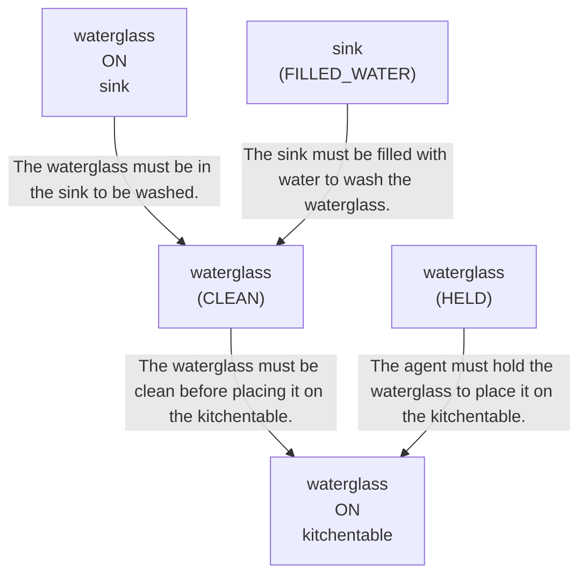
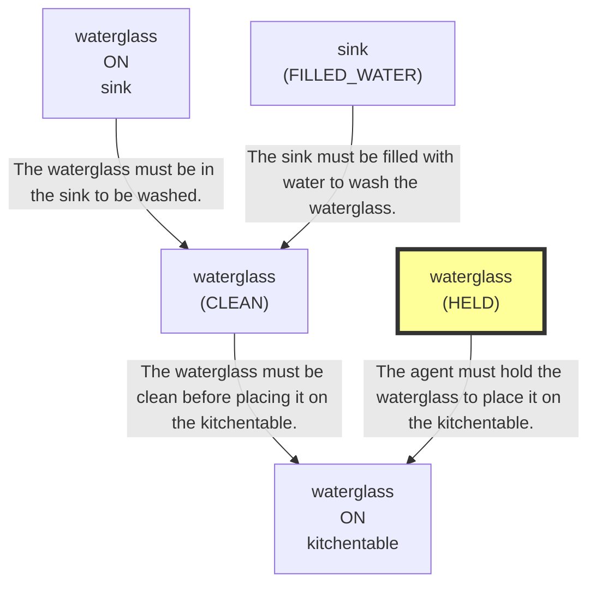
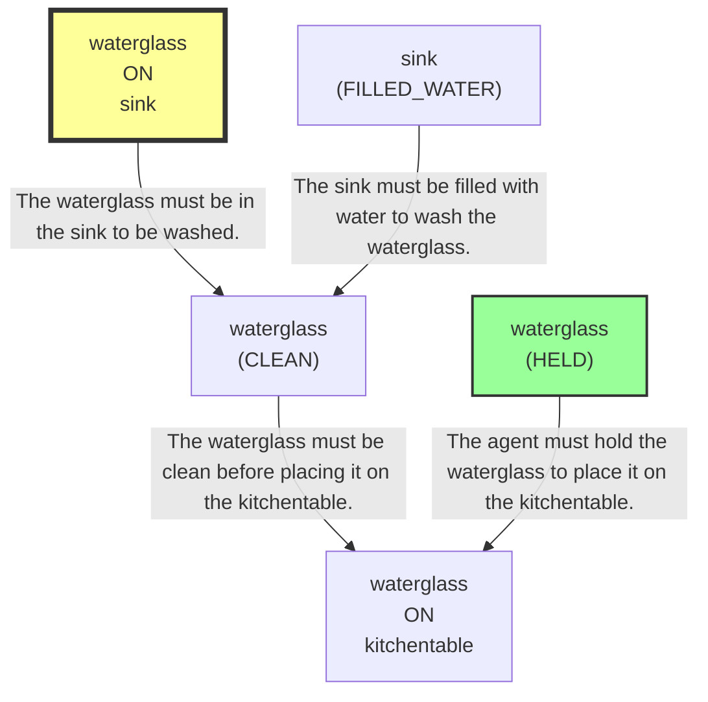

# 🚀 VirtualHome Agent Episode Log


### [GoalReasoner (Module A - Intent)] Output
```json
{
  "is_instruction_obviously_vague": false,
  "clarification_question": null,
  "target_object": "waterglass",
  "location_hint": "sink",
  "reasoning_chain": [
    {
      "question": "Why does the user want this object?",
      "answer": "The user wants the waterglass to be clean and placed on the kitchen table."
    },
    {
      "question": "Why is that important?",
      "answer": "So that a clean drinking vessel is readily available on the dining surface."
    },
    {
      "question": "What fundamental need does this fulfill?",
      "answer": "The need to have a hygienic container prepared for consuming liquids to maintain hydration."
    },
    {
      "question": "Are there any deeper psychological or physical motivations?",
      "answer": "To maintain a clean living environment and ensure safe, convenient access to drinking tools."
    }
  ],
  "deep_intent": "The user wants to have a clean, hygienic vessel prepared and accessible for drinking liquids.",
  "acceptable_alternatives_properties": [
    {
      "priority": 1,
      "description": "Other types of drinking glasses, such as a juice glass or tumbler, washed and placed on the kitchen table."
    },
    {
      "priority": 2,
      "description": "Ceramic mugs or teacups that can hold liquids and are safe to drink from."
    },
    {
      "priority": 3,
      "description": "Reusable water bottles or clean plastic cups suitable for holding drinking water."
    },
    {
      "priority": 4,
      "description": "A clean bowl or small pitcher that can temporarily serve as a vessel to hold and consume liquids."
    }
  ]
}
```

### [RoboStateMultiTaskController] Output
```json
{
  "action": "[walk] <kitchen> (11)",
  "active_task_id": "task_1",
  "task_context": {
    "active_task_id": "task_1",
    "pending_task_ids": [],
    "satisfied_task_ids": []
  },
  "source": "room_frontier"
}
```
## Step 0
- **Action**: `[walk] <kitchen> (11)`
- **Action Success**: `True`
- **Action Message**: {'0': {'message': 'Success'}}
- **Active Task**: `task_1`
- **Decision Source**: `room_frontier`
- **Task Progress**: T4_gemini_P3_13=pending
- **SDG Status**:

- **Observed Items (66)**: wall(286), wall(287), wall(288), wall(289), wall(290), wall(291), floor(292), floor(293), floor(294), floor(295), floor(296), floor(297), ceiling(298), ceiling(299), ceiling(300)...


### [PerceptionFilter] Output
```json
{
  "reasoning": "The goal is to clean a waterglass and place it on the kitchen table. The SDG requires the waterglass to be in a sink filled with water to be cleaned, and then placed on the kitchen table. Therefore, we need the target object (waterglass), the target location (kitchentable), the washing location (sink), and the faucet to fill the sink. We also retain acceptable alternatives for drinking vessels (dishbowl, plate, juice, milk) and alternative washing/cleaning appliances (dishwasher).",
  "selected_classes": [
    "dishbowl",
    "juice",
    "sink",
    "faucet",
    "kitchentable",
    "plate",
    "dishwasher",
    "waterglass",
    "character"
  ],
  "raw_class_count": 67
}
```

### [LLMExecutor] Output
```json
{
  "reasoning": "The goal is to have a clean waterglass on the kitchen table. Currently, there are several waterglasses in the kitchen, but they are not explicitly marked as CLEAN. To wash a waterglass, we must first place it in the sink and fill the sink with water (or wash it). I will start by grabbing one of the waterglasses close to me, such as waterglass(64), to begin the washing process.",
  "satisfied_nodes": [],
  "current_node_focus": "N3",
  "mapped_variables": {
    "?Washer": "sink(155)"
  },
  "action": "[grab] <waterglass> (64)"
}
```

### [RoboStateMultiTaskController] Output
```json
{
  "action": "[grab] <waterglass> (64)",
  "active_task_id": "task_1",
  "task_context": {
    "active_task_id": "task_1",
    "pending_task_ids": [],
    "satisfied_task_ids": []
  },
  "source": "llm_executor"
}
```
## Step 1
- **Action**: `[grab] <waterglass> (64)`
- **Action Success**: `True`
- **Action Message**: {'0': {'message': 'Success'}}
- **Active Task**: `task_1`
- **Decision Source**: `llm_executor`
- **Task Progress**: T4_gemini_P3_13=pending
- **SDG Status**:

- **Observed Items (40)**: sink(326), faucet(327) [OFF], plate(336), waterglass(339), character(1), kitchen(11), livingroom(183), bedroom(241), bathroom(285), bedroom(346), waterglass(64), plate(67), plate(68), waterglass(71), waterglass(72)...


### [PerceptionFilter] Output
```json
{
  "reasoning": "Reused cached class selection.",
  "selected_classes": [
    "dishbowl",
    "juice",
    "sink",
    "faucet",
    "kitchentable",
    "plate",
    "dishwasher",
    "waterglass",
    "character"
  ],
  "raw_class_count": 67
}
```

### [LLMExecutor] Output
```json
{
  "reasoning": "The agent is currently holding the waterglass (64) in the kitchen. According to the SDG, the waterglass must be clean, and to wash it, it must first be placed in the sink (155). Therefore, the next step is to walk to the kitchen sink.",
  "satisfied_nodes": [
    "N3"
  ],
  "current_node_focus": "N4",
  "mapped_variables": {
    "?Washer": "sink(155)",
    "waterglass": "waterglass(64)"
  },
  "action": "[walk] <sink> (155)"
}
```

### [RoboStateMultiTaskController] Output
```json
{
  "action": "[walk] <sink> (155)",
  "active_task_id": "task_1",
  "task_context": {
    "active_task_id": "task_1",
    "pending_task_ids": [],
    "satisfied_task_ids": []
  },
  "source": "llm_executor"
}
```
## Step 2
- **Action**: `[walk] <sink> (155)`
- **Action Success**: `True`
- **Action Message**: {'0': {'message': 'Success'}}
- **Active Task**: `task_1`
- **Decision Source**: `llm_executor`
- **Task Progress**: T4_gemini_P3_13=pending
- **SDG Status**:

- **Observed Items (40)**: sink(326), faucet(327) [OFF], plate(336), waterglass(339), character(1), kitchen(11), livingroom(183), bedroom(241), bathroom(285), bedroom(346), waterglass(64), plate(67), plate(68), waterglass(71), waterglass(72)...


### [PerceptionFilter] Output
```json
{
  "reasoning": "Reused cached class selection.",
  "selected_classes": [
    "dishbowl",
    "juice",
    "sink",
    "faucet",
    "kitchentable",
    "plate",
    "dishwasher",
    "waterglass",
    "character"
  ],
  "raw_class_count": 67
}
```

### [LLMExecutor] Output
```json
{
  "reasoning": "The agent is currently holding the waterglass(64) and is standing close to the kitchen sink(155). According to the SDG, to wash the waterglass (N2), the waterglass must first be placed in the sink (N4). Since the sink is a flat surface in this physics engine, we must use the [putback] action to place the waterglass onto the sink.",
  "satisfied_nodes": [
    "N3"
  ],
  "current_node_focus": "N4",
  "mapped_variables": {
    "?Washer": "sink(155)"
  },
  "action": "[putback] <waterglass> (64) <sink> (155)"
}
```

### [RoboStateMultiTaskController] Output
```json
{
  "action": "[walk] <livingroom> (183)",
  "active_task_id": null,
  "task_context": {
    "active_task_id": null,
    "pending_task_ids": [
      "task_1"
    ],
    "satisfied_task_ids": []
  },
  "source": "loop_recovery_room_revisit"
}
```
## Step 3
- **Action**: `[walk] <livingroom> (183)`
- **Action Success**: `True`
- **Action Message**: {'0': {'message': 'Success'}}
- **Decision Source**: `loop_recovery_room_revisit`
- **Task Progress**: T4_gemini_P3_13=pending
- **SDG Status**:
No SDG active.
- **Observed Items (219)**: wall(286), wall(287), wall(288), wall(289), wall(290), wall(291), floor(292), floor(293), floor(294), floor(295), floor(296), floor(297), ceiling(298), ceiling(299), ceiling(300)...


### [PerceptionFilter] Output
```json
{
  "reasoning": "The goal is to clean a waterglass and place it on the kitchen table. The SDG requires the waterglass to be in a sink filled with water to be cleaned, and then placed on the kitchen table. I must select the target object (waterglass), the locations (sink, kitchentable), and acceptable alternative drinking vessels (dishbowl, plate) and cleaning tools/appliances (dishwasher, faucet).",
  "selected_classes": [
    "dishbowl",
    "juice",
    "sink",
    "kitchentable",
    "plate",
    "faucet",
    "dishwasher",
    "waterglass",
    "character"
  ],
  "raw_class_count": 75
}
```

### [LLMExecutor] Output
```json
{
  "reasoning": "The agent is currently holding the waterglass(64) in the livingroom(183) and needs to wash it. The sink(155) is located in the kitchen(11). The agent previously walked to the livingroom(183) and is currently there. To wash the waterglass, the agent must first walk back to the kitchen sink(155) to place it inside or wash it.",
  "satisfied_nodes": [
    "N3"
  ],
  "current_node_focus": "N4",
  "mapped_variables": {
    "?Washer": "sink(155)",
    "?Waterglass": "waterglass(64)"
  },
  "action": "[walk] <sink> (155)"
}
```

### [RoboStateMultiTaskController] Output
```json
{
  "action": "[walk] <sink> (155)",
  "active_task_id": "task_1",
  "task_context": {
    "active_task_id": "task_1",
    "pending_task_ids": [],
    "satisfied_task_ids": []
  },
  "source": "llm_executor"
}
```
## Step 4
- **Action**: `[walk] <sink> (155)`
- **Action Success**: `True`
- **Action Message**: {'0': {'message': 'Success'}}
- **Active Task**: `task_1`
- **Decision Source**: `llm_executor`
- **Task Progress**: T4_gemini_P3_13=pending
- **SDG Status**:

- **Observed Items (42)**: sink(326), faucet(327) [OFF], plate(336), waterglass(339), character(1), kitchen(11), livingroom(183), bedroom(241), bathroom(285), bedroom(346), waterglass(64), plate(67), plate(68), waterglass(71), waterglass(72)...


### [PerceptionFilter] Output
```json
{
  "reasoning": "Reused cached class selection.",
  "selected_classes": [
    "dishbowl",
    "juice",
    "sink",
    "kitchentable",
    "plate",
    "faucet",
    "dishwasher",
    "waterglass",
    "character"
  ],
  "raw_class_count": 75
}
```

### [LLMExecutor] Output
```json
{
  "reasoning": "The robot is currently holding the waterglass(64) in its right hand and is close to the kitchen sink(155). According to the SDG, the waterglass must be placed in the sink (N4) to be washed (N2). Since the sink is a flat surface in this physics engine, we must use [putback] to place the waterglass onto the sink.",
  "satisfied_nodes": [
    "N3"
  ],
  "current_node_focus": "N4",
  "mapped_variables": {
    "?Washer": "sink(155)"
  },
  "action": "[putback] <waterglass> (64) <sink> (155)"
}
```

### [RoboStateMultiTaskController] Output
```json
{
  "action": "[walk] <bedroom> (241)",
  "active_task_id": null,
  "task_context": {
    "active_task_id": null,
    "pending_task_ids": [
      "task_1"
    ],
    "satisfied_task_ids": []
  },
  "source": "loop_recovery_room_revisit"
}
```
## Step 5
- **Action**: `[walk] <bedroom> (241)`
- **Action Success**: `True`
- **Action Message**: {'0': {'message': 'Success'}}
- **Decision Source**: `loop_recovery_room_revisit`
- **Task Progress**: T4_gemini_P3_13=pending
- **SDG Status**:
No SDG active.
- **Observed Items (271)**: wall(286), wall(287), wall(288), wall(289), wall(290), wall(291), floor(292), floor(293), floor(294), floor(295), floor(296), floor(297), ceiling(298), ceiling(299), ceiling(300)...


### [PerceptionFilter] Output
```json
{
  "reasoning": "The goal is to clean a waterglass and place it on the kitchen table. The SDG requires the waterglass to be in a sink filled with water to be cleaned, and then placed on the kitchen table. I must select the target object (waterglass), the locations (sink, kitchentable), and acceptable alternative drinking vessels (dishbowl, plate) as backups, along with the faucet to fill the sink.",
  "selected_classes": [
    "dishbowl",
    "juice",
    "sink",
    "faucet",
    "kitchentable",
    "plate",
    "waterglass",
    "character"
  ],
  "raw_class_count": 81
}
```

### [LLMExecutor] Output
```json
{
  "reasoning": "The agent is currently holding the waterglass (64) in the bedroom (241). To wash the waterglass, it must be placed in the kitchen sink (155). I need to walk to the kitchen sink (155) first.",
  "satisfied_nodes": [
    "N3"
  ],
  "current_node_focus": "N4",
  "mapped_variables": {
    "?Washer": "sink(155)",
    "waterglass": "waterglass(64)"
  },
  "action": "[walk] <sink> (155)"
}
```

### [RoboStateMultiTaskController] Output
```json
{
  "action": "[walk] <sink> (155)",
  "active_task_id": "task_1",
  "task_context": {
    "active_task_id": "task_1",
    "pending_task_ids": [],
    "satisfied_task_ids": []
  },
  "source": "llm_executor"
}
```
## Step 6
- **Action**: `[walk] <sink> (155)`
- **Action Success**: `True`
- **Action Message**: {'0': {'message': 'Success'}}
- **Active Task**: `task_1`
- **Decision Source**: `llm_executor`
- **Task Progress**: T4_gemini_P3_13=pending
- **SDG Status**:

- **Observed Items (42)**: sink(326), faucet(327) [OFF], plate(336), waterglass(339), character(1), kitchen(11), livingroom(183), bedroom(241), bathroom(285), bedroom(346), waterglass(64), plate(67), plate(68), waterglass(71), waterglass(72)...


### [PerceptionFilter] Output
```json
{
  "reasoning": "Reused cached class selection.",
  "selected_classes": [
    "dishbowl",
    "juice",
    "sink",
    "faucet",
    "kitchentable",
    "plate",
    "waterglass",
    "character"
  ],
  "raw_class_count": 81
}
```

### [LLMExecutor] Output
```json
{
  "reasoning": "The character is currently holding the waterglass(64) and is close to the kitchen sink(155). According to the SDG, to wash the waterglass (N2), the waterglass must be placed in the sink (N4) and the sink must be filled with water (N5). Since the sink is a flat surface in this physics engine, we must use [putback] to place the waterglass in the sink.",
  "satisfied_nodes": [
    "N3"
  ],
  "current_node_focus": "N4",
  "mapped_variables": {
    "?Washer": "sink(155)",
    "?Target": "waterglass(64)"
  },
  "action": "[putback] <waterglass> (64) <sink> (155)"
}
```

### [RoboStateMultiTaskController] Output
```json
{
  "action": "[walk] <bedroom> (346)",
  "active_task_id": null,
  "task_context": {
    "active_task_id": null,
    "pending_task_ids": [
      "task_1"
    ],
    "satisfied_task_ids": []
  },
  "source": "loop_recovery_room_revisit"
}
```
## Step 7
- **Action**: `[walk] <bedroom> (346)`
- **Action Success**: `True`
- **Action Message**: {'0': {'message': 'Success'}}
- **Decision Source**: `loop_recovery_room_revisit`
- **Task Progress**: T4_gemini_P3_13=pending
- **SDG Status**:
No SDG active.
- **Observed Items (303)**: wall(286), wall(287), wall(288), wall(289), wall(290), wall(291), floor(292), floor(293), floor(294), floor(295), floor(296), floor(297), ceiling(298), ceiling(299), ceiling(300)...


### [PerceptionFilter] Output
```json
{
  "reasoning": "The goal is to clean a waterglass and place it on the kitchen table. The SDG requires the waterglass to be in the sink filled with water to be cleaned, and then placed on the kitchen table. I must select the target object (waterglass), the target location (kitchentable), the cleaning location (sink), and all acceptable alternative drinking vessels (mug, dishbowl, plate) and cleaning tools/appliances (dishwasher, faucet) as backups or functional requirements.",
  "selected_classes": [
    "dishbowl",
    "juice",
    "sink",
    "kitchentable",
    "plate",
    "faucet",
    "dishwasher",
    "character",
    "waterglass",
    "mug"
  ],
  "raw_class_count": 91
}
```

### [LLMExecutor] Output
```json
{
  "reasoning": "The agent is currently holding the waterglass(64) and is in bedroom(346). To wash the waterglass, it must be placed in the kitchen sink(155). The agent needs to walk to the kitchen sink(155) first.",
  "satisfied_nodes": [
    "N3"
  ],
  "current_node_focus": "N4",
  "mapped_variables": {
    "?Washer": "sink(155)"
  },
  "action": "[walk] <sink> (155)"
}
```

### [RoboStateMultiTaskController] Output
```json
{
  "action": "[walk] <sink> (155)",
  "active_task_id": "task_1",
  "task_context": {
    "active_task_id": "task_1",
    "pending_task_ids": [],
    "satisfied_task_ids": []
  },
  "source": "llm_executor"
}
```
## Step 8
- **Action**: `[walk] <sink> (155)`
- **Action Success**: `True`
- **Action Message**: {'0': {'message': 'Success'}}
- **Active Task**: `task_1`
- **Decision Source**: `llm_executor`
- **Task Progress**: T4_gemini_P3_13=pending
- **SDG Status**:

- **Observed Items (45)**: sink(326), faucet(327) [OFF], plate(336), waterglass(339), character(1), kitchen(11), livingroom(183), bedroom(241), bathroom(285), bedroom(346), waterglass(64), plate(67), plate(68), waterglass(71), waterglass(72)...


### [PerceptionFilter] Output
```json
{
  "reasoning": "Reused cached class selection.",
  "selected_classes": [
    "dishbowl",
    "juice",
    "sink",
    "kitchentable",
    "plate",
    "faucet",
    "dishwasher",
    "character",
    "waterglass",
    "mug"
  ],
  "raw_class_count": 91
}
```

### [LLMExecutor] Output
```json
{
  "reasoning": "The robot is currently holding the waterglass(64) and is standing close to the kitchen sink(155). According to the SDG, the waterglass must be placed in the sink to be washed (N4), and the sink must be filled with water (N5) to clean the waterglass (N2). Since the sink is a flat surface in this physics engine, I must use the [putback] action to place the waterglass onto the sink.",
  "satisfied_nodes": [
    "N3"
  ],
  "current_node_focus": "N4",
  "mapped_variables": {
    "?Washer": "sink(155)"
  },
  "action": "[putback] <waterglass> (64) <sink> (155)"
}
```

### [RoboStateMultiTaskController] Output
```json
{
  "action": "[walk] <bathroom> (285)",
  "active_task_id": null,
  "task_context": {
    "active_task_id": null,
    "pending_task_ids": [
      "task_1"
    ],
    "satisfied_task_ids": []
  },
  "source": "loop_recovery_room_revisit"
}
```
## Step 9
- **Action**: `[walk] <bathroom> (285)`
- **Action Success**: `True`
- **Action Message**: {'0': {'message': 'Success'}}
- **Decision Source**: `loop_recovery_room_revisit`
- **Task Progress**: T4_gemini_P3_13=pending
- **SDG Status**:
No SDG active.
- **Observed Items (361)**: wall(286), wall(287), wall(288), wall(289), wall(290), wall(291), floor(292), floor(293), floor(294), floor(295), floor(296), floor(297), ceiling(298), ceiling(299), ceiling(300)...


### [PerceptionFilter] Output
```json
{
  "reasoning": "Reused cached class selection.",
  "selected_classes": [
    "dishbowl",
    "juice",
    "sink",
    "kitchentable",
    "plate",
    "faucet",
    "dishwasher",
    "character",
    "waterglass",
    "mug"
  ],
  "raw_class_count": 91
}
```

### [LLMExecutor] Output
```json
{
  "reasoning": "The agent is currently holding the waterglass(64) in the bathroom(285). To wash the waterglass, it must be placed in a sink. The kitchen sink(155) is the primary sink for washing dishes. I need to walk to the kitchen sink(155) first to place the waterglass in it.",
  "satisfied_nodes": [
    "N3"
  ],
  "current_node_focus": "N4",
  "mapped_variables": {
    "?Washer": "sink(155)",
    "?Waterglass": "waterglass(64)"
  },
  "action": "[walk] <sink> (155)"
}
```

### [RoboStateMultiTaskController] Output
```json
{
  "action": "[walk] <sink> (155)",
  "active_task_id": "task_1",
  "task_context": {
    "active_task_id": "task_1",
    "pending_task_ids": [],
    "satisfied_task_ids": []
  },
  "source": "llm_executor"
}
```
## Step 10
- **Action**: `[walk] <sink> (155)`
- **Action Success**: `True`
- **Action Message**: {'0': {'message': 'Success'}}
- **Active Task**: `task_1`
- **Decision Source**: `llm_executor`
- **Task Progress**: T4_gemini_P3_13=pending
- **SDG Status**:

- **Observed Items (45)**: sink(326), faucet(327) [OFF], plate(336), waterglass(339), character(1), kitchen(11), livingroom(183), bedroom(241), bathroom(285), bedroom(346), waterglass(64), plate(67), plate(68), waterglass(71), waterglass(72)...


### [PerceptionFilter] Output
```json
{
  "reasoning": "Reused cached class selection.",
  "selected_classes": [
    "dishbowl",
    "juice",
    "sink",
    "kitchentable",
    "plate",
    "faucet",
    "dishwasher",
    "character",
    "waterglass",
    "mug"
  ],
  "raw_class_count": 91
}
```

### [LLMExecutor] Output
```json
{
  "reasoning": "The waterglass(64) is currently held in the character's right hand, and the character is close to the kitchen sink(155). According to the SDG, the waterglass must be placed in the sink (N4) and the sink must be filled with water (N5) to wash it (N2). Since the character is already close to the sink, the next step is to place the waterglass in the sink. Note that according to Rule 6, the sink is treated as a flat surface, so we must use [putback] to place the waterglass on the sink.",
  "satisfied_nodes": [
    "N3"
  ],
  "current_node_focus": "N4",
  "mapped_variables": {
    "?Washer": "sink(155)"
  },
  "action": "[putback] <waterglass> (64) <sink> (155)"
}
```

### [RoboStateMultiTaskController] Output
```json
{
  "action": "[walk] <livingroom> (183)",
  "active_task_id": null,
  "task_context": {
    "active_task_id": null,
    "pending_task_ids": [
      "task_1"
    ],
    "satisfied_task_ids": []
  },
  "source": "loop_recovery_room_revisit"
}
```
## Step 11
- **Action**: `[walk] <livingroom> (183)`
- **Action Success**: `True`
- **Action Message**: {'0': {'message': 'Success'}}
- **Decision Source**: `loop_recovery_room_revisit`
- **Task Progress**: T4_gemini_P3_13=pending
- **SDG Status**:
No SDG active.
- **Observed Items (361)**: wall(286), wall(287), wall(288), wall(289), wall(290), wall(291), floor(292), floor(293), floor(294), floor(295), floor(296), floor(297), ceiling(298), ceiling(299), ceiling(300)...


### [PerceptionFilter] Output
```json
{
  "reasoning": "Reused cached class selection.",
  "selected_classes": [
    "dishbowl",
    "juice",
    "sink",
    "kitchentable",
    "plate",
    "faucet",
    "dishwasher",
    "character",
    "waterglass",
    "mug"
  ],
  "raw_class_count": 91
}
```

### [LLMExecutor] Output
```json
{
  "reasoning": "The character is currently holding waterglass(64) in the right hand and is located in the livingroom(183). According to the SDG, the waterglass needs to be washed in a sink filled with water, then placed on the kitchen table. The closest kitchen sink is sink(155). I need to walk to sink(155) to place the waterglass in it and wash it.",
  "satisfied_nodes": [
    "N3"
  ],
  "current_node_focus": "N4",
  "mapped_variables": {
    "?Washer": "sink(155)",
    "?Container": "kitchentable(131)"
  },
  "action": "[walk] <sink> (155)"
}
```

### [RoboStateMultiTaskController] Output
```json
{
  "action": "[walk] <sink> (155)",
  "active_task_id": "task_1",
  "task_context": {
    "active_task_id": "task_1",
    "pending_task_ids": [],
    "satisfied_task_ids": []
  },
  "source": "llm_executor"
}
```
## Step 12
- **Action**: `[walk] <sink> (155)`
- **Action Success**: `True`
- **Action Message**: {'0': {'message': 'Success'}}
- **Active Task**: `task_1`
- **Decision Source**: `llm_executor`
- **Task Progress**: T4_gemini_P3_13=pending
- **SDG Status**:

- **Observed Items (45)**: sink(326), faucet(327) [OFF], plate(336), waterglass(339), character(1), kitchen(11), livingroom(183), bedroom(241), bathroom(285), bedroom(346), waterglass(64), plate(67), plate(68), waterglass(71), waterglass(72)...


### [PerceptionFilter] Output
```json
{
  "reasoning": "Reused cached class selection.",
  "selected_classes": [
    "dishbowl",
    "juice",
    "sink",
    "kitchentable",
    "plate",
    "faucet",
    "dishwasher",
    "character",
    "waterglass",
    "mug"
  ],
  "raw_class_count": 91
}
```

### [LLMExecutor] Output
```json
{
  "reasoning": "The agent is currently holding waterglass(64) in its right hand and is standing close to sink(155) in the kitchen. To satisfy the goal of washing the waterglass, it must first place the waterglass into the sink. Since the sink is a flat surface in this physics engine, the agent must use the [putback] action to place the waterglass on the sink.",
  "satisfied_nodes": [
    "N3"
  ],
  "current_node_focus": "N4",
  "mapped_variables": {
    "?Washer": "sink(155)",
    "?Target": "kitchentable(131)"
  },
  "action": "[putback] <waterglass> (64) <sink> (155)"
}
```

### [RoboStateMultiTaskController] Output
```json
{
  "action": "[walk] <bedroom> (241)",
  "active_task_id": null,
  "task_context": {
    "active_task_id": null,
    "pending_task_ids": [
      "task_1"
    ],
    "satisfied_task_ids": []
  },
  "source": "loop_recovery_room_revisit"
}
```
## Step 13
- **Action**: `[walk] <bedroom> (241)`
- **Action Success**: `True`
- **Action Message**: {'0': {'message': 'Success'}}
- **Decision Source**: `loop_recovery_room_revisit`
- **Task Progress**: T4_gemini_P3_13=pending
- **SDG Status**:
No SDG active.
- **Observed Items (361)**: wall(286), wall(287), wall(288), wall(289), wall(290), wall(291), floor(292), floor(293), floor(294), floor(295), floor(296), floor(297), ceiling(298), ceiling(299), ceiling(300)...


### [PerceptionFilter] Output
```json
{
  "reasoning": "Reused cached class selection.",
  "selected_classes": [
    "dishbowl",
    "juice",
    "sink",
    "kitchentable",
    "plate",
    "faucet",
    "dishwasher",
    "character",
    "waterglass",
    "mug"
  ],
  "raw_class_count": 91
}
```

### [LLMExecutor] Output
```json
{
  "reasoning": "The robot is currently holding waterglass(64) in its right hand and is located in the bedroom(241). To wash the waterglass, it must first be placed in the kitchen sink(155). The first step is to walk to the kitchen sink.",
  "satisfied_nodes": [
    "N3"
  ],
  "current_node_focus": "N4",
  "mapped_variables": {
    "?Washer": "sink(155)"
  },
  "action": "[walk] <sink> (155)"
}
```

### [RoboStateMultiTaskController] Output
```json
{
  "action": "[walk] <sink> (155)",
  "active_task_id": "task_1",
  "task_context": {
    "active_task_id": "task_1",
    "pending_task_ids": [],
    "satisfied_task_ids": []
  },
  "source": "llm_executor"
}
```
## Step 14
- **Action**: `[walk] <sink> (155)`
- **Action Success**: `True`
- **Action Message**: {'0': {'message': 'Success'}}
- **Active Task**: `task_1`
- **Decision Source**: `llm_executor`
- **Task Progress**: T4_gemini_P3_13=pending
- **SDG Status**:

- **Observed Items (45)**: sink(326), faucet(327) [OFF], plate(336), waterglass(339), character(1), kitchen(11), livingroom(183), bedroom(241), bathroom(285), bedroom(346), waterglass(64), plate(67), plate(68), waterglass(71), waterglass(72)...

