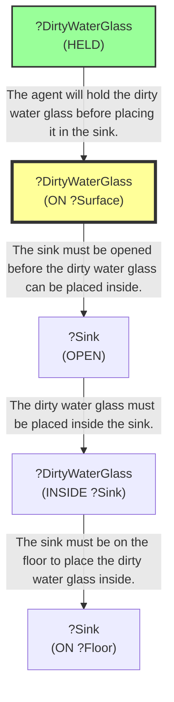
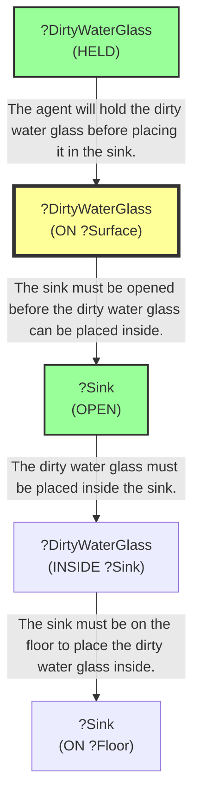
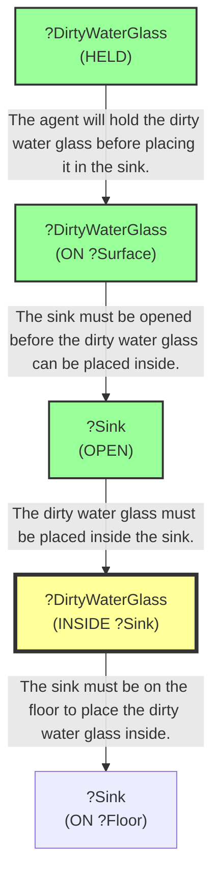
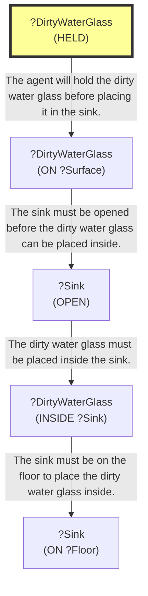
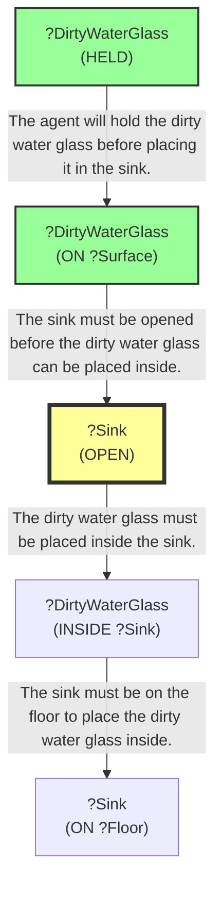
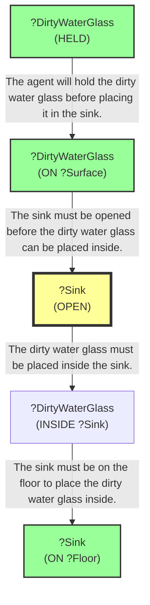

# 🚀 VirtualHome Agent Episode Log


### [GoalReasoner (Module A - Intent)] Output
```json
{
  "is_instruction_obviously_vague": false,
  "clarification_question": null,
  "target_object": "dirty water glasses",
  "location_hint": "sink",
  "reasoning_chain": [
    {
      "question": "Why does the user want to put dirty water glasses in the sink?",
      "answer": "The user wants to put dirty water glasses in the sink because they want to clean them."
    },
    {
      "question": "Why is cleaning them important?",
      "answer": "Cleaning them is important because dirty water glasses can harbor bacteria and cause health issues."
    },
    {
      "question": "What fundamental need does this fulfill?",
      "answer": "This fulfills the fundamental need to maintain cleanliness and hygiene."
    },
    {
      "question": "Are there any deeper psychological or physical motivations?",
      "answer": "There are no deeper psychological or physical motivations beyond the need for cleanliness and hygiene."
    }
  ],
  "deep_intent": "Maintain cleanliness and hygiene",
  "acceptable_alternatives_properties": [
    {
      "priority": 1,
      "description": "Dirty dishes or utensils that need to be washed in the sink"
    },
    {
      "priority": 2,
      "description": "Other items that need to be cleaned and put in the sink, such as a dirty plate or bowl"
    },
    {
      "priority": 3,
      "description": "Any item that needs to be washed and cleaned in the sink, regardless of its original purpose"
    },
    {
      "priority": 4,
      "description": "Items that need to be cleaned and put in a dishwasher, such as a dirty cup or mug"
    }
  ]
}
```

### [PerceptionFilter] Output
```json
{
  "reasoning": "To maintain cleanliness and hygiene, we need to select the minimum number of object classes necessary to achieve the goal of cleaning dirty water glasses. This includes the target object classes (dirty water glasses), potential functional tools and physical backups (sink, water glass), and locations and furniture explicitly mentioned or implied by the Global Intent (kitchen counter, sink).",
  "selected_classes": [
    "waterglass",
    "plate",
    "sink",
    "floor",
    "kitchencounter",
    "dishwasher",
    "character"
  ],
  "raw_class_count": 50
}
```

### [LLMExecutor] Output
```json
{
  "reasoning": "The goal is to put dirty water glasses in the sink. The current filtered graph shows multiple water glasses and a sink. The SDG requires the agent to hold a dirty water glass before placing it in the sink. The closest dirty water glass is waterglass(64) which is currently held by character(1).",
  "satisfied_nodes": [
    "N1"
  ],
  "current_node_focus": "N2",
  "mapped_variables": {
    "?DirtyWaterGlass": "waterglass(64)"
  },
  "action": "[walk] sink (155)"
}
```

### [RoboStateMultiTaskController] Output
```json
{
  "action": "[walk] <sink> (155)",
  "active_task_id": "task_1",
  "task_context": {
    "active_task_id": "task_1",
    "pending_task_ids": [],
    "satisfied_task_ids": []
  },
  "source": "llm_executor"
}
```
## Step 0
- **Action**: `[walk] <sink> (155)`
- **Action Success**: `True`
- **Action Message**: {'0': {'message': 'Success'}}
- **Active Task**: `task_1`
- **Decision Source**: `llm_executor`
- **Task Progress**: T4_llama_M1_03=pending
- **SDG Status**:

- **Observed Items (39)**: floor(22), floor(23), floor(24), floor(25), floor(26), floor(27), floor(28), floor(29), floor(30), floor(31), floor(32), floor(33), waterglass(64) [DIRTY], plate(67), plate(68)...


### [PerceptionFilter] Output
```json
{
  "reasoning": "Reused cached class selection.",
  "selected_classes": [
    "waterglass",
    "plate",
    "sink",
    "floor",
    "kitchencounter",
    "dishwasher",
    "character"
  ],
  "raw_class_count": 50
}
```

### [LLMExecutor] Output
```json
{
  "reasoning": "The goal is to put dirty water glasses in the sink. The current state is that the sink is open, and there are multiple water glasses available. The next step is to grab a dirty water glass and place it in the sink.",
  "satisfied_nodes": [
    "N1",
    "N3"
  ],
  "current_node_focus": "N2",
  "mapped_variables": {
    "?DirtyWaterGlass": "waterglass(64)"
  },
  "action": "[grab] <waterglass> (64)"
}
```

### [RoboStateMultiTaskController] Output
```json
{
  "action": "[walk] <waterglass> (64)",
  "active_task_id": "task_1",
  "task_context": {
    "active_task_id": "task_1",
    "pending_task_ids": [],
    "satisfied_task_ids": []
  },
  "source": "llm_executor_repaired"
}
```
## Step 1
- **Action**: `[walk] <waterglass> (64)`
- **Action Success**: `True`
- **Action Message**: {'0': {'message': 'Success'}}
- **Active Task**: `task_1`
- **Decision Source**: `llm_executor_repaired`
- **Task Progress**: T4_llama_M1_03=pending
- **SDG Status**:

- **Observed Items (39)**: floor(22), floor(23), floor(24), floor(25), floor(26), floor(27), floor(28), floor(29), floor(30), floor(31), floor(32), floor(33), waterglass(64) [DIRTY], plate(67), plate(68)...


### [PerceptionFilter] Output
```json
{
  "reasoning": "Reused cached class selection.",
  "selected_classes": [
    "waterglass",
    "plate",
    "sink",
    "floor",
    "kitchencounter",
    "dishwasher",
    "character"
  ],
  "raw_class_count": 50
}
```

### [LLMExecutor] Output
```json
{
  "reasoning": "To put dirty water glasses in the sink, we need to hold the dirty water glass and then place it inside the sink. The current filtered graph shows that there are multiple water glasses available, but we need to choose the one that is DIRTY. We will choose waterglass(64) because it is DIRTY.",
  "satisfied_nodes": [
    "N1"
  ],
  "current_node_focus": "N2",
  "mapped_variables": {
    "?DirtyWaterGlass": "waterglass(64)"
  },
  "action": "[grab] <waterglass> (64)"
}
```

### [RoboStateMultiTaskController] Output
```json
{
  "action": "[grab] <waterglass> (64)",
  "active_task_id": "task_1",
  "task_context": {
    "active_task_id": "task_1",
    "pending_task_ids": [],
    "satisfied_task_ids": []
  },
  "source": "llm_executor"
}
```
## Step 2
- **Action**: `[grab] <waterglass> (64)`
- **Action Success**: `False`
- **Action Message**: temporary_unavailable: target disappeared; wait or search and retry
- **Active Task**: `task_1`
- **Decision Source**: `llm_executor`
- **Task Progress**: T4_llama_M1_03=pending
- **SDG Status**:

- **Observed Items (39)**: floor(22), floor(23), floor(24), floor(25), floor(26), floor(27), floor(28), floor(29), floor(30), floor(31), floor(32), floor(33), waterglass(64) [DIRTY], plate(67), plate(68)...


### [PerceptionFilter] Output
```json
{
  "reasoning": "Reused cached class selection.",
  "selected_classes": [
    "waterglass",
    "plate",
    "sink",
    "floor",
    "kitchencounter",
    "dishwasher",
    "character"
  ],
  "raw_class_count": 50
}
```

### [LLMExecutor] Output
```json
{
  "reasoning": "The goal is to put dirty water glasses in the sink. The current filtered graph shows multiple water glasses and a sink. The previous action was a failed attempt to grab a water glass. The next step is to grab a water glass and then put it in the sink.",
  "satisfied_nodes": [
    "N1",
    "N2",
    "N3"
  ],
  "current_node_focus": "N4",
  "mapped_variables": {
    "?DirtyWaterGlass": "waterglass(64)"
  },
  "action": "[grab] <waterglass> (64)"
}
```

### [RoboStateMultiTaskController] Output
```json
{
  "action": "[grab] <waterglass> (64)",
  "active_task_id": "task_1",
  "task_context": {
    "active_task_id": "task_1",
    "pending_task_ids": [],
    "satisfied_task_ids": []
  },
  "source": "llm_executor"
}
```
## Step 3
- **Action**: `[grab] <waterglass> (64)`
- **Action Success**: `False`
- **Action Message**: temporary_unavailable: target is temporarily hidden
- **Active Task**: `task_1`
- **Decision Source**: `llm_executor`
- **Task Progress**: T4_llama_M1_03=pending
- **SDG Status**:

- **Observed Items (39)**: floor(22), floor(23), floor(24), floor(25), floor(26), floor(27), floor(28), floor(29), floor(30), floor(31), floor(32), floor(33), waterglass(64) [DIRTY], plate(67), plate(68)...


### [RoboStateMultiTaskController] Output
```json
{
  "action": "[walk] <livingroom> (183)",
  "active_task_id": null,
  "task_context": {
    "active_task_id": null,
    "pending_task_ids": [
      "task_1"
    ],
    "satisfied_task_ids": []
  },
  "source": "loop_recovery_room_revisit"
}
```
## Step 4
- **Action**: `[walk] <livingroom> (183)`
- **Action Success**: `True`
- **Action Message**: {'0': {'message': 'Success'}}
- **Decision Source**: `loop_recovery_room_revisit`
- **Task Progress**: T4_llama_M1_03=pending
- **SDG Status**:
No SDG active.
- **Observed Items (159)**: wall(12), wall(13), wall(14), wall(15), wall(16), wall(17), wall(18), wall(19), wall(20), wall(21), floor(22), floor(23), floor(24), floor(25), floor(26)...


### [PerceptionFilter] Output
```json
{
  "reasoning": "To maintain cleanliness and hygiene, we need to select the minimum number of object classes necessary to clean and put dirty water glasses in the sink. We must include the target object classes (dirty water glasses), functional tools (sink), and physical backups (dishwasher). We also need to include the location (sink) and exact matches (water glass).",
  "selected_classes": [
    "waterglass",
    "plate",
    "sink",
    "floor",
    "dishwasher",
    "character"
  ],
  "raw_class_count": 59
}
```

### [LLMExecutor] Output
```json
{
  "reasoning": "The goal is to put dirty water glasses in the sink. The current task is to grab the dirty water glass. The current filtered graph shows multiple water glasses, but only one is dirty. I will choose the dirty water glass and attempt to grab it.",
  "satisfied_nodes": [],
  "current_node_focus": "N1",
  "mapped_variables": {
    "?DirtyWaterGlass": "waterglass(64)"
  },
  "action": "[grab] <waterglass> (64)"
}
```

### [RoboStateMultiTaskController] Output
```json
{
  "action": "[grab] <waterglass> (64)",
  "active_task_id": "task_1",
  "task_context": {
    "active_task_id": "task_1",
    "pending_task_ids": [],
    "satisfied_task_ids": []
  },
  "source": "llm_executor"
}
```
## Step 5
- **Action**: `[grab] <waterglass> (64)`
- **Action Success**: `False`
- **Action Message**: temporary_unavailable: target is temporarily hidden
- **Active Task**: `task_1`
- **Decision Source**: `llm_executor`
- **Task Progress**: T4_llama_M1_03=pending
- **SDG Status**:

- **Observed Items (45)**: floor(22), floor(23), floor(24), floor(25), floor(26), floor(27), floor(28), floor(29), floor(30), floor(31), floor(32), floor(33), waterglass(64) [DIRTY], plate(67), plate(68)...


### [RoboStateMultiTaskController] Output
```json
{
  "action": "[walk] <bedroom> (241)",
  "active_task_id": null,
  "task_context": {
    "active_task_id": null,
    "pending_task_ids": [
      "task_1"
    ],
    "satisfied_task_ids": []
  },
  "source": "loop_recovery_room_revisit"
}
```
## Step 6
- **Action**: `[walk] <bedroom> (241)`
- **Action Success**: `True`
- **Action Message**: {'0': {'message': 'Success'}}
- **Decision Source**: `loop_recovery_room_revisit`
- **Task Progress**: T4_llama_M1_03=pending
- **SDG Status**:
No SDG active.
- **Observed Items (211)**: wall(12), wall(13), wall(14), wall(15), wall(16), wall(17), wall(18), wall(19), wall(20), wall(21), floor(22), floor(23), floor(24), floor(25), floor(26)...


### [PerceptionFilter] Output
```json
{
  "reasoning": "To achieve the goal of maintaining cleanliness and hygiene, we need to select the minimum number of object classes required to clean dirty water glasses in the sink. This includes the target object class 'waterglass', the sink as the location, and the necessary tools and receptacles.",
  "selected_classes": [
    "waterglass",
    "plate",
    "sink",
    "floor",
    "dishwasher",
    "dishbowl",
    "faucet",
    "character"
  ],
  "raw_class_count": 65
}
```

### [LLMExecutor] Output
```json
{
  "reasoning": "To satisfy the goal of putting dirty water glasses in the sink, we need to find a suitable water glass to put in the sink. We have multiple water glasses available, but we need to choose the one that is DIRTY and needs to be cleaned.",
  "satisfied_nodes": [
    "N1",
    "N2"
  ],
  "current_node_focus": "N3",
  "mapped_variables": {
    "?DirtyWaterGlass": "waterglass(64)"
  },
  "action": "[walk] <waterglass> (64)"
}
```

### [RoboStateMultiTaskController] Output
```json
{
  "action": "[walk] <waterglass> (64)",
  "active_task_id": "task_1",
  "task_context": {
    "active_task_id": "task_1",
    "pending_task_ids": [],
    "satisfied_task_ids": []
  },
  "source": "llm_executor"
}
```
## Step 7
- **Action**: `[walk] <waterglass> (64)`
- **Action Success**: `True`
- **Action Message**: {'0': {'message': 'Success'}}
- **Active Task**: `task_1`
- **Decision Source**: `llm_executor`
- **Task Progress**: T4_llama_M1_03=pending
- **SDG Status**:

- **Observed Items (57)**: floor(22), floor(23), floor(24), floor(25), floor(26), floor(27), floor(28), floor(29), floor(30), floor(31), floor(32), floor(33), waterglass(64) [DIRTY], plate(67), plate(68)...


### [PerceptionFilter] Output
```json
{
  "reasoning": "Reused cached class selection.",
  "selected_classes": [
    "waterglass",
    "plate",
    "sink",
    "floor",
    "dishwasher",
    "dishbowl",
    "faucet",
    "character"
  ],
  "raw_class_count": 65
}
```

### [LLMExecutor] Output
```json
{
  "reasoning": "The current goal is to put dirty water glasses in the sink. The last action was to walk to the sink, but the next step is to grab the water glass. However, the water glass is temporarily unavailable, so we need to wait or search and retry.",
  "satisfied_nodes": [
    "N1",
    "N2",
    "N5"
  ],
  "current_node_focus": "N3",
  "mapped_variables": {
    "?Sink": "sink(155)",
    "?DirtyWaterGlass": "waterglass(64)"
  },
  "action": "[wait]"
}
```

### [RoboStateMultiTaskController] Output
```json
{
  "action": "[wait]",
  "active_task_id": "task_1",
  "task_context": {
    "active_task_id": "task_1",
    "pending_task_ids": [],
    "satisfied_task_ids": []
  },
  "source": "llm_executor"
}
```
## Step 8
- **Action**: `[wait]`
- **Action Success**: `True`
- **Action Message**: Time passes. You waited for a while.
- **Active Task**: `task_1`
- **Decision Source**: `llm_executor`
- **Task Progress**: T4_llama_M1_03=pending
- **SDG Status**:

- **Observed Items (57)**: floor(22), floor(23), floor(24), floor(25), floor(26), floor(27), floor(28), floor(29), floor(30), floor(31), floor(32), floor(33), waterglass(64) [DIRTY], plate(67), plate(68)...


### [PerceptionFilter] Output
```json
{
  "reasoning": "Reused cached class selection.",
  "selected_classes": [
    "waterglass",
    "plate",
    "sink",
    "floor",
    "dishwasher",
    "dishbowl",
    "faucet",
    "character"
  ],
  "raw_class_count": 65
}
```

### [LLMExecutor] Output
```json
{
  "reasoning": "The goal is to put dirty water glasses in the sink. The current filtered graph shows multiple water glasses and a sink. The previous actions indicate that the robot has walked to the sink and is now trying to grab a water glass. However, the previous grab actions failed due to the water glass being temporarily unavailable. The current filtered graph shows multiple water glasses, so the robot will try to grab one of them.",
  "satisfied_nodes": [],
  "current_node_focus": "N1",
  "mapped_variables": {
    "?DirtyWaterGlass": "waterglass(64)"
  },
  "action": "[grab] <waterglass> (64)"
}
```

### [RoboStateMultiTaskController] Output
```json
{
  "action": "[grab] <waterglass> (64)",
  "active_task_id": "task_1",
  "task_context": {
    "active_task_id": "task_1",
    "pending_task_ids": [],
    "satisfied_task_ids": []
  },
  "source": "llm_executor"
}
```
## Step 9
- **Action**: `[grab] <waterglass> (64)`
- **Action Success**: `True`
- **Action Message**: {'0': {'message': 'Success'}}
- **Active Task**: `task_1`
- **Decision Source**: `llm_executor`
- **Task Progress**: T4_llama_M1_03=pending
- **SDG Status**:

- **Observed Items (57)**: floor(22), floor(23), floor(24), floor(25), floor(26), floor(27), floor(28), floor(29), floor(30), floor(31), floor(32), floor(33), waterglass(64) [DIRTY], plate(67), plate(68)...


### [PerceptionFilter] Output
```json
{
  "reasoning": "Reused cached class selection.",
  "selected_classes": [
    "waterglass",
    "plate",
    "sink",
    "floor",
    "dishwasher",
    "dishbowl",
    "faucet",
    "character"
  ],
  "raw_class_count": 65
}
```

### [LLMExecutor] Output
```json
{
  "reasoning": "The goal is to put dirty water glasses in the sink. The current filtered graph shows multiple water glasses, but the target object is not explicitly held. The last action was a successful walk to the sink, but the grab action failed due to the target being temporarily unavailable. The temporary unavailability has been resolved, and the target is now available. The next step is to grab the dirty water glass.",
  "satisfied_nodes": [],
  "current_node_focus": "N1",
  "mapped_variables": {
    "?DirtyWaterGlass": "waterglass(64)"
  },
  "action": "[grab] <waterglass> (64)"
}
```

### [RoboStateMultiTaskController] Output
```json
{
  "action": "[grab] <waterglass> (64)",
  "active_task_id": "task_1",
  "task_context": {
    "active_task_id": "task_1",
    "pending_task_ids": [],
    "satisfied_task_ids": []
  },
  "source": "llm_executor"
}
```
## Step 10
- **Action**: `[grab] <waterglass> (64)`
- **Action Success**: `False`
- **Action Message**: {'0': {'message': 'ScriptExcutor 0: EXECUTION_GENERAL: Script is impossible to execute\n\n'}}
- **Active Task**: `task_1`
- **Decision Source**: `llm_executor`
- **Task Progress**: T4_llama_M1_03=pending
- **SDG Status**:

- **Observed Items (57)**: floor(22), floor(23), floor(24), floor(25), floor(26), floor(27), floor(28), floor(29), floor(30), floor(31), floor(32), floor(33), waterglass(64) [DIRTY], plate(67), plate(68)...


### [PerceptionFilter] Output
```json
{
  "reasoning": "Reused cached class selection.",
  "selected_classes": [
    "waterglass",
    "plate",
    "sink",
    "floor",
    "dishwasher",
    "dishbowl",
    "faucet",
    "character"
  ],
  "raw_class_count": 65
}
```

### [LLMExecutor] Output
```json
{
  "reasoning": "The current goal is to put dirty water glasses in the sink. The dirty water glass is currently held by the character. To achieve the goal, the character must first open the sink and then put the dirty water glass inside.",
  "satisfied_nodes": [
    "N1"
  ],
  "current_node_focus": "N2",
  "mapped_variables": {
    "?DirtyWaterGlass": "waterglass(64)",
    "?Sink": "sink(155)"
  },
  "action": "[open] <sink> (155)"
}
```

### [RoboStateMultiTaskController] Output
```json
{
  "action": "[walk] <bathroom> (285)",
  "active_task_id": null,
  "task_context": {
    "active_task_id": null,
    "pending_task_ids": [
      "task_1"
    ],
    "satisfied_task_ids": []
  },
  "source": "loop_recovery_room_revisit"
}
```
## Step 11
- **Action**: `[walk] <bathroom> (285)`
- **Action Success**: `True`
- **Action Message**: {'0': {'message': 'Success'}}
- **Decision Source**: `loop_recovery_room_revisit`
- **Task Progress**: T4_llama_M1_03=pending
- **SDG Status**:
No SDG active.
- **Observed Items (243)**: wall(12), wall(13), wall(14), wall(15), wall(16), wall(17), wall(18), wall(19), wall(20), wall(21), floor(22), floor(23), floor(24), floor(25), floor(26)...


### [PerceptionFilter] Output
```json
{
  "reasoning": "To maintain cleanliness and hygiene, we need to select the minimum number of object classes that are strictly necessary to put dirty water glasses in the sink. We must include the target object class 'dirty water glasses', the sink, and all potential functional tools and physical backups. We also need to include all locations, furniture, and receptacles explicitly mentioned or implied by the Global Intent.",
  "selected_classes": [
    "soap",
    "plate",
    "waterglass",
    "cup",
    "dirty water glass",
    "sink",
    "towel",
    "toothbrush",
    "water glass",
    "floor",
    "dishwasher",
    "toothpaste",
    "dishbowl",
    "faucet",
    "character"
  ],
  "raw_class_count": 81
}
```

### [LLMExecutor] Output
```json
{
  "reasoning": "The current goal is to put dirty water glasses in the sink. The dirty water glass is currently held by the character. The sink is in the kitchen, but the character is currently in the bathroom. The dirty water glass is temporarily hidden, so the character must wait for it to reappear.",
  "satisfied_nodes": [],
  "current_node_focus": "N1",
  "mapped_variables": {
    "?DirtyWaterGlass": "waterglass(64)"
  },
  "action": "[wait]"
}
```

### [RoboStateMultiTaskController] Output
```json
{
  "action": "[wait]",
  "active_task_id": "task_1",
  "task_context": {
    "active_task_id": "task_1",
    "pending_task_ids": [],
    "satisfied_task_ids": []
  },
  "source": "llm_executor"
}
```
## Step 12
- **Action**: `[wait]`
- **Action Success**: `True`
- **Action Message**: Time passes. You waited for a while.
- **Active Task**: `task_1`
- **Decision Source**: `llm_executor`
- **Task Progress**: T4_llama_M1_03=pending
- **SDG Status**:

- **Observed Items (74)**: floor(22), floor(23), floor(24), floor(25), floor(26), floor(27), floor(28), floor(29), floor(30), floor(31), floor(32), floor(33), waterglass(64) [DIRTY], plate(67), plate(68)...


### [PerceptionFilter] Output
```json
{
  "reasoning": "Reused cached class selection.",
  "selected_classes": [
    "soap",
    "plate",
    "waterglass",
    "cup",
    "dirty water glass",
    "sink",
    "towel",
    "toothbrush",
    "water glass",
    "floor",
    "dishwasher",
    "toothpaste",
    "dishbowl",
    "faucet",
    "character"
  ],
  "raw_class_count": 81
}
```

### [LLMExecutor] Output
```json
{
  "reasoning": "The goal is to put dirty water glasses in the sink. The current object to focus on is waterglass(64). It is currently DIRTY and not being held. The sink is in the kitchen, but the waterglass is currently inside the bathroom. The previous actions indicate that the waterglass was temporarily unavailable, but it is now available. The next step is to grab the waterglass and walk to the sink.",
  "satisfied_nodes": [],
  "current_node_focus": "N1",
  "mapped_variables": {
    "?DirtyWaterGlass": "waterglass(64)"
  },
  "action": "[grab] <waterglass> (64)"
}
```

### [RoboStateMultiTaskController] Output
```json
{
  "action": "[grab] <waterglass> (64)",
  "active_task_id": "task_1",
  "task_context": {
    "active_task_id": "task_1",
    "pending_task_ids": [],
    "satisfied_task_ids": []
  },
  "source": "llm_executor"
}
```
## Step 13
- **Action**: `[grab] <waterglass> (64)`
- **Action Success**: `False`
- **Action Message**: {'0': {'message': 'ScriptExcutor 0: EXECUTION_GENERAL: Script is impossible to execute\n\n'}}
- **Active Task**: `task_1`
- **Decision Source**: `llm_executor`
- **Task Progress**: T4_llama_M1_03=pending
- **SDG Status**:

- **Observed Items (74)**: floor(22), floor(23), floor(24), floor(25), floor(26), floor(27), floor(28), floor(29), floor(30), floor(31), floor(32), floor(33), waterglass(64) [DIRTY], plate(67), plate(68)...


### [PerceptionFilter] Output
```json
{
  "reasoning": "Reused cached class selection.",
  "selected_classes": [
    "soap",
    "plate",
    "waterglass",
    "cup",
    "dirty water glass",
    "sink",
    "towel",
    "toothbrush",
    "water glass",
    "floor",
    "dishwasher",
    "toothpaste",
    "dishbowl",
    "faucet",
    "character"
  ],
  "raw_class_count": 81
}
```

### [LLMExecutor] Output
```json
{
  "reasoning": "To satisfy the goal intent of putting dirty water glasses in the sink, the next action is to grab the dirty water glass. The current filtered graph shows that the dirty water glass is inside the bathroom, so the next step is to walk to the bathroom and grab the dirty water glass.",
  "satisfied_nodes": [],
  "current_node_focus": "N1",
  "mapped_variables": {
    "?DirtyWaterGlass": "waterglass(64)"
  },
  "action": "[grab] <waterglass> (64)"
}
```

### [RoboStateMultiTaskController] Output
```json
{
  "action": "[grab] <waterglass> (64)",
  "active_task_id": "task_1",
  "task_context": {
    "active_task_id": "task_1",
    "pending_task_ids": [],
    "satisfied_task_ids": []
  },
  "source": "llm_executor"
}
```
## Step 14
- **Action**: `[grab] <waterglass> (64)`
- **Action Success**: `False`
- **Action Message**: {'0': {'message': 'ScriptExcutor 0: EXECUTION_GENERAL: Script is impossible to execute\n\n'}}
- **Active Task**: `task_1`
- **Decision Source**: `llm_executor`
- **Task Progress**: T4_llama_M1_03=pending
- **SDG Status**:

- **Observed Items (74)**: floor(22), floor(23), floor(24), floor(25), floor(26), floor(27), floor(28), floor(29), floor(30), floor(31), floor(32), floor(33), waterglass(64) [DIRTY], plate(67), plate(68)...


### [RoboStateMultiTaskController] Output
```json
{
  "action": "[walk] <bedroom> (346)",
  "active_task_id": null,
  "task_context": {
    "active_task_id": null,
    "pending_task_ids": [
      "task_1"
    ],
    "satisfied_task_ids": []
  },
  "source": "loop_recovery_room_revisit"
}
```
## Step 15
- **Action**: `[walk] <bedroom> (346)`
- **Action Success**: `True`
- **Action Message**: {'0': {'message': 'Success'}}
- **Decision Source**: `loop_recovery_room_revisit`
- **Task Progress**: T4_llama_M1_03=pending
- **SDG Status**:
No SDG active.
- **Observed Items (303)**: wall(12), wall(13), wall(14), wall(15), wall(16), wall(17), wall(18), wall(19), wall(20), wall(21), floor(22), floor(23), floor(24), floor(25), floor(26)...


### [PerceptionFilter] Output
```json
{
  "reasoning": "The goal is to maintain cleanliness and hygiene by washing dirty water glasses in the sink. We need to select the minimum number of object classes required to achieve this goal. We must include the target object classes (dirty water glasses), the sink, and all potential functional tools and physical backups. We also need to include all locations, furniture, and receptacles explicitly mentioned or implied by the Global Intent.",
  "selected_classes": [
    "mug",
    "soap",
    "waterglass",
    "plate",
    "towel",
    "sink",
    "water",
    "toothbrush",
    "floor",
    "dishwasher",
    "toothpaste",
    "faucet",
    "character"
  ],
  "raw_class_count": 91
}
```

### [LLMExecutor] Output
```json
{
  "reasoning": "The goal is to put dirty water glasses in the sink. The current object to be put in the sink is waterglass(64), which is currently held by the agent. The sink is located in the kitchen, and the agent is currently in the bedroom. The agent must walk to the kitchen and then put the waterglass in the sink.",
  "satisfied_nodes": [],
  "current_node_focus": "N1",
  "mapped_variables": {
    "?DirtyWaterGlass": "waterglass(64)"
  },
  "action": "[walk] <kitchen> (11)"
}
```

### [RoboStateMultiTaskController] Output
```json
{
  "action": "[walk] <kitchen> (11)",
  "active_task_id": "task_1",
  "task_context": {
    "active_task_id": "task_1",
    "pending_task_ids": [],
    "satisfied_task_ids": []
  },
  "source": "llm_executor"
}
```
## Step 16
- **Action**: `[walk] <kitchen> (11)`
- **Action Success**: `True`
- **Action Message**: {'0': {'message': 'Success'}}
- **Active Task**: `task_1`
- **Decision Source**: `llm_executor`
- **Task Progress**: T4_llama_M1_03=pending
- **SDG Status**:

- **Observed Items (79)**: floor(22), floor(23), floor(24), floor(25), floor(26), floor(27), floor(28), floor(29), floor(30), floor(31), floor(32), floor(33), waterglass(64) [DIRTY], plate(67), plate(68)...


### [PerceptionFilter] Output
```json
{
  "reasoning": "Reused cached class selection.",
  "selected_classes": [
    "mug",
    "soap",
    "waterglass",
    "plate",
    "towel",
    "sink",
    "water",
    "toothbrush",
    "floor",
    "dishwasher",
    "toothpaste",
    "faucet",
    "character"
  ],
  "raw_class_count": 91
}
```

### [LLMExecutor] Output
```json
{
  "reasoning": "To put dirty water glasses in the sink, I need to hold the dirty water glass and be near the sink. I have already walked to the kitchen and grabbed the dirty water glass. Now, I need to walk to the sink and put the dirty water glass inside it.",
  "satisfied_nodes": [
    "N1"
  ],
  "current_node_focus": "N2",
  "mapped_variables": {
    "?DirtyWaterGlass": "waterglass(64)",
    "?Sink": "sink(155)"
  },
  "action": "[walk] <sink> (155)"
}
```

### [RoboStateMultiTaskController] Output
```json
{
  "action": "[walk] <sink> (155)",
  "active_task_id": "task_1",
  "task_context": {
    "active_task_id": "task_1",
    "pending_task_ids": [],
    "satisfied_task_ids": []
  },
  "source": "llm_executor"
}
```
## Step 17
- **Action**: `[walk] <sink> (155)`
- **Action Success**: `True`
- **Action Message**: {'0': {'message': 'Success'}}
- **Active Task**: `task_1`
- **Decision Source**: `llm_executor`
- **Task Progress**: T4_llama_M1_03=pending
- **SDG Status**:

- **Observed Items (79)**: floor(22), floor(23), floor(24), floor(25), floor(26), floor(27), floor(28), floor(29), floor(30), floor(31), floor(32), floor(33), waterglass(64) [DIRTY], plate(67), plate(68)...

