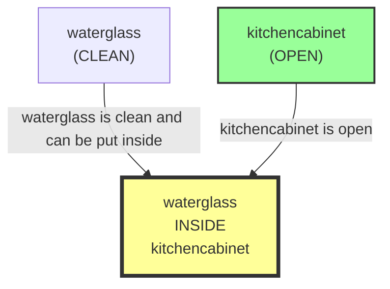
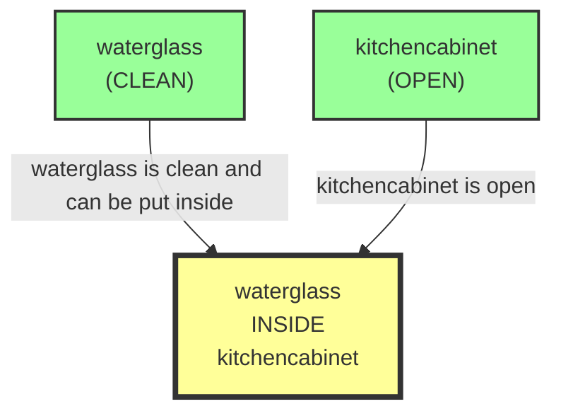

# 🚀 VirtualHome Agent Episode Log


### [GoalReasoner (Module A - Intent)] Output
```json
{
  "is_instruction_obviously_vague": false,
  "clarification_question": null,
  "target_object": "waterglass",
  "location_hint": "kitchencabinet",
  "reasoning_chain": [
    {
      "question": "Why does the user want to put the waterglass inside the kitchencabinet?",
      "answer": "The user wants to store the waterglass in a designated place."
    },
    {
      "question": "Why is storing the waterglass important?",
      "answer": "The user wants to keep the waterglass clean and safe from breakage."
    },
    {
      "question": "What fundamental need does this fulfill?",
      "answer": "The user wants to maintain a clean and organized kitchen environment."
    },
    {
      "question": "Are there any deeper psychological or physical motivations?",
      "answer": "No deeper motivations identified."
    }
  ],
  "deep_intent": "Maintain a clean and organized kitchen environment",
  "acceptable_alternatives_properties": [
    {
      "priority": 1,
      "description": "Other clean glasses or containers that can be stored in the kitchencabinet"
    },
    {
      "priority": 2,
      "description": "Other kitchen items that need to be stored in a designated place, such as plates or utensils"
    },
    {
      "priority": 3,
      "description": "Items that need to be kept clean and safe from breakage, such as fragile kitchenware"
    },
    {
      "priority": 4,
      "description": "Other household items that can be stored in a designated place, such as books or decorative items"
    }
  ]
}
```

### [PerceptionFilter] Output
```json
{
  "reasoning": "The selected object classes are necessary to maintain a clean and organized kitchen environment, as per the user's deep intent. The target object is the waterglass, which needs to be stored in a designated place, such as the kitchencabinet. Alternative tools and locations are included to ensure the goal is achieved.",
  "selected_classes": [
    "waterglass",
    "plate",
    "fridge",
    "sink",
    "kitchentable",
    "kitchencabinet",
    "dishwasher",
    "kitchencounterdrawer",
    "character"
  ],
  "raw_class_count": 50
}
```

### [LLMExecutor] Output
```json
{
  "reasoning": "To put the waterglass inside the kitchencabinet, I need to ensure the waterglass is clean and the kitchencabinet is open. The waterglass is already clean, but the kitchencabinet is open. I will first grab the waterglass and then walk to the kitchencabinet.",
  "satisfied_nodes": [
    "N1"
  ],
  "current_node_focus": "N3",
  "mapped_variables": {
    "?Washer": "waterglass(64)"
  },
  "action": "[walk] <waterglass> (64)"
}
```

### [RoboStateMultiTaskController] Output
```json
{
  "action": "[walk] <waterglass> (64)",
  "active_task_id": "task_1",
  "task_context": {
    "active_task_id": "task_1",
    "pending_task_ids": [],
    "satisfied_task_ids": []
  },
  "source": "llm_executor"
}
```
## Step 0
- **Action**: `[walk] <waterglass> (64)`
- **Action Success**: `True`
- **Action Message**: {'0': {'message': 'Success'}}
- **Active Task**: `task_1`
- **Decision Source**: `llm_executor`
- **Task Progress**: T4_llama_M4_17=pending
- **SDG Status**:

- **Observed Items (44)**: waterglass(64) [EMPTY,CLEAN], plate(67), plate(68), waterglass(71) [DIRTY], waterglass(72) [DIRTY], plate(75), plate(76), waterglass(79), waterglass(80), plate(83), plate(84), waterglass(87), waterglass(88), plate(91), waterglass(100)...


### [PerceptionFilter] Output
```json
{
  "reasoning": "Reused cached class selection.",
  "selected_classes": [
    "waterglass",
    "plate",
    "fridge",
    "sink",
    "kitchentable",
    "kitchencabinet",
    "dishwasher",
    "kitchencounterdrawer",
    "character"
  ],
  "raw_class_count": 50
}
```

### [LLMExecutor] Output
```json
{
  "reasoning": "The goal is to put the waterglass inside the kitchencabinet. The waterglass is clean and empty, and the kitchencabinet is open. To achieve this, I need to grab the waterglass and then put it inside the kitchencabinet.",
  "satisfied_nodes": [
    "N1",
    "N2"
  ],
  "current_node_focus": "N3",
  "mapped_variables": {
    "?Washer": "waterglass(64)"
  },
  "action": "[grab] <waterglass> (64)"
}
```

### [RoboStateMultiTaskController] Output
```json
{
  "action": "[grab] <waterglass> (64)",
  "active_task_id": "task_1",
  "task_context": {
    "active_task_id": "task_1",
    "pending_task_ids": [],
    "satisfied_task_ids": []
  },
  "source": "llm_executor"
}
```
## Step 1
- **Action**: `[grab] <waterglass> (64)`
- **Action Success**: `True`
- **Action Message**: {'0': {'message': 'Success'}}
- **Active Task**: `task_1`
- **Decision Source**: `llm_executor`
- **Task Progress**: T4_llama_M4_17=pending
- **SDG Status**:

- **Observed Items (44)**: waterglass(64) [EMPTY,CLEAN], plate(67), plate(68), waterglass(71) [DIRTY], waterglass(72) [DIRTY], plate(75), plate(76), waterglass(79), waterglass(80), plate(83), plate(84), waterglass(87), waterglass(88), plate(91), waterglass(100)...


### [PerceptionFilter] Output
```json
{
  "reasoning": "Reused cached class selection.",
  "selected_classes": [
    "waterglass",
    "plate",
    "fridge",
    "sink",
    "kitchentable",
    "kitchencabinet",
    "dishwasher",
    "kitchencounterdrawer",
    "character"
  ],
  "raw_class_count": 50
}
```

### [LLMExecutor] Output
```json
{
  "reasoning": "To satisfy the goal of putting the waterglass inside the kitchencabinet, I need to grab the waterglass and then walk to the kitchencabinet. Since the waterglass is currently on the kitchentable, I will first grab it and then walk to the kitchencabinet.",
  "satisfied_nodes": [
    "N1",
    "N2"
  ],
  "current_node_focus": "N3",
  "mapped_variables": {
    "?Washer": "sink(155)"
  },
  "action": "[grab] <waterglass> (64)"
}
```

### [RoboStateMultiTaskController] Output
```json
{
  "action": "[grab] <waterglass> (64)",
  "active_task_id": "task_1",
  "task_context": {
    "active_task_id": "task_1",
    "pending_task_ids": [],
    "satisfied_task_ids": []
  },
  "source": "llm_executor"
}
```
## Step 2
- **Action**: `[grab] <waterglass> (64)`
- **Action Success**: `False`
- **Action Message**: {'0': {'message': 'ScriptExcutor 0: EXECUTION_GENERAL: Script is impossible to execute\n\n'}}
- **Active Task**: `task_1`
- **Decision Source**: `llm_executor`
- **Task Progress**: T4_llama_M4_17=pending
- **SDG Status**:

- **Observed Items (44)**: waterglass(64) [EMPTY,CLEAN], plate(67), plate(68), waterglass(71) [DIRTY], waterglass(72) [DIRTY], plate(75), plate(76), waterglass(79), waterglass(80), plate(83), plate(84), waterglass(87), waterglass(88), plate(91), waterglass(100)...


### [PerceptionFilter] Output
```json
{
  "reasoning": "Reused cached class selection.",
  "selected_classes": [
    "waterglass",
    "plate",
    "fridge",
    "sink",
    "kitchentable",
    "kitchencabinet",
    "dishwasher",
    "kitchencounterdrawer",
    "character"
  ],
  "raw_class_count": 50
}
```

### [LLMExecutor] Output
```json
{
  "reasoning": "The goal is to put the waterglass inside the kitchencabinet. The waterglass is clean and empty. The kitchencabinet is open. I will grab the waterglass and then put it inside the kitchencabinet.",
  "satisfied_nodes": [
    "N1",
    "N2"
  ],
  "current_node_focus": "N3",
  "mapped_variables": {
    "?Washer": "sink(155)"
  },
  "action": "[grab] <waterglass> (64)"
}
```

### [RoboStateMultiTaskController] Output
```json
{
  "action": "[walk] <livingroom> (183)",
  "active_task_id": null,
  "task_context": {
    "active_task_id": null,
    "pending_task_ids": [
      "task_1"
    ],
    "satisfied_task_ids": []
  },
  "source": "loop_recovery_room_revisit"
}
```
## Step 3
- **Action**: `[walk] <livingroom> (183)`
- **Action Success**: `True`
- **Action Message**: {'0': {'message': 'Success'}}
- **Decision Source**: `loop_recovery_room_revisit`
- **Task Progress**: T4_llama_M4_17=pending
- **SDG Status**:
No SDG active.
- **Observed Items (159)**: wall(12), wall(13), wall(14), wall(15), wall(16), wall(17), wall(18), wall(19), wall(20), wall(21), floor(22), floor(23), floor(24), floor(25), floor(26)...


### [PerceptionFilter] Output
```json
{
  "reasoning": "The selected object classes are necessary to achieve the goal of maintaining a clean and organized kitchen environment. The waterglass is the target object, and it needs to be stored in a designated place, which is the kitchencabinet. The kitchencabinet must be open to store the waterglass, and the waterglass must be clean to be stored. The selected classes include the waterglass, kitchencabinet, and other clean glasses or containers that can be stored in the kitchencabinet.",
  "selected_classes": [
    "waterglass",
    "plate",
    "cup",
    "book",
    "kitchencabinet",
    "dishbowl",
    "character"
  ],
  "raw_class_count": 59
}
```

### [LLMExecutor] Output
```json
{
  "reasoning": "To satisfy the goal intent of storing the waterglass in a designated place, I need to grab the waterglass and put it inside the kitchencabinet. Since the waterglass is currently empty and clean, I can proceed with the plan.",
  "satisfied_nodes": [
    "N1",
    "N2"
  ],
  "current_node_focus": "N3",
  "mapped_variables": {
    "?Washer": "waterglass(64)"
  },
  "action": "[grab] <waterglass> (64)"
}
```

### [RoboStateMultiTaskController] Output
```json
{
  "action": "[grab] <waterglass> (64)",
  "active_task_id": "task_1",
  "task_context": {
    "active_task_id": "task_1",
    "pending_task_ids": [],
    "satisfied_task_ids": []
  },
  "source": "llm_executor"
}
```
## Step 4
- **Action**: `[grab] <waterglass> (64)`
- **Action Success**: `False`
- **Action Message**: {'0': {'message': 'ScriptExcutor 0: EXECUTION_GENERAL: Script is impossible to execute\n\n'}}
- **Active Task**: `task_1`
- **Decision Source**: `llm_executor`
- **Task Progress**: T4_llama_M4_17=pending
- **SDG Status**:

- **Observed Items (41)**: waterglass(64) [EMPTY,CLEAN], plate(67), plate(68), waterglass(71) [DIRTY], waterglass(72) [DIRTY], plate(75), plate(76), waterglass(79), waterglass(80), plate(83), plate(84), waterglass(87), waterglass(88), plate(91), waterglass(100)...


### [RoboStateMultiTaskController] Output
```json
{
  "action": "[walk] <bedroom> (241)",
  "active_task_id": null,
  "task_context": {
    "active_task_id": null,
    "pending_task_ids": [
      "task_1"
    ],
    "satisfied_task_ids": []
  },
  "source": "loop_recovery_room_revisit"
}
```
## Step 5
- **Action**: `[walk] <bedroom> (241)`
- **Action Success**: `True`
- **Action Message**: {'0': {'message': 'Success'}}
- **Decision Source**: `loop_recovery_room_revisit`
- **Task Progress**: T4_llama_M4_17=pending
- **SDG Status**:
No SDG active.
- **Observed Items (211)**: wall(12), wall(13), wall(14), wall(15), wall(16), wall(17), wall(18), wall(19), wall(20), wall(21), floor(22), floor(23), floor(24), floor(25), floor(26)...


### [PerceptionFilter] Output
```json
{
  "reasoning": "To achieve the goal of maintaining a clean and organized kitchen environment, we need to select the minimum number of object classes that are necessary for storing and keeping clean the target object, waterglass. We must include the target object class (waterglass), the location class (kitchencabinet), and all potential functional tools and physical backups that are necessary for storing and keeping clean the waterglass. This includes the kitchencabinet class, which is the primary location for storing the waterglass, and the fridge class, which is a potential backup location for storing the waterglass. We must also include the cup class, which is a potential alternative to the waterglass for storing liquids, and the sink class, which is a potential tool for cleaning the waterglass.",
  "selected_classes": [
    "waterglass",
    "plate",
    "cup",
    "fridge",
    "sink",
    "book",
    "kitchencabinet",
    "character"
  ],
  "raw_class_count": 65
}
```

### [LLMExecutor] Output
```json
{
  "reasoning": "The goal is to put the waterglass inside the kitchencabinet. The kitchencabinet is open, and the waterglass is clean. To achieve this, I need to grab the waterglass and walk to the kitchencabinet.",
  "satisfied_nodes": [
    "N1"
  ],
  "current_node_focus": "N3",
  "mapped_variables": {
    "?Washer": "kitchencabinet(138)"
  },
  "action": "[grab] <waterglass> (64)"
}
```

### [RoboStateMultiTaskController] Output
```json
{
  "action": "[grab] <waterglass> (64)",
  "active_task_id": "task_1",
  "task_context": {
    "active_task_id": "task_1",
    "pending_task_ids": [],
    "satisfied_task_ids": []
  },
  "source": "llm_executor"
}
```
## Step 6
- **Action**: `[grab] <waterglass> (64)`
- **Action Success**: `False`
- **Action Message**: {'0': {'message': 'ScriptExcutor 0: EXECUTION_GENERAL: Script is impossible to execute\n\n'}}
- **Active Task**: `task_1`
- **Decision Source**: `llm_executor`
- **Task Progress**: T4_llama_M4_17=pending
- **SDG Status**:

- **Observed Items (39)**: waterglass(64) [EMPTY,CLEAN], plate(67), plate(68), waterglass(71) [DIRTY], waterglass(72) [DIRTY], plate(75), plate(76), waterglass(79), waterglass(80), plate(83), plate(84), waterglass(87), waterglass(88), plate(91), waterglass(100)...


### [RoboStateMultiTaskController] Output
```json
{
  "action": "[walk] <bathroom> (285)",
  "active_task_id": null,
  "task_context": {
    "active_task_id": null,
    "pending_task_ids": [
      "task_1"
    ],
    "satisfied_task_ids": []
  },
  "source": "loop_recovery_room_revisit"
}
```
## Step 7
- **Action**: `[walk] <bathroom> (285)`
- **Action Success**: `True`
- **Action Message**: {'0': {'message': 'Success'}}
- **Decision Source**: `loop_recovery_room_revisit`
- **Task Progress**: T4_llama_M4_17=pending
- **SDG Status**:
No SDG active.
- **Observed Items (243)**: wall(12), wall(13), wall(14), wall(15), wall(16), wall(17), wall(18), wall(19), wall(20), wall(21), floor(22), floor(23), floor(24), floor(25), floor(26)...


### [PerceptionFilter] Output
```json
{
  "reasoning": "To maintain a clean and organized kitchen environment, the following object classes are strictly necessary: the target object 'waterglass', its storage location 'kitchencabinet', and alternative storage locations 'dishbowl' and 'fridge' to ensure backup options.",
  "selected_classes": [
    "waterglass",
    "plate",
    "fridge",
    "book",
    "kitchencabinet",
    "dishbowl",
    "character"
  ],
  "raw_class_count": 81
}
```

### [LLMExecutor] Output
```json
{
  "reasoning": "The goal is to put the waterglass inside the kitchencabinet. The waterglass is currently in the kitchen, and the kitchencabinet is open. I will grab the waterglass and then put it inside the kitchencabinet.",
  "satisfied_nodes": [
    "N1"
  ],
  "current_node_focus": "N3",
  "mapped_variables": {
    "?Washer": "sink(10)"
  },
  "action": "[grab] <waterglass> (64)"
}
```

### [RoboStateMultiTaskController] Output
```json
{
  "action": "[grab] <waterglass> (64)",
  "active_task_id": "task_1",
  "task_context": {
    "active_task_id": "task_1",
    "pending_task_ids": [],
    "satisfied_task_ids": []
  },
  "source": "llm_executor"
}
```
## Step 8
- **Action**: `[grab] <waterglass> (64)`
- **Action Success**: `False`
- **Action Message**: {'0': {'message': 'ScriptExcutor 0: EXECUTION_GENERAL: Script is impossible to execute\n\n'}}
- **Active Task**: `task_1`
- **Decision Source**: `llm_executor`
- **Task Progress**: T4_llama_M4_17=pending
- **SDG Status**:

- **Observed Items (46)**: waterglass(64) [EMPTY,CLEAN], plate(67), plate(68), waterglass(71) [DIRTY], waterglass(72) [DIRTY], plate(75), plate(76), waterglass(79), waterglass(80), plate(83), plate(84), waterglass(87), waterglass(88), plate(91), waterglass(100)...


### [RoboStateMultiTaskController] Output
```json
{
  "action": "[walk] <bedroom> (346)",
  "active_task_id": null,
  "task_context": {
    "active_task_id": null,
    "pending_task_ids": [
      "task_1"
    ],
    "satisfied_task_ids": []
  },
  "source": "loop_recovery_room_revisit"
}
```
## Step 9
- **Action**: `[walk] <bedroom> (346)`
- **Action Success**: `True`
- **Action Message**: {'0': {'message': 'Success'}}
- **Decision Source**: `loop_recovery_room_revisit`
- **Task Progress**: T4_llama_M4_17=pending
- **SDG Status**:
No SDG active.
- **Observed Items (303)**: wall(12), wall(13), wall(14), wall(15), wall(16), wall(17), wall(18), wall(19), wall(20), wall(21), floor(22), floor(23), floor(24), floor(25), floor(26)...


### [PerceptionFilter] Output
```json
{
  "reasoning": "To maintain a clean and organized kitchen environment, we need to select the minimum number of object classes required to achieve this goal. The target object is the waterglass, and it needs to be stored in the kitchencabinet. We also need to include alternative clean glasses or containers that can be stored in the kitchencabinet, as well as other kitchen items that need to be stored in a designated place. Additionally, we need to include items that need to be kept clean and safe from breakage, such as fragile kitchenware.",
  "selected_classes": [
    "fragilekitchenware",
    "waterglass",
    "plate",
    "cup",
    "book",
    "kitchencabinet",
    "cabinet",
    "utensil",
    "dishbowl",
    "character"
  ],
  "raw_class_count": 91
}
```

### [LLMExecutor] Output
```json
{
  "reasoning": "The goal is to put the waterglass inside the kitchencabinet. The current filtered graph shows the waterglass is clean and the kitchencabinet is open. To satisfy the goal, the next action is to put the waterglass inside the kitchencabinet.",
  "satisfied_nodes": [
    "N1"
  ],
  "current_node_focus": "N3",
  "mapped_variables": {
    "?Washer": "sink(10)"
  },
  "action": "[putin] <waterglass> (64) <kitchencabinet> (138)"
}
```

### [RoboStateMultiTaskController] Output
```json
{
  "action": "[walk] <kitchencabinet> (138)",
  "active_task_id": "task_1",
  "task_context": {
    "active_task_id": "task_1",
    "pending_task_ids": [],
    "satisfied_task_ids": []
  },
  "source": "llm_executor_repaired"
}
```
## Step 10
- **Action**: `[walk] <kitchencabinet> (138)`
- **Action Success**: `True`
- **Action Message**: {'0': {'message': 'Success'}}
- **Active Task**: `task_1`
- **Decision Source**: `llm_executor_repaired`
- **Task Progress**: T4_llama_M4_17=pending
- **SDG Status**:

- **Observed Items (47)**: waterglass(64) [EMPTY,CLEAN], plate(67), plate(68), waterglass(71) [DIRTY], waterglass(72) [DIRTY], plate(75), plate(76), waterglass(79), waterglass(80), plate(83), plate(84), waterglass(87), waterglass(88), plate(91), waterglass(100)...


### [PerceptionFilter] Output
```json
{
  "reasoning": "Reused cached class selection.",
  "selected_classes": [
    "fragilekitchenware",
    "waterglass",
    "plate",
    "cup",
    "book",
    "kitchencabinet",
    "cabinet",
    "utensil",
    "dishbowl",
    "character"
  ],
  "raw_class_count": 91
}
```

### [LLMExecutor] Output
```json
{
  "reasoning": "The goal is to put the waterglass inside the kitchencabinet. The kitchencabinet is open, and the waterglass is clean. To achieve this, we need to grab the waterglass and then put it inside the kitchencabinet.",
  "satisfied_nodes": [
    "N1",
    "N2"
  ],
  "current_node_focus": "N3",
  "mapped_variables": {
    "?Washer": "waterglass(64)"
  },
  "action": "[grab] <waterglass> (64)"
}
```

### [RoboStateMultiTaskController] Output
```json
{
  "action": "[grab] <waterglass> (64)",
  "active_task_id": "task_1",
  "task_context": {
    "active_task_id": "task_1",
    "pending_task_ids": [],
    "satisfied_task_ids": []
  },
  "source": "llm_executor"
}
```
## Step 11
- **Action**: `[grab] <waterglass> (64)`
- **Action Success**: `False`
- **Action Message**: {'0': {'message': 'ScriptExcutor 0: EXECUTION_GENERAL: Script is impossible to execute\n\n'}}
- **Active Task**: `task_1`
- **Decision Source**: `llm_executor`
- **Task Progress**: T4_llama_M4_17=pending
- **SDG Status**:

- **Observed Items (47)**: waterglass(64) [EMPTY,CLEAN], plate(67), plate(68), waterglass(71) [DIRTY], waterglass(72) [DIRTY], plate(75), plate(76), waterglass(79), waterglass(80), plate(83), plate(84), waterglass(87), waterglass(88), plate(91), waterglass(100)...


### [PerceptionFilter] Output
```json
{
  "reasoning": "Reused cached class selection.",
  "selected_classes": [
    "fragilekitchenware",
    "waterglass",
    "plate",
    "cup",
    "book",
    "kitchencabinet",
    "cabinet",
    "utensil",
    "dishbowl",
    "character"
  ],
  "raw_class_count": 91
}
```

### [LLMExecutor] Output
```json
{
  "reasoning": "The goal is to put the waterglass inside the kitchencabinet. The current filtered graph shows the waterglass as DIRTY. To proceed, I need to grab the waterglass and then put it inside the kitchencabinet. I will first grab the waterglass and then walk to the kitchencabinet.",
  "satisfied_nodes": [
    "N1",
    "N2"
  ],
  "current_node_focus": "N3",
  "mapped_variables": {
    "?Washer": "sink(10)"
  },
  "action": "[grab] <waterglass> (64)"
}
```

### [RoboStateMultiTaskController] Output
```json
{
  "action": "[grab] <waterglass> (64)",
  "active_task_id": "task_1",
  "task_context": {
    "active_task_id": "task_1",
    "pending_task_ids": [],
    "satisfied_task_ids": []
  },
  "source": "llm_executor"
}
```
## Step 12
- **Action**: `[grab] <waterglass> (64)`
- **Action Success**: `False`
- **Action Message**: {'0': {'message': 'ScriptExcutor 0: EXECUTION_GENERAL: Script is impossible to execute\n\n'}}
- **Active Task**: `task_1`
- **Decision Source**: `llm_executor`
- **Task Progress**: T4_llama_M4_17=pending
- **SDG Status**:

- **Observed Items (47)**: waterglass(64) [EMPTY,CLEAN], plate(67), plate(68), waterglass(71) [DIRTY], waterglass(72) [DIRTY], plate(75), plate(76), waterglass(79), waterglass(80), plate(83), plate(84), waterglass(87), waterglass(88), plate(91), waterglass(100)...


### [RoboStateMultiTaskController] Output
```json
{
  "action": "[walk] <livingroom> (183)",
  "active_task_id": null,
  "task_context": {
    "active_task_id": null,
    "pending_task_ids": [
      "task_1"
    ],
    "satisfied_task_ids": []
  },
  "source": "loop_recovery_room_revisit"
}
```
## Step 13
- **Action**: `[walk] <livingroom> (183)`
- **Action Success**: `True`
- **Action Message**: {'0': {'message': 'Success'}}
- **Decision Source**: `loop_recovery_room_revisit`
- **Task Progress**: T4_llama_M4_17=pending
- **SDG Status**:
No SDG active.
- **Observed Items (361)**: wall(12), wall(13), wall(14), wall(15), wall(16), wall(17), wall(18), wall(19), wall(20), wall(21), floor(22), floor(23), floor(24), floor(25), floor(26)...


### [PerceptionFilter] Output
```json
{
  "reasoning": "Reused cached class selection.",
  "selected_classes": [
    "fragilekitchenware",
    "waterglass",
    "plate",
    "cup",
    "book",
    "kitchencabinet",
    "cabinet",
    "utensil",
    "dishbowl",
    "character"
  ],
  "raw_class_count": 91
}
```

### [LLMExecutor] Output
```json
{
  "reasoning": "The goal is to put the waterglass inside the kitchencabinet. The current Filtered Graph shows the kitchencabinet is open and the waterglass is clean. I will grab the waterglass and walk to the kitchencabinet.",
  "satisfied_nodes": [
    "N1",
    "N2"
  ],
  "current_node_focus": "N3",
  "mapped_variables": {
    "?Washer": "sink(10)"
  },
  "action": "[grab] <waterglass> (64)"
}
```

### [RoboStateMultiTaskController] Output
```json
{
  "action": "[walk] <bedroom> (241)",
  "active_task_id": null,
  "task_context": {
    "active_task_id": null,
    "pending_task_ids": [
      "task_1"
    ],
    "satisfied_task_ids": []
  },
  "source": "loop_recovery_room_revisit"
}
```
## Step 14
- **Action**: `[walk] <bedroom> (241)`
- **Action Success**: `True`
- **Action Message**: {'0': {'message': 'Success'}}
- **Decision Source**: `loop_recovery_room_revisit`
- **Task Progress**: T4_llama_M4_17=pending
- **SDG Status**:
No SDG active.
- **Observed Items (361)**: wall(12), wall(13), wall(14), wall(15), wall(16), wall(17), wall(18), wall(19), wall(20), wall(21), floor(22), floor(23), floor(24), floor(25), floor(26)...

