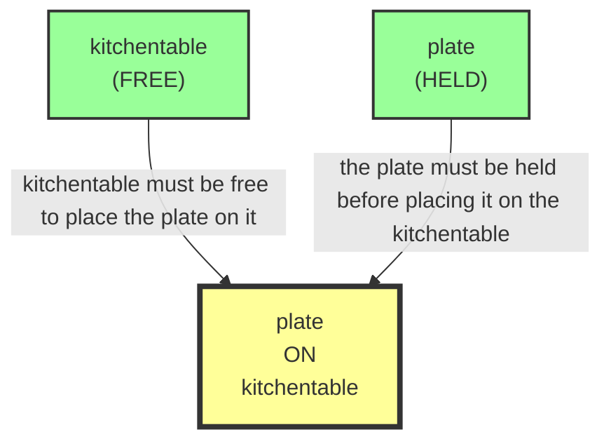
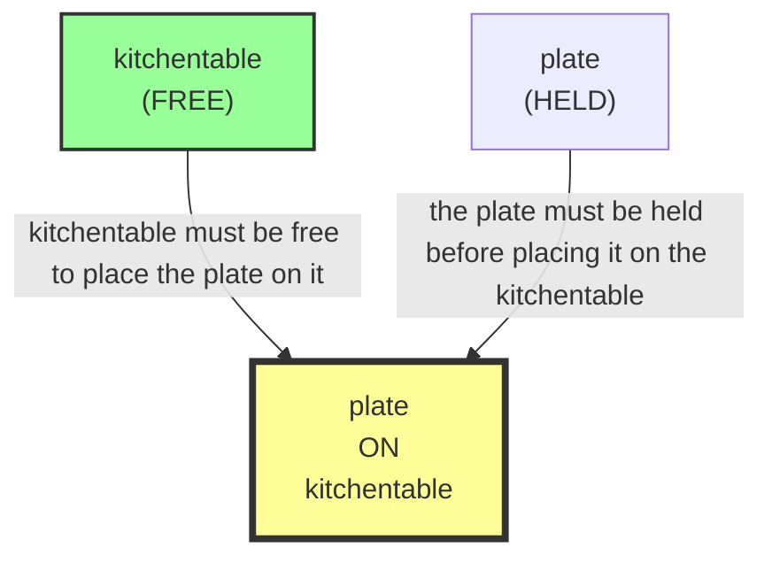
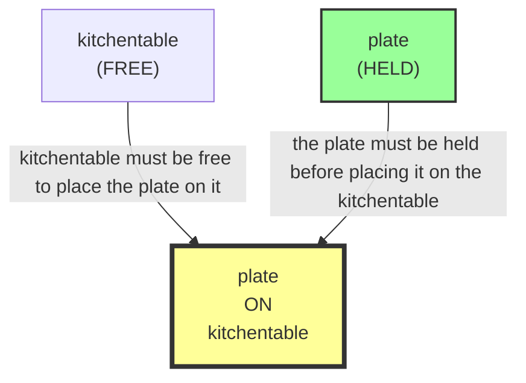

# 🚀 VirtualHome Agent Episode Log


### [GoalReasoner (Module A - Intent)] Output
```json
{
  "is_instruction_obviously_vague": false,
  "clarification_question": null,
  "target_object": "plate",
  "location_hint": "kitchentable",
  "reasoning_chain": [
    {
      "question": "Why does the user want to put the plate on the kitchentable?",
      "answer": "The user wants to put the plate on the kitchentable because they want to clean up after a meal."
    },
    {
      "question": "Why is cleaning up important?",
      "answer": "Cleaning up is important because it maintains a tidy and organized environment."
    },
    {
      "question": "What fundamental need does this fulfill?",
      "answer": "This fulfills the need for cleanliness and order."
    },
    {
      "question": "Are there any deeper psychological or physical motivations?",
      "answer": "No deeper motivations are apparent; the user simply wants to clean up."
    }
  ],
  "deep_intent": "Maintain cleanliness and order",
  "acceptable_alternatives_properties": [
    {
      "priority": 1,
      "description": "Other dishes or plates that need to be cleaned and put away, such as bowls or cups"
    },
    {
      "priority": 2,
      "description": "Cleaning supplies or tools, such as a sponge or dish soap, to aid in the cleaning process"
    },
    {
      "priority": 3,
      "description": "A trash can or recycling bin to dispose of any waste or packaging"
    },
    {
      "priority": 4,
      "description": "A broom or dustpan to sweep the floor and maintain a tidy environment"
    }
  ]
}
```

### [PerceptionFilter] Output
```json
{
  "reasoning": "To achieve the goal of maintaining cleanliness and order, we need to select the minimum number of object classes required to put a plate on the kitchentable and clean up after a meal. This includes the target object class 'plate', the location 'kitchentable', and the necessary tools and receptacles for cleaning and disposal.",
  "selected_classes": [
    "plate",
    "dustpan",
    "broom",
    "kitchentable",
    "sink",
    "floor",
    "dish soap",
    "trash can",
    "sponge",
    "dishbowl",
    "character"
  ],
  "raw_class_count": 50
}
```

### [LLMExecutor] Output
```json
{
  "reasoning": "The current goal is to put the plate on the kitchentable. The plate is already held, and the kitchentable is free. To satisfy the goal, we need to place the plate on the kitchentable.",
  "satisfied_nodes": [
    "N1",
    "N3"
  ],
  "current_node_focus": "N2",
  "mapped_variables": {
    "?Washer": "kitchentable(135)"
  },
  "action": "[putback] <plate> (75) <kitchentable> (135)"
}
```

### [RoboStateMultiTaskController] Output
```json
{
  "action": "[grab] <plate> (75)",
  "active_task_id": "task_1",
  "task_context": {
    "active_task_id": "task_1",
    "pending_task_ids": [],
    "satisfied_task_ids": []
  },
  "source": "llm_executor_repaired"
}
```
## Step 0
- **Action**: `[grab] <plate> (75)`
- **Action Success**: `True`
- **Action Message**: {'0': {'message': 'Success'}}
- **Active Task**: `task_1`
- **Decision Source**: `llm_executor_repaired`
- **Task Progress**: T4_llama_M4_18=pending
- **SDG Status**:

- **Observed Items (36)**: floor(22), floor(23), floor(24), floor(25), floor(26), floor(27), floor(28), floor(29), floor(30), floor(31), floor(32), floor(33), plate(75), plate(76), plate(83)...


### [PerceptionFilter] Output
```json
{
  "reasoning": "Reused cached class selection.",
  "selected_classes": [
    "plate",
    "dustpan",
    "broom",
    "kitchentable",
    "sink",
    "floor",
    "dish soap",
    "trash can",
    "sponge",
    "dishbowl",
    "character"
  ],
  "raw_class_count": 50
}
```

### [LLMExecutor] Output
```json
{
  "reasoning": "The plate is currently held by the character and needs to be placed on the kitchentable. The kitchentable is free and the plate is held, so the next action is to place the plate on the kitchentable.",
  "satisfied_nodes": [
    "N3"
  ],
  "current_node_focus": "N2",
  "mapped_variables": {
    "?Plate": "plate(75)"
  },
  "action": "[putback] <plate> (75) <kitchentable> (131)"
}
```

### [RoboStateMultiTaskController] Output
```json
{
  "action": "[putback] <plate> (75) <kitchentable> (131)",
  "active_task_id": "task_1",
  "task_context": {
    "active_task_id": "task_1",
    "pending_task_ids": [],
    "satisfied_task_ids": []
  },
  "source": "llm_executor"
}
```
## Step 1
- **Action**: `[putback] <plate> (75) <kitchentable> (131)`
- **Action Success**: `True`
- **Action Message**: {'0': {'message': 'Success'}}
- **Active Task**: `task_1`
- **Decision Source**: `llm_executor`
- **Task Progress**: T4_llama_M4_18=pending
- **SDG Status**:

- **Observed Items (36)**: floor(22), floor(23), floor(24), floor(25), floor(26), floor(27), floor(28), floor(29), floor(30), floor(31), floor(32), floor(33), plate(75), plate(76), plate(83)...


### [PerceptionFilter] Output
```json
{
  "reasoning": "Reused cached class selection.",
  "selected_classes": [
    "plate",
    "dustpan",
    "broom",
    "kitchentable",
    "sink",
    "floor",
    "dish soap",
    "trash can",
    "sponge",
    "dishbowl",
    "character"
  ],
  "raw_class_count": 50
}
```

### [LLMExecutor] Output
```json
{
  "reasoning": "The current goal is to put the plate on the kitchentable. The plate is currently held and the kitchentable is free. The next step is to put the plate on the kitchentable.",
  "satisfied_nodes": [
    "N1"
  ],
  "current_node_focus": "N2",
  "mapped_variables": {
    "?Plate": "plate(75)"
  },
  "action": "[putback] <plate(75)> <kitchentable(131)>"
}
```

### [RoboStateMultiTaskController] Output
```json
{
  "action": "[walk] <livingroom> (183)",
  "active_task_id": null,
  "task_context": {
    "active_task_id": null,
    "pending_task_ids": [
      "task_1"
    ],
    "satisfied_task_ids": []
  },
  "source": "loop_recovery_room_revisit"
}
```
## Step 2
- **Action**: `[walk] <livingroom> (183)`
- **Action Success**: `True`
- **Action Message**: {'0': {'message': 'Success'}}
- **Decision Source**: `loop_recovery_room_revisit`
- **Task Progress**: T4_llama_M4_18=pending
- **SDG Status**:
No SDG active.
- **Observed Items (159)**: wall(12), wall(13), wall(14), wall(15), wall(16), wall(17), wall(18), wall(19), wall(20), wall(21), floor(22), floor(23), floor(24), floor(25), floor(26)...


### [PerceptionFilter] Output
```json
{
  "reasoning": "To maintain cleanliness and order, we need to select the minimum number of object classes necessary to achieve this goal. We must include the target object class 'plate' and its required tools and locations. The SDG and Goal Intent imply that we need to clean up after a meal, which requires a sponge or dish soap, and a trash can or recycling bin to dispose of waste. We also need to include the kitchentable as the location where the plate will be placed.",
  "selected_classes": [
    "dishsoap",
    "plate",
    "recyclingbin",
    "kitchentable",
    "floor",
    "sponge",
    "trashcan",
    "character"
  ],
  "raw_class_count": 59
}
```

### [LLMExecutor] Output
```json
{
  "reasoning": "To satisfy the current goal, we need to put the plate on the kitchentable. The plate is currently held, and the kitchentable is free. We will use the plate(75) instance, which is the one that matches the SDG requirements.",
  "satisfied_nodes": [
    "N1"
  ],
  "current_node_focus": "N2",
  "mapped_variables": {
    "?Plate": "plate(75)"
  },
  "action": "[putback] <plate> (75) <kitchentable> (131)"
}
```

### [RoboStateMultiTaskController] Output
```json
{
  "action": "[grab] <plate> (75)",
  "active_task_id": "task_1",
  "task_context": {
    "active_task_id": "task_1",
    "pending_task_ids": [],
    "satisfied_task_ids": []
  },
  "source": "llm_executor_repaired"
}
```
## Step 3
- **Action**: `[grab] <plate> (75)`
- **Action Success**: `True`
- **Action Message**: {'0': {'message': 'Success'}}
- **Active Task**: `task_1`
- **Decision Source**: `llm_executor_repaired`
- **Task Progress**: T4_llama_M4_18=pending
- **SDG Status**:

- **Observed Items (37)**: floor(22), floor(23), floor(24), floor(25), floor(26), floor(27), floor(28), floor(29), floor(30), floor(31), floor(32), floor(33), plate(75), plate(76), plate(83)...


### [PerceptionFilter] Output
```json
{
  "reasoning": "Reused cached class selection.",
  "selected_classes": [
    "dishsoap",
    "plate",
    "recyclingbin",
    "kitchentable",
    "floor",
    "sponge",
    "trashcan",
    "character"
  ],
  "raw_class_count": 59
}
```

### [LLMExecutor] Output
```json
{
  "reasoning": "The goal is to put the plate on the kitchentable. The plate is currently held by the character. To put the plate on the kitchentable, the character must be near the kitchentable. The kitchentable is currently free. I will walk to the kitchentable to place the plate on it.",
  "satisfied_nodes": [
    "N1",
    "N3"
  ],
  "current_node_focus": "N2",
  "mapped_variables": {
    "?Washer": "plate(75)"
  },
  "action": "[walk] <kitchentable> (131)"
}
```

### [RoboStateMultiTaskController] Output
```json
{
  "action": "[walk] <kitchentable> (131)",
  "active_task_id": "task_1",
  "task_context": {
    "active_task_id": "task_1",
    "pending_task_ids": [],
    "satisfied_task_ids": []
  },
  "source": "llm_executor"
}
```
## Step 4
- **Action**: `[walk] <kitchentable> (131)`
- **Action Success**: `True`
- **Action Message**: {'0': {'message': 'Success'}}
- **Active Task**: `task_1`
- **Decision Source**: `llm_executor`
- **Task Progress**: T4_llama_M4_18=pending
- **SDG Status**:

- **Observed Items (37)**: floor(22), floor(23), floor(24), floor(25), floor(26), floor(27), floor(28), floor(29), floor(30), floor(31), floor(32), floor(33), plate(75), plate(76), plate(83)...


### [PerceptionFilter] Output
```json
{
  "reasoning": "Reused cached class selection.",
  "selected_classes": [
    "dishsoap",
    "plate",
    "recyclingbin",
    "kitchentable",
    "floor",
    "sponge",
    "trashcan",
    "character"
  ],
  "raw_class_count": 59
}
```

### [LLMExecutor] Output
```json
{
  "reasoning": "The current goal is to put the plate on the kitchentable. The plate is currently held by the character, and the kitchentable is free. To put the plate on the kitchentable, we need to walk to the kitchentable and then put the plate on it.",
  "satisfied_nodes": [
    "N1"
  ],
  "current_node_focus": "N2",
  "mapped_variables": {
    "?Washer": "sink(99)"
  },
  "action": "[walk] <kitchentable> (131)"
}
```

### [RoboStateMultiTaskController] Output
```json
{
  "action": "[walk] <kitchentable> (131)",
  "active_task_id": "task_1",
  "task_context": {
    "active_task_id": "task_1",
    "pending_task_ids": [],
    "satisfied_task_ids": []
  },
  "source": "llm_executor"
}
```
## Step 5
- **Action**: `[walk] <kitchentable> (131)`
- **Action Success**: `True`
- **Action Message**: {'0': {'message': 'Success'}}
- **Active Task**: `task_1`
- **Decision Source**: `llm_executor`
- **Task Progress**: T4_llama_M4_18=pending
- **SDG Status**:

- **Observed Items (37)**: floor(22), floor(23), floor(24), floor(25), floor(26), floor(27), floor(28), floor(29), floor(30), floor(31), floor(32), floor(33), plate(75), plate(76), plate(83)...


### [PerceptionFilter] Output
```json
{
  "reasoning": "Reused cached class selection.",
  "selected_classes": [
    "dishsoap",
    "plate",
    "recyclingbin",
    "kitchentable",
    "floor",
    "sponge",
    "trashcan",
    "character"
  ],
  "raw_class_count": 59
}
```

### [LLMExecutor] Output
```json
{
  "reasoning": "To satisfy the goal intent of putting the plate on the kitchentable, I need to grab the plate and walk to the kitchentable. Since I'm currently holding the plate, I can directly walk to the kitchentable.",
  "satisfied_nodes": [
    "N1"
  ],
  "current_node_focus": "N2",
  "mapped_variables": {
    "?Washer": "sink(99)"
  },
  "action": "[walk] <kitchentable> (131)"
}
```

### [RoboStateMultiTaskController] Output
```json
{
  "action": "[walk] <bedroom> (241)",
  "active_task_id": null,
  "task_context": {
    "active_task_id": null,
    "pending_task_ids": [
      "task_1"
    ],
    "satisfied_task_ids": []
  },
  "source": "loop_recovery_room_revisit"
}
```
## Step 6
- **Action**: `[walk] <bedroom> (241)`
- **Action Success**: `True`
- **Action Message**: {'0': {'message': 'Success'}}
- **Decision Source**: `loop_recovery_room_revisit`
- **Task Progress**: T4_llama_M4_18=pending
- **SDG Status**:
No SDG active.
- **Observed Items (211)**: wall(12), wall(13), wall(14), wall(15), wall(16), wall(17), wall(18), wall(19), wall(20), wall(21), floor(22), floor(23), floor(24), floor(25), floor(26)...


### [PerceptionFilter] Output
```json
{
  "reasoning": "The selected object classes are necessary to achieve the goal of maintaining cleanliness and order by cleaning up after a meal. The target object is the plate, and the location is the kitchentable. The acceptable alternatives include other dishes or plates, cleaning supplies, a trash can, and a broom. The SDG requires the plate to be held and placed on the kitchentable, which must be free. The observed object classes include the plate, kitchentable, and other relevant objects.",
  "selected_classes": [
    "plate",
    "dustpan",
    "cup",
    "kitchentable",
    "broom",
    "floor",
    "dish soap",
    "trash can",
    "sponge",
    "dishbowl",
    "character"
  ],
  "raw_class_count": 65
}
```

### [LLMExecutor] Output
```json
{
  "reasoning": "The current goal is to put the plate on the kitchentable, and the plate is already held. The kitchentable is free and the plate is not on it yet. Therefore, the next action should be to walk to the kitchentable.",
  "satisfied_nodes": [
    "N1",
    "N3"
  ],
  "current_node_focus": "N2",
  "mapped_variables": {
    "?Washer": "sink(99)"
  },
  "action": "[walk] <kitchentable> (131)"
}
```

### [RoboStateMultiTaskController] Output
```json
{
  "action": "[walk] <kitchentable> (131)",
  "active_task_id": "task_1",
  "task_context": {
    "active_task_id": "task_1",
    "pending_task_ids": [],
    "satisfied_task_ids": []
  },
  "source": "llm_executor"
}
```
## Step 7
- **Action**: `[walk] <kitchentable> (131)`
- **Action Success**: `True`
- **Action Message**: {'0': {'message': 'Success'}}
- **Active Task**: `task_1`
- **Decision Source**: `llm_executor`
- **Task Progress**: T4_llama_M4_18=pending
- **SDG Status**:

- **Observed Items (48)**: floor(22), floor(23), floor(24), floor(25), floor(26), floor(27), floor(28), floor(29), floor(30), floor(31), floor(32), floor(33), plate(75), plate(76), plate(83)...


### [PerceptionFilter] Output
```json
{
  "reasoning": "Reused cached class selection.",
  "selected_classes": [
    "plate",
    "dustpan",
    "cup",
    "kitchentable",
    "broom",
    "floor",
    "dish soap",
    "trash can",
    "sponge",
    "dishbowl",
    "character"
  ],
  "raw_class_count": 65
}
```

### [LLMExecutor] Output
```json
{
  "reasoning": "To satisfy the current goal, I need to place the plate on the kitchentable. Since the kitchentable is already free, I can directly place the plate on it.",
  "satisfied_nodes": [
    "N3"
  ],
  "current_node_focus": "N2",
  "mapped_variables": {
    "?Plate": "plate(75)"
  },
  "action": "[putback] <plate(75)> <kitchentable(131)>"
}
```

### [RoboStateMultiTaskController] Output
```json
{
  "action": "[walk] <bathroom> (285)",
  "active_task_id": null,
  "task_context": {
    "active_task_id": null,
    "pending_task_ids": [
      "task_1"
    ],
    "satisfied_task_ids": []
  },
  "source": "loop_recovery_room_revisit"
}
```
## Step 8
- **Action**: `[walk] <bathroom> (285)`
- **Action Success**: `True`
- **Action Message**: {'0': {'message': 'Success'}}
- **Decision Source**: `loop_recovery_room_revisit`
- **Task Progress**: T4_llama_M4_18=pending
- **SDG Status**:
No SDG active.
- **Observed Items (243)**: wall(12), wall(13), wall(14), wall(15), wall(16), wall(17), wall(18), wall(19), wall(20), wall(21), floor(22), floor(23), floor(24), floor(25), floor(26)...


### [PerceptionFilter] Output
```json
{
  "reasoning": "To achieve the goal of maintaining cleanliness and order, we need to select the minimum number of object classes necessary to put a plate on the kitchentable, clean up after a meal, and dispose of waste. We must include the target object class 'plate', the location 'kitchentable', and alternative tools such as 'dishbowl' and 'sponge' for cleaning. We also need to include a 'trash can' for disposing of waste and a 'broom' for sweeping the floor.",
  "selected_classes": [
    "plate",
    "broom",
    "kitchentable",
    "floor",
    "sponge",
    "barsoap",
    "dishbowl",
    "trashcan",
    "character"
  ],
  "raw_class_count": 81
}
```

### [LLMExecutor] Output
```json
{
  "reasoning": "To satisfy the current goal, I need to put the plate on the kitchentable. The plate is currently held by the robot, and the kitchentable is free. I will use the [putback] action to put the plate on the kitchentable.",
  "satisfied_nodes": [
    "N1"
  ],
  "current_node_focus": "N2",
  "mapped_variables": {
    "?Plate": "plate(75)"
  },
  "action": "[putback] <plate> (75) <kitchentable> (131)"
}
```

### [RoboStateMultiTaskController] Output
```json
{
  "action": "[putback] <plate> (75) <kitchentable> (131)",
  "active_task_id": "task_1",
  "task_context": {
    "active_task_id": "task_1",
    "pending_task_ids": [],
    "satisfied_task_ids": []
  },
  "source": "llm_executor"
}
```
## Step 9
- **Action**: `[putback] <plate> (75) <kitchentable> (131)`
- **Action Success**: `True`
- **Action Message**: {'0': {'message': 'Success'}}
- **Active Task**: `task_1`
- **Decision Source**: `llm_executor`
- **Task Progress**: T4_llama_M4_18=pending
- **SDG Status**:

- **Observed Items (56)**: floor(22), floor(23), floor(24), floor(25), floor(26), floor(27), floor(28), floor(29), floor(30), floor(31), floor(32), floor(33), plate(75), plate(76), plate(83)...


### [PerceptionFilter] Output
```json
{
  "reasoning": "Reused cached class selection.",
  "selected_classes": [
    "plate",
    "broom",
    "kitchentable",
    "floor",
    "sponge",
    "barsoap",
    "dishbowl",
    "trashcan",
    "character"
  ],
  "raw_class_count": 81
}
```

### [LLMExecutor] Output
```json
{
  "reasoning": "To satisfy the goal intent of putting the plate on the kitchentable, we need to ensure the kitchentable is free. Currently, the kitchentable is not free because it is occupied by the character. The character is currently closing the kitchentable, but we can't wait for the character to finish. Therefore, we need to grab the plate and put it back on the kitchentable.",
  "satisfied_nodes": [
    "N1"
  ],
  "current_node_focus": "N2",
  "mapped_variables": {
    "?Plate": "plate(75)"
  },
  "action": "[grab] <plate> (75)"
}
```

### [RoboStateMultiTaskController] Output
```json
{
  "action": "[grab] <plate> (75)",
  "active_task_id": "task_1",
  "task_context": {
    "active_task_id": "task_1",
    "pending_task_ids": [],
    "satisfied_task_ids": []
  },
  "source": "llm_executor"
}
```
## Step 10
- **Action**: `[grab] <plate> (75)`
- **Action Success**: `True`
- **Action Message**: {'0': {'message': 'Success'}}
- **Active Task**: `task_1`
- **Decision Source**: `llm_executor`
- **Task Progress**: T4_llama_M4_18=pending
- **SDG Status**:

- **Observed Items (56)**: floor(22), floor(23), floor(24), floor(25), floor(26), floor(27), floor(28), floor(29), floor(30), floor(31), floor(32), floor(33), plate(75), plate(76), plate(83)...


### [PerceptionFilter] Output
```json
{
  "reasoning": "Reused cached class selection.",
  "selected_classes": [
    "plate",
    "broom",
    "kitchentable",
    "floor",
    "sponge",
    "barsoap",
    "dishbowl",
    "trashcan",
    "character"
  ],
  "raw_class_count": 81
}
```

### [LLMExecutor] Output
```json
{
  "reasoning": "The plate is currently held by the character and needs to be placed on the kitchentable. The kitchentable is free and in the kitchen.",
  "satisfied_nodes": [
    "N3"
  ],
  "current_node_focus": "N2",
  "mapped_variables": {
    "?Plate": "plate(75)",
    "?Kitchentable": "kitchentable(131)"
  },
  "action": "[putback] <plate(75)> <kitchentable(131)>"
}
```

### [RoboStateMultiTaskController] Output
```json
{
  "action": "[walk] <bedroom> (346)",
  "active_task_id": null,
  "task_context": {
    "active_task_id": null,
    "pending_task_ids": [
      "task_1"
    ],
    "satisfied_task_ids": []
  },
  "source": "loop_recovery_room_revisit"
}
```
## Step 11
- **Action**: `[walk] <bedroom> (346)`
- **Action Success**: `True`
- **Action Message**: {'0': {'message': 'Success'}}
- **Decision Source**: `loop_recovery_room_revisit`
- **Task Progress**: T4_llama_M4_18=pending
- **SDG Status**:
No SDG active.
- **Observed Items (303)**: wall(12), wall(13), wall(14), wall(15), wall(16), wall(17), wall(18), wall(19), wall(20), wall(21), floor(22), floor(23), floor(24), floor(25), floor(26)...


### [PerceptionFilter] Output
```json
{
  "reasoning": "To achieve the goal of maintaining cleanliness and order, we need to select the minimum number of object classes required to put a plate on the kitchentable, clean up after a meal, and maintain a tidy environment. This includes the target object class 'plate', the location 'kitchentable', and alternative tools and physical backups such as 'dishbowl', 'dishwasher', 'sponge', and 'trash can'.",
  "selected_classes": [
    "plate",
    "kitchentable",
    "floor",
    "trash can",
    "sponge",
    "dishwasher",
    "dishbowl",
    "character"
  ],
  "raw_class_count": 91
}
```

### [LLMExecutor] Output
```json
{
  "reasoning": "To satisfy the current goal, the plate must be placed on the kitchentable. The kitchentable is currently free, and the plate is being held. Therefore, the next action is to put the plate on the kitchentable.",
  "satisfied_nodes": [
    "N1"
  ],
  "current_node_focus": "N2",
  "mapped_variables": {
    "?Plate": "plate(75)"
  },
  "action": "[putback] <plate(75)> <kitchentable(131)>"
}
```

### [RoboStateMultiTaskController] Output
```json
{
  "action": "[walk] <livingroom> (183)",
  "active_task_id": null,
  "task_context": {
    "active_task_id": null,
    "pending_task_ids": [
      "task_1"
    ],
    "satisfied_task_ids": []
  },
  "source": "loop_recovery_room_revisit"
}
```
## Step 12
- **Action**: `[walk] <livingroom> (183)`
- **Action Success**: `True`
- **Action Message**: {'0': {'message': 'Success'}}
- **Decision Source**: `loop_recovery_room_revisit`
- **Task Progress**: T4_llama_M4_18=pending
- **SDG Status**:
No SDG active.
- **Observed Items (361)**: wall(12), wall(13), wall(14), wall(15), wall(16), wall(17), wall(18), wall(19), wall(20), wall(21), floor(22), floor(23), floor(24), floor(25), floor(26)...


### [PerceptionFilter] Output
```json
{
  "reasoning": "Reused cached class selection.",
  "selected_classes": [
    "plate",
    "kitchentable",
    "floor",
    "trash can",
    "sponge",
    "dishwasher",
    "dishbowl",
    "character"
  ],
  "raw_class_count": 91
}
```

### [LLMExecutor] Output
```json
{
  "reasoning": "The current goal is to put the plate on the kitchentable. The plate is currently held by the robot, and the kitchentable is free. The next step is to place the plate on the kitchentable.",
  "satisfied_nodes": [
    "N1"
  ],
  "current_node_focus": "N2",
  "mapped_variables": {
    "?Plate": "plate(75)"
  },
  "action": "[putback] <plate> (75) <kitchentable> (131)"
}
```

### [RoboStateMultiTaskController] Output
```json
{
  "action": "[putback] <plate> (75) <kitchentable> (131)",
  "active_task_id": "task_1",
  "task_context": {
    "active_task_id": "task_1",
    "pending_task_ids": [],
    "satisfied_task_ids": []
  },
  "source": "llm_executor"
}
```
## Step 13
- **Action**: `[putback] <plate> (75) <kitchentable> (131)`
- **Action Success**: `True`
- **Action Message**: {'0': {'message': 'Success'}}
- **Active Task**: `task_1`
- **Decision Source**: `llm_executor`
- **Task Progress**: T4_llama_M4_18=pending
- **SDG Status**:

- **Observed Items (66)**: floor(22), floor(23), floor(24), floor(25), floor(26), floor(27), floor(28), floor(29), floor(30), floor(31), floor(32), floor(33), plate(75), plate(76), plate(83)...


### [PerceptionFilter] Output
```json
{
  "reasoning": "Reused cached class selection.",
  "selected_classes": [
    "plate",
    "kitchentable",
    "floor",
    "trash can",
    "sponge",
    "dishwasher",
    "dishbowl",
    "character"
  ],
  "raw_class_count": 91
}
```

### [LLMExecutor] Output
```json
{
  "reasoning": "The plate is currently held by the robot, and the kitchentable is free. The next step is to place the plate on the kitchentable.",
  "satisfied_nodes": [
    "N1"
  ],
  "current_node_focus": "N2",
  "mapped_variables": {
    "?Plate": "plate(75)"
  },
  "action": "[putback] <plate(75)> <kitchentable(131)>"
}
```

### [RoboStateMultiTaskController] Output
```json
{
  "action": "[walk] <bedroom> (241)",
  "active_task_id": null,
  "task_context": {
    "active_task_id": null,
    "pending_task_ids": [
      "task_1"
    ],
    "satisfied_task_ids": []
  },
  "source": "loop_recovery_room_revisit"
}
```
## Step 14
- **Action**: `[walk] <bedroom> (241)`
- **Action Success**: `True`
- **Action Message**: {'0': {'message': 'Success'}}
- **Decision Source**: `loop_recovery_room_revisit`
- **Task Progress**: T4_llama_M4_18=pending
- **SDG Status**:
No SDG active.
- **Observed Items (361)**: wall(12), wall(13), wall(14), wall(15), wall(16), wall(17), wall(18), wall(19), wall(20), wall(21), floor(22), floor(23), floor(24), floor(25), floor(26)...

