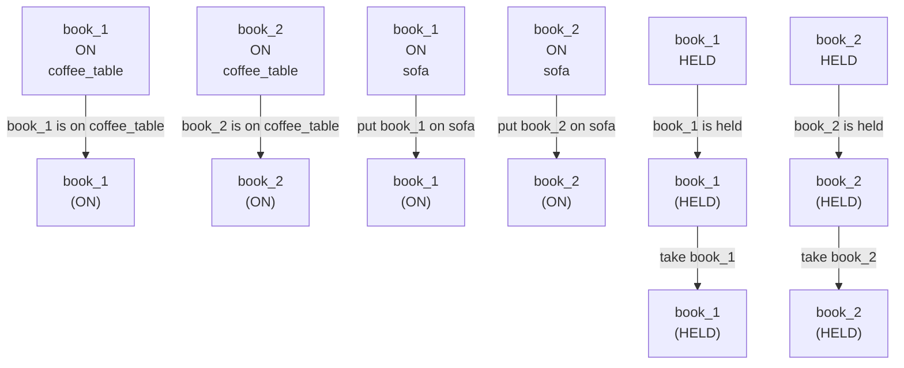
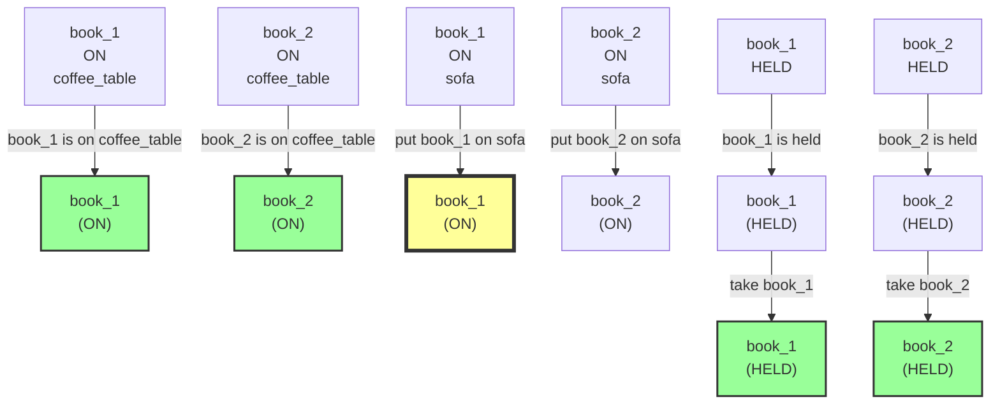
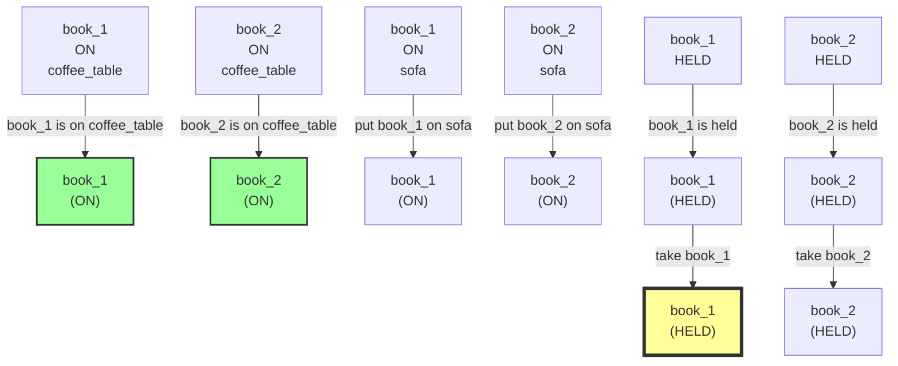
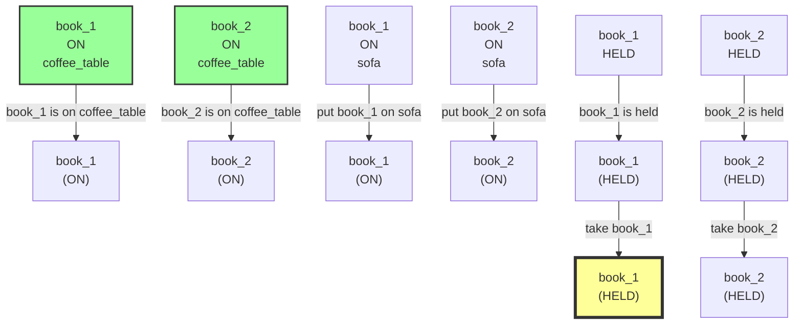
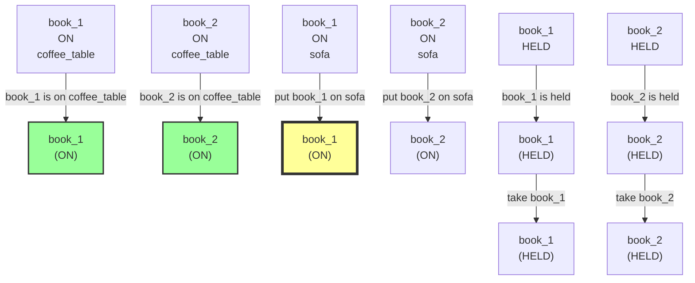
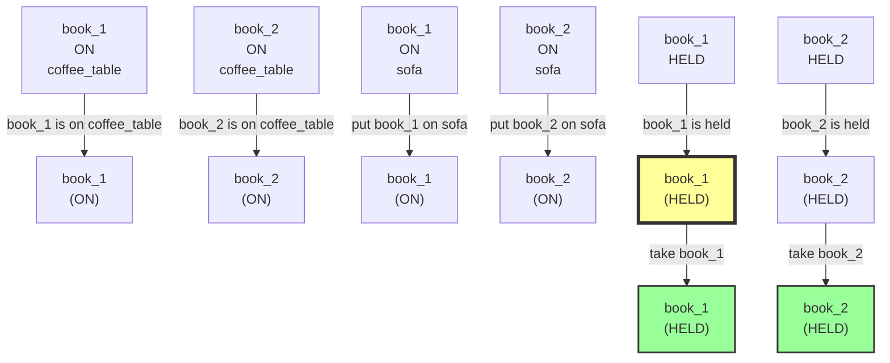
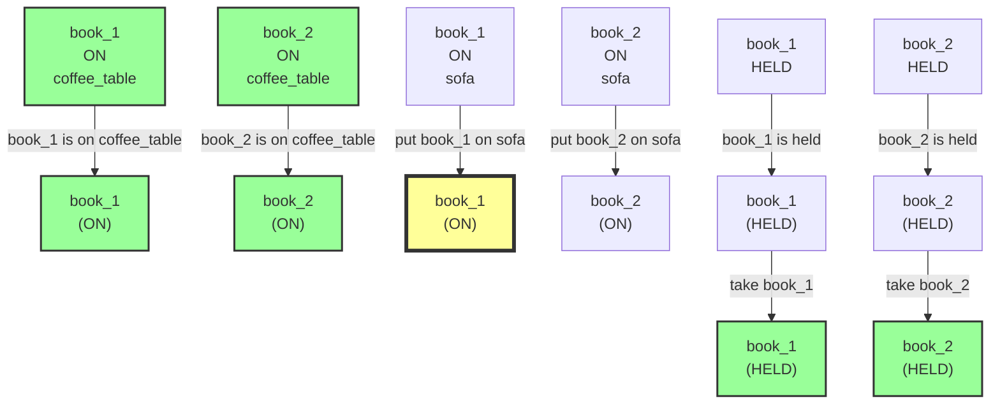
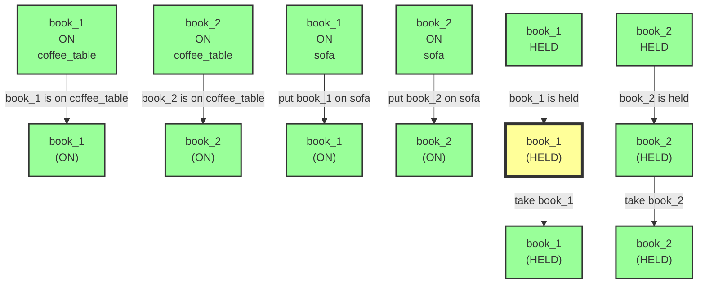
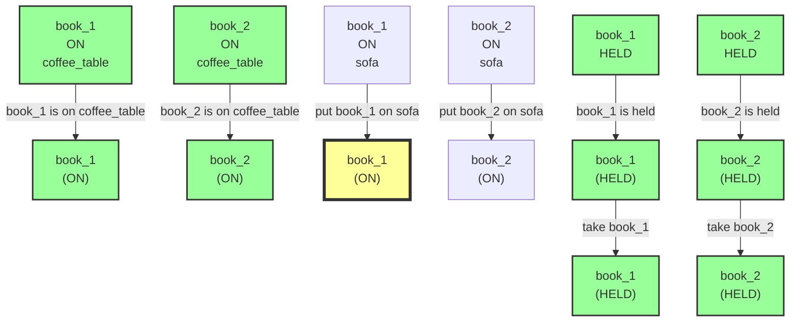

# 🚀 VirtualHome Agent Episode Log


### [GoalReasoner (Module A - Intent)] Output
```json
{
  "is_instruction_obviously_vague": false,
  "clarification_question": null,
  "target_object": "books",
  "location_hint": "coffee table",
  "reasoning_chain": [
    {
      "question": "Why does the user want to take the books to the sofa?",
      "answer": "The user wants to move the books to a different location."
    },
    {
      "question": "Why is that important?",
      "answer": "The user likely wants to read or use the books in a more comfortable position."
    },
    {
      "question": "What fundamental need does this fulfill?",
      "answer": "The user wants to access or utilize the books."
    },
    {
      "question": "Are there any deeper psychological or physical motivations?",
      "answer": "The user likely wants to relax or engage with the books in a more leisurely setting."
    }
  ],
  "deep_intent": "access or utilize the books",
  "acceptable_alternatives_properties": [
    {
      "priority": 1,
      "description": "Other books or reading materials, such as magazines or documents"
    },
    {
      "priority": 2,
      "description": "Items that can be placed on a sofa, such as decorative objects or remote controls"
    },
    {
      "priority": 3,
      "description": "Objects that need to be moved from one location to another, such as toys or household items"
    },
    {
      "priority": 4,
      "description": "Items that can be used for leisure or relaxation, such as a blanket or a pillow"
    }
  ]
}
```

### [RoboStateMultiTaskController] Output
```json
{
  "action": "[walk] <bathroom> (11)",
  "active_task_id": "task_1",
  "task_context": {
    "active_task_id": "task_1",
    "pending_task_ids": [],
    "satisfied_task_ids": []
  },
  "source": "room_frontier"
}
```
## Step 0
- **Action**: `[walk] <bathroom> (11)`
- **Action Success**: `True`
- **Action Message**: {'0': {'message': 'Success'}}
- **Active Task**: `task_1`
- **Decision Source**: `room_frontier`
- **Task Progress**: T4_llama_P2_10=pending
- **SDG Status**:

- **Observed Items (79)**: floor(336), floor(337), floor(338), floor(339), floor(340), floor(341), floor(342), floor(343), floor(344), wall(345), wall(346), wall(347), wall(348), wall(349), wall(350)...


### [RoboStateMultiTaskController] Output
```json
{
  "action": "[walk] <bedroom> (73)",
  "active_task_id": "task_1",
  "task_context": {
    "active_task_id": "task_1",
    "pending_task_ids": [],
    "satisfied_task_ids": []
  },
  "source": "room_frontier"
}
```
## Step 1
- **Action**: `[walk] <bedroom> (73)`
- **Action Success**: `True`
- **Action Message**: {'0': {'message': 'Success'}}
- **Active Task**: `task_1`
- **Decision Source**: `room_frontier`
- **Task Progress**: T4_llama_P2_10=pending
- **SDG Status**:

- **Observed Items (140)**: floor(336), floor(337), floor(338), floor(339), floor(340), floor(341), floor(342), floor(343), floor(344), wall(345), wall(346), wall(347), wall(348), wall(349), wall(350)...


### [PerceptionFilter] Output
```json
{
  "reasoning": "The goal is to access or utilize the books, which requires moving them from the coffee table to the sofa. To achieve this, we need to select the book class, the sofa class, and the coffee table class. Additionally, we need to include the bookshelf class as it is implied by the Global Intent that the books are being moved from one location to another. We also need to include the cup class as it is a potential alternative for holding the books.",
  "selected_classes": [
    "pillow",
    "bookshelf",
    "cup",
    "book",
    "coffee_table",
    "sofa",
    "character"
  ],
  "raw_class_count": 70
}
```

### [LLMExecutor] Output
```json
{
  "reasoning": "To satisfy the goal intent of accessing or utilizing the books, we need to move the books from the coffee table to the sofa. The current filtered graph shows that the books are on the coffee table, and we need to take them to the sofa. We have two books, book_1 and book_2, and we need to move them both to the sofa. We will start by taking book_1 to the sofa.",
  "satisfied_nodes": [
    "N1",
    "N2",
    "N3",
    "N4"
  ],
  "current_node_focus": "N5",
  "mapped_variables": {
    "?book": "book_1"
  },
  "action": "[walk] <sofa> (368)"
}
```

### [RoboStateMultiTaskController] Output
```json
{
  "action": "[walk] <sofa> (368)",
  "active_task_id": "task_1",
  "task_context": {
    "active_task_id": "task_1",
    "pending_task_ids": [],
    "satisfied_task_ids": []
  },
  "source": "llm_executor"
}
```
## Step 2
- **Action**: `[walk] <sofa> (368)`
- **Action Success**: `True`
- **Action Message**: {'0': {'message': 'Success'}}
- **Active Task**: `task_1`
- **Decision Source**: `llm_executor`
- **Task Progress**: T4_llama_P2_10=pending
- **SDG Status**:

- **Observed Items (14)**: sofa(368), bookshelf(370), pillow(421), pillow(422), character(1), bathroom(11), bedroom(73), kitchen(205), livingroom(335), bookshelf(105), pillow(186), pillow(187), book(190) [CLOSED], book(191) [CLOSED]


### [PerceptionFilter] Output
```json
{
  "reasoning": "Reused cached class selection.",
  "selected_classes": [
    "pillow",
    "bookshelf",
    "cup",
    "book",
    "coffee_table",
    "sofa",
    "character"
  ],
  "raw_class_count": 70
}
```

### [LLMExecutor] Output
```json
{
  "reasoning": "The goal is to access or utilize the books. The current filtered graph shows that book_1 and book_2 are on the coffee table. To satisfy the goal, we need to move the books to the sofa. The next action is to grab book_1 and walk to the sofa.",
  "satisfied_nodes": [
    "N3",
    "N4"
  ],
  "current_node_focus": "N5",
  "mapped_variables": {
    "?book": "book_1"
  },
  "action": "[walk] <book_1> (book_1)"
}
```

### [RoboStateMultiTaskController] Output
```json
{
  "action": "[walk] <kitchen> (205)",
  "active_task_id": null,
  "task_context": {
    "active_task_id": null,
    "pending_task_ids": [
      "task_1"
    ],
    "satisfied_task_ids": []
  },
  "source": "loop_recovery_room_revisit"
}
```
## Step 3
- **Action**: `[walk] <kitchen> (205)`
- **Action Success**: `True`
- **Action Message**: {'0': {'message': 'Success'}}
- **Decision Source**: `loop_recovery_room_revisit`
- **Task Progress**: T4_llama_P2_10=pending
- **SDG Status**:
No SDG active.
- **Observed Items (211)**: floor(336), floor(337), floor(338), floor(339), floor(340), floor(341), floor(342), floor(343), floor(344), wall(345), wall(346), wall(347), wall(348), wall(349), wall(350)...


### [PerceptionFilter] Output
```json
{
  "reasoning": "The selected object classes are necessary to achieve the goal of accessing or utilizing the books. The coffee table and sofa are required locations, and the books themselves are the target objects. Alternative tools and backups are not necessary in this case.",
  "selected_classes": [
    "pillow",
    "book",
    "coffee_table",
    "sofa",
    "character"
  ],
  "raw_class_count": 101
}
```

### [LLMExecutor] Output
```json
{
  "reasoning": "To move the books to the sofa, we need to first pick them up from the coffee table. We have two books, book_1 and book_2, and we need to hold them both. We will start by grabbing book_1.",
  "satisfied_nodes": [
    "N3",
    "N4"
  ],
  "current_node_focus": "N1",
  "mapped_variables": {
    "?Book": "book_1(268)"
  },
  "action": "[grab] <book> (268)"
}
```

### [RoboStateMultiTaskController] Output
```json
{
  "action": "[grab] <book> (268)",
  "active_task_id": "task_1",
  "task_context": {
    "active_task_id": "task_1",
    "pending_task_ids": [],
    "satisfied_task_ids": []
  },
  "source": "llm_executor"
}
```
## Step 4
- **Action**: `[grab] <book> (268)`
- **Action Success**: `True`
- **Action Message**: {'0': {'message': 'Success'}}
- **Active Task**: `task_1`
- **Decision Source**: `llm_executor`
- **Task Progress**: T4_llama_P2_10=pending
- **SDG Status**:

- **Observed Items (13)**: sofa(368), pillow(421), pillow(422), character(1), bathroom(11), bedroom(73), kitchen(205), livingroom(335), pillow(186), pillow(187), book(190) [CLOSED], book(191) [CLOSED], book(268) [CLOSED]


### [PerceptionFilter] Output
```json
{
  "reasoning": "Reused cached class selection.",
  "selected_classes": [
    "pillow",
    "book",
    "coffee_table",
    "sofa",
    "character"
  ],
  "raw_class_count": 101
}
```

### [LLMExecutor] Output
```json
{
  "reasoning": "The goal is to access or utilize the books. The current filtered graph shows that book_1 and book_2 are on the coffee table. To satisfy the goal, we need to move the books to the sofa. We can do this by first grabbing the books and then walking to the sofa.",
  "satisfied_nodes": [
    "N3",
    "N4"
  ],
  "current_node_focus": "N5",
  "mapped_variables": {
    "?Book": "book_1"
  },
  "action": "[grab] <book_1> (268)"
}
```

### [RoboStateMultiTaskController] Output
```json
{
  "action": "[walk] <bathroom> (11)",
  "active_task_id": null,
  "task_context": {
    "active_task_id": null,
    "pending_task_ids": [
      "task_1"
    ],
    "satisfied_task_ids": []
  },
  "source": "loop_recovery_room_revisit"
}
```
## Step 5
- **Action**: `[walk] <bathroom> (11)`
- **Action Success**: `True`
- **Action Message**: {'0': {'message': 'Success'}}
- **Decision Source**: `loop_recovery_room_revisit`
- **Task Progress**: T4_llama_P2_10=pending
- **SDG Status**:
No SDG active.
- **Observed Items (318)**: floor(336), floor(337), floor(338), floor(339), floor(340), floor(341), floor(342), floor(343), floor(344), wall(345), wall(346), wall(347), wall(348), wall(349), wall(350)...


### [PerceptionFilter] Output
```json
{
  "reasoning": "Reused cached class selection.",
  "selected_classes": [
    "pillow",
    "book",
    "coffee_table",
    "sofa",
    "character"
  ],
  "raw_class_count": 101
}
```

### [LLMExecutor] Output
```json
{
  "reasoning": "To move the books to the sofa, we need to first pick up the books from the coffee table. The current filtered graph shows that book_1 and book_2 are on the coffee table. We will grab book_1 and book_2, and then walk to the sofa to put them down.",
  "satisfied_nodes": [
    "N9",
    "N10"
  ],
  "current_node_focus": "N1",
  "mapped_variables": {
    "?Washer": "sink(10)"
  },
  "action": "[grab] <book> (268)"
}
```

### [RoboStateMultiTaskController] Output
```json
{
  "action": "[grab] <book> (268)",
  "active_task_id": "task_1",
  "task_context": {
    "active_task_id": "task_1",
    "pending_task_ids": [],
    "satisfied_task_ids": []
  },
  "source": "llm_executor"
}
```
## Step 6
- **Action**: `[grab] <book> (268)`
- **Action Success**: `False`
- **Action Message**: {'0': {'message': 'ScriptExcutor 0: EXECUTION_GENERAL: Script is impossible to execute\n\n'}}
- **Active Task**: `task_1`
- **Decision Source**: `llm_executor`
- **Task Progress**: T4_llama_P2_10=pending
- **SDG Status**:

- **Observed Items (13)**: sofa(368), pillow(421), pillow(422), character(1), bathroom(11), bedroom(73), kitchen(205), livingroom(335), pillow(186), pillow(187), book(190) [CLOSED], book(191) [CLOSED], book(268) [CLOSED]


### [PerceptionFilter] Output
```json
{
  "reasoning": "Reused cached class selection.",
  "selected_classes": [
    "pillow",
    "book",
    "coffee_table",
    "sofa",
    "character"
  ],
  "raw_class_count": 101
}
```

### [LLMExecutor] Output
```json
{
  "reasoning": "The current goal is to access or utilize the books. The SDG requires the books to be on the sofa. The current Filtered Graph shows the books are on the coffee table. To satisfy the SDG, we need to move the books from the coffee table to the sofa.",
  "satisfied_nodes": [
    "N3",
    "N4"
  ],
  "current_node_focus": "N5",
  "mapped_variables": {
    "?Book": "book_1"
  },
  "action": "[walk] <sofa> (368)"
}
```

### [RoboStateMultiTaskController] Output
```json
{
  "action": "[walk] <sofa> (368)",
  "active_task_id": "task_1",
  "task_context": {
    "active_task_id": "task_1",
    "pending_task_ids": [],
    "satisfied_task_ids": []
  },
  "source": "llm_executor"
}
```
## Step 7
- **Action**: `[walk] <sofa> (368)`
- **Action Success**: `True`
- **Action Message**: {'0': {'message': 'Success'}}
- **Active Task**: `task_1`
- **Decision Source**: `llm_executor`
- **Task Progress**: T4_llama_P2_10=pending
- **SDG Status**:

- **Observed Items (13)**: sofa(368), pillow(421), pillow(422), character(1), bathroom(11), bedroom(73), kitchen(205), livingroom(335), pillow(186), pillow(187), book(190) [CLOSED], book(191) [CLOSED], book(268) [CLOSED]


### [PerceptionFilter] Output
```json
{
  "reasoning": "Reused cached class selection.",
  "selected_classes": [
    "pillow",
    "book",
    "coffee_table",
    "sofa",
    "character"
  ],
  "raw_class_count": 101
}
```

### [LLMExecutor] Output
```json
{
  "reasoning": "The goal is to access or utilize the books. The current state gap is that the books are not on the sofa. The next action is to grab the book that is currently held by the character.",
  "satisfied_nodes": [
    "N1",
    "N2"
  ],
  "current_node_focus": "N7",
  "mapped_variables": {
    "?book": "book(268)"
  },
  "action": "[grab] <book> (268)"
}
```

### [RoboStateMultiTaskController] Output
```json
{
  "action": "[grab] <book> (268)",
  "active_task_id": "task_1",
  "task_context": {
    "active_task_id": "task_1",
    "pending_task_ids": [],
    "satisfied_task_ids": []
  },
  "source": "llm_executor"
}
```
## Step 8
- **Action**: `[grab] <book> (268)`
- **Action Success**: `False`
- **Action Message**: {'0': {'message': 'ScriptExcutor 0: EXECUTION_GENERAL: Script is impossible to execute\n\n'}}
- **Active Task**: `task_1`
- **Decision Source**: `llm_executor`
- **Task Progress**: T4_llama_P2_10=pending
- **SDG Status**:

- **Observed Items (13)**: sofa(368), pillow(421), pillow(422), character(1), bathroom(11), bedroom(73), kitchen(205), livingroom(335), pillow(186), pillow(187), book(190) [CLOSED], book(191) [CLOSED], book(268) [CLOSED]


### [PerceptionFilter] Output
```json
{
  "reasoning": "Reused cached class selection.",
  "selected_classes": [
    "pillow",
    "book",
    "coffee_table",
    "sofa",
    "character"
  ],
  "raw_class_count": 101
}
```

### [LLMExecutor] Output
```json
{
  "reasoning": "The goal is to access or utilize the books, and the current filtered graph shows that the character is holding book(268) and it is inside the livingroom. The next step is to put the book on the sofa, which is the target location hinted by the user.",
  "satisfied_nodes": [
    "N1",
    "N2",
    "N3",
    "N4",
    "N9",
    "N10"
  ],
  "current_node_focus": "N5",
  "mapped_variables": {
    "?Book": "book(268)"
  },
  "action": "[putback] <book> (268) <sofa> (368)"
}
```

### [RoboStateMultiTaskController] Output
```json
{
  "action": "[putback] <book> (268) <sofa> (368)",
  "active_task_id": "task_1",
  "task_context": {
    "active_task_id": "task_1",
    "pending_task_ids": [],
    "satisfied_task_ids": []
  },
  "source": "llm_executor"
}
```
## Step 9
- **Action**: `[putback] <book> (268) <sofa> (368)`
- **Action Success**: `True`
- **Action Message**: {'0': {'message': 'Success'}}
- **Active Task**: `task_1`
- **Decision Source**: `llm_executor`
- **Task Progress**: T4_llama_P2_10=pending
- **SDG Status**:

- **Observed Items (13)**: sofa(368), pillow(421), pillow(422), character(1), bathroom(11), bedroom(73), kitchen(205), livingroom(335), pillow(186), pillow(187), book(190) [CLOSED], book(191) [CLOSED], book(268) [CLOSED]


### [PerceptionFilter] Output
```json
{
  "reasoning": "Reused cached class selection.",
  "selected_classes": [
    "pillow",
    "book",
    "coffee_table",
    "sofa",
    "character"
  ],
  "raw_class_count": 101
}
```

### [LLMExecutor] Output
```json
{
  "reasoning": "The goal is to move the books to the sofa. The current Filtered Graph shows that book(268) is on the sofa, but it is not held. To move the book to the sofa, we need to grab it first.",
  "satisfied_nodes": [
    "N1",
    "N2",
    "N3",
    "N4",
    "N5",
    "N6",
    "N7",
    "N8",
    "N9",
    "N10",
    "N11",
    "N12",
    "N13",
    "N14"
  ],
  "current_node_focus": "N7",
  "mapped_variables": {
    "?Washer": "sink(10)"
  },
  "action": "[grab] <book> (268)"
}
```

### [RoboStateMultiTaskController] Output
```json
{
  "action": "[grab] <book> (268)",
  "active_task_id": "task_1",
  "task_context": {
    "active_task_id": "task_1",
    "pending_task_ids": [],
    "satisfied_task_ids": []
  },
  "source": "llm_executor"
}
```
## Step 10
- **Action**: `[grab] <book> (268)`
- **Action Success**: `True`
- **Action Message**: {'0': {'message': 'Success'}}
- **Active Task**: `task_1`
- **Decision Source**: `llm_executor`
- **Task Progress**: T4_llama_P2_10=pending
- **SDG Status**:

- **Observed Items (13)**: sofa(368), pillow(421), pillow(422), character(1), bathroom(11), bedroom(73), kitchen(205), livingroom(335), pillow(186), pillow(187), book(190) [CLOSED], book(191) [CLOSED], book(268) [CLOSED]


### [PerceptionFilter] Output
```json
{
  "reasoning": "Reused cached class selection.",
  "selected_classes": [
    "pillow",
    "book",
    "coffee_table",
    "sofa",
    "character"
  ],
  "raw_class_count": 101
}
```

### [LLMExecutor] Output
```json
{
  "reasoning": "The goal is to move the books to the sofa. The current object is book(268) and it is already held. The next step is to put the book on the sofa.",
  "satisfied_nodes": [
    "N1",
    "N2",
    "N3",
    "N4",
    "N7",
    "N8",
    "N9",
    "N10",
    "N13",
    "N14"
  ],
  "current_node_focus": "N5",
  "mapped_variables": {
    "?Book": "book(268)"
  },
  "action": "[putback] <book> (268) <sofa> (368)"
}
```

### [RoboStateMultiTaskController] Output
```json
{
  "action": "[putback] <book> (268) <sofa> (368)",
  "active_task_id": "task_1",
  "task_context": {
    "active_task_id": "task_1",
    "pending_task_ids": [],
    "satisfied_task_ids": []
  },
  "source": "llm_executor"
}
```
## Step 11
- **Action**: `[putback] <book> (268) <sofa> (368)`
- **Action Success**: `True`
- **Action Message**: {'0': {'message': 'Success'}}
- **Active Task**: `task_1`
- **Decision Source**: `llm_executor`
- **Task Progress**: T4_llama_P2_10=pending
- **SDG Status**:

- **Observed Items (13)**: sofa(368), pillow(421), pillow(422), character(1), bathroom(11), bedroom(73), kitchen(205), livingroom(335), pillow(186), pillow(187), book(190) [CLOSED], book(191) [CLOSED], book(268) [CLOSED]


### [PerceptionFilter] Output
```json
{
  "reasoning": "Reused cached class selection.",
  "selected_classes": [
    "pillow",
    "book",
    "coffee_table",
    "sofa",
    "character"
  ],
  "raw_class_count": 101
}
```

### [LLMExecutor] Output
```json
{
  "reasoning": "The goal is to access or utilize the books. The current Filtered Graph shows book(268) is on sofa(368). To fulfill the goal, we need to move book(268) to the sofa(368).",
  "satisfied_nodes": [
    "N1",
    "N2",
    "N3",
    "N4"
  ],
  "current_node_focus": "N5",
  "mapped_variables": {
    "?Book": "book(268)"
  },
  "action": "[grab] <book> (268)"
}
```

### [RoboStateMultiTaskController] Output
```json
{
  "action": "[walk] <bedroom> (73)",
  "active_task_id": null,
  "task_context": {
    "active_task_id": null,
    "pending_task_ids": [
      "task_1"
    ],
    "satisfied_task_ids": []
  },
  "source": "loop_recovery_room_revisit"
}
```
## Step 12
- **Action**: `[walk] <bedroom> (73)`
- **Action Success**: `True`
- **Action Message**: {'0': {'message': 'Success'}}
- **Decision Source**: `loop_recovery_room_revisit`
- **Task Progress**: T4_llama_P2_10=pending
- **SDG Status**:
No SDG active.
- **Observed Items (318)**: floor(336), floor(337), floor(338), floor(339), floor(340), floor(341), floor(342), floor(343), floor(344), wall(345), wall(346), wall(347), wall(348), wall(349), wall(350)...


### [PerceptionFilter] Output
```json
{
  "reasoning": "Reused cached class selection.",
  "selected_classes": [
    "pillow",
    "book",
    "coffee_table",
    "sofa",
    "character"
  ],
  "raw_class_count": 101
}
```

### [LLMExecutor] Output
```json
{
  "reasoning": "The goal is to access or utilize the books. The current task is to move the books to a different location. The target object is books, and the location hint is coffee table. The current Filtered Graph shows that book_268 is on sofa(368) and is a suitable object to interact with. The next step is to grab the book and move it to the sofa.",
  "satisfied_nodes": [
    "N1",
    "N2",
    "N3",
    "N4"
  ],
  "current_node_focus": "N5",
  "mapped_variables": {
    "?Washer": "sink(10)"
  },
  "action": "[grab] <book> (268)"
}
```

### [RoboStateMultiTaskController] Output
```json
{
  "action": "[grab] <book> (268)",
  "active_task_id": "task_1",
  "task_context": {
    "active_task_id": "task_1",
    "pending_task_ids": [],
    "satisfied_task_ids": []
  },
  "source": "llm_executor"
}
```
## Step 13
- **Action**: `[grab] <book> (268)`
- **Action Success**: `True`
- **Action Message**: {'0': {'message': 'Success'}}
- **Active Task**: `task_1`
- **Decision Source**: `llm_executor`
- **Task Progress**: T4_llama_P2_10=pending
- **SDG Status**:

- **Observed Items (13)**: sofa(368), pillow(421), pillow(422), character(1), bathroom(11), bedroom(73), kitchen(205), livingroom(335), pillow(186), pillow(187), book(190) [CLOSED], book(191) [CLOSED], book(268) [CLOSED]


### [PerceptionFilter] Output
```json
{
  "reasoning": "Reused cached class selection.",
  "selected_classes": [
    "pillow",
    "book",
    "coffee_table",
    "sofa",
    "character"
  ],
  "raw_class_count": 101
}
```

### [LLMExecutor] Output
```json
{
  "reasoning": "The goal is to move the books to the sofa. The current object in hand is book(268). The sofa is nearby, and the book is already held. The next step is to put the book on the sofa.",
  "satisfied_nodes": [
    "N1",
    "N2",
    "N3",
    "N4",
    "N5",
    "N6",
    "N7",
    "N8",
    "N9",
    "N10",
    "N11",
    "N12",
    "N13",
    "N14"
  ],
  "current_node_focus": "N7",
  "mapped_variables": {
    "?Washer": "sink(10)"
  },
  "action": "[putback] <book> (268) <sofa> (368)"
}
```

### [RoboStateMultiTaskController] Output
```json
{
  "action": "[putback] <book> (268) <sofa> (368)",
  "active_task_id": "task_1",
  "task_context": {
    "active_task_id": "task_1",
    "pending_task_ids": [],
    "satisfied_task_ids": []
  },
  "source": "llm_executor"
}
```
## Step 14
- **Action**: `[putback] <book> (268) <sofa> (368)`
- **Action Success**: `True`
- **Action Message**: {'0': {'message': 'Success'}}
- **Active Task**: `task_1`
- **Decision Source**: `llm_executor`
- **Task Progress**: T4_llama_P2_10=pending
- **SDG Status**:

- **Observed Items (13)**: sofa(368), pillow(421), pillow(422), character(1), bathroom(11), bedroom(73), kitchen(205), livingroom(335), pillow(186), pillow(187), book(190) [CLOSED], book(191) [CLOSED], book(268) [CLOSED]

