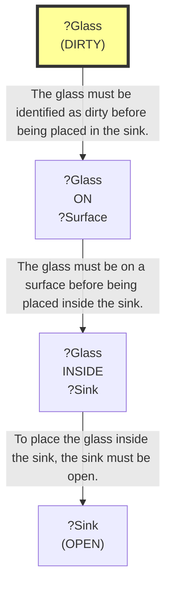
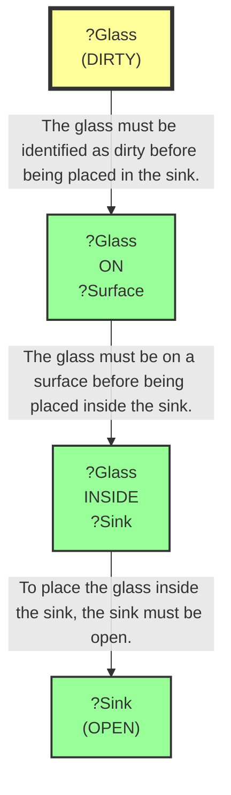
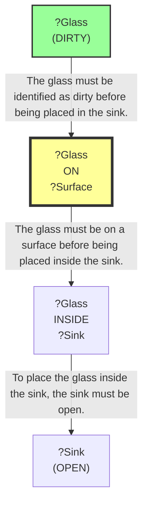
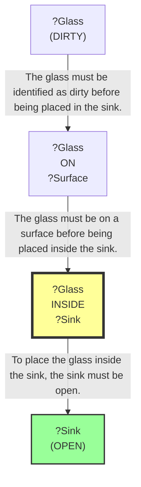
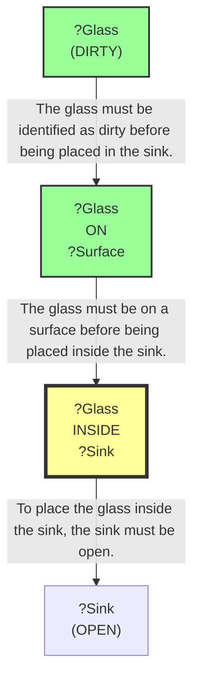

# 🚀 VirtualHome Agent Episode Log


### [GoalReasoner (Module A - Intent)] Output
```json
{
  "is_instruction_obviously_vague": false,
  "clarification_question": null,
  "target_object": "dirty water glasses",
  "location_hint": "sink",
  "reasoning_chain": [
    {
      "question": "Why does the user want this object?",
      "answer": "The user wants to manage and organize dirty water glasses."
    },
    {
      "question": "Why is that important?",
      "answer": "It is important to maintain cleanliness and order in the environment."
    },
    {
      "question": "What fundamental need does this fulfill?",
      "answer": "The user wants to ensure that dirty items are properly disposed of or cleaned."
    },
    {
      "question": "Are there any deeper psychological or physical motivations?",
      "answer": "The user likely wants to maintain hygiene and prevent the spread of germs."
    }
  ],
  "deep_intent": "The user wants to maintain cleanliness and order by properly managing dirty items.",
  "acceptable_alternatives_properties": [
    {
      "priority": 1,
      "description": "Other dirty glassware items, such as cups or mugs."
    },
    {
      "priority": 2,
      "description": "Dirty containers or vessels used for liquids."
    },
    {
      "priority": 3,
      "description": "Items that require cleaning, such as plates or utensils."
    },
    {
      "priority": 4,
      "description": "Any object that is considered dirty and needs to be placed in a designated area for cleaning."
    }
  ]
}
```

### [PerceptionFilter] Output
```json
{
  "reasoning": "The goal is to manage and organize dirty water glasses, which implies identifying and handling dirty glassware. The SDG requires the glass to be dirty, placed on a surface, and inside the sink, with the sink open. The location hint is 'sink', so the sink must be included. Additionally, the waterglass is the target object. Since the goal involves managing dirty items, we must include the sink as the designated area for handling dirty glasses and the waterglass as the specific object. No alternative tools are needed since the task is straightforward and does not require backups or additional functional tools.",
  "selected_classes": [
    "plate",
    "character",
    "waterglass",
    "sink"
  ],
  "raw_class_count": 50
}
```

### [LLMExecutor] Output
```json
{
  "reasoning": "The current Filtered Graph shows that there is a `waterglass(64)` with the `DIRTY` state, which matches the SDG node N1. However, the SDG node N3 requires the glass to be inside the sink, and the sink (sink(155)) is not currently open. Therefore, the next step is to open the sink to satisfy the condition for placing the glass inside it.",
  "satisfied_nodes": [
    "N1"
  ],
  "current_node_focus": "N4",
  "mapped_variables": {
    "?Sink": "sink(155)"
  },
  "action": "[open] <sink> (155)"
}
```

### [RoboStateMultiTaskController] Output
```json
{
  "action": "[walk] <livingroom> (183)",
  "active_task_id": null,
  "task_context": {
    "active_task_id": null,
    "pending_task_ids": [
      "task_1"
    ],
    "satisfied_task_ids": []
  },
  "source": "loop_recovery_room_revisit"
}
```
## Step 0
- **Action**: `[walk] <livingroom> (183)`
- **Action Success**: `True`
- **Action Message**: {'0': {'message': 'Success'}}
- **Decision Source**: `loop_recovery_room_revisit`
- **Task Progress**: T4_qwen_M1_03=pending
- **SDG Status**:
No SDG active.
- **Observed Items (159)**: wall(12), wall(13), wall(14), wall(15), wall(16), wall(17), wall(18), wall(19), wall(20), wall(21), floor(22), floor(23), floor(24), floor(25), floor(26)...


### [PerceptionFilter] Output
```json
{
  "reasoning": "The goal is to manage and organize dirty water glasses, specifically by placing them in the sink. The SDG requires identifying the glass as dirty, placing it on a surface, and then inside the sink, which must be open. Therefore, the essential object classes are 'waterglass' (the target object), 'sink' (the location and receptacle), and 'fridge' (as a backup for storing clean glasses if needed).",
  "selected_classes": [
    "character",
    "plate",
    "fridge",
    "waterglass",
    "sink"
  ],
  "raw_class_count": 59
}
```

### [LLMExecutor] Output
```json
{
  "reasoning": "The goal is to manage and organize dirty water glasses, specifically by placing them in the sink. The current Filtered Graph shows that there is a waterglass(64) with the state 'DIRTY', which matches the requirement of being 'DIRTY'. However, the sink (sink(155)) is not yet open, which is a prerequisite for placing the glass inside it. Therefore, the next step is to open the sink to satisfy the condition for placing the glass inside it.",
  "satisfied_nodes": [
    "N1"
  ],
  "current_node_focus": "N4",
  "mapped_variables": {
    "?Glass": "waterglass(64)",
    "?Sink": "sink(155)"
  },
  "action": "[open] <sink> (155)"
}
```

### [RoboStateMultiTaskController] Output
```json
{
  "action": "[walk] <bedroom> (241)",
  "active_task_id": null,
  "task_context": {
    "active_task_id": null,
    "pending_task_ids": [
      "task_1"
    ],
    "satisfied_task_ids": []
  },
  "source": "loop_recovery_room_revisit"
}
```
## Step 1
- **Action**: `[walk] <bedroom> (241)`
- **Action Success**: `True`
- **Action Message**: {'0': {'message': 'Success'}}
- **Decision Source**: `loop_recovery_room_revisit`
- **Task Progress**: T4_qwen_M1_03=pending
- **SDG Status**:
No SDG active.
- **Observed Items (211)**: wall(12), wall(13), wall(14), wall(15), wall(16), wall(17), wall(18), wall(19), wall(20), wall(21), floor(22), floor(23), floor(24), floor(25), floor(26)...


### [PerceptionFilter] Output
```json
{
  "reasoning": "The goal is to manage and organize dirty water glasses, specifically targeting 'dirty water glasses' and implying the need to interact with a sink. The SDG requires identifying the glass as dirty, placing it on a surface, and then inside the sink, which must be open. The observed object classes include 'waterglass' (the target object), 'sink' (the location), and 'fridge' (a potential backup for storing clean glasses or related items). These classes are necessary to fulfill the goal and maintain cleanliness.",
  "selected_classes": [
    "character",
    "plate",
    "fridge",
    "dirty water glasses",
    "sink"
  ],
  "raw_class_count": 65
}
```

### [LLMExecutor] Output
```json
{
  "reasoning": "The current Filtered Graph does not show any object matching the target object 'dirty water glasses'. However, the task requires managing dirty glasses, and the sink (sink(155)) is the designated location for this. Since the sink is not currently open, the next logical step is to open it to prepare for placing the glasses inside.",
  "satisfied_nodes": [],
  "current_node_focus": "N4",
  "mapped_variables": {
    "?Sink": "sink(155)"
  },
  "action": "[open] <sink> (155)"
}
```

### [RoboStateMultiTaskController] Output
```json
{
  "action": "[walk] <bathroom> (285)",
  "active_task_id": null,
  "task_context": {
    "active_task_id": null,
    "pending_task_ids": [
      "task_1"
    ],
    "satisfied_task_ids": []
  },
  "source": "loop_recovery_room_revisit"
}
```
## Step 2
- **Action**: `[walk] <bathroom> (285)`
- **Action Success**: `True`
- **Action Message**: {'0': {'message': 'Success'}}
- **Decision Source**: `loop_recovery_room_revisit`
- **Task Progress**: T4_qwen_M1_03=pending
- **SDG Status**:
No SDG active.
- **Observed Items (243)**: wall(12), wall(13), wall(14), wall(15), wall(16), wall(17), wall(18), wall(19), wall(20), wall(21), floor(22), floor(23), floor(24), floor(25), floor(26)...


### [PerceptionFilter] Output
```json
{
  "reasoning": "The goal is to manage and organize dirty water glasses, which implies the need to locate and handle these items. The SDG indicates that the glasses must be identified as dirty, placed on a surface, and then inside a sink. The sink is explicitly mentioned as the location, and the waterglass is the target object. To ensure functionality, we must include the sink and waterglass. Additionally, the fridge is included as a potential backup for storing clean glasses if needed.",
  "selected_classes": [
    "character",
    "plate",
    "fridge",
    "waterglass",
    "sink"
  ],
  "raw_class_count": 81
}
```

### [LLMExecutor] Output
```json
{
  "reasoning": "The current Filtered Graph shows that there is a `waterglass(64)` with the `DIRTY` state, which matches the SDG node N1 (dirty glass). However, the glass is currently `INSIDE kitchen(11)` and not on a surface (`ON`), which is required for node N2. The next logical step is to walk to the glass to grab it and then proceed to the sink to clean it. Since the glass is inside the kitchen, we need to first walk to it.",
  "satisfied_nodes": [],
  "current_node_focus": "N1",
  "mapped_variables": {
    "?Glass": "waterglass(64)",
    "?Surface": "kitchen(11)",
    "?Sink": "sink(155)"
  },
  "action": "[walk] <waterglass> (64)"
}
```

### [RoboStateMultiTaskController] Output
```json
{
  "action": "[walk] <waterglass> (64)",
  "active_task_id": "task_1",
  "task_context": {
    "active_task_id": "task_1",
    "pending_task_ids": [],
    "satisfied_task_ids": []
  },
  "source": "llm_executor"
}
```
## Step 3
- **Action**: `[walk] <waterglass> (64)`
- **Action Success**: `True`
- **Action Message**: {'0': {'message': 'Success'}}
- **Active Task**: `task_1`
- **Decision Source**: `llm_executor`
- **Task Progress**: T4_qwen_M1_03=pending
- **SDG Status**:

- **Observed Items (31)**: waterglass(64) [DIRTY], plate(67), plate(68), waterglass(71), waterglass(72), plate(75), plate(76), waterglass(79), waterglass(80), plate(83), plate(84), waterglass(87), waterglass(88), plate(91), waterglass(100)...


### [PerceptionFilter] Output
```json
{
  "reasoning": "Reused cached class selection.",
  "selected_classes": [
    "character",
    "plate",
    "fridge",
    "waterglass",
    "sink"
  ],
  "raw_class_count": 81
}
```

### [LLMExecutor] Output
```json
{
  "reasoning": "The current focus is on satisfying node N1, which requires the glass to be DIRTY. The waterglass(64) is already identified as DIRTY in the Filtered Graph. The next step is to grab the waterglass(64) to proceed with placing it in the sink. Since the robot is already near the waterglass(64), the [grab] action can be executed directly.",
  "satisfied_nodes": [
    "N2",
    "N3",
    "N4"
  ],
  "current_node_focus": "N1",
  "mapped_variables": {
    "?Glass": "waterglass(64)",
    "?Surface": "kitchen(11)",
    "?Sink": "sink(155)"
  },
  "action": "[grab] <waterglass> (64)"
}
```

### [RoboStateMultiTaskController] Output
```json
{
  "action": "[grab] <waterglass> (64)",
  "active_task_id": "task_1",
  "task_context": {
    "active_task_id": "task_1",
    "pending_task_ids": [],
    "satisfied_task_ids": []
  },
  "source": "llm_executor"
}
```
## Step 4
- **Action**: `[grab] <waterglass> (64)`
- **Action Success**: `False`
- **Action Message**: temporary_unavailable: target disappeared; wait or search and retry
- **Active Task**: `task_1`
- **Decision Source**: `llm_executor`
- **Task Progress**: T4_qwen_M1_03=pending
- **SDG Status**:

- **Observed Items (31)**: waterglass(64) [DIRTY], plate(67), plate(68), waterglass(71), waterglass(72), plate(75), plate(76), waterglass(79), waterglass(80), plate(83), plate(84), waterglass(87), waterglass(88), plate(91), waterglass(100)...


### [PerceptionFilter] Output
```json
{
  "reasoning": "Reused cached class selection.",
  "selected_classes": [
    "character",
    "plate",
    "fridge",
    "waterglass",
    "sink"
  ],
  "raw_class_count": 81
}
```

### [LLMExecutor] Output
```json
{
  "reasoning": "The current focus is on satisfying node N1, which requires the glass to be DIRTY. The waterglass(64) is already marked as DIRTY, so this condition is satisfied. The next step is to satisfy node N2, which requires the glass to be ON a surface. However, the glass is currently INSIDE the kitchen(11), not on a surface. Therefore, the next action is to move the glass to a surface. Since the task involves managing dirty water glasses, the sink(155) is the most appropriate surface to place the glass. Before placing the glass on the sink, we need to ensure the sink is open (node N4). However, the sink is not explicitly mentioned as being open in the current graph, so we need to check its state. If it is closed, we must open it first. Since the glass is already in the kitchen, we need to walk to it first to grab it, then walk to the sink to place it. However, since the glass is already in the kitchen, we can directly walk to it and then proceed.",
  "satisfied_nodes": [
    "N1"
  ],
  "current_node_focus": "N2",
  "mapped_variables": {
    "?Glass": "waterglass(64)",
    "?Surface": "sink(155)"
  },
  "action": "[walk] <waterglass> (64)"
}
```

### [RoboStateMultiTaskController] Output
```json
{
  "action": "[walk] <waterglass> (64)",
  "active_task_id": "task_1",
  "task_context": {
    "active_task_id": "task_1",
    "pending_task_ids": [],
    "satisfied_task_ids": []
  },
  "source": "llm_executor"
}
```
## Step 5
- **Action**: `[walk] <waterglass> (64)`
- **Action Success**: `False`
- **Action Message**: temporary_unavailable: target is temporarily hidden
- **Active Task**: `task_1`
- **Decision Source**: `llm_executor`
- **Task Progress**: T4_qwen_M1_03=pending
- **SDG Status**:

- **Observed Items (31)**: waterglass(64) [DIRTY], plate(67), plate(68), waterglass(71), waterglass(72), plate(75), plate(76), waterglass(79), waterglass(80), plate(83), plate(84), waterglass(87), waterglass(88), plate(91), waterglass(100)...


### [RoboStateMultiTaskController] Output
```json
{
  "action": "[walk] <bedroom> (346)",
  "active_task_id": null,
  "task_context": {
    "active_task_id": null,
    "pending_task_ids": [
      "task_1"
    ],
    "satisfied_task_ids": []
  },
  "source": "loop_recovery_room_revisit"
}
```
## Step 6
- **Action**: `[walk] <bedroom> (346)`
- **Action Success**: `True`
- **Action Message**: {'0': {'message': 'Success'}}
- **Decision Source**: `loop_recovery_room_revisit`
- **Task Progress**: T4_qwen_M1_03=pending
- **SDG Status**:
No SDG active.
- **Observed Items (303)**: wall(12), wall(13), wall(14), wall(15), wall(16), wall(17), wall(18), wall(19), wall(20), wall(21), floor(22), floor(23), floor(24), floor(25), floor(26)...


### [PerceptionFilter] Output
```json
{
  "reasoning": "",
  "selected_classes": [
    "plate",
    "character",
    "mug",
    "sink"
  ],
  "raw_class_count": 91
}
```

### [LLMExecutor] Output
```json
{
  "reasoning": "The current Filtered Graph does not contain the 'dirty water glasses' object, which was previously attempted to be located. However, the task requires managing dirty water glasses, and the available objects include various plates and a sink. Since the task is to manage dirty items, the sink (sink(326)) in the bathroom (285) is the most relevant location for handling such items. The next logical step is to walk to the sink to prepare for placing the dirty glasses there.",
  "satisfied_nodes": [],
  "current_node_focus": "N1",
  "mapped_variables": {
    "?Glass": "plate(383)",
    "?Surface": "bedroom(346)",
    "?Sink": "sink(326)"
  },
  "action": "[walk] <sink> (326)"
}
```

### [RoboStateMultiTaskController] Output
```json
{
  "action": "[walk] <sink> (326)",
  "active_task_id": "task_1",
  "task_context": {
    "active_task_id": "task_1",
    "pending_task_ids": [],
    "satisfied_task_ids": []
  },
  "source": "llm_executor"
}
```
## Step 7
- **Action**: `[walk] <sink> (326)`
- **Action Success**: `True`
- **Action Message**: {'0': {'message': 'Success'}}
- **Active Task**: `task_1`
- **Decision Source**: `llm_executor`
- **Task Progress**: T4_qwen_M1_03=pending
- **SDG Status**:

- **Observed Items (23)**: plate(67), plate(68), plate(75), plate(76), plate(83), plate(84), plate(91), plate(103), plate(104), sink(155), character(1), kitchen(11), livingroom(183), bedroom(241), bathroom(285)...


### [PerceptionFilter] Output
```json
{
  "reasoning": "Reused cached class selection.",
  "selected_classes": [
    "plate",
    "character",
    "mug",
    "sink"
  ],
  "raw_class_count": 91
}
```

### [LLMExecutor] Output
```json
{
  "reasoning": "The current focus is on satisfying node N1, which requires the glass to be DIRTY. However, the target object 'dirty water glasses' is not present in the current Filtered Graph. The available objects include various plates and mugs, but none are explicitly marked as DIRTY. Since the task requires managing dirty water glasses, and no such object is available, the next logical step is to search for a suitable substitute that matches the properties of a dirty glassware item. The mug(384) is a potential candidate as it is POURABLE and located in the bedroom(346), which is close to the current location. The next step is to walk to the mug(384) to verify its state and determine if it can be used as a substitute.",
  "satisfied_nodes": [],
  "current_node_focus": "N1",
  "mapped_variables": {
    "?Glass": "mug(384)"
  },
  "action": "[walk] <mug> (384)"
}
```

### [RoboStateMultiTaskController] Output
```json
{
  "action": "[walk] <mug> (384)",
  "active_task_id": "task_1",
  "task_context": {
    "active_task_id": "task_1",
    "pending_task_ids": [],
    "satisfied_task_ids": []
  },
  "source": "llm_executor"
}
```
## Step 8
- **Action**: `[walk] <mug> (384)`
- **Action Success**: `True`
- **Action Message**: {'0': {'message': 'Success'}}
- **Active Task**: `task_1`
- **Decision Source**: `llm_executor`
- **Task Progress**: T4_qwen_M1_03=pending
- **SDG Status**:

- **Observed Items (23)**: plate(67), plate(68), plate(75), plate(76), plate(83), plate(84), plate(91), plate(103), plate(104), sink(155), character(1), kitchen(11), livingroom(183), bedroom(241), bathroom(285)...


### [PerceptionFilter] Output
```json
{
  "reasoning": "Reused cached class selection.",
  "selected_classes": [
    "plate",
    "character",
    "mug",
    "sink"
  ],
  "raw_class_count": 91
}
```

### [LLMExecutor] Output
```json
{
  "reasoning": "The current focus is on satisfying node N3, which requires the glass to be inside the sink. However, the glass is not currently in the Filtered Graph, and the sink (sink(326)) is the target location. Since the glass is missing, we need to search for an alternative substitute that matches the properties of a 'dirty water glass' (e.g., a mug or plate that is dirty and can be placed in the sink). The mug (mug(384)) is currently in the Filtered Graph and is a valid substitute. We must first ensure the mug is dirty and then proceed to place it in the sink.",
  "satisfied_nodes": [
    "N4"
  ],
  "current_node_focus": "N3",
  "mapped_variables": {
    "?Glass": "mug(384)",
    "?Sink": "sink(326)"
  },
  "action": "[grab] <mug> (384)"
}
```

### [RoboStateMultiTaskController] Output
```json
{
  "action": "[grab] <mug> (384)",
  "active_task_id": "task_1",
  "task_context": {
    "active_task_id": "task_1",
    "pending_task_ids": [],
    "satisfied_task_ids": []
  },
  "source": "llm_executor"
}
```
## Step 9
- **Action**: `[grab] <mug> (384)`
- **Action Success**: `True`
- **Action Message**: {'0': {'message': 'Success'}}
- **Active Task**: `task_1`
- **Decision Source**: `llm_executor`
- **Task Progress**: T4_qwen_M1_03=pending
- **SDG Status**:

- **Observed Items (23)**: plate(67), plate(68), plate(75), plate(76), plate(83), plate(84), plate(91), plate(103), plate(104), sink(155), character(1), kitchen(11), livingroom(183), bedroom(241), bathroom(285)...


### [PerceptionFilter] Output
```json
{
  "reasoning": "Reused cached class selection.",
  "selected_classes": [
    "plate",
    "character",
    "mug",
    "sink"
  ],
  "raw_class_count": 91
}
```

### [LLMExecutor] Output
```json
{
  "reasoning": "The current focus is on satisfying node N3, which requires placing the dirty water glass inside the sink. However, the glass is not currently in the Filtered Graph, and the sink (sink(326)) is already in the current location. The next step is to check if the sink is open (node N4), as the glass must be placed inside an open sink. Since the sink is not explicitly marked as open, we need to verify its state.",
  "satisfied_nodes": [
    "N2"
  ],
  "current_node_focus": "N3",
  "mapped_variables": {
    "?Glass": "mug(384)",
    "?Sink": "sink(326)"
  },
  "action": "[open] <sink> (326)"
}
```

### [RoboStateMultiTaskController] Output
```json
{
  "action": "[walk] <livingroom> (183)",
  "active_task_id": null,
  "task_context": {
    "active_task_id": null,
    "pending_task_ids": [
      "task_1"
    ],
    "satisfied_task_ids": []
  },
  "source": "loop_recovery_room_revisit"
}
```
## Step 10
- **Action**: `[walk] <livingroom> (183)`
- **Action Success**: `True`
- **Action Message**: {'0': {'message': 'Success'}}
- **Decision Source**: `loop_recovery_room_revisit`
- **Task Progress**: T4_qwen_M1_03=pending
- **SDG Status**:
No SDG active.
- **Observed Items (361)**: wall(12), wall(13), wall(14), wall(15), wall(16), wall(17), wall(18), wall(19), wall(20), wall(21), floor(22), floor(23), floor(24), floor(25), floor(26)...


### [PerceptionFilter] Output
```json
{
  "reasoning": "Reused cached class selection.",
  "selected_classes": [
    "plate",
    "character",
    "mug",
    "sink"
  ],
  "raw_class_count": 91
}
```

### [LLMExecutor] Output
```json
{
  "reasoning": "The current focus is on satisfying node N3, which requires placing the dirty water glass inside the sink. However, the glass is not currently in the Filtered Graph, and the sink (sink(326)) is already in the environment. Since the glass is missing, it is likely temporarily hidden or moved by another entity. According to the rules, if an object disappears while approaching, we should wait for it to return. Therefore, the next logical step is to wait for the glass to reappear.",
  "satisfied_nodes": [
    "N4"
  ],
  "current_node_focus": "N3",
  "mapped_variables": {
    "?Glass": "waterglass(64)",
    "?Sink": "sink(326)"
  },
  "action": "[wait]"
}
```

### [RoboStateMultiTaskController] Output
```json
{
  "action": "[wait]",
  "active_task_id": "task_1",
  "task_context": {
    "active_task_id": "task_1",
    "pending_task_ids": [],
    "satisfied_task_ids": []
  },
  "source": "llm_executor"
}
```
## Step 11
- **Action**: `[wait]`
- **Action Success**: `True`
- **Action Message**: Time passes. You waited for a while.
- **Active Task**: `task_1`
- **Decision Source**: `llm_executor`
- **Task Progress**: T4_qwen_M1_03=pending
- **SDG Status**:

- **Observed Items (23)**: plate(67), plate(68), plate(75), plate(76), plate(83), plate(84), plate(91), plate(103), plate(104), sink(155), character(1), kitchen(11), livingroom(183), bedroom(241), bathroom(285)...


### [PerceptionFilter] Output
```json
{
  "reasoning": "Reused cached class selection.",
  "selected_classes": [
    "plate",
    "character",
    "mug",
    "sink"
  ],
  "raw_class_count": 91
}
```

### [LLMExecutor] Output
```json
{
  "reasoning": "The current focus is on satisfying node N3, which requires the glass to be inside the sink. However, the glass is not currently in the environment, and the sink (sink(326)) is already in the Filtered Graph. Since the glass is missing, I must search for an alternative substitute that matches the properties of a dirty water glass. The mug(384) is a suitable substitute as it is a pourable object and is currently in the livingroom(183). I will first walk to the mug to grab it, then proceed to the sink to place it inside.",
  "satisfied_nodes": [
    "N4"
  ],
  "current_node_focus": "N3",
  "mapped_variables": {
    "?Glass": "mug(384)",
    "?Sink": "sink(326)"
  },
  "action": "[walk] <mug> (384)"
}
```

### [RoboStateMultiTaskController] Output
```json
{
  "action": "[walk] <mug> (384)",
  "active_task_id": "task_1",
  "task_context": {
    "active_task_id": "task_1",
    "pending_task_ids": [],
    "satisfied_task_ids": []
  },
  "source": "llm_executor"
}
```
## Step 12
- **Action**: `[walk] <mug> (384)`
- **Action Success**: `True`
- **Action Message**: {'0': {'message': 'Success'}}
- **Active Task**: `task_1`
- **Decision Source**: `llm_executor`
- **Task Progress**: T4_qwen_M1_03=pending
- **SDG Status**:

- **Observed Items (23)**: plate(67), plate(68), plate(75), plate(76), plate(83), plate(84), plate(91), plate(103), plate(104), sink(155), character(1), kitchen(11), livingroom(183), bedroom(241), bathroom(285)...


### [PerceptionFilter] Output
```json
{
  "reasoning": "Reused cached class selection.",
  "selected_classes": [
    "plate",
    "character",
    "mug",
    "sink"
  ],
  "raw_class_count": 91
}
```

### [LLMExecutor] Output
```json
{
  "reasoning": "The current focus is on satisfying node N3, which requires the glass to be inside the sink. However, the glass is not currently in the Filtered Graph, and the sink (sink(326)) is not open. The next step is to ensure the sink is open, as this is a prerequisite for placing the glass inside it. Since the sink is closed, we must first open it.",
  "satisfied_nodes": [
    "N2"
  ],
  "current_node_focus": "N3",
  "mapped_variables": {
    "?Sink": "sink(326)"
  },
  "action": "[open] <sink> (326)"
}
```

### [RoboStateMultiTaskController] Output
```json
{
  "action": "[walk] <bedroom> (241)",
  "active_task_id": null,
  "task_context": {
    "active_task_id": null,
    "pending_task_ids": [
      "task_1"
    ],
    "satisfied_task_ids": []
  },
  "source": "loop_recovery_room_revisit"
}
```
## Step 13
- **Action**: `[walk] <bedroom> (241)`
- **Action Success**: `True`
- **Action Message**: {'0': {'message': 'Success'}}
- **Decision Source**: `loop_recovery_room_revisit`
- **Task Progress**: T4_qwen_M1_03=pending
- **SDG Status**:
No SDG active.
- **Observed Items (361)**: wall(12), wall(13), wall(14), wall(15), wall(16), wall(17), wall(18), wall(19), wall(20), wall(21), floor(22), floor(23), floor(24), floor(25), floor(26)...


### [PerceptionFilter] Output
```json
{
  "reasoning": "Reused cached class selection.",
  "selected_classes": [
    "plate",
    "character",
    "mug",
    "sink"
  ],
  "raw_class_count": 91
}
```

### [LLMExecutor] Output
```json
{
  "reasoning": "The current focus is on satisfying node N3, which requires the glass to be inside the sink. However, the glass is not currently in the environment, and the sink (sink(326)) is closed. The next step is to open the sink to prepare for placing the glass inside it. This action aligns with the requirement that the sink must be open to place the glass inside it.",
  "satisfied_nodes": [
    "N2"
  ],
  "current_node_focus": "N3",
  "mapped_variables": {
    "?Sink": "sink(326)"
  },
  "action": "[open] <sink> (326)"
}
```

### [RoboStateMultiTaskController] Output
```json
{
  "action": "[walk] <kitchen> (11)",
  "active_task_id": null,
  "task_context": {
    "active_task_id": null,
    "pending_task_ids": [
      "task_1"
    ],
    "satisfied_task_ids": []
  },
  "source": "loop_recovery_room_revisit"
}
```
## Step 14
- **Action**: `[walk] <kitchen> (11)`
- **Action Success**: `True`
- **Action Message**: {'0': {'message': 'Success'}}
- **Decision Source**: `loop_recovery_room_revisit`
- **Task Progress**: T4_qwen_M1_03=pending
- **SDG Status**:
No SDG active.
- **Observed Items (361)**: wall(12), wall(13), wall(14), wall(15), wall(16), wall(17), wall(18), wall(19), wall(20), wall(21), floor(22), floor(23), floor(24), floor(25), floor(26)...


### [PerceptionFilter] Output
```json
{
  "reasoning": "Reused cached class selection.",
  "selected_classes": [
    "plate",
    "character",
    "mug",
    "sink"
  ],
  "raw_class_count": 91
}
```

### [LLMExecutor] Output
```json
{
  "reasoning": "The current focus is on satisfying node N3, which requires the glass to be inside the sink. However, the glass is not yet in the sink. The sink (sink(326)) is already in the environment, and the robot is currently near it. The next step is to place the glass inside the sink. Since the robot is holding the mug (mug(384)), it needs to first put the mug down to free up a hand to grab the glass. However, the glass is not currently in the robot's possession, so the next step is to grab the glass from its current location, which is not specified. Therefore, the robot must first locate the glass and grab it before proceeding to place it in the sink.",
  "satisfied_nodes": [
    "N4"
  ],
  "current_node_focus": "N3",
  "mapped_variables": {
    "?Glass": "mug(384)",
    "?Sink": "sink(326)"
  },
  "action": "[putback] <mug> (384) <sink> (326)"
}
```

### [RoboStateMultiTaskController] Output
```json
{
  "action": "[walk] <bathroom> (285)",
  "active_task_id": null,
  "task_context": {
    "active_task_id": null,
    "pending_task_ids": [
      "task_1"
    ],
    "satisfied_task_ids": []
  },
  "source": "loop_recovery_room_revisit"
}
```
## Step 15
- **Action**: `[walk] <bathroom> (285)`
- **Action Success**: `True`
- **Action Message**: {'0': {'message': 'Success'}}
- **Decision Source**: `loop_recovery_room_revisit`
- **Task Progress**: T4_qwen_M1_03=pending
- **SDG Status**:
No SDG active.
- **Observed Items (361)**: wall(12), wall(13), wall(14), wall(15), wall(16), wall(17), wall(18), wall(19), wall(20), wall(21), floor(22), floor(23), floor(24), floor(25), floor(26)...


### [PerceptionFilter] Output
```json
{
  "reasoning": "Reused cached class selection.",
  "selected_classes": [
    "plate",
    "character",
    "mug",
    "sink"
  ],
  "raw_class_count": 91
}
```

### [LLMExecutor] Output
```json
{
  "reasoning": "The current focus is on satisfying node N3, which requires the glass to be inside the sink. However, the glass is currently not in the sink. The sink (sink(326)) is in the bathroom, and the robot is currently in the bathroom. The next step is to place the glass inside the sink. Since the robot is already near the sink, the next action is to [putback] the glass into the sink.",
  "satisfied_nodes": [
    "N1",
    "N2"
  ],
  "current_node_focus": "N3",
  "mapped_variables": {
    "?Glass": "mug(384)",
    "?Sink": "sink(326)"
  },
  "action": "[putback] <mug> (384) <sink> (326)"
}
```

### [RoboStateMultiTaskController] Output
```json
{
  "action": "[walk] <bedroom> (346)",
  "active_task_id": null,
  "task_context": {
    "active_task_id": null,
    "pending_task_ids": [
      "task_1"
    ],
    "satisfied_task_ids": []
  },
  "source": "loop_recovery_room_revisit"
}
```
## Step 16
- **Action**: `[walk] <bedroom> (346)`
- **Action Success**: `True`
- **Action Message**: {'0': {'message': 'Success'}}
- **Decision Source**: `loop_recovery_room_revisit`
- **Task Progress**: T4_qwen_M1_03=pending
- **SDG Status**:
No SDG active.
- **Observed Items (361)**: wall(12), wall(13), wall(14), wall(15), wall(16), wall(17), wall(18), wall(19), wall(20), wall(21), floor(22), floor(23), floor(24), floor(25), floor(26)...


### [PerceptionFilter] Output
```json
{
  "reasoning": "Reused cached class selection.",
  "selected_classes": [
    "plate",
    "character",
    "mug",
    "sink"
  ],
  "raw_class_count": 91
}
```

### [LLMExecutor] Output
```json
{
  "reasoning": "The current focus is on satisfying node N3, which requires the glass to be inside the sink. However, the glass is currently not in the sink. The sink (sink(326)) is in the bathroom (bathroom(285)), and the robot is currently in the bedroom (bedroom(346)). The next step is to walk to the sink (sink(326)) to place the glass inside it. This action will satisfy the relation that the glass is inside the sink, which is a prerequisite for opening the sink (node N4).",
  "satisfied_nodes": [
    "N1",
    "N2"
  ],
  "current_node_focus": "N3",
  "mapped_variables": {
    "?Glass": "mug(384)",
    "?Sink": "sink(326)"
  },
  "action": "[walk] <sink> (326)"
}
```

### [RoboStateMultiTaskController] Output
```json
{
  "action": "[walk] <sink> (326)",
  "active_task_id": "task_1",
  "task_context": {
    "active_task_id": "task_1",
    "pending_task_ids": [],
    "satisfied_task_ids": []
  },
  "source": "llm_executor"
}
```
## Step 17
- **Action**: `[walk] <sink> (326)`
- **Action Success**: `True`
- **Action Message**: {'0': {'message': 'Success'}}
- **Active Task**: `task_1`
- **Decision Source**: `llm_executor`
- **Task Progress**: T4_qwen_M1_03=pending
- **SDG Status**:

- **Observed Items (23)**: plate(67), plate(68), plate(75), plate(76), plate(83), plate(84), plate(91), plate(103), plate(104), sink(155), character(1), kitchen(11), livingroom(183), bedroom(241), bathroom(285)...

