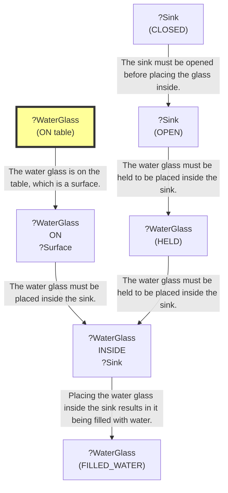
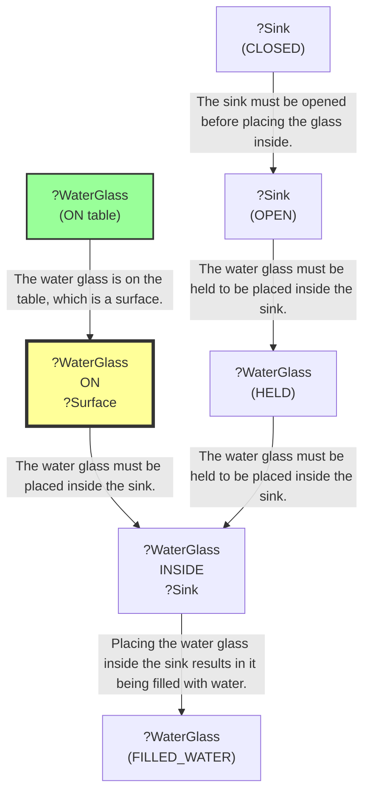
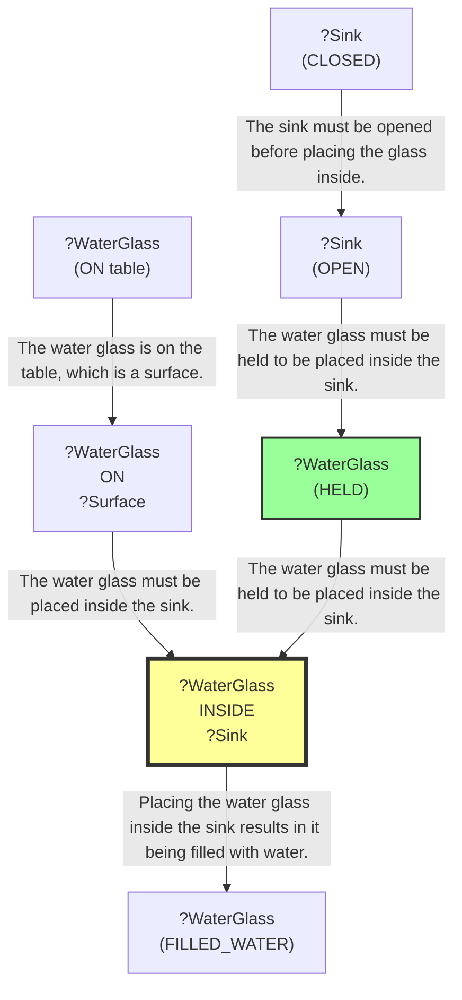

# 🚀 VirtualHome Agent Episode Log


### [GoalReasoner (Module A - Intent)] Output
```json
{
  "is_instruction_obviously_vague": false,
  "clarification_question": null,
  "target_object": "water glass",
  "location_hint": "table",
  "reasoning_chain": [
    {
      "question": "Why does the user want this object?",
      "answer": "The user wants to manage the placement of a water glass."
    },
    {
      "question": "Why is that important?",
      "answer": "The user wants to ensure the water glass is in the correct location for hygiene or convenience."
    },
    {
      "question": "What fundamental need does this fulfill?",
      "answer": "The user wants to maintain cleanliness and order in the environment."
    },
    {
      "question": "Are there any deeper psychological or physical motivations?",
      "answer": "The user may be following a routine or protocol to ensure proper handling of items."
    }
  ],
  "deep_intent": "Maintain cleanliness and order by relocating a used item to an appropriate location.",
  "acceptable_alternatives_properties": [
    {
      "priority": 1,
      "description": "Other types of glasses or containers that need to be cleaned, such as a mug or a bowl."
    },
    {
      "priority": 2,
      "description": "Items that require cleaning or disposal, such as a plate or a utensil."
    },
    {
      "priority": 3,
      "description": "Any object that is considered dirty and needs to be moved to a designated cleaning area."
    },
    {
      "priority": 4,
      "description": "Items that are used for holding liquids or food and need to be cleaned, such as a cup or a container."
    }
  ]
}
```

### [PerceptionFilter] Output
```json
{
  "reasoning": "The goal is to maintain cleanliness and order by relocating a used water glass to an appropriate location. The SDG indicates that the water glass is currently on the table and needs to be placed inside the sink. To achieve this, we need the water glass itself, the sink (as the target location), and the table (as the current location). Additionally, the sink must be open, which implies the need to check its state. No other objects are necessary for this task.",
  "selected_classes": [
    "character",
    "table",
    "plate",
    "waterglass",
    "sink"
  ],
  "raw_class_count": 50
}
```

### [LLMExecutor] Output
```json
{
  "reasoning": "The goal is to move the water glass to the sink. However, the current Filtered Graph shows that the water glass is inside the kitchen, not on a table. The SDG requires the water glass to be on the table (N1), which is not satisfied. Therefore, the first step is to locate and walk to the water glass to begin the task.",
  "satisfied_nodes": [],
  "current_node_focus": "N1",
  "mapped_variables": {
    "?WaterGlass": "waterglass(64)"
  },
  "action": "[walk] <waterglass> (64)"
}
```

### [RoboStateMultiTaskController] Output
```json
{
  "action": "[walk] <waterglass> (64)",
  "active_task_id": "task_1",
  "task_context": {
    "active_task_id": "task_1",
    "pending_task_ids": [],
    "satisfied_task_ids": []
  },
  "source": "llm_executor"
}
```
## Step 0
- **Action**: `[walk] <waterglass> (64)`
- **Action Success**: `True`
- **Action Message**: {'0': {'message': 'Success'}}
- **Active Task**: `task_1`
- **Decision Source**: `llm_executor`
- **Task Progress**: T4_qwen_M2_06=pending
- **SDG Status**:

- **Observed Items (24)**: waterglass(64) [DIRTY], plate(67), plate(68), waterglass(71), waterglass(72), plate(75), plate(76), waterglass(79), waterglass(80), plate(83), plate(84), waterglass(87), waterglass(88), plate(91), waterglass(100)...


### [PerceptionFilter] Output
```json
{
  "reasoning": "Reused cached class selection.",
  "selected_classes": [
    "character",
    "table",
    "plate",
    "waterglass",
    "sink"
  ],
  "raw_class_count": 50
}
```

### [LLMExecutor] Output
```json
{
  "reasoning": "The current focus is on satisfying node N2, which requires the water glass to be on a surface. However, the water glass (64) is already marked as DIRTY, and the task involves relocating it to an appropriate location. The next logical step is to grab the water glass (64) to prepare for moving it to the sink. Since the robot is already near the water glass (as confirmed by the previous [walk] action), the next action is to [grab] it.",
  "satisfied_nodes": [
    "N1"
  ],
  "current_node_focus": "N2",
  "mapped_variables": {
    "?WaterGlass": "waterglass(64)"
  },
  "action": "[grab] <waterglass> (64)"
}
```

### [RoboStateMultiTaskController] Output
```json
{
  "action": "[grab] <waterglass> (64)",
  "active_task_id": "task_1",
  "task_context": {
    "active_task_id": "task_1",
    "pending_task_ids": [],
    "satisfied_task_ids": []
  },
  "source": "llm_executor"
}
```
## Step 1
- **Action**: `[grab] <waterglass> (64)`
- **Action Success**: `True`
- **Action Message**: {'0': {'message': 'Success'}}
- **Active Task**: `task_1`
- **Decision Source**: `llm_executor`
- **Task Progress**: T4_qwen_M2_06=pending
- **SDG Status**:

- **Observed Items (24)**: waterglass(64) [DIRTY], plate(67), plate(68), waterglass(71), waterglass(72), plate(75), plate(76), waterglass(79), waterglass(80), plate(83), plate(84), waterglass(87), waterglass(88), plate(91), waterglass(100)...


### [PerceptionFilter] Output
```json
{
  "reasoning": "Reused cached class selection.",
  "selected_classes": [
    "character",
    "table",
    "plate",
    "waterglass",
    "sink"
  ],
  "raw_class_count": 50
}
```

### [LLMExecutor] Output
```json
{
  "reasoning": "The current focus is on satisfying node N2, which requires the water glass to be on a surface. However, the water glass (64) is already being held by the character, so the next step is to place it on a surface. The most appropriate surface is the table, which is a flat surface and aligns with the goal of maintaining cleanliness and order. Before placing the water glass on the table, we need to ensure that the table is accessible and that the water glass is not dirty. Since the water glass is already being held, we can directly proceed to place it on the table.",
  "satisfied_nodes": [
    "N1"
  ],
  "current_node_focus": "N2",
  "mapped_variables": {
    "?WaterGlass": "waterglass(64)",
    "?Surface": "table(11)"
  },
  "action": "[putback] <waterglass> (64) <surface> (11)"
}
```

### [RoboStateMultiTaskController] Output
```json
{
  "action": "[walk] <livingroom> (183)",
  "active_task_id": null,
  "task_context": {
    "active_task_id": null,
    "pending_task_ids": [
      "task_1"
    ],
    "satisfied_task_ids": []
  },
  "source": "loop_recovery_room_revisit"
}
```
## Step 2
- **Action**: `[walk] <livingroom> (183)`
- **Action Success**: `True`
- **Action Message**: {'0': {'message': 'Success'}}
- **Decision Source**: `loop_recovery_room_revisit`
- **Task Progress**: T4_qwen_M2_06=pending
- **SDG Status**:
No SDG active.
- **Observed Items (159)**: wall(12), wall(13), wall(14), wall(15), wall(16), wall(17), wall(18), wall(19), wall(20), wall(21), floor(22), floor(23), floor(24), floor(25), floor(26)...


### [PerceptionFilter] Output
```json
{
  "reasoning": "The goal is to maintain cleanliness and order by relocating a used water glass to an appropriate location. The SDG indicates that the water glass is currently on the table and needs to be placed inside the sink. To achieve this, the water glass itself is essential. Additionally, the sink is required to perform the action of placing the glass inside it. Since the goal involves cleaning, the fridge is included as a potential backup for storing clean items. No other objects are necessary for this task.",
  "selected_classes": [
    "character",
    "plate",
    "fridge",
    "waterglass",
    "sink"
  ],
  "raw_class_count": 59
}
```

### [LLMExecutor] Output
```json
{
  "reasoning": "The current focus is on satisfying node N2, which requires the water glass to be on a surface. However, the water glass is already being held by the robot (as indicated by 'HOLDS_RH waterglass(64)'). The next logical step is to place the water glass on a surface, specifically the sink, as per the SDG's requirement to move it inside the sink (node N3). Before placing it inside the sink, the sink must be opened (node N5). Therefore, the next action is to open the sink.",
  "satisfied_nodes": [
    "N1"
  ],
  "current_node_focus": "N2",
  "mapped_variables": {
    "?WaterGlass": "waterglass(64)",
    "?Surface": "sink(155)"
  },
  "action": "[open] <sink> (155)"
}
```

### [RoboStateMultiTaskController] Output
```json
{
  "action": "[walk] <bedroom> (241)",
  "active_task_id": null,
  "task_context": {
    "active_task_id": null,
    "pending_task_ids": [
      "task_1"
    ],
    "satisfied_task_ids": []
  },
  "source": "loop_recovery_room_revisit"
}
```
## Step 3
- **Action**: `[walk] <bedroom> (241)`
- **Action Success**: `True`
- **Action Message**: {'0': {'message': 'Success'}}
- **Decision Source**: `loop_recovery_room_revisit`
- **Task Progress**: T4_qwen_M2_06=pending
- **SDG Status**:
No SDG active.
- **Observed Items (211)**: wall(12), wall(13), wall(14), wall(15), wall(16), wall(17), wall(18), wall(19), wall(20), wall(21), floor(22), floor(23), floor(24), floor(25), floor(26)...


### [PerceptionFilter] Output
```json
{
  "reasoning": "The goal is to maintain cleanliness and order by relocating a used water glass to an appropriate location. The SDG indicates that the water glass is currently on the table and needs to be placed inside the sink. To achieve this, we need the water glass itself, the sink (as the target location), and the table (as the current location). Additionally, the sink must be open, which implies the need to check its state. No other objects are necessary for this task.",
  "selected_classes": [
    "character",
    "table",
    "plate",
    "waterglass",
    "sink"
  ],
  "raw_class_count": 65
}
```

### [LLMExecutor] Output
```json
{
  "reasoning": "The current focus is on satisfying node N2, which requires the water glass to be on a surface. However, the water glass (64) is already being held by the robot (as indicated by 'HOLDS_RH waterglass(64)') and is not on a surface. The next logical step is to place it on a surface, such as a table, to satisfy the 'ON table' requirement. Since the robot is already holding the water glass, the next action is to place it on a surface.",
  "satisfied_nodes": [
    "N6"
  ],
  "current_node_focus": "N2",
  "mapped_variables": {
    "?WaterGlass": "waterglass(64)",
    "?Surface": "table(10)"
  },
  "action": "[putback] <waterglass> (64) <table> (10)"
}
```

### [RoboStateMultiTaskController] Output
```json
{
  "action": "[walk] <bathroom> (285)",
  "active_task_id": null,
  "task_context": {
    "active_task_id": null,
    "pending_task_ids": [
      "task_1"
    ],
    "satisfied_task_ids": []
  },
  "source": "loop_recovery_room_revisit"
}
```
## Step 4
- **Action**: `[walk] <bathroom> (285)`
- **Action Success**: `True`
- **Action Message**: {'0': {'message': 'Success'}}
- **Decision Source**: `loop_recovery_room_revisit`
- **Task Progress**: T4_qwen_M2_06=pending
- **SDG Status**:
No SDG active.
- **Observed Items (243)**: wall(12), wall(13), wall(14), wall(15), wall(16), wall(17), wall(18), wall(19), wall(20), wall(21), floor(22), floor(23), floor(24), floor(25), floor(26)...


### [PerceptionFilter] Output
```json
{
  "reasoning": "The goal is to maintain cleanliness and order by relocating a used water glass to an appropriate location. The SDG indicates that the water glass is currently on the table and needs to be placed inside the sink. To achieve this, the water glass itself is essential. Additionally, the sink is required to perform the action of placing the glass inside it. Since the goal involves cleaning, the fridge is included as a potential backup for storing clean items. No other objects are necessary for this task.",
  "selected_classes": [
    "character",
    "plate",
    "fridge",
    "waterglass",
    "sink"
  ],
  "raw_class_count": 81
}
```

### [LLMExecutor] Output
```json
{
  "reasoning": "The current focus is on satisfying node N2, which requires the water glass to be on a surface. However, the water glass (64) is already being held by the robot (as indicated by 'HOLDS_RH waterglass(64)') and is not on a surface. The next logical step is to place the water glass on a surface, such as the kitchen table, to satisfy the requirement of being on a surface. Since the water glass is already in the robot's hand, the next action is to walk to a surface (e.g., kitchen table) and then put it back.",
  "satisfied_nodes": [
    "N1"
  ],
  "current_node_focus": "N2",
  "mapped_variables": {
    "?WaterGlass": "waterglass(64)",
    "?Surface": "kitchen(11)"
  },
  "action": "[walk] <surface> (11)"
}
```

### [RoboStateMultiTaskController] Output
```json
{
  "action": "[walk] <bedroom> (346)",
  "active_task_id": null,
  "task_context": {
    "active_task_id": null,
    "pending_task_ids": [
      "task_1"
    ],
    "satisfied_task_ids": []
  },
  "source": "loop_recovery_room_revisit"
}
```
## Step 5
- **Action**: `[walk] <bedroom> (346)`
- **Action Success**: `True`
- **Action Message**: {'0': {'message': 'Success'}}
- **Decision Source**: `loop_recovery_room_revisit`
- **Task Progress**: T4_qwen_M2_06=pending
- **SDG Status**:
No SDG active.
- **Observed Items (303)**: wall(12), wall(13), wall(14), wall(15), wall(16), wall(17), wall(18), wall(19), wall(20), wall(21), floor(22), floor(23), floor(24), floor(25), floor(26)...


### [PerceptionFilter] Output
```json
{
  "reasoning": "The goal is to maintain cleanliness and order by relocating a used water glass to an appropriate location. The SDG indicates that the water glass is currently on the table and needs to be placed inside the sink. To achieve this, we need the water glass itself, the sink (as the target location), and potentially the table (as the current location). Additionally, the SDG implies the need for a functional sink to perform the task, so we must include the sink. No other objects are necessary for this specific task.",
  "selected_classes": [
    "character",
    "table",
    "plate",
    "mug",
    "waterglass",
    "sink"
  ],
  "raw_class_count": 91
}
```

### [LLMExecutor] Output
```json
{
  "reasoning": "The current focus is on satisfying node N2, which requires the water glass to be on a surface. However, the water glass (64) is already being held by the robot (as indicated by 'HOLDS_RH waterglass(64)') and is not on a surface. The next logical step is to place the water glass on a surface, such as a table, to satisfy the requirement of being on a surface. Since the water glass is already being held, the next action is to put it back on a surface.",
  "satisfied_nodes": [
    "N1"
  ],
  "current_node_focus": "N2",
  "mapped_variables": {
    "?WaterGlass": "waterglass(64)",
    "?Surface": "table(10)"
  },
  "action": "[putback] <waterglass> (64) <table> (10)"
}
```

### [RoboStateMultiTaskController] Output
```json
{
  "action": "[walk] <kitchen> (11)",
  "active_task_id": null,
  "task_context": {
    "active_task_id": null,
    "pending_task_ids": [
      "task_1"
    ],
    "satisfied_task_ids": []
  },
  "source": "loop_recovery_room_revisit"
}
```
## Step 6
- **Action**: `[walk] <kitchen> (11)`
- **Action Success**: `True`
- **Action Message**: {'0': {'message': 'Success'}}
- **Decision Source**: `loop_recovery_room_revisit`
- **Task Progress**: T4_qwen_M2_06=pending
- **SDG Status**:
No SDG active.
- **Observed Items (361)**: wall(12), wall(13), wall(14), wall(15), wall(16), wall(17), wall(18), wall(19), wall(20), wall(21), floor(22), floor(23), floor(24), floor(25), floor(26)...


### [PerceptionFilter] Output
```json
{
  "reasoning": "Reused cached class selection.",
  "selected_classes": [
    "character",
    "table",
    "plate",
    "mug",
    "waterglass",
    "sink"
  ],
  "raw_class_count": 91
}
```

### [LLMExecutor] Output
```json
{
  "reasoning": "The current focus is on satisfying node N2, which requires the water glass to be on a surface. However, the water glass (64) is already being held by the robot, and the task requires placing it inside the sink. The next logical step is to walk to the sink (155) to prepare for placing the water glass inside it. This action ensures proximity to the sink, which is necessary for the subsequent [putin] action.",
  "satisfied_nodes": [
    "N1"
  ],
  "current_node_focus": "N2",
  "mapped_variables": {
    "?WaterGlass": "waterglass(64)",
    "?Sink": "sink(155)"
  },
  "action": "[walk] <sink> (155)"
}
```

### [RoboStateMultiTaskController] Output
```json
{
  "action": "[walk] <sink> (155)",
  "active_task_id": "task_1",
  "task_context": {
    "active_task_id": "task_1",
    "pending_task_ids": [],
    "satisfied_task_ids": []
  },
  "source": "llm_executor"
}
```
## Step 7
- **Action**: `[walk] <sink> (155)`
- **Action Success**: `True`
- **Action Message**: {'0': {'message': 'Success'}}
- **Active Task**: `task_1`
- **Decision Source**: `llm_executor`
- **Task Progress**: T4_qwen_M2_06=pending
- **SDG Status**:

- **Observed Items (32)**: waterglass(64) [DIRTY], plate(67), plate(68), waterglass(71), waterglass(72), plate(75), plate(76), waterglass(79), waterglass(80), plate(83), plate(84), waterglass(87), waterglass(88), plate(91), waterglass(100)...


### [PerceptionFilter] Output
```json
{
  "reasoning": "Reused cached class selection.",
  "selected_classes": [
    "character",
    "table",
    "plate",
    "mug",
    "waterglass",
    "sink"
  ],
  "raw_class_count": 91
}
```

### [LLMExecutor] Output
```json
{
  "reasoning": "The current focus is on satisfying node N2, which requires the water glass to be on a surface. However, the water glass (64) is already being held by the robot (as indicated by 'HOLDS_RH waterglass(64)') and is not on a surface. The next logical step is to place it on a surface, such as the kitchen counter, to satisfy the 'ON' relation with a surface. Since the robot is already near the sink (155), it should now place the water glass on a surface, such as the kitchen counter, to fulfill the task.",
  "satisfied_nodes": [
    "N1"
  ],
  "current_node_focus": "N2",
  "mapped_variables": {
    "?WaterGlass": "waterglass(64)",
    "?Surface": "kitchen(11)"
  },
  "action": "[putback] <waterglass> (64) <surface> (11)"
}
```

### [RoboStateMultiTaskController] Output
```json
{
  "action": "[walk] <livingroom> (183)",
  "active_task_id": null,
  "task_context": {
    "active_task_id": null,
    "pending_task_ids": [
      "task_1"
    ],
    "satisfied_task_ids": []
  },
  "source": "loop_recovery_room_revisit"
}
```
## Step 8
- **Action**: `[walk] <livingroom> (183)`
- **Action Success**: `True`
- **Action Message**: {'0': {'message': 'Success'}}
- **Decision Source**: `loop_recovery_room_revisit`
- **Task Progress**: T4_qwen_M2_06=pending
- **SDG Status**:
No SDG active.
- **Observed Items (361)**: wall(12), wall(13), wall(14), wall(15), wall(16), wall(17), wall(18), wall(19), wall(20), wall(21), floor(22), floor(23), floor(24), floor(25), floor(26)...


### [PerceptionFilter] Output
```json
{
  "reasoning": "Reused cached class selection.",
  "selected_classes": [
    "character",
    "table",
    "plate",
    "mug",
    "waterglass",
    "sink"
  ],
  "raw_class_count": 91
}
```

### [LLMExecutor] Output
```json
{
  "reasoning": "The current focus is on satisfying node N2, which requires the water glass to be on a surface. However, the water glass (64) is already being held by the robot (as indicated by 'HOLDS_RH waterglass(64)' in the Filtered Graph). The next step is to place it on a surface. The most appropriate surface for a water glass is a table. The robot is currently near the sink (155), which is inside the kitchen (11). To place the water glass on a table, the robot must first walk to a table. Since the water glass is already being held, the next logical step is to walk to a table to place it.",
  "satisfied_nodes": [
    "N1"
  ],
  "current_node_focus": "N2",
  "mapped_variables": {
    "?WaterGlass": "waterglass(64)",
    "?Surface": "table(?)"
  },
  "action": "[walk] <table> (?)"
}
```

### [RoboStateMultiTaskController] Output
```json
{
  "action": "[walk] <bedroom> (241)",
  "active_task_id": null,
  "task_context": {
    "active_task_id": null,
    "pending_task_ids": [
      "task_1"
    ],
    "satisfied_task_ids": []
  },
  "source": "loop_recovery_room_revisit"
}
```
## Step 9
- **Action**: `[walk] <bedroom> (241)`
- **Action Success**: `True`
- **Action Message**: {'0': {'message': 'Success'}}
- **Decision Source**: `loop_recovery_room_revisit`
- **Task Progress**: T4_qwen_M2_06=pending
- **SDG Status**:
No SDG active.
- **Observed Items (361)**: wall(12), wall(13), wall(14), wall(15), wall(16), wall(17), wall(18), wall(19), wall(20), wall(21), floor(22), floor(23), floor(24), floor(25), floor(26)...


### [PerceptionFilter] Output
```json
{
  "reasoning": "Reused cached class selection.",
  "selected_classes": [
    "character",
    "table",
    "plate",
    "mug",
    "waterglass",
    "sink"
  ],
  "raw_class_count": 91
}
```

### [LLMExecutor] Output
```json
{
  "reasoning": "The current focus is on satisfying node N2, which requires the water glass to be on a surface. However, the water glass (64) is already being held by the robot (as indicated by 'HOLDS_RH waterglass(64)') and is not on a surface. The next logical step is to place the water glass on a surface, such as the kitchen table, to satisfy the requirement of being on a surface. Since the robot is already in the kitchen, the next action is to put the water glass on a surface.",
  "satisfied_nodes": [
    "N1"
  ],
  "current_node_focus": "N2",
  "mapped_variables": {
    "?WaterGlass": "waterglass(64)",
    "?Surface": "table(11)"
  },
  "action": "[putback] <waterglass> (64) <table> (11)"
}
```

### [RoboStateMultiTaskController] Output
```json
{
  "action": "[walk] <bathroom> (285)",
  "active_task_id": null,
  "task_context": {
    "active_task_id": null,
    "pending_task_ids": [
      "task_1"
    ],
    "satisfied_task_ids": []
  },
  "source": "loop_recovery_room_revisit"
}
```
## Step 10
- **Action**: `[walk] <bathroom> (285)`
- **Action Success**: `True`
- **Action Message**: {'0': {'message': 'Success'}}
- **Decision Source**: `loop_recovery_room_revisit`
- **Task Progress**: T4_qwen_M2_06=pending
- **SDG Status**:
No SDG active.
- **Observed Items (361)**: wall(12), wall(13), wall(14), wall(15), wall(16), wall(17), wall(18), wall(19), wall(20), wall(21), floor(22), floor(23), floor(24), floor(25), floor(26)...


### [PerceptionFilter] Output
```json
{
  "reasoning": "Reused cached class selection.",
  "selected_classes": [
    "character",
    "table",
    "plate",
    "mug",
    "waterglass",
    "sink"
  ],
  "raw_class_count": 91
}
```

### [LLMExecutor] Output
```json
{
  "reasoning": "The current focus is on satisfying node N2, which requires the water glass to be on a surface. However, the water glass (64) is already being held by the robot (as indicated by 'HOLDS_RH waterglass(64)') and is not on a surface. The next logical step is to place it on a surface, such as the kitchen table, to satisfy the 'ON' relation with a surface. Since the robot is already in the kitchen, it can directly place the water glass on a surface there.",
  "satisfied_nodes": [
    "N1"
  ],
  "current_node_focus": "N2",
  "mapped_variables": {
    "?WaterGlass": "waterglass(64)",
    "?Surface": "table(11)"
  },
  "action": "[putback] <waterglass> (64) <table> (11)"
}
```

### [RoboStateMultiTaskController] Output
```json
{
  "action": "[walk] <bedroom> (346)",
  "active_task_id": null,
  "task_context": {
    "active_task_id": null,
    "pending_task_ids": [
      "task_1"
    ],
    "satisfied_task_ids": []
  },
  "source": "loop_recovery_room_revisit"
}
```
## Step 11
- **Action**: `[walk] <bedroom> (346)`
- **Action Success**: `True`
- **Action Message**: {'0': {'message': 'Success'}}
- **Decision Source**: `loop_recovery_room_revisit`
- **Task Progress**: T4_qwen_M2_06=pending
- **SDG Status**:
No SDG active.
- **Observed Items (361)**: wall(12), wall(13), wall(14), wall(15), wall(16), wall(17), wall(18), wall(19), wall(20), wall(21), floor(22), floor(23), floor(24), floor(25), floor(26)...


### [PerceptionFilter] Output
```json
{
  "reasoning": "Reused cached class selection.",
  "selected_classes": [
    "character",
    "table",
    "plate",
    "mug",
    "waterglass",
    "sink"
  ],
  "raw_class_count": 91
}
```

### [LLMExecutor] Output
```json
{
  "reasoning": "The current goal is to satisfy node N1, which requires the water glass to be on the table. However, the water glass (64) is currently inside the bedroom (346) and is being held by the character. The next step is to walk to the water glass to grab it, then walk to the table to place it there. Since the water glass is already being held, we need to move to the table to complete the task.",
  "satisfied_nodes": [
    "N2"
  ],
  "current_node_focus": "N1",
  "mapped_variables": {
    "?WaterGlass": "waterglass(64)",
    "?Surface": "table(?)"
  },
  "action": "[walk] <table> (?)"
}
```

### [RoboStateMultiTaskController] Output
```json
{
  "action": "[walk] <kitchen> (11)",
  "active_task_id": null,
  "task_context": {
    "active_task_id": null,
    "pending_task_ids": [
      "task_1"
    ],
    "satisfied_task_ids": []
  },
  "source": "loop_recovery_room_revisit"
}
```
## Step 12
- **Action**: `[walk] <kitchen> (11)`
- **Action Success**: `True`
- **Action Message**: {'0': {'message': 'Success'}}
- **Decision Source**: `loop_recovery_room_revisit`
- **Task Progress**: T4_qwen_M2_06=pending
- **SDG Status**:
No SDG active.
- **Observed Items (361)**: wall(12), wall(13), wall(14), wall(15), wall(16), wall(17), wall(18), wall(19), wall(20), wall(21), floor(22), floor(23), floor(24), floor(25), floor(26)...


### [PerceptionFilter] Output
```json
{
  "reasoning": "Reused cached class selection.",
  "selected_classes": [
    "character",
    "table",
    "plate",
    "mug",
    "waterglass",
    "sink"
  ],
  "raw_class_count": 91
}
```

### [LLMExecutor] Output
```json
{
  "reasoning": "The goal is to relocate the water glass to the sink. The current Filtered Graph shows that there are multiple water glasses inside the kitchen, and one of them (waterglass(64)) is already being held by the character. The next step is to place this water glass inside the sink. However, the sink must be opened first, and the robot must be near the sink to perform this action. Since the robot is already near the sink (from previous actions), the next logical step is to open the sink.",
  "satisfied_nodes": [
    "N1",
    "N2"
  ],
  "current_node_focus": "N4",
  "mapped_variables": {
    "?WaterGlass": "waterglass(64)",
    "?Sink": "sink(155)"
  },
  "action": "[open] <sink> (155)"
}
```

### [RoboStateMultiTaskController] Output
```json
{
  "action": "[walk] <livingroom> (183)",
  "active_task_id": null,
  "task_context": {
    "active_task_id": null,
    "pending_task_ids": [
      "task_1"
    ],
    "satisfied_task_ids": []
  },
  "source": "loop_recovery_room_revisit"
}
```
## Step 13
- **Action**: `[walk] <livingroom> (183)`
- **Action Success**: `True`
- **Action Message**: {'0': {'message': 'Success'}}
- **Decision Source**: `loop_recovery_room_revisit`
- **Task Progress**: T4_qwen_M2_06=pending
- **SDG Status**:
No SDG active.
- **Observed Items (361)**: wall(12), wall(13), wall(14), wall(15), wall(16), wall(17), wall(18), wall(19), wall(20), wall(21), floor(22), floor(23), floor(24), floor(25), floor(26)...


### [PerceptionFilter] Output
```json
{
  "reasoning": "Reused cached class selection.",
  "selected_classes": [
    "character",
    "table",
    "plate",
    "mug",
    "waterglass",
    "sink"
  ],
  "raw_class_count": 91
}
```

### [LLMExecutor] Output
```json
{
  "reasoning": "The goal is to relocate the water glass to the sink. The current Filtered Graph shows that there are multiple water glasses inside the kitchen, but none are explicitly marked as 'ON table' as required by the SDG. The water glass (64) is currently being held by the character, which satisfies the 'HELD' state. However, the sink (155) is inside the kitchen and needs to be accessed. The next logical step is to move to the sink to prepare for placing the water glass inside it.",
  "satisfied_nodes": [
    "N6"
  ],
  "current_node_focus": "N3",
  "mapped_variables": {
    "?WaterGlass": "waterglass(64)",
    "?Sink": "sink(155)"
  },
  "action": "[walk] <sink> (155)"
}
```

### [RoboStateMultiTaskController] Output
```json
{
  "action": "[walk] <sink> (155)",
  "active_task_id": "task_1",
  "task_context": {
    "active_task_id": "task_1",
    "pending_task_ids": [],
    "satisfied_task_ids": []
  },
  "source": "llm_executor"
}
```
## Step 14
- **Action**: `[walk] <sink> (155)`
- **Action Success**: `True`
- **Action Message**: {'0': {'message': 'Success'}}
- **Active Task**: `task_1`
- **Decision Source**: `llm_executor`
- **Task Progress**: T4_qwen_M2_06=pending
- **SDG Status**:

- **Observed Items (32)**: waterglass(64) [DIRTY], plate(67), plate(68), waterglass(71), waterglass(72), plate(75), plate(76), waterglass(79), waterglass(80), plate(83), plate(84), waterglass(87), waterglass(88), plate(91), waterglass(100)...

