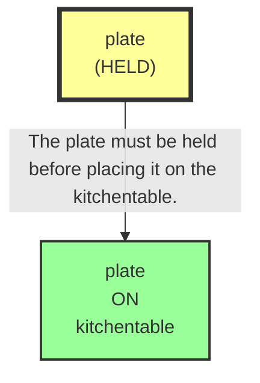
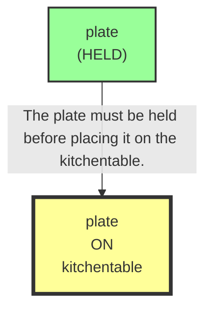
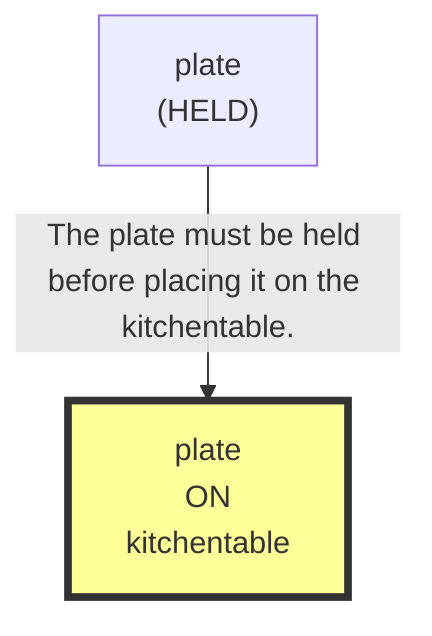

# 🚀 VirtualHome Agent Episode Log


### [GoalReasoner (Module A - Intent)] Output
```json
{
  "is_instruction_obviously_vague": false,
  "clarification_question": null,
  "target_object": "plate",
  "location_hint": "kitchentable",
  "reasoning_chain": [
    {
      "question": "Why does the user want this object?",
      "answer": "The user wants to place a plate in a specific location."
    },
    {
      "question": "Why is that important?",
      "answer": "The user is organizing or cleaning up after a meal, and the plate needs to be placed in a designated area."
    },
    {
      "question": "What fundamental need does this fulfill?",
      "answer": "The user wants to maintain order and cleanliness in the kitchen environment."
    },
    {
      "question": "Are there any deeper psychological or physical motivations?",
      "answer": "The user may be following a routine or preparing for the next task, which requires the plate to be in a specific location."
    }
  ],
  "deep_intent": "Maintain order and cleanliness in the kitchen environment.",
  "acceptable_alternatives_properties": [
    {
      "priority": 1,
      "description": "Other kitchen utensils or dishes that need to be placed on the kitchen table, such as a bowl or glass."
    },
    {
      "priority": 2,
      "description": "Kitchen items that are typically placed on the kitchen table, such as cutlery or a serving tray."
    },
    {
      "priority": 3,
      "description": "Items that are used during meal preparation or consumption and need to be stored or organized in the kitchen."
    },
    {
      "priority": 4,
      "description": "General kitchen objects that are part of a routine or task requiring placement in a specific location."
    }
  ]
}
```

### [PerceptionFilter] Output
```json
{
  "reasoning": "The goal is to place a plate on the kitchentable. The SDG requires the plate to be held before placing it on the kitchentable. Therefore, the plate itself is essential. Additionally, the kitchentable is explicitly mentioned as the target location. No alternative tools are needed since the task is straightforward and does not require additional functional tools or backups. The plate is the only object directly related to the goal, and the kitchentable is the only location required.",
  "selected_classes": [
    "character",
    "kitchentable",
    "plate"
  ],
  "raw_class_count": 50
}
```

### [LLMExecutor] Output
```json
{
  "reasoning": "The plate is already on the kitchentable, satisfying the goal node N1. However, the robot must hold the plate (node N2) before placing it on the kitchentable. Since the plate is already on the table, the robot needs to grab it to satisfy the 'HELD' state.",
  "satisfied_nodes": [
    "N1"
  ],
  "current_node_focus": "N2",
  "mapped_variables": {
    "?Washer": "sink(99)"
  },
  "action": "[grab] <plate> (75)"
}
```

### [RoboStateMultiTaskController] Output
```json
{
  "action": "[grab] <plate> (75)",
  "active_task_id": "task_1",
  "task_context": {
    "active_task_id": "task_1",
    "pending_task_ids": [],
    "satisfied_task_ids": []
  },
  "source": "llm_executor"
}
```
## Step 0
- **Action**: `[grab] <plate> (75)`
- **Action Success**: `True`
- **Action Message**: {'0': {'message': 'Success'}}
- **Active Task**: `task_1`
- **Decision Source**: `llm_executor`
- **Task Progress**: T4_qwen_M4_18=pending
- **SDG Status**:

- **Observed Items (17)**: plate(75), plate(76), plate(83), plate(84), plate(91), plate(103), plate(104), kitchentable(131), kitchentable(135), character(1), plate(67), plate(68), kitchen(11), livingroom(183), bedroom(241)...


### [PerceptionFilter] Output
```json
{
  "reasoning": "Reused cached class selection.",
  "selected_classes": [
    "character",
    "kitchentable",
    "plate"
  ],
  "raw_class_count": 50
}
```

### [LLMExecutor] Output
```json
{
  "reasoning": "The plate(75) is currently held in the right hand (HOLDS_RH plate(75)), and the goal is to place it on the kitchentable. However, the robot is not near the kitchentable. The next step is to walk to the kitchentable to position the plate correctly before placing it.",
  "satisfied_nodes": [
    "N2"
  ],
  "current_node_focus": "N1",
  "mapped_variables": {
    "?Washer": "sink(99)"
  },
  "action": "[walk] <kitchentable> (131)"
}
```

### [RoboStateMultiTaskController] Output
```json
{
  "action": "[walk] <kitchentable> (131)",
  "active_task_id": "task_1",
  "task_context": {
    "active_task_id": "task_1",
    "pending_task_ids": [],
    "satisfied_task_ids": []
  },
  "source": "llm_executor"
}
```
## Step 1
- **Action**: `[walk] <kitchentable> (131)`
- **Action Success**: `True`
- **Action Message**: {'0': {'message': 'Success'}}
- **Active Task**: `task_1`
- **Decision Source**: `llm_executor`
- **Task Progress**: T4_qwen_M4_18=pending
- **SDG Status**:

- **Observed Items (17)**: plate(75), plate(76), plate(83), plate(84), plate(91), plate(103), plate(104), kitchentable(131), kitchentable(135), character(1), plate(67), plate(68), kitchen(11), livingroom(183), bedroom(241)...


### [PerceptionFilter] Output
```json
{
  "reasoning": "Reused cached class selection.",
  "selected_classes": [
    "character",
    "kitchentable",
    "plate"
  ],
  "raw_class_count": 50
}
```

### [LLMExecutor] Output
```json
{
  "reasoning": "The plate(75) is currently held by the robot (as indicated by the state 'HOLDS_RH plate(75)'), and the next step is to place it on the kitchentable(131). Since the robot is already near the kitchentable(131) (confirmed by the previous [walk] action), the next logical action is to [putback] the plate on the kitchentable.",
  "satisfied_nodes": [
    "N2"
  ],
  "current_node_focus": "N1",
  "mapped_variables": {
    "?Washer": "sink(99)"
  },
  "action": "[putback] <plate> (75) <kitchentable> (131)"
}
```

### [RoboStateMultiTaskController] Output
```json
{
  "action": "[putback] <plate> (75) <kitchentable> (131)",
  "active_task_id": "task_1",
  "task_context": {
    "active_task_id": "task_1",
    "pending_task_ids": [],
    "satisfied_task_ids": []
  },
  "source": "llm_executor"
}
```
## Step 2
- **Action**: `[putback] <plate> (75) <kitchentable> (131)`
- **Action Success**: `True`
- **Action Message**: {'0': {'message': 'Success'}}
- **Active Task**: `task_1`
- **Decision Source**: `llm_executor`
- **Task Progress**: T4_qwen_M4_18=pending
- **SDG Status**:

- **Observed Items (17)**: plate(75), plate(76), plate(83), plate(84), plate(91), plate(103), plate(104), kitchentable(131), kitchentable(135), character(1), plate(67), plate(68), kitchen(11), livingroom(183), bedroom(241)...


### [PerceptionFilter] Output
```json
{
  "reasoning": "Reused cached class selection.",
  "selected_classes": [
    "character",
    "kitchentable",
    "plate"
  ],
  "raw_class_count": 50
}
```

### [LLMExecutor] Output
```json
{
  "reasoning": "The plate is already on the kitchentable(131) as per the Filtered Graph, and the goal is to ensure it remains there. However, the SDG requires the plate to be held before placing it on the table, which has already been satisfied in the past actions. Since the plate is already on the table and the task is complete, no further action is needed.",
  "satisfied_nodes": [
    "N1",
    "N2"
  ],
  "current_node_focus": "N1",
  "mapped_variables": {
    "?Washer": "sink(99)"
  },
  "action": "[wait]"
}
```

### [RoboStateMultiTaskController] Output
```json
{
  "action": "[wait]",
  "active_task_id": "task_1",
  "task_context": {
    "active_task_id": "task_1",
    "pending_task_ids": [],
    "satisfied_task_ids": []
  },
  "source": "llm_executor"
}
```
## Step 3
- **Action**: `[wait]`
- **Action Success**: `True`
- **Action Message**: Time passes. You waited for a while.
- **Active Task**: `task_1`
- **Decision Source**: `llm_executor`
- **Task Progress**: T4_qwen_M4_18=pending
- **SDG Status**:

- **Observed Items (17)**: plate(75), plate(76), plate(83), plate(84), plate(91), plate(103), plate(104), kitchentable(131), kitchentable(135), character(1), plate(67), plate(68), kitchen(11), livingroom(183), bedroom(241)...


### [PerceptionFilter] Output
```json
{
  "reasoning": "Reused cached class selection.",
  "selected_classes": [
    "character",
    "kitchentable",
    "plate"
  ],
  "raw_class_count": 50
}
```

### [LLMExecutor] Output
```json
{
  "reasoning": "The plate is already on the kitchentable(131) as per the Filtered Graph, and the goal is to ensure the plate is placed on the kitchentable. Since the plate is already on the kitchentable, the task is complete. However, the SDG requires the plate to be held before placing it, which has already been satisfied in the past actions. Therefore, no further action is needed.",
  "satisfied_nodes": [
    "N1",
    "N2"
  ],
  "current_node_focus": "N1",
  "mapped_variables": {
    "?Washer": "sink(99)"
  },
  "action": "[wait]"
}
```

### [RoboStateMultiTaskController] Output
```json
{
  "action": "[wait]",
  "active_task_id": "task_1",
  "task_context": {
    "active_task_id": "task_1",
    "pending_task_ids": [],
    "satisfied_task_ids": []
  },
  "source": "llm_executor"
}
```
## Step 4
- **Action**: `[wait]`
- **Action Success**: `True`
- **Action Message**: Time passes. You waited for a while.
- **Active Task**: `task_1`
- **Decision Source**: `llm_executor`
- **Task Progress**: T4_qwen_M4_18=pending
- **SDG Status**:

- **Observed Items (17)**: plate(75), plate(76), plate(83), plate(84), plate(91), plate(103), plate(104), kitchentable(131), kitchentable(135), character(1), plate(67), plate(68), kitchen(11), livingroom(183), bedroom(241)...


### [PerceptionFilter] Output
```json
{
  "reasoning": "Reused cached class selection.",
  "selected_classes": [
    "character",
    "kitchentable",
    "plate"
  ],
  "raw_class_count": 50
}
```

### [LLMExecutor] Output
```json
{
  "reasoning": "The plate is already on the kitchentable(131) as per the Filtered Graph, and the goal is to have the plate on the kitchentable. However, the SDG requires the plate to be held before placing it on the kitchentable. Since the plate is already on the kitchentable, the task is already satisfied, and no further action is needed.",
  "satisfied_nodes": [
    "N1"
  ],
  "current_node_focus": "N1",
  "mapped_variables": {
    "?Washer": "sink(99)"
  },
  "action": "[wait]"
}
```

### [RoboStateMultiTaskController] Output
```json
{
  "action": "[wait]",
  "active_task_id": "task_1",
  "task_context": {
    "active_task_id": "task_1",
    "pending_task_ids": [],
    "satisfied_task_ids": []
  },
  "source": "llm_executor"
}
```
## Step 5
- **Action**: `[wait]`
- **Action Success**: `True`
- **Action Message**: Time passes. You waited for a while.
- **Active Task**: `task_1`
- **Decision Source**: `llm_executor`
- **Task Progress**: T4_qwen_M4_18=pending
- **SDG Status**:

- **Observed Items (17)**: plate(75), plate(76), plate(83), plate(84), plate(91), plate(103), plate(104), kitchentable(131), kitchentable(135), character(1), plate(67), plate(68), kitchen(11), livingroom(183), bedroom(241)...


### [PerceptionFilter] Output
```json
{
  "reasoning": "Reused cached class selection.",
  "selected_classes": [
    "character",
    "kitchentable",
    "plate"
  ],
  "raw_class_count": 50
}
```

### [LLMExecutor] Output
```json
{
  "reasoning": "The plate(75) is already on the kitchentable(131) as per the Filtered Graph, which satisfies the SDG node N1. However, the SDG node N2 requires the plate to be held before placing it on the kitchentable. Since the plate is already on the table, there is no need to hold it again. Therefore, the task is already satisfied, and no further action is required.",
  "satisfied_nodes": [
    "N1"
  ],
  "current_node_focus": "N1",
  "mapped_variables": {
    "?Washer": "sink(99)"
  },
  "action": "[wait]"
}
```

### [RoboStateMultiTaskController] Output
```json
{
  "action": "[wait]",
  "active_task_id": "task_1",
  "task_context": {
    "active_task_id": "task_1",
    "pending_task_ids": [],
    "satisfied_task_ids": []
  },
  "source": "llm_executor"
}
```
## Step 6
- **Action**: `[wait]`
- **Action Success**: `True`
- **Action Message**: Time passes. You waited for a while.
- **Active Task**: `task_1`
- **Decision Source**: `llm_executor`
- **Task Progress**: T4_qwen_M4_18=pending
- **SDG Status**:

- **Observed Items (17)**: plate(75), plate(76), plate(83), plate(84), plate(91), plate(103), plate(104), kitchentable(131), kitchentable(135), character(1), plate(67), plate(68), kitchen(11), livingroom(183), bedroom(241)...


### [PerceptionFilter] Output
```json
{
  "reasoning": "Reused cached class selection.",
  "selected_classes": [
    "character",
    "kitchentable",
    "plate"
  ],
  "raw_class_count": 50
}
```

### [LLMExecutor] Output
```json
{
  "reasoning": "The plate(75) is already on the kitchentable(131) as per the Filtered Graph, which satisfies the SDG node N1. However, the SDG node N2 requires the plate to be held before placing it on the kitchentable. Since the plate is already on the table, there is no need to hold it again. Therefore, the task is already satisfied, and no further action is required.",
  "satisfied_nodes": [
    "N1"
  ],
  "current_node_focus": "N1",
  "mapped_variables": {
    "?Washer": "sink(99)"
  },
  "action": "[wait]"
}
```

### [RoboStateMultiTaskController] Output
```json
{
  "action": "[wait]",
  "active_task_id": "task_1",
  "task_context": {
    "active_task_id": "task_1",
    "pending_task_ids": [],
    "satisfied_task_ids": []
  },
  "source": "llm_executor"
}
```
