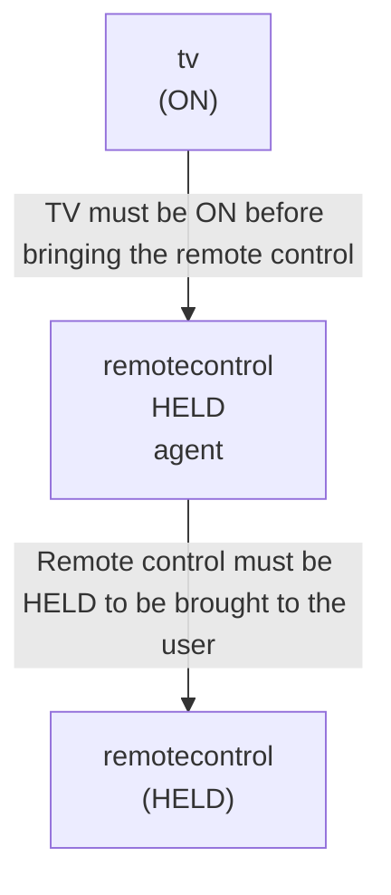
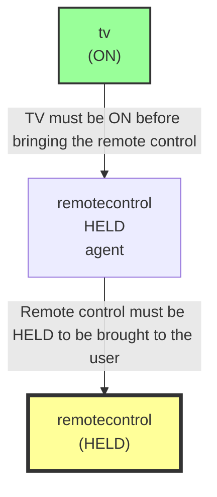
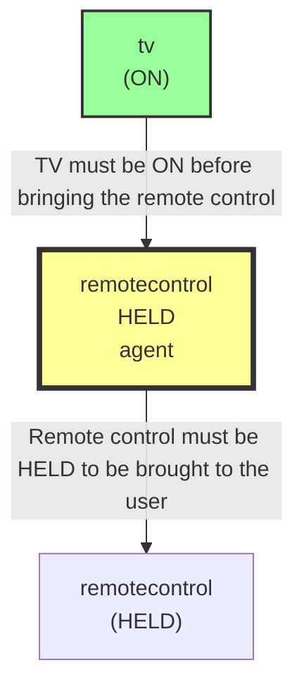

# 🚀 VirtualHome Agent Episode Log


### [GoalReasoner (Module A - Intent)] Output
```json
{
  "is_instruction_obviously_vague": false,
  "clarification_question": null,
  "target_object": "remote control",
  "location_hint": null,
  "reasoning_chain": [
    {
      "question": "Why does the user want the remote control?",
      "answer": "The user wants to control the TV (change channels, adjust volume, turn it off, etc.)."
    },
    {
      "question": "Why is controlling the TV important to them?",
      "answer": "The user wants to manage their viewing experience or stop watching content."
    },
    {
      "question": "What is the fundamental need here?",
      "answer": "The user wants to have agency over their media consumption and the TV's state without having to physically approach the device."
    },
    {
      "question": "Is there a deeper motivation?",
      "answer": "The user values convenience and comfort—they want to control their environment from their current position."
    }
  ],
  "deep_intent": "Enable the user to remotely control the TV's state and settings from their current location without physical proximity to the device.",
  "acceptable_alternatives_properties": [
    {
      "priority": 1,
      "description": "Another remote control compatible with the TV (e.g., a universal remote or a replacement remote for the same TV model)."
    },
    {
      "priority": 2,
      "description": "A smartphone or tablet with a TV control app or IR blaster capability that can send commands to the TV."
    },
    {
      "priority": 3,
      "description": "A voice-activated assistant or smart home device (e.g., Alexa, Google Home) that can control the TV via voice commands."
    },
    {
      "priority": 4,
      "description": "Direct physical interaction: the user manually approaching the TV to use its physical buttons or touch panel to control it (fallback if no remote alternatives exist)."
    }
  ]
}
```

### [RoboStateMultiTaskController] Output
```json
{
  "action": "[walk] <bathroom> (11)",
  "active_task_id": "task_1",
  "task_context": {
    "active_task_id": "task_1",
    "pending_task_ids": [],
    "satisfied_task_ids": []
  },
  "source": "room_frontier"
}
```
## Step 0
- **Action**: `[walk] <bathroom> (11)`
- **Action Success**: `True`
- **Action Message**: {'0': {'message': 'Success'}}
- **Active Task**: `task_1`
- **Decision Source**: `room_frontier`
- **Task Progress**: T4_claude_M1_01=pending
- **SDG Status**:

- **Observed Items (63)**: wall(262), wall(263), wall(264), wall(265), wall(266), wall(267), wall(268), wall(269), ceiling(270), ceiling(271), ceiling(272), ceiling(273), ceiling(274), ceiling(275), ceiling(276)...


### [RoboStateMultiTaskController] Output
```json
{
  "action": "[walk] <bedroom> (50)",
  "active_task_id": "task_1",
  "task_context": {
    "active_task_id": "task_1",
    "pending_task_ids": [],
    "satisfied_task_ids": []
  },
  "source": "room_frontier"
}
```
## Step 1
- **Action**: `[walk] <bedroom> (50)`
- **Action Success**: `True`
- **Action Message**: {'0': {'message': 'Success'}}
- **Active Task**: `task_1`
- **Decision Source**: `room_frontier`
- **Task Progress**: T4_claude_M1_01=pending
- **SDG Status**:

- **Observed Items (101)**: wall(262), wall(263), wall(264), wall(265), wall(266), wall(267), wall(268), wall(269), ceiling(270), ceiling(271), ceiling(272), ceiling(273), ceiling(274), ceiling(275), ceiling(276)...


### [PerceptionFilter] Output
```json
{
  "reasoning": "Fallback due to error.",
  "selected_classes": [
    "tv",
    "character",
    "remotecontrol"
  ],
  "raw_class_count": 61
}
```

### [LLMExecutor] Output
```json
{
  "reasoning": "Current state analysis: The character(1) is in bedroom(50), and remotecontrol(321) is also in bedroom(50) and marked as CLOSE to the character. The SDG requires: N3 (TV ON) - already satisfied, N2 (remotecontrol HELD by agent), and N1 (remotecontrol in HELD state). The TV is already ON in livingroom(261). The remote control is right next to me (CLOSE relation). I should grab it now since I'm already at the location. The remote is GRABBABLE and MOVABLE, so I can pick it up. After grabbing, I'll have satisfied N1 and N2, completing the task.",
  "satisfied_nodes": [
    "N3"
  ],
  "current_node_focus": "N1",
  "mapped_variables": {
    "remotecontrol": "remotecontrol(321)",
    "tv": "tv(300)"
  },
  "action": "[grab] <remotecontrol> (321)"
}
```

### [RoboStateMultiTaskController] Output
```json
{
  "action": "[grab] <remotecontrol> (321)",
  "active_task_id": "task_1",
  "task_context": {
    "active_task_id": "task_1",
    "pending_task_ids": [],
    "satisfied_task_ids": []
  },
  "source": "llm_executor"
}
```
## Step 2
- **Action**: `[grab] <remotecontrol> (321)`
- **Action Success**: `False`
- **Action Message**: temporary_unavailable: target disappeared; wait or search and retry
- **Active Task**: `task_1`
- **Decision Source**: `llm_executor`
- **Task Progress**: T4_claude_M1_01=pending
- **SDG Status**:

- **Observed Items (7)**: tv(300) [ON], character(1), bathroom(11), bedroom(50), kitchen(126), livingroom(261), remotecontrol(321) [OFF]


### [PerceptionFilter] Output
```json
{
  "reasoning": "Fallback due to error.",
  "selected_classes": [
    "tv",
    "character",
    "remotecontrol"
  ],
  "raw_class_count": 61
}
```

### [LLMExecutor] Output
```json
{
  "reasoning": "The SDG requires: (N3) TV must be ON, (N2) remote control must be HELD by agent, (N1) remote control state must be HELD. Current state: TV is already ON (N3 satisfied). The remote control (321) is in the bedroom and marked as CLOSE to character(1), but the previous [grab] attempt failed with 'temporary_unavailable' - the remote disappeared when I tried to grab it, indicating another person was using it. Per rule 13A, when an object disappears upon approach, I must [wait] for it to be returned rather than substitute or abort. The remote is still shown in the graph at bedroom(50) with CLOSE relation to character(1), so it has been returned. I am currently in bedroom(50) and the remote is CLOSE to me. I should now attempt to [grab] the remote control again.",
  "satisfied_nodes": [
    "N3"
  ],
  "current_node_focus": "N2",
  "mapped_variables": {
    "?RemoteControl": "remotecontrol(321)",
    "?TV": "tv(300)"
  },
  "action": "[grab] <remotecontrol> (321)"
}
```

### [RoboStateMultiTaskController] Output
```json
{
  "action": "[grab] <remotecontrol> (321)",
  "active_task_id": "task_1",
  "task_context": {
    "active_task_id": "task_1",
    "pending_task_ids": [],
    "satisfied_task_ids": []
  },
  "source": "llm_executor"
}
```
## Step 3
- **Action**: `[grab] <remotecontrol> (321)`
- **Action Success**: `False`
- **Action Message**: temporary_unavailable: target is temporarily hidden
- **Active Task**: `task_1`
- **Decision Source**: `llm_executor`
- **Task Progress**: T4_claude_M1_01=pending
- **SDG Status**:

- **Observed Items (7)**: tv(300) [ON], character(1), bathroom(11), bedroom(50), kitchen(126), livingroom(261), remotecontrol(321) [OFF]


### [RoboStateMultiTaskController] Output
```json
{
  "action": "[walk] <kitchen> (126)",
  "active_task_id": null,
  "task_context": {
    "active_task_id": null,
    "pending_task_ids": [
      "task_1"
    ],
    "satisfied_task_ids": []
  },
  "source": "loop_recovery_room_revisit"
}
```
## Step 4
- **Action**: `[walk] <kitchen> (126)`
- **Action Success**: `True`
- **Action Message**: {'0': {'message': 'Success'}}
- **Decision Source**: `loop_recovery_room_revisit`
- **Task Progress**: T4_claude_M1_01=pending
- **SDG Status**:
No SDG active.
- **Observed Items (172)**: wall(262), wall(263), wall(264), wall(265), wall(266), wall(267), wall(268), wall(269), ceiling(270), ceiling(271), ceiling(272), ceiling(273), ceiling(274), ceiling(275), ceiling(276)...


### [PerceptionFilter] Output
```json
{
  "reasoning": "Fallback due to error.",
  "selected_classes": [
    "tv",
    "character",
    "remotecontrol"
  ],
  "raw_class_count": 86
}
```

### [LLMExecutor] Output
```json
{
  "reasoning": "The current state shows that remotecontrol(321) is INSIDE bedroom(50) and marked as CLOSE to character(1), who is currently INSIDE kitchen(126). The past actions show two failed grab attempts due to 'temporary_unavailable' errors, indicating the remote was temporarily hidden (likely being used by someone else). The SDG requires: N3 (TV ON - already satisfied), N2 (remote HELD by agent), and N1 (remote in HELD state). Since the remote is now showing as CLOSE to the character despite being in the bedroom, and the previous grab attempts failed due to temporary unavailability, I should wait for the object to become available again rather than immediately retry. The 'temporary_unavailable' error with 'temporary: true' indicates this is a transient condition that will resolve.",
  "satisfied_nodes": [
    "N3"
  ],
  "current_node_focus": "N2",
  "mapped_variables": {
    "remotecontrol": "remotecontrol(321)",
    "tv": "tv(300)"
  },
  "action": "[wait]"
}
```

### [RoboStateMultiTaskController] Output
```json
{
  "action": "[wait]",
  "active_task_id": "task_1",
  "task_context": {
    "active_task_id": "task_1",
    "pending_task_ids": [],
    "satisfied_task_ids": []
  },
  "source": "llm_executor"
}
```
## Step 5
- **Action**: `[wait]`
- **Action Success**: `True`
- **Action Message**: Time passes. You waited for a while.
- **Active Task**: `task_1`
- **Decision Source**: `llm_executor`
- **Task Progress**: T4_claude_M1_01=pending
- **SDG Status**:

- **Observed Items (7)**: tv(300) [ON], character(1), bathroom(11), bedroom(50), kitchen(126), livingroom(261), remotecontrol(321) [OFF]


### [PerceptionFilter] Output
```json
{
  "reasoning": "Fallback due to error.",
  "selected_classes": [
    "tv",
    "character",
    "remotecontrol"
  ],
  "raw_class_count": 86
}
```

### [LLMExecutor] Output
```json
{
  "reasoning": "The current state shows that remotecontrol(321) is INSIDE bedroom(50) and marked as CLOSE to character(1), who is currently INSIDE kitchen(126). The SDG requires: N3 (TV ON - already satisfied), N2 (remotecontrol HELD by agent), and N1 (remotecontrol state HELD). Past attempts to grab remotecontrol(321) failed with 'temporary_unavailable' errors, indicating another person was using it. After waiting in step 5, the remote is now back in the graph at bedroom(50). Since the character is currently in kitchen(126) and the remote is in bedroom(50), I must walk to the bedroom first to get close to the remote, then grab it. The relation 'CLOSE character(1)' suggests the remote is nearby the character's current location or was recently there, but the explicit location 'INSIDE bedroom(50)' takes precedence. I need to walk to bedroom(50) to establish proximity before attempting to grab.",
  "satisfied_nodes": [
    "N3"
  ],
  "current_node_focus": "N2",
  "mapped_variables": {
    "remotecontrol": "remotecontrol(321)",
    "tv": "tv(300)"
  },
  "action": "[walk] <bedroom> (50)"
}
```

### [RoboStateMultiTaskController] Output
```json
{
  "action": "[walk] <bedroom> (50)",
  "active_task_id": "task_1",
  "task_context": {
    "active_task_id": "task_1",
    "pending_task_ids": [],
    "satisfied_task_ids": []
  },
  "source": "llm_executor"
}
```
## Step 6
- **Action**: `[walk] <bedroom> (50)`
- **Action Success**: `True`
- **Action Message**: {'0': {'message': 'Success'}}
- **Active Task**: `task_1`
- **Decision Source**: `llm_executor`
- **Task Progress**: T4_claude_M1_01=pending
- **SDG Status**:

- **Observed Items (7)**: tv(300) [ON], character(1), bathroom(11), bedroom(50), kitchen(126), livingroom(261), remotecontrol(321) [OFF]


### [PerceptionFilter] Output
```json
{
  "reasoning": "Fallback due to error.",
  "selected_classes": [
    "tv",
    "character",
    "remotecontrol"
  ],
  "raw_class_count": 86
}
```

### [LLMExecutor] Output
```json
{
  "reasoning": "Current state analysis: The TV is already ON (N3 satisfied). The remote control (321) is in the bedroom and marked as CLOSE to character(1), meaning I am near it. Previous attempts to grab it failed with 'temporary_unavailable' errors, indicating another person was using it. I waited in step 5, and now I'm back in the bedroom (step 6). The remote control is still showing as CLOSE to me and INSIDE bedroom(50). Since the temporary ban has likely expired (I waited and returned), I should now attempt to grab the remote control again. This will satisfy N1 (remotecontrol HELD) and N2 (remotecontrol HELD by agent), completing the SDG chain.",
  "satisfied_nodes": [
    "N3"
  ],
  "current_node_focus": "N1",
  "mapped_variables": {
    "remotecontrol": "remotecontrol(321)",
    "agent": "character(1)"
  },
  "action": "[grab] <remotecontrol> (321)"
}
```

### [RoboStateMultiTaskController] Output
```json
{
  "action": "[grab] <remotecontrol> (321)",
  "active_task_id": "task_1",
  "task_context": {
    "active_task_id": "task_1",
    "pending_task_ids": [],
    "satisfied_task_ids": []
  },
  "source": "llm_executor"
}
```
## Step 7
- **Action**: `[grab] <remotecontrol> (321)`
- **Action Success**: `True`
- **Action Message**: {'0': {'message': 'Success'}}
- **Active Task**: `task_1`
- **Decision Source**: `llm_executor`
- **Task Progress**: T4_claude_M1_01=done
- **SDG Status**:

- **Observed Items (7)**: tv(300) [ON], character(1), bathroom(11), bedroom(50), kitchen(126), livingroom(261), remotecontrol(321) [OFF]

