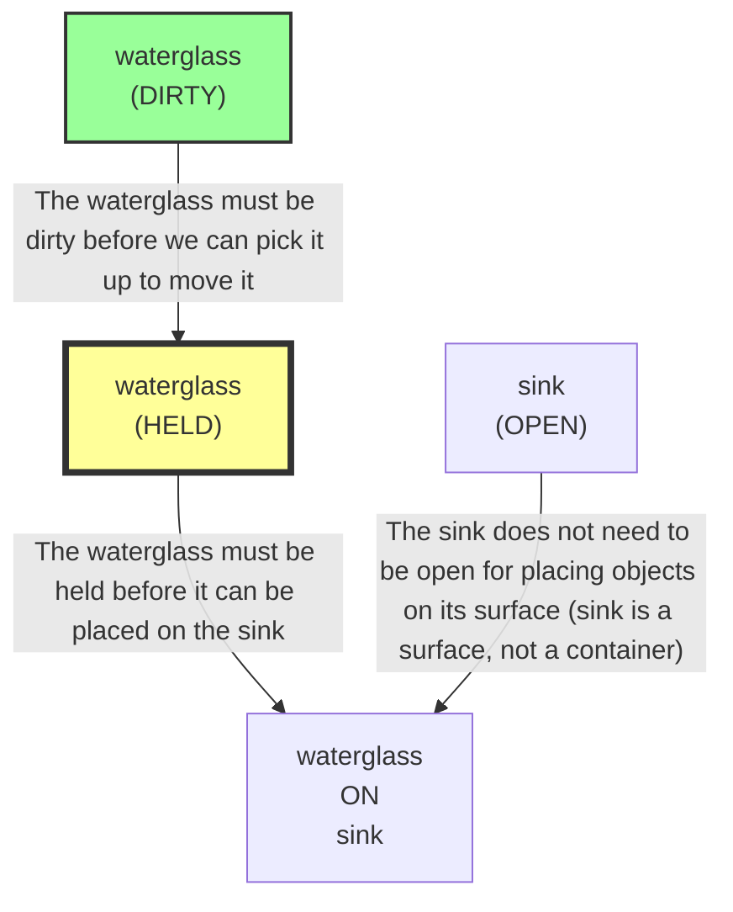
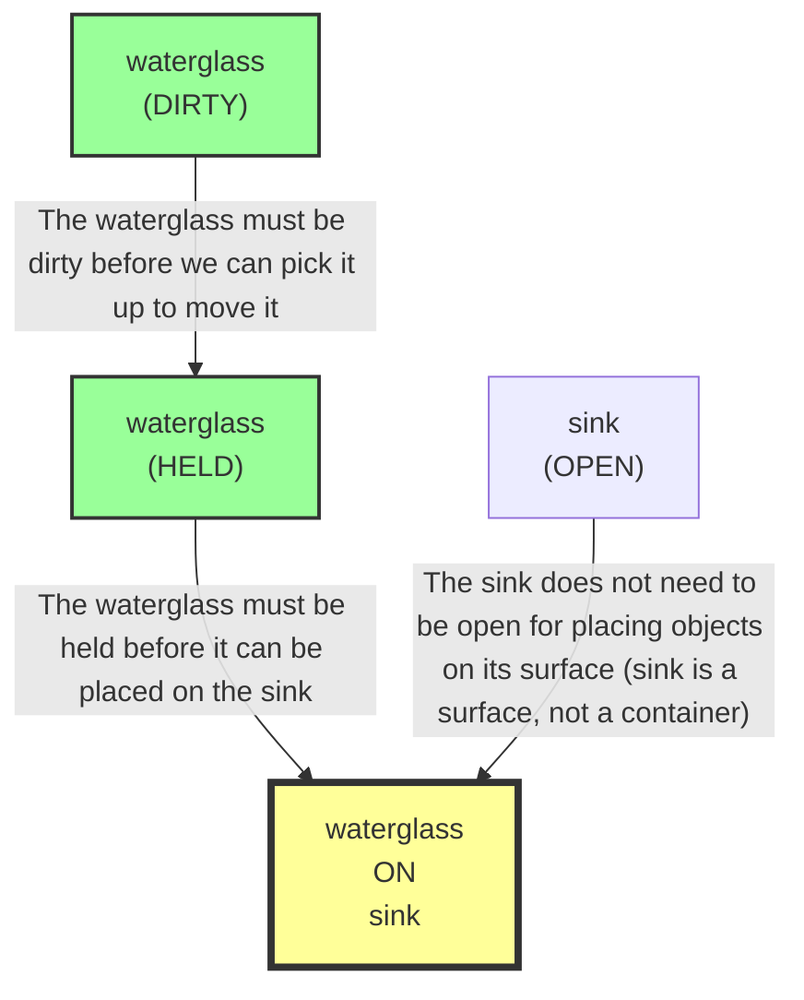

# 🚀 VirtualHome Agent Episode Log


### [GoalReasoner (Module A - Intent)] Output
```json
{
  "is_instruction_obviously_vague": false,
  "clarification_question": null,
  "target_object": "dirty water glasses",
  "location_hint": "sink",
  "reasoning_chain": [
    {
      "question": "Why does the user want dirty water glasses put in the sink?",
      "answer": "The user wants to remove dirty glasses from their current location (likely a table, counter, or other surface) to consolidate them in a designated cleaning area."
    },
    {
      "question": "Why is consolidating dirty glasses in the sink important?",
      "answer": "It maintains household organization, prevents clutter on surfaces, and groups items that need cleaning in a central location for efficient washing."
    },
    {
      "question": "What fundamental need does this fulfill?",
      "answer": "The user wants to maintain a clean, organized living space and establish a routine for managing used dishware."
    },
    {
      "question": "Is there a deeper motivation beyond just organization?",
      "answer": "Yes—the user wants to prevent hygiene issues (stagnant water, mold growth, odors) and maintain household cleanliness standards by promptly moving used items to the washing area."
    }
  ],
  "deep_intent": "Maintain household cleanliness and organization by promptly relocating used dishware to a designated cleaning area to prevent hygiene degradation and clutter accumulation.",
  "acceptable_alternatives_properties": [
    {
      "priority": 1,
      "description": "Other dirty drinking vessels (mugs, cups, tumblers) that contain residual liquid and need to be moved to the sink for washing."
    },
    {
      "priority": 2,
      "description": "Any dirty dishware or plates with food/liquid residue that should be consolidated in the sink or dishwasher for cleaning."
    },
    {
      "priority": 3,
      "description": "Used beverage containers or kitchenware that have been left on surfaces and need to be relocated to a cleaning station (sink, dishwasher, or washing area)."
    },
    {
      "priority": 4,
      "description": "Any household items that have accumulated on surfaces and should be moved to their designated storage or cleaning location to reduce clutter and maintain hygiene."
    }
  ]
}
```

### [PerceptionFilter] Output
```json
{
  "reasoning": "Fallback due to error.",
  "selected_classes": [
    "waterglass",
    "plate",
    "character",
    "dishwasher",
    "sink"
  ],
  "raw_class_count": 50
}
```

### [LLMExecutor] Output
```json
{
  "reasoning": "The task is to move dirty water glasses to the sink. Looking at the current Filtered Graph, I can identify waterglass(64) which has the 'DIRTY' state and is marked as 'CLOSE character(1)', meaning I am already near it. The SDG requires: N1 (waterglass is DIRTY - satisfied by waterglass(64)), N2 (waterglass must be HELD), N3 (waterglass must be ON sink), and N4 (sink OPEN - not required since sink is a flat surface, not a container). The character is currently in the kitchen(11) and waterglass(64) is CLOSE to the character, so I can immediately grab it. This is the first step toward satisfying N2 (HELD state) which is a prerequisite for N3 (placing on sink).",
  "satisfied_nodes": [
    "N1"
  ],
  "current_node_focus": "N2",
  "mapped_variables": {
    "waterglass": "waterglass(64)",
    "sink": "sink(155)"
  },
  "action": "[grab] <waterglass> (64)"
}
```

### [RoboStateMultiTaskController] Output
```json
{
  "action": "[grab] <waterglass> (64)",
  "active_task_id": "task_1",
  "task_context": {
    "active_task_id": "task_1",
    "pending_task_ids": [],
    "satisfied_task_ids": []
  },
  "source": "llm_executor"
}
```
## Step 0
- **Action**: `[grab] <waterglass> (64)`
- **Action Success**: `False`
- **Action Message**: temporary_unavailable: target disappeared; wait or search and retry
- **Active Task**: `task_1`
- **Decision Source**: `llm_executor`
- **Task Progress**: T4_claude_M1_03=pending
- **SDG Status**:

- **Observed Items (25)**: waterglass(64) [DIRTY], plate(67), plate(68), waterglass(71), waterglass(72), plate(75), plate(76), waterglass(79), waterglass(80), plate(83), plate(84), waterglass(87), waterglass(88), plate(91), waterglass(100)...


### [PerceptionFilter] Output
```json
{
  "reasoning": "Fallback due to error.",
  "selected_classes": [
    "waterglass",
    "plate",
    "character",
    "dishwasher",
    "sink"
  ],
  "raw_class_count": 50
}
```

### [LLMExecutor] Output
```json
{
  "reasoning": "The previous attempt to grab waterglass(64) failed with 'temporary_unavailable' error, indicating another person was using it. According to rule 13A, I should [wait] for the object to be returned. However, I now observe that waterglass(64) is still in the Filtered Graph with DIRTY state and CLOSE to character(1), meaning it has been returned and is now available. The object is close to me (character is CLOSE to waterglass(64)), so I can attempt to grab it again. This satisfies SDG node N1 (waterglass is DIRTY) and will progress toward N2 (waterglass must be HELD). After grabbing, I'll need to walk to the sink and place it there to satisfy N3.",
  "satisfied_nodes": [
    "N1"
  ],
  "current_node_focus": "N2",
  "mapped_variables": {
    "waterglass": "waterglass(64)",
    "sink": "sink(155)"
  },
  "action": "[grab] <waterglass> (64)"
}
```

### [RoboStateMultiTaskController] Output
```json
{
  "action": "[grab] <waterglass> (64)",
  "active_task_id": "task_1",
  "task_context": {
    "active_task_id": "task_1",
    "pending_task_ids": [],
    "satisfied_task_ids": []
  },
  "source": "llm_executor"
}
```
## Step 1
- **Action**: `[grab] <waterglass> (64)`
- **Action Success**: `False`
- **Action Message**: temporary_unavailable: target is temporarily hidden
- **Active Task**: `task_1`
- **Decision Source**: `llm_executor`
- **Task Progress**: T4_claude_M1_03=pending
- **SDG Status**:

- **Observed Items (25)**: waterglass(64) [DIRTY], plate(67), plate(68), waterglass(71), waterglass(72), plate(75), plate(76), waterglass(79), waterglass(80), plate(83), plate(84), waterglass(87), waterglass(88), plate(91), waterglass(100)...


### [RoboStateMultiTaskController] Output
```json
{
  "action": "[walk] <livingroom> (183)",
  "active_task_id": null,
  "task_context": {
    "active_task_id": null,
    "pending_task_ids": [
      "task_1"
    ],
    "satisfied_task_ids": []
  },
  "source": "loop_recovery_room_revisit"
}
```
## Step 2
- **Action**: `[walk] <livingroom> (183)`
- **Action Success**: `True`
- **Action Message**: {'0': {'message': 'Success'}}
- **Decision Source**: `loop_recovery_room_revisit`
- **Task Progress**: T4_claude_M1_03=pending
- **SDG Status**:
No SDG active.
- **Observed Items (159)**: wall(12), wall(13), wall(14), wall(15), wall(16), wall(17), wall(18), wall(19), wall(20), wall(21), floor(22), floor(23), floor(24), floor(25), floor(26)...


### [PerceptionFilter] Output
```json
{
  "reasoning": "Fallback due to error.",
  "selected_classes": [
    "waterglass",
    "plate",
    "character",
    "dishwasher",
    "sink"
  ],
  "raw_class_count": 59
}
```

### [LLMExecutor] Output
```json
{
  "reasoning": "The task is to move dirty water glasses to the sink. Looking at the current state:\n\n1. CURRENT LOCATION: character(1) is in livingroom(183), not in kitchen(11) where the glasses are.\n2. TARGET OBJECT: waterglass(64) is marked as DIRTY and is CLOSE to character(1), but the graph shows it's INSIDE kitchen(11). The relation 'CLOSE character(1)' suggests the character can interact with it despite being in livingroom. However, the previous two attempts to grab waterglass(64) failed with 'temporary_unavailable' errors, indicating another person was using it.\n3. ALTERNATIVE DIRTY GLASS: waterglass(64) is the only DIRTY glass in the current graph. All other waterglasses (71, 72, 79, 80, 87, 88, 100) have no DIRTY state.\n4. STRATEGY: Since waterglass(64) was temporarily unavailable in the last two steps, I should wait for it to become available again. The error message indicated it was 'temporarily hidden', which means someone else was using it. A [wait] action will allow the object to be returned.\n5. SDG REQUIREMENTS:\n   - N1: waterglass must be DIRTY ✓ (waterglass(64) is DIRTY)\n   - N2: waterglass must be HELD (not yet satisfied)\n   - N3: waterglass must be ON sink (not yet satisfied)\n   - N4: sink must be OPEN (not required per SDG edge explanation - sink is a surface, not a container)\n\nThe next logical step is to [wait] for waterglass(64) to become available again, then attempt to [grab] it.",
  "satisfied_nodes": [
    "N1"
  ],
  "current_node_focus": "N2",
  "mapped_variables": {
    "?DirtyGlass": "waterglass(64)",
    "?Sink": "sink(155)"
  },
  "action": "[wait]"
}
```

### [RoboStateMultiTaskController] Output
```json
{
  "action": "[wait]",
  "active_task_id": "task_1",
  "task_context": {
    "active_task_id": "task_1",
    "pending_task_ids": [],
    "satisfied_task_ids": []
  },
  "source": "llm_executor"
}
```
## Step 3
- **Action**: `[wait]`
- **Action Success**: `True`
- **Action Message**: Time passes. You waited for a while.
- **Active Task**: `task_1`
- **Decision Source**: `llm_executor`
- **Task Progress**: T4_claude_M1_03=pending
- **SDG Status**:

- **Observed Items (27)**: waterglass(64) [DIRTY], plate(67), plate(68), waterglass(71), waterglass(72), plate(75), plate(76), waterglass(79), waterglass(80), plate(83), plate(84), waterglass(87), waterglass(88), plate(91), waterglass(100)...


### [PerceptionFilter] Output
```json
{
  "reasoning": "Fallback due to error.",
  "selected_classes": [
    "waterglass",
    "plate",
    "character",
    "dishwasher",
    "sink"
  ],
  "raw_class_count": 59
}
```

### [LLMExecutor] Output
```json
{
  "reasoning": "The task requires moving dirty water glasses to the sink. Looking at the current Filtered Graph, I can see waterglass(64) is marked as DIRTY and is CLOSE to character(1) in the kitchen(11). The character is currently in livingroom(183), but waterglass(64) is still in kitchen(11) and marked as CLOSE to the character. This means the waterglass(64) that was temporarily unavailable has now reappeared in the kitchen. Since I just walked to livingroom(183) in step 2 and waited in step 3, I need to return to the kitchen to interact with the dirty waterglass. The SDG requires: N1 (waterglass is DIRTY - satisfied by waterglass(64)), N2 (waterglass must be HELD), and N3 (waterglass must be ON sink). I should now walk back to the kitchen to grab waterglass(64) which is the dirty glass that needs to be moved to the sink.",
  "satisfied_nodes": [
    "N1"
  ],
  "current_node_focus": "N2",
  "mapped_variables": {
    "waterglass": "waterglass(64)",
    "sink": "sink(155)"
  },
  "action": "[walk] <kitchen> (11)"
}
```

### [RoboStateMultiTaskController] Output
```json
{
  "action": "[walk] <kitchen> (11)",
  "active_task_id": "task_1",
  "task_context": {
    "active_task_id": "task_1",
    "pending_task_ids": [],
    "satisfied_task_ids": []
  },
  "source": "llm_executor"
}
```
## Step 4
- **Action**: `[walk] <kitchen> (11)`
- **Action Success**: `True`
- **Action Message**: {'0': {'message': 'Success'}}
- **Active Task**: `task_1`
- **Decision Source**: `llm_executor`
- **Task Progress**: T4_claude_M1_03=pending
- **SDG Status**:

- **Observed Items (27)**: waterglass(64) [DIRTY], plate(67), plate(68), waterglass(71), waterglass(72), plate(75), plate(76), waterglass(79), waterglass(80), plate(83), plate(84), waterglass(87), waterglass(88), plate(91), waterglass(100)...


### [PerceptionFilter] Output
```json
{
  "reasoning": "Fallback due to error.",
  "selected_classes": [
    "waterglass",
    "plate",
    "character",
    "dishwasher",
    "sink"
  ],
  "raw_class_count": 59
}
```

### [LLMExecutor] Output
```json
{
  "reasoning": "The task is to move dirty water glasses to the sink. Looking at the current Filtered Graph, I can see waterglass(64) is marked as DIRTY and is CLOSE to character(1) in the kitchen. This is the target object that matches the SDG requirement (N1: waterglass DIRTY state). The character is already in the kitchen and waterglass(64) is nearby (CLOSE relation). Previous attempts to grab waterglass(64) failed due to temporary unavailability, but the object is now visible in the graph with DIRTY state and CLOSE to character. I should attempt to grab it now since the temporary ban has been lifted and the object is available. After grabbing, I'll need to walk to the sink and place it there to satisfy N3 (waterglass ON sink).",
  "satisfied_nodes": [
    "N1"
  ],
  "current_node_focus": "N2",
  "mapped_variables": {
    "waterglass": "waterglass(64)",
    "sink": "sink(155)"
  },
  "action": "[grab] <waterglass> (64)"
}
```

### [RoboStateMultiTaskController] Output
```json
{
  "action": "[grab] <waterglass> (64)",
  "active_task_id": "task_1",
  "task_context": {
    "active_task_id": "task_1",
    "pending_task_ids": [],
    "satisfied_task_ids": []
  },
  "source": "llm_executor"
}
```
## Step 5
- **Action**: `[grab] <waterglass> (64)`
- **Action Success**: `True`
- **Action Message**: {'0': {'message': 'Success'}}
- **Active Task**: `task_1`
- **Decision Source**: `llm_executor`
- **Task Progress**: T4_claude_M1_03=pending
- **SDG Status**:

- **Observed Items (27)**: waterglass(64) [DIRTY], plate(67), plate(68), waterglass(71), waterglass(72), plate(75), plate(76), waterglass(79), waterglass(80), plate(83), plate(84), waterglass(87), waterglass(88), plate(91), waterglass(100)...


### [PerceptionFilter] Output
```json
{
  "reasoning": "Fallback due to error.",
  "selected_classes": [
    "waterglass",
    "plate",
    "character",
    "dishwasher",
    "sink"
  ],
  "raw_class_count": 59
}
```

### [LLMExecutor] Output
```json
{
  "reasoning": "Current state analysis: The character is holding waterglass(64) which has the DIRTY state (satisfying N1). The character is CLOSE to waterglass(64) and HOLDS_RH waterglass(64), meaning N2 (HELD state) is satisfied. Now I need to move this dirty water glass to the sink to satisfy N3 (waterglass ON sink). The sink(155) is in the kitchen(11), and the character is already in the kitchen. I must walk to the sink first (PROXIMITY RULE - CRITICAL), then place the glass on the sink using [putback]. The sink is a flat surface (not a container with a lid), so I use [putback] not [putin].",
  "satisfied_nodes": [
    "N1",
    "N2"
  ],
  "current_node_focus": "N3",
  "mapped_variables": {
    "?Washer": "sink(155)"
  },
  "action": "[walk] <sink> (155)"
}
```

### [RoboStateMultiTaskController] Output
```json
{
  "action": "[walk] <sink> (155)",
  "active_task_id": "task_1",
  "task_context": {
    "active_task_id": "task_1",
    "pending_task_ids": [],
    "satisfied_task_ids": []
  },
  "source": "llm_executor"
}
```
## Step 6
- **Action**: `[walk] <sink> (155)`
- **Action Success**: `True`
- **Action Message**: {'0': {'message': 'Success'}}
- **Active Task**: `task_1`
- **Decision Source**: `llm_executor`
- **Task Progress**: T4_claude_M1_03=pending
- **SDG Status**:

- **Observed Items (27)**: waterglass(64) [DIRTY], plate(67), plate(68), waterglass(71), waterglass(72), plate(75), plate(76), waterglass(79), waterglass(80), plate(83), plate(84), waterglass(87), waterglass(88), plate(91), waterglass(100)...


### [PerceptionFilter] Output
```json
{
  "reasoning": "Fallback due to error.",
  "selected_classes": [
    "waterglass",
    "plate",
    "character",
    "dishwasher",
    "sink"
  ],
  "raw_class_count": 59
}
```

### [LLMExecutor] Output
```json
{
  "reasoning": "Current state analysis: I am holding waterglass(64) which is DIRTY, and I am CLOSE to sink(155). The SDG requires: N1 (waterglass DIRTY - satisfied), N2 (waterglass HELD - satisfied), N3 (waterglass ON sink - NOT satisfied), N4 (sink OPEN - not required per SDG edges). I just walked to the sink in step 6, so I am now positioned at the sink. The next logical action is to place the dirty water glass onto the sink surface using [putback]. This will satisfy N3 and complete the primary goal. Note: sink is a flat surface (not a container with a lid), so I use [putback] not [putin], and I do NOT need to [open] it.",
  "satisfied_nodes": [
    "N1",
    "N2"
  ],
  "current_node_focus": "N3",
  "mapped_variables": {
    "?Washer": "sink(155)"
  },
  "action": "[putback] <waterglass> (64) <sink> (155)"
}
```

### [RoboStateMultiTaskController] Output
```json
{
  "action": "[putback] <waterglass> (64) <sink> (155)",
  "active_task_id": "task_1",
  "task_context": {
    "active_task_id": "task_1",
    "pending_task_ids": [],
    "satisfied_task_ids": []
  },
  "source": "llm_executor"
}
```
## Step 7
- **Action**: `[putback] <waterglass> (64) <sink> (155)`
- **Action Success**: `True`
- **Action Message**: {'0': {'message': 'Success'}}
- **Active Task**: `task_1`
- **Decision Source**: `llm_executor`
- **Task Progress**: T4_claude_M1_03=done
- **SDG Status**:

- **Observed Items (27)**: waterglass(64) [DIRTY], plate(67), plate(68), waterglass(71), waterglass(72), plate(75), plate(76), waterglass(79), waterglass(80), plate(83), plate(84), waterglass(87), waterglass(88), plate(91), waterglass(100)...

