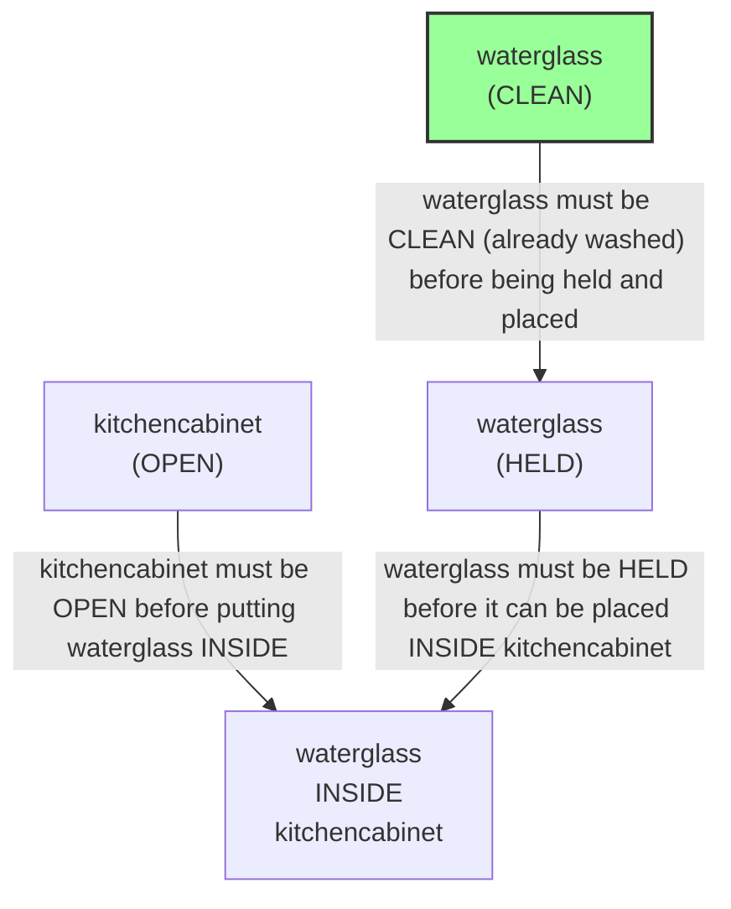
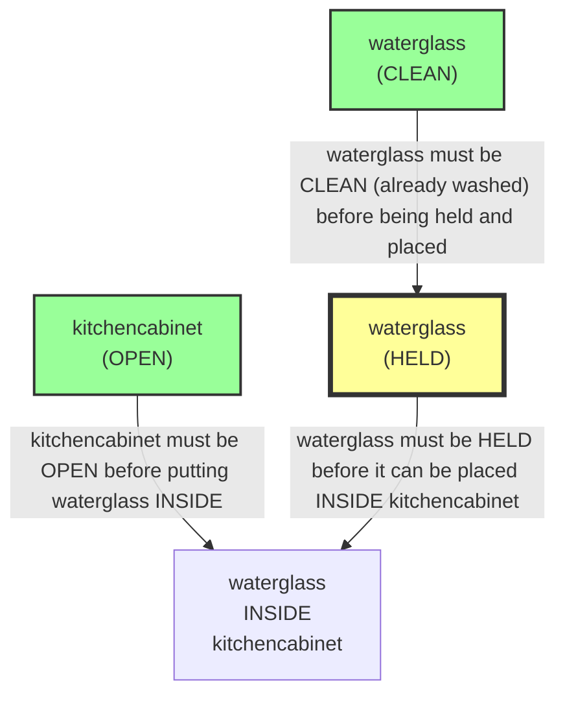
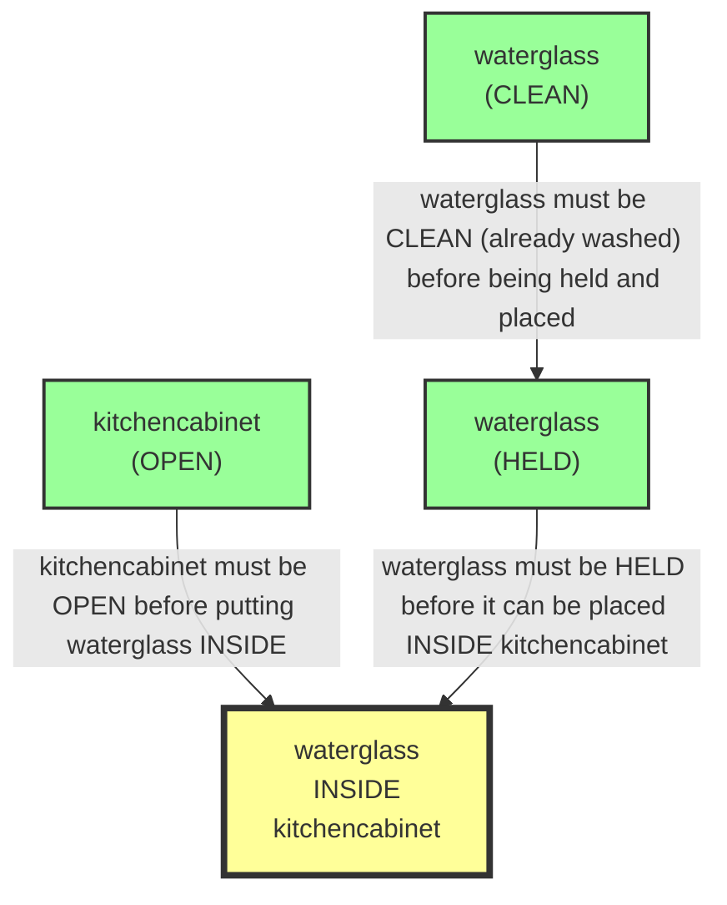

# 🚀 VirtualHome Agent Episode Log


### [GoalReasoner (Module A - Intent)] Output
```json
{
  "is_instruction_obviously_vague": true,
  "clarification_question": "Which kitchen cabinet should I put the water glass in? Please specify the cabinet location (e.g., 'the cabinet above the sink', 'the left cabinet next to the refrigerator', 'the cabinet to the right of the stove') or describe which shelf/section you prefer.",
  "target_object": "water glass (recently washed)",
  "location_hint": "kitchen cabinet (unspecified which one)",
  "reasoning_chain": [
    {
      "question": "Why does the user want the water glass put inside a cabinet?",
      "answer": "To store and organize the washed glass in a designated storage location."
    },
    {
      "question": "Why is storing it in a cabinet important?",
      "answer": "To keep dishes organized, protected, and out of the way in a typical household storage system."
    },
    {
      "question": "What fundamental need does this fulfill?",
      "answer": "Maintaining household organization and proper storage of clean dishware."
    },
    {
      "question": "Are there deeper motivations?",
      "answer": "Yes—the user wants to preserve the cleanliness of the washed item and maintain an orderly kitchen environment."
    }
  ],
  "deep_intent": "Store a clean drinking glass in an appropriate kitchen storage location to maintain household organization and preserve cleanliness.",
  "acceptable_alternatives_properties": [
    {
      "priority": 1,
      "description": "Place the water glass on a kitchen shelf, counter, or dish rack if the cabinet is not accessible or preferred."
    },
    {
      "priority": 2,
      "description": "Store the glass in a different kitchen cabinet or cupboard that is open or easily accessible."
    },
    {
      "priority": 3,
      "description": "Place the glass in a kitchen drawer designed for dishware or glassware storage."
    },
    {
      "priority": 4,
      "description": "Store the glass in a pantry, dining room cabinet, or other household storage area if kitchen cabinets are unavailable."
    }
  ]
}
```

### [PerceptionFilter] Output
```json
{
  "reasoning": "Fallback due to error.",
  "selected_classes": [
    "kitchencabinet",
    "character",
    "sink",
    "stove",
    "waterglass"
  ],
  "raw_class_count": 50
}
```

### [LLMExecutor] Output
```json
{
  "reasoning": "The Goal Intent indicates the instruction is vague about WHICH kitchen cabinet to use. The clarification_question asks me to specify which cabinet location. However, I observe that the Filtered Graph shows multiple kitchen cabinets (138-145), all currently OPEN. The task requires: (1) waterglass to be CLEAN (✓ waterglass(64) is CLEAN), (2) waterglass to be HELD (need to grab it), (3) kitchencabinet to be OPEN (✓ all are open), and (4) waterglass INSIDE kitchencabinet (final goal). Since the user's instruction is genuinely vague about WHICH cabinet, and the clarification_question is explicitly provided in the Goal Intent, I must use the [ask] action to request clarification before proceeding with physical actions. This is SITUATION 1 (Ambiguity) per rule 11.",
  "satisfied_nodes": [
    "N4"
  ],
  "current_node_focus": "N1 (and subsequently N2, N3)",
  "mapped_variables": {
    "?waterglass": "waterglass(64)",
    "?kitchencabinet": "kitchencabinet(138-145) - AMBIGUOUS, awaiting clarification"
  },
  "action": "[ask] Which kitchen cabinet should I put the water glass in? Please specify the cabinet location (e.g., 'the cabinet above the sink', 'the left cabinet next to the refrigerator', 'the cabinet to the right of the stove') or describe which shelf/section you prefer."
}
```

### [RoboStateMultiTaskController] Output
```json
{
  "action": "[ask] Which kitchen cabinet should I put the water glass in? Please specify the cabinet location (e.g., 'the cabinet above the sink', 'the left cabinet next to the refrigerator', 'the cabinet to the right of the stove') or describe which shelf/section you prefer.",
  "active_task_id": "task_1",
  "task_context": {
    "active_task_id": "task_1",
    "pending_task_ids": [],
    "satisfied_task_ids": []
  },
  "source": "llm_executor"
}
```
## Step 0
- **Action**: `[ask] Which kitchen cabinet should I put the water glass in? Please specify the cabinet location (e.g., 'the cabinet above the sink', 'the left cabinet next to the refrigerator', 'the cabinet to the right of the stove') or describe which shelf/section you prefer.`
- **Action Success**: `True`
- **Action Message**: nothing to claim
- **Active Task**: `task_1`
- **Decision Source**: `llm_executor`
- **Task Progress**: T4_claude_M4_17=pending
- **SDG Status**:

- **Observed Items (24)**: waterglass(64) [CLEAN,EMPTY], waterglass(71) [DIRTY], waterglass(72) [DIRTY], waterglass(79), waterglass(80), waterglass(87), waterglass(88), waterglass(100), kitchencabinet(138) [OPEN], kitchencabinet(139) [OPEN], kitchencabinet(140) [OPEN], kitchencabinet(141) [OPEN], kitchencabinet(142) [OPEN], kitchencabinet(143) [OPEN], kitchencabinet(144) [OPEN]...


### [PerceptionFilter] Output
```json
{
  "reasoning": "Fallback due to error.",
  "selected_classes": [
    "kitchencabinet",
    "character",
    "sink",
    "stove",
    "waterglass"
  ],
  "raw_class_count": 50
}
```

### [LLMExecutor] Output
```json
{
  "reasoning": "The clarification has been provided (though the user's response was 'nothing to claim', which means no specific cabinet was designated). However, I have multiple OPEN kitchen cabinets available (138-145) and a CLEAN waterglass(64) that is CLOSE to the character. The SDG requires: (1) waterglass HELD, (2) kitchencabinet OPEN, (3) waterglass INSIDE kitchencabinet. Since N1 (kitchencabinet OPEN) is already satisfied by multiple cabinets, and N4 (waterglass CLEAN) is satisfied by waterglass(64), I must now satisfy N3 (waterglass HELD) by grabbing waterglass(64), which is already CLOSE to me. This is the next logical step in the dependency chain.",
  "satisfied_nodes": [
    "N1",
    "N4"
  ],
  "current_node_focus": "N3",
  "mapped_variables": {
    "?waterglass": "waterglass(64)",
    "?kitchencabinet": "kitchencabinet(138)"
  },
  "action": "[grab] <waterglass> (64)"
}
```

### [RoboStateMultiTaskController] Output
```json
{
  "action": "[grab] <waterglass> (64)",
  "active_task_id": "task_1",
  "task_context": {
    "active_task_id": "task_1",
    "pending_task_ids": [],
    "satisfied_task_ids": []
  },
  "source": "llm_executor"
}
```
## Step 1
- **Action**: `[grab] <waterglass> (64)`
- **Action Success**: `True`
- **Action Message**: {'0': {'message': 'Success'}}
- **Active Task**: `task_1`
- **Decision Source**: `llm_executor`
- **Task Progress**: T4_claude_M4_17=pending
- **SDG Status**:

- **Observed Items (24)**: waterglass(64) [CLEAN,EMPTY], waterglass(71) [DIRTY], waterglass(72) [DIRTY], waterglass(79), waterglass(80), waterglass(87), waterglass(88), waterglass(100), kitchencabinet(138) [OPEN], kitchencabinet(139) [OPEN], kitchencabinet(140) [OPEN], kitchencabinet(141) [OPEN], kitchencabinet(142) [OPEN], kitchencabinet(143) [OPEN], kitchencabinet(144) [OPEN]...


### [PerceptionFilter] Output
```json
{
  "reasoning": "Fallback due to error.",
  "selected_classes": [
    "kitchencabinet",
    "character",
    "sink",
    "stove",
    "waterglass"
  ],
  "raw_class_count": 50
}
```

### [LLMExecutor] Output
```json
{
  "reasoning": "The clarification has been received (though the user's response was 'nothing to claim', indicating no specific cabinet was designated). I have already washed waterglass(64) and grabbed it (it is now HELD_RH). The SDG requires: N1 (kitchencabinet OPEN), N2 (waterglass INSIDE kitchencabinet), N3 (waterglass HELD), and N4 (waterglass CLEAN). Currently satisfied: N3 (waterglass is HELD), N4 (waterglass is CLEAN). Multiple kitchencabinets are available and all are already OPEN (N1 satisfied). Since no specific cabinet was designated and the clarification rule forbids further [ask] actions, I must autonomously select an appropriate cabinet. I will use kitchencabinet(138) as it is the first available open cabinet. I must first walk to it to be in proximity, then execute [putin] to place the glass inside.",
  "satisfied_nodes": [
    "N3",
    "N4",
    "N1"
  ],
  "current_node_focus": "N2",
  "mapped_variables": {
    "?kitchencabinet": "kitchencabinet(138)"
  },
  "action": "[walk] <kitchencabinet> (138)"
}
```

### [RoboStateMultiTaskController] Output
```json
{
  "action": "[walk] <kitchencabinet> (138)",
  "active_task_id": "task_1",
  "task_context": {
    "active_task_id": "task_1",
    "pending_task_ids": [],
    "satisfied_task_ids": []
  },
  "source": "llm_executor"
}
```
## Step 2
- **Action**: `[walk] <kitchencabinet> (138)`
- **Action Success**: `True`
- **Action Message**: {'0': {'message': 'Success'}}
- **Active Task**: `task_1`
- **Decision Source**: `llm_executor`
- **Task Progress**: T4_claude_M4_17=pending
- **SDG Status**:

- **Observed Items (24)**: waterglass(64) [CLEAN,EMPTY], waterglass(71) [DIRTY], waterglass(72) [DIRTY], waterglass(79), waterglass(80), waterglass(87), waterglass(88), waterglass(100), kitchencabinet(138) [OPEN], kitchencabinet(139) [OPEN], kitchencabinet(140) [OPEN], kitchencabinet(141) [OPEN], kitchencabinet(142) [OPEN], kitchencabinet(143) [OPEN], kitchencabinet(144) [OPEN]...


### [PerceptionFilter] Output
```json
{
  "reasoning": "Fallback due to error.",
  "selected_classes": [
    "kitchencabinet",
    "character",
    "sink",
    "stove",
    "waterglass"
  ],
  "raw_class_count": 50
}
```

### [LLMExecutor] Output
```json
{
  "reasoning": "The clarification has been provided (though the user's response was 'nothing to claim', indicating they did not specify a particular cabinet). However, I have already received a clarification attempt, and the Clarification Rule now forbids further [ask] actions. I must proceed autonomously.\n\nCurrent state:\n- waterglass(64) is CLEAN, EMPTY, and I am HOLDING it (HOLDS_RH relation)\n- I am CLOSE to kitchencabinet(138), which is OPEN\n- The SDG requires: N1 (cabinet OPEN) ✓, N3 (waterglass HELD) ✓, N4 (waterglass CLEAN) ✓, N2 (waterglass INSIDE cabinet) ✗\n\nAll prerequisites are satisfied. The cabinet(138) is already OPEN and I am holding the clean waterglass. I just walked to the cabinet in step 2, so I should not repeat the walk. I am now in position to execute the final action: [putin] the waterglass into the open cabinet.\n\nSince kitchencabinet has the 'CONTAINERS' property and is OPEN, I can directly [putin] the glass into it.",
  "satisfied_nodes": [
    "N1",
    "N3",
    "N4"
  ],
  "current_node_focus": "N2",
  "mapped_variables": {
    "?kitchencabinet": "kitchencabinet(138)"
  },
  "action": "[putin] <waterglass> (64) <kitchencabinet> (138)"
}
```

### [RoboStateMultiTaskController] Output
```json
{
  "action": "[putin] <waterglass> (64) <kitchencabinet> (138)",
  "active_task_id": "task_1",
  "task_context": {
    "active_task_id": "task_1",
    "pending_task_ids": [],
    "satisfied_task_ids": []
  },
  "source": "llm_executor"
}
```
## Step 3
- **Action**: `[putin] <waterglass> (64) <kitchencabinet> (138)`
- **Action Success**: `True`
- **Action Message**: {'0': {'message': 'Success'}}
- **Active Task**: `task_1`
- **Decision Source**: `llm_executor`
- **Task Progress**: T4_claude_M4_17=done
- **SDG Status**:

- **Observed Items (24)**: waterglass(64) [CLEAN,EMPTY], waterglass(71) [DIRTY], waterglass(72) [DIRTY], waterglass(79), waterglass(80), waterglass(87), waterglass(88), waterglass(100), kitchencabinet(138) [OPEN], kitchencabinet(139) [OPEN], kitchencabinet(140) [OPEN], kitchencabinet(141) [OPEN], kitchencabinet(142) [OPEN], kitchencabinet(143) [OPEN], kitchencabinet(144) [OPEN]...

