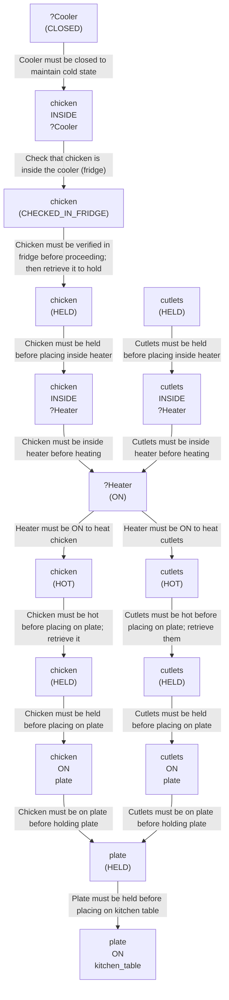

# 🚀 VirtualHome Agent Episode Log


### [GoalReasoner (Module A - Intent)] Output
```json
{
  "is_instruction_obviously_vague": false,
  "clarification_question": null,
  "target_object": "chicken and cutlets",
  "location_hint": "fridge (source), kitchen table (destination)",
  "reasoning_chain": [
    {
      "question": "Why does the user want to heat chicken and cutlets?",
      "answer": "To make them warm and ready for consumption; heating makes them palatable and safe to eat."
    },
    {
      "question": "Why place them on a plate and then on the kitchen table?",
      "answer": "To present the food in a consumable form at a convenient location for eating or serving."
    },
    {
      "question": "What is the fundamental need here?",
      "answer": "The user wants to prepare a meal—specifically, to make cooked protein available for eating at a designated dining location."
    },
    {
      "question": "Is there a deeper intent beyond just eating?",
      "answer": "The user wants to satisfy hunger and have a ready-to-eat meal presented in an organized, accessible manner at the dining area."
    }
  ],
  "deep_intent": "Prepare and present a warm, ready-to-eat protein-based meal at a convenient dining location for consumption.",
  "acceptable_alternatives_properties": [
    {
      "priority": 1,
      "description": "Other cooked protein items (e.g., turkey, beef, pork, fish) that can be heated in the microwave and served on a plate at the table."
    },
    {
      "priority": 2,
      "description": "Pre-cooked or partially cooked protein dishes (e.g., meatballs, grilled chicken breast, roasted meat) that require reheating and plating."
    },
    {
      "priority": 3,
      "description": "Hot prepared meals or leftovers (e.g., casseroles, stews, rice-based dishes with protein) that can be microwaved and served on a plate."
    },
    {
      "priority": 4,
      "description": "Ready-to-eat or quick-preparation protein sources (e.g., canned tuna, deli meat, cheese) that can be arranged on a plate and placed at the table without heating, if the fridge is empty of the specified items."
    }
  ]
}
```

### [PerceptionFilter] Output
```json
{
  "reasoning": "Fallback due to error.",
  "selected_classes": [
    "fridge",
    "plate",
    "character",
    "cutlets",
    "chicken",
    "microwave"
  ],
  "raw_class_count": 45
}
```

### [LLMExecutor] Output
```json
{
  "reasoning": "Fallback due to error.",
  "satisfied_nodes": [],
  "current_node_focus": "",
  "mapped_variables": {},
  "action": "WAIT"
}
```

### [RoboStateMultiTaskController] Output
```json
{
  "action": "[wait]",
  "active_task_id": "task_1",
  "task_context": {
    "active_task_id": "task_1",
    "pending_task_ids": [],
    "satisfied_task_ids": []
  },
  "source": "llm_executor"
}
```
## Step 0
- **Action**: `[wait]`
- **Action Success**: `True`
- **Action Message**: Time passes. You waited for a while.
- **Active Task**: `task_1`
- **Decision Source**: `llm_executor`
- **Task Progress**: T4_claude_P1_03=pending
- **SDG Status**:

- **Observed Items (16)**: plate(170), plate(171), plate(172), plate(173), plate(177), plate(178), plate(184), fridge(225) [OPEN], microwave(234) [CLOSED,OFF], character(1), chicken(241) [COLD], cutlets(242) [COLD], bathroom(11), bedroom(50), kitchen(126)...


### [PerceptionFilter] Output
```json
{
  "reasoning": "Fallback due to error.",
  "selected_classes": [
    "fridge",
    "plate",
    "character",
    "cutlets",
    "chicken",
    "microwave"
  ],
  "raw_class_count": 45
}
```

### [LLMExecutor] Output
```json
{
  "reasoning": "Fallback due to error.",
  "satisfied_nodes": [],
  "current_node_focus": "",
  "mapped_variables": {},
  "action": "WAIT"
}
```

### [RoboStateMultiTaskController] Output
```json
{
  "action": "[wait]",
  "active_task_id": "task_1",
  "task_context": {
    "active_task_id": "task_1",
    "pending_task_ids": [],
    "satisfied_task_ids": []
  },
  "source": "llm_executor"
}
```
## Step 1
- **Action**: `[wait]`
- **Action Success**: `True`
- **Action Message**: Time passes. You waited for a while.
- **Active Task**: `task_1`
- **Decision Source**: `llm_executor`
- **Task Progress**: T4_claude_P1_03=pending
- **SDG Status**:

- **Observed Items (16)**: plate(170), plate(171), plate(172), plate(173), plate(177), plate(178), plate(184), fridge(225) [OPEN], microwave(234) [CLOSED,OFF], character(1), chicken(241) [COLD], cutlets(242) [COLD], bathroom(11), bedroom(50), kitchen(126)...


### [PerceptionFilter] Output
```json
{
  "reasoning": "Fallback due to error.",
  "selected_classes": [
    "fridge",
    "plate",
    "character",
    "cutlets",
    "chicken",
    "microwave"
  ],
  "raw_class_count": 45
}
```

### [LLMExecutor] Output
```json
{
  "reasoning": "Fallback due to error.",
  "satisfied_nodes": [],
  "current_node_focus": "",
  "mapped_variables": {},
  "action": "WAIT"
}
```

### [RoboStateMultiTaskController] Output
```json
{
  "action": "[wait]",
  "active_task_id": "task_1",
  "task_context": {
    "active_task_id": "task_1",
    "pending_task_ids": [],
    "satisfied_task_ids": []
  },
  "source": "llm_executor"
}
```
## Step 2
- **Action**: `[wait]`
- **Action Success**: `True`
- **Action Message**: Time passes. You waited for a while.
- **Active Task**: `task_1`
- **Decision Source**: `llm_executor`
- **Task Progress**: T4_claude_P1_03=pending
- **SDG Status**:

- **Observed Items (16)**: plate(170), plate(171), plate(172), plate(173), plate(177), plate(178), plate(184), fridge(225) [OPEN], microwave(234) [CLOSED,OFF], character(1), chicken(241) [COLD], cutlets(242) [COLD], bathroom(11), bedroom(50), kitchen(126)...


### [PerceptionFilter] Output
```json
{
  "reasoning": "Fallback due to error.",
  "selected_classes": [
    "fridge",
    "plate",
    "character",
    "cutlets",
    "chicken",
    "microwave"
  ],
  "raw_class_count": 45
}
```

### [LLMExecutor] Output
```json
{
  "reasoning": "Fallback due to error.",
  "satisfied_nodes": [],
  "current_node_focus": "",
  "mapped_variables": {},
  "action": "WAIT"
}
```

### [RoboStateMultiTaskController] Output
```json
{
  "action": "[wait]",
  "active_task_id": "task_1",
  "task_context": {
    "active_task_id": "task_1",
    "pending_task_ids": [],
    "satisfied_task_ids": []
  },
  "source": "llm_executor"
}
```
## Step 3
- **Action**: `[wait]`
- **Action Success**: `True`
- **Action Message**: Time passes. You waited for a while.
- **Active Task**: `task_1`
- **Decision Source**: `llm_executor`
- **Task Progress**: T4_claude_P1_03=pending
- **SDG Status**:

- **Observed Items (16)**: plate(170), plate(171), plate(172), plate(173), plate(177), plate(178), plate(184), fridge(225) [OPEN], microwave(234) [CLOSED,OFF], character(1), chicken(241) [COLD], cutlets(242) [COLD], bathroom(11), bedroom(50), kitchen(126)...


### [PerceptionFilter] Output
```json
{
  "reasoning": "Fallback due to error.",
  "selected_classes": [
    "fridge",
    "plate",
    "character",
    "cutlets",
    "chicken",
    "microwave"
  ],
  "raw_class_count": 45
}
```

### [LLMExecutor] Output
```json
{
  "reasoning": "Fallback due to error.",
  "satisfied_nodes": [],
  "current_node_focus": "",
  "mapped_variables": {},
  "action": "WAIT"
}
```

### [RoboStateMultiTaskController] Output
```json
{
  "action": "[wait]",
  "active_task_id": "task_1",
  "task_context": {
    "active_task_id": "task_1",
    "pending_task_ids": [],
    "satisfied_task_ids": []
  },
  "source": "llm_executor"
}
```
