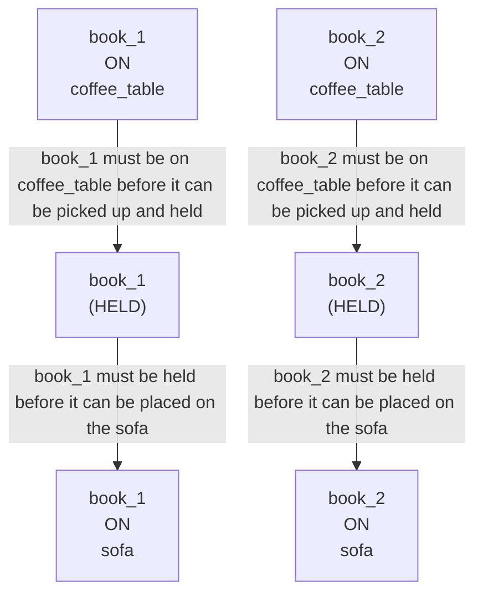
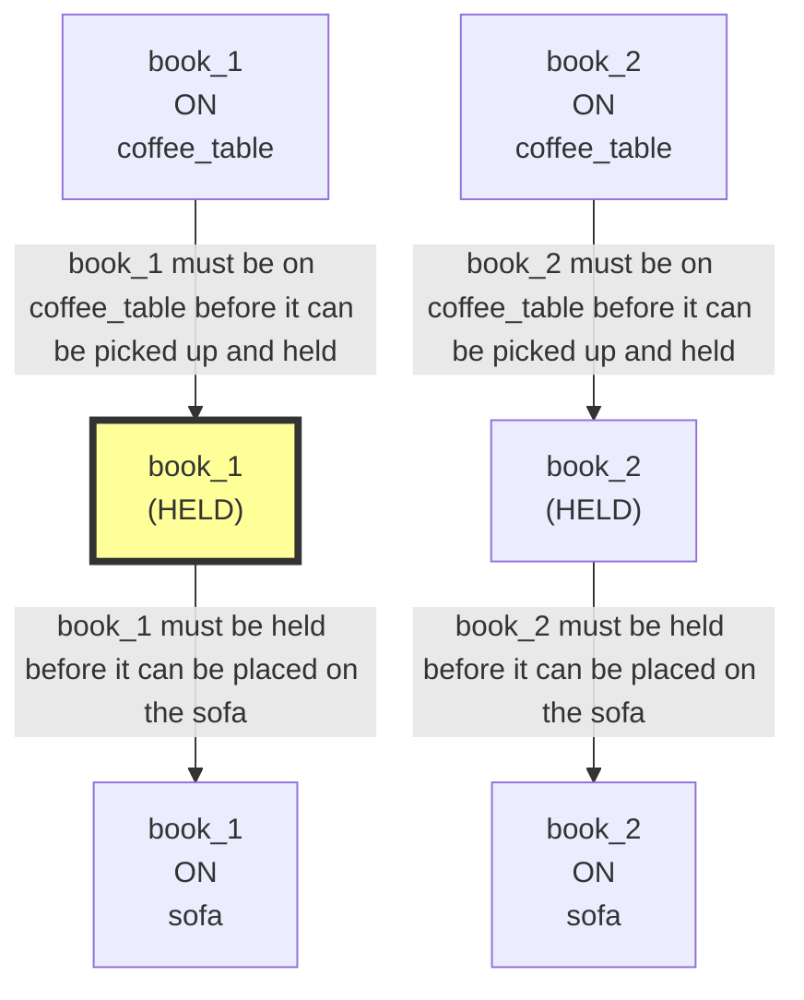
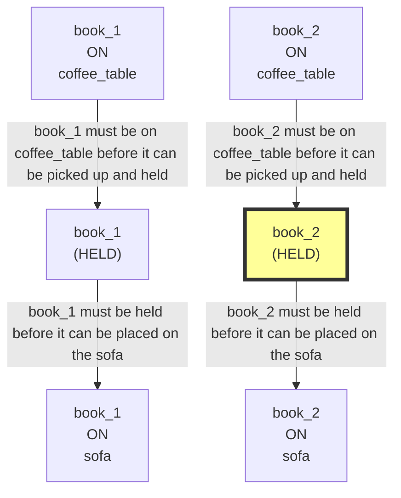
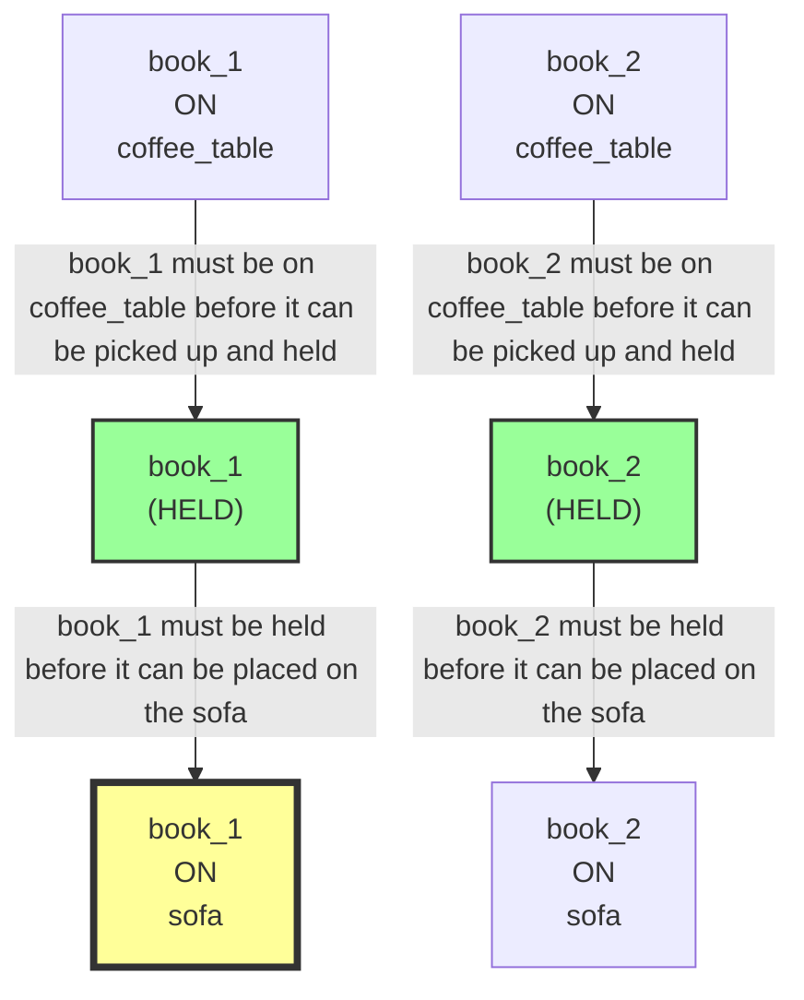
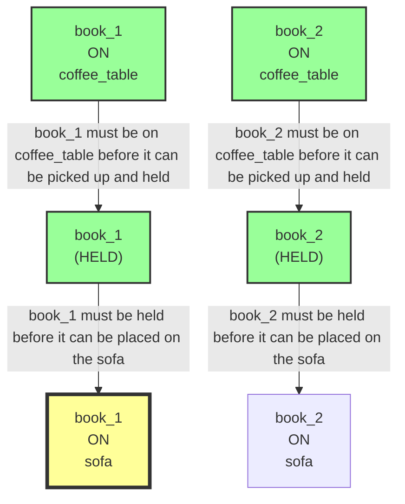
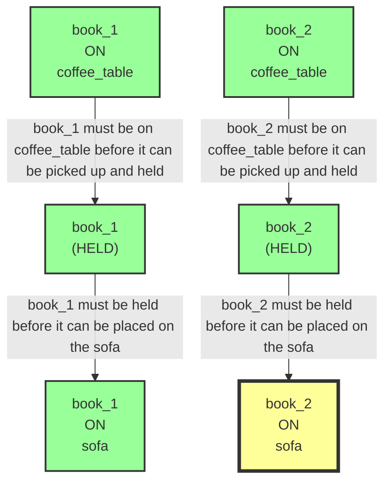

# 🚀 VirtualHome Agent Episode Log


### [GoalReasoner (Module A - Intent)] Output
```json
{
  "is_instruction_obviously_vague": false,
  "clarification_question": null,
  "target_object": "books",
  "location_hint": "coffee table",
  "reasoning_chain": [
    {
      "question": "Why does the user want the books moved to the sofa?",
      "answer": "The user wants to have the books accessible at the sofa, likely for reading or reviewing them in a comfortable location."
    },
    {
      "question": "Why is it important to move them specifically if there are two?",
      "answer": "The conditional 'if there are two' suggests the user wants both books together at the sofa only when that condition is met, implying they want to read or work with both simultaneously."
    },
    {
      "question": "What is the core physical need here?",
      "answer": "The user wants to relocate reading materials from one location (coffee table) to another (sofa) to enable comfortable access and reading."
    },
    {
      "question": "What is the fundamental intent?",
      "answer": "Enable convenient access to reading materials in a comfortable location for consumption or review."
    }
  ],
  "deep_intent": "Relocate reading materials to a comfortable location for convenient access and reading",
  "acceptable_alternatives_properties": [
    {
      "priority": 1,
      "description": "Other bound reading materials such as magazines, journals, or notebooks that can be transported and read at the sofa."
    },
    {
      "priority": 2,
      "description": "Printed documents, pamphlets, or paper-based materials that serve the same reading/review purpose."
    },
    {
      "priority": 3,
      "description": "Any portable media items (e.g., tablets, e-readers) that contain readable content and can be brought to the sofa."
    },
    {
      "priority": 4,
      "description": "Non-reading items of similar size and weight that the user may want to organize or consolidate at the sofa (e.g., decorative objects, storage items)."
    }
  ]
}
```

### [RoboStateMultiTaskController] Output
```json
{
  "action": "[walk] <bathroom> (11)",
  "active_task_id": "task_1",
  "task_context": {
    "active_task_id": "task_1",
    "pending_task_ids": [],
    "satisfied_task_ids": []
  },
  "source": "room_frontier"
}
```
## Step 0
- **Action**: `[walk] <bathroom> (11)`
- **Action Success**: `True`
- **Action Message**: {'0': {'message': 'Success'}}
- **Active Task**: `task_1`
- **Decision Source**: `room_frontier`
- **Task Progress**: T4_claude_P2_10=pending
- **SDG Status**:

- **Observed Items (79)**: floor(336), floor(337), floor(338), floor(339), floor(340), floor(341), floor(342), floor(343), floor(344), wall(345), wall(346), wall(347), wall(348), wall(349), wall(350)...


### [RoboStateMultiTaskController] Output
```json
{
  "action": "[walk] <bedroom> (73)",
  "active_task_id": "task_1",
  "task_context": {
    "active_task_id": "task_1",
    "pending_task_ids": [],
    "satisfied_task_ids": []
  },
  "source": "room_frontier"
}
```
## Step 1
- **Action**: `[walk] <bedroom> (73)`
- **Action Success**: `True`
- **Action Message**: {'0': {'message': 'Success'}}
- **Active Task**: `task_1`
- **Decision Source**: `room_frontier`
- **Task Progress**: T4_claude_P2_10=pending
- **SDG Status**:

- **Observed Items (140)**: floor(336), floor(337), floor(338), floor(339), floor(340), floor(341), floor(342), floor(343), floor(344), wall(345), wall(346), wall(347), wall(348), wall(349), wall(350)...


### [PerceptionFilter] Output
```json
{
  "reasoning": "Fallback due to error.",
  "selected_classes": [
    "paper",
    "book",
    "sofa",
    "character"
  ],
  "raw_class_count": 70
}
```

### [LLMExecutor] Output
```json
{
  "reasoning": "Current state analysis: The character is in the bedroom(73) and is CLOSE to both book(190) and book(191). The SDG requires both books to be HELD (N1, N2) and then placed ON the sofa (N3, N4). The books are currently in the bedroom, not on the coffee_table as the SDG prerequisite (N5, N6) suggests. However, examining the Filtered Graph, I see the books are CLOSE to the character and in the bedroom. The sofa(368) is in the livingroom(335) and is CLOSE to the character according to the relations. This is a state inconsistency - the character cannot be simultaneously CLOSE to both the sofa in livingroom AND the books in bedroom. The most reliable interpretation is that the character is currently in the bedroom near the books. Since both books are CLOSE and the character is in the same room, I can proceed to grab the first book. The P2 parallel optimization rule suggests I should grab both books before walking to the sofa (since both hands are empty). I'll start by grabbing book(190).",
  "satisfied_nodes": [],
  "current_node_focus": "N1",
  "mapped_variables": {
    "book_1": "book(190)",
    "book_2": "book(191)",
    "sofa": "sofa(368)"
  },
  "action": "[grab] <book> (190)"
}
```

### [RoboStateMultiTaskController] Output
```json
{
  "action": "[grab] <book> (190)",
  "active_task_id": "task_1",
  "task_context": {
    "active_task_id": "task_1",
    "pending_task_ids": [],
    "satisfied_task_ids": []
  },
  "source": "llm_executor"
}
```
## Step 2
- **Action**: `[grab] <book> (190)`
- **Action Success**: `True`
- **Action Message**: {'0': {'message': 'Success'}}
- **Active Task**: `task_1`
- **Decision Source**: `llm_executor`
- **Task Progress**: T4_claude_P2_10=pending
- **SDG Status**:

- **Observed Items (9)**: sofa(368), paper(451), character(1), bathroom(11), bedroom(73), kitchen(205), livingroom(335), book(190) [CLOSED], book(191) [CLOSED]


### [PerceptionFilter] Output
```json
{
  "reasoning": "Fallback due to error.",
  "selected_classes": [
    "paper",
    "book",
    "sofa",
    "character"
  ],
  "raw_class_count": 70
}
```

### [LLMExecutor] Output
```json
{
  "reasoning": "Current state analysis: I am in the bedroom(73) holding book(190) in my right hand. The SDG requires both book_1 and book_2 to be held (N1, N2) and then placed on the sofa (N3, N4). The prerequisite nodes N5 and N6 indicate both books must start on the coffee_table, but I observe both books are currently in the bedroom and close to me. Book(191) is also close to me in the bedroom. Since I have one hand free (left hand), I should grab the second book now to optimize transport using both hands (P2 parallel grabbing rule). This way I can carry both books together to the sofa, minimizing steps. The books are already in my vicinity (CLOSE to character), so I can grab book(191) immediately.",
  "satisfied_nodes": [],
  "current_node_focus": "N2",
  "mapped_variables": {
    "book_1": "book(190)",
    "book_2": "book(191)",
    "sofa": "sofa(368)"
  },
  "action": "[grab] <book> (191)"
}
```

### [RoboStateMultiTaskController] Output
```json
{
  "action": "[grab] <book> (191)",
  "active_task_id": "task_1",
  "task_context": {
    "active_task_id": "task_1",
    "pending_task_ids": [],
    "satisfied_task_ids": []
  },
  "source": "llm_executor"
}
```
## Step 3
- **Action**: `[grab] <book> (191)`
- **Action Success**: `True`
- **Action Message**: {'0': {'message': 'Success'}}
- **Active Task**: `task_1`
- **Decision Source**: `llm_executor`
- **Task Progress**: T4_claude_P2_10=pending
- **SDG Status**:

- **Observed Items (9)**: sofa(368), paper(451), character(1), bathroom(11), bedroom(73), kitchen(205), livingroom(335), book(190) [CLOSED], book(191) [CLOSED]


### [PerceptionFilter] Output
```json
{
  "reasoning": "Fallback due to error.",
  "selected_classes": [
    "paper",
    "book",
    "sofa",
    "character"
  ],
  "raw_class_count": 70
}
```

### [LLMExecutor] Output
```json
{
  "reasoning": "Current state analysis: I am holding both book(190) in HOLDS_RH and book(191) in HOLDS_LH. Both books are currently INSIDE bedroom(73). The SDG requires both books to be placed ON the sofa(368), which is INSIDE livingroom(335). The sofa is marked as CLOSE to character(1), meaning I am near it. Since I already have both books held (satisfying N1 and N2), the next step is to walk to the sofa and place both books on it. I should walk to the sofa first (PROXIMITY RULE), then putback each book onto it.",
  "satisfied_nodes": [
    "N1",
    "N2"
  ],
  "current_node_focus": "N3",
  "mapped_variables": {
    "?TargetSurface": "sofa(368)"
  },
  "action": "[walk] <sofa> (368)"
}
```

### [RoboStateMultiTaskController] Output
```json
{
  "action": "[walk] <sofa> (368)",
  "active_task_id": "task_1",
  "task_context": {
    "active_task_id": "task_1",
    "pending_task_ids": [],
    "satisfied_task_ids": []
  },
  "source": "llm_executor"
}
```
## Step 4
- **Action**: `[walk] <sofa> (368)`
- **Action Success**: `True`
- **Action Message**: {'0': {'message': 'Success'}}
- **Active Task**: `task_1`
- **Decision Source**: `llm_executor`
- **Task Progress**: T4_claude_P2_10=pending
- **SDG Status**:

- **Observed Items (9)**: sofa(368), paper(451), character(1), bathroom(11), bedroom(73), kitchen(205), livingroom(335), book(190) [CLOSED], book(191) [CLOSED]


### [PerceptionFilter] Output
```json
{
  "reasoning": "Fallback due to error.",
  "selected_classes": [
    "paper",
    "book",
    "sofa",
    "character"
  ],
  "raw_class_count": 70
}
```

### [LLMExecutor] Output
```json
{
  "reasoning": "Current state analysis: I am holding both book(190) and book(191) in my hands (HOLDS_RH and HOLDS_LH). I have already walked to the sofa(368) and am CLOSE to it. The SDG requires both books to be placed ON the sofa (N3 and N4). Since I am already holding both books and am positioned at the sofa, the next logical action is to place the first book on the sofa using [putback]. I will start with book(190) in my right hand.",
  "satisfied_nodes": [
    "N1",
    "N2",
    "N5",
    "N6"
  ],
  "current_node_focus": "N3",
  "mapped_variables": {
    "book_1": "book(190)",
    "book_2": "book(191)",
    "sofa": "sofa(368)"
  },
  "action": "[putback] <book> (190) <sofa> (368)"
}
```

### [RoboStateMultiTaskController] Output
```json
{
  "action": "[putback] <book> (190) <sofa> (368)",
  "active_task_id": "task_1",
  "task_context": {
    "active_task_id": "task_1",
    "pending_task_ids": [],
    "satisfied_task_ids": []
  },
  "source": "llm_executor"
}
```
## Step 5
- **Action**: `[putback] <book> (190) <sofa> (368)`
- **Action Success**: `True`
- **Action Message**: {'0': {'message': 'Success'}}
- **Active Task**: `task_1`
- **Decision Source**: `llm_executor`
- **Task Progress**: T4_claude_P2_10=pending
- **SDG Status**:

- **Observed Items (9)**: sofa(368), paper(451), character(1), bathroom(11), bedroom(73), kitchen(205), livingroom(335), book(190) [CLOSED], book(191) [CLOSED]


### [PerceptionFilter] Output
```json
{
  "reasoning": "Fallback due to error.",
  "selected_classes": [
    "paper",
    "book",
    "sofa",
    "character"
  ],
  "raw_class_count": 70
}
```

### [LLMExecutor] Output
```json
{
  "reasoning": "Current state analysis: I am holding book(191) in my left hand (HOLDS_LH). Book(190) is already on the sofa(368) after step 5. According to the SDG, I need to satisfy N4: book_2 (which is book(191)) must be ON sofa. I am currently close to the sofa (character is CLOSE to sofa(368)). The next action is to place book(191) onto the sofa to complete the goal. Both books will then be on the sofa as required by the SDG (N3 and N4).",
  "satisfied_nodes": [
    "N5",
    "N6",
    "N1",
    "N2",
    "N3"
  ],
  "current_node_focus": "N4",
  "mapped_variables": {
    "book_1": "book(190)",
    "book_2": "book(191)",
    "sofa": "sofa(368)"
  },
  "action": "[putback] <book> (191) <sofa> (368)"
}
```

### [RoboStateMultiTaskController] Output
```json
{
  "action": "[putback] <book> (191) <sofa> (368)",
  "active_task_id": "task_1",
  "task_context": {
    "active_task_id": "task_1",
    "pending_task_ids": [],
    "satisfied_task_ids": []
  },
  "source": "llm_executor"
}
```
## Step 6
- **Action**: `[putback] <book> (191) <sofa> (368)`
- **Action Success**: `True`
- **Action Message**: {'0': {'message': 'Success'}}
- **Active Task**: `task_1`
- **Decision Source**: `llm_executor`
- **Task Progress**: T4_claude_P2_10=done
- **SDG Status**:

- **Observed Items (9)**: sofa(368), paper(451), character(1), bathroom(11), bedroom(73), kitchen(205), livingroom(335), book(190) [CLOSED], book(191) [CLOSED]

