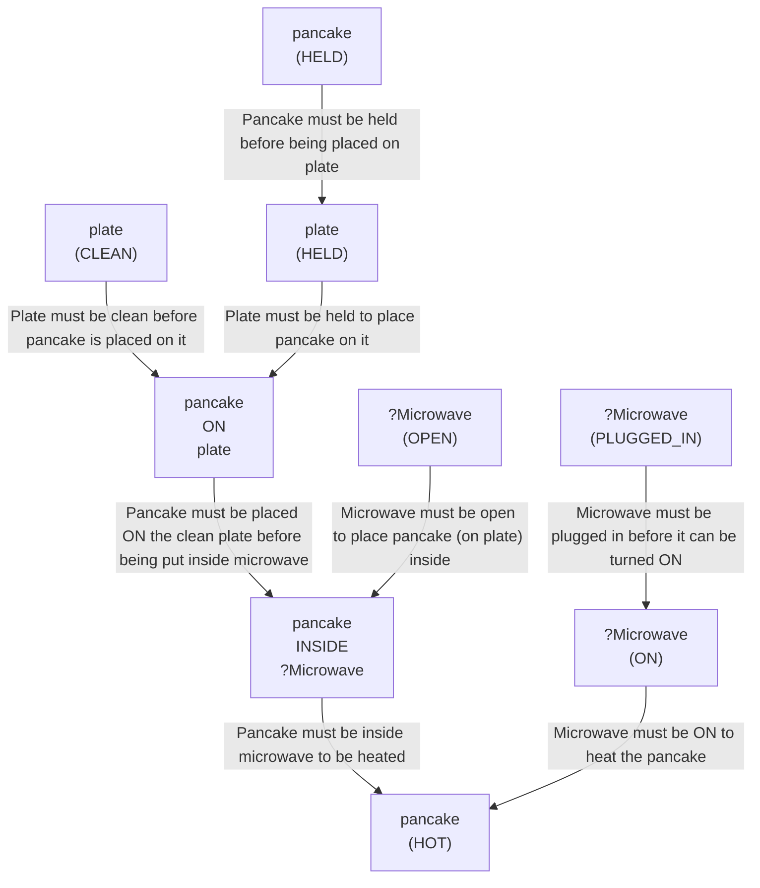

# 🚀 VirtualHome Agent Episode Log


### [GoalReasoner (Module A - Intent)] Output
```json
{
  "is_instruction_obviously_vague": false,
  "clarification_question": null,
  "target_object": "pancake",
  "location_hint": null,
  "reasoning_chain": [
    {
      "question": "Why does the user want to warm up the pancake?",
      "answer": "The pancake is likely cold or at room temperature, and the user wants to consume it at a warmer, more palatable temperature."
    },
    {
      "question": "Why is warming it important?",
      "answer": "Warm food is more appetizing, easier to digest, and provides better sensory experience (taste and texture) compared to cold pancakes."
    },
    {
      "question": "What fundamental need does this fulfill?",
      "answer": "The user wants to prepare food for consumption in an optimal state—warm enough to be enjoyable and ready to eat."
    },
    {
      "question": "Are there any deeper psychological or physical motivations?",
      "answer": "Yes—the user seeks comfort and satisfaction from eating. Warming the food also ensures it meets their expectations for a proper meal experience."
    }
  ],
  "deep_intent": "Prepare a food item to an optimal warm temperature for consumption, using a clean serving surface.",
  "acceptable_alternatives_properties": [
    {
      "priority": 1,
      "description": "Other breakfast items that can be warmed in a microwave on a clean plate, such as waffles, French toast, or leftover breakfast burritos."
    },
    {
      "priority": 2,
      "description": "Bread-based or grain-based foods that benefit from reheating, such as toast, bagels, or English muffins."
    },
    {
      "priority": 3,
      "description": "Any leftover cooked food items that can be safely reheated in a microwave on a plate, such as rice, pasta, or cooked vegetables."
    },
    {
      "priority": 4,
      "description": "If microwave is unavailable, use alternative heating methods with a clean plate: toaster oven, conventional oven, or stovetop skillet to warm the food item."
    }
  ]
}
```

### [RoboStateMultiTaskController] Output
```json
{
  "action": "[walk] <kitchen> (11)",
  "active_task_id": "task_1",
  "task_context": {
    "active_task_id": "task_1",
    "pending_task_ids": [],
    "satisfied_task_ids": []
  },
  "source": "room_frontier"
}
```
## Step 0
- **Action**: `[walk] <kitchen> (11)`
- **Action Success**: `True`
- **Action Message**: {'0': {'message': 'Success'}}
- **Active Task**: `task_1`
- **Decision Source**: `room_frontier`
- **Task Progress**: T4_claude_P3_17=pending
- **SDG Status**:

- **Observed Items (43)**: wall(173), wall(174), wall(175), wall(176), ceiling(177), ceiling(178), ceiling(179), ceiling(180), floor(181), floor(182), floor(183), floor(184), walllamp(185), ceilinglamp(186), walllamp(187)...


### [PerceptionFilter] Output
```json
{
  "reasoning": "Fallback due to error.",
  "selected_classes": [
    "plate",
    "character",
    "toaster",
    "pancake",
    "stove",
    "microwave"
  ],
  "raw_class_count": 79
}
```

### [LLMExecutor] Output
```json
{
  "reasoning": "Fallback due to error.",
  "satisfied_nodes": [],
  "current_node_focus": "",
  "mapped_variables": {},
  "action": "WAIT"
}
```

### [RoboStateMultiTaskController] Output
```json
{
  "action": "[wait]",
  "active_task_id": "task_1",
  "task_context": {
    "active_task_id": "task_1",
    "pending_task_ids": [],
    "satisfied_task_ids": []
  },
  "source": "llm_executor"
}
```
## Step 1
- **Action**: `[wait]`
- **Action Success**: `True`
- **Action Message**: Time passes. You waited for a while.
- **Active Task**: `task_1`
- **Decision Source**: `llm_executor`
- **Task Progress**: T4_claude_P3_17=pending
- **SDG Status**:

- **Observed Items (14)**: character(1), kitchen(11), bathroom(172), bedroom(211), livingroom(268), pancake(62), toaster(99) [OFF], stove(105) [OFF,CLOSED], microwave(109) [CLOSED,OFF], plate(125), plate(126), plate(127), plate(128), plate(143)


### [PerceptionFilter] Output
```json
{
  "reasoning": "Fallback due to error.",
  "selected_classes": [
    "plate",
    "character",
    "toaster",
    "pancake",
    "stove",
    "microwave"
  ],
  "raw_class_count": 79
}
```

### [LLMExecutor] Output
```json
{
  "reasoning": "Fallback due to error.",
  "satisfied_nodes": [],
  "current_node_focus": "",
  "mapped_variables": {},
  "action": "WAIT"
}
```

### [RoboStateMultiTaskController] Output
```json
{
  "action": "[wait]",
  "active_task_id": "task_1",
  "task_context": {
    "active_task_id": "task_1",
    "pending_task_ids": [],
    "satisfied_task_ids": []
  },
  "source": "llm_executor"
}
```
## Step 2
- **Action**: `[wait]`
- **Action Success**: `True`
- **Action Message**: Time passes. You waited for a while.
- **Active Task**: `task_1`
- **Decision Source**: `llm_executor`
- **Task Progress**: T4_claude_P3_17=pending
- **SDG Status**:

- **Observed Items (14)**: character(1), kitchen(11), bathroom(172), bedroom(211), livingroom(268), pancake(62), toaster(99) [OFF], stove(105) [OFF,CLOSED], microwave(109) [CLOSED,OFF], plate(125), plate(126), plate(127), plate(128), plate(143)


### [PerceptionFilter] Output
```json
{
  "reasoning": "Fallback due to error.",
  "selected_classes": [
    "plate",
    "character",
    "toaster",
    "pancake",
    "stove",
    "microwave"
  ],
  "raw_class_count": 79
}
```

### [LLMExecutor] Output
```json
{
  "reasoning": "Fallback due to error.",
  "satisfied_nodes": [],
  "current_node_focus": "",
  "mapped_variables": {},
  "action": "WAIT"
}
```

### [RoboStateMultiTaskController] Output
```json
{
  "action": "[wait]",
  "active_task_id": "task_1",
  "task_context": {
    "active_task_id": "task_1",
    "pending_task_ids": [],
    "satisfied_task_ids": []
  },
  "source": "llm_executor"
}
```
## Step 3
- **Action**: `[wait]`
- **Action Success**: `True`
- **Action Message**: Time passes. You waited for a while.
- **Active Task**: `task_1`
- **Decision Source**: `llm_executor`
- **Task Progress**: T4_claude_P3_17=pending
- **SDG Status**:

- **Observed Items (14)**: character(1), kitchen(11), bathroom(172), bedroom(211), livingroom(268), pancake(62), toaster(99) [OFF], stove(105) [OFF,CLOSED], microwave(109) [CLOSED,OFF], plate(125), plate(126), plate(127), plate(128), plate(143)


### [PerceptionFilter] Output
```json
{
  "reasoning": "Fallback due to error.",
  "selected_classes": [
    "plate",
    "character",
    "toaster",
    "pancake",
    "stove",
    "microwave"
  ],
  "raw_class_count": 79
}
```

### [LLMExecutor] Output
```json
{
  "reasoning": "Fallback due to error.",
  "satisfied_nodes": [],
  "current_node_focus": "",
  "mapped_variables": {},
  "action": "WAIT"
}
```

### [RoboStateMultiTaskController] Output
```json
{
  "action": "[wait]",
  "active_task_id": "task_1",
  "task_context": {
    "active_task_id": "task_1",
    "pending_task_ids": [],
    "satisfied_task_ids": []
  },
  "source": "llm_executor"
}
```
## Step 4
- **Action**: `[wait]`
- **Action Success**: `True`
- **Action Message**: Time passes. You waited for a while.
- **Active Task**: `task_1`
- **Decision Source**: `llm_executor`
- **Task Progress**: T4_claude_P3_17=pending
- **SDG Status**:

- **Observed Items (14)**: character(1), kitchen(11), bathroom(172), bedroom(211), livingroom(268), pancake(62), toaster(99) [OFF], stove(105) [OFF,CLOSED], microwave(109) [CLOSED,OFF], plate(125), plate(126), plate(127), plate(128), plate(143)


### [PerceptionFilter] Output
```json
{
  "reasoning": "Fallback due to error.",
  "selected_classes": [
    "plate",
    "character",
    "toaster",
    "pancake",
    "stove",
    "microwave"
  ],
  "raw_class_count": 79
}
```

### [LLMExecutor] Output
```json
{
  "reasoning": "Fallback due to error.",
  "satisfied_nodes": [],
  "current_node_focus": "",
  "mapped_variables": {},
  "action": "WAIT"
}
```

### [RoboStateMultiTaskController] Output
```json
{
  "action": "[wait]",
  "active_task_id": "task_1",
  "task_context": {
    "active_task_id": "task_1",
    "pending_task_ids": [],
    "satisfied_task_ids": []
  },
  "source": "llm_executor"
}
```
