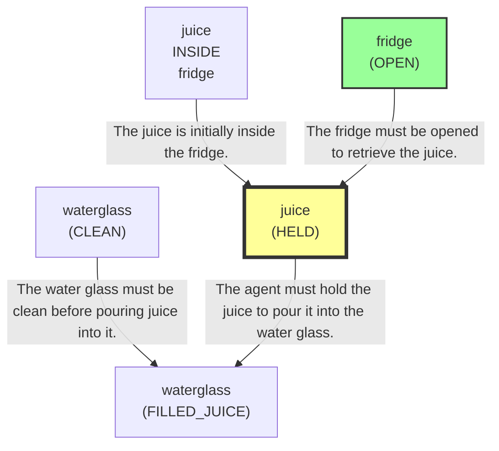
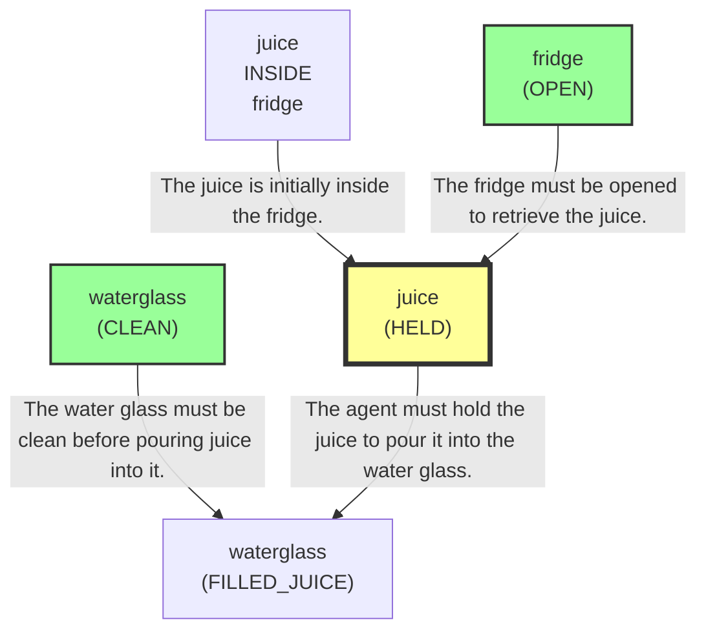
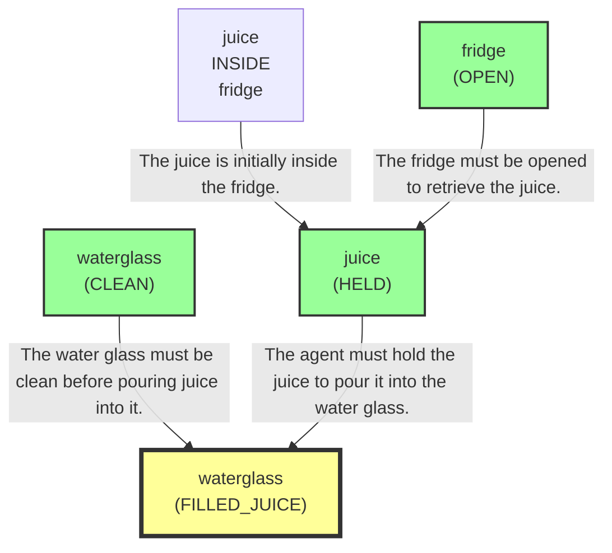

# 🚀 VirtualHome Agent Episode Log


### [GoalReasoner (Module A - Intent)] Output
```json
{
  "is_instruction_obviously_vague": false,
  "clarification_question": null,
  "target_object": "juice",
  "location_hint": "fridge",
  "reasoning_chain": [
    {
      "question": "Why does the user want this object?",
      "answer": "The user wants to drink juice from a clean water glass."
    },
    {
      "question": "Why is that important?",
      "answer": "The user wants to consume a liquid beverage to hydrate themselves."
    },
    {
      "question": "What fundamental need does this fulfill?",
      "answer": "It fulfills the physiological need to quench thirst and maintain hydration."
    },
    {
      "question": "Are there any deeper psychological or physical motivations?",
      "answer": "The user seeks a refreshing, flavored liquid to satisfy their thirst in a clean, hygienic manner."
    }
  ],
  "deep_intent": "The user wants to quench thirst and hydrate with a clean beverage",
  "acceptable_alternatives_properties": [
    {
      "priority": 1,
      "description": "Other cold, sweet, or flavored non-alcoholic beverages in the fridge, such as iced tea or lemonade."
    },
    {
      "priority": 2,
      "description": "Milk or dairy-free milk alternatives that can be poured into a glass to provide hydration and flavor."
    },
    {
      "priority": 3,
      "description": "Plain cold water from the fridge or dispenser, satisfying the core hydration need without the flavor."
    },
    {
      "priority": 4,
      "description": "Hydrating, water-rich fruits like orange slices or watermelon pieces that can satisfy thirst and provide a sweet flavor, even though they are not liquids."
    }
  ]
}
```

### [PerceptionFilter] Output
```json
{
  "reasoning": "The goal is to pour juice from the fridge into a clean water glass. The target objects are 'juice' and 'waterglass'. The required location is the 'fridge'. To ensure the water glass is clean, a 'sink' or 'dishwasher' is needed as potential cleaning tools. 'milk' is selected as a viable alternative beverage to juice as specified in the acceptable alternatives.",
  "selected_classes": [
    "milk",
    "juice",
    "sink",
    "fridge",
    "dishwasher",
    "waterglass",
    "character"
  ],
  "raw_class_count": 50
}
```

### [LLMExecutor] Output
```json
{
  "reasoning": "The fridge is already open (N5 is satisfied). The juice(173) is inside the fridge(162). To grab the juice(173) inside the fridge, I must first walk to it explicitly, as being near the fridge does not automatically make me near the objects inside it.",
  "satisfied_nodes": [
    "N5"
  ],
  "current_node_focus": "N3",
  "mapped_variables": {
    "?juice": "juice(173)",
    "?fridge": "fridge(162)"
  },
  "action": "[walk] <juice> (173)"
}
```

### [RoboStateMultiTaskController] Output
```json
{
  "action": "[walk] <juice> (173)",
  "active_task_id": "task_1",
  "task_context": {
    "active_task_id": "task_1",
    "pending_task_ids": [],
    "satisfied_task_ids": []
  },
  "source": "llm_executor"
}
```
## Step 0
- **Action**: `[walk] <juice> (173)`
- **Action Success**: `False`
- **Action Message**: {'0': {'message': 'ScriptExcutor 0: PROCESS WALK: Can not select object: juice. REASON: No interaction positions\nEXECUTION_GENERAL: Script is impossible to execute\n\n'}}
- **Active Task**: `task_1`
- **Decision Source**: `llm_executor`
- **Task Progress**: T4_gemini_M2_09=pending
- **SDG Status**:

- **Observed Items (21)**: waterglass(64) [CLEAN], waterglass(71) [DIRTY], waterglass(72) [DIRTY], waterglass(79), waterglass(80), waterglass(87), waterglass(88), waterglass(100), sink(155), fridge(162) [OPEN], dishwasher(165) [CLOSED,OFF], juice(174), milk(177) [CLOSED], character(1), juice(173) [COLD]...


### [PerceptionFilter] Output
```json
{
  "reasoning": "Reused cached class selection.",
  "selected_classes": [
    "milk",
    "juice",
    "sink",
    "fridge",
    "dishwasher",
    "waterglass",
    "character"
  ],
  "raw_class_count": 50
}
```

### [LLMExecutor] Output
```json
{
  "reasoning": "The previous attempt to walk to juice(173) inside the fridge failed because it is inside the closed/open fridge and might not have direct interaction positions. However, there is another juice(174) already outside the fridge, which is close to the character. I will grab juice(174) to satisfy the requirement of holding juice.",
  "satisfied_nodes": [
    "N2",
    "N5"
  ],
  "current_node_focus": "N3",
  "mapped_variables": {
    "?juice": "juice(174)",
    "?fridge": "fridge(162)",
    "?waterglass": "waterglass(64)"
  },
  "action": "[grab] <juice> (174)"
}
```

### [RoboStateMultiTaskController] Output
```json
{
  "action": "[grab] <juice> (174)",
  "active_task_id": "task_1",
  "task_context": {
    "active_task_id": "task_1",
    "pending_task_ids": [],
    "satisfied_task_ids": []
  },
  "source": "llm_executor"
}
```
## Step 1
- **Action**: `[grab] <juice> (174)`
- **Action Success**: `True`
- **Action Message**: {'0': {'message': 'Success'}}
- **Active Task**: `task_1`
- **Decision Source**: `llm_executor`
- **Task Progress**: T4_gemini_M2_09=pending
- **SDG Status**:

- **Observed Items (21)**: waterglass(64) [CLEAN], waterglass(71) [DIRTY], waterglass(72) [DIRTY], waterglass(79), waterglass(80), waterglass(87), waterglass(88), waterglass(100), sink(155), fridge(162) [OPEN], dishwasher(165) [CLOSED,OFF], juice(174), milk(177) [CLOSED], character(1), juice(173) [COLD]...


### [PerceptionFilter] Output
```json
{
  "reasoning": "Reused cached class selection.",
  "selected_classes": [
    "milk",
    "juice",
    "sink",
    "fridge",
    "dishwasher",
    "waterglass",
    "character"
  ],
  "raw_class_count": 50
}
```

### [LLMExecutor] Output
```json
{
  "reasoning": "I am currently holding the juice (174) in my right hand. The target is to fill a clean waterglass with juice. I see waterglass (64) is already CLEAN and is close to me. I need to walk to waterglass (64) to ensure I am close enough to pour, although the graph says 'CLOSE waterglass(64)', explicitly walking to the target before pouring is a critical safety rule to prevent execution failure.",
  "satisfied_nodes": [
    "N2",
    "N3",
    "N5"
  ],
  "current_node_focus": "N1",
  "mapped_variables": {
    "?waterglass": "waterglass(64)",
    "?juice": "juice(174)"
  },
  "action": "[walk] <waterglass> (64)"
}
```

### [RoboStateMultiTaskController] Output
```json
{
  "action": "[walk] <waterglass> (64)",
  "active_task_id": "task_1",
  "task_context": {
    "active_task_id": "task_1",
    "pending_task_ids": [],
    "satisfied_task_ids": []
  },
  "source": "llm_executor"
}
```
## Step 2
- **Action**: `[walk] <waterglass> (64)`
- **Action Success**: `True`
- **Action Message**: {'0': {'message': 'Success'}}
- **Active Task**: `task_1`
- **Decision Source**: `llm_executor`
- **Task Progress**: T4_gemini_M2_09=pending
- **SDG Status**:

- **Observed Items (21)**: waterglass(64) [CLEAN], waterglass(71) [DIRTY], waterglass(72) [DIRTY], waterglass(79), waterglass(80), waterglass(87), waterglass(88), waterglass(100), sink(155), fridge(162) [OPEN], dishwasher(165) [CLOSED,OFF], juice(174), milk(177) [CLOSED], character(1), juice(173) [COLD]...


### [PerceptionFilter] Output
```json
{
  "reasoning": "Reused cached class selection.",
  "selected_classes": [
    "milk",
    "juice",
    "sink",
    "fridge",
    "dishwasher",
    "waterglass",
    "character"
  ],
  "raw_class_count": 50
}
```

### [LLMExecutor] Output
```json
{
  "reasoning": "The agent is currently holding the juice (174) and is close to the clean waterglass (64). The next logical step to satisfy N1 (waterglass FILLED_JUICE) is to pour the juice into the clean waterglass.",
  "satisfied_nodes": [
    "N2",
    "N3",
    "N5"
  ],
  "current_node_focus": "N1",
  "mapped_variables": {
    "?juice": "juice(174)",
    "?waterglass": "waterglass(64)"
  },
  "action": "[pour] <juice> (174) <waterglass> (64)"
}
```

### [RoboStateMultiTaskController] Output
```json
{
  "action": "[pour] <juice> (174) <waterglass> (64)",
  "active_task_id": "task_1",
  "task_context": {
    "active_task_id": "task_1",
    "pending_task_ids": [],
    "satisfied_task_ids": []
  },
  "source": "llm_executor"
}
```
## Step 3
- **Action**: `[pour] <juice> (174) <waterglass> (64)`
- **Action Success**: `True`
- **Action Message**: Poured into container successfully.
- **Active Task**: `task_1`
- **Decision Source**: `llm_executor`
- **Task Progress**: T4_gemini_M2_09=done
- **SDG Status**:

- **Observed Items (21)**: waterglass(64) [CLEAN], waterglass(71) [DIRTY], waterglass(72) [DIRTY], waterglass(79), waterglass(80), waterglass(87), waterglass(88), waterglass(100), sink(155), fridge(162) [OPEN], dishwasher(165) [CLOSED,OFF], juice(174), milk(177) [CLOSED], character(1), juice(173) [COLD]...

