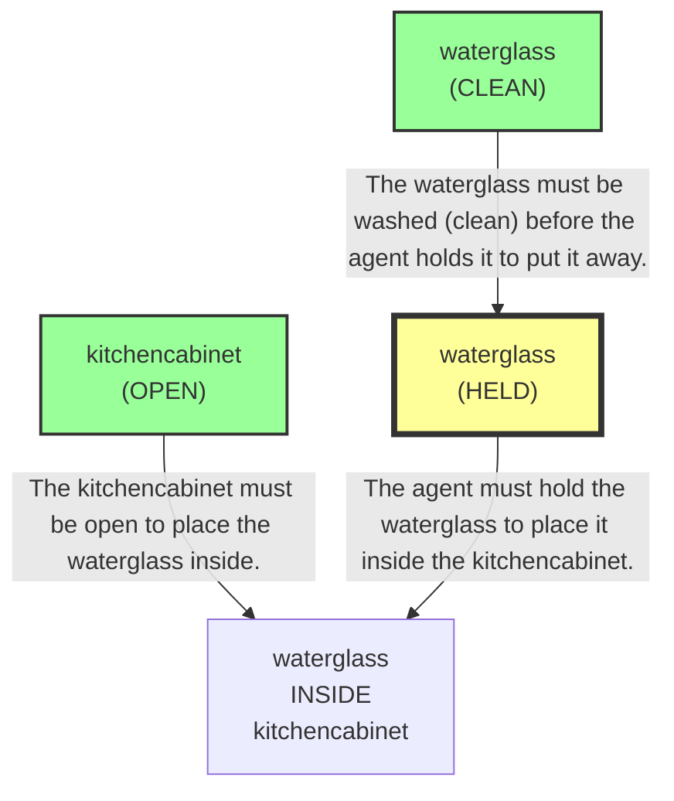
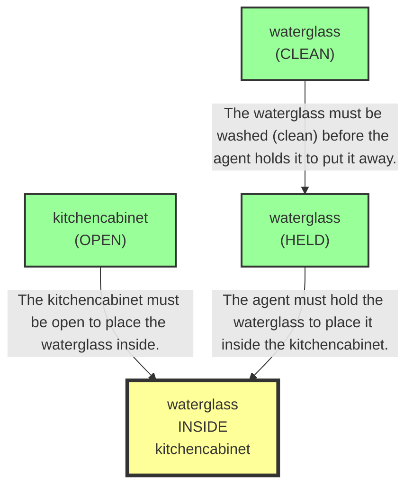

# 🚀 VirtualHome Agent Episode Log


### [GoalReasoner (Module A - Intent)] Output
```json
{
  "is_instruction_obviously_vague": false,
  "clarification_question": null,
  "target_object": "waterglass",
  "location_hint": "kitchencabinet",
  "reasoning_chain": [
    {
      "question": "Why does the user want this object put inside the open kitchen cabinet?",
      "answer": "To store the clean waterglass in its designated storage location after it has been washed."
    },
    {
      "question": "Why is that important?",
      "answer": "To keep the kitchen counters clear, organized, and to protect the clean glass from getting dirty or broken."
    },
    {
      "question": "What fundamental need does this fulfill?",
      "answer": "The need for maintaining an organized, clean, and functional living space."
    }
  ],
  "deep_intent": "The user wants to store clean drinkware in an organized storage space to maintain a tidy kitchen environment",
  "acceptable_alternatives_properties": [
    {
      "priority": 1,
      "description": "Other designated drinkware storage areas, such as a different open shelf or a cup rack in the kitchen."
    },
    {
      "priority": 2,
      "description": "An adjacent closed cabinet or cupboard designated for dishes, if the primary cabinet cannot be used."
    },
    {
      "priority": 3,
      "description": "A clean dish drying rack or a clean tray on the counter where clean glassware is temporarily kept."
    },
    {
      "priority": 4,
      "description": "A dining table or sideboard where clean glasses are set up for upcoming meals."
    }
  ]
}
```

### [PerceptionFilter] Output
```json
{
  "reasoning": "The goal is to store a clean waterglass inside a kitchen cabinet. To achieve this, we need the target object (waterglass) and the target location (kitchencabinet). Additionally, the SDG requires the waterglass to be clean, which implies the potential need for washing/cleaning tools if it is not already clean (sink, faucet, dishwasher). We also retain alternative storage locations and surfaces mentioned in the acceptable alternatives (kitchencounter, kitchentable, dishbowl, plate) to facilitate the task.",
  "selected_classes": [
    "dishbowl",
    "sink",
    "faucet",
    "kitchentable",
    "plate",
    "kitchencounter",
    "dishwasher",
    "waterglass",
    "character",
    "kitchencabinet"
  ],
  "raw_class_count": 50
}
```

### [LLMExecutor] Output
```json
{
  "reasoning": "The goal is to put a clean waterglass inside an open kitchen cabinet. According to the SDG, the waterglass must be CLEAN (N4), which is satisfied by waterglass(64) since its state is ['EMPTY', 'CLEAN']. The kitchen cabinets (e.g., kitchencabinet(138)) are already OPEN (N2). The next step is to grab the clean waterglass(64). Since the character is already CLOSE to waterglass(64), we can directly grab it.",
  "satisfied_nodes": [
    "N2",
    "N4"
  ],
  "current_node_focus": "N3",
  "mapped_variables": {
    "?Washer": "sink(155)",
    "?Cooler": "dishwasher(165)",
    "?Container": "kitchencabinet(138)"
  },
  "action": "[grab] <waterglass> (64)"
}
```

### [RoboStateMultiTaskController] Output
```json
{
  "action": "[grab] <waterglass> (64)",
  "active_task_id": "task_1",
  "task_context": {
    "active_task_id": "task_1",
    "pending_task_ids": [],
    "satisfied_task_ids": []
  },
  "source": "llm_executor"
}
```
## Step 0
- **Action**: `[grab] <waterglass> (64)`
- **Action Success**: `True`
- **Action Message**: {'0': {'message': 'Success'}}
- **Active Task**: `task_1`
- **Decision Source**: `llm_executor`
- **Task Progress**: T4_gemini_M4_17=pending
- **SDG Status**:

- **Observed Items (44)**: waterglass(64) [EMPTY,CLEAN], plate(67), plate(68), waterglass(71) [DIRTY], waterglass(72) [DIRTY], plate(75), plate(76), waterglass(79), waterglass(80), plate(83), plate(84), waterglass(87), waterglass(88), plate(91), waterglass(100)...


### [PerceptionFilter] Output
```json
{
  "reasoning": "Reused cached class selection.",
  "selected_classes": [
    "dishbowl",
    "sink",
    "faucet",
    "kitchentable",
    "plate",
    "kitchencounter",
    "dishwasher",
    "waterglass",
    "character",
    "kitchencabinet"
  ],
  "raw_class_count": 50
}
```

### [LLMExecutor] Output
```json
{
  "reasoning": "The agent is currently holding the clean waterglass(64) in its right hand. The target is to place it inside an open kitchen cabinet. Multiple kitchen cabinets are already open, such as kitchencabinet(138). To place the waterglass inside kitchencabinet(138), the agent must first walk to it.",
  "satisfied_nodes": [
    "N2",
    "N3",
    "N4"
  ],
  "current_node_focus": "N1",
  "mapped_variables": {
    "?waterglass": "waterglass(64)",
    "?kitchencabinet": "kitchencabinet(138)"
  },
  "action": "[walk] <kitchencabinet> (138)"
}
```

### [RoboStateMultiTaskController] Output
```json
{
  "action": "[walk] <kitchencabinet> (138)",
  "active_task_id": "task_1",
  "task_context": {
    "active_task_id": "task_1",
    "pending_task_ids": [],
    "satisfied_task_ids": []
  },
  "source": "llm_executor"
}
```
## Step 1
- **Action**: `[walk] <kitchencabinet> (138)`
- **Action Success**: `True`
- **Action Message**: {'0': {'message': 'Success'}}
- **Active Task**: `task_1`
- **Decision Source**: `llm_executor`
- **Task Progress**: T4_gemini_M4_17=pending
- **SDG Status**:

- **Observed Items (44)**: waterglass(64) [EMPTY,CLEAN], plate(67), plate(68), waterglass(71) [DIRTY], waterglass(72) [DIRTY], plate(75), plate(76), waterglass(79), waterglass(80), plate(83), plate(84), waterglass(87), waterglass(88), plate(91), waterglass(100)...


### [PerceptionFilter] Output
```json
{
  "reasoning": "Reused cached class selection.",
  "selected_classes": [
    "dishbowl",
    "sink",
    "faucet",
    "kitchentable",
    "plate",
    "kitchencounter",
    "dishwasher",
    "waterglass",
    "character",
    "kitchencabinet"
  ],
  "raw_class_count": 50
}
```

### [LLMExecutor] Output
```json
{
  "reasoning": "The waterglass(64) is already CLEAN and HELD in the character's right hand. The character has already walked to kitchencabinet(138), which is OPEN and CLOSE to the character. The next step is to place the waterglass inside the kitchencabinet.",
  "satisfied_nodes": [
    "N2",
    "N3",
    "N4"
  ],
  "current_node_focus": "N1",
  "mapped_variables": {
    "?waterglass": "waterglass(64)",
    "?kitchencabinet": "kitchencabinet(138)"
  },
  "action": "[putin] <waterglass> (64) <kitchencabinet> (138)"
}
```

### [RoboStateMultiTaskController] Output
```json
{
  "action": "[putin] <waterglass> (64) <kitchencabinet> (138)",
  "active_task_id": "task_1",
  "task_context": {
    "active_task_id": "task_1",
    "pending_task_ids": [],
    "satisfied_task_ids": []
  },
  "source": "llm_executor"
}
```
## Step 2
- **Action**: `[putin] <waterglass> (64) <kitchencabinet> (138)`
- **Action Success**: `True`
- **Action Message**: {'0': {'message': 'Success'}}
- **Active Task**: `task_1`
- **Decision Source**: `llm_executor`
- **Task Progress**: T4_gemini_M4_17=done
- **SDG Status**:

- **Observed Items (44)**: waterglass(64) [EMPTY,CLEAN], plate(67), plate(68), waterglass(71) [DIRTY], waterglass(72) [DIRTY], plate(75), plate(76), waterglass(79), waterglass(80), plate(83), plate(84), waterglass(87), waterglass(88), plate(91), waterglass(100)...

