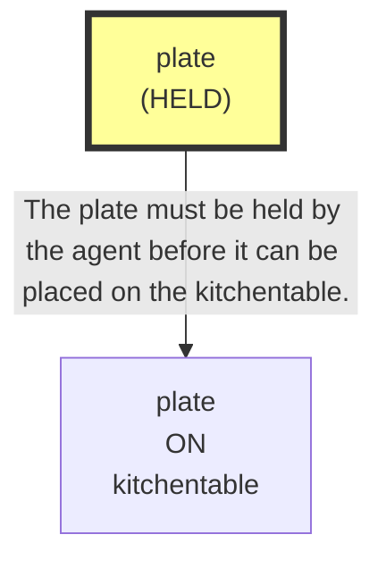
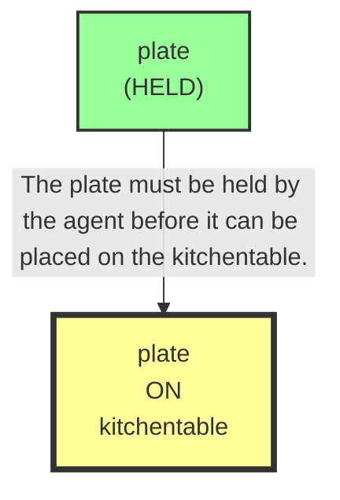
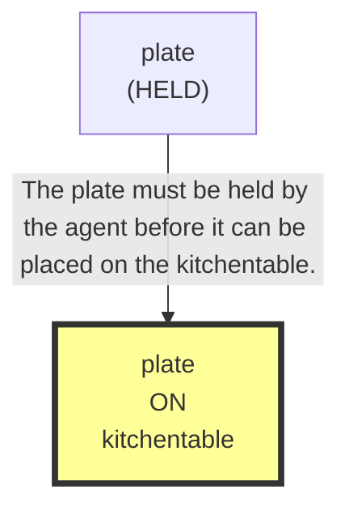

# 🚀 VirtualHome Agent Episode Log


### [GoalReasoner (Module A - Intent)] Output
```json
{
  "is_instruction_obviously_vague": false,
  "clarification_question": null,
  "target_object": "plate",
  "location_hint": "kitchentable",
  "reasoning_chain": [
    {
      "question": "Why does the user want this object placed on the kitchen table?",
      "answer": "To move a recently used plate from its current location to the kitchen table."
    },
    {
      "question": "Why is that important?",
      "answer": "To clear the immediate workspace or dining area of used tableware and consolidate it in a designated area."
    },
    {
      "question": "What fundamental need does this fulfill?",
      "answer": "The need to organize and maintain a clean, tidy living and dining environment."
    },
    {
      "question": "Are there any deeper psychological or physical motivations?",
      "answer": "The desire for domestic order, cleanliness, and preparing the space for subsequent cleaning or future meals."
    }
  ],
  "deep_intent": "The user wants to clear and organize used tableware to maintain a tidy living space.",
  "acceptable_alternatives_properties": [
    {
      "priority": 1,
      "description": "Other dirty or used tableware from the same meal, such as bowls, cups, or glasses that also need to be cleared."
    },
    {
      "priority": 2,
      "description": "Used cutlery or utensils (forks, knives, spoons) that were used alongside the plate."
    },
    {
      "priority": 3,
      "description": "Serving dishes or platters that were part of the meal setup and require clearing."
    },
    {
      "priority": 4,
      "description": "Used napkins or placemats that need to be gathered from the dining area to restore cleanliness."
    }
  ]
}
```

### [PerceptionFilter] Output
```json
{
  "reasoning": "The goal is to move a plate to the kitchen table. I need to select the target object ('plate'), the destination ('kitchentable'), and any acceptable alternative tableware or cutlery mentioned in the deep intent and alternatives list (such as 'dishbowl', 'waterglass', 'cutleryfork', 'cutleryknife') to ensure proper clearing and organization of the dining space.",
  "selected_classes": [
    "character",
    "waterglass",
    "plate",
    "cutleryknife",
    "cutleryfork",
    "kitchentable",
    "dishbowl"
  ],
  "raw_class_count": 50
}
```

### [LLMExecutor] Output
```json
{
  "reasoning": "The goal is to place a plate on the kitchen table. In the past step, a plate was washed (historically plate 15, but now we must rebind to a plate in the environment). Looking at the current graph, plate(104) is inside the kitchen but not on any table, making it a perfect candidate to move to the kitchen table. First, I need to walk to plate(104) to grab it.",
  "satisfied_nodes": [],
  "current_node_focus": "N2",
  "mapped_variables": {
    "?plate": "plate(104)",
    "?kitchentable": "kitchentable(131)"
  },
  "action": "[walk] <plate> (104)"
}
```

### [RoboStateMultiTaskController] Output
```json
{
  "action": "[walk] <plate> (104)",
  "active_task_id": "task_1",
  "task_context": {
    "active_task_id": "task_1",
    "pending_task_ids": [],
    "satisfied_task_ids": []
  },
  "source": "llm_executor"
}
```
## Step 0
- **Action**: `[walk] <plate> (104)`
- **Action Success**: `True`
- **Action Message**: {'0': {'message': 'Success'}}
- **Active Task**: `task_1`
- **Decision Source**: `llm_executor`
- **Task Progress**: T4_gemini_M4_18=pending
- **SDG Status**:

- **Observed Items (49)**: cutleryknife(59), cutleryknife(60), waterglass(64), cutleryknife(65), cutleryfork(66), cutleryfork(69), cutleryknife(70), waterglass(71), waterglass(72), cutleryknife(73), cutleryfork(74), plate(75), plate(76), cutleryfork(77), cutleryknife(78)...


### [PerceptionFilter] Output
```json
{
  "reasoning": "Reused cached class selection.",
  "selected_classes": [
    "character",
    "waterglass",
    "plate",
    "cutleryknife",
    "cutleryfork",
    "kitchentable",
    "dishbowl"
  ],
  "raw_class_count": 50
}
```

### [LLMExecutor] Output
```json
{
  "reasoning": "I have successfully walked to plate(104) in the previous step, and it is now CLOSE to character(1). The next logical step to satisfy node N2 (plate HELD) is to grab plate(104).",
  "satisfied_nodes": [],
  "current_node_focus": "N2",
  "mapped_variables": {
    "?plate": "plate(104)",
    "?kitchentable": "kitchentable(131)"
  },
  "action": "[grab] <plate> (104)"
}
```

### [RoboStateMultiTaskController] Output
```json
{
  "action": "[grab] <plate> (104)",
  "active_task_id": "task_1",
  "task_context": {
    "active_task_id": "task_1",
    "pending_task_ids": [],
    "satisfied_task_ids": []
  },
  "source": "llm_executor"
}
```
## Step 1
- **Action**: `[grab] <plate> (104)`
- **Action Success**: `True`
- **Action Message**: {'0': {'message': 'Success'}}
- **Active Task**: `task_1`
- **Decision Source**: `llm_executor`
- **Task Progress**: T4_gemini_M4_18=pending
- **SDG Status**:

- **Observed Items (49)**: cutleryknife(59), cutleryknife(60), waterglass(64), cutleryknife(65), cutleryfork(66), cutleryfork(69), cutleryknife(70), waterglass(71), waterglass(72), cutleryknife(73), cutleryfork(74), plate(75), plate(76), cutleryfork(77), cutleryknife(78)...


### [PerceptionFilter] Output
```json
{
  "reasoning": "Reused cached class selection.",
  "selected_classes": [
    "character",
    "waterglass",
    "plate",
    "cutleryknife",
    "cutleryfork",
    "kitchentable",
    "dishbowl"
  ],
  "raw_class_count": 50
}
```

### [LLMExecutor] Output
```json
{
  "reasoning": "The agent is currently holding the plate(104) in its right hand (HOLDS_RH plate(104)). The goal is to place the plate on a kitchen table. There are two kitchen tables available: kitchentable(131) and kitchentable(135). I will choose kitchentable(131) as the target destination. According to the Proximity Rule, I must first walk to the target surface before placing the object on it.",
  "satisfied_nodes": [
    "N2"
  ],
  "current_node_focus": "N1",
  "mapped_variables": {
    "?plate": "plate(104)",
    "?kitchentable": "kitchentable(131)"
  },
  "action": "[walk] <kitchentable> (131)"
}
```

### [RoboStateMultiTaskController] Output
```json
{
  "action": "[walk] <kitchentable> (131)",
  "active_task_id": "task_1",
  "task_context": {
    "active_task_id": "task_1",
    "pending_task_ids": [],
    "satisfied_task_ids": []
  },
  "source": "llm_executor"
}
```
## Step 2
- **Action**: `[walk] <kitchentable> (131)`
- **Action Success**: `True`
- **Action Message**: {'0': {'message': 'Success'}}
- **Active Task**: `task_1`
- **Decision Source**: `llm_executor`
- **Task Progress**: T4_gemini_M4_18=pending
- **SDG Status**:

- **Observed Items (49)**: cutleryknife(59), cutleryknife(60), waterglass(64), cutleryknife(65), cutleryfork(66), cutleryfork(69), cutleryknife(70), waterglass(71), waterglass(72), cutleryknife(73), cutleryfork(74), plate(75), plate(76), cutleryfork(77), cutleryknife(78)...


### [PerceptionFilter] Output
```json
{
  "reasoning": "Reused cached class selection.",
  "selected_classes": [
    "character",
    "waterglass",
    "plate",
    "cutleryknife",
    "cutleryfork",
    "kitchentable",
    "dishbowl"
  ],
  "raw_class_count": 50
}
```

### [LLMExecutor] Output
```json
{
  "reasoning": "I am currently holding the plate(104) in my right hand, and I have already walked to the kitchentable(131) which is now close to me. The next step is to place the plate on the kitchen table to satisfy the goal state.",
  "satisfied_nodes": [
    "N2"
  ],
  "current_node_focus": "N1",
  "mapped_variables": {
    "?plate": "plate(104)",
    "?kitchentable": "kitchentable(131)"
  },
  "action": "[putback] <plate> (104) <kitchentable> (131)"
}
```

### [RoboStateMultiTaskController] Output
```json
{
  "action": "[putback] <plate> (104) <kitchentable> (131)",
  "active_task_id": "task_1",
  "task_context": {
    "active_task_id": "task_1",
    "pending_task_ids": [],
    "satisfied_task_ids": []
  },
  "source": "llm_executor"
}
```
## Step 3
- **Action**: `[putback] <plate> (104) <kitchentable> (131)`
- **Action Success**: `True`
- **Action Message**: {'0': {'message': 'Success'}}
- **Active Task**: `task_1`
- **Decision Source**: `llm_executor`
- **Task Progress**: T4_gemini_M4_18=pending
- **SDG Status**:

- **Observed Items (49)**: cutleryknife(59), cutleryknife(60), waterglass(64), cutleryknife(65), cutleryfork(66), cutleryfork(69), cutleryknife(70), waterglass(71), waterglass(72), cutleryknife(73), cutleryfork(74), plate(75), plate(76), cutleryfork(77), cutleryknife(78)...


### [PerceptionFilter] Output
```json
{
  "reasoning": "Reused cached class selection.",
  "selected_classes": [
    "character",
    "waterglass",
    "plate",
    "cutleryknife",
    "cutleryfork",
    "kitchentable",
    "dishbowl"
  ],
  "raw_class_count": 50
}
```

### [LLMExecutor] Output
```json
{
  "reasoning": "The previous action successfully placed plate(104) on kitchentable(131). Looking at the current Filtered Graph, plate(104) is indeed 'ON kitchentable(131)'. This satisfies the goal state N1 ('plate ON kitchentable') and the task is complete. However, to ensure the system registers the task completion or if there are any remaining steps, I will evaluate the satisfied nodes. Since the goal is fully satisfied, I will output a wait action or report completion.",
  "satisfied_nodes": [
    "N1"
  ],
  "current_node_focus": "N1",
  "mapped_variables": {
    "?plate": "plate(104)",
    "?kitchentable": "kitchentable(131)"
  },
  "action": "[wait]"
}
```

### [RoboStateMultiTaskController] Output
```json
{
  "action": "[wait]",
  "active_task_id": "task_1",
  "task_context": {
    "active_task_id": "task_1",
    "pending_task_ids": [],
    "satisfied_task_ids": []
  },
  "source": "llm_executor"
}
```
## Step 4
- **Action**: `[wait]`
- **Action Success**: `True`
- **Action Message**: Time passes. You waited for a while.
- **Active Task**: `task_1`
- **Decision Source**: `llm_executor`
- **Task Progress**: T4_gemini_M4_18=pending
- **SDG Status**:

- **Observed Items (49)**: cutleryknife(59), cutleryknife(60), waterglass(64), cutleryknife(65), cutleryfork(66), cutleryfork(69), cutleryknife(70), waterglass(71), waterglass(72), cutleryknife(73), cutleryfork(74), plate(75), plate(76), cutleryfork(77), cutleryknife(78)...


### [PerceptionFilter] Output
```json
{
  "reasoning": "Reused cached class selection.",
  "selected_classes": [
    "character",
    "waterglass",
    "plate",
    "cutleryknife",
    "cutleryfork",
    "kitchentable",
    "dishbowl"
  ],
  "raw_class_count": 50
}
```

### [LLMExecutor] Output
```json
{
  "reasoning": "The goal is to place a plate on the kitchen table (kitchentable(131)). Looking at the current Filtered Graph, plate(104) is already ON kitchentable(131), which satisfies the goal state N1. Therefore, the task is already fully completed.",
  "satisfied_nodes": [
    "N1"
  ],
  "current_node_focus": "N1",
  "mapped_variables": {
    "?plate": "plate(104)",
    "?kitchentable": "kitchentable(131)"
  },
  "action": "[wait]"
}
```

### [RoboStateMultiTaskController] Output
```json
{
  "action": "[wait]",
  "active_task_id": "task_1",
  "task_context": {
    "active_task_id": "task_1",
    "pending_task_ids": [],
    "satisfied_task_ids": []
  },
  "source": "llm_executor"
}
```
## Step 5
- **Action**: `[wait]`
- **Action Success**: `True`
- **Action Message**: Time passes. You waited for a while.
- **Active Task**: `task_1`
- **Decision Source**: `llm_executor`
- **Task Progress**: T4_gemini_M4_18=pending
- **SDG Status**:

- **Observed Items (49)**: cutleryknife(59), cutleryknife(60), waterglass(64), cutleryknife(65), cutleryfork(66), cutleryfork(69), cutleryknife(70), waterglass(71), waterglass(72), cutleryknife(73), cutleryfork(74), plate(75), plate(76), cutleryfork(77), cutleryknife(78)...


### [PerceptionFilter] Output
```json
{
  "reasoning": "Reused cached class selection.",
  "selected_classes": [
    "character",
    "waterglass",
    "plate",
    "cutleryknife",
    "cutleryfork",
    "kitchentable",
    "dishbowl"
  ],
  "raw_class_count": 50
}
```

### [LLMExecutor] Output
```json
{
  "reasoning": "The plate(104) has already been successfully placed on the kitchentable(131) in step 3, satisfying the goal state N1 ('plate ON kitchentable'). The task is fully complete.",
  "satisfied_nodes": [
    "N1"
  ],
  "current_node_focus": "N1",
  "mapped_variables": {
    "?plate": "plate(104)",
    "?kitchentable": "kitchentable(131)"
  },
  "action": "[wait]"
}
```

### [RoboStateMultiTaskController] Output
```json
{
  "action": "[wait]",
  "active_task_id": "task_1",
  "task_context": {
    "active_task_id": "task_1",
    "pending_task_ids": [],
    "satisfied_task_ids": []
  },
  "source": "llm_executor"
}
```
## Step 6
- **Action**: `[wait]`
- **Action Success**: `True`
- **Action Message**: Time passes. You waited for a while.
- **Active Task**: `task_1`
- **Decision Source**: `llm_executor`
- **Task Progress**: T4_gemini_M4_18=pending
- **SDG Status**:

- **Observed Items (49)**: cutleryknife(59), cutleryknife(60), waterglass(64), cutleryknife(65), cutleryfork(66), cutleryfork(69), cutleryknife(70), waterglass(71), waterglass(72), cutleryknife(73), cutleryfork(74), plate(75), plate(76), cutleryfork(77), cutleryknife(78)...


### [PerceptionFilter] Output
```json
{
  "reasoning": "Reused cached class selection.",
  "selected_classes": [
    "character",
    "waterglass",
    "plate",
    "cutleryknife",
    "cutleryfork",
    "kitchentable",
    "dishbowl"
  ],
  "raw_class_count": 50
}
```

### [LLMExecutor] Output
```json
{
  "reasoning": "The goal is to place a plate on the kitchentable(131). Looking at the past actions, plate(104) was successfully grabbed and placed on kitchentable(131) at step 3. In the current Filtered Graph, plate(104) is indeed 'ON kitchentable(131)'. Therefore, the goal state (N1: plate ON kitchentable) is already satisfied. No further actions are required for this task.",
  "satisfied_nodes": [
    "N1"
  ],
  "current_node_focus": "N1",
  "mapped_variables": {
    "?plate": "plate(104)",
    "?kitchentable": "kitchentable(131)"
  },
  "action": "[wait]"
}
```

### [RoboStateMultiTaskController] Output
```json
{
  "action": "[wait]",
  "active_task_id": "task_1",
  "task_context": {
    "active_task_id": "task_1",
    "pending_task_ids": [],
    "satisfied_task_ids": []
  },
  "source": "llm_executor"
}
```
## Step 7
- **Action**: `[wait]`
- **Action Success**: `True`
- **Action Message**: Time passes. You waited for a while.
- **Active Task**: `task_1`
- **Decision Source**: `llm_executor`
- **Task Progress**: T4_gemini_M4_18=pending
- **SDG Status**:

- **Observed Items (49)**: cutleryknife(59), cutleryknife(60), waterglass(64), cutleryknife(65), cutleryfork(66), cutleryfork(69), cutleryknife(70), waterglass(71), waterglass(72), cutleryknife(73), cutleryfork(74), plate(75), plate(76), cutleryfork(77), cutleryknife(78)...


### [PerceptionFilter] Output
```json
{
  "reasoning": "Reused cached class selection.",
  "selected_classes": [
    "character",
    "waterglass",
    "plate",
    "cutleryknife",
    "cutleryfork",
    "kitchentable",
    "dishbowl"
  ],
  "raw_class_count": 50
}
```

### [LLMExecutor] Output
```json
{
  "reasoning": "The SDG requires a plate to be ON the kitchentable. Looking at the current Filtered Graph, plate(104) is already ON kitchentable(131), which satisfies N1. Additionally, plate(103), plate(76), and plate(83) are also ON kitchentable(131). Since the goal state of having a plate on the kitchen table is already fully satisfied, no further actions are needed.",
  "satisfied_nodes": [
    "N1"
  ],
  "current_node_focus": "N1",
  "mapped_variables": {
    "?plate": "plate(104)",
    "?kitchentable": "kitchentable(131)"
  },
  "action": "[wait]"
}
```

### [RoboStateMultiTaskController] Output
```json
{
  "action": "[wait]",
  "active_task_id": "task_1",
  "task_context": {
    "active_task_id": "task_1",
    "pending_task_ids": [],
    "satisfied_task_ids": []
  },
  "source": "llm_executor"
}
```
