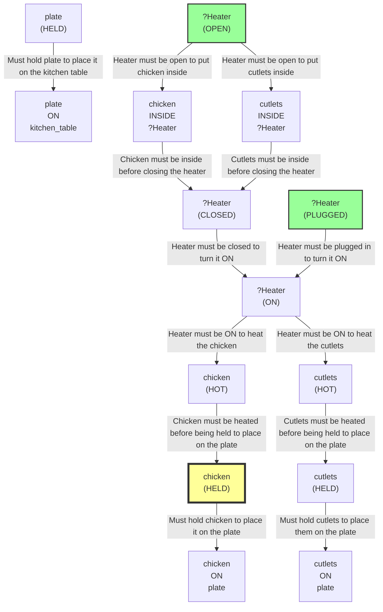
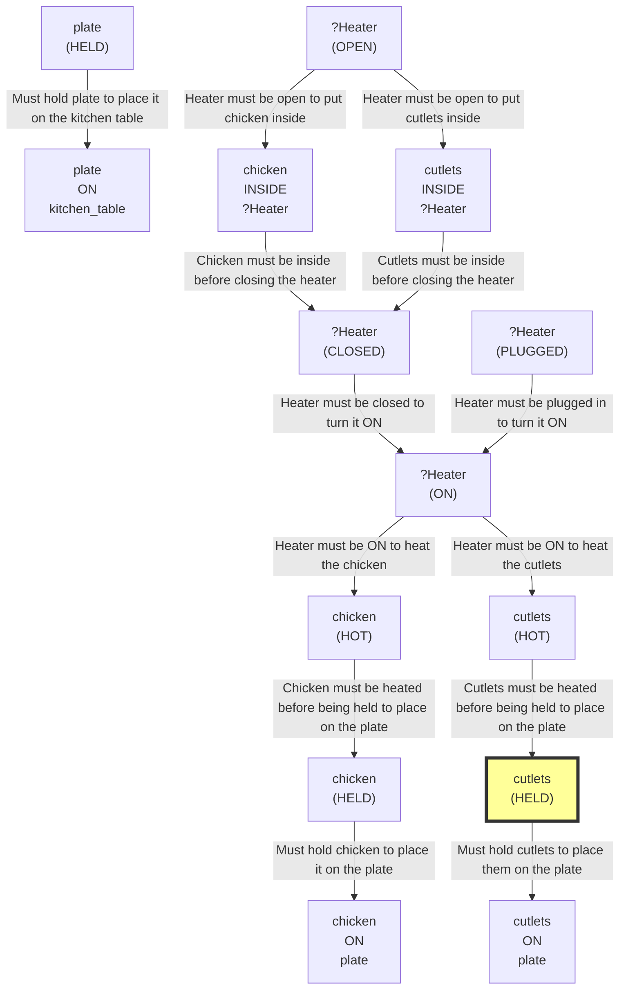
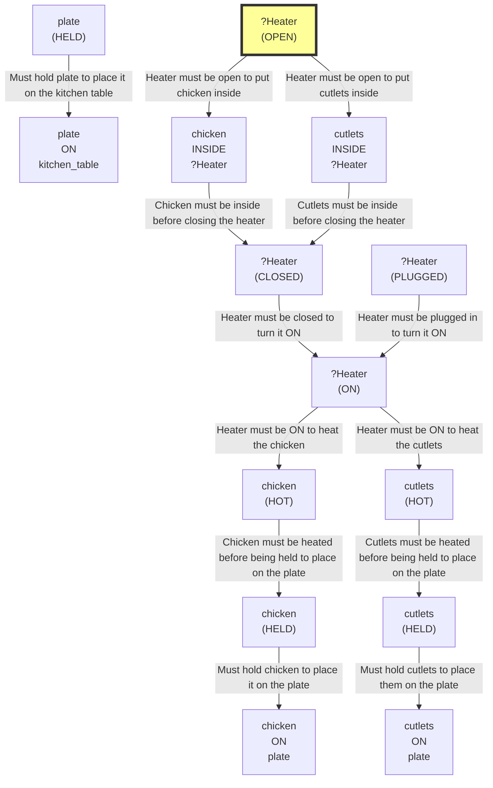
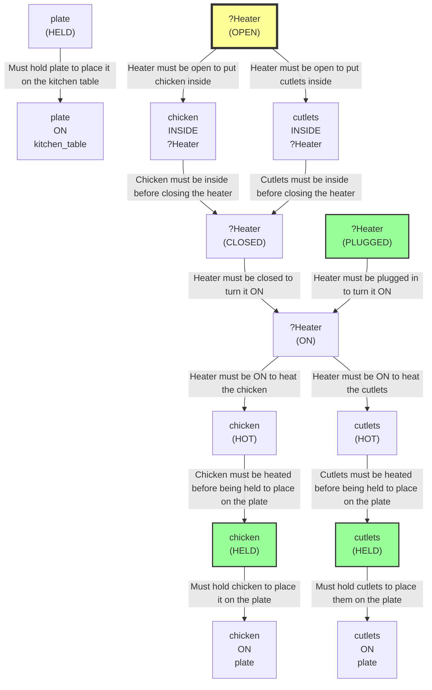
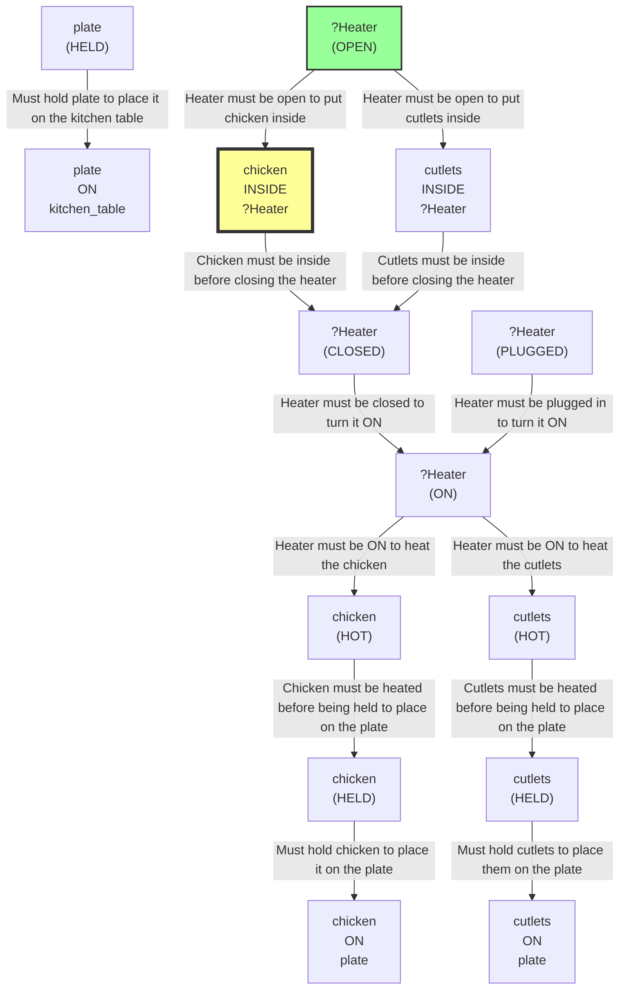
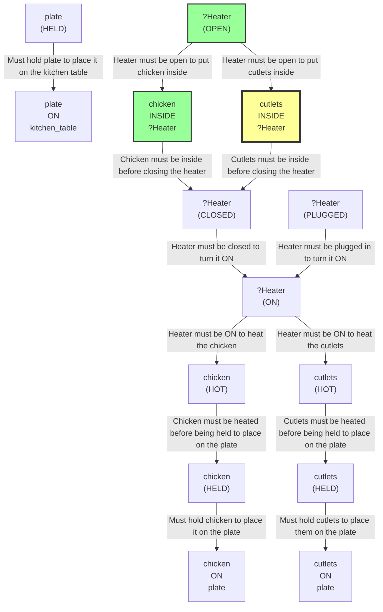
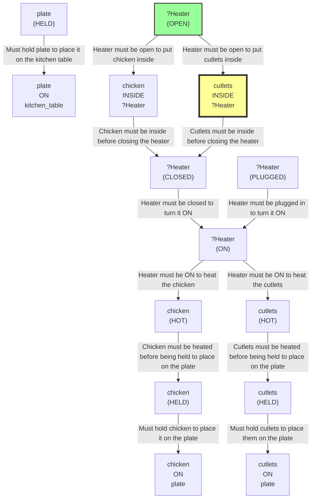
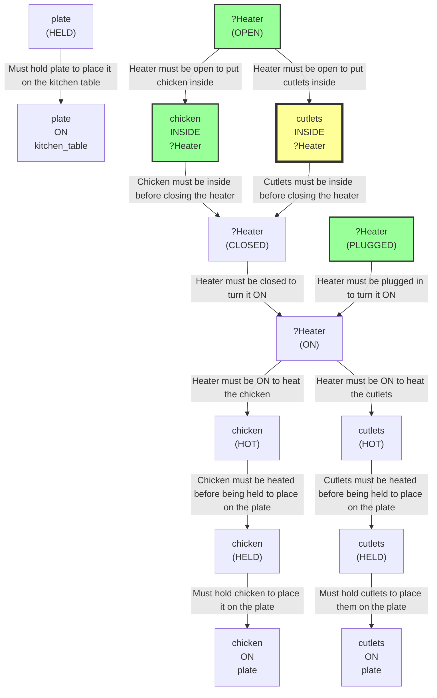
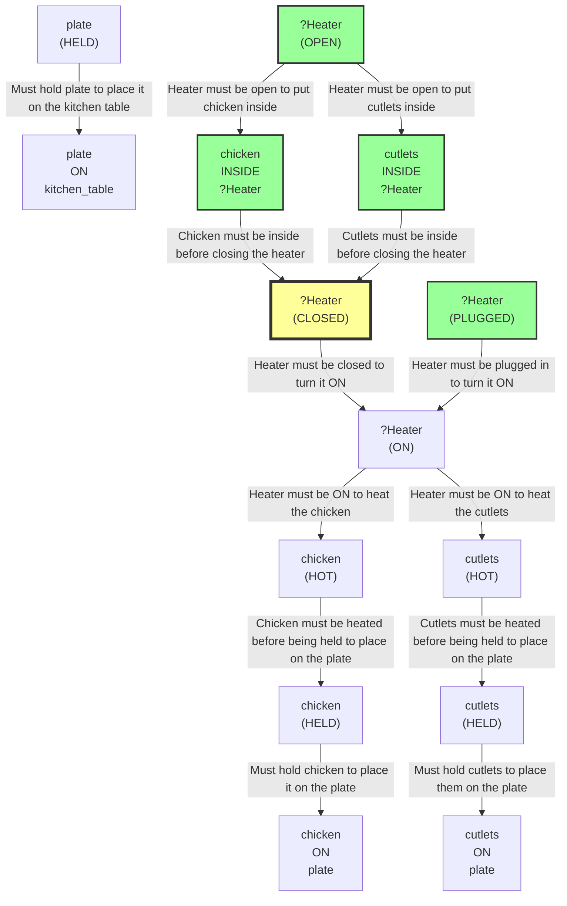
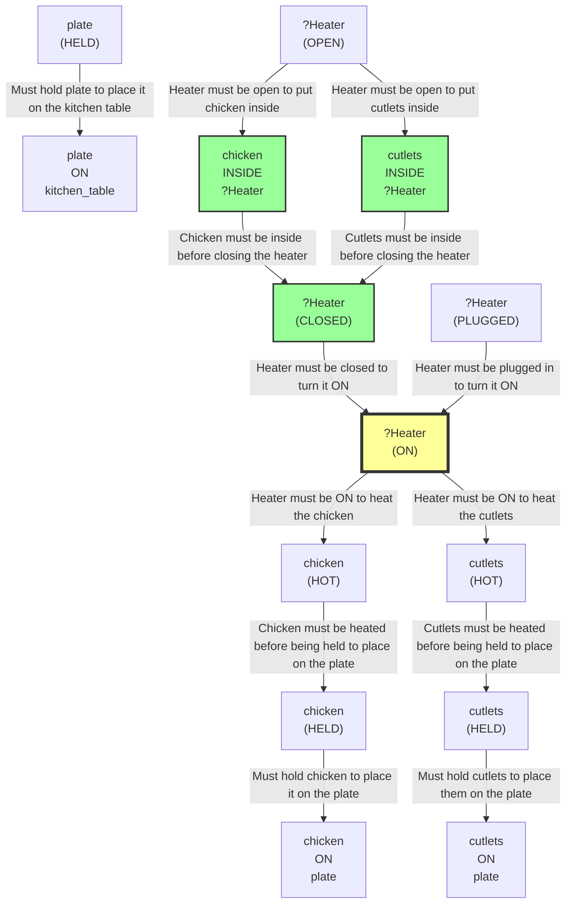

# 🚀 VirtualHome Agent Episode Log


### [GoalReasoner (Module A - Intent)] Output
```json
{
  "is_instruction_obviously_vague": false,
  "clarification_question": null,
  "target_object": "chicken and cutlets",
  "location_hint": "fridge",
  "reasoning_chain": [
    {
      "question": "Why does the user want this object?",
      "answer": "The user wants to heat up chicken and cutlets in the microwave, plate them, and have them placed on the kitchen table."
    },
    {
      "question": "Why is that important?",
      "answer": "To prepare a warm, ready-to-eat meal consisting of cooked meats."
    },
    {
      "question": "What fundamental need does this fulfill?",
      "answer": "The need to consume a warm, protein-rich meal to satisfy hunger."
    },
    {
      "question": "Are there any deeper psychological or physical motivations?",
      "answer": "The physical motivation is to relieve hunger and sustain energy levels through a hot meal."
    }
  ],
  "deep_intent": "The user wants to consume a warm, protein-rich meal to satisfy hunger",
  "acceptable_alternatives_properties": [
    {
      "priority": 1,
      "description": "Other pre-cooked meat items in the fridge that can be microwaved, such as cooked beef, pork, or turkey slices."
    },
    {
      "priority": 2,
      "description": "Other ready-to-heat savory meals or leftovers in the fridge, such as a pasta dish or a stew."
    },
    {
      "priority": 3,
      "description": "Cold ready-to-eat protein sources, such as ham slices, cheese, or hard-boiled eggs from the fridge."
    },
    {
      "priority": 4,
      "description": "Shelf-stable savory snacks or canned foods that can be heated or eaten directly to satisfy hunger."
    }
  ]
}
```

### [PerceptionFilter] Output
```json
{
  "reasoning": "The goal is to heat chicken and cutlets in a heater (microwave or stove), plate them, and place them on the kitchen table. I must select the target foods (chicken, cutlets), the target receptacle (plate), the destination (kitchentable), the storage location (fridge), and all potential heating appliances (?Heater matches microwave and stove).",
  "selected_classes": [
    "microwave",
    "plate",
    "fridge",
    "cutlets",
    "stove",
    "chicken",
    "kitchentable",
    "character"
  ],
  "raw_class_count": 45
}
```

### [LLMExecutor] Output
```json
{
  "reasoning": "The chicken and cutlets are inside the fridge, which is currently open and close to the character. To heat them, they must be placed inside the microwave (?Heater). Since both hands are empty, I can optimize the process by grabbing both the chicken and the cutlets first before walking to the microwave. I will start by grabbing the chicken.",
  "satisfied_nodes": [
    "N10",
    "N11"
  ],
  "current_node_focus": "N12",
  "mapped_variables": {
    "?Heater": "microwave(234)"
  },
  "action": "[grab] <chicken> (241)"
}
```

### [RoboStateMultiTaskController] Output
```json
{
  "action": "[grab] <chicken> (241)",
  "active_task_id": "task_1",
  "task_context": {
    "active_task_id": "task_1",
    "pending_task_ids": [],
    "satisfied_task_ids": []
  },
  "source": "llm_executor"
}
```
## Step 0
- **Action**: `[grab] <chicken> (241)`
- **Action Success**: `True`
- **Action Message**: {'0': {'message': 'Success'}}
- **Active Task**: `task_1`
- **Decision Source**: `llm_executor`
- **Task Progress**: T4_gemini_P1_03=pending
- **SDG Status**:

- **Observed Items (18)**: plate(170), plate(171), plate(172), plate(173), plate(177), plate(178), plate(184), kitchentable(199), fridge(225) [OPEN], stove(226) [OFF,CLOSED], microwave(234) [CLOSED,OFF], character(1), chicken(241) [COLD], cutlets(242) [COLD], bathroom(11)...


### [PerceptionFilter] Output
```json
{
  "reasoning": "Reused cached class selection.",
  "selected_classes": [
    "microwave",
    "plate",
    "fridge",
    "cutlets",
    "stove",
    "chicken",
    "kitchentable",
    "character"
  ],
  "raw_class_count": 45
}
```

### [LLMExecutor] Output
```json
{
  "reasoning": "I am currently holding the chicken in my right hand. To optimize the task using both hands (P2 rule), I should also grab the cutlets from the fridge before walking to the microwave. Since I am already close to the fridge and the cutlets, and my left hand is free, I can grab the cutlets directly.",
  "satisfied_nodes": [],
  "current_node_focus": "N13",
  "mapped_variables": {
    "?Heater": "microwave(234)"
  },
  "action": "[grab] <cutlets> (242)"
}
```

### [RoboStateMultiTaskController] Output
```json
{
  "action": "[grab] <cutlets> (242)",
  "active_task_id": "task_1",
  "task_context": {
    "active_task_id": "task_1",
    "pending_task_ids": [],
    "satisfied_task_ids": []
  },
  "source": "llm_executor"
}
```
## Step 1
- **Action**: `[grab] <cutlets> (242)`
- **Action Success**: `True`
- **Action Message**: {'0': {'message': 'Success'}}
- **Active Task**: `task_1`
- **Decision Source**: `llm_executor`
- **Task Progress**: T4_gemini_P1_03=pending
- **SDG Status**:

- **Observed Items (18)**: plate(170), plate(171), plate(172), plate(173), plate(177), plate(178), plate(184), kitchentable(199), fridge(225) [OPEN], stove(226) [OFF,CLOSED], microwave(234) [CLOSED,OFF], character(1), chicken(241) [COLD], cutlets(242) [COLD], bathroom(11)...


### [PerceptionFilter] Output
```json
{
  "reasoning": "Reused cached class selection.",
  "selected_classes": [
    "microwave",
    "plate",
    "fridge",
    "cutlets",
    "stove",
    "chicken",
    "kitchentable",
    "character"
  ],
  "raw_class_count": 45
}
```

### [LLMExecutor] Output
```json
{
  "reasoning": "I am currently holding both the chicken (241) and the cutlets (242). To heat them up, I need to put them inside the heater, which is the microwave (234). The microwave is currently CLOSED, so I must first walk to it and open it.",
  "satisfied_nodes": [],
  "current_node_focus": "N10",
  "mapped_variables": {
    "?Heater": "microwave(234)"
  },
  "action": "[walk] <microwave> (234)"
}
```

### [RoboStateMultiTaskController] Output
```json
{
  "action": "[walk] <microwave> (234)",
  "active_task_id": "task_1",
  "task_context": {
    "active_task_id": "task_1",
    "pending_task_ids": [],
    "satisfied_task_ids": []
  },
  "source": "llm_executor"
}
```
## Step 2
- **Action**: `[walk] <microwave> (234)`
- **Action Success**: `True`
- **Action Message**: {'0': {'message': 'Success'}}
- **Active Task**: `task_1`
- **Decision Source**: `llm_executor`
- **Task Progress**: T4_gemini_P1_03=pending
- **SDG Status**:

- **Observed Items (18)**: plate(170), plate(171), plate(172), plate(173), plate(177), plate(178), plate(184), kitchentable(199), fridge(225) [OPEN], stove(226) [OFF,CLOSED], microwave(234) [CLOSED,OFF], character(1), chicken(241) [COLD], cutlets(242) [COLD], bathroom(11)...


### [PerceptionFilter] Output
```json
{
  "reasoning": "Reused cached class selection.",
  "selected_classes": [
    "microwave",
    "plate",
    "fridge",
    "cutlets",
    "stove",
    "chicken",
    "kitchentable",
    "character"
  ],
  "raw_class_count": 45
}
```

### [LLMExecutor] Output
```json
{
  "reasoning": "I am currently holding the chicken (241) and cutlets (242) and standing close to the microwave (234). To put them inside the microwave, I must first open it.",
  "satisfied_nodes": [
    "N11",
    "N12",
    "N13"
  ],
  "current_node_focus": "N10",
  "mapped_variables": {
    "?Heater": "microwave(234)"
  },
  "action": "[open] <microwave> (234)"
}
```

### [RoboStateMultiTaskController] Output
```json
{
  "action": "[open] <microwave> (234)",
  "active_task_id": "task_1",
  "task_context": {
    "active_task_id": "task_1",
    "pending_task_ids": [],
    "satisfied_task_ids": []
  },
  "source": "llm_executor"
}
```
## Step 3
- **Action**: `[open] <microwave> (234)`
- **Action Success**: `False`
- **Action Message**: {'0': {'message': 'ScriptExcutor 0: EXECUTION_GENERAL: Script is impossible to execute\n\n'}}
- **Active Task**: `task_1`
- **Decision Source**: `llm_executor`
- **Task Progress**: T4_gemini_P1_03=pending
- **SDG Status**:

- **Observed Items (18)**: plate(170), plate(171), plate(172), plate(173), plate(177), plate(178), plate(184), kitchentable(199), fridge(225) [OPEN], stove(226) [OFF,CLOSED], microwave(234) [CLOSED,OFF], character(1), chicken(241) [COLD], cutlets(242) [COLD], bathroom(11)...


### [PerceptionFilter] Output
```json
{
  "reasoning": "Reused cached class selection.",
  "selected_classes": [
    "microwave",
    "plate",
    "fridge",
    "cutlets",
    "stove",
    "chicken",
    "kitchentable",
    "character"
  ],
  "raw_class_count": 45
}
```

### [LLMExecutor] Output
```json
{
  "reasoning": "The previous attempt to open the microwave failed because the robot's hands are full (holding chicken in the right hand and cutlets in the left hand). According to the HANDS FULL RULE, the robot cannot perform actions requiring an empty hand (like opening a microwave door) while both hands are occupied. I must first place one of the items down on a nearby surface (like the stove or kitchen table) to free up a hand, then open the microwave.",
  "satisfied_nodes": [],
  "current_node_focus": "N10",
  "mapped_variables": {
    "?Heater": "microwave(234)"
  },
  "action": "[putback] <chicken> (241) <stove> (226)"
}
```

### [RoboStateMultiTaskController] Output
```json
{
  "action": "[walk] <stove> (226)",
  "active_task_id": "task_1",
  "task_context": {
    "active_task_id": "task_1",
    "pending_task_ids": [],
    "satisfied_task_ids": []
  },
  "source": "llm_executor_repaired"
}
```
## Step 4
- **Action**: `[walk] <stove> (226)`
- **Action Success**: `True`
- **Action Message**: {'0': {'message': 'Success'}}
- **Active Task**: `task_1`
- **Decision Source**: `llm_executor_repaired`
- **Task Progress**: T4_gemini_P1_03=pending
- **SDG Status**:

- **Observed Items (18)**: plate(170), plate(171), plate(172), plate(173), plate(177), plate(178), plate(184), kitchentable(199), fridge(225) [OPEN], stove(226) [OFF,CLOSED], microwave(234) [CLOSED,OFF], character(1), chicken(241) [COLD], cutlets(242) [COLD], bathroom(11)...


### [PerceptionFilter] Output
```json
{
  "reasoning": "Reused cached class selection.",
  "selected_classes": [
    "microwave",
    "plate",
    "fridge",
    "cutlets",
    "stove",
    "chicken",
    "kitchentable",
    "character"
  ],
  "raw_class_count": 45
}
```

### [LLMExecutor] Output
```json
{
  "reasoning": "The previous attempt to open the microwave failed because my hands were full (holding chicken and cutlets). I have walked to the stove, but to open any heating container (like the stove or microwave) and place the food inside, I must first free up at least one hand. I will place the cutlets on the stove surface first so that I have a free hand to open the stove.",
  "satisfied_nodes": [],
  "current_node_focus": "N10",
  "mapped_variables": {
    "?Heater": "stove(226)"
  },
  "action": "[putback] <cutlets> (242) <stove> (226)"
}
```

### [RoboStateMultiTaskController] Output
```json
{
  "action": "[putback] <cutlets> (242) <stove> (226)",
  "active_task_id": "task_1",
  "task_context": {
    "active_task_id": "task_1",
    "pending_task_ids": [],
    "satisfied_task_ids": []
  },
  "source": "llm_executor"
}
```
## Step 5
- **Action**: `[putback] <cutlets> (242) <stove> (226)`
- **Action Success**: `True`
- **Action Message**: {'0': {'message': 'Success'}}
- **Active Task**: `task_1`
- **Decision Source**: `llm_executor`
- **Task Progress**: T4_gemini_P1_03=pending
- **SDG Status**:

- **Observed Items (18)**: plate(170), plate(171), plate(172), plate(173), plate(177), plate(178), plate(184), kitchentable(199), fridge(225) [OPEN], stove(226) [OFF,CLOSED], microwave(234) [CLOSED,OFF], character(1), chicken(241) [COLD], cutlets(242) [COLD], bathroom(11)...


### [PerceptionFilter] Output
```json
{
  "reasoning": "Reused cached class selection.",
  "selected_classes": [
    "microwave",
    "plate",
    "fridge",
    "cutlets",
    "stove",
    "chicken",
    "kitchentable",
    "character"
  ],
  "raw_class_count": 45
}
```

### [LLMExecutor] Output
```json
{
  "reasoning": "I am currently holding the chicken in my right hand, but my left hand is empty because I put the cutlets down on the stove. To open the microwave (which is the heater), I need to have a free hand. Since my left hand is already free, I can now walk to the microwave and open it to begin the heating process.",
  "satisfied_nodes": [],
  "current_node_focus": "N10",
  "mapped_variables": {
    "?Heater": "microwave(234)"
  },
  "action": "[walk] <microwave> (234)"
}
```

### [RoboStateMultiTaskController] Output
```json
{
  "action": "[walk] <microwave> (234)",
  "active_task_id": "task_1",
  "task_context": {
    "active_task_id": "task_1",
    "pending_task_ids": [],
    "satisfied_task_ids": []
  },
  "source": "llm_executor"
}
```
## Step 6
- **Action**: `[walk] <microwave> (234)`
- **Action Success**: `True`
- **Action Message**: {'0': {'message': 'Success'}}
- **Active Task**: `task_1`
- **Decision Source**: `llm_executor`
- **Task Progress**: T4_gemini_P1_03=pending
- **SDG Status**:

- **Observed Items (18)**: plate(170), plate(171), plate(172), plate(173), plate(177), plate(178), plate(184), kitchentable(199), fridge(225) [OPEN], stove(226) [OFF,CLOSED], microwave(234) [CLOSED,OFF], character(1), chicken(241) [COLD], cutlets(242) [COLD], bathroom(11)...


### [PerceptionFilter] Output
```json
{
  "reasoning": "Reused cached class selection.",
  "selected_classes": [
    "microwave",
    "plate",
    "fridge",
    "cutlets",
    "stove",
    "chicken",
    "kitchentable",
    "character"
  ],
  "raw_class_count": 45
}
```

### [LLMExecutor] Output
```json
{
  "reasoning": "I have walked to the microwave (234) and am holding the chicken (241) in my right hand. The cutlets (242) have been temporarily placed on the stove (226) to free up my left hand. Now, I need to open the microwave (234) to put the chicken inside. My previous attempt to open it failed, but I have walked back to it and am now close to it, so I will try to open it again.",
  "satisfied_nodes": [],
  "current_node_focus": "N10",
  "mapped_variables": {
    "?Heater": "microwave(234)"
  },
  "action": "[open] <microwave> (234)"
}
```

### [RoboStateMultiTaskController] Output
```json
{
  "action": "[open] <microwave> (234)",
  "active_task_id": "task_1",
  "task_context": {
    "active_task_id": "task_1",
    "pending_task_ids": [],
    "satisfied_task_ids": []
  },
  "source": "llm_executor"
}
```
## Step 7
- **Action**: `[open] <microwave> (234)`
- **Action Success**: `True`
- **Action Message**: {'0': {'message': 'Success'}}
- **Active Task**: `task_1`
- **Decision Source**: `llm_executor`
- **Task Progress**: T4_gemini_P1_03=pending
- **SDG Status**:

- **Observed Items (18)**: plate(170), plate(171), plate(172), plate(173), plate(177), plate(178), plate(184), kitchentable(199), fridge(225) [OPEN], stove(226) [OFF,CLOSED], microwave(234) [CLOSED,OFF], character(1), chicken(241) [COLD], cutlets(242) [COLD], bathroom(11)...


### [PerceptionFilter] Output
```json
{
  "reasoning": "Reused cached class selection.",
  "selected_classes": [
    "microwave",
    "plate",
    "fridge",
    "cutlets",
    "stove",
    "chicken",
    "kitchentable",
    "character"
  ],
  "raw_class_count": 45
}
```

### [LLMExecutor] Output
```json
{
  "reasoning": "The microwave (234) is now open, and I am holding the chicken (241). I need to put the chicken inside the microwave to heat it. Since I am already close to the microwave, I can directly put the chicken inside.",
  "satisfied_nodes": [
    "N10"
  ],
  "current_node_focus": "N7",
  "mapped_variables": {
    "?Heater": "microwave(234)"
  },
  "action": "[putin] <chicken> (241) <microwave> (234)"
}
```

### [RoboStateMultiTaskController] Output
```json
{
  "action": "[putin] <chicken> (241) <microwave> (234)",
  "active_task_id": "task_1",
  "task_context": {
    "active_task_id": "task_1",
    "pending_task_ids": [],
    "satisfied_task_ids": []
  },
  "source": "llm_executor"
}
```
## Step 8
- **Action**: `[putin] <chicken> (241) <microwave> (234)`
- **Action Success**: `True`
- **Action Message**: {'0': {'message': 'Success'}}
- **Active Task**: `task_1`
- **Decision Source**: `llm_executor`
- **Task Progress**: T4_gemini_P1_03=pending
- **SDG Status**:

- **Observed Items (19)**: plate(170), plate(171), plate(172), plate(173), plate(177), plate(178), plate(184), kitchentable(199), fridge(225) [OPEN], stove(226) [OFF,CLOSED], microwave(234) [OPEN,OFF], character(1), chicken(241) [COLD], cutlets(242) [COLD], bathroom(11)...


### [PerceptionFilter] Output
```json
{
  "reasoning": "Reused cached class selection.",
  "selected_classes": [
    "microwave",
    "plate",
    "fridge",
    "cutlets",
    "stove",
    "chicken",
    "kitchentable",
    "character"
  ],
  "raw_class_count": 45
}
```

### [LLMExecutor] Output
```json
{
  "reasoning": "The chicken is already inside the microwave. Now I need to put the cutlets inside the microwave as well. Since I am currently near the microwave, I must first walk to the stove where the cutlets are placed, grab them, and then bring them back to the microwave.",
  "satisfied_nodes": [
    "N10",
    "N7"
  ],
  "current_node_focus": "N8",
  "mapped_variables": {
    "?Heater": "microwave(234)"
  },
  "action": "[walk] <stove> (226)"
}
```

### [RoboStateMultiTaskController] Output
```json
{
  "action": "[walk] <stove> (226)",
  "active_task_id": "task_1",
  "task_context": {
    "active_task_id": "task_1",
    "pending_task_ids": [],
    "satisfied_task_ids": []
  },
  "source": "llm_executor"
}
```
## Step 9
- **Action**: `[walk] <stove> (226)`
- **Action Success**: `True`
- **Action Message**: {'0': {'message': 'Success'}}
- **Active Task**: `task_1`
- **Decision Source**: `llm_executor`
- **Task Progress**: T4_gemini_P1_03=pending
- **SDG Status**:

- **Observed Items (19)**: plate(170), plate(171), plate(172), plate(173), plate(177), plate(178), plate(184), kitchentable(199), fridge(225) [OPEN], stove(226) [OFF,CLOSED], microwave(234) [OPEN,OFF], character(1), chicken(241) [COLD], cutlets(242) [COLD], bathroom(11)...


### [PerceptionFilter] Output
```json
{
  "reasoning": "Reused cached class selection.",
  "selected_classes": [
    "microwave",
    "plate",
    "fridge",
    "cutlets",
    "stove",
    "chicken",
    "kitchentable",
    "character"
  ],
  "raw_class_count": 45
}
```

### [LLMExecutor] Output
```json
{
  "reasoning": "The chicken is already inside the microwave. Now I need to grab the cutlets from the stove and put them inside the microwave as well so both can be heated. I am currently close to the stove and the cutlets, so I can grab the cutlets directly.",
  "satisfied_nodes": [
    "N10"
  ],
  "current_node_focus": "N8",
  "mapped_variables": {
    "?Heater": "microwave(234)"
  },
  "action": "[grab] <cutlets> (242)"
}
```

### [RoboStateMultiTaskController] Output
```json
{
  "action": "[grab] <cutlets> (242)",
  "active_task_id": "task_1",
  "task_context": {
    "active_task_id": "task_1",
    "pending_task_ids": [],
    "satisfied_task_ids": []
  },
  "source": "llm_executor"
}
```
## Step 10
- **Action**: `[grab] <cutlets> (242)`
- **Action Success**: `True`
- **Action Message**: {'0': {'message': 'Success'}}
- **Active Task**: `task_1`
- **Decision Source**: `llm_executor`
- **Task Progress**: T4_gemini_P1_03=pending
- **SDG Status**:

- **Observed Items (19)**: plate(170), plate(171), plate(172), plate(173), plate(177), plate(178), plate(184), kitchentable(199), fridge(225) [OPEN], stove(226) [OFF,CLOSED], microwave(234) [OPEN,OFF], character(1), chicken(241) [COLD], cutlets(242) [COLD], bathroom(11)...


### [PerceptionFilter] Output
```json
{
  "reasoning": "Reused cached class selection.",
  "selected_classes": [
    "microwave",
    "plate",
    "fridge",
    "cutlets",
    "stove",
    "chicken",
    "kitchentable",
    "character"
  ],
  "raw_class_count": 45
}
```

### [LLMExecutor] Output
```json
{
  "reasoning": "I am currently holding the cutlets (242) and the microwave (234) is open. The chicken (241) is already inside the microwave. I need to put the cutlets inside the microwave as well. First, I must walk to the microwave.",
  "satisfied_nodes": [
    "N10",
    "N11",
    "N7"
  ],
  "current_node_focus": "N8",
  "mapped_variables": {
    "?Heater": "microwave(234)"
  },
  "action": "[walk] <microwave> (234)"
}
```

### [RoboStateMultiTaskController] Output
```json
{
  "action": "[walk] <microwave> (234)",
  "active_task_id": "task_1",
  "task_context": {
    "active_task_id": "task_1",
    "pending_task_ids": [],
    "satisfied_task_ids": []
  },
  "source": "llm_executor"
}
```
## Step 11
- **Action**: `[walk] <microwave> (234)`
- **Action Success**: `True`
- **Action Message**: {'0': {'message': 'Success'}}
- **Active Task**: `task_1`
- **Decision Source**: `llm_executor`
- **Task Progress**: T4_gemini_P1_03=pending
- **SDG Status**:

- **Observed Items (19)**: plate(170), plate(171), plate(172), plate(173), plate(177), plate(178), plate(184), kitchentable(199), fridge(225) [OPEN], stove(226) [OFF,CLOSED], microwave(234) [OPEN,OFF], character(1), chicken(241) [COLD], cutlets(242) [COLD], bathroom(11)...


### [PerceptionFilter] Output
```json
{
  "reasoning": "Reused cached class selection.",
  "selected_classes": [
    "microwave",
    "plate",
    "fridge",
    "cutlets",
    "stove",
    "chicken",
    "kitchentable",
    "character"
  ],
  "raw_class_count": 45
}
```

### [LLMExecutor] Output
```json
{
  "reasoning": "The character is currently holding the cutlets, is standing close to the microwave, and the microwave is open. The chicken is already inside the microwave. The next logical step to satisfy N8 (cutlets inside the heater) is to put the cutlets inside the microwave.",
  "satisfied_nodes": [
    "N10",
    "N11",
    "N7"
  ],
  "current_node_focus": "N8",
  "mapped_variables": {
    "?Heater": "microwave(234)"
  },
  "action": "[putin] <cutlets> (242) <microwave> (234)"
}
```

### [RoboStateMultiTaskController] Output
```json
{
  "action": "[putin] <cutlets> (242) <microwave> (234)",
  "active_task_id": "task_1",
  "task_context": {
    "active_task_id": "task_1",
    "pending_task_ids": [],
    "satisfied_task_ids": []
  },
  "source": "llm_executor"
}
```
## Step 12
- **Action**: `[putin] <cutlets> (242) <microwave> (234)`
- **Action Success**: `True`
- **Action Message**: {'0': {'message': 'Success'}}
- **Active Task**: `task_1`
- **Decision Source**: `llm_executor`
- **Task Progress**: T4_gemini_P1_03=pending
- **SDG Status**:

- **Observed Items (19)**: plate(170), plate(171), plate(172), plate(173), plate(177), plate(178), plate(184), kitchentable(199), fridge(225) [OPEN], stove(226) [OFF,CLOSED], microwave(234) [OPEN,OFF], character(1), chicken(241) [COLD], cutlets(242) [COLD], bathroom(11)...


### [PerceptionFilter] Output
```json
{
  "reasoning": "Reused cached class selection.",
  "selected_classes": [
    "microwave",
    "plate",
    "fridge",
    "cutlets",
    "stove",
    "chicken",
    "kitchentable",
    "character"
  ],
  "raw_class_count": 45
}
```

### [LLMExecutor] Output
```json
{
  "reasoning": "Both the chicken (241) and the cutlets (242) have been successfully placed inside the microwave (234). The microwave is currently OPEN. According to the SDG, the heater (?Heater = microwave) must be CLOSED (N9) before it can be turned ON (N6) to heat the food. Since the character is already close to the microwave, the next logical step is to close the microwave.",
  "satisfied_nodes": [
    "N7",
    "N8",
    "N10",
    "N11"
  ],
  "current_node_focus": "N9",
  "mapped_variables": {
    "?Heater": "microwave(234)"
  },
  "action": "[close] <microwave> (234)"
}
```

### [RoboStateMultiTaskController] Output
```json
{
  "action": "[close] <microwave> (234)",
  "active_task_id": "task_1",
  "task_context": {
    "active_task_id": "task_1",
    "pending_task_ids": [],
    "satisfied_task_ids": []
  },
  "source": "llm_executor"
}
```
## Step 13
- **Action**: `[close] <microwave> (234)`
- **Action Success**: `True`
- **Action Message**: {'0': {'message': 'Success'}}
- **Active Task**: `task_1`
- **Decision Source**: `llm_executor`
- **Task Progress**: T4_gemini_P1_03=pending
- **SDG Status**:

- **Observed Items (19)**: plate(170), plate(171), plate(172), plate(173), plate(177), plate(178), plate(184), kitchentable(199), fridge(225) [OPEN], stove(226) [OFF,CLOSED], microwave(234) [OPEN,OFF], character(1), chicken(241) [COLD], cutlets(242) [COLD], bathroom(11)...


### [PerceptionFilter] Output
```json
{
  "reasoning": "Reused cached class selection.",
  "selected_classes": [
    "microwave",
    "plate",
    "fridge",
    "cutlets",
    "stove",
    "chicken",
    "kitchentable",
    "character"
  ],
  "raw_class_count": 45
}
```

### [LLMExecutor] Output
```json
{
  "reasoning": "Both the chicken (241) and cutlets (242) are inside the microwave (234), and the microwave door is closed. The microwave is currently OFF. To heat the food, I need to turn the microwave ON. Since I am already close to the microwave, I can directly switch it on.",
  "satisfied_nodes": [
    "N7",
    "N8",
    "N9"
  ],
  "current_node_focus": "N6",
  "mapped_variables": {
    "?Heater": "microwave(234)"
  },
  "action": "[switchon] <microwave> (234)"
}
```

### [RoboStateMultiTaskController] Output
```json
{
  "action": "[switchon] <microwave> (234)",
  "active_task_id": "task_1",
  "task_context": {
    "active_task_id": "task_1",
    "pending_task_ids": [],
    "satisfied_task_ids": []
  },
  "source": "llm_executor"
}
```
## Step 14
- **Action**: `[switchon] <microwave> (234)`
- **Action Success**: `True`
- **Action Message**: Faked switch operation in Python layer (bypassed Unity failure)
- **Active Task**: `task_1`
- **Decision Source**: `llm_executor`
- **Task Progress**: T4_gemini_P1_03=pending
- **SDG Status**:

- **Observed Items (19)**: plate(170), plate(171), plate(172), plate(173), plate(177), plate(178), plate(184), kitchentable(199), fridge(225) [OPEN], stove(226) [OFF,CLOSED], microwave(234) [OFF,CLOSED], character(1), chicken(241) [COLD], cutlets(242) [COLD], bathroom(11)...

