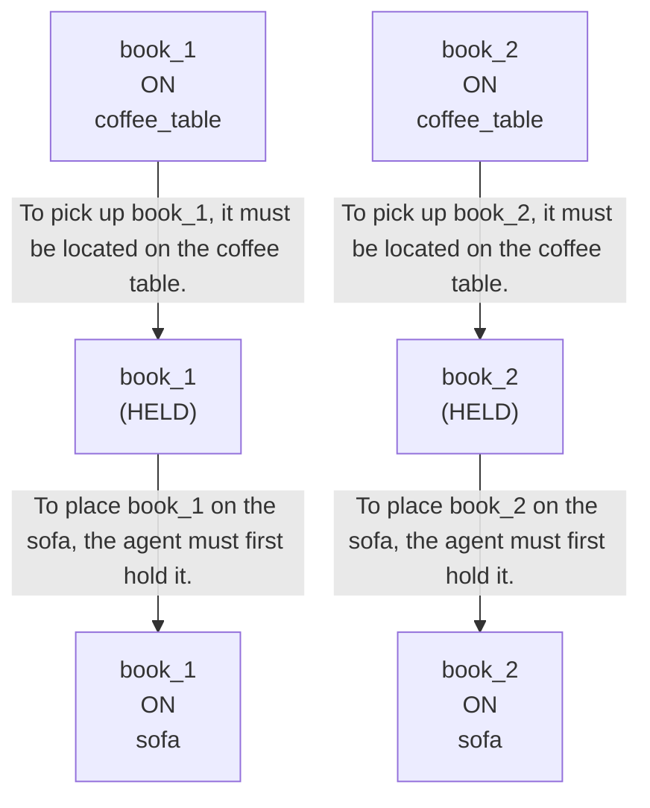
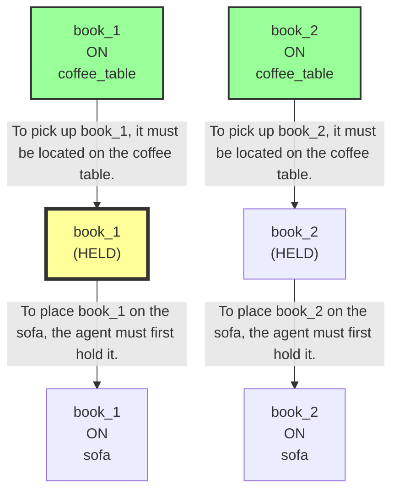
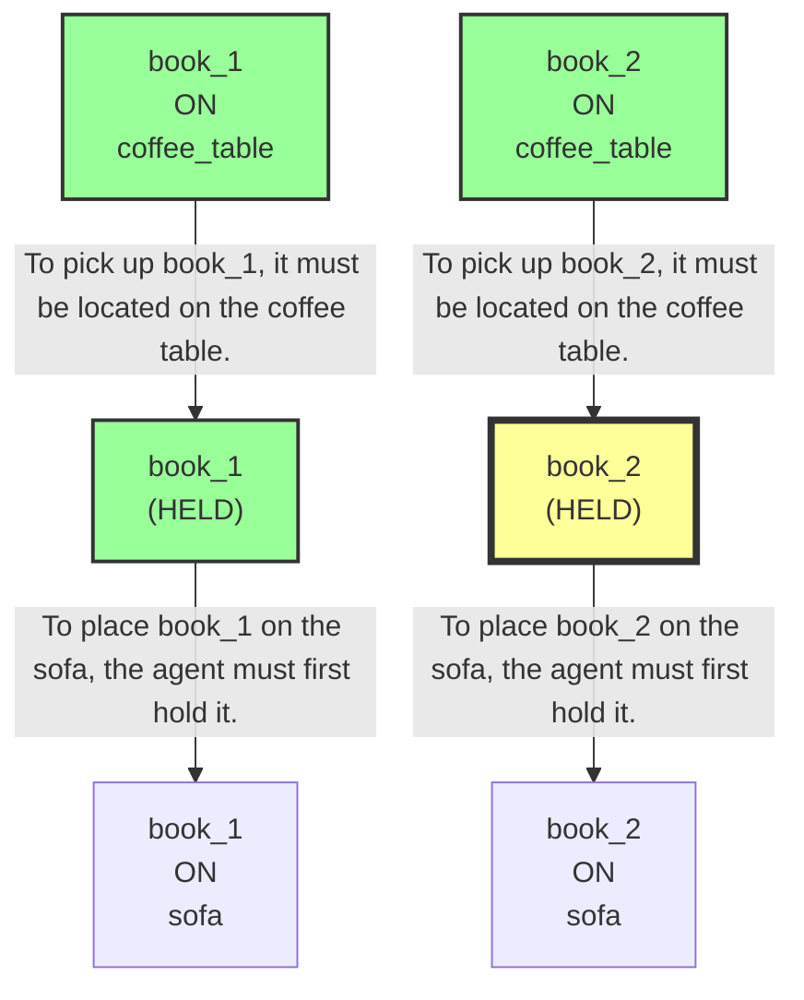
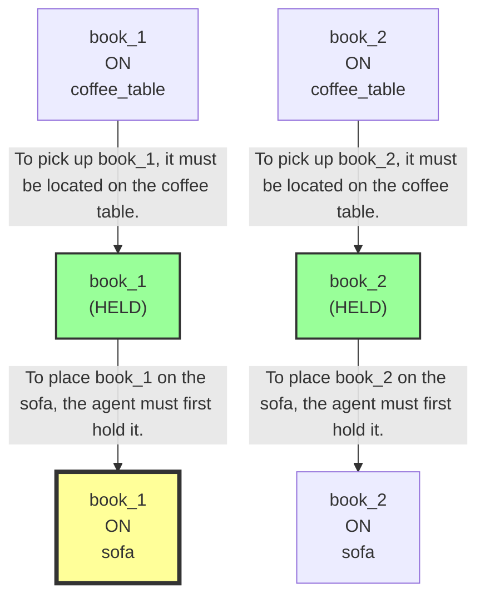
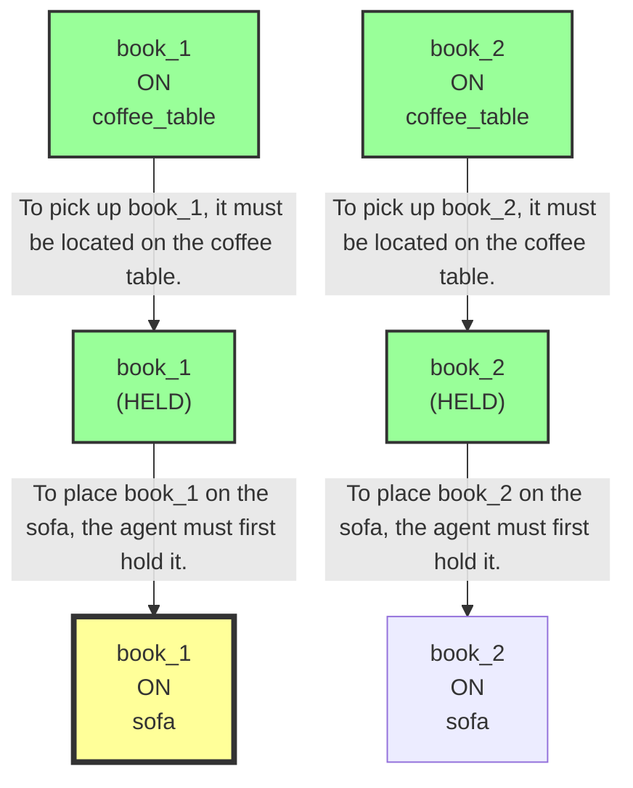
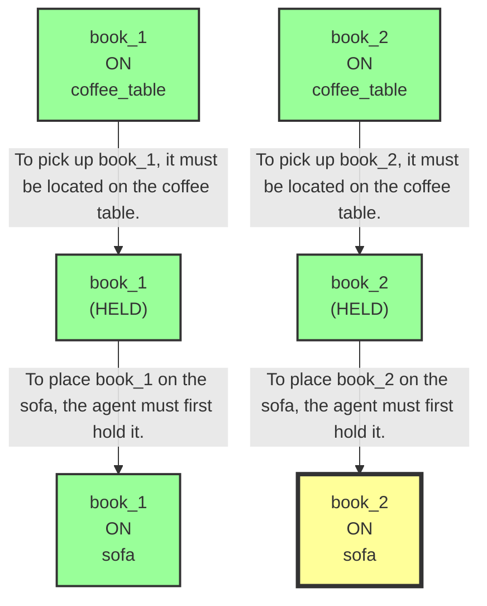

# 🚀 VirtualHome Agent Episode Log


### [GoalReasoner (Module A - Intent)] Output
```json
{
  "is_instruction_obviously_vague": false,
  "clarification_question": null,
  "target_object": "two books",
  "location_hint": "coffee table",
  "reasoning_chain": [
    {
      "question": "Why does the user want to move the two books from the coffee table to the sofa?",
      "answer": "To relocate their reading materials to the place where they intend to sit and read."
    },
    {
      "question": "Why is that important?",
      "answer": "It ensures the reading materials are within arm's reach of their comfortable seating area."
    },
    {
      "question": "What fundamental need does this fulfill?",
      "answer": "The need for convenience, comfort, and cognitive leisure while relaxing on the sofa."
    }
  ],
  "deep_intent": "The user wants to have leisure reading materials easily accessible from their comfortable seating area",
  "acceptable_alternatives_properties": [
    {
      "priority": 1,
      "description": "Other physical reading materials currently on the coffee table, such as magazines, journals, or newspapers."
    },
    {
      "priority": 2,
      "description": "An e-reader or tablet device located nearby that contains digital books."
    },
    {
      "priority": 3,
      "description": "Other books from a nearby bookshelf or surface if the specific ones on the coffee table are missing."
    },
    {
      "priority": 4,
      "description": "Other leisure items normally used while relaxing on a sofa, such as a notebook or puzzle book."
    }
  ]
}
```

### [RoboStateMultiTaskController] Output
```json
{
  "action": "[walk] <bathroom> (11)",
  "active_task_id": "task_1",
  "task_context": {
    "active_task_id": "task_1",
    "pending_task_ids": [],
    "satisfied_task_ids": []
  },
  "source": "room_frontier"
}
```
## Step 0
- **Action**: `[walk] <bathroom> (11)`
- **Action Success**: `True`
- **Action Message**: {'0': {'message': 'Success'}}
- **Active Task**: `task_1`
- **Decision Source**: `room_frontier`
- **Task Progress**: T4_gemini_P2_10=pending
- **SDG Status**:

- **Observed Items (79)**: floor(336), floor(337), floor(338), floor(339), floor(340), floor(341), floor(342), floor(343), floor(344), wall(345), wall(346), wall(347), wall(348), wall(349), wall(350)...


### [RoboStateMultiTaskController] Output
```json
{
  "action": "[walk] <bedroom> (73)",
  "active_task_id": "task_1",
  "task_context": {
    "active_task_id": "task_1",
    "pending_task_ids": [],
    "satisfied_task_ids": []
  },
  "source": "room_frontier"
}
```
## Step 1
- **Action**: `[walk] <bedroom> (73)`
- **Action Success**: `True`
- **Action Message**: {'0': {'message': 'Success'}}
- **Active Task**: `task_1`
- **Decision Source**: `room_frontier`
- **Task Progress**: T4_gemini_P2_10=pending
- **SDG Status**:

- **Observed Items (140)**: floor(336), floor(337), floor(338), floor(339), floor(340), floor(341), floor(342), floor(343), floor(344), wall(345), wall(346), wall(347), wall(348), wall(349), wall(350)...


### [PerceptionFilter] Output
```json
{
  "reasoning": "The goal is to move two books from the coffee table to the sofa. I need to select the target objects ('book'), the initial location ('coffeetable'), and the destination ('sofa'). I will also retain 'bookshelf' as a potential alternative source for books as specified in the acceptable alternatives.",
  "selected_classes": [
    "coffeetable",
    "sofa",
    "bookshelf",
    "book",
    "paper",
    "character"
  ],
  "raw_class_count": 70
}
```

### [LLMExecutor] Output
```json
{
  "reasoning": "The goal is to move two books from the coffee table to the sofa. Currently, the character is in the bedroom(73) and is close to the two books, book(190) and book(191), which are on the coffeetable(111). To optimize efficiency (P2 rule), since both hands are empty, I should grab the first book, then grab the second book before walking to the destination sofa. I am already close to book(190), so I can grab it directly.",
  "satisfied_nodes": [
    "N5",
    "N6"
  ],
  "current_node_focus": "N3",
  "mapped_variables": {
    "?book_1": "book(190)",
    "?book_2": "book(191)",
    "?coffee_table": "coffeetable(111)",
    "?sofa": "sofa(368)"
  },
  "action": "[grab] <book> (190)"
}
```

### [RoboStateMultiTaskController] Output
```json
{
  "action": "[grab] <book> (190)",
  "active_task_id": "task_1",
  "task_context": {
    "active_task_id": "task_1",
    "pending_task_ids": [],
    "satisfied_task_ids": []
  },
  "source": "llm_executor"
}
```
## Step 2
- **Action**: `[grab] <book> (190)`
- **Action Success**: `True`
- **Action Message**: {'0': {'message': 'Success'}}
- **Active Task**: `task_1`
- **Decision Source**: `llm_executor`
- **Task Progress**: T4_gemini_P2_10=pending
- **SDG Status**:

- **Observed Items (13)**: sofa(368), bookshelf(370), coffeetable(371), paper(451), character(1), bathroom(11), bedroom(73), kitchen(205), livingroom(335), bookshelf(105), coffeetable(111), book(190) [CLOSED], book(191) [CLOSED]


### [PerceptionFilter] Output
```json
{
  "reasoning": "Reused cached class selection.",
  "selected_classes": [
    "coffeetable",
    "sofa",
    "bookshelf",
    "book",
    "paper",
    "character"
  ],
  "raw_class_count": 70
}
```

### [LLMExecutor] Output
```json
{
  "reasoning": "I am currently holding book(190) in my right hand. To optimize transport using both hands (P2 rule), I should grab the second book, book(191), which is also on the coffee table in the bedroom right next to me, before walking to the sofa in the living room.",
  "satisfied_nodes": [
    "N3",
    "N5",
    "N6"
  ],
  "current_node_focus": "N4",
  "mapped_variables": {
    "?book_1": "book(190)",
    "?book_2": "book(191)",
    "?coffee_table": "coffeetable(111)",
    "?sofa": "sofa(368)"
  },
  "action": "[grab] <book> (191)"
}
```

### [RoboStateMultiTaskController] Output
```json
{
  "action": "[grab] <book> (191)",
  "active_task_id": "task_1",
  "task_context": {
    "active_task_id": "task_1",
    "pending_task_ids": [],
    "satisfied_task_ids": []
  },
  "source": "llm_executor"
}
```
## Step 3
- **Action**: `[grab] <book> (191)`
- **Action Success**: `True`
- **Action Message**: {'0': {'message': 'Success'}}
- **Active Task**: `task_1`
- **Decision Source**: `llm_executor`
- **Task Progress**: T4_gemini_P2_10=pending
- **SDG Status**:

- **Observed Items (13)**: sofa(368), bookshelf(370), coffeetable(371), paper(451), character(1), bathroom(11), bedroom(73), kitchen(205), livingroom(335), bookshelf(105), coffeetable(111), book(190) [CLOSED], book(191) [CLOSED]


### [PerceptionFilter] Output
```json
{
  "reasoning": "Reused cached class selection.",
  "selected_classes": [
    "coffeetable",
    "sofa",
    "bookshelf",
    "book",
    "paper",
    "character"
  ],
  "raw_class_count": 70
}
```

### [LLMExecutor] Output
```json
{
  "reasoning": "I am currently holding both book(190) and book(191) in my hands. The goal is to place both books on the sofa(368) in the livingroom(335). I must first walk to the sofa(368) before I can place the books on it.",
  "satisfied_nodes": [
    "N3",
    "N4"
  ],
  "current_node_focus": "N1",
  "mapped_variables": {
    "?book_1": "book(190)",
    "?book_2": "book(191)",
    "?sofa": "sofa(368)"
  },
  "action": "[walk] <sofa> (368)"
}
```

### [RoboStateMultiTaskController] Output
```json
{
  "action": "[walk] <sofa> (368)",
  "active_task_id": "task_1",
  "task_context": {
    "active_task_id": "task_1",
    "pending_task_ids": [],
    "satisfied_task_ids": []
  },
  "source": "llm_executor"
}
```
## Step 4
- **Action**: `[walk] <sofa> (368)`
- **Action Success**: `True`
- **Action Message**: {'0': {'message': 'Success'}}
- **Active Task**: `task_1`
- **Decision Source**: `llm_executor`
- **Task Progress**: T4_gemini_P2_10=pending
- **SDG Status**:

- **Observed Items (13)**: sofa(368), bookshelf(370), coffeetable(371), paper(451), character(1), bathroom(11), bedroom(73), kitchen(205), livingroom(335), bookshelf(105), coffeetable(111), book(190) [CLOSED], book(191) [CLOSED]


### [PerceptionFilter] Output
```json
{
  "reasoning": "Reused cached class selection.",
  "selected_classes": [
    "coffeetable",
    "sofa",
    "bookshelf",
    "book",
    "paper",
    "character"
  ],
  "raw_class_count": 70
}
```

### [LLMExecutor] Output
```json
{
  "reasoning": "The agent is currently holding both book(190) and book(191) in its hands and is already standing close to the sofa(368). The next logical step to satisfy the goal is to place the first book, book(190), onto the sofa(368) using the [putback] action since the sofa is a flat surface.",
  "satisfied_nodes": [
    "N3",
    "N4",
    "N5",
    "N6"
  ],
  "current_node_focus": "N1",
  "mapped_variables": {
    "?book_1": "book(190)",
    "?book_2": "book(191)",
    "?sofa": "sofa(368)"
  },
  "action": "[putback] <book> (190) <sofa> (368)"
}
```

### [RoboStateMultiTaskController] Output
```json
{
  "action": "[putback] <book> (190) <sofa> (368)",
  "active_task_id": "task_1",
  "task_context": {
    "active_task_id": "task_1",
    "pending_task_ids": [],
    "satisfied_task_ids": []
  },
  "source": "llm_executor"
}
```
## Step 5
- **Action**: `[putback] <book> (190) <sofa> (368)`
- **Action Success**: `True`
- **Action Message**: {'0': {'message': 'Success'}}
- **Active Task**: `task_1`
- **Decision Source**: `llm_executor`
- **Task Progress**: T4_gemini_P2_10=pending
- **SDG Status**:

- **Observed Items (13)**: sofa(368), bookshelf(370), coffeetable(371), paper(451), character(1), bathroom(11), bedroom(73), kitchen(205), livingroom(335), bookshelf(105), coffeetable(111), book(190) [CLOSED], book(191) [CLOSED]


### [PerceptionFilter] Output
```json
{
  "reasoning": "Reused cached class selection.",
  "selected_classes": [
    "coffeetable",
    "sofa",
    "bookshelf",
    "book",
    "paper",
    "character"
  ],
  "raw_class_count": 70
}
```

### [LLMExecutor] Output
```json
{
  "reasoning": "I have already placed book(190) on the sofa(368) and I am currently holding book(191) in my left hand. I am already close to the sofa(368). Now, I need to place book(191) on the sofa to satisfy the final goal state.",
  "satisfied_nodes": [
    "N1",
    "N3",
    "N4",
    "N5",
    "N6"
  ],
  "current_node_focus": "N2",
  "mapped_variables": {
    "?book_1": "book(190)",
    "?book_2": "book(191)",
    "?sofa": "sofa(368)"
  },
  "action": "[putback] <book> (191) <sofa> (368)"
}
```

### [RoboStateMultiTaskController] Output
```json
{
  "action": "[putback] <book> (191) <sofa> (368)",
  "active_task_id": "task_1",
  "task_context": {
    "active_task_id": "task_1",
    "pending_task_ids": [],
    "satisfied_task_ids": []
  },
  "source": "llm_executor"
}
```
## Step 6
- **Action**: `[putback] <book> (191) <sofa> (368)`
- **Action Success**: `True`
- **Action Message**: {'0': {'message': 'Success'}}
- **Active Task**: `task_1`
- **Decision Source**: `llm_executor`
- **Task Progress**: T4_gemini_P2_10=done
- **SDG Status**:

- **Observed Items (13)**: sofa(368), bookshelf(370), coffeetable(371), paper(451), character(1), bathroom(11), bedroom(73), kitchen(205), livingroom(335), bookshelf(105), coffeetable(111), book(190) [CLOSED], book(191) [CLOSED]

