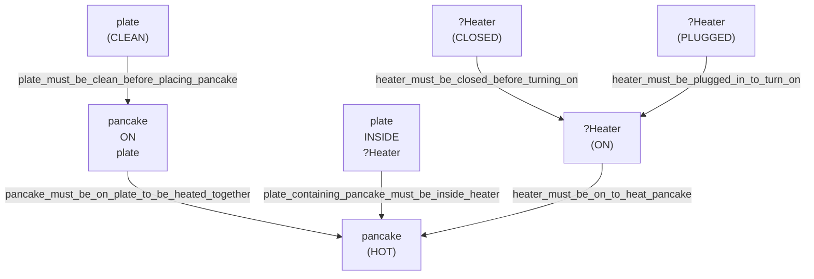
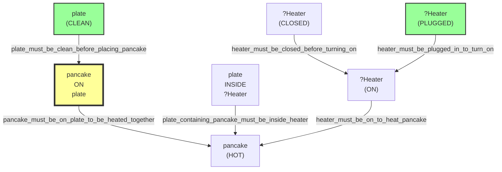
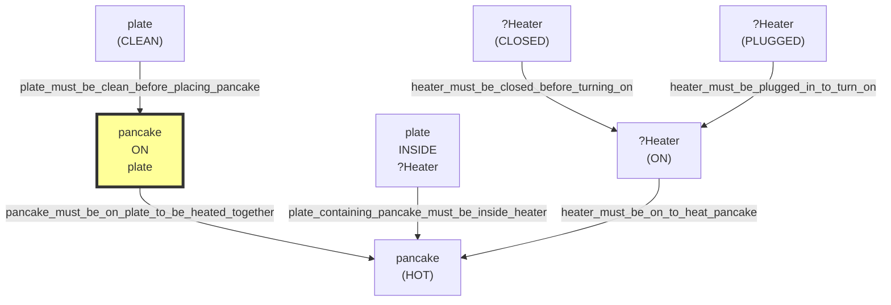
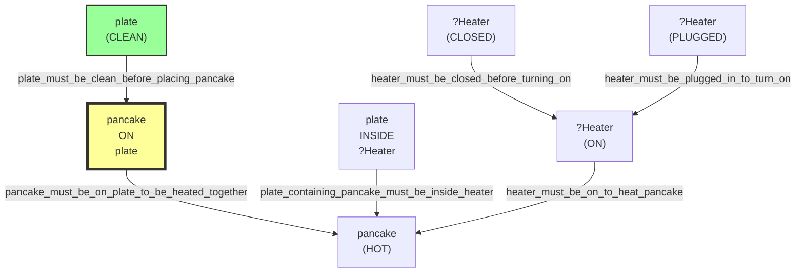

# 🚀 VirtualHome Agent Episode Log


### [GoalReasoner (Module A - Intent)] Output
```json
{
  "is_instruction_obviously_vague": false,
  "clarification_question": null,
  "target_object": "pancake",
  "location_hint": "microwave",
  "reasoning_chain": [
    {
      "question": "Why does the user want this object?",
      "answer": "The user wants to warm up a pancake using a clean plate."
    },
    {
      "question": "Why is that important?",
      "answer": "Warming up the pancake makes it hot, soft, and more palatable to eat."
    },
    {
      "question": "What fundamental need does this fulfill?",
      "answer": "It fulfills the need to consume a warm, satisfying meal or snack."
    },
    {
      "question": "Are there any deeper psychological or physical motivations?",
      "answer": "The user wants to satisfy physical hunger and enjoy a warm breakfast or dessert food."
    }
  ],
  "deep_intent": "The user wants to satisfy hunger with a warm, ready-to-eat sweet starch or breakfast food.",
  "acceptable_alternatives_properties": [
    {
      "priority": 1,
      "description": "Other pre-cooked sweet breakfast items that can be warmed up, such as waffles or crepes."
    },
    {
      "priority": 2,
      "description": "Baked goods or bread-based items that are typically served warm, like muffins, croissants, or toast."
    },
    {
      "priority": 3,
      "description": "Ready-to-eat sweet snacks that do not necessarily require heating, such as cookies or pastries."
    },
    {
      "priority": 4,
      "description": "Fresh fruits like bananas or berries which can satisfy a craving for something sweet and edible immediately."
    }
  ]
}
```

### [RoboStateMultiTaskController] Output
```json
{
  "action": "[walk] <kitchen> (11)",
  "active_task_id": "task_1",
  "task_context": {
    "active_task_id": "task_1",
    "pending_task_ids": [],
    "satisfied_task_ids": []
  },
  "source": "room_frontier"
}
```
## Step 0
- **Action**: `[walk] <kitchen> (11)`
- **Action Success**: `True`
- **Action Message**: {'0': {'message': 'Success'}}
- **Active Task**: `task_1`
- **Decision Source**: `room_frontier`
- **Task Progress**: T4_gemini_P3_17=pending
- **SDG Status**:

- **Observed Items (43)**: wall(173), wall(174), wall(175), wall(176), ceiling(177), ceiling(178), ceiling(179), ceiling(180), floor(181), floor(182), floor(183), floor(184), walllamp(185), ceilinglamp(186), walllamp(187)...


### [PerceptionFilter] Output
```json
{
  "reasoning": "The goal is to heat a pancake on a clean plate using a heating appliance (microwave or stove). We need the target object (pancake), the receptacle (plate), and all potential heating appliances (?Heater) present in the environment (microwave, stove, toaster). We also need the power source (powersocket) to plug in the heater, and cleaning tools (sink, dishwasher, dishwashingliquid, washingsponge) to ensure the plate is clean.",
  "selected_classes": [
    "bananas",
    "microwave",
    "dishwasher",
    "plate",
    "sink",
    "pancake",
    "stove",
    "washingsponge",
    "toaster",
    "dishwashingliquid",
    "character",
    "powersocket"
  ],
  "raw_class_count": 79
}
```

### [LLMExecutor] Output
```json
{
  "reasoning": "The pancake needs to be placed on a clean plate. I am currently in the kitchen and close to the pancake and several plates. I will first grab the pancake.",
  "satisfied_nodes": [
    "N6",
    "N7"
  ],
  "current_node_focus": "N2",
  "mapped_variables": {
    "?Heater": "microwave(109)"
  },
  "action": "[grab] <pancake> (62)"
}
```

### [RoboStateMultiTaskController] Output
```json
{
  "action": "[grab] <pancake> (62)",
  "active_task_id": "task_1",
  "task_context": {
    "active_task_id": "task_1",
    "pending_task_ids": [],
    "satisfied_task_ids": []
  },
  "source": "llm_executor"
}
```
## Step 1
- **Action**: `[grab] <pancake> (62)`
- **Action Success**: `True`
- **Action Message**: {'0': {'message': 'Success'}}
- **Active Task**: `task_1`
- **Decision Source**: `llm_executor`
- **Task Progress**: T4_gemini_P3_17=pending
- **SDG Status**:

- **Observed Items (21)**: sink(196), character(1), kitchen(11), bathroom(172), bedroom(211), livingroom(268), bananas(49), pancake(62), sink(90), toaster(99) [OFF], dishwasher(104) [CLOSED,OFF], stove(105) [OFF,CLOSED], microwave(109) [CLOSED,OFF], washingsponge(111), dishwashingliquid(112)...


### [PerceptionFilter] Output
```json
{
  "reasoning": "Reused cached class selection.",
  "selected_classes": [
    "bananas",
    "microwave",
    "dishwasher",
    "plate",
    "sink",
    "pancake",
    "stove",
    "washingsponge",
    "toaster",
    "dishwashingliquid",
    "character",
    "powersocket"
  ],
  "raw_class_count": 79
}
```

### [LLMExecutor] Output
```json
{
  "reasoning": "I am currently holding the pancake in my right hand. To satisfy the goal of heating the pancake on a plate inside the heater (microwave), I need to first place the pancake on a clean plate. There are several plates nearby (plate(125), plate(126), plate(127), plate(128)) which are clean (they do not have the DIRTY state). Since I am already close to plate(125), I can grab it with my free left hand before proceeding to the microwave.",
  "satisfied_nodes": [],
  "current_node_focus": "N2",
  "mapped_variables": {
    "?Heater": "microwave(109)"
  },
  "action": "[grab] <plate> (125)"
}
```

### [RoboStateMultiTaskController] Output
```json
{
  "action": "[grab] <plate> (125)",
  "active_task_id": "task_1",
  "task_context": {
    "active_task_id": "task_1",
    "pending_task_ids": [],
    "satisfied_task_ids": []
  },
  "source": "llm_executor"
}
```
## Step 2
- **Action**: `[grab] <plate> (125)`
- **Action Success**: `True`
- **Action Message**: {'0': {'message': 'Success'}}
- **Active Task**: `task_1`
- **Decision Source**: `llm_executor`
- **Task Progress**: T4_gemini_P3_17=pending
- **SDG Status**:

- **Observed Items (21)**: sink(196), character(1), kitchen(11), bathroom(172), bedroom(211), livingroom(268), bananas(49), pancake(62), sink(90), toaster(99) [OFF], dishwasher(104) [CLOSED,OFF], stove(105) [OFF,CLOSED], microwave(109) [CLOSED,OFF], washingsponge(111), dishwashingliquid(112)...


### [PerceptionFilter] Output
```json
{
  "reasoning": "Reused cached class selection.",
  "selected_classes": [
    "bananas",
    "microwave",
    "dishwasher",
    "plate",
    "sink",
    "pancake",
    "stove",
    "washingsponge",
    "toaster",
    "dishwashingliquid",
    "character",
    "powersocket"
  ],
  "raw_class_count": 79
}
```

### [LLMExecutor] Output
```json
{
  "reasoning": "I am currently holding the pancake in my right hand and a plate in my left hand. To satisfy N2 (pancake ON plate), I need to place the pancake onto the plate. Since I am already holding both, I can directly put the pancake on the plate. However, the plate is a flat surface/receptacle, so I will use the [putin] action to place the pancake inside/on the plate.",
  "satisfied_nodes": [
    "N6"
  ],
  "current_node_focus": "N2",
  "mapped_variables": {
    "?Heater": "microwave(109)"
  },
  "action": "[putin] <pancake> (62) <plate> (125)"
}
```

### [RoboStateMultiTaskController] Output
```json
{
  "action": "[putin] <pancake> (62) <plate> (125)",
  "active_task_id": "task_1",
  "task_context": {
    "active_task_id": "task_1",
    "pending_task_ids": [],
    "satisfied_task_ids": []
  },
  "source": "llm_executor"
}
```
## Step 3
- **Action**: `[putin] <pancake> (62) <plate> (125)`
- **Action Success**: `False`
- **Action Message**: {'0': {'message': 'ScriptExcutor 0: EXECUTION_GENERAL: Script is impossible to execute\n\n'}}
- **Active Task**: `task_1`
- **Decision Source**: `llm_executor`
- **Task Progress**: T4_gemini_P3_17=pending
- **SDG Status**:

- **Observed Items (21)**: sink(196), character(1), kitchen(11), bathroom(172), bedroom(211), livingroom(268), bananas(49), pancake(62), sink(90), toaster(99) [OFF], dishwasher(104) [CLOSED,OFF], stove(105) [OFF,CLOSED], microwave(109) [CLOSED,OFF], washingsponge(111), dishwashingliquid(112)...


### [PerceptionFilter] Output
```json
{
  "reasoning": "Reused cached class selection.",
  "selected_classes": [
    "bananas",
    "microwave",
    "dishwasher",
    "plate",
    "sink",
    "pancake",
    "stove",
    "washingsponge",
    "toaster",
    "dishwashingliquid",
    "character",
    "powersocket"
  ],
  "raw_class_count": 79
}
```

### [LLMExecutor] Output
```json
{
  "reasoning": "The previous action [putin] pancake(62) plate(125) failed because a plate is a flat surface (SURFACES property) and not a hollow container. According to the rules, we must use [putback] instead of [putin] for flat surfaces like plates. Since I am already holding both the pancake and the plate, and they are close to me, I can directly place the pancake on the plate using [putback].",
  "satisfied_nodes": [
    "N6"
  ],
  "current_node_focus": "N2",
  "mapped_variables": {
    "?Heater": "microwave(109)"
  },
  "action": "[putback] <pancake> (62) <plate> (125)"
}
```

### [RoboStateMultiTaskController] Output
```json
{
  "action": "[putback] <pancake> (62) <plate> (125)",
  "active_task_id": "task_1",
  "task_context": {
    "active_task_id": "task_1",
    "pending_task_ids": [],
    "satisfied_task_ids": []
  },
  "source": "llm_executor"
}
```
## Step 4
- **Action**: `[putback] <pancake> (62) <plate> (125)`
- **Action Success**: `False`
- **Action Message**: {'0': {'message': 'ScriptExcutor 0: EXECUTION_GENERAL: Script is impossible to execute\n\n'}}
- **Active Task**: `task_1`
- **Decision Source**: `llm_executor`
- **Task Progress**: T4_gemini_P3_17=pending
- **SDG Status**:

- **Observed Items (21)**: sink(196), character(1), kitchen(11), bathroom(172), bedroom(211), livingroom(268), bananas(49), pancake(62), sink(90), toaster(99) [OFF], dishwasher(104) [CLOSED,OFF], stove(105) [OFF,CLOSED], microwave(109) [CLOSED,OFF], washingsponge(111), dishwashingliquid(112)...


### [RoboStateMultiTaskController] Output
```json
{
  "action": "[walk] <bedroom> (211)",
  "active_task_id": null,
  "task_context": {
    "active_task_id": null,
    "pending_task_ids": [
      "task_1"
    ],
    "satisfied_task_ids": []
  },
  "source": "loop_recovery_room_revisit"
}
```
## Step 5
- **Action**: `[walk] <bedroom> (211)`
- **Action Success**: `True`
- **Action Message**: {'0': {'message': 'Success'}}
- **Decision Source**: `loop_recovery_room_revisit`
- **Task Progress**: T4_gemini_P3_17=pending
- **SDG Status**:
No SDG active.
- **Observed Items (197)**: wall(173), wall(174), wall(175), wall(176), ceiling(177), ceiling(178), ceiling(179), ceiling(180), floor(181), floor(182), floor(183), floor(184), walllamp(185), ceilinglamp(186), walllamp(187)...


### [PerceptionFilter] Output
```json
{
  "reasoning": "The goal is to heat a pancake on a clean plate using a heating appliance. The target objects are 'pancake' and 'plate'. The '?Heater' variable can be satisfied by the 'microwave' (explicitly mentioned in the location hint) or the 'stove' as a physical backup. The plate must be clean, which requires cleaning tools like 'sink', 'faucet', 'dishwashingliquid', and 'washingsponge' if it is dirty. 'powersocket' is required to ensure the heater is plugged in.",
  "selected_classes": [
    "bananas",
    "microwave",
    "faucet",
    "plate",
    "sink",
    "pancake",
    "stove",
    "washingsponge",
    "dishwashingliquid",
    "character",
    "powersocket"
  ],
  "raw_class_count": 86
}
```

### [LLMExecutor] Output
```json
{
  "reasoning": "I am currently holding the pancake(62) in my right hand and the plate(125) in my left hand, but I am in the bedroom(211). The microwave(109) and other kitchen surfaces are in the kitchen(11). I need to walk back to the kitchen to place the pancake on the plate and put them inside the microwave.",
  "satisfied_nodes": [
    "N6"
  ],
  "current_node_focus": "N2",
  "mapped_variables": {
    "?Heater": "microwave(109)"
  },
  "action": "[walk] <kitchen> (11)"
}
```

### [RoboStateMultiTaskController] Output
```json
{
  "action": "[walk] <kitchen> (11)",
  "active_task_id": "task_1",
  "task_context": {
    "active_task_id": "task_1",
    "pending_task_ids": [],
    "satisfied_task_ids": []
  },
  "source": "llm_executor"
}
```
## Step 6
- **Action**: `[walk] <kitchen> (11)`
- **Action Success**: `True`
- **Action Message**: {'0': {'message': 'Success'}}
- **Active Task**: `task_1`
- **Decision Source**: `llm_executor`
- **Task Progress**: T4_gemini_P3_17=pending
- **SDG Status**:

- **Observed Items (23)**: faucet(195) [OFF], sink(196), character(1), kitchen(11), bathroom(172), bedroom(211), livingroom(268), bananas(49), pancake(62), sink(90), faucet(91) [OFF], stove(105) [OFF,CLOSED], microwave(109) [CLOSED,OFF], washingsponge(111), dishwashingliquid(112)...


### [PerceptionFilter] Output
```json
{
  "reasoning": "Reused cached class selection.",
  "selected_classes": [
    "bananas",
    "microwave",
    "faucet",
    "plate",
    "sink",
    "pancake",
    "stove",
    "washingsponge",
    "dishwashingliquid",
    "character",
    "powersocket"
  ],
  "raw_class_count": 86
}
```

### [LLMExecutor] Output
```json
{
  "reasoning": "I am currently holding the pancake(62) in my right hand and the plate(125) in my left hand. To satisfy N2 (pancake ON plate), I need to place the pancake onto the plate. Since plate(125) has the 'SURFACES' property, I must use the [putback] action to place the pancake on it. I am already close to both objects, so I can execute the [putback] action directly.",
  "satisfied_nodes": [
    "N6",
    "N7"
  ],
  "current_node_focus": "N2",
  "mapped_variables": {
    "?Heater": "microwave(109)"
  },
  "action": "[putback] <pancake> (62) <plate> (125)"
}
```

### [RoboStateMultiTaskController] Output
```json
{
  "action": "[putback] <pancake> (62) <plate> (125)",
  "active_task_id": "task_1",
  "task_context": {
    "active_task_id": "task_1",
    "pending_task_ids": [],
    "satisfied_task_ids": []
  },
  "source": "llm_executor"
}
```
## Step 7
- **Action**: `[putback] <pancake> (62) <plate> (125)`
- **Action Success**: `False`
- **Action Message**: {'0': {'message': 'ScriptExcutor 0: EXECUTION_GENERAL: Script is impossible to execute\n\n'}}
- **Active Task**: `task_1`
- **Decision Source**: `llm_executor`
- **Task Progress**: T4_gemini_P3_17=pending
- **SDG Status**:

- **Observed Items (23)**: faucet(195) [OFF], sink(196), character(1), kitchen(11), bathroom(172), bedroom(211), livingroom(268), bananas(49), pancake(62), sink(90), faucet(91) [OFF], stove(105) [OFF,CLOSED], microwave(109) [CLOSED,OFF], washingsponge(111), dishwashingliquid(112)...


### [PerceptionFilter] Output
```json
{
  "reasoning": "Reused cached class selection.",
  "selected_classes": [
    "bananas",
    "microwave",
    "faucet",
    "plate",
    "sink",
    "pancake",
    "stove",
    "washingsponge",
    "dishwashingliquid",
    "character",
    "powersocket"
  ],
  "raw_class_count": 86
}
```

### [LLMExecutor] Output
```json
{
  "reasoning": "I am currently holding the pancake in my right hand and the plate in my left hand. I need to place the pancake on the plate. Since the plate is a flat surface (it has the 'SURFACES' property), I must use the [putback] action to place the pancake on it. However, because I am holding both objects, I must first walk to the plate (or ensure I am close to it) and then execute [putback] to place the pancake on the plate.",
  "satisfied_nodes": [
    "N6"
  ],
  "current_node_focus": "N2",
  "mapped_variables": {
    "?Heater": "microwave(109)"
  },
  "action": "[putback] <pancake> (62) <plate> (125)"
}
```

### [RoboStateMultiTaskController] Output
```json
{
  "action": "[putback] <pancake> (62) <plate> (125)",
  "active_task_id": "task_1",
  "task_context": {
    "active_task_id": "task_1",
    "pending_task_ids": [],
    "satisfied_task_ids": []
  },
  "source": "llm_executor"
}
```
## Step 8
- **Action**: `[putback] <pancake> (62) <plate> (125)`
- **Action Success**: `False`
- **Action Message**: {'0': {'message': 'ScriptExcutor 0: EXECUTION_GENERAL: Script is impossible to execute\n\n'}}
- **Active Task**: `task_1`
- **Decision Source**: `llm_executor`
- **Task Progress**: T4_gemini_P3_17=pending
- **SDG Status**:

- **Observed Items (23)**: faucet(195) [OFF], sink(196), character(1), kitchen(11), bathroom(172), bedroom(211), livingroom(268), bananas(49), pancake(62), sink(90), faucet(91) [OFF], stove(105) [OFF,CLOSED], microwave(109) [CLOSED,OFF], washingsponge(111), dishwashingliquid(112)...


### [RoboStateMultiTaskController] Output
```json
{
  "action": "[walk] <livingroom> (268)",
  "active_task_id": null,
  "task_context": {
    "active_task_id": null,
    "pending_task_ids": [
      "task_1"
    ],
    "satisfied_task_ids": []
  },
  "source": "loop_recovery_room_revisit"
}
```
## Step 9
- **Action**: `[walk] <livingroom> (268)`
- **Action Success**: `True`
- **Action Message**: {'0': {'message': 'Success'}}
- **Decision Source**: `loop_recovery_room_revisit`
- **Task Progress**: T4_gemini_P3_17=pending
- **SDG Status**:
No SDG active.
- **Observed Items (240)**: wall(173), wall(174), wall(175), wall(176), ceiling(177), ceiling(178), ceiling(179), ceiling(180), floor(181), floor(182), floor(183), floor(184), walllamp(185), ceilinglamp(186), walllamp(187)...


### [PerceptionFilter] Output
```json
{
  "reasoning": "The goal is to heat a pancake on a clean plate using a heating appliance. The target objects are 'pancake' and 'plate'. The required '?Heater' can be satisfied by the 'microwave' (explicitly mentioned in the location hint) or the 'stove' and 'toaster' as physical backups. To ensure the plate is 'CLEAN', we need cleaning tools and locations like 'sink', 'dishwasher', 'dishwashingliquid', and 'washingsponge'. The 'powersocket' is required to satisfy the 'PLUGGED' state of the heater. Supporting surfaces and storage locations for these items include 'kitchencounter', 'kitchencabinet', and 'kitchentable'. Acceptable alternative sweet breakfast items present in the environment are 'creamybuns', 'cupcake', 'bananas', 'apple', 'pear', 'peach', and 'plum'.",
  "selected_classes": [
    "microwave",
    "plate",
    "kitchencounter",
    "stove",
    "plum",
    "cupcake",
    "powersocket",
    "character",
    "pear",
    "peach",
    "kitchentable",
    "creamybuns",
    "sink",
    "apple",
    "washingsponge",
    "toaster",
    "bananas",
    "dishwasher",
    "kitchencabinet",
    "pancake",
    "dishwashingliquid"
  ],
  "raw_class_count": 98
}
```

### [LLMExecutor] Output
```json
{
  "reasoning": "I am currently holding the pancake (62) in my right hand and a plate (125) in my left hand. I need to place the pancake on the plate. Since the plate is a flat surface (having the 'SURFACES' property), I must use the [putback] action to place the pancake on it. However, to perform [putback], I must first explicitly walk to the plate (125) to ensure I am close enough, even though the graph shows it is close.",
  "satisfied_nodes": [
    "N6"
  ],
  "current_node_focus": "N2",
  "mapped_variables": {
    "?Heater": "microwave(109)"
  },
  "action": "[walk] <plate> (125)"
}
```

### [RoboStateMultiTaskController] Output
```json
{
  "action": "[walk] <plate> (125)",
  "active_task_id": "task_1",
  "task_context": {
    "active_task_id": "task_1",
    "pending_task_ids": [],
    "satisfied_task_ids": []
  },
  "source": "llm_executor"
}
```
## Step 10
- **Action**: `[walk] <plate> (125)`
- **Action Success**: `True`
- **Action Message**: {'0': {'message': 'Success'}}
- **Active Task**: `task_1`
- **Decision Source**: `llm_executor`
- **Task Progress**: T4_gemini_P3_17=pending
- **SDG Status**:

- **Observed Items (58)**: sink(196), character(1), kitchen(11), bathroom(172), bedroom(211), livingroom(268), apple(47), apple(48), bananas(49), peach(51), peach(52), plum(53), plum(54), creamybuns(56), pancake(62)...


### [PerceptionFilter] Output
```json
{
  "reasoning": "Reused cached class selection.",
  "selected_classes": [
    "microwave",
    "plate",
    "kitchencounter",
    "stove",
    "plum",
    "cupcake",
    "powersocket",
    "character",
    "pear",
    "peach",
    "kitchentable",
    "creamybuns",
    "sink",
    "apple",
    "washingsponge",
    "toaster",
    "bananas",
    "dishwasher",
    "kitchencabinet",
    "pancake",
    "dishwashingliquid"
  ],
  "raw_class_count": 98
}
```

### [LLMExecutor] Output
```json
{
  "reasoning": "I am currently holding the pancake(62) in my right hand and the plate(125) in my left hand. To place the pancake on the plate, since the plate is a flat surface (having the SURFACES property), I must use the [putback] action. However, I must first walk to the kitchen where the heater (microwave) is located, or I can perform the placement here. Since I am already holding both, I will walk to the kitchen first to be near the microwave(109) before placing the pancake on the plate and heating it.",
  "satisfied_nodes": [
    "N6"
  ],
  "current_node_focus": "N2",
  "mapped_variables": {
    "?Heater": "microwave(109)"
  },
  "action": "[walk] <kitchen> (11)"
}
```

### [RoboStateMultiTaskController] Output
```json
{
  "action": "[walk] <kitchen> (11)",
  "active_task_id": "task_1",
  "task_context": {
    "active_task_id": "task_1",
    "pending_task_ids": [],
    "satisfied_task_ids": []
  },
  "source": "llm_executor"
}
```
## Step 11
- **Action**: `[walk] <kitchen> (11)`
- **Action Success**: `True`
- **Action Message**: {'0': {'message': 'Success'}}
- **Active Task**: `task_1`
- **Decision Source**: `llm_executor`
- **Task Progress**: T4_gemini_P3_17=pending
- **SDG Status**:

- **Observed Items (58)**: sink(196), character(1), kitchen(11), bathroom(172), bedroom(211), livingroom(268), apple(47), apple(48), bananas(49), peach(51), peach(52), plum(53), plum(54), creamybuns(56), pancake(62)...


### [PerceptionFilter] Output
```json
{
  "reasoning": "Reused cached class selection.",
  "selected_classes": [
    "microwave",
    "plate",
    "kitchencounter",
    "stove",
    "plum",
    "cupcake",
    "powersocket",
    "character",
    "pear",
    "peach",
    "kitchentable",
    "creamybuns",
    "sink",
    "apple",
    "washingsponge",
    "toaster",
    "bananas",
    "dishwasher",
    "kitchencabinet",
    "pancake",
    "dishwashingliquid"
  ],
  "raw_class_count": 98
}
```

### [LLMExecutor] Output
```json
{
  "reasoning": "The robot is currently holding the pancake(62) in its right hand and the plate(125) in its left hand. To satisfy N2 (pancake ON plate), we need to place the pancake on the plate. Since the plate is a flat surface (SURFACES property), we must use the [putback] action. However, to perform [putback], we must first ensure we are close to the target plate. Although the plate is in our hand (HOLDS_LH), the physics engine requires us to explicitly walk to the target or be close to it. Since we are already close to plate(125) as indicated by 'CLOSE plate(125)' in the relations, we can directly execute [putback] to place the pancake on the plate.",
  "satisfied_nodes": [
    "N6"
  ],
  "current_node_focus": "N2",
  "mapped_variables": {
    "?Heater": "microwave(109)"
  },
  "action": "[putback] <pancake> (62) <plate> (125)"
}
```

### [RoboStateMultiTaskController] Output
```json
{
  "action": "[putback] <pancake> (62) <plate> (125)",
  "active_task_id": "task_1",
  "task_context": {
    "active_task_id": "task_1",
    "pending_task_ids": [],
    "satisfied_task_ids": []
  },
  "source": "llm_executor"
}
```
## Step 12
- **Action**: `[putback] <pancake> (62) <plate> (125)`
- **Action Success**: `False`
- **Action Message**: {'0': {'message': 'ScriptExcutor 0: EXECUTION_GENERAL: Script is impossible to execute\n\n'}}
- **Active Task**: `task_1`
- **Decision Source**: `llm_executor`
- **Task Progress**: T4_gemini_P3_17=pending
- **SDG Status**:

- **Observed Items (58)**: sink(196), character(1), kitchen(11), bathroom(172), bedroom(211), livingroom(268), apple(47), apple(48), bananas(49), peach(51), peach(52), plum(53), plum(54), creamybuns(56), pancake(62)...


### [PerceptionFilter] Output
```json
{
  "reasoning": "Reused cached class selection.",
  "selected_classes": [
    "microwave",
    "plate",
    "kitchencounter",
    "stove",
    "plum",
    "cupcake",
    "powersocket",
    "character",
    "pear",
    "peach",
    "kitchentable",
    "creamybuns",
    "sink",
    "apple",
    "washingsponge",
    "toaster",
    "bananas",
    "dishwasher",
    "kitchencabinet",
    "pancake",
    "dishwashingliquid"
  ],
  "raw_class_count": 98
}
```

### [LLMExecutor] Output
```json
{
  "reasoning": "The robot is currently holding the pancake(62) in its right hand and plate(125) in its left hand. The previous attempts to place the pancake on the plate using [putin] and [putback] failed because the robot cannot place an object onto another object while holding both. To place the pancake on the plate, the plate must first be placed on a flat surface. I will place the plate(125) onto the kitchentable(72) first.",
  "satisfied_nodes": [
    "N6"
  ],
  "current_node_focus": "N2",
  "mapped_variables": {
    "?Heater": "microwave(109)"
  },
  "action": "[putback] <plate> (125) <kitchentable> (72)"
}
```

### [RoboStateMultiTaskController] Output
```json
{
  "action": "[putback] <plate> (125) <kitchentable> (72)",
  "active_task_id": "task_1",
  "task_context": {
    "active_task_id": "task_1",
    "pending_task_ids": [],
    "satisfied_task_ids": []
  },
  "source": "llm_executor"
}
```
## Step 13
- **Action**: `[putback] <plate> (125) <kitchentable> (72)`
- **Action Success**: `False`
- **Action Message**: {'0': {'message': 'ScriptExcutor 0: EXECUTION_GENERAL: Script is impossible to execute\n\n'}}
- **Active Task**: `task_1`
- **Decision Source**: `llm_executor`
- **Task Progress**: T4_gemini_P3_17=pending
- **SDG Status**:

- **Observed Items (58)**: sink(196), character(1), kitchen(11), bathroom(172), bedroom(211), livingroom(268), apple(47), apple(48), bananas(49), peach(51), peach(52), plum(53), plum(54), creamybuns(56), pancake(62)...


### [RoboStateMultiTaskController] Output
```json
{
  "action": "[walk] <bathroom> (172)",
  "active_task_id": null,
  "task_context": {
    "active_task_id": null,
    "pending_task_ids": [
      "task_1"
    ],
    "satisfied_task_ids": []
  },
  "source": "loop_recovery_room_revisit"
}
```
## Step 14
- **Action**: `[walk] <bathroom> (172)`
- **Action Success**: `True`
- **Action Message**: {'0': {'message': 'Success'}}
- **Decision Source**: `loop_recovery_room_revisit`
- **Task Progress**: T4_gemini_P3_17=pending
- **SDG Status**:
No SDG active.
- **Observed Items (312)**: wall(173), wall(174), wall(175), wall(176), ceiling(177), ceiling(178), ceiling(179), ceiling(180), floor(181), floor(182), floor(183), floor(184), walllamp(185), ceilinglamp(186), walllamp(187)...

