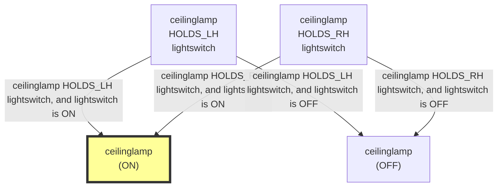

# 🚀 VirtualHome Agent Episode Log


### [GoalReasoner (Module A - Intent)] Output
```json
{
  "is_instruction_obviously_vague": false,
  "clarification_question": null,
  "target_object": "light",
  "location_hint": "the light",
  "reasoning_chain": [
    {
      "question": "Why does the user want to turn the light off?",
      "answer": "The user wants to turn the light off because it is currently on."
    },
    {
      "question": "Why is that important?",
      "answer": "The user likely wants to conserve energy or reduce glare."
    },
    {
      "question": "What fundamental need does this fulfill?",
      "answer": "The user wants to control the lighting level."
    },
    {
      "question": "Are there any deeper psychological or physical motivations?",
      "answer": "The user may want to create a more comfortable environment or reduce eye strain."
    }
  ],
  "deep_intent": "control lighting level",
  "acceptable_alternatives_properties": [
    {
      "priority": 1,
      "description": "Switch or dimmer for the light, allowing for precise control over the lighting level"
    },
    {
      "priority": 2,
      "description": "Blinds or curtains to block or filter light, providing an alternative means of controlling lighting"
    },
    {
      "priority": 3,
      "description": "Adjusting the thermostat to reduce ambient light, such as in a room with a skylight"
    },
    {
      "priority": 4,
      "description": "Using a different light source, such as a lamp or table light, to create a more focused or directed light"
    }
  ]
}
```

### [PerceptionFilter] Output
```json
{
  "reasoning": "The goal is to control the lighting level, which requires the lightswitch as the primary tool. The acceptable alternatives are blinds or curtains to block or filter light, but since they are not explicitly mentioned in the SDG, we will only include the lightswitch. Additionally, we need to include the ceilinglamp as it is the object that is being controlled. Finally, we need to include the location hint 'the light' which is the ceilinglamp.",
  "selected_classes": [
    "curtains",
    "character",
    "ceiling",
    "lightswitch",
    "ceilinglamp"
  ],
  "raw_class_count": 33
}
```

### [LLMExecutor] Output
```json
{
  "reasoning": "The goal is to turn off the ceiling lamp. The current state is that the ceiling lamp is on, and it holds the light switch in both hands. To turn off the ceiling lamp, we need to first grab the light switch and then turn it off.",
  "satisfied_nodes": [
    "N1"
  ],
  "current_node_focus": "N1",
  "mapped_variables": {},
  "action": "[walk] lightswitch (173)"
}
```

### [RoboStateMultiTaskController] Output
```json
{
  "action": "[walk] <lightswitch> (173)",
  "active_task_id": "task_1",
  "task_context": {
    "active_task_id": "task_1",
    "pending_task_ids": [],
    "satisfied_task_ids": []
  },
  "source": "llm_executor"
}
```
## Step 0
- **Action**: `[walk] <lightswitch> (173)`
- **Action Success**: `True`
- **Action Message**: {'0': {'message': 'Success'}}
- **Active Task**: `task_1`
- **Decision Source**: `llm_executor`
- **Task Progress**: T4_llama_G3_14=pending
- **SDG Status**:

- **Observed Items (19)**: ceiling(92), ceiling(93), ceiling(94), ceiling(95), ceiling(96), ceiling(97), ceiling(98), ceiling(99), ceiling(100), ceilinglamp(101), lightswitch(173) [ON], curtains(183) [CLOSED], curtains(184) [CLOSED], curtains(185) [CLOSED], character(1)...


### [PerceptionFilter] Output
```json
{
  "reasoning": "Reused cached class selection.",
  "selected_classes": [
    "curtains",
    "character",
    "ceiling",
    "lightswitch",
    "ceilinglamp"
  ],
  "raw_class_count": 33
}
```

### [LLMExecutor] Output
```json
{
  "reasoning": "The goal is to control the lighting level by turning off the ceiling lamp. The current state is that the lightswitch is ON, and the ceiling lamp HOLDS_LH and HOLDS_RH the lightswitch. The ceiling lamp is ON, and the curtains are CLOSED. To turn off the ceiling lamp, we need to interact with the lightswitch. Since we are already near the lightswitch, we can proceed to grab it.",
  "satisfied_nodes": [
    "N1"
  ],
  "current_node_focus": "N3",
  "mapped_variables": {
    "?Lightswitch": "lightswitch(173)"
  },
  "action": "[grab] <lightswitch> (173)"
}
```

### [RoboStateMultiTaskController] Output
```json
{
  "action": "[walk] <bathroom> (11)",
  "active_task_id": null,
  "task_context": {
    "active_task_id": null,
    "pending_task_ids": [
      "task_1"
    ],
    "satisfied_task_ids": []
  },
  "source": "loop_recovery_room_revisit"
}
```
## Step 1
- **Action**: `[walk] <bathroom> (11)`
- **Action Success**: `True`
- **Action Message**: {'0': {'message': 'Success'}}
- **Decision Source**: `loop_recovery_room_revisit`
- **Task Progress**: T4_llama_G3_14=pending
- **SDG Status**:
No SDG active.
- **Observed Items (74)**: floor(74), floor(75), floor(76), floor(77), floor(78), floor(79), floor(80), floor(81), floor(82), wall(83), wall(84), wall(85), wall(86), wall(87), wall(88)...


### [PerceptionFilter] Output
```json
{
  "reasoning": "To control the lighting level, we need to select the light source, its switch, and any alternative means of controlling lighting. We also need to include the location where the light is located.",
  "selected_classes": [
    "curtains",
    "character",
    "ceiling",
    "lightswitch",
    "ceilinglamp"
  ],
  "raw_class_count": 54
}
```

### [LLMExecutor] Output
```json
{
  "reasoning": "The goal is to control the lighting level, and the current state is that the ceiling lamp is ON. The next step is to turn it off. However, the lightswitch is not GRABBABLE, so we need to find an alternative solution.",
  "satisfied_nodes": [
    "N1"
  ],
  "current_node_focus": "N1",
  "mapped_variables": {},
  "action": "[walk] <ceilinglamp> (101)"
}
```

### [RoboStateMultiTaskController] Output
```json
{
  "action": "[walk] <ceilinglamp> (101)",
  "active_task_id": "task_1",
  "task_context": {
    "active_task_id": "task_1",
    "pending_task_ids": [],
    "satisfied_task_ids": []
  },
  "source": "llm_executor"
}
```
## Step 2
- **Action**: `[walk] <ceilinglamp> (101)`
- **Action Success**: `True`
- **Action Message**: {'0': {'message': 'Success'}}
- **Active Task**: `task_1`
- **Decision Source**: `llm_executor`
- **Task Progress**: T4_llama_G3_14=pending
- **SDG Status**:

- **Observed Items (31)**: ceiling(92), ceiling(93), ceiling(94), ceiling(95), ceiling(96), ceiling(97), ceiling(98), ceiling(99), ceiling(100), ceilinglamp(101), lightswitch(173) [ON], curtains(183) [CLOSED], curtains(184) [CLOSED], curtains(185) [CLOSED], character(1)...


### [PerceptionFilter] Output
```json
{
  "reasoning": "Reused cached class selection.",
  "selected_classes": [
    "curtains",
    "character",
    "ceiling",
    "lightswitch",
    "ceilinglamp"
  ],
  "raw_class_count": 54
}
```

### [LLMExecutor] Output
```json
{
  "reasoning": "The goal is to control the lighting level by turning off the light. The current state of the lightswitch is ON. To achieve this goal, we need to find an alternative means of controlling the lighting level.",
  "satisfied_nodes": [
    "N1"
  ],
  "current_node_focus": "N1",
  "mapped_variables": {},
  "action": "[walk] <curtains> (183)"
}
```

### [RoboStateMultiTaskController] Output
```json
{
  "action": "[walk] <curtains> (183)",
  "active_task_id": "task_1",
  "task_context": {
    "active_task_id": "task_1",
    "pending_task_ids": [],
    "satisfied_task_ids": []
  },
  "source": "llm_executor"
}
```
## Step 3
- **Action**: `[walk] <curtains> (183)`
- **Action Success**: `True`
- **Action Message**: {'0': {'message': 'Success'}}
- **Active Task**: `task_1`
- **Decision Source**: `llm_executor`
- **Task Progress**: T4_llama_G3_14=pending
- **SDG Status**:

- **Observed Items (31)**: ceiling(92), ceiling(93), ceiling(94), ceiling(95), ceiling(96), ceiling(97), ceiling(98), ceiling(99), ceiling(100), ceilinglamp(101), lightswitch(173) [ON], curtains(183) [CLOSED], curtains(184) [CLOSED], curtains(185) [CLOSED], character(1)...


### [PerceptionFilter] Output
```json
{
  "reasoning": "Reused cached class selection.",
  "selected_classes": [
    "curtains",
    "character",
    "ceiling",
    "lightswitch",
    "ceilinglamp"
  ],
  "raw_class_count": 54
}
```

### [LLMExecutor] Output
```json
{
  "reasoning": "The goal is to control the lighting level. The current state of the lightswitch is ON. To turn the light off, we need to interact with the lightswitch. We are currently near the lightswitch, so we can proceed with the next action.",
  "satisfied_nodes": [
    "N1"
  ],
  "current_node_focus": "N1",
  "mapped_variables": {},
  "action": "[close] lightswitch (173)"
}
```

### [RoboStateMultiTaskController] Output
```json
{
  "action": "[walk] <kitchen> (205)",
  "active_task_id": null,
  "task_context": {
    "active_task_id": null,
    "pending_task_ids": [
      "task_1"
    ],
    "satisfied_task_ids": []
  },
  "source": "loop_recovery_room_revisit"
}
```
## Step 4
- **Action**: `[walk] <kitchen> (205)`
- **Action Success**: `True`
- **Action Message**: {'0': {'message': 'Success'}}
- **Decision Source**: `loop_recovery_room_revisit`
- **Task Progress**: T4_llama_G3_14=pending
- **SDG Status**:
No SDG active.
- **Observed Items (135)**: floor(74), floor(75), floor(76), floor(77), floor(78), floor(79), floor(80), floor(81), floor(82), wall(83), wall(84), wall(85), wall(86), wall(87), wall(88)...


### [PerceptionFilter] Output
```json
{
  "reasoning": "The goal is to control the lighting level, so we need the light switch and the light itself. We also need to consider the acceptable alternatives for controlling lighting, which include blinds or curtains, adjusting the thermostat, and using a different light source. However, since the goal is specific to the light, we prioritize the light switch and the light itself.",
  "selected_classes": [
    "curtains",
    "character",
    "ceiling",
    "lightswitch",
    "ceilinglamp"
  ],
  "raw_class_count": 91
}
```

### [LLMExecutor] Output
```json
{
  "reasoning": "The goal is to control the lighting level by turning off the ceiling lamp. The current state is that the ceiling lamp is ON, and the light switch is ON. To turn off the ceiling lamp, we need to interact with the light switch. Since the light switch is ON, we need to turn it OFF first.",
  "satisfied_nodes": [
    "N1"
  ],
  "current_node_focus": "N1",
  "mapped_variables": {
    "?LightSwitch": "lightswitch(173)"
  },
  "action": "[close] <lightswitch> (173)"
}
```

### [RoboStateMultiTaskController] Output
```json
{
  "action": "[walk] <livingroom> (335)",
  "active_task_id": null,
  "task_context": {
    "active_task_id": null,
    "pending_task_ids": [
      "task_1"
    ],
    "satisfied_task_ids": []
  },
  "source": "loop_recovery_room_revisit"
}
```
## Step 5
- **Action**: `[walk] <livingroom> (335)`
- **Action Success**: `True`
- **Action Message**: {'0': {'message': 'Success'}}
- **Decision Source**: `loop_recovery_room_revisit`
- **Task Progress**: T4_llama_G3_14=pending
- **SDG Status**:
No SDG active.
- **Observed Items (242)**: floor(74), floor(75), floor(76), floor(77), floor(78), floor(79), floor(80), floor(81), floor(82), wall(83), wall(84), wall(85), wall(86), wall(87), wall(88)...


### [PerceptionFilter] Output
```json
{
  "reasoning": "To control the lighting level, we need to select the lightswitch, the ceilinglamp (as it is the target object), and the curtains (as an alternative means of controlling lighting).",
  "selected_classes": [
    "curtains",
    "character",
    "ceiling",
    "lightswitch",
    "ceilinglamp"
  ],
  "raw_class_count": 101
}
```

### [LLMExecutor] Output
```json
{
  "reasoning": "The goal is to turn off the light. The light is currently on, and the light switch is in the 'ON' state. To turn off the light, we need to interact with the light switch. The light switch is currently in the 'ON' state, and we need to change it to the 'OFF' state.",
  "satisfied_nodes": [
    "N1",
    "N3",
    "N4"
  ],
  "current_node_focus": "N1",
  "mapped_variables": {
    "?Light": "lightswitch(173)"
  },
  "action": "[close] <lightswitch> (173)"
}
```

### [RoboStateMultiTaskController] Output
```json
{
  "action": "[walk] <bathroom> (11)",
  "active_task_id": null,
  "task_context": {
    "active_task_id": null,
    "pending_task_ids": [
      "task_1"
    ],
    "satisfied_task_ids": []
  },
  "source": "loop_recovery_room_revisit"
}
```
## Step 6
- **Action**: `[walk] <bathroom> (11)`
- **Action Success**: `True`
- **Action Message**: {'0': {'message': 'Success'}}
- **Decision Source**: `loop_recovery_room_revisit`
- **Task Progress**: T4_llama_G3_14=pending
- **SDG Status**:
No SDG active.
- **Observed Items (316)**: floor(74), floor(75), floor(76), floor(77), floor(78), floor(79), floor(80), floor(81), floor(82), wall(83), wall(84), wall(85), wall(86), wall(87), wall(88)...


### [PerceptionFilter] Output
```json
{
  "reasoning": "Reused cached class selection.",
  "selected_classes": [
    "curtains",
    "character",
    "ceiling",
    "lightswitch",
    "ceilinglamp"
  ],
  "raw_class_count": 101
}
```

### [LLMExecutor] Output
```json
{
  "reasoning": "The goal is to turn off the light, and the light is currently on. The lightswitch is the object that controls the light. To turn off the light, we need to interact with the lightswitch. The lightswitch is currently in the ON state, and we need to switch it to the OFF state. We can do this by executing the [close] action on the lightswitch.",
  "satisfied_nodes": [
    "N1"
  ],
  "current_node_focus": "N1",
  "mapped_variables": {
    "?Light": "lightswitch(173)"
  },
  "action": "[close] <lightswitch> (173)"
}
```

### [RoboStateMultiTaskController] Output
```json
{
  "action": "[walk] <bedroom> (73)",
  "active_task_id": null,
  "task_context": {
    "active_task_id": null,
    "pending_task_ids": [
      "task_1"
    ],
    "satisfied_task_ids": []
  },
  "source": "loop_recovery_room_revisit"
}
```
## Step 7
- **Action**: `[walk] <bedroom> (73)`
- **Action Success**: `True`
- **Action Message**: {'0': {'message': 'Success'}}
- **Decision Source**: `loop_recovery_room_revisit`
- **Task Progress**: T4_llama_G3_14=pending
- **SDG Status**:
No SDG active.
- **Observed Items (316)**: floor(74), floor(75), floor(76), floor(77), floor(78), floor(79), floor(80), floor(81), floor(82), wall(83), wall(84), wall(85), wall(86), wall(87), wall(88)...


### [PerceptionFilter] Output
```json
{
  "reasoning": "Reused cached class selection.",
  "selected_classes": [
    "curtains",
    "character",
    "ceiling",
    "lightswitch",
    "ceilinglamp"
  ],
  "raw_class_count": 101
}
```

### [LLMExecutor] Output
```json
{
  "reasoning": "The goal is to turn off the light. The current state is that the ceiling lamp is ON. To turn it off, we need to interact with the light switch. The light switch is currently ON, but we can turn it off by interacting with it.",
  "satisfied_nodes": [
    "N1"
  ],
  "current_node_focus": "N1",
  "mapped_variables": {},
  "action": "[close] <lightswitch> (173)"
}
```

### [RoboStateMultiTaskController] Output
```json
{
  "action": "[walk] <kitchen> (205)",
  "active_task_id": null,
  "task_context": {
    "active_task_id": null,
    "pending_task_ids": [
      "task_1"
    ],
    "satisfied_task_ids": []
  },
  "source": "loop_recovery_room_revisit"
}
```
## Step 8
- **Action**: `[walk] <kitchen> (205)`
- **Action Success**: `True`
- **Action Message**: {'0': {'message': 'Success'}}
- **Decision Source**: `loop_recovery_room_revisit`
- **Task Progress**: T4_llama_G3_14=pending
- **SDG Status**:
No SDG active.
- **Observed Items (316)**: floor(74), floor(75), floor(76), floor(77), floor(78), floor(79), floor(80), floor(81), floor(82), wall(83), wall(84), wall(85), wall(86), wall(87), wall(88)...


### [PerceptionFilter] Output
```json
{
  "reasoning": "Reused cached class selection.",
  "selected_classes": [
    "curtains",
    "character",
    "ceiling",
    "lightswitch",
    "ceilinglamp"
  ],
  "raw_class_count": 101
}
```

### [LLMExecutor] Output
```json
{
  "reasoning": "The goal is to control the lighting level by turning off the ceiling lamp. The current state is that the ceiling lamp is on, and the light switch is also on. To turn off the ceiling lamp, we need to first turn off the light switch. The light switch is currently inside the bedroom, and we are currently inside the kitchen. We need to walk to the bedroom to turn off the light switch.",
  "satisfied_nodes": [
    "N1"
  ],
  "current_node_focus": "N1",
  "mapped_variables": {
    "?LightSwitch": "lightswitch(173)"
  },
  "action": "[walk] <bedroom> (73)"
}
```

### [RoboStateMultiTaskController] Output
```json
{
  "action": "[walk] <bedroom> (73)",
  "active_task_id": "task_1",
  "task_context": {
    "active_task_id": "task_1",
    "pending_task_ids": [],
    "satisfied_task_ids": []
  },
  "source": "llm_executor"
}
```
## Step 9
- **Action**: `[walk] <bedroom> (73)`
- **Action Success**: `True`
- **Action Message**: {'0': {'message': 'Success'}}
- **Active Task**: `task_1`
- **Decision Source**: `llm_executor`
- **Task Progress**: T4_llama_G3_14=pending
- **SDG Status**:

- **Observed Items (54)**: ceiling(92), ceiling(93), ceiling(94), ceiling(95), ceiling(96), ceiling(97), ceiling(98), ceiling(99), ceiling(100), ceilinglamp(101), lightswitch(173) [ON], curtains(183) [CLOSED], curtains(184) [CLOSED], curtains(185) [CLOSED], character(1)...


### [PerceptionFilter] Output
```json
{
  "reasoning": "Reused cached class selection.",
  "selected_classes": [
    "curtains",
    "character",
    "ceiling",
    "lightswitch",
    "ceilinglamp"
  ],
  "raw_class_count": 101
}
```

### [LLMExecutor] Output
```json
{
  "reasoning": "The goal is to control the lighting level by turning off the light. The light is currently on, and the light switch is inside the bedroom. I will first grab the light switch and then turn it off.",
  "satisfied_nodes": [
    "N1"
  ],
  "current_node_focus": "N1",
  "mapped_variables": {
    "?Light": "ceilinglamp(101)"
  },
  "action": "[grab] <lightswitch> (173)"
}
```

### [RoboStateMultiTaskController] Output
```json
{
  "action": "[walk] <livingroom> (335)",
  "active_task_id": null,
  "task_context": {
    "active_task_id": null,
    "pending_task_ids": [
      "task_1"
    ],
    "satisfied_task_ids": []
  },
  "source": "loop_recovery_room_revisit"
}
```
## Step 10
- **Action**: `[walk] <livingroom> (335)`
- **Action Success**: `True`
- **Action Message**: {'0': {'message': 'Success'}}
- **Decision Source**: `loop_recovery_room_revisit`
- **Task Progress**: T4_llama_G3_14=pending
- **SDG Status**:
No SDG active.
- **Observed Items (316)**: floor(74), floor(75), floor(76), floor(77), floor(78), floor(79), floor(80), floor(81), floor(82), wall(83), wall(84), wall(85), wall(86), wall(87), wall(88)...


### [PerceptionFilter] Output
```json
{
  "reasoning": "Reused cached class selection.",
  "selected_classes": [
    "curtains",
    "character",
    "ceiling",
    "lightswitch",
    "ceilinglamp"
  ],
  "raw_class_count": 101
}
```

### [LLMExecutor] Output
```json
{
  "reasoning": "The goal is to turn the light off. The light is currently on and held by the ceiling lamp. The light switch is also on, but it's not grabbable. The closest light switch is in the bathroom, but it's also on. The only option is to turn off the light switch in the bathroom.",
  "satisfied_nodes": [
    "N1"
  ],
  "current_node_focus": "N1",
  "mapped_variables": {
    "?Light": "ceilinglamp(101)"
  },
  "action": "[walk] <lightswitch> (71)"
}
```

### [RoboStateMultiTaskController] Output
```json
{
  "action": "[walk] <lightswitch> (71)",
  "active_task_id": "task_1",
  "task_context": {
    "active_task_id": "task_1",
    "pending_task_ids": [],
    "satisfied_task_ids": []
  },
  "source": "llm_executor"
}
```
## Step 11
- **Action**: `[walk] <lightswitch> (71)`
- **Action Success**: `True`
- **Action Message**: {'0': {'message': 'Success'}}
- **Active Task**: `task_1`
- **Decision Source**: `llm_executor`
- **Task Progress**: T4_llama_G3_14=pending
- **SDG Status**:

- **Observed Items (54)**: ceiling(92), ceiling(93), ceiling(94), ceiling(95), ceiling(96), ceiling(97), ceiling(98), ceiling(99), ceiling(100), ceilinglamp(101), lightswitch(173) [ON], curtains(183) [CLOSED], curtains(184) [CLOSED], curtains(185) [CLOSED], character(1)...


### [PerceptionFilter] Output
```json
{
  "reasoning": "Reused cached class selection.",
  "selected_classes": [
    "curtains",
    "character",
    "ceiling",
    "lightswitch",
    "ceilinglamp"
  ],
  "raw_class_count": 101
}
```

### [LLMExecutor] Output
```json
{
  "reasoning": "To turn off the ceiling lamp, I need to interact with the lightswitch. The lightswitch is currently inside the bedroom, which is already the current location. I will grab the lightswitch and then turn it off.",
  "satisfied_nodes": [
    "N1"
  ],
  "current_node_focus": "N1",
  "mapped_variables": {
    "?Lightswitch": "lightswitch(173)"
  },
  "action": "[grab] <lightswitch> (173)"
}
```

### [RoboStateMultiTaskController] Output
```json
{
  "action": "[walk] <kitchen> (205)",
  "active_task_id": null,
  "task_context": {
    "active_task_id": null,
    "pending_task_ids": [
      "task_1"
    ],
    "satisfied_task_ids": []
  },
  "source": "loop_recovery_room_revisit"
}
```
## Step 12
- **Action**: `[walk] <kitchen> (205)`
- **Action Success**: `True`
- **Action Message**: {'0': {'message': 'Success'}}
- **Decision Source**: `loop_recovery_room_revisit`
- **Task Progress**: T4_llama_G3_14=pending
- **SDG Status**:
No SDG active.
- **Observed Items (316)**: floor(74), floor(75), floor(76), floor(77), floor(78), floor(79), floor(80), floor(81), floor(82), wall(83), wall(84), wall(85), wall(86), wall(87), wall(88)...


### [PerceptionFilter] Output
```json
{
  "reasoning": "Reused cached class selection.",
  "selected_classes": [
    "curtains",
    "character",
    "ceiling",
    "lightswitch",
    "ceilinglamp"
  ],
  "raw_class_count": 101
}
```

### [LLMExecutor] Output
```json
{
  "reasoning": "The goal is to control the lighting level. The current Filtered Graph shows the lightswitch is ON. To turn the light off, we need to interact with the lightswitch. Since the lightswitch is already in the same room as the robot, we can directly grab it.",
  "satisfied_nodes": [
    "N1"
  ],
  "current_node_focus": "N1",
  "mapped_variables": {},
  "action": "[grab] <lightswitch> (173)"
}
```

### [RoboStateMultiTaskController] Output
```json
{
  "action": "[walk] <bedroom> (73)",
  "active_task_id": null,
  "task_context": {
    "active_task_id": null,
    "pending_task_ids": [
      "task_1"
    ],
    "satisfied_task_ids": []
  },
  "source": "loop_recovery_room_revisit"
}
```
## Step 13
- **Action**: `[walk] <bedroom> (73)`
- **Action Success**: `True`
- **Action Message**: {'0': {'message': 'Success'}}
- **Decision Source**: `loop_recovery_room_revisit`
- **Task Progress**: T4_llama_G3_14=pending
- **SDG Status**:
No SDG active.
- **Observed Items (316)**: floor(74), floor(75), floor(76), floor(77), floor(78), floor(79), floor(80), floor(81), floor(82), wall(83), wall(84), wall(85), wall(86), wall(87), wall(88)...


### [PerceptionFilter] Output
```json
{
  "reasoning": "Reused cached class selection.",
  "selected_classes": [
    "curtains",
    "character",
    "ceiling",
    "lightswitch",
    "ceilinglamp"
  ],
  "raw_class_count": 101
}
```

### [LLMExecutor] Output
```json
{
  "reasoning": "The goal is to control the lighting level by turning off the ceiling lamp. The current state is that the ceiling lamp is ON. The nearest light switch is inside the bedroom. To turn off the ceiling lamp, we need to walk to the light switch, grab it, and then turn it off.",
  "satisfied_nodes": [
    "N1"
  ],
  "current_node_focus": "N1",
  "mapped_variables": {
    "?LightSwitch": "lightswitch(173)"
  },
  "action": "[walk] <lightswitch> (71)"
}
```

### [RoboStateMultiTaskController] Output
```json
{
  "action": "[walk] <lightswitch> (71)",
  "active_task_id": "task_1",
  "task_context": {
    "active_task_id": "task_1",
    "pending_task_ids": [],
    "satisfied_task_ids": []
  },
  "source": "llm_executor"
}
```
## Step 14
- **Action**: `[walk] <lightswitch> (71)`
- **Action Success**: `True`
- **Action Message**: {'0': {'message': 'Success'}}
- **Active Task**: `task_1`
- **Decision Source**: `llm_executor`
- **Task Progress**: T4_llama_G3_14=pending
- **SDG Status**:

- **Observed Items (54)**: ceiling(92), ceiling(93), ceiling(94), ceiling(95), ceiling(96), ceiling(97), ceiling(98), ceiling(99), ceiling(100), ceilinglamp(101), lightswitch(173) [ON], curtains(183) [CLOSED], curtains(184) [CLOSED], curtains(185) [CLOSED], character(1)...

