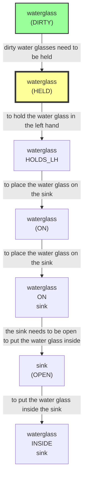
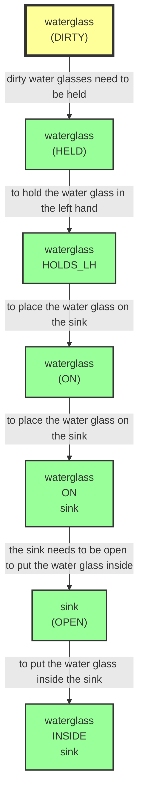
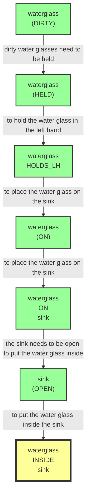
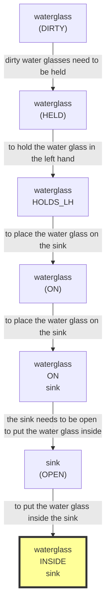
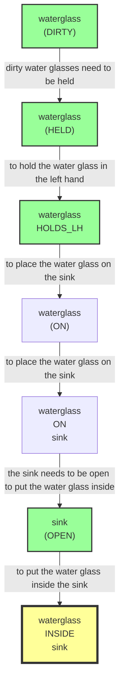
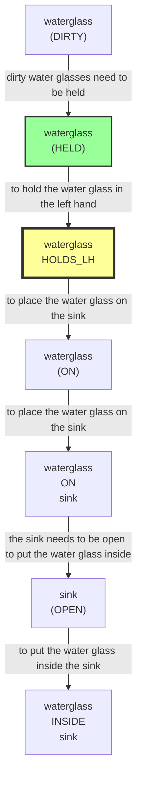
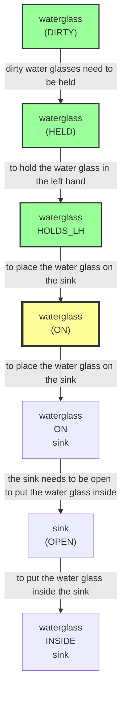
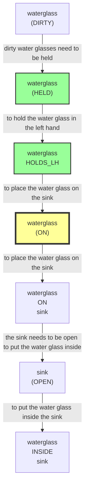

# 🚀 VirtualHome Agent Episode Log


### [GoalReasoner (Module A - Intent)] Output
```json
{
  "is_instruction_obviously_vague": false,
  "clarification_question": null,
  "target_object": "dirty water glasses",
  "location_hint": "sink",
  "reasoning_chain": [
    {
      "question": "Why does the user want to put dirty water glasses in the sink?",
      "answer": "The user wants to put dirty water glasses in the sink because they are dirty and need to be cleaned."
    },
    {
      "question": "Why is it important to put dirty water glasses in the sink?",
      "answer": "It's important to put dirty water glasses in the sink because dirty water glasses can harbor bacteria and other contaminants that can make people sick if they are used again."
    },
    {
      "question": "What fundamental need does this fulfill?",
      "answer": "This fulfills the fundamental need to maintain cleanliness and hygiene."
    },
    {
      "question": "Are there any deeper psychological or physical motivations?",
      "answer": "No deeper psychological or physical motivations are present in this instruction."
    }
  ],
  "deep_intent": "Maintain cleanliness and hygiene",
  "acceptable_alternatives_properties": [
    {
      "priority": 1,
      "description": "Other dirty dishes or glasses that need to be cleaned and put in the sink"
    },
    {
      "priority": 2,
      "description": "Dirty kitchen items or utensils that need to be washed and put in the sink"
    },
    {
      "priority": 3,
      "description": "Any item that needs to be cleaned and put in a designated cleaning area"
    },
    {
      "priority": 4,
      "description": "Any item that needs to be washed and sanitized to prevent the spread of contaminants"
    }
  ]
}
```

### [PerceptionFilter] Output
```json
{
  "reasoning": "The selected object classes are necessary to achieve the goal of maintaining cleanliness and hygiene by putting dirty water glasses in the sink. The required classes include the target object 'dirty water glasses', the sink, and alternative dirty dishes or glasses that need to be cleaned and put in the sink.",
  "selected_classes": [
    "waterglass",
    "sink",
    "character",
    "dishbowl"
  ],
  "raw_class_count": 50
}
```

### [LLMExecutor] Output
```json
{
  "reasoning": "The next action is to grab the dirty water glass to fulfill the goal of putting it in the sink.",
  "satisfied_nodes": [
    "N1"
  ],
  "current_node_focus": "N2",
  "mapped_variables": {
    "?Washer": "sink(155)"
  },
  "action": "[grab] waterglass(64)"
}
```

### [RoboStateMultiTaskController] Output
```json
{
  "action": "[grab] <waterglass> (64)",
  "active_task_id": "task_1",
  "task_context": {
    "active_task_id": "task_1",
    "pending_task_ids": [],
    "satisfied_task_ids": []
  },
  "source": "llm_executor"
}
```
## Step 0
- **Action**: `[grab] <waterglass> (64)`
- **Action Success**: `False`
- **Action Message**: temporary_unavailable: target disappeared; wait or search and retry
- **Active Task**: `task_1`
- **Decision Source**: `llm_executor`
- **Task Progress**: T4_llama_M1_03=pending
- **SDG Status**:

- **Observed Items (21)**: waterglass(64) [DIRTY], waterglass(71), waterglass(72), waterglass(79), waterglass(80), waterglass(87), waterglass(88), waterglass(100), dishbowl(115), dishbowl(116), dishbowl(117), dishbowl(118), dishbowl(119), sink(155), dishbowl(180)...


### [PerceptionFilter] Output
```json
{
  "reasoning": "Reused cached class selection.",
  "selected_classes": [
    "waterglass",
    "sink",
    "character",
    "dishbowl"
  ],
  "raw_class_count": 50
}
```

### [LLMExecutor] Output
```json
{
  "reasoning": "The water glass is dirty and needs to be held in order to be put in the sink. The sink is open, and the water glass is currently inside the kitchen. I will grab the water glass and then put it in the sink.",
  "satisfied_nodes": [
    "N1"
  ],
  "current_node_focus": "N2",
  "mapped_variables": {
    "?Washer": "sink(155)"
  },
  "action": "[grab] <waterglass> (64)"
}
```

### [RoboStateMultiTaskController] Output
```json
{
  "action": "[grab] <waterglass> (64)",
  "active_task_id": "task_1",
  "task_context": {
    "active_task_id": "task_1",
    "pending_task_ids": [],
    "satisfied_task_ids": []
  },
  "source": "llm_executor"
}
```
## Step 1
- **Action**: `[grab] <waterglass> (64)`
- **Action Success**: `False`
- **Action Message**: temporary_unavailable: target is temporarily hidden
- **Active Task**: `task_1`
- **Decision Source**: `llm_executor`
- **Task Progress**: T4_llama_M1_03=pending
- **SDG Status**:

- **Observed Items (21)**: waterglass(64) [DIRTY], waterglass(71), waterglass(72), waterglass(79), waterglass(80), waterglass(87), waterglass(88), waterglass(100), dishbowl(115), dishbowl(116), dishbowl(117), dishbowl(118), dishbowl(119), sink(155), dishbowl(180)...


### [RoboStateMultiTaskController] Output
```json
{
  "action": "[walk] <livingroom> (183)",
  "active_task_id": null,
  "task_context": {
    "active_task_id": null,
    "pending_task_ids": [
      "task_1"
    ],
    "satisfied_task_ids": []
  },
  "source": "loop_recovery_room_revisit"
}
```
## Step 2
- **Action**: `[walk] <livingroom> (183)`
- **Action Success**: `True`
- **Action Message**: {'0': {'message': 'Success'}}
- **Decision Source**: `loop_recovery_room_revisit`
- **Task Progress**: T4_llama_M1_03=pending
- **SDG Status**:
No SDG active.
- **Observed Items (159)**: wall(12), wall(13), wall(14), wall(15), wall(16), wall(17), wall(18), wall(19), wall(20), wall(21), floor(22), floor(23), floor(24), floor(25), floor(26)...


### [PerceptionFilter] Output
```json
{
  "reasoning": "The selected object classes are necessary to maintain cleanliness and hygiene by washing dirty water glasses in the sink. The required classes include the target object (dirty water glasses), the sink, and a water glass as a backup. The reasoning chain indicates that dirty water glasses need to be held, placed on the sink, and put inside the sink, which requires the sink to be open.",
  "selected_classes": [
    "waterglass",
    "sink",
    "character",
    "dishbowl"
  ],
  "raw_class_count": 59
}
```

### [LLMExecutor] Output
```json
{
  "reasoning": "The goal is to put dirty water glasses in the sink. The current filtered graph shows multiple water glasses and a sink. The next action is to grab a water glass and then walk to the sink.",
  "satisfied_nodes": [
    "N1",
    "N2",
    "N3",
    "N4",
    "N5",
    "N6",
    "N7"
  ],
  "current_node_focus": "N1",
  "mapped_variables": {
    "?Washer": "sink(155)"
  },
  "action": "[grab] <waterglass> (64)"
}
```

### [RoboStateMultiTaskController] Output
```json
{
  "action": "[grab] <waterglass> (64)",
  "active_task_id": "task_1",
  "task_context": {
    "active_task_id": "task_1",
    "pending_task_ids": [],
    "satisfied_task_ids": []
  },
  "source": "llm_executor"
}
```
## Step 3
- **Action**: `[grab] <waterglass> (64)`
- **Action Success**: `False`
- **Action Message**: temporary_unavailable: target is temporarily hidden
- **Active Task**: `task_1`
- **Decision Source**: `llm_executor`
- **Task Progress**: T4_llama_M1_03=pending
- **SDG Status**:

- **Observed Items (21)**: waterglass(64) [DIRTY], waterglass(71), waterglass(72), waterglass(79), waterglass(80), waterglass(87), waterglass(88), waterglass(100), dishbowl(115), dishbowl(116), dishbowl(117), dishbowl(118), dishbowl(119), sink(155), dishbowl(180)...


### [RoboStateMultiTaskController] Output
```json
{
  "action": "[walk] <bedroom> (241)",
  "active_task_id": null,
  "task_context": {
    "active_task_id": null,
    "pending_task_ids": [
      "task_1"
    ],
    "satisfied_task_ids": []
  },
  "source": "loop_recovery_room_revisit"
}
```
## Step 4
- **Action**: `[walk] <bedroom> (241)`
- **Action Success**: `True`
- **Action Message**: {'0': {'message': 'Success'}}
- **Decision Source**: `loop_recovery_room_revisit`
- **Task Progress**: T4_llama_M1_03=pending
- **SDG Status**:
No SDG active.
- **Observed Items (211)**: wall(12), wall(13), wall(14), wall(15), wall(16), wall(17), wall(18), wall(19), wall(20), wall(21), floor(22), floor(23), floor(24), floor(25), floor(26)...


### [PerceptionFilter] Output
```json
{
  "reasoning": "To maintain cleanliness and hygiene, we need to select the minimum number of object classes necessary to put dirty water glasses in the sink. This includes the target object class 'waterglass', the location 'sink', and alternative tools like 'dishbowl' and 'dishwasher' in case the primary tool 'sink' is broken or unavailable. We also need to include 'fridge' as it is a potential source of dirty water glasses.",
  "selected_classes": [
    "sink",
    "character",
    "dishwasher",
    "waterglass",
    "fridge",
    "dishbowl"
  ],
  "raw_class_count": 65
}
```

### [LLMExecutor] Output
```json
{
  "reasoning": "The current goal is to put the dirty water glasses in the sink. The water glasses are currently held by the character, but they are temporarily unavailable. The sink is open and inside the kitchen. To proceed, I need to grab the water glasses and put them inside the sink.",
  "satisfied_nodes": [
    "N1"
  ],
  "current_node_focus": "N2",
  "mapped_variables": {
    "?Washer": "sink(155)"
  },
  "action": "[grab] <waterglass> (64)"
}
```

### [RoboStateMultiTaskController] Output
```json
{
  "action": "[grab] <waterglass> (64)",
  "active_task_id": "task_1",
  "task_context": {
    "active_task_id": "task_1",
    "pending_task_ids": [],
    "satisfied_task_ids": []
  },
  "source": "llm_executor"
}
```
## Step 5
- **Action**: `[grab] <waterglass> (64)`
- **Action Success**: `True`
- **Action Message**: {'0': {'message': 'Success'}}
- **Active Task**: `task_1`
- **Decision Source**: `llm_executor`
- **Task Progress**: T4_llama_M1_03=pending
- **SDG Status**:

- **Observed Items (23)**: waterglass(64) [DIRTY], waterglass(71), waterglass(72), waterglass(79), waterglass(80), waterglass(87), waterglass(88), waterglass(100), dishbowl(115), dishbowl(116), dishbowl(117), dishbowl(118), dishbowl(119), sink(155), fridge(162) [CLOSED]...


### [PerceptionFilter] Output
```json
{
  "reasoning": "Reused cached class selection.",
  "selected_classes": [
    "sink",
    "character",
    "dishwasher",
    "waterglass",
    "fridge",
    "dishbowl"
  ],
  "raw_class_count": 65
}
```

### [LLMExecutor] Output
```json
{
  "reasoning": "The goal is to put dirty water glasses in the sink. The current Filtered Graph shows multiple water glasses, but none are held. The last action was a successful grab, but the target disappeared. To proceed, I need to grab a water glass and put it in the sink.",
  "satisfied_nodes": [
    "N1",
    "N2",
    "N3",
    "N4",
    "N5",
    "N6",
    "N7"
  ],
  "current_node_focus": "N7",
  "mapped_variables": {
    "?Washer": "sink(155)"
  },
  "action": "[grab] <waterglass> (71)"
}
```

### [RoboStateMultiTaskController] Output
```json
{
  "action": "[walk] <waterglass> (71)",
  "active_task_id": "task_1",
  "task_context": {
    "active_task_id": "task_1",
    "pending_task_ids": [],
    "satisfied_task_ids": []
  },
  "source": "llm_executor_repaired"
}
```
## Step 6
- **Action**: `[walk] <waterglass> (71)`
- **Action Success**: `True`
- **Action Message**: {'0': {'message': 'Success'}}
- **Active Task**: `task_1`
- **Decision Source**: `llm_executor_repaired`
- **Task Progress**: T4_llama_M1_03=pending
- **SDG Status**:

- **Observed Items (23)**: waterglass(64) [DIRTY], waterglass(71), waterglass(72), waterglass(79), waterglass(80), waterglass(87), waterglass(88), waterglass(100), dishbowl(115), dishbowl(116), dishbowl(117), dishbowl(118), dishbowl(119), sink(155), fridge(162) [CLOSED]...


### [PerceptionFilter] Output
```json
{
  "reasoning": "Reused cached class selection.",
  "selected_classes": [
    "sink",
    "character",
    "dishwasher",
    "waterglass",
    "fridge",
    "dishbowl"
  ],
  "raw_class_count": 65
}
```

### [LLMExecutor] Output
```json
{
  "reasoning": "The goal is to put dirty water glasses in the sink. The current Filtered Graph shows multiple water glasses, but only one is dirty. The dirty water glass is currently held by the character. To put the dirty water glass in the sink, the character must first walk to the sink and then put the glass inside.",
  "satisfied_nodes": [],
  "current_node_focus": "N7",
  "mapped_variables": {
    "?Washer": "sink(155)"
  },
  "action": "[walk] <sink> (155)"
}
```

### [RoboStateMultiTaskController] Output
```json
{
  "action": "[walk] <sink> (155)",
  "active_task_id": "task_1",
  "task_context": {
    "active_task_id": "task_1",
    "pending_task_ids": [],
    "satisfied_task_ids": []
  },
  "source": "llm_executor"
}
```
## Step 7
- **Action**: `[walk] <sink> (155)`
- **Action Success**: `True`
- **Action Message**: {'0': {'message': 'Success'}}
- **Active Task**: `task_1`
- **Decision Source**: `llm_executor`
- **Task Progress**: T4_llama_M1_03=pending
- **SDG Status**:

- **Observed Items (23)**: waterglass(64) [DIRTY], waterglass(71), waterglass(72), waterglass(79), waterglass(80), waterglass(87), waterglass(88), waterglass(100), dishbowl(115), dishbowl(116), dishbowl(117), dishbowl(118), dishbowl(119), sink(155), fridge(162) [CLOSED]...


### [PerceptionFilter] Output
```json
{
  "reasoning": "Reused cached class selection.",
  "selected_classes": [
    "sink",
    "character",
    "dishwasher",
    "waterglass",
    "fridge",
    "dishbowl"
  ],
  "raw_class_count": 65
}
```

### [LLMExecutor] Output
```json
{
  "reasoning": "The goal is to put dirty water glasses in the sink. The current filtered graph shows that the water glass is held in the left hand, and the sink is open. The next step is to place the water glass inside the sink.",
  "satisfied_nodes": [
    "N1",
    "N2",
    "N3",
    "N6"
  ],
  "current_node_focus": "N7",
  "mapped_variables": {
    "?Washer": "sink(155)"
  },
  "action": "[putback] <waterglass> (71) <sink> (155)"
}
```

### [RoboStateMultiTaskController] Output
```json
{
  "action": "[walk] <waterglass> (71)",
  "active_task_id": "task_1",
  "task_context": {
    "active_task_id": "task_1",
    "pending_task_ids": [],
    "satisfied_task_ids": []
  },
  "source": "llm_executor_repaired"
}
```
## Step 8
- **Action**: `[walk] <waterglass> (71)`
- **Action Success**: `True`
- **Action Message**: {'0': {'message': 'Success'}}
- **Active Task**: `task_1`
- **Decision Source**: `llm_executor_repaired`
- **Task Progress**: T4_llama_M1_03=pending
- **SDG Status**:

- **Observed Items (23)**: waterglass(64) [DIRTY], waterglass(71), waterglass(72), waterglass(79), waterglass(80), waterglass(87), waterglass(88), waterglass(100), dishbowl(115), dishbowl(116), dishbowl(117), dishbowl(118), dishbowl(119), sink(155), fridge(162) [CLOSED]...


### [PerceptionFilter] Output
```json
{
  "reasoning": "Reused cached class selection.",
  "selected_classes": [
    "sink",
    "character",
    "dishwasher",
    "waterglass",
    "fridge",
    "dishbowl"
  ],
  "raw_class_count": 65
}
```

### [LLMExecutor] Output
```json
{
  "reasoning": "To satisfy the goal intent, the next action should be to grab the dirty water glass, as it is the only object that needs to be held in the left hand to proceed with the task.",
  "satisfied_nodes": [
    "N2"
  ],
  "current_node_focus": "N3",
  "mapped_variables": {
    "?Washer": "sink(155)"
  },
  "action": "[grab] <waterglass> (71)"
}
```

### [RoboStateMultiTaskController] Output
```json
{
  "action": "[grab] <waterglass> (71)",
  "active_task_id": "task_1",
  "task_context": {
    "active_task_id": "task_1",
    "pending_task_ids": [],
    "satisfied_task_ids": []
  },
  "source": "llm_executor"
}
```
## Step 9
- **Action**: `[grab] <waterglass> (71)`
- **Action Success**: `True`
- **Action Message**: {'0': {'message': 'Success'}}
- **Active Task**: `task_1`
- **Decision Source**: `llm_executor`
- **Task Progress**: T4_llama_M1_03=pending
- **SDG Status**:

- **Observed Items (23)**: waterglass(64) [DIRTY], waterglass(71), waterglass(72), waterglass(79), waterglass(80), waterglass(87), waterglass(88), waterglass(100), dishbowl(115), dishbowl(116), dishbowl(117), dishbowl(118), dishbowl(119), sink(155), fridge(162) [CLOSED]...


### [PerceptionFilter] Output
```json
{
  "reasoning": "Reused cached class selection.",
  "selected_classes": [
    "sink",
    "character",
    "dishwasher",
    "waterglass",
    "fridge",
    "dishbowl"
  ],
  "raw_class_count": 65
}
```

### [LLMExecutor] Output
```json
{
  "reasoning": "The goal is to put dirty water glasses in the sink. The current filtered graph shows two water glasses, 64 and 71, both dirty and grabbable. The sink is open and the character is holding both glasses. To put the dirty water glasses in the sink, the next action should be to grab the water glass that is not being held by the character, which is waterglass(71), and then walk to the sink.",
  "satisfied_nodes": [
    "N1",
    "N2",
    "N3"
  ],
  "current_node_focus": "N4",
  "mapped_variables": {
    "?Washer": "sink(155)"
  },
  "action": "[grab] <waterglass> (71)"
}
```

### [RoboStateMultiTaskController] Output
```json
{
  "action": "[grab] <waterglass> (71)",
  "active_task_id": "task_1",
  "task_context": {
    "active_task_id": "task_1",
    "pending_task_ids": [],
    "satisfied_task_ids": []
  },
  "source": "llm_executor"
}
```
## Step 10
- **Action**: `[grab] <waterglass> (71)`
- **Action Success**: `False`
- **Action Message**: {'0': {'message': 'ScriptExcutor 0: EXECUTION_GENERAL: Script is impossible to execute\n\n'}}
- **Active Task**: `task_1`
- **Decision Source**: `llm_executor`
- **Task Progress**: T4_llama_M1_03=pending
- **SDG Status**:

- **Observed Items (23)**: waterglass(64) [DIRTY], waterglass(71), waterglass(72), waterglass(79), waterglass(80), waterglass(87), waterglass(88), waterglass(100), dishbowl(115), dishbowl(116), dishbowl(117), dishbowl(118), dishbowl(119), sink(155), fridge(162) [CLOSED]...


### [PerceptionFilter] Output
```json
{
  "reasoning": "Reused cached class selection.",
  "selected_classes": [
    "sink",
    "character",
    "dishwasher",
    "waterglass",
    "fridge",
    "dishbowl"
  ],
  "raw_class_count": 65
}
```

### [LLMExecutor] Output
```json
{
  "reasoning": "The current goal is to put dirty water glasses in the sink. The next action is to grab the water glass, as it is the only one that is DIRTY and needs to be cleaned. The water glass is currently held by the character, but it is not DIRTY. The sink is also not DIRTY, and it is a suitable place to put the water glass.",
  "satisfied_nodes": [
    "N1"
  ],
  "current_node_focus": "N2",
  "mapped_variables": {
    "?Washer": "sink(155)"
  },
  "action": "[grab] <waterglass> (71)"
}
```

### [RoboStateMultiTaskController] Output
```json
{
  "action": "[walk] <bathroom> (285)",
  "active_task_id": null,
  "task_context": {
    "active_task_id": null,
    "pending_task_ids": [
      "task_1"
    ],
    "satisfied_task_ids": []
  },
  "source": "loop_recovery_room_revisit"
}
```
## Step 11
- **Action**: `[walk] <bathroom> (285)`
- **Action Success**: `True`
- **Action Message**: {'0': {'message': 'Success'}}
- **Decision Source**: `loop_recovery_room_revisit`
- **Task Progress**: T4_llama_M1_03=pending
- **SDG Status**:
No SDG active.
- **Observed Items (243)**: wall(12), wall(13), wall(14), wall(15), wall(16), wall(17), wall(18), wall(19), wall(20), wall(21), floor(22), floor(23), floor(24), floor(25), floor(26)...


### [PerceptionFilter] Output
```json
{
  "reasoning": "The goal is to put dirty water glasses in the sink, so we need to select the minimum number of object classes necessary to achieve this goal. We must include the target object classes (dirty water glasses), the sink, and all potential functional tools and physical backups. We also need to include all locations, furniture, and receptacles explicitly mentioned or implied by the Global Intent.",
  "selected_classes": [
    "kitchencabinet",
    "faucet",
    "sink",
    "kitchencounter",
    "character",
    "waterglass",
    "toothpaste",
    "toothbrush",
    "dishbowl"
  ],
  "raw_class_count": 81
}
```

### [LLMExecutor] Output
```json
{
  "reasoning": "The goal is to put dirty water glasses in the sink. The current filtered graph shows that there are multiple water glasses in the kitchen, but none of them are held by the robot. The robot needs to grab one of the water glasses and put it in the sink.",
  "satisfied_nodes": [
    "N1",
    "N2",
    "N3",
    "N4",
    "N5",
    "N6",
    "N7"
  ],
  "current_node_focus": "N7",
  "mapped_variables": {
    "?Washer": "sink(155)"
  },
  "action": "[grab] <waterglass> (71)"
}
```

### [RoboStateMultiTaskController] Output
```json
{
  "action": "[grab] <waterglass> (71)",
  "active_task_id": "task_1",
  "task_context": {
    "active_task_id": "task_1",
    "pending_task_ids": [],
    "satisfied_task_ids": []
  },
  "source": "llm_executor"
}
```
## Step 12
- **Action**: `[grab] <waterglass> (71)`
- **Action Success**: `False`
- **Action Message**: {'0': {'message': 'ScriptExcutor 0: EXECUTION_GENERAL: Script is impossible to execute\n\n'}}
- **Active Task**: `task_1`
- **Decision Source**: `llm_executor`
- **Task Progress**: T4_llama_M1_03=pending
- **SDG Status**:

- **Observed Items (37)**: waterglass(64) [DIRTY], waterglass(71), waterglass(72), waterglass(79), waterglass(80), waterglass(87), waterglass(88), waterglass(100), dishbowl(115), dishbowl(116), dishbowl(117), dishbowl(118), dishbowl(119), kitchencounter(136) [CLOSED], kitchencabinet(138) [CLOSED]...


### [RoboStateMultiTaskController] Output
```json
{
  "action": "[walk] <bedroom> (346)",
  "active_task_id": null,
  "task_context": {
    "active_task_id": null,
    "pending_task_ids": [
      "task_1"
    ],
    "satisfied_task_ids": []
  },
  "source": "loop_recovery_room_revisit"
}
```
## Step 13
- **Action**: `[walk] <bedroom> (346)`
- **Action Success**: `True`
- **Action Message**: {'0': {'message': 'Success'}}
- **Decision Source**: `loop_recovery_room_revisit`
- **Task Progress**: T4_llama_M1_03=pending
- **SDG Status**:
No SDG active.
- **Observed Items (303)**: wall(12), wall(13), wall(14), wall(15), wall(16), wall(17), wall(18), wall(19), wall(20), wall(21), floor(22), floor(23), floor(24), floor(25), floor(26)...


### [PerceptionFilter] Output
```json
{
  "reasoning": "To maintain cleanliness and hygiene, the robot needs to select the minimum number of object classes required to put dirty water glasses in the sink. This includes the target object class 'waterglass', the location 'sink', and alternative tools 'dishbowl' and 'dishwasher' in case the primary tool 'sink' is broken or unavailable.",
  "selected_classes": [
    "sink",
    "character",
    "dishwasher",
    "waterglass",
    "dishbowl"
  ],
  "raw_class_count": 91
}
```

### [LLMExecutor] Output
```json
{
  "reasoning": "The current goal is to put dirty water glasses in the sink. The water glass is currently held in the left hand. To achieve this, I need to put the water glass on the sink. I will first walk to the sink, then grab the water glass, and finally put it on the sink.",
  "satisfied_nodes": [
    "N1",
    "N2",
    "N3",
    "N4",
    "N5",
    "N6"
  ],
  "current_node_focus": "N7",
  "mapped_variables": {
    "?Washer": "sink(155)"
  },
  "action": "[walk] <sink> (155)"
}
```

### [RoboStateMultiTaskController] Output
```json
{
  "action": "[walk] <sink> (155)",
  "active_task_id": "task_1",
  "task_context": {
    "active_task_id": "task_1",
    "pending_task_ids": [],
    "satisfied_task_ids": []
  },
  "source": "llm_executor"
}
```
## Step 14
- **Action**: `[walk] <sink> (155)`
- **Action Success**: `True`
- **Action Message**: {'0': {'message': 'Success'}}
- **Active Task**: `task_1`
- **Decision Source**: `llm_executor`
- **Task Progress**: T4_llama_M1_03=pending
- **SDG Status**:

- **Observed Items (24)**: waterglass(64) [DIRTY], waterglass(71), waterglass(72), waterglass(79), waterglass(80), waterglass(87), waterglass(88), waterglass(100), dishbowl(115), dishbowl(116), dishbowl(117), dishbowl(118), dishbowl(119), sink(155), dishwasher(165) [CLOSED,OFF]...


### [PerceptionFilter] Output
```json
{
  "reasoning": "Reused cached class selection.",
  "selected_classes": [
    "sink",
    "character",
    "dishwasher",
    "waterglass",
    "dishbowl"
  ],
  "raw_class_count": 91
}
```

### [LLMExecutor] Output
```json
{
  "reasoning": "The current goal is to put dirty water glasses in the sink. The next action is to grab the water glass, which is currently held by the character.",
  "satisfied_nodes": [
    "N2",
    "N3"
  ],
  "current_node_focus": "N4",
  "mapped_variables": {},
  "action": "[grab] <waterglass> (71)"
}
```

### [RoboStateMultiTaskController] Output
```json
{
  "action": "[grab] <waterglass> (71)",
  "active_task_id": "task_1",
  "task_context": {
    "active_task_id": "task_1",
    "pending_task_ids": [],
    "satisfied_task_ids": []
  },
  "source": "llm_executor"
}
```
## Step 15
- **Action**: `[grab] <waterglass> (71)`
- **Action Success**: `False`
- **Action Message**: {'0': {'message': 'ScriptExcutor 0: EXECUTION_GENERAL: Script is impossible to execute\n\n'}}
- **Active Task**: `task_1`
- **Decision Source**: `llm_executor`
- **Task Progress**: T4_llama_M1_03=pending
- **SDG Status**:

- **Observed Items (24)**: waterglass(64) [DIRTY], waterglass(71), waterglass(72), waterglass(79), waterglass(80), waterglass(87), waterglass(88), waterglass(100), dishbowl(115), dishbowl(116), dishbowl(117), dishbowl(118), dishbowl(119), sink(155), dishwasher(165) [CLOSED,OFF]...


### [PerceptionFilter] Output
```json
{
  "reasoning": "Reused cached class selection.",
  "selected_classes": [
    "sink",
    "character",
    "dishwasher",
    "waterglass",
    "dishbowl"
  ],
  "raw_class_count": 91
}
```

### [LLMExecutor] Output
```json
{
  "reasoning": "The goal is to put dirty water glasses in the sink. The current state gap is that the water glass is not held by the robot. To hold the water glass, the robot must first grab it. The robot has two hands, and both are empty. The robot should grab the water glass with the left hand.",
  "satisfied_nodes": [
    "N1",
    "N2",
    "N3",
    "N4",
    "N5",
    "N6",
    "N7"
  ],
  "current_node_focus": "N7",
  "mapped_variables": {
    "?Washer": "sink(155)"
  },
  "action": "[grab] <waterglass> (71)"
}
```

### [RoboStateMultiTaskController] Output
```json
{
  "action": "[grab] <waterglass> (71)",
  "active_task_id": "task_1",
  "task_context": {
    "active_task_id": "task_1",
    "pending_task_ids": [],
    "satisfied_task_ids": []
  },
  "source": "llm_executor"
}
```
## Step 16
- **Action**: `[grab] <waterglass> (71)`
- **Action Success**: `False`
- **Action Message**: {'0': {'message': 'ScriptExcutor 0: EXECUTION_GENERAL: Script is impossible to execute\n\n'}}
- **Active Task**: `task_1`
- **Decision Source**: `llm_executor`
- **Task Progress**: T4_llama_M1_03=pending
- **SDG Status**:

- **Observed Items (24)**: waterglass(64) [DIRTY], waterglass(71), waterglass(72), waterglass(79), waterglass(80), waterglass(87), waterglass(88), waterglass(100), dishbowl(115), dishbowl(116), dishbowl(117), dishbowl(118), dishbowl(119), sink(155), dishwasher(165) [CLOSED,OFF]...


### [RoboStateMultiTaskController] Output
```json
{
  "action": "[walk] <livingroom> (183)",
  "active_task_id": null,
  "task_context": {
    "active_task_id": null,
    "pending_task_ids": [
      "task_1"
    ],
    "satisfied_task_ids": []
  },
  "source": "loop_recovery_room_revisit"
}
```
## Step 17
- **Action**: `[walk] <livingroom> (183)`
- **Action Success**: `True`
- **Action Message**: {'0': {'message': 'Success'}}
- **Decision Source**: `loop_recovery_room_revisit`
- **Task Progress**: T4_llama_M1_03=pending
- **SDG Status**:
No SDG active.
- **Observed Items (361)**: wall(12), wall(13), wall(14), wall(15), wall(16), wall(17), wall(18), wall(19), wall(20), wall(21), floor(22), floor(23), floor(24), floor(25), floor(26)...

