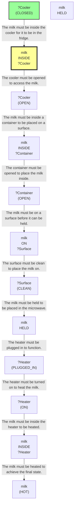
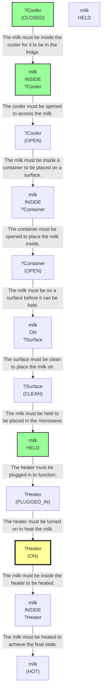
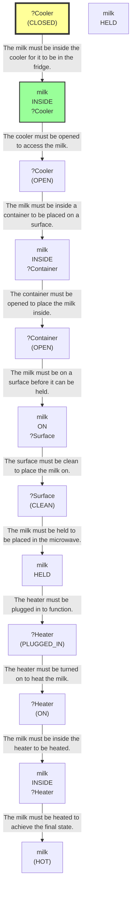
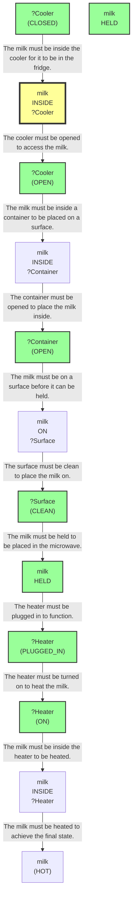
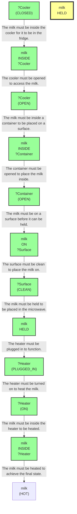
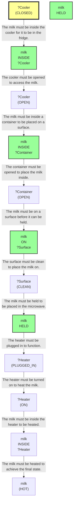
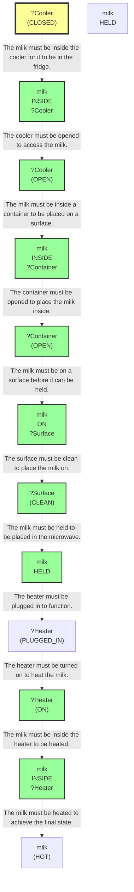
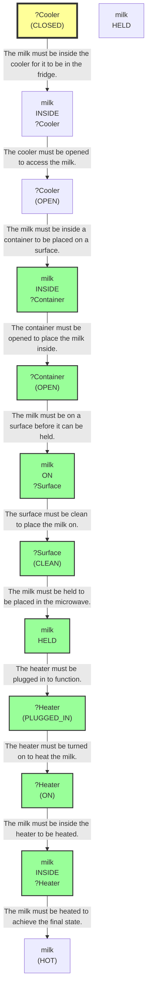
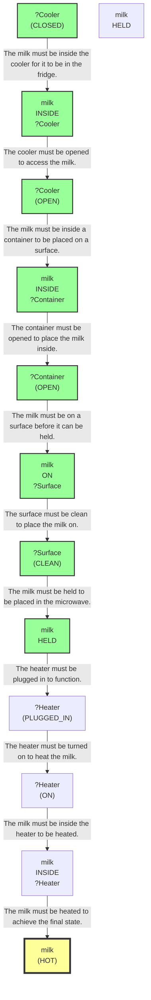
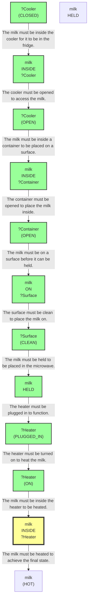

# 🚀 VirtualHome Agent Episode Log


### [GoalReasoner (Module A - Intent)] Output
```json
{
  "is_instruction_obviously_vague": false,
  "clarification_question": null,
  "target_object": "milk",
  "location_hint": "fridge",
  "reasoning_chain": [
    {
      "question": "Why does the user want this object?",
      "answer": "The user wants to obtain milk from the fridge."
    },
    {
      "question": "Why is that important?",
      "answer": "The user wants to use the milk for a specific purpose, which is to heat it in the microwave."
    },
    {
      "question": "What fundamental need does this fulfill?",
      "answer": "The user wants to consume a warm beverage, likely to satisfy thirst or provide comfort."
    },
    {
      "question": "Are there any deeper psychological or physical motivations?",
      "answer": "The user may be seeking a quick and convenient way to prepare a drink, possibly for a specific occasion or routine."
    }
  ],
  "deep_intent": "The user wants to consume a warm beverage.",
  "acceptable_alternatives_properties": [
    {
      "priority": 1,
      "description": "Other liquid beverages that can be heated, such as juice or coffee."
    },
    {
      "priority": 2,
      "description": "Dairy-based drinks that can be heated, such as yogurt or cream."
    },
    {
      "priority": 3,
      "description": "Non-dairy beverages that can be heated, such as plant-based milks or tea."
    },
    {
      "priority": 4,
      "description": "Solid food items that can be prepared as a warm beverage, such as oatmeal or porridge."
    }
  ]
}
```

### [PerceptionFilter] Output
```json
{
  "reasoning": "The goal is to obtain and heat milk, which requires accessing the milk from the fridge, holding it, and heating it. The SDG indicates the need for a cooler (fridge), a heater (microwave), and a container (waterglass or dishbowl). The milk itself is the target object. All necessary tools and locations are included to ensure the task can be completed, including alternatives like the microwave for heating.",
  "selected_classes": [
    "juice",
    "character",
    "microwave",
    "milk",
    "fridge",
    "waterglass"
  ],
  "raw_class_count": 50
}
```

### [LLMExecutor] Output
```json
{
  "reasoning": "The current goal is to obtain milk from the fridge and heat it in the microwave. The milk (176) is inside the fridge (162), which is currently open. The next logical step is to walk to the milk to grab it, as it is the direct prerequisite for proceeding with the task.",
  "satisfied_nodes": [
    "N1"
  ],
  "current_node_focus": "N2",
  "mapped_variables": {
    "?Cooler": "fridge(162)"
  },
  "action": "[walk] <milk> (176)"
}
```

### [RoboStateMultiTaskController] Output
```json
{
  "action": "[walk] <milk> (176)",
  "active_task_id": "task_1",
  "task_context": {
    "active_task_id": "task_1",
    "pending_task_ids": [],
    "satisfied_task_ids": []
  },
  "source": "llm_executor"
}
```
## Step 0
- **Action**: `[walk] <milk> (176)`
- **Action Success**: `True`
- **Action Message**: {'0': {'message': 'Success'}}
- **Active Task**: `task_1`
- **Decision Source**: `llm_executor`
- **Task Progress**: T4_qwen_G1_01=pending
- **SDG Status**:

- **Observed Items (20)**: waterglass(64), waterglass(71), waterglass(72), waterglass(79), waterglass(80), waterglass(87), waterglass(88), waterglass(100), fridge(162) [OPEN], microwave(171) [CLOSED,OFF], juice(173), juice(174), milk(177) [CLOSED], character(1), milk(176) [COLD,CLOSED]...


### [PerceptionFilter] Output
```json
{
  "reasoning": "Reused cached class selection.",
  "selected_classes": [
    "juice",
    "character",
    "microwave",
    "milk",
    "fridge",
    "waterglass"
  ],
  "raw_class_count": 50
}
```

### [LLMExecutor] Output
```json
{
  "reasoning": "The current Filtered Graph shows that the milk (176) is inside the fridge (162), and the fridge is currently open. The next step is to grab the milk from the fridge to proceed with the task. Since the robot is already near the milk (as confirmed by the previous [walk] action), it can now grab the milk.",
  "satisfied_nodes": [
    "N1"
  ],
  "current_node_focus": "N2",
  "mapped_variables": {
    "?Cooler": "fridge(162)"
  },
  "action": "[grab] <milk> (176)"
}
```

### [RoboStateMultiTaskController] Output
```json
{
  "action": "[grab] <milk> (176)",
  "active_task_id": "task_1",
  "task_context": {
    "active_task_id": "task_1",
    "pending_task_ids": [],
    "satisfied_task_ids": []
  },
  "source": "llm_executor"
}
```
## Step 1
- **Action**: `[grab] <milk> (176)`
- **Action Success**: `True`
- **Action Message**: {'0': {'message': 'Success'}}
- **Active Task**: `task_1`
- **Decision Source**: `llm_executor`
- **Task Progress**: T4_qwen_G1_01=pending
- **SDG Status**:

- **Observed Items (20)**: waterglass(64), waterglass(71), waterglass(72), waterglass(79), waterglass(80), waterglass(87), waterglass(88), waterglass(100), fridge(162) [OPEN], microwave(171) [CLOSED,OFF], juice(173), juice(174), milk(177) [CLOSED], character(1), milk(176) [COLD,CLOSED]...


### [PerceptionFilter] Output
```json
{
  "reasoning": "Reused cached class selection.",
  "selected_classes": [
    "juice",
    "character",
    "microwave",
    "milk",
    "fridge",
    "waterglass"
  ],
  "raw_class_count": 50
}
```

### [LLMExecutor] Output
```json
{
  "reasoning": "The current state shows that the milk (176) is already being held by the robot (HOLDS_RH milk(176)), and the fridge (162) is open. The next step is to move the milk to the microwave (171) to heat it. However, the microwave is currently closed and off, so the robot must first open it and turn it on before placing the milk inside.",
  "satisfied_nodes": [
    "N1",
    "N2",
    "N8"
  ],
  "current_node_focus": "N9",
  "mapped_variables": {
    "?Heater": "microwave(171)"
  },
  "action": "[open] <microwave> (171)"
}
```

### [RoboStateMultiTaskController] Output
```json
{
  "action": "[walk] <microwave> (171)",
  "active_task_id": "task_1",
  "task_context": {
    "active_task_id": "task_1",
    "pending_task_ids": [],
    "satisfied_task_ids": []
  },
  "source": "llm_executor_repaired"
}
```
## Step 2
- **Action**: `[walk] <microwave> (171)`
- **Action Success**: `True`
- **Action Message**: {'0': {'message': 'Success'}}
- **Active Task**: `task_1`
- **Decision Source**: `llm_executor_repaired`
- **Task Progress**: T4_qwen_G1_01=pending
- **SDG Status**:

- **Observed Items (20)**: waterglass(64), waterglass(71), waterglass(72), waterglass(79), waterglass(80), waterglass(87), waterglass(88), waterglass(100), fridge(162) [OPEN], microwave(171) [CLOSED,OFF], juice(173), juice(174), milk(177) [CLOSED], character(1), milk(176) [COLD,CLOSED]...


### [PerceptionFilter] Output
```json
{
  "reasoning": "Reused cached class selection.",
  "selected_classes": [
    "juice",
    "character",
    "microwave",
    "milk",
    "fridge",
    "waterglass"
  ],
  "raw_class_count": 50
}
```

### [LLMExecutor] Output
```json
{
  "reasoning": "The current focus is on satisfying node N1 (the cooler must be closed), but the milk (177) is already inside the fridge (162), which is a cooler. However, the fridge is currently open, so we need to close it to satisfy node N1. The milk (176) is already being held by the character, so we can proceed to close the fridge.",
  "satisfied_nodes": [
    "N2"
  ],
  "current_node_focus": "N1",
  "mapped_variables": {
    "?Cooler": "fridge(162)"
  },
  "action": "[close] <fridge> (162)"
}
```

### [RoboStateMultiTaskController] Output
```json
{
  "action": "[walk] <fridge> (162)",
  "active_task_id": "task_1",
  "task_context": {
    "active_task_id": "task_1",
    "pending_task_ids": [],
    "satisfied_task_ids": []
  },
  "source": "llm_executor_repaired"
}
```
## Step 3
- **Action**: `[walk] <fridge> (162)`
- **Action Success**: `True`
- **Action Message**: {'0': {'message': 'Success'}}
- **Active Task**: `task_1`
- **Decision Source**: `llm_executor_repaired`
- **Task Progress**: T4_qwen_G1_01=pending
- **SDG Status**:

- **Observed Items (20)**: waterglass(64), waterglass(71), waterglass(72), waterglass(79), waterglass(80), waterglass(87), waterglass(88), waterglass(100), fridge(162) [OPEN], microwave(171) [CLOSED,OFF], juice(173), juice(174), milk(177) [CLOSED], character(1), milk(176) [COLD,CLOSED]...


### [PerceptionFilter] Output
```json
{
  "reasoning": "Reused cached class selection.",
  "selected_classes": [
    "juice",
    "character",
    "microwave",
    "milk",
    "fridge",
    "waterglass"
  ],
  "raw_class_count": 50
}
```

### [LLMExecutor] Output
```json
{
  "reasoning": "The current focus is on satisfying node N2, which requires the milk to be inside the cooler (fridge). However, the milk (176) is currently closed and not inside the fridge. The fridge (162) is already open, so the next step is to place the milk inside the fridge. Since the milk is already grabbed, we need to walk to the fridge and then put the milk inside.",
  "satisfied_nodes": [
    "N1",
    "N3",
    "N5",
    "N7",
    "N8",
    "N11",
    "N9",
    "N12"
  ],
  "current_node_focus": "N2",
  "mapped_variables": {
    "?Cooler": "fridge(162)",
    "?Container": "fridge(162)",
    "?Surface": "kitchen(11)"
  },
  "action": "[putin] <milk> (176) <fridge> (162)"
}
```

### [RoboStateMultiTaskController] Output
```json
{
  "action": "[putin] <milk> (176) <fridge> (162)",
  "active_task_id": "task_1",
  "task_context": {
    "active_task_id": "task_1",
    "pending_task_ids": [],
    "satisfied_task_ids": []
  },
  "source": "llm_executor"
}
```
## Step 4
- **Action**: `[putin] <milk> (176) <fridge> (162)`
- **Action Success**: `True`
- **Action Message**: {'0': {'message': 'Success'}}
- **Active Task**: `task_1`
- **Decision Source**: `llm_executor`
- **Task Progress**: T4_qwen_G1_01=pending
- **SDG Status**:

- **Observed Items (20)**: waterglass(64), waterglass(71), waterglass(72), waterglass(79), waterglass(80), waterglass(87), waterglass(88), waterglass(100), fridge(162) [OPEN], microwave(171) [CLOSED,OFF], juice(173), juice(174), milk(177) [CLOSED], character(1), milk(176) [COLD,CLOSED]...


### [PerceptionFilter] Output
```json
{
  "reasoning": "Reused cached class selection.",
  "selected_classes": [
    "juice",
    "character",
    "microwave",
    "milk",
    "fridge",
    "waterglass"
  ],
  "raw_class_count": 50
}
```

### [LLMExecutor] Output
```json
{
  "reasoning": "The current goal is to heat the milk, which requires accessing the milk from the fridge. The milk is currently inside the fridge, which is open. However, the milk is not yet grabbed. The next logical step is to grab the milk from the fridge.",
  "satisfied_nodes": [
    "N1",
    "N2",
    "N3",
    "N4",
    "N5",
    "N6",
    "N7",
    "N8",
    "N9",
    "N10",
    "N11"
  ],
  "current_node_focus": "N12",
  "mapped_variables": {
    "?Cooler": "fridge(162)",
    "?Container": "fridge(162)",
    "?Surface": "kitchen(11)",
    "?Heater": "microwave(171)"
  },
  "action": "[grab] <milk> (176)"
}
```

### [RoboStateMultiTaskController] Output
```json
{
  "action": "[grab] <milk> (176)",
  "active_task_id": "task_1",
  "task_context": {
    "active_task_id": "task_1",
    "pending_task_ids": [],
    "satisfied_task_ids": []
  },
  "source": "llm_executor"
}
```
## Step 5
- **Action**: `[grab] <milk> (176)`
- **Action Success**: `True`
- **Action Message**: {'0': {'message': 'Success'}}
- **Active Task**: `task_1`
- **Decision Source**: `llm_executor`
- **Task Progress**: T4_qwen_G1_01=pending
- **SDG Status**:

- **Observed Items (20)**: waterglass(64), waterglass(71), waterglass(72), waterglass(79), waterglass(80), waterglass(87), waterglass(88), waterglass(100), fridge(162) [OPEN], microwave(171) [CLOSED,OFF], juice(173), juice(174), milk(177) [CLOSED], character(1), milk(176) [COLD,CLOSED]...


### [PerceptionFilter] Output
```json
{
  "reasoning": "Reused cached class selection.",
  "selected_classes": [
    "juice",
    "character",
    "microwave",
    "milk",
    "fridge",
    "waterglass"
  ],
  "raw_class_count": 50
}
```

### [LLMExecutor] Output
```json
{
  "reasoning": "The current focus is on satisfying node N1 (the cooler must be closed). However, the fridge (which is the cooler) is already open, so the next step is to close it. This action will satisfy node N1 and align with the goal of accessing the milk inside the fridge.",
  "satisfied_nodes": [
    "N2",
    "N4",
    "N6",
    "N8",
    "N12"
  ],
  "current_node_focus": "N1",
  "mapped_variables": {
    "?Cooler": "fridge(162)"
  },
  "action": "[close] <fridge> (162)"
}
```

### [RoboStateMultiTaskController] Output
```json
{
  "action": "[close] <fridge> (162)",
  "active_task_id": "task_1",
  "task_context": {
    "active_task_id": "task_1",
    "pending_task_ids": [],
    "satisfied_task_ids": []
  },
  "source": "llm_executor"
}
```
## Step 6
- **Action**: `[close] <fridge> (162)`
- **Action Success**: `True`
- **Action Message**: {'0': {'message': 'Success'}}
- **Active Task**: `task_1`
- **Decision Source**: `llm_executor`
- **Task Progress**: T4_qwen_G1_01=pending
- **SDG Status**:

- **Observed Items (20)**: waterglass(64), waterglass(71), waterglass(72), waterglass(79), waterglass(80), waterglass(87), waterglass(88), waterglass(100), fridge(162) [OPEN], microwave(171) [CLOSED,OFF], juice(173), juice(174), milk(177) [CLOSED], character(1), milk(176) [COLD,CLOSED]...


### [PerceptionFilter] Output
```json
{
  "reasoning": "Reused cached class selection.",
  "selected_classes": [
    "juice",
    "character",
    "microwave",
    "milk",
    "fridge",
    "waterglass"
  ],
  "raw_class_count": 50
}
```

### [LLMExecutor] Output
```json
{
  "reasoning": "The current focus is on satisfying node N1 (the cooler must be closed). However, the milk (176) is already closed, and the fridge (162) is also closed. The next logical step is to open the fridge to access the milk, which is required for the task. Since the fridge is already closed, we need to open it to proceed.",
  "satisfied_nodes": [
    "N1",
    "N2",
    "N3",
    "N4",
    "N5",
    "N6",
    "N7",
    "N8",
    "N9",
    "N10"
  ],
  "current_node_focus": "N1",
  "mapped_variables": {
    "?Cooler": "fridge(162)"
  },
  "action": "[open] <fridge> (162)"
}
```

### [RoboStateMultiTaskController] Output
```json
{
  "action": "[open] <fridge> (162)",
  "active_task_id": "task_1",
  "task_context": {
    "active_task_id": "task_1",
    "pending_task_ids": [],
    "satisfied_task_ids": []
  },
  "source": "llm_executor"
}
```
## Step 7
- **Action**: `[open] <fridge> (162)`
- **Action Success**: `True`
- **Action Message**: {'0': {'message': 'Success'}}
- **Active Task**: `task_1`
- **Decision Source**: `llm_executor`
- **Task Progress**: T4_qwen_G1_01=pending
- **SDG Status**:

- **Observed Items (20)**: waterglass(64), waterglass(71), waterglass(72), waterglass(79), waterglass(80), waterglass(87), waterglass(88), waterglass(100), fridge(162) [CLOSED], microwave(171) [CLOSED,OFF], juice(173), juice(174), milk(177) [CLOSED], character(1), milk(176) [COLD,CLOSED]...


### [PerceptionFilter] Output
```json
{
  "reasoning": "Reused cached class selection.",
  "selected_classes": [
    "juice",
    "character",
    "microwave",
    "milk",
    "fridge",
    "waterglass"
  ],
  "raw_class_count": 50
}
```

### [LLMExecutor] Output
```json
{
  "reasoning": "The current focus is on satisfying node N2, which requires the milk to be inside the cooler (fridge). However, the milk (176) is already inside the fridge (162), and the fridge is currently open. The next step is to ensure the fridge is closed to secure the milk inside, which aligns with the state requirement of N1 (fridge is closed).",
  "satisfied_nodes": [
    "N4",
    "N5",
    "N6",
    "N7",
    "N8",
    "N11",
    "N9",
    "N10"
  ],
  "current_node_focus": "N1",
  "mapped_variables": {
    "?Cooler": "fridge(162)"
  },
  "action": "[close] <fridge> (162)"
}
```

### [RoboStateMultiTaskController] Output
```json
{
  "action": "[close] <fridge> (162)",
  "active_task_id": "task_1",
  "task_context": {
    "active_task_id": "task_1",
    "pending_task_ids": [],
    "satisfied_task_ids": []
  },
  "source": "llm_executor"
}
```
## Step 8
- **Action**: `[close] <fridge> (162)`
- **Action Success**: `True`
- **Action Message**: {'0': {'message': 'Success'}}
- **Active Task**: `task_1`
- **Decision Source**: `llm_executor`
- **Task Progress**: T4_qwen_G1_01=pending
- **SDG Status**:

- **Observed Items (20)**: waterglass(64), waterglass(71), waterglass(72), waterglass(79), waterglass(80), waterglass(87), waterglass(88), waterglass(100), fridge(162) [OPEN], microwave(171) [CLOSED,OFF], juice(173), juice(174), milk(177) [CLOSED], character(1), milk(176) [COLD,CLOSED]...


### [PerceptionFilter] Output
```json
{
  "reasoning": "Reused cached class selection.",
  "selected_classes": [
    "juice",
    "character",
    "microwave",
    "milk",
    "fridge",
    "waterglass"
  ],
  "raw_class_count": 50
}
```

### [LLMExecutor] Output
```json
{
  "reasoning": "The current focus is on satisfying node N13, which requires the milk to be hot. To achieve this, the milk must be placed inside the microwave (node N10), which requires the microwave to be plugged in (node N11) and turned on (node N9). The milk is currently held by the robot (node N8), so the next step is to walk to the microwave and then place the milk inside it.",
  "satisfied_nodes": [
    "N1",
    "N2",
    "N3",
    "N4",
    "N5",
    "N6",
    "N7",
    "N8"
  ],
  "current_node_focus": "N13",
  "mapped_variables": {
    "?Cooler": "fridge(162)",
    "?Container": "microwave(171)",
    "?Heater": "microwave(171)",
    "?Surface": "kitchen(11)"
  },
  "action": "[walk] <microwave> (171)"
}
```

### [RoboStateMultiTaskController] Output
```json
{
  "action": "[walk] <microwave> (171)",
  "active_task_id": "task_1",
  "task_context": {
    "active_task_id": "task_1",
    "pending_task_ids": [],
    "satisfied_task_ids": []
  },
  "source": "llm_executor"
}
```
## Step 9
- **Action**: `[walk] <microwave> (171)`
- **Action Success**: `True`
- **Action Message**: {'0': {'message': 'Success'}}
- **Active Task**: `task_1`
- **Decision Source**: `llm_executor`
- **Task Progress**: T4_qwen_G1_01=pending
- **SDG Status**:

- **Observed Items (20)**: waterglass(64), waterglass(71), waterglass(72), waterglass(79), waterglass(80), waterglass(87), waterglass(88), waterglass(100), fridge(162) [CLOSED], microwave(171) [CLOSED,OFF], juice(173), juice(174), milk(177) [CLOSED], character(1), milk(176) [COLD,CLOSED]...


### [PerceptionFilter] Output
```json
{
  "reasoning": "Reused cached class selection.",
  "selected_classes": [
    "juice",
    "character",
    "microwave",
    "milk",
    "fridge",
    "waterglass"
  ],
  "raw_class_count": 50
}
```

### [LLMExecutor] Output
```json
{
  "reasoning": "The current focus is on satisfying node N13, which requires the milk to be hot. To achieve this, the milk must be inside the microwave (node N10), which requires the microwave to be plugged in (node N11) and turned on (node N9). The milk is currently held (node N8), so the next step is to walk to the microwave and then place the milk inside it. Since the microwave is already in the current location, the next action is to [putin] the milk into the microwave.",
  "satisfied_nodes": [
    "N1",
    "N2",
    "N3",
    "N4",
    "N5",
    "N6",
    "N7",
    "N8"
  ],
  "current_node_focus": "N13",
  "mapped_variables": {
    "?Heater": "microwave(171)"
  },
  "action": "[putin] <milk> (176) <microwave> (171)"
}
```

### [RoboStateMultiTaskController] Output
```json
{
  "action": "[open] <microwave> (171)",
  "active_task_id": "task_1",
  "task_context": {
    "active_task_id": "task_1",
    "pending_task_ids": [],
    "satisfied_task_ids": []
  },
  "source": "llm_executor_repaired"
}
```
## Step 10
- **Action**: `[open] <microwave> (171)`
- **Action Success**: `True`
- **Action Message**: {'0': {'message': 'Success'}}
- **Active Task**: `task_1`
- **Decision Source**: `llm_executor_repaired`
- **Task Progress**: T4_qwen_G1_01=pending
- **SDG Status**:

- **Observed Items (20)**: waterglass(64), waterglass(71), waterglass(72), waterglass(79), waterglass(80), waterglass(87), waterglass(88), waterglass(100), fridge(162) [CLOSED], microwave(171) [CLOSED,OFF], juice(173), juice(174), milk(177) [CLOSED], character(1), milk(176) [COLD,CLOSED]...


### [PerceptionFilter] Output
```json
{
  "reasoning": "Reused cached class selection.",
  "selected_classes": [
    "juice",
    "character",
    "microwave",
    "milk",
    "fridge",
    "waterglass"
  ],
  "raw_class_count": 50
}
```

### [LLMExecutor] Output
```json
{
  "reasoning": "The current focus is on satisfying node N13, which requires the milk to be hot. To achieve this, the milk must be inside the microwave (node N10) and the microwave must be turned on (node N9). The milk is currently held by the robot (node N8), and the microwave is open (node N10). The next step is to turn on the microwave to heat the milk.",
  "satisfied_nodes": [
    "N1",
    "N2",
    "N3",
    "N4",
    "N5",
    "N6",
    "N7",
    "N8"
  ],
  "current_node_focus": "N13",
  "mapped_variables": {
    "?Heater": "microwave(171)"
  },
  "action": "[switchon] <microwave> (171)"
}
```

### [RoboStateMultiTaskController] Output
```json
{
  "action": "[switchon] <microwave> (171)",
  "active_task_id": "task_1",
  "task_context": {
    "active_task_id": "task_1",
    "pending_task_ids": [],
    "satisfied_task_ids": []
  },
  "source": "llm_executor"
}
```
## Step 11
- **Action**: `[switchon] <microwave> (171)`
- **Action Success**: `True`
- **Action Message**: Faked switch operation in Python layer (bypassed Unity failure)
- **Active Task**: `task_1`
- **Decision Source**: `llm_executor`
- **Task Progress**: T4_qwen_G1_01=pending
- **SDG Status**:

- **Observed Items (20)**: waterglass(64), waterglass(71), waterglass(72), waterglass(79), waterglass(80), waterglass(87), waterglass(88), waterglass(100), fridge(162) [CLOSED], microwave(171) [OPEN,OFF], juice(173), juice(174), milk(177) [CLOSED], character(1), milk(176) [COLD,CLOSED]...


### [PerceptionFilter] Output
```json
{
  "reasoning": "Reused cached class selection.",
  "selected_classes": [
    "juice",
    "character",
    "microwave",
    "milk",
    "fridge",
    "waterglass"
  ],
  "raw_class_count": 50
}
```

### [LLMExecutor] Output
```json
{
  "reasoning": "The current focus is on satisfying node N13, which requires the milk to be hot. To achieve this, the milk must be inside the microwave (node N10), which requires the microwave to be plugged in (node N11) and turned on (node N9). The microwave is already open and on, so the next step is to place the milk inside the microwave. However, the milk is currently held by the character, so the next action is to put the milk inside the microwave.",
  "satisfied_nodes": [
    "N1",
    "N2",
    "N3",
    "N4",
    "N5",
    "N6",
    "N7",
    "N8",
    "N11",
    "N9"
  ],
  "current_node_focus": "N10",
  "mapped_variables": {
    "?Heater": "microwave(171)"
  },
  "action": "[putin] <milk> (176) <microwave> (171)"
}
```

### [RoboStateMultiTaskController] Output
```json
{
  "action": "[putin] <milk> (176) <microwave> (171)",
  "active_task_id": "task_1",
  "task_context": {
    "active_task_id": "task_1",
    "pending_task_ids": [],
    "satisfied_task_ids": []
  },
  "source": "llm_executor"
}
```
## Step 12
- **Action**: `[putin] <milk> (176) <microwave> (171)`
- **Action Success**: `True`
- **Action Message**: {'0': {'message': 'Success'}}
- **Active Task**: `task_1`
- **Decision Source**: `llm_executor`
- **Task Progress**: T4_qwen_G1_01=done
- **SDG Status**:

- **Observed Items (20)**: waterglass(64), waterglass(71), waterglass(72), waterglass(79), waterglass(80), waterglass(87), waterglass(88), waterglass(100), fridge(162) [CLOSED], microwave(171) [OPEN,ON], juice(173), juice(174), milk(177) [CLOSED], character(1), milk(176) [COLD,CLOSED]...

