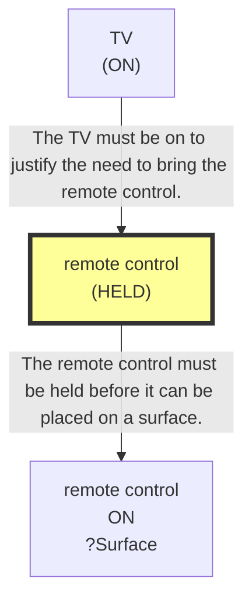
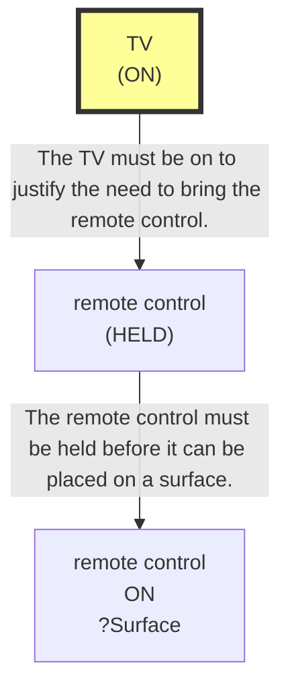
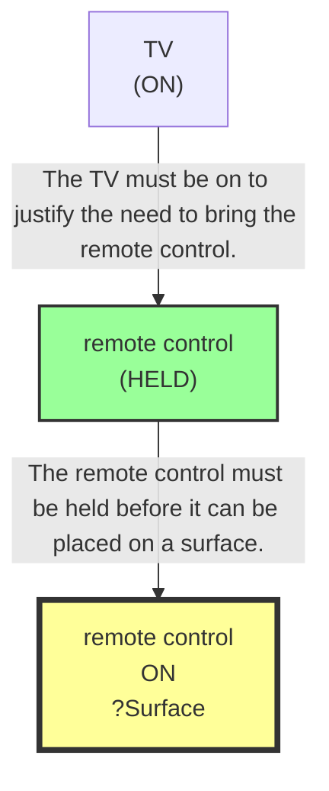

# 🚀 VirtualHome Agent Episode Log


### [GoalReasoner (Module A - Intent)] Output
```json
{
  "is_instruction_obviously_vague": false,
  "clarification_question": null,
  "target_object": "remote control",
  "location_hint": "TV",
  "reasoning_chain": [
    {
      "question": "Why does the user want this object?",
      "answer": "The user wants to interact with the TV."
    },
    {
      "question": "Why is that important?",
      "answer": "The user wants to control the TV's operation."
    },
    {
      "question": "What fundamental need does this fulfill?",
      "answer": "The user wants to manage the TV's state or content."
    },
    {
      "question": "Are there any deeper psychological or physical motivations?",
      "answer": "The user wants to ensure the TV is functioning as intended."
    }
  ],
  "deep_intent": "The user wants to manage the TV's operation.",
  "acceptable_alternatives_properties": [
    {
      "priority": 1,
      "description": "Other devices that can control the TV, such as a smartphone or tablet with a TV app."
    },
    {
      "priority": 2,
      "description": "Devices that can interact with the TV, such as a gaming console or smart speaker."
    },
    {
      "priority": 3,
      "description": "Devices that can change the TV's state, such as a power button or a volume control."
    },
    {
      "priority": 4,
      "description": "Devices that can provide input to the TV, such as a keyboard or a mouse."
    }
  ]
}
```

### [PerceptionFilter] Output
```json
{
  "reasoning": "The goal is to manage the TV's operation, which requires the remote control to be held and the TV to be on. The remote control is the primary object needed, and the TV is the target location. Since the SDG requires the remote control to be held and the TV to be on, we must include the remote control and the TV. No alternative tools are needed as the remote control is the direct object required for the task.",
  "selected_classes": [
    "tv",
    "remotecontrol",
    "keyboard",
    "character",
    "mouse"
  ],
  "raw_class_count": 40
}
```

### [LLMExecutor] Output
```json
{
  "reasoning": "The remote control is inside the living room and is GRABBABLE. To satisfy the goal of holding the remote control (N1), the first step is to grab it. Since the TV is OFF and BROKEN, it cannot be used to justify the need for the remote control, so the focus is on acquiring the remote control.",
  "satisfied_nodes": [],
  "current_node_focus": "N1",
  "mapped_variables": {
    "?Surface": "livingroom(335)"
  },
  "action": "[grab] <remotecontrol> (452)"
}
```

### [RoboStateMultiTaskController] Output
```json
{
  "action": "[grab] <remotecontrol> (452)",
  "active_task_id": "task_1",
  "task_context": {
    "active_task_id": "task_1",
    "pending_task_ids": [],
    "satisfied_task_ids": []
  },
  "source": "llm_executor"
}
```
## Step 0
- **Action**: `[grab] <remotecontrol> (452)`
- **Action Success**: `True`
- **Action Message**: {'0': {'message': 'Success'}}
- **Active Task**: `task_1`
- **Decision Source**: `llm_executor`
- **Task Progress**: T4_qwen_G3_13=pending
- **SDG Status**:

- **Observed Items (9)**: tv(426) [OFF,BROKEN], mouse(429), keyboard(431), remotecontrol(452) [OFF], character(1), bathroom(11), bedroom(73), kitchen(205), livingroom(335)


### [PerceptionFilter] Output
```json
{
  "reasoning": "Reused cached class selection.",
  "selected_classes": [
    "tv",
    "remotecontrol",
    "keyboard",
    "character",
    "mouse"
  ],
  "raw_class_count": 40
}
```

### [LLMExecutor] Output
```json
{
  "reasoning": "The remote control is already held in the right hand (`HOLDS_RH remotecontrol(452)`), so the next step is to place it on a surface (`?Surface`) to satisfy node N2. The TV is currently `OFF` and `BROKEN`, which means it cannot be turned on to satisfy node N3. Therefore, the focus is on placing the remote control on a surface to progress toward the goal.",
  "satisfied_nodes": [
    "N1"
  ],
  "current_node_focus": "N2",
  "mapped_variables": {
    "?Surface": "livingroom(335)"
  },
  "action": "[putback] <remotecontrol> (452) <surface> (335)"
}
```

### [RoboStateMultiTaskController] Output
```json
{
  "action": "[walk] <bathroom> (11)",
  "active_task_id": null,
  "task_context": {
    "active_task_id": null,
    "pending_task_ids": [
      "task_1"
    ],
    "satisfied_task_ids": []
  },
  "source": "loop_recovery_room_revisit"
}
```
## Step 1
- **Action**: `[walk] <bathroom> (11)`
- **Action Success**: `True`
- **Action Message**: {'0': {'message': 'Success'}}
- **Decision Source**: `loop_recovery_room_revisit`
- **Task Progress**: T4_qwen_G3_13=pending
- **SDG Status**:
No SDG active.
- **Observed Items (79)**: floor(336), floor(337), floor(338), floor(339), floor(340), floor(341), floor(342), floor(343), floor(344), wall(345), wall(346), wall(347), wall(348), wall(349), wall(350)...


### [PerceptionFilter] Output
```json
{
  "reasoning": "The goal is to manage the TV's operation, which implies the need to interact with the TV. The remote control is the primary object required for this task. Since the SDG requires the remote control to be 'HELD' and the TV to be 'ON', the remote control class must be included. Additionally, the TV itself is directly mentioned in the SDG and must be included. The location 'TV' is also explicitly mentioned in the goal and must be retained. No other objects are necessary for this task.",
  "selected_classes": [
    "tv",
    "remotecontrol",
    "keyboard",
    "character",
    "mouse"
  ],
  "raw_class_count": 62
}
```

### [LLMExecutor] Output
```json
{
  "reasoning": "The remote control is currently held in the right hand (HOLDS_RH remotecontrol(452)), but it is located in the bathroom (INSIDE bathroom(11)). The goal requires the remote control to be placed on a surface (N2) and the TV to be on (N3). Since the TV is currently OFF and BROKEN, it cannot be used to justify the need for the remote control. Therefore, the next step is to walk to the TV's location (livingroom(335)) to attempt to turn it on.",
  "satisfied_nodes": [],
  "current_node_focus": "N3",
  "mapped_variables": {
    "?Surface": "livingroom(335)"
  },
  "action": "[walk] <livingroom> (335)"
}
```

### [RoboStateMultiTaskController] Output
```json
{
  "action": "[walk] <livingroom> (335)",
  "active_task_id": "task_1",
  "task_context": {
    "active_task_id": "task_1",
    "pending_task_ids": [],
    "satisfied_task_ids": []
  },
  "source": "llm_executor"
}
```
## Step 2
- **Action**: `[walk] <livingroom> (335)`
- **Action Success**: `True`
- **Action Message**: {'0': {'message': 'Success'}}
- **Active Task**: `task_1`
- **Decision Source**: `llm_executor`
- **Task Progress**: T4_qwen_G3_13=pending
- **SDG Status**:

- **Observed Items (9)**: tv(426) [OFF,BROKEN], mouse(429), keyboard(431), remotecontrol(452) [OFF], character(1), bathroom(11), bedroom(73), kitchen(205), livingroom(335)


### [PerceptionFilter] Output
```json
{
  "reasoning": "Reused cached class selection.",
  "selected_classes": [
    "tv",
    "remotecontrol",
    "keyboard",
    "character",
    "mouse"
  ],
  "raw_class_count": 62
}
```

### [LLMExecutor] Output
```json
{
  "reasoning": "The remote control is already held in the right hand (`HOLDS_RH remotecontrol(452)`), so the next step is to place it on a surface (`?Surface`) that is relevant to the TV. Since the TV is in the living room and the remote control is also in the living room, the most logical surface to place the remote control on is the TV itself. However, the TV is currently in the `OFF` state, and the SDG requires the TV to be `ON` (`N3`). Therefore, the next step is to turn the TV on using the remote control.",
  "satisfied_nodes": [
    "N1"
  ],
  "current_node_focus": "N2",
  "mapped_variables": {
    "?Surface": "tv(426)"
  },
  "action": "[switchon] <tv> (426)"
}
```

### [RoboStateMultiTaskController] Output
```json
{
  "action": "[switchon] <tv> (426)",
  "active_task_id": "task_1",
  "task_context": {
    "active_task_id": "task_1",
    "pending_task_ids": [],
    "satisfied_task_ids": []
  },
  "source": "llm_executor"
}
```
## Step 3
- **Action**: `[switchon] <tv> (426)`
- **Action Success**: `False`
- **Action Message**: Failed: tv is BROKEN and cannot be used.
- **Active Task**: `task_1`
- **Decision Source**: `llm_executor`
- **Task Progress**: T4_qwen_G3_13=pending
- **SDG Status**:

- **Observed Items (9)**: tv(426) [OFF,BROKEN], mouse(429), keyboard(431), remotecontrol(452) [OFF], character(1), bathroom(11), bedroom(73), kitchen(205), livingroom(335)


### [PerceptionFilter] Output
```json
{
  "reasoning": "Reused cached class selection.",
  "selected_classes": [
    "tv",
    "remotecontrol",
    "keyboard",
    "character",
    "mouse"
  ],
  "raw_class_count": 62
}
```

### [LLMExecutor] Output
```json
{
  "reasoning": "The TV is BROKEN and cannot be turned on, which means the goal of having the TV ON cannot be satisfied. However, the remote control is already held, so the next step is to place it on a surface. The SDG requires the remote control to be ON a surface, so the appropriate action is to [putback] the remote control on a surface. The livingroom is the most relevant surface since the TV and remote control are located there.",
  "satisfied_nodes": [
    "N1"
  ],
  "current_node_focus": "N2",
  "mapped_variables": {
    "?Surface": "livingroom(335)"
  },
  "action": "[putback] <remotecontrol> (452) <surface_class> (livingroom(335))"
}
```

### [RoboStateMultiTaskController] Output
```json
{
  "action": "[walk] <bedroom> (73)",
  "active_task_id": null,
  "task_context": {
    "active_task_id": null,
    "pending_task_ids": [
      "task_1"
    ],
    "satisfied_task_ids": []
  },
  "source": "loop_recovery_room_revisit"
}
```
## Step 4
- **Action**: `[walk] <bedroom> (73)`
- **Action Success**: `True`
- **Action Message**: {'0': {'message': 'Success'}}
- **Decision Source**: `loop_recovery_room_revisit`
- **Task Progress**: T4_qwen_G3_13=pending
- **SDG Status**:
No SDG active.
- **Observed Items (140)**: floor(336), floor(337), floor(338), floor(339), floor(340), floor(341), floor(342), floor(343), floor(344), wall(345), wall(346), wall(347), wall(348), wall(349), wall(350)...


### [PerceptionFilter] Output
```json
{
  "reasoning": "The goal is to manage the TV's operation, which implies the need to interact with the TV. The remote control is the primary object required to achieve this. Since the SDG requires the remote control to be 'HELD' and the TV to be 'ON', the remote control class must be included. Additionally, the TV itself is explicitly mentioned in the SDG and must be included. The TV stand is a location that supports the TV and is relevant to the task, so it should also be included.",
  "selected_classes": [
    "tv",
    "remotecontrol",
    "keyboard",
    "character",
    "tvstand",
    "mouse"
  ],
  "raw_class_count": 69
}
```

### [LLMExecutor] Output
```json
{
  "reasoning": "The TV is currently BROKEN and cannot be turned on, which means the goal of having the TV ON (N3) cannot be satisfied. Since the TV is broken, the need to have the remote control on a surface (N2) is also invalid. Therefore, the next logical step is to ask the user for clarification on how to proceed, as the TV cannot be used and the remote control's purpose is unclear in this context.",
  "satisfied_nodes": [],
  "current_node_focus": "N3",
  "mapped_variables": {},
  "action": "[ask] The TV is broken and cannot be turned on. How should I proceed with the remote control?"
}
```

### [RoboStateMultiTaskController] Output
```json
{
  "action": "[ask] The TV is broken and cannot be turned on. How should I proceed with the remote control?",
  "active_task_id": "task_1",
  "task_context": {
    "active_task_id": "task_1",
    "pending_task_ids": [],
    "satisfied_task_ids": []
  },
  "source": "llm_executor"
}
```
## Step 5
- **Action**: `[ask] The TV is broken and cannot be turned on. How should I proceed with the remote control?`
- **Action Success**: `True`
- **Action Message**: nothing to claim
- **Active Task**: `task_1`
- **Decision Source**: `llm_executor`
- **Task Progress**: T4_qwen_G3_13=pending
- **SDG Status**:

- **Observed Items (12)**: tvstand(369), tv(426) [OFF,BROKEN], mouse(429), keyboard(431), remotecontrol(452) [OFF], character(1), bathroom(11), bedroom(73), kitchen(205), livingroom(335), mouse(170), keyboard(172)

