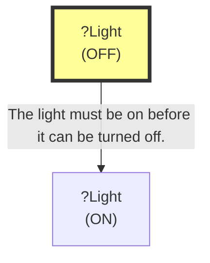

# 🚀 VirtualHome Agent Episode Log


### [GoalReasoner (Module A - Intent)] Output
```json
{
  "is_instruction_obviously_vague": false,
  "clarification_question": null,
  "target_object": "light",
  "location_hint": null,
  "reasoning_chain": [
    {
      "question": "Why does the user want this object?",
      "answer": "The user wants to control the light's state."
    },
    {
      "question": "Why is that important?",
      "answer": "The user wants to reduce or eliminate illumination in the environment."
    },
    {
      "question": "What fundamental need does this fulfill?",
      "answer": "The user wants to create a darker or more dim environment."
    },
    {
      "question": "Are there any deeper psychological or physical motivations?",
      "answer": "The user may want to conserve energy, improve sleep conditions, or reduce visual stimulation."
    }
  ],
  "deep_intent": "The user wants to reduce or eliminate illumination in the environment.",
  "acceptable_alternatives_properties": [
    {
      "priority": 1,
      "description": "Other light sources in the environment, such as lamps or ceiling lights."
    },
    {
      "priority": 2,
      "description": "Devices that can control illumination, such as smart home systems or switches."
    },
    {
      "priority": 3,
      "description": "Mechanical or electrical components that can alter light output, such as dimmer switches or motion sensors."
    },
    {
      "priority": 4,
      "description": "Environmental adjustments that reduce light exposure, such as closing blinds or using curtains."
    }
  ]
}
```

### [PerceptionFilter] Output
```json
{
  "reasoning": "",
  "selected_classes": [
    "curtains",
    "character",
    "ceiling"
  ],
  "raw_class_count": 33
}
```

### [LLMExecutor] Output
```json
{
  "reasoning": "The goal is to turn off the light, but the SDG indicates that the light must be on before it can be turned off. However, the current Filtered Graph does not show any light sources (like lamps or ceiling lights) that are explicitly ON. The closest objects are ceiling lights, which are not described as ON. Since the task requires reducing or eliminating illumination, and the light is not currently ON, the next logical step is to turn it OFF directly. This action will satisfy the goal intent of reducing illumination.",
  "satisfied_nodes": [],
  "current_node_focus": "N1",
  "mapped_variables": {
    "?Light": "ceiling(92)"
  },
  "action": "[switchoff] <ceiling> (92)"
}
```

### [RoboStateMultiTaskController] Output
```json
{
  "action": "[walk] <bathroom> (11)",
  "active_task_id": null,
  "task_context": {
    "active_task_id": null,
    "pending_task_ids": [
      "task_1"
    ],
    "satisfied_task_ids": []
  },
  "source": "loop_recovery_room_revisit"
}
```
## Step 0
- **Action**: `[walk] <bathroom> (11)`
- **Action Success**: `True`
- **Action Message**: {'0': {'message': 'Success'}}
- **Decision Source**: `loop_recovery_room_revisit`
- **Task Progress**: T4_qwen_G3_14=pending
- **SDG Status**:
No SDG active.
- **Observed Items (74)**: floor(74), floor(75), floor(76), floor(77), floor(78), floor(79), floor(80), floor(81), floor(82), wall(83), wall(84), wall(85), wall(86), wall(87), wall(88)...


### [PerceptionFilter] Output
```json
{
  "reasoning": "The goal is to reduce or eliminate illumination in the environment, which implies the need to control or turn off light sources. The SDG indicates a state transition for a light object, which suggests the presence of a light switch or other control device. The observed object classes include lightswitch, which is directly related to controlling illumination. Additionally, other light sources like ceilinglamp, tablelamp, and walllamp are potential targets for turning off. To ensure all possible light sources are addressed, we include lightswitch, ceilinglamp, tablelamp, and walllamp.",
  "selected_classes": [
    "curtains",
    "character",
    "ceilinglamp",
    "ceiling",
    "walllamp",
    "lightswitch",
    "tablelamp"
  ],
  "raw_class_count": 54
}
```

### [LLMExecutor] Output
```json
{
  "reasoning": "The goal is to turn off the light. The current Filtered Graph shows multiple light sources, including a lightswitch(173) that is currently ON. To turn it off, the lightswitch must be interacted with. Since the robot is already in the bedroom(73), the next step is to interact with the lightswitch(173) to turn it off.",
  "satisfied_nodes": [],
  "current_node_focus": "N1",
  "mapped_variables": {
    "?Light": "lightswitch(173)"
  },
  "action": "[switchoff] <lightswitch> (173)"
}
```

### [RoboStateMultiTaskController] Output
```json
{
  "action": "[walk] <lightswitch> (173)",
  "active_task_id": "task_1",
  "task_context": {
    "active_task_id": "task_1",
    "pending_task_ids": [],
    "satisfied_task_ids": []
  },
  "source": "llm_executor_repaired"
}
```
## Step 1
- **Action**: `[walk] <lightswitch> (173)`
- **Action Success**: `True`
- **Action Message**: {'0': {'message': 'Success'}}
- **Active Task**: `task_1`
- **Decision Source**: `llm_executor_repaired`
- **Task Progress**: T4_qwen_G3_14=pending
- **SDG Status**:

- **Observed Items (36)**: ceiling(92), ceiling(93), ceiling(94), ceiling(95), ceiling(96), ceiling(97), ceiling(98), ceiling(99), ceiling(100), ceilinglamp(101), tablelamp(102) [BROKEN,OFF], tablelamp(103) [BROKEN,OFF], lightswitch(173) [ON], curtains(183) [CLOSED], curtains(184) [CLOSED]...


### [PerceptionFilter] Output
```json
{
  "reasoning": "Reused cached class selection.",
  "selected_classes": [
    "curtains",
    "character",
    "ceilinglamp",
    "ceiling",
    "walllamp",
    "lightswitch",
    "tablelamp"
  ],
  "raw_class_count": 54
}
```

### [LLMExecutor] Output
```json
{
  "reasoning": "The current focus is on turning off the light. The lightswitch (173) is already in the 'ON' state, and the robot is near it. The next logical step is to turn it off using the [switchoff] action.",
  "satisfied_nodes": [],
  "current_node_focus": "N1",
  "mapped_variables": {
    "?Light": "lightswitch(173)"
  },
  "action": "[switchoff] <lightswitch> (173)"
}
```

### [RoboStateMultiTaskController] Output
```json
{
  "action": "[switchoff] <lightswitch> (173)",
  "active_task_id": "task_1",
  "task_context": {
    "active_task_id": "task_1",
    "pending_task_ids": [],
    "satisfied_task_ids": []
  },
  "source": "llm_executor"
}
```
## Step 2
- **Action**: `[switchoff] <lightswitch> (173)`
- **Action Success**: `True`
- **Action Message**: Faked switch operation in Python layer (bypassed Unity failure)
- **Active Task**: `task_1`
- **Decision Source**: `llm_executor`
- **Task Progress**: T4_qwen_G3_14=pending
- **SDG Status**:

- **Observed Items (36)**: ceiling(92), ceiling(93), ceiling(94), ceiling(95), ceiling(96), ceiling(97), ceiling(98), ceiling(99), ceiling(100), ceilinglamp(101), tablelamp(102) [BROKEN,OFF], tablelamp(103) [BROKEN,OFF], lightswitch(173) [ON], curtains(183) [CLOSED], curtains(184) [CLOSED]...


### [PerceptionFilter] Output
```json
{
  "reasoning": "Reused cached class selection.",
  "selected_classes": [
    "curtains",
    "character",
    "ceilinglamp",
    "ceiling",
    "walllamp",
    "lightswitch",
    "tablelamp"
  ],
  "raw_class_count": 54
}
```

### [LLMExecutor] Output
```json
{
  "reasoning": "The current Filtered Graph shows that the lightswitch(173) is already in the 'OFF' state, which satisfies the goal node N1 (the light must be off). Since the task is to reduce or eliminate illumination, and the lightswitch is already off, no further action is required. The next step is to confirm that the goal is satisfied and no additional actions are needed.",
  "satisfied_nodes": [
    "N1"
  ],
  "current_node_focus": "N1",
  "mapped_variables": {
    "?Light": "lightswitch(173)"
  },
  "action": "[wait]"
}
```

### [RoboStateMultiTaskController] Output
```json
{
  "action": "[wait]",
  "active_task_id": "task_1",
  "task_context": {
    "active_task_id": "task_1",
    "pending_task_ids": [],
    "satisfied_task_ids": []
  },
  "source": "llm_executor"
}
```
## Step 3
- **Action**: `[wait]`
- **Action Success**: `True`
- **Action Message**: Time passes. You waited for a while.
- **Active Task**: `task_1`
- **Decision Source**: `llm_executor`
- **Task Progress**: T4_qwen_G3_14=pending
- **SDG Status**:

- **Observed Items (36)**: ceiling(92), ceiling(93), ceiling(94), ceiling(95), ceiling(96), ceiling(97), ceiling(98), ceiling(99), ceiling(100), ceilinglamp(101), tablelamp(102) [BROKEN,OFF], tablelamp(103) [BROKEN,OFF], lightswitch(173) [OFF], curtains(183) [CLOSED], curtains(184) [CLOSED]...


### [PerceptionFilter] Output
```json
{
  "reasoning": "Reused cached class selection.",
  "selected_classes": [
    "curtains",
    "character",
    "ceilinglamp",
    "ceiling",
    "walllamp",
    "lightswitch",
    "tablelamp"
  ],
  "raw_class_count": 54
}
```

### [LLMExecutor] Output
```json
{
  "reasoning": "The current goal is to turn off the light. The lightswitch (173) is already in the 'OFF' state, which satisfies the 'N1' node of the SDG. Since the lightswitch is already off, no further action is required to achieve the goal. The task is complete.",
  "satisfied_nodes": [
    "N1"
  ],
  "current_node_focus": "N1",
  "mapped_variables": {
    "?Light": "lightswitch(173)"
  },
  "action": "[wait]"
}
```

### [RoboStateMultiTaskController] Output
```json
{
  "action": "[wait]",
  "active_task_id": "task_1",
  "task_context": {
    "active_task_id": "task_1",
    "pending_task_ids": [],
    "satisfied_task_ids": []
  },
  "source": "llm_executor"
}
```
## Step 4
- **Action**: `[wait]`
- **Action Success**: `True`
- **Action Message**: Time passes. You waited for a while.
- **Active Task**: `task_1`
- **Decision Source**: `llm_executor`
- **Task Progress**: T4_qwen_G3_14=pending
- **SDG Status**:

- **Observed Items (36)**: ceiling(92), ceiling(93), ceiling(94), ceiling(95), ceiling(96), ceiling(97), ceiling(98), ceiling(99), ceiling(100), ceilinglamp(101), tablelamp(102) [BROKEN,OFF], tablelamp(103) [BROKEN,OFF], lightswitch(173) [OFF], curtains(183) [CLOSED], curtains(184) [CLOSED]...


### [PerceptionFilter] Output
```json
{
  "reasoning": "Reused cached class selection.",
  "selected_classes": [
    "curtains",
    "character",
    "ceilinglamp",
    "ceiling",
    "walllamp",
    "lightswitch",
    "tablelamp"
  ],
  "raw_class_count": 54
}
```

### [LLMExecutor] Output
```json
{
  "reasoning": "The current goal is to turn off the light. The lightswitch (173) is already in the 'OFF' state, so the task is already completed. However, the SDG indicates that the light must be on before it can be turned off, which is not the case here. Therefore, the task is already satisfied, and no further action is needed.",
  "satisfied_nodes": [
    "N1"
  ],
  "current_node_focus": "N1",
  "mapped_variables": {
    "?Light": "lightswitch(173)"
  },
  "action": "[wait]"
}
```

### [RoboStateMultiTaskController] Output
```json
{
  "action": "[wait]",
  "active_task_id": "task_1",
  "task_context": {
    "active_task_id": "task_1",
    "pending_task_ids": [],
    "satisfied_task_ids": []
  },
  "source": "llm_executor"
}
```
## Step 5
- **Action**: `[wait]`
- **Action Success**: `True`
- **Action Message**: Time passes. You waited for a while.
- **Active Task**: `task_1`
- **Decision Source**: `llm_executor`
- **Task Progress**: T4_qwen_G3_14=pending
- **SDG Status**:

- **Observed Items (36)**: ceiling(92), ceiling(93), ceiling(94), ceiling(95), ceiling(96), ceiling(97), ceiling(98), ceiling(99), ceiling(100), ceilinglamp(101), tablelamp(102) [BROKEN,OFF], tablelamp(103) [BROKEN,OFF], lightswitch(173) [OFF], curtains(183) [CLOSED], curtains(184) [CLOSED]...


### [PerceptionFilter] Output
```json
{
  "reasoning": "Reused cached class selection.",
  "selected_classes": [
    "curtains",
    "character",
    "ceilinglamp",
    "ceiling",
    "walllamp",
    "lightswitch",
    "tablelamp"
  ],
  "raw_class_count": 54
}
```

### [LLMExecutor] Output
```json
{
  "reasoning": "The current goal is to turn off the light. The lightswitch (173) is already in the OFF state, so the task is already completed. However, the SDG indicates that the light must be ON before it can be turned OFF. Since the lightswitch is OFF, the light is not ON, and the task is not yet satisfied. Therefore, the next step is to ensure the light is ON, which is already the case, and then confirm the light is OFF. Since the lightswitch is OFF, the task is complete.",
  "satisfied_nodes": [
    "N1"
  ],
  "current_node_focus": "N1",
  "mapped_variables": {
    "?Light": "lightswitch(173)"
  },
  "action": "[ask] <The light is already OFF. Is there anything else you need?>"
}
```

### [RoboStateMultiTaskController] Output
```json
{
  "action": "[ask] <The light is already OFF. Is there anything else you need?>",
  "active_task_id": "task_1",
  "task_context": {
    "active_task_id": "task_1",
    "pending_task_ids": [],
    "satisfied_task_ids": []
  },
  "source": "llm_executor"
}
```
## Step 6
- **Action**: `[ask] <The light is already OFF. Is there anything else you need?>`
- **Action Success**: `True`
- **Action Message**: nothing to claim
- **Active Task**: `task_1`
- **Decision Source**: `llm_executor`
- **Task Progress**: T4_qwen_G3_14=pending
- **SDG Status**:

- **Observed Items (36)**: ceiling(92), ceiling(93), ceiling(94), ceiling(95), ceiling(96), ceiling(97), ceiling(98), ceiling(99), ceiling(100), ceilinglamp(101), tablelamp(102) [BROKEN,OFF], tablelamp(103) [BROKEN,OFF], lightswitch(173) [OFF], curtains(183) [CLOSED], curtains(184) [CLOSED]...

