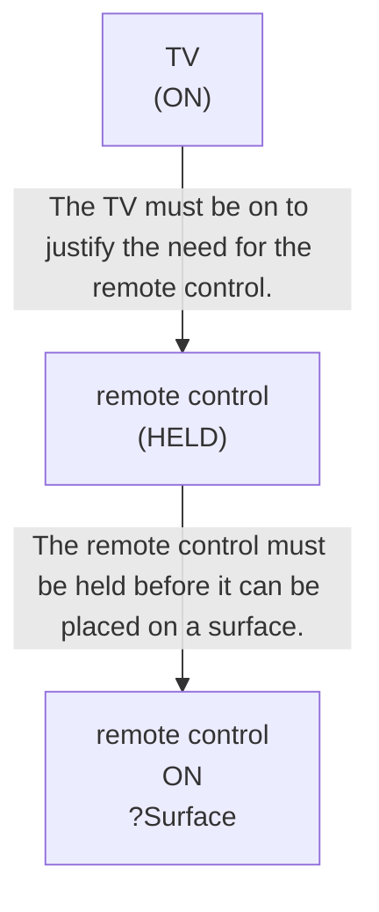
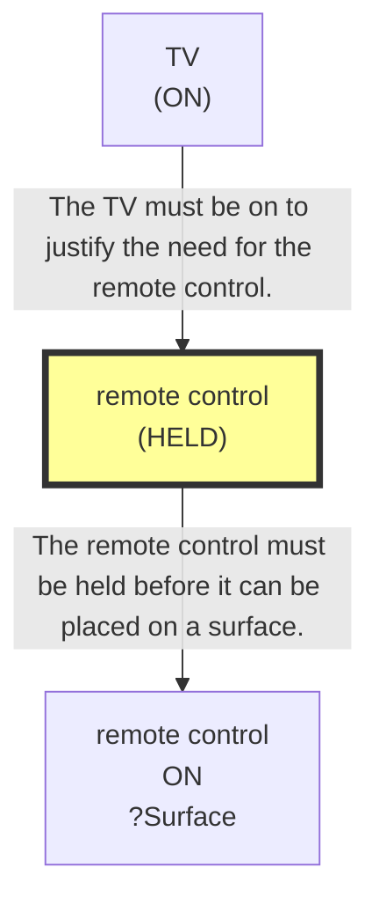

# 🚀 VirtualHome Agent Episode Log


### [GoalReasoner (Module A - Intent)] Output
```json
{
  "is_instruction_obviously_vague": false,
  "clarification_question": null,
  "target_object": "remote control",
  "location_hint": "TV",
  "reasoning_chain": [
    {
      "question": "Why does the user want this object?",
      "answer": "The user wants to interact with the TV, likely to change channels, adjust volume, or turn it off."
    },
    {
      "question": "Why is that important?",
      "answer": "The user needs to control the TV to access content or stop it from running."
    },
    {
      "question": "What fundamental need does this fulfill?",
      "answer": "The user wants to manage or stop the TV's operation."
    },
    {
      "question": "Are there any deeper psychological or physical motivations?",
      "answer": "The user may be seeking to reduce distractions, conserve energy, or regain control over their environment."
    }
  ],
  "deep_intent": "The user wants to stop or manage the TV's operation.",
  "acceptable_alternatives_properties": [
    {
      "priority": 1,
      "description": "Other devices that can control the TV, such as a smartphone or a voice assistant."
    },
    {
      "priority": 2,
      "description": "Devices that can turn off or adjust the TV, such as a power button or a volume control."
    },
    {
      "priority": 3,
      "description": "Devices that can interact with the TV, such as a gaming console or a streaming device."
    },
    {
      "priority": 4,
      "description": "Alternative methods to stop the TV, such as unplugging it or using a timer."
    }
  ]
}
```

### [RoboStateMultiTaskController] Output
```json
{
  "action": "[walk] <bathroom> (11)",
  "active_task_id": "task_1",
  "task_context": {
    "active_task_id": "task_1",
    "pending_task_ids": [],
    "satisfied_task_ids": []
  },
  "source": "room_frontier"
}
```
## Step 0
- **Action**: `[walk] <bathroom> (11)`
- **Action Success**: `True`
- **Action Message**: {'0': {'message': 'Success'}}
- **Active Task**: `task_1`
- **Decision Source**: `room_frontier`
- **Task Progress**: T4_qwen_M1_01=pending
- **SDG Status**:

- **Observed Items (63)**: wall(262), wall(263), wall(264), wall(265), wall(266), wall(267), wall(268), wall(269), ceiling(270), ceiling(271), ceiling(272), ceiling(273), ceiling(274), ceiling(275), ceiling(276)...


### [RoboStateMultiTaskController] Output
```json
{
  "action": "[walk] <bedroom> (50)",
  "active_task_id": "task_1",
  "task_context": {
    "active_task_id": "task_1",
    "pending_task_ids": [],
    "satisfied_task_ids": []
  },
  "source": "room_frontier"
}
```
## Step 1
- **Action**: `[walk] <bedroom> (50)`
- **Action Success**: `True`
- **Action Message**: {'0': {'message': 'Success'}}
- **Active Task**: `task_1`
- **Decision Source**: `room_frontier`
- **Task Progress**: T4_qwen_M1_01=pending
- **SDG Status**:

- **Observed Items (101)**: wall(262), wall(263), wall(264), wall(265), wall(266), wall(267), wall(268), wall(269), ceiling(270), ceiling(271), ceiling(272), ceiling(273), ceiling(274), ceiling(275), ceiling(276)...


### [PerceptionFilter] Output
```json
{
  "reasoning": "The goal is to stop or manage the TV's operation, which implies the need for a remote control. The SDG requires the remote control to be 'HELD' and the TV to be 'ON'. The remote control is explicitly mentioned as the target object, and the TV is the location hint. Since the remote control is a direct tool for managing the TV, it must be included. Additionally, the TV itself is necessary to confirm the context and location of the operation. No alternative tools are needed as the remote control is the primary and most direct method for managing the TV.",
  "selected_classes": [
    "tv",
    "character",
    "remotecontrol"
  ],
  "raw_class_count": 61
}
```

### [LLMExecutor] Output
```json
{
  "reasoning": "The remote control is currently inside the bedroom and is in the 'OFF' state. To interact with the TV, the remote control must be held. The first step is to grab the remote control from its current location (bedroom).",
  "satisfied_nodes": [],
  "current_node_focus": "N1",
  "mapped_variables": {
    "?Surface": "bedroom(50)"
  },
  "action": "[grab] <remotecontrol> (321)"
}
```

### [RoboStateMultiTaskController] Output
```json
{
  "action": "[grab] <remotecontrol> (321)",
  "active_task_id": "task_1",
  "task_context": {
    "active_task_id": "task_1",
    "pending_task_ids": [],
    "satisfied_task_ids": []
  },
  "source": "llm_executor"
}
```
## Step 2
- **Action**: `[grab] <remotecontrol> (321)`
- **Action Success**: `False`
- **Action Message**: temporary_unavailable: target disappeared; wait or search and retry
- **Active Task**: `task_1`
- **Decision Source**: `llm_executor`
- **Task Progress**: T4_qwen_M1_01=pending
- **SDG Status**:

- **Observed Items (7)**: tv(300) [ON], character(1), bathroom(11), bedroom(50), kitchen(126), livingroom(261), remotecontrol(321) [OFF]


### [PerceptionFilter] Output
```json
{
  "reasoning": "Reused cached class selection.",
  "selected_classes": [
    "tv",
    "character",
    "remotecontrol"
  ],
  "raw_class_count": 61
}
```

### [LLMExecutor] Output
```json
{
  "reasoning": "The remote control is currently in the bedroom and is marked as 'OFF', which suggests it may not be functional. However, the task requires the remote control to be held (N1) to interact with the TV (N3). Since the remote control is not in the robot's hands and the previous attempt to grab it failed due to temporary unavailability, the next step is to walk to the remote control and attempt to grab it again.",
  "satisfied_nodes": [],
  "current_node_focus": "N1",
  "mapped_variables": {
    "?Surface": "bedroom(50)"
  },
  "action": "[walk] <remotecontrol> (321)"
}
```

### [RoboStateMultiTaskController] Output
```json
{
  "action": "[walk] <remotecontrol> (321)",
  "active_task_id": "task_1",
  "task_context": {
    "active_task_id": "task_1",
    "pending_task_ids": [],
    "satisfied_task_ids": []
  },
  "source": "llm_executor"
}
```
## Step 3
- **Action**: `[walk] <remotecontrol> (321)`
- **Action Success**: `False`
- **Action Message**: temporary_unavailable: target is temporarily hidden
- **Active Task**: `task_1`
- **Decision Source**: `llm_executor`
- **Task Progress**: T4_qwen_M1_01=pending
- **SDG Status**:

- **Observed Items (7)**: tv(300) [ON], character(1), bathroom(11), bedroom(50), kitchen(126), livingroom(261), remotecontrol(321) [OFF]


### [RoboStateMultiTaskController] Output
```json
{
  "action": "[walk] <kitchen> (126)",
  "active_task_id": null,
  "task_context": {
    "active_task_id": null,
    "pending_task_ids": [
      "task_1"
    ],
    "satisfied_task_ids": []
  },
  "source": "loop_recovery_room_revisit"
}
```
## Step 4
- **Action**: `[walk] <kitchen> (126)`
- **Action Success**: `True`
- **Action Message**: {'0': {'message': 'Success'}}
- **Decision Source**: `loop_recovery_room_revisit`
- **Task Progress**: T4_qwen_M1_01=pending
- **SDG Status**:
No SDG active.
- **Observed Items (172)**: wall(262), wall(263), wall(264), wall(265), wall(266), wall(267), wall(268), wall(269), ceiling(270), ceiling(271), ceiling(272), ceiling(273), ceiling(274), ceiling(275), ceiling(276)...


### [PerceptionFilter] Output
```json
{
  "reasoning": "The goal is to stop or manage the TV's operation, which implies the need for a remote control. The SDG requires the remote control to be 'HELD' and the TV to be 'ON'. The remote control is explicitly mentioned as the target object, and the TV is the location hint. Since the remote control is a direct tool for managing the TV, it must be included. Additionally, the TV itself must be included as it is the object being controlled. No other objects are necessary for this task.",
  "selected_classes": [
    "tv",
    "character",
    "remotecontrol"
  ],
  "raw_class_count": 86
}
```

### [LLMExecutor] Output
```json
{
  "reasoning": "The remote control is currently in the bedroom and is marked as 'OFF', which suggests it may not be functional. However, the task requires the remote control to be held (N1) and the TV to be on (N3). Since the remote control is not in the current location (kitchen), we need to walk to the bedroom to locate and grab it. The previous attempts to walk to the remote control failed due to temporary unavailability, so we need to retry the walk action to the bedroom where it is located.",
  "satisfied_nodes": [],
  "current_node_focus": "N1",
  "mapped_variables": {
    "?Surface": "table(10)"
  },
  "action": "[walk] <bedroom> (50)"
}
```

### [RoboStateMultiTaskController] Output
```json
{
  "action": "[walk] <bedroom> (50)",
  "active_task_id": "task_1",
  "task_context": {
    "active_task_id": "task_1",
    "pending_task_ids": [],
    "satisfied_task_ids": []
  },
  "source": "llm_executor"
}
```
## Step 5
- **Action**: `[walk] <bedroom> (50)`
- **Action Success**: `True`
- **Action Message**: {'0': {'message': 'Success'}}
- **Active Task**: `task_1`
- **Decision Source**: `llm_executor`
- **Task Progress**: T4_qwen_M1_01=pending
- **SDG Status**:

- **Observed Items (7)**: tv(300) [ON], character(1), bathroom(11), bedroom(50), kitchen(126), livingroom(261), remotecontrol(321) [OFF]


### [PerceptionFilter] Output
```json
{
  "reasoning": "Reused cached class selection.",
  "selected_classes": [
    "tv",
    "character",
    "remotecontrol"
  ],
  "raw_class_count": 86
}
```

### [LLMExecutor] Output
```json
{
  "reasoning": "The remote control is currently in the bedroom and is marked as 'OFF' in the Filtered Graph. Since the TV is 'ON', the remote control must be grabbed to interact with the TV. However, the remote control is not in the same location as the robot, so the robot must first walk to the remote control to grab it.",
  "satisfied_nodes": [],
  "current_node_focus": "N1",
  "mapped_variables": {
    "?Surface": "bedroom(50)"
  },
  "action": "[walk] <remotecontrol> (321)"
}
```

### [RoboStateMultiTaskController] Output
```json
{
  "action": "[walk] <remotecontrol> (321)",
  "active_task_id": "task_1",
  "task_context": {
    "active_task_id": "task_1",
    "pending_task_ids": [],
    "satisfied_task_ids": []
  },
  "source": "llm_executor"
}
```
## Step 6
- **Action**: `[walk] <remotecontrol> (321)`
- **Action Success**: `True`
- **Action Message**: {'0': {'message': 'Success'}}
- **Active Task**: `task_1`
- **Decision Source**: `llm_executor`
- **Task Progress**: T4_qwen_M1_01=pending
- **SDG Status**:

- **Observed Items (7)**: tv(300) [ON], character(1), bathroom(11), bedroom(50), kitchen(126), livingroom(261), remotecontrol(321) [OFF]


### [PerceptionFilter] Output
```json
{
  "reasoning": "Reused cached class selection.",
  "selected_classes": [
    "tv",
    "character",
    "remotecontrol"
  ],
  "raw_class_count": 86
}
```

### [LLMExecutor] Output
```json
{
  "reasoning": "The remote control is currently in the bedroom and is marked as 'OFF' in the Filtered Graph. The robot is already in the bedroom and needs to grab the remote control to satisfy the 'remote control' being 'HELD' state. The next logical step is to [grab] the remote control.",
  "satisfied_nodes": [],
  "current_node_focus": "N1",
  "mapped_variables": {
    "?Surface": "bedroom(50)"
  },
  "action": "[grab] <remotecontrol> (321)"
}
```

### [RoboStateMultiTaskController] Output
```json
{
  "action": "[grab] <remotecontrol> (321)",
  "active_task_id": "task_1",
  "task_context": {
    "active_task_id": "task_1",
    "pending_task_ids": [],
    "satisfied_task_ids": []
  },
  "source": "llm_executor"
}
```
## Step 7
- **Action**: `[grab] <remotecontrol> (321)`
- **Action Success**: `True`
- **Action Message**: {'0': {'message': 'Success'}}
- **Active Task**: `task_1`
- **Decision Source**: `llm_executor`
- **Task Progress**: T4_qwen_M1_01=done
- **SDG Status**:

- **Observed Items (7)**: tv(300) [ON], character(1), bathroom(11), bedroom(50), kitchen(126), livingroom(261), remotecontrol(321) [OFF]

