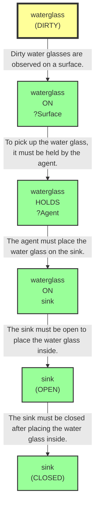
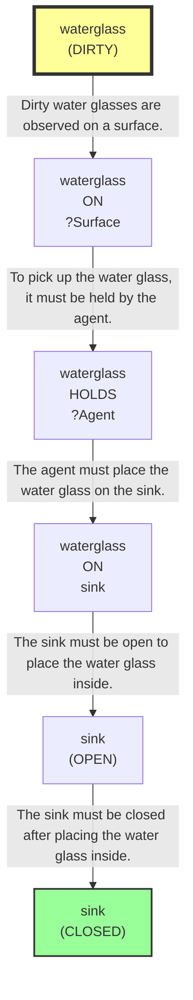
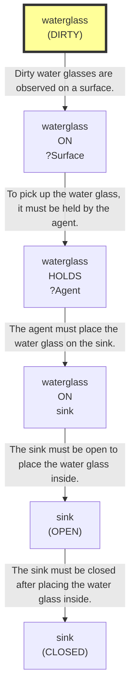
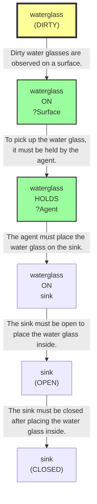
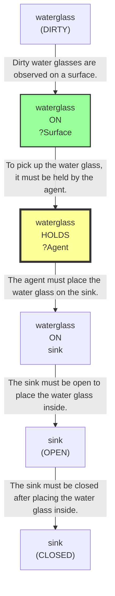
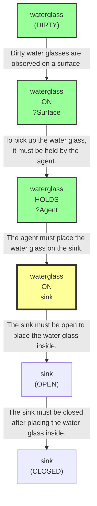

# 🚀 VirtualHome Agent Episode Log


### [GoalReasoner (Module A - Intent)] Output
```json
{
  "is_instruction_obviously_vague": false,
  "clarification_question": null,
  "target_object": "dirty water glasses",
  "location_hint": "sink",
  "reasoning_chain": [
    {
      "question": "Why does the user want this object?",
      "answer": "The user wants to manage and organize dirty water glasses."
    },
    {
      "question": "Why is that important?",
      "answer": "It is important to maintain cleanliness and hygiene in the environment."
    },
    {
      "question": "What fundamental need does this fulfill?",
      "answer": "The user wants to ensure that dirty items are properly disposed of or cleaned."
    },
    {
      "question": "Are there any deeper psychological or physical motivations?",
      "answer": "The user likely wants to maintain a clean and organized space, which contributes to a sense of order and well-being."
    }
  ],
  "deep_intent": "The user wants to maintain cleanliness and order by properly disposing of dirty items.",
  "acceptable_alternatives_properties": [
    {
      "priority": 1,
      "description": "Other dirty glassware or containers that need to be cleaned or disposed of."
    },
    {
      "priority": 2,
      "description": "Items that are considered dirty or require cleaning, such as used cups or plates."
    },
    {
      "priority": 3,
      "description": "Items that are no longer in use and need to be discarded or cleaned, such as cups, bowls, or mugs."
    },
    {
      "priority": 4,
      "description": "Items that are considered unhygienic or contaminated, such as used utensils or containers."
    }
  ]
}
```

### [PerceptionFilter] Output
```json
{
  "reasoning": "The goal is to manage and organize dirty water glasses, specifically by placing them in the sink. The SDG requires the presence of dirty water glasses, the sink, and the ability to interact with the sink (open and close). The sink is explicitly mentioned as the location, and the waterglass is the target object. To ensure functionality, the sink must be included as it is the required location for disposal. No alternative tools are needed since the task is straightforward and does not require additional tools beyond the sink and the waterglass.",
  "selected_classes": [
    "sink",
    "waterglass",
    "character",
    "plate"
  ],
  "raw_class_count": 50
}
```

### [LLMExecutor] Output
```json
{
  "reasoning": "The current Filtered Graph shows that there is a `waterglass(64)` with the `DIRTY` state, which matches the SDG node N1. However, the robot is not holding this object, and it is not on the sink. The next logical step is to grab the dirty water glass and then walk to the sink to place it there. Since the robot is not holding the object, the first action must be to grab it.",
  "satisfied_nodes": [
    "N2",
    "N3",
    "N4",
    "N5",
    "N6"
  ],
  "current_node_focus": "N1",
  "mapped_variables": {
    "?Washer": "sink(155)"
  },
  "action": "[grab] <waterglass> (64)"
}
```

### [RoboStateMultiTaskController] Output
```json
{
  "action": "[grab] <waterglass> (64)",
  "active_task_id": "task_1",
  "task_context": {
    "active_task_id": "task_1",
    "pending_task_ids": [],
    "satisfied_task_ids": []
  },
  "source": "llm_executor"
}
```
## Step 0
- **Action**: `[grab] <waterglass> (64)`
- **Action Success**: `False`
- **Action Message**: temporary_unavailable: target disappeared; wait or search and retry
- **Active Task**: `task_1`
- **Decision Source**: `llm_executor`
- **Task Progress**: T4_qwen_M1_03=pending
- **SDG Status**:

- **Observed Items (24)**: waterglass(64) [DIRTY], plate(67), plate(68), waterglass(71), waterglass(72), plate(75), plate(76), waterglass(79), waterglass(80), plate(83), plate(84), waterglass(87), waterglass(88), plate(91), waterglass(100)...


### [PerceptionFilter] Output
```json
{
  "reasoning": "Reused cached class selection.",
  "selected_classes": [
    "sink",
    "waterglass",
    "character",
    "plate"
  ],
  "raw_class_count": 50
}
```

### [LLMExecutor] Output
```json
{
  "reasoning": "The previous attempt to grab the waterglass(64) failed because it disappeared, likely due to another character using it. Since the task requires managing dirty water glasses, and the sink(155) is the target location, the next logical step is to locate a dirty water glass and walk to the sink. The current Filtered Graph shows multiple waterglasses, but only waterglass(64) is marked as DIRTY. We must first walk to waterglass(64) to grab it, then walk to the sink to place it there.",
  "satisfied_nodes": [
    "N6"
  ],
  "current_node_focus": "N1",
  "mapped_variables": {
    "?Washer": "sink(155)",
    "?Surface": "kitchen(11)"
  },
  "action": "[walk] <waterglass> (64)"
}
```

### [RoboStateMultiTaskController] Output
```json
{
  "action": "[walk] <waterglass> (64)",
  "active_task_id": "task_1",
  "task_context": {
    "active_task_id": "task_1",
    "pending_task_ids": [],
    "satisfied_task_ids": []
  },
  "source": "llm_executor"
}
```
## Step 1
- **Action**: `[walk] <waterglass> (64)`
- **Action Success**: `False`
- **Action Message**: temporary_unavailable: target is temporarily hidden
- **Active Task**: `task_1`
- **Decision Source**: `llm_executor`
- **Task Progress**: T4_qwen_M1_03=pending
- **SDG Status**:

- **Observed Items (24)**: waterglass(64) [DIRTY], plate(67), plate(68), waterglass(71), waterglass(72), plate(75), plate(76), waterglass(79), waterglass(80), plate(83), plate(84), waterglass(87), waterglass(88), plate(91), waterglass(100)...


### [RoboStateMultiTaskController] Output
```json
{
  "action": "[walk] <livingroom> (183)",
  "active_task_id": null,
  "task_context": {
    "active_task_id": null,
    "pending_task_ids": [
      "task_1"
    ],
    "satisfied_task_ids": []
  },
  "source": "loop_recovery_room_revisit"
}
```
## Step 2
- **Action**: `[walk] <livingroom> (183)`
- **Action Success**: `True`
- **Action Message**: {'0': {'message': 'Success'}}
- **Decision Source**: `loop_recovery_room_revisit`
- **Task Progress**: T4_qwen_M1_03=pending
- **SDG Status**:
No SDG active.
- **Observed Items (159)**: wall(12), wall(13), wall(14), wall(15), wall(16), wall(17), wall(18), wall(19), wall(20), wall(21), floor(22), floor(23), floor(24), floor(25), floor(26)...


### [PerceptionFilter] Output
```json
{
  "reasoning": "The goal is to manage and organize dirty water glasses, specifically by placing them in the sink. The SDG requires the presence of dirty water glasses, the sink, and the ability to interact with the sink (open and close). To ensure the task can be completed, we must include the exact object classes mentioned in the goal and SDG, such as 'dirty water glasses' (represented as 'waterglass' in the SDG), 'sink', and any necessary tools or locations implied by the task. Since the SDG explicitly mentions 'sink' and 'waterglass', these must be included. Additionally, the sink must be open and closed, so the 'sink' class is critical. No other objects are necessary for this task.",
  "selected_classes": [
    "sink",
    "waterglass",
    "character",
    "plate"
  ],
  "raw_class_count": 59
}
```

### [LLMExecutor] Output
```json
{
  "reasoning": "The current Filtered Graph does not show any DIRTY waterglass objects, which is required for the task. The SDG node N1 (waterglass is DIRTY) is not satisfied. The task requires finding a DIRTY waterglass to proceed. Since the previous attempt to grab waterglass(64) failed due to it being temporarily unavailable, we need to search for another DIRTY waterglass in the environment. The sink (sink(155)) is the target location for placing the DIRTY waterglass, so we must first locate a DIRTY waterglass and then walk to the sink to place it.",
  "satisfied_nodes": [],
  "current_node_focus": "N1",
  "mapped_variables": {
    "?Surface": "sink(155)"
  },
  "action": "[walk] <waterglass> (64)"
}
```

### [RoboStateMultiTaskController] Output
```json
{
  "action": "[walk] <waterglass> (64)",
  "active_task_id": "task_1",
  "task_context": {
    "active_task_id": "task_1",
    "pending_task_ids": [],
    "satisfied_task_ids": []
  },
  "source": "llm_executor"
}
```
## Step 3
- **Action**: `[walk] <waterglass> (64)`
- **Action Success**: `False`
- **Action Message**: temporary_unavailable: target is temporarily hidden
- **Active Task**: `task_1`
- **Decision Source**: `llm_executor`
- **Task Progress**: T4_qwen_M1_03=pending
- **SDG Status**:

- **Observed Items (26)**: waterglass(64) [DIRTY], plate(67), plate(68), waterglass(71), waterglass(72), plate(75), plate(76), waterglass(79), waterglass(80), plate(83), plate(84), waterglass(87), waterglass(88), plate(91), waterglass(100)...


### [RoboStateMultiTaskController] Output
```json
{
  "action": "[walk] <bedroom> (241)",
  "active_task_id": null,
  "task_context": {
    "active_task_id": null,
    "pending_task_ids": [
      "task_1"
    ],
    "satisfied_task_ids": []
  },
  "source": "loop_recovery_room_revisit"
}
```
## Step 4
- **Action**: `[walk] <bedroom> (241)`
- **Action Success**: `True`
- **Action Message**: {'0': {'message': 'Success'}}
- **Decision Source**: `loop_recovery_room_revisit`
- **Task Progress**: T4_qwen_M1_03=pending
- **SDG Status**:
No SDG active.
- **Observed Items (211)**: wall(12), wall(13), wall(14), wall(15), wall(16), wall(17), wall(18), wall(19), wall(20), wall(21), floor(22), floor(23), floor(24), floor(25), floor(26)...


### [PerceptionFilter] Output
```json
{
  "reasoning": "The goal is to manage and organize dirty water glasses, specifically by placing them in the sink. The SDG indicates that the water glasses are dirty, need to be placed on the sink, and require the sink to be open. Therefore, the essential object classes are 'waterglass' (the target object), 'sink' (the location and receptacle), and 'fridge' (as a backup for storing clean glasses if needed).",
  "selected_classes": [
    "character",
    "fridge",
    "sink",
    "waterglass",
    "plate"
  ],
  "raw_class_count": 65
}
```

### [LLMExecutor] Output
```json
{
  "reasoning": "The current Filtered Graph does not show any DIRTY waterglass objects. The SDG requires a DIRTY waterglass to be placed on the sink. Since the target object is missing, I must search for a suitable alternative that matches the properties of a DIRTY waterglass. The available waterglasses are all clean, so I need to find a DIRTY one or substitute it with a similar object that can fulfill the task.",
  "satisfied_nodes": [],
  "current_node_focus": "N1",
  "mapped_variables": {
    "?Washer": "sink(155)"
  },
  "action": "[walk] <waterglass> (64)"
}
```

### [RoboStateMultiTaskController] Output
```json
{
  "action": "[walk] <waterglass> (64)",
  "active_task_id": "task_1",
  "task_context": {
    "active_task_id": "task_1",
    "pending_task_ids": [],
    "satisfied_task_ids": []
  },
  "source": "llm_executor"
}
```
## Step 5
- **Action**: `[walk] <waterglass> (64)`
- **Action Success**: `True`
- **Action Message**: {'0': {'message': 'Success'}}
- **Active Task**: `task_1`
- **Decision Source**: `llm_executor`
- **Task Progress**: T4_qwen_M1_03=pending
- **SDG Status**:

- **Observed Items (28)**: waterglass(64) [DIRTY], plate(67), plate(68), waterglass(71), waterglass(72), plate(75), plate(76), waterglass(79), waterglass(80), plate(83), plate(84), waterglass(87), waterglass(88), plate(91), waterglass(100)...


### [PerceptionFilter] Output
```json
{
  "reasoning": "Reused cached class selection.",
  "selected_classes": [
    "character",
    "fridge",
    "sink",
    "waterglass",
    "plate"
  ],
  "raw_class_count": 65
}
```

### [LLMExecutor] Output
```json
{
  "reasoning": "The current Filtered Graph shows that the waterglass(64) is DIRTY and is closed by the character(1). The goal is to manage dirty water glasses by placing them on the sink. However, the waterglass(64) is not currently in the kitchen(11) where the sink(155) is located. The robot must first locate the waterglass(64) and then walk to the sink(155) to place it there. Since the robot is currently in the bedroom(241), it needs to walk to the kitchen(11) to access the sink(155).",
  "satisfied_nodes": [
    "N6"
  ],
  "current_node_focus": "N1",
  "mapped_variables": {
    "?Surface": "sink(155)"
  },
  "action": "[walk] <kitchen> (11)"
}
```

### [RoboStateMultiTaskController] Output
```json
{
  "action": "[walk] <kitchen> (11)",
  "active_task_id": "task_1",
  "task_context": {
    "active_task_id": "task_1",
    "pending_task_ids": [],
    "satisfied_task_ids": []
  },
  "source": "llm_executor"
}
```
## Step 6
- **Action**: `[walk] <kitchen> (11)`
- **Action Success**: `True`
- **Action Message**: {'0': {'message': 'Success'}}
- **Active Task**: `task_1`
- **Decision Source**: `llm_executor`
- **Task Progress**: T4_qwen_M1_03=pending
- **SDG Status**:

- **Observed Items (28)**: waterglass(64) [DIRTY], plate(67), plate(68), waterglass(71), waterglass(72), plate(75), plate(76), waterglass(79), waterglass(80), plate(83), plate(84), waterglass(87), waterglass(88), plate(91), waterglass(100)...


### [PerceptionFilter] Output
```json
{
  "reasoning": "Reused cached class selection.",
  "selected_classes": [
    "character",
    "fridge",
    "sink",
    "waterglass",
    "plate"
  ],
  "raw_class_count": 65
}
```

### [LLMExecutor] Output
```json
{
  "reasoning": "The current Filtered Graph shows that there are multiple waterglasses inside the kitchen, but none of them are marked as DIRTY. The goal is to manage and organize dirty water glasses, which implies that we need to find a DIRTY waterglass. Since the initial target (waterglass(64)) is no longer available and the current graph does not show any DIRTY waterglasses, we need to search for a DIRTY waterglass in the kitchen. The next logical step is to walk to the kitchen to locate a DIRTY waterglass.",
  "satisfied_nodes": [],
  "current_node_focus": "N1",
  "mapped_variables": {
    "?Washer": "sink(155)"
  },
  "action": "[walk] <kitchen> (11)"
}
```

### [RoboStateMultiTaskController] Output
```json
{
  "action": "[walk] <kitchen> (11)",
  "active_task_id": "task_1",
  "task_context": {
    "active_task_id": "task_1",
    "pending_task_ids": [],
    "satisfied_task_ids": []
  },
  "source": "llm_executor"
}
```
## Step 7
- **Action**: `[walk] <kitchen> (11)`
- **Action Success**: `True`
- **Action Message**: {'0': {'message': 'Success'}}
- **Active Task**: `task_1`
- **Decision Source**: `llm_executor`
- **Task Progress**: T4_qwen_M1_03=pending
- **SDG Status**:

- **Observed Items (28)**: waterglass(64) [DIRTY], plate(67), plate(68), waterglass(71), waterglass(72), plate(75), plate(76), waterglass(79), waterglass(80), plate(83), plate(84), waterglass(87), waterglass(88), plate(91), waterglass(100)...


### [PerceptionFilter] Output
```json
{
  "reasoning": "Reused cached class selection.",
  "selected_classes": [
    "character",
    "fridge",
    "sink",
    "waterglass",
    "plate"
  ],
  "raw_class_count": 65
}
```

### [LLMExecutor] Output
```json
{
  "reasoning": "The current Filtered Graph shows that the waterglass(64) is DIRTY and located inside the kitchen(11). However, the robot has previously attempted to grab it and encountered a temporary unavailability error. The next logical step is to walk to the waterglass(64) to confirm its location and attempt to grab it again. Since the robot is already in the kitchen(11), it can proceed to interact with the waterglass(64) directly.",
  "satisfied_nodes": [
    "N2",
    "N3"
  ],
  "current_node_focus": "N1",
  "mapped_variables": {
    "?Washer": "sink(155)"
  },
  "action": "[walk] <waterglass> (64)"
}
```

### [RoboStateMultiTaskController] Output
```json
{
  "action": "[walk] <waterglass> (64)",
  "active_task_id": "task_1",
  "task_context": {
    "active_task_id": "task_1",
    "pending_task_ids": [],
    "satisfied_task_ids": []
  },
  "source": "llm_executor"
}
```
## Step 8
- **Action**: `[walk] <waterglass> (64)`
- **Action Success**: `True`
- **Action Message**: {'0': {'message': 'Success'}}
- **Active Task**: `task_1`
- **Decision Source**: `llm_executor`
- **Task Progress**: T4_qwen_M1_03=pending
- **SDG Status**:

- **Observed Items (28)**: waterglass(64) [DIRTY], plate(67), plate(68), waterglass(71), waterglass(72), plate(75), plate(76), waterglass(79), waterglass(80), plate(83), plate(84), waterglass(87), waterglass(88), plate(91), waterglass(100)...


### [PerceptionFilter] Output
```json
{
  "reasoning": "Reused cached class selection.",
  "selected_classes": [
    "character",
    "fridge",
    "sink",
    "waterglass",
    "plate"
  ],
  "raw_class_count": 65
}
```

### [LLMExecutor] Output
```json
{
  "reasoning": "The current Filtered Graph shows that the waterglass(64) is DIRTY and located inside the kitchen(11). However, the robot has not yet grabbed it. The next logical step is to grab the waterglass(64) to satisfy the SDG node N3 (HOLDS relation). Since the robot is already in the kitchen(11), it can directly attempt to grab the waterglass(64).",
  "satisfied_nodes": [
    "N2"
  ],
  "current_node_focus": "N3",
  "mapped_variables": {
    "?Waterglass": "waterglass(64)"
  },
  "action": "[grab] <waterglass> (64)"
}
```

### [RoboStateMultiTaskController] Output
```json
{
  "action": "[grab] <waterglass> (64)",
  "active_task_id": "task_1",
  "task_context": {
    "active_task_id": "task_1",
    "pending_task_ids": [],
    "satisfied_task_ids": []
  },
  "source": "llm_executor"
}
```
## Step 9
- **Action**: `[grab] <waterglass> (64)`
- **Action Success**: `True`
- **Action Message**: {'0': {'message': 'Success'}}
- **Active Task**: `task_1`
- **Decision Source**: `llm_executor`
- **Task Progress**: T4_qwen_M1_03=pending
- **SDG Status**:

- **Observed Items (28)**: waterglass(64) [DIRTY], plate(67), plate(68), waterglass(71), waterglass(72), plate(75), plate(76), waterglass(79), waterglass(80), plate(83), plate(84), waterglass(87), waterglass(88), plate(91), waterglass(100)...


### [PerceptionFilter] Output
```json
{
  "reasoning": "Reused cached class selection.",
  "selected_classes": [
    "character",
    "fridge",
    "sink",
    "waterglass",
    "plate"
  ],
  "raw_class_count": 65
}
```

### [LLMExecutor] Output
```json
{
  "reasoning": "The current Filtered Graph shows that the robot is holding the waterglass(64), which is DIRTY. The next step is to place it on the sink. However, the sink must be open to place the waterglass inside. The sink(155) is currently not open, so the next action should be to open the sink.",
  "satisfied_nodes": [
    "N3"
  ],
  "current_node_focus": "N4",
  "mapped_variables": {
    "?Surface": "sink(155)"
  },
  "action": "[open] <sink> (155)"
}
```

### [RoboStateMultiTaskController] Output
```json
{
  "action": "[walk] <bathroom> (285)",
  "active_task_id": null,
  "task_context": {
    "active_task_id": null,
    "pending_task_ids": [
      "task_1"
    ],
    "satisfied_task_ids": []
  },
  "source": "loop_recovery_room_revisit"
}
```
## Step 10
- **Action**: `[walk] <bathroom> (285)`
- **Action Success**: `True`
- **Action Message**: {'0': {'message': 'Success'}}
- **Decision Source**: `loop_recovery_room_revisit`
- **Task Progress**: T4_qwen_M1_03=pending
- **SDG Status**:
No SDG active.
- **Observed Items (243)**: wall(12), wall(13), wall(14), wall(15), wall(16), wall(17), wall(18), wall(19), wall(20), wall(21), floor(22), floor(23), floor(24), floor(25), floor(26)...


### [PerceptionFilter] Output
```json
{
  "reasoning": "The goal is to manage and organize dirty water glasses, specifically by placing them on the sink. The SDG requires the presence of dirty water glasses, the sink, and the ability to interact with the sink (open and close). To ensure the task can be completed, we must include the target object 'waterglass' and the location 'sink'. Additionally, we must include the 'fridge' as a potential backup for storing clean glasses or related items, and 'dishbowl' as an alternative container for holding water glasses if needed.",
  "selected_classes": [
    "character",
    "fridge",
    "sink",
    "waterglass",
    "dishbowl",
    "plate"
  ],
  "raw_class_count": 81
}
```

### [LLMExecutor] Output
```json
{
  "reasoning": "The current focus is on satisfying node N4, which requires placing the dirty water glass on the sink. The robot is already holding the waterglass(64) and is in the bathroom(285), which contains the sink(326). The next step is to place the waterglass on the sink. Since the sink is a flat surface, the correct action is [putback] <waterglass> (64) <sink> (326).",
  "satisfied_nodes": [
    "N1",
    "N2",
    "N3"
  ],
  "current_node_focus": "N4",
  "mapped_variables": {
    "?Surface": "sink(326)"
  },
  "action": "[putback] <waterglass> (64) <sink> (326)"
}
```

### [RoboStateMultiTaskController] Output
```json
{
  "action": "[walk] <sink> (326)",
  "active_task_id": "task_1",
  "task_context": {
    "active_task_id": "task_1",
    "pending_task_ids": [],
    "satisfied_task_ids": []
  },
  "source": "llm_executor_repaired"
}
```
## Step 11
- **Action**: `[walk] <sink> (326)`
- **Action Success**: `True`
- **Action Message**: {'0': {'message': 'Success'}}
- **Active Task**: `task_1`
- **Decision Source**: `llm_executor_repaired`
- **Task Progress**: T4_qwen_M1_03=pending
- **SDG Status**:

- **Observed Items (37)**: waterglass(64) [DIRTY], plate(67), plate(68), waterglass(71), waterglass(72), plate(75), plate(76), waterglass(79), waterglass(80), plate(83), plate(84), waterglass(87), waterglass(88), plate(91), waterglass(100)...


### [PerceptionFilter] Output
```json
{
  "reasoning": "Reused cached class selection.",
  "selected_classes": [
    "character",
    "fridge",
    "sink",
    "waterglass",
    "dishbowl",
    "plate"
  ],
  "raw_class_count": 81
}
```

### [LLMExecutor] Output
```json
{
  "reasoning": "The current focus is on satisfying node N4, which requires placing the dirty water glass on the sink. The robot is already holding the waterglass(64) and is near the sink(326). The next step is to place the waterglass on the sink.",
  "satisfied_nodes": [
    "N1",
    "N2",
    "N3"
  ],
  "current_node_focus": "N4",
  "mapped_variables": {
    "?Surface": "sink(326)"
  },
  "action": "[putback] <waterglass> (64) <sink> (326)"
}
```

### [RoboStateMultiTaskController] Output
```json
{
  "action": "[putback] <waterglass> (64) <sink> (326)",
  "active_task_id": "task_1",
  "task_context": {
    "active_task_id": "task_1",
    "pending_task_ids": [],
    "satisfied_task_ids": []
  },
  "source": "llm_executor"
}
```
## Step 12
- **Action**: `[putback] <waterglass> (64) <sink> (326)`
- **Action Success**: `True`
- **Action Message**: {'0': {'message': 'Success'}}
- **Active Task**: `task_1`
- **Decision Source**: `llm_executor`
- **Task Progress**: T4_qwen_M1_03=done
- **SDG Status**:

- **Observed Items (37)**: waterglass(64) [DIRTY], plate(67), plate(68), waterglass(71), waterglass(72), plate(75), plate(76), waterglass(79), waterglass(80), plate(83), plate(84), waterglass(87), waterglass(88), plate(91), waterglass(100)...

