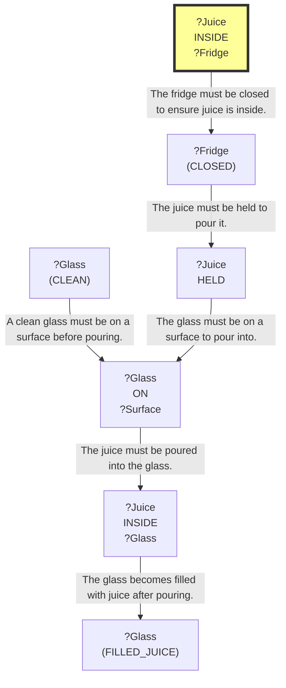
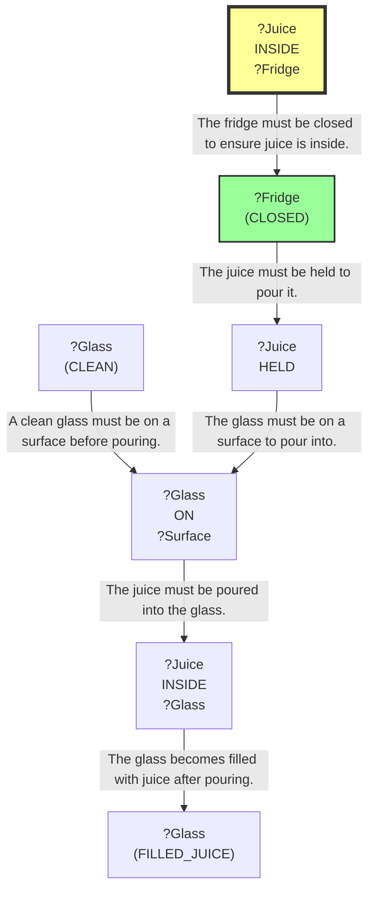
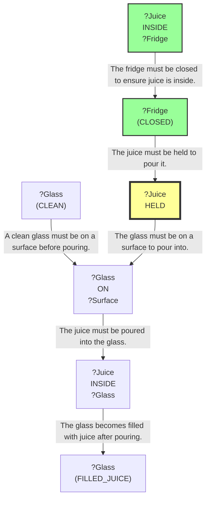
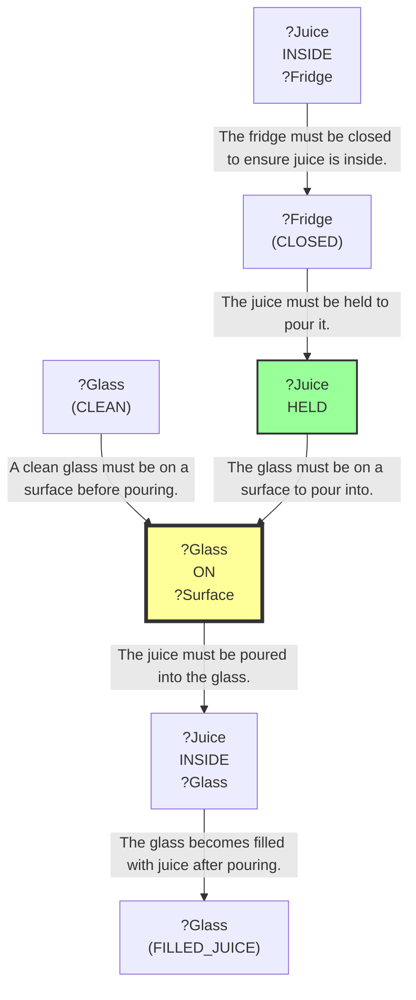
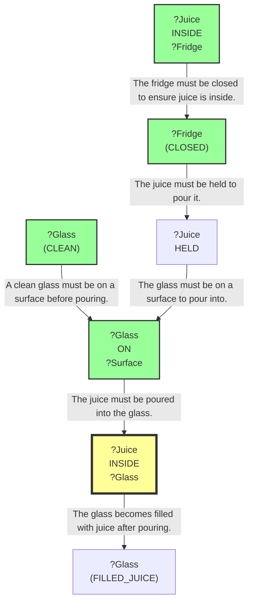

# 🚀 VirtualHome Agent Episode Log


### [GoalReasoner (Module A - Intent)] Output
```json
{
  "is_instruction_obviously_vague": false,
  "clarification_question": null,
  "target_object": "juice",
  "location_hint": "fridge",
  "reasoning_chain": [
    {
      "question": "Why does the user want this object?",
      "answer": "The user wants to obtain juice from the fridge."
    },
    {
      "question": "Why is that important?",
      "answer": "The user likely wants to consume juice for hydration or refreshment."
    },
    {
      "question": "What fundamental need does this fulfill?",
      "answer": "The user wants to satisfy their thirst or desire for a refreshing drink."
    },
    {
      "question": "Are there any deeper psychological or physical motivations?",
      "answer": "The user may be seeking a quick and convenient way to hydrate or enjoy a flavored beverage."
    }
  ],
  "deep_intent": "The user wants to hydrate or refresh themselves with a flavored beverage.",
  "acceptable_alternatives_properties": [
    {
      "priority": 1,
      "description": "Other liquid beverages such as water, soda, or tea that can be poured into a clean glass."
    },
    {
      "priority": 2,
      "description": "Non-juice drinks that provide hydration, such as sports drinks or flavored waters."
    },
    {
      "priority": 3,
      "description": "Any liquid that can be consumed in a glass, such as milk or juice alternatives."
    },
    {
      "priority": 4,
      "description": "Solid food items that can be consumed for hydration, such as fruits or electrolyte-rich snacks."
    }
  ]
}
```

### [PerceptionFilter] Output
```json
{
  "reasoning": "The goal is to obtain juice from the fridge, which requires the juice itself, the fridge to access it, and a glass to hold the juice. The SDG specifies that the glass must be clean, on a surface, and filled with juice. Therefore, the necessary object classes are juice (target object), fridge (location and container), and waterglass (to hold the juice).",
  "selected_classes": [
    "character",
    "milk",
    "fridge",
    "waterglass",
    "juice"
  ],
  "raw_class_count": 50
}
```

### [LLMExecutor] Output
```json
{
  "reasoning": "The juice (173) is inside the fridge (162), which is currently open. To satisfy the SDG node N2, we need to ensure the juice is inside the fridge. However, since the fridge is already open, we need to grab the juice and then pour it into a clean glass. The first step is to walk to the juice to grab it.",
  "satisfied_nodes": [],
  "current_node_focus": "N2",
  "mapped_variables": {
    "?Juice": "juice(173)",
    "?Fridge": "fridge(162)"
  },
  "action": "[walk] <juice> (173)"
}
```

### [RoboStateMultiTaskController] Output
```json
{
  "action": "[walk] <juice> (173)",
  "active_task_id": "task_1",
  "task_context": {
    "active_task_id": "task_1",
    "pending_task_ids": [],
    "satisfied_task_ids": []
  },
  "source": "llm_executor"
}
```
## Step 0
- **Action**: `[walk] <juice> (173)`
- **Action Success**: `False`
- **Action Message**: {'0': {'message': 'ScriptExcutor 0: PROCESS WALK: Can not select object: juice. REASON: No interaction positions\nEXECUTION_GENERAL: Script is impossible to execute\n\n'}}
- **Active Task**: `task_1`
- **Decision Source**: `llm_executor`
- **Task Progress**: T4_qwen_M2_09=pending
- **SDG Status**:

- **Observed Items (19)**: waterglass(64) [CLEAN], waterglass(71) [DIRTY], waterglass(72) [DIRTY], waterglass(79), waterglass(80), waterglass(87), waterglass(88), waterglass(100), fridge(162) [OPEN], juice(174), milk(177) [CLOSED], character(1), juice(173) [COLD], milk(176) [CLOSED,COLD], kitchen(11)...


### [PerceptionFilter] Output
```json
{
  "reasoning": "Reused cached class selection.",
  "selected_classes": [
    "character",
    "milk",
    "fridge",
    "waterglass",
    "juice"
  ],
  "raw_class_count": 50
}
```

### [LLMExecutor] Output
```json
{
  "reasoning": "The previous attempt to [walk] <juice> (173) failed because the object 'juice(173)' is not directly accessible. However, the Filtered Graph shows that 'juice(174)' is inside the fridge(162), which is currently open. The goal requires obtaining juice from the fridge, so the next logical step is to walk to the fridge to access the juice. This action will satisfy the prerequisite of being near the fridge before attempting to interact with the juice.",
  "satisfied_nodes": [],
  "current_node_focus": "N2",
  "mapped_variables": {
    "?Fridge": "fridge(162)"
  },
  "action": "[walk] <fridge> (162)"
}
```

### [RoboStateMultiTaskController] Output
```json
{
  "action": "[walk] <fridge> (162)",
  "active_task_id": "task_1",
  "task_context": {
    "active_task_id": "task_1",
    "pending_task_ids": [],
    "satisfied_task_ids": []
  },
  "source": "llm_executor"
}
```
## Step 1
- **Action**: `[walk] <fridge> (162)`
- **Action Success**: `True`
- **Action Message**: {'0': {'message': 'Success'}}
- **Active Task**: `task_1`
- **Decision Source**: `llm_executor`
- **Task Progress**: T4_qwen_M2_09=pending
- **SDG Status**:

- **Observed Items (19)**: waterglass(64) [CLEAN], waterglass(71) [DIRTY], waterglass(72) [DIRTY], waterglass(79), waterglass(80), waterglass(87), waterglass(88), waterglass(100), fridge(162) [OPEN], juice(174), milk(177) [CLOSED], character(1), juice(173) [COLD], milk(176) [CLOSED,COLD], kitchen(11)...


### [PerceptionFilter] Output
```json
{
  "reasoning": "Reused cached class selection.",
  "selected_classes": [
    "character",
    "milk",
    "fridge",
    "waterglass",
    "juice"
  ],
  "raw_class_count": 50
}
```

### [LLMExecutor] Output
```json
{
  "reasoning": "The current Filtered Graph shows that the juice (173) is inside the fridge (162), which is currently open. However, the fridge is closed by the character (1), so we need to first open the fridge to access the juice. The next logical step is to open the fridge to retrieve the juice.",
  "satisfied_nodes": [],
  "current_node_focus": "N2",
  "mapped_variables": {
    "?Fridge": "fridge(162)"
  },
  "action": "[open] <fridge> (162)"
}
```

### [RoboStateMultiTaskController] Output
```json
{
  "action": "[open] <fridge> (162)",
  "active_task_id": "task_1",
  "task_context": {
    "active_task_id": "task_1",
    "pending_task_ids": [],
    "satisfied_task_ids": []
  },
  "source": "llm_executor"
}
```
## Step 2
- **Action**: `[open] <fridge> (162)`
- **Action Success**: `True`
- **Action Message**: {'0': {'message': 'Success'}}
- **Active Task**: `task_1`
- **Decision Source**: `llm_executor`
- **Task Progress**: T4_qwen_M2_09=pending
- **SDG Status**:

- **Observed Items (19)**: waterglass(64) [CLEAN], waterglass(71) [DIRTY], waterglass(72) [DIRTY], waterglass(79), waterglass(80), waterglass(87), waterglass(88), waterglass(100), fridge(162) [OPEN], juice(174), milk(177) [CLOSED], character(1), juice(173) [COLD], milk(176) [CLOSED,COLD], kitchen(11)...


### [PerceptionFilter] Output
```json
{
  "reasoning": "Reused cached class selection.",
  "selected_classes": [
    "character",
    "milk",
    "fridge",
    "waterglass",
    "juice"
  ],
  "raw_class_count": 50
}
```

### [LLMExecutor] Output
```json
{
  "reasoning": "The current goal is to obtain juice from the fridge and pour it into a clean glass. The fridge is already open, and the juice (174) is inside the fridge. However, the robot is not holding the juice yet. The next step is to grab the juice from the fridge. Since the robot is already near the fridge, it can now grab the juice.",
  "satisfied_nodes": [
    "N3"
  ],
  "current_node_focus": "N2",
  "mapped_variables": {
    "?Juice": "juice(174)"
  },
  "action": "[grab] <juice> (174)"
}
```

### [RoboStateMultiTaskController] Output
```json
{
  "action": "[walk] <juice> (174)",
  "active_task_id": "task_1",
  "task_context": {
    "active_task_id": "task_1",
    "pending_task_ids": [],
    "satisfied_task_ids": []
  },
  "source": "llm_executor_repaired"
}
```
## Step 3
- **Action**: `[walk] <juice> (174)`
- **Action Success**: `True`
- **Action Message**: {'0': {'message': 'Success'}}
- **Active Task**: `task_1`
- **Decision Source**: `llm_executor_repaired`
- **Task Progress**: T4_qwen_M2_09=pending
- **SDG Status**:

- **Observed Items (19)**: waterglass(64) [CLEAN], waterglass(71) [DIRTY], waterglass(72) [DIRTY], waterglass(79), waterglass(80), waterglass(87), waterglass(88), waterglass(100), fridge(162) [OPEN], juice(174), milk(177) [CLOSED], character(1), juice(173) [COLD], milk(176) [CLOSED,COLD], kitchen(11)...


### [PerceptionFilter] Output
```json
{
  "reasoning": "Reused cached class selection.",
  "selected_classes": [
    "character",
    "milk",
    "fridge",
    "waterglass",
    "juice"
  ],
  "raw_class_count": 50
}
```

### [LLMExecutor] Output
```json
{
  "reasoning": "The current focus is on satisfying node N4, which requires the juice to be held. The juice (174) is inside the kitchen but not yet grabbed. Since the robot is already near the juice (from the previous successful [walk] <juice> (174) action), the next logical step is to [grab] the juice to satisfy the 'HELD' state required for node N4.",
  "satisfied_nodes": [
    "N2",
    "N3"
  ],
  "current_node_focus": "N4",
  "mapped_variables": {
    "?Juice": "juice(174)"
  },
  "action": "[grab] <juice> (174)"
}
```

### [RoboStateMultiTaskController] Output
```json
{
  "action": "[grab] <juice> (174)",
  "active_task_id": "task_1",
  "task_context": {
    "active_task_id": "task_1",
    "pending_task_ids": [],
    "satisfied_task_ids": []
  },
  "source": "llm_executor"
}
```
## Step 4
- **Action**: `[grab] <juice> (174)`
- **Action Success**: `True`
- **Action Message**: {'0': {'message': 'Success'}}
- **Active Task**: `task_1`
- **Decision Source**: `llm_executor`
- **Task Progress**: T4_qwen_M2_09=pending
- **SDG Status**:

- **Observed Items (19)**: waterglass(64) [CLEAN], waterglass(71) [DIRTY], waterglass(72) [DIRTY], waterglass(79), waterglass(80), waterglass(87), waterglass(88), waterglass(100), fridge(162) [OPEN], juice(174), milk(177) [CLOSED], character(1), juice(173) [COLD], milk(176) [CLOSED,COLD], kitchen(11)...


### [PerceptionFilter] Output
```json
{
  "reasoning": "Reused cached class selection.",
  "selected_classes": [
    "character",
    "milk",
    "fridge",
    "waterglass",
    "juice"
  ],
  "raw_class_count": 50
}
```

### [LLMExecutor] Output
```json
{
  "reasoning": "The current focus is on satisfying node N4, which requires the juice to be held. The juice(174) is already being held by the robot (as indicated by the 'HOLDS_RH juice(174)' relation in the Filtered Graph). The next step is to satisfy node N5, which requires the glass to be on a surface. The clean glass (waterglass(64)) is available in the kitchen and is currently closed, so we need to walk to it first to ensure it is on a surface.",
  "satisfied_nodes": [
    "N2",
    "N3"
  ],
  "current_node_focus": "N4",
  "mapped_variables": {
    "?Glass": "waterglass(64)"
  },
  "action": "[walk] <waterglass> (64)"
}
```

### [RoboStateMultiTaskController] Output
```json
{
  "action": "[walk] <waterglass> (64)",
  "active_task_id": "task_1",
  "task_context": {
    "active_task_id": "task_1",
    "pending_task_ids": [],
    "satisfied_task_ids": []
  },
  "source": "llm_executor"
}
```
## Step 5
- **Action**: `[walk] <waterglass> (64)`
- **Action Success**: `True`
- **Action Message**: {'0': {'message': 'Success'}}
- **Active Task**: `task_1`
- **Decision Source**: `llm_executor`
- **Task Progress**: T4_qwen_M2_09=pending
- **SDG Status**:

- **Observed Items (19)**: waterglass(64) [CLEAN], waterglass(71) [DIRTY], waterglass(72) [DIRTY], waterglass(79), waterglass(80), waterglass(87), waterglass(88), waterglass(100), fridge(162) [OPEN], juice(174), milk(177) [CLOSED], character(1), juice(173) [COLD], milk(176) [CLOSED,COLD], kitchen(11)...


### [PerceptionFilter] Output
```json
{
  "reasoning": "Reused cached class selection.",
  "selected_classes": [
    "character",
    "milk",
    "fridge",
    "waterglass",
    "juice"
  ],
  "raw_class_count": 50
}
```

### [LLMExecutor] Output
```json
{
  "reasoning": "The current focus is on satisfying node N4, which requires the juice to be held. The robot is already holding the juice (juice(174)) as indicated by the state 'HOLDS_RH juice(174)' in the Filtered Graph. The next step is to satisfy node N5, which requires the glass to be on a surface. The robot is currently near the waterglass(64), which is clean and can be used as the target glass. The next action should be to place the glass on a surface, which is already satisfied by the glass being inside the kitchen (a flat surface). However, to ensure the glass is on a surface, the robot should explicitly place it on a surface like the kitchen counter. Therefore, the next action is to [putback] the glass on the kitchen surface.",
  "satisfied_nodes": [
    "N1",
    "N3",
    "N5"
  ],
  "current_node_focus": "N4",
  "mapped_variables": {
    "?Glass": "waterglass(64)"
  },
  "action": "[putback] <waterglass> (64) <surface> (11)"
}
```

### [RoboStateMultiTaskController] Output
```json
{
  "action": "[walk] <livingroom> (183)",
  "active_task_id": null,
  "task_context": {
    "active_task_id": null,
    "pending_task_ids": [
      "task_1"
    ],
    "satisfied_task_ids": []
  },
  "source": "loop_recovery_room_revisit"
}
```
## Step 6
- **Action**: `[walk] <livingroom> (183)`
- **Action Success**: `True`
- **Action Message**: {'0': {'message': 'Success'}}
- **Decision Source**: `loop_recovery_room_revisit`
- **Task Progress**: T4_qwen_M2_09=pending
- **SDG Status**:
No SDG active.
- **Observed Items (159)**: wall(12), wall(13), wall(14), wall(15), wall(16), wall(17), wall(18), wall(19), wall(20), wall(21), floor(22), floor(23), floor(24), floor(25), floor(26)...


### [PerceptionFilter] Output
```json
{
  "reasoning": "The goal is to obtain juice from the fridge, which requires accessing the juice (target object), the fridge (location), and a container to hold the juice (glass). The SDG specifies the need for a clean glass, a filled glass with juice, and the juice being inside the fridge. Additionally, the SDG implies the need for a surface to place the glass. The waterglass is the exact class needed for holding the juice, and the fridge is explicitly mentioned as the location. The SDG also requires the glass to be on a surface, which is implied by the presence of the kitchencounter or kitchentable, but since the SDG does not explicitly mention a surface, we only include the directly required classes.",
  "selected_classes": [
    "character",
    "milk",
    "fridge",
    "waterglass",
    "juice"
  ],
  "raw_class_count": 59
}
```

### [LLMExecutor] Output
```json
{
  "reasoning": "The current focus is on satisfying node N4, which requires the juice to be held. The juice(174) is already being held in the right hand (HOLDS_RH), so this node is already satisfied. The next step is to satisfy node N5, which requires the glass to be on a surface. The waterglass(64) is a clean glass and is currently inside the kitchen(11). The robot must walk to the waterglass(64) to ensure it is on a surface, which is necessary before pouring the juice into it.",
  "satisfied_nodes": [
    "N4"
  ],
  "current_node_focus": "N5",
  "mapped_variables": {
    "?Glass": "waterglass(64)"
  },
  "action": "[walk] <waterglass> (64)"
}
```

### [RoboStateMultiTaskController] Output
```json
{
  "action": "[walk] <waterglass> (64)",
  "active_task_id": "task_1",
  "task_context": {
    "active_task_id": "task_1",
    "pending_task_ids": [],
    "satisfied_task_ids": []
  },
  "source": "llm_executor"
}
```
## Step 7
- **Action**: `[walk] <waterglass> (64)`
- **Action Success**: `True`
- **Action Message**: {'0': {'message': 'Success'}}
- **Active Task**: `task_1`
- **Decision Source**: `llm_executor`
- **Task Progress**: T4_qwen_M2_09=pending
- **SDG Status**:

- **Observed Items (19)**: waterglass(64) [CLEAN], waterglass(71) [DIRTY], waterglass(72) [DIRTY], waterglass(79), waterglass(80), waterglass(87), waterglass(88), waterglass(100), fridge(162) [OPEN], juice(174), milk(177) [CLOSED], character(1), juice(173) [COLD], milk(176) [CLOSED,COLD], kitchen(11)...


### [PerceptionFilter] Output
```json
{
  "reasoning": "Reused cached class selection.",
  "selected_classes": [
    "character",
    "milk",
    "fridge",
    "waterglass",
    "juice"
  ],
  "raw_class_count": 59
}
```

### [LLMExecutor] Output
```json
{
  "reasoning": "The current focus is on satisfying node N4, which requires the juice to be held. The juice(174) is already being held by the robot (as indicated by the 'HOLDS_RH juice(174)' relation in the Filtered Graph). The next step is to satisfy node N5, which requires the glass to be on a surface. The waterglass(64) is already on a surface (as indicated by the 'ON' relation with the surface 'kitchen(11)'). The next logical step is to pour the juice into the glass, which corresponds to node N6. Therefore, the next action is to perform the [pour] action.",
  "satisfied_nodes": [
    "N1",
    "N2",
    "N3",
    "N5"
  ],
  "current_node_focus": "N6",
  "mapped_variables": {
    "?Glass": "waterglass(64)"
  },
  "action": "[pour] <juice> (174) <waterglass> (64)"
}
```

### [RoboStateMultiTaskController] Output
```json
{
  "action": "[pour] <juice> (174) <waterglass> (64)",
  "active_task_id": "task_1",
  "task_context": {
    "active_task_id": "task_1",
    "pending_task_ids": [],
    "satisfied_task_ids": []
  },
  "source": "llm_executor"
}
```
## Step 8
- **Action**: `[pour] <juice> (174) <waterglass> (64)`
- **Action Success**: `True`
- **Action Message**: Poured into container successfully.
- **Active Task**: `task_1`
- **Decision Source**: `llm_executor`
- **Task Progress**: T4_qwen_M2_09=done
- **SDG Status**:

- **Observed Items (19)**: waterglass(64) [CLEAN], waterglass(71) [DIRTY], waterglass(72) [DIRTY], waterglass(79), waterglass(80), waterglass(87), waterglass(88), waterglass(100), fridge(162) [OPEN], juice(174), milk(177) [CLOSED], character(1), juice(173) [COLD], milk(176) [CLOSED,COLD], kitchen(11)...

